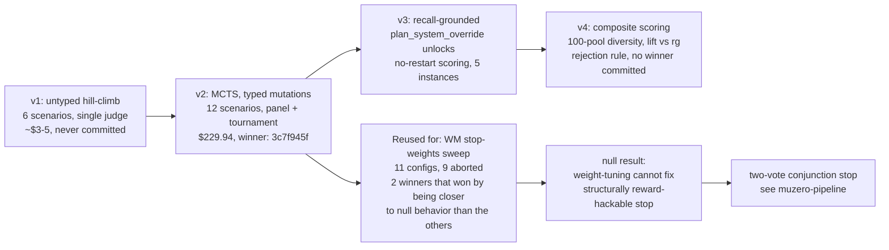

> tl;dr: Autoresearch is MCTS over planner prompts; the runtime is MCTS
> over tool calls. Same algorithm, different domains, no shared state.
> Four generations: v1 (a hill-climb that never shipped), v2 (the
> winner — commit `3c7f945f`, 13.50/14, $229.94), v3 (recall-grounded
> via `plan_system_override`), v4 (composite scoring + diversity pool +
> ripgrep-lift rejection). Then the same machinery got pointed at WM
> composite-stop weights — 11 configs, 9 aborted, 2 winners that
> won by being closer to the null behavior than the others.
> Autoresearch over high-dimensional discrete spaces (prompts) finds
> real wins. Autoresearch over low-dimensional continuous parameters
> when the failure is reward-hack-by-construction is the wrong shape:
> the planner is an adversary against any continuous stop signal, and
> tuning weights cannot fix that. Conjunction stop (see
> [two-vote-stop, now part of muzero-pipeline](/essays/muzero-pipeline/))
> is the structural fix.

## 1. What autoresearch is

Autoresearch is meta-MCTS over planner prompts. Every node in the
search tree is a candidate `PLAN_SYSTEM` body for the perseus planner.
Every edge is a typed mutation: an Opus optimizer is asked to apply
one named transformation (`add_counterexample`,
`decision_tree_explicit`, `clarify_jargon`, …) to the parent prompt.
Every leaf is scored against a probe corpus. The score is
backpropagated up the tree via UCB1, the next iteration selects new
leaves to expand, and the loop continues for some fixed budget of
rounds.

The winner — the prompt at the highest-scoring leaf at the end of the
budget — gets committed as the new `PLAN_SYSTEM_BUILTIN` in
`src/search/engine/llm_tree/planner/prompt.rs` and ships with the
next perseus release. That commit is the only point of contact
between autoresearch and the runtime; everything else is offline.

There are two MCTS trees living in this repo. They share an algorithm
and nothing else:

| | autoresearch (MCTS-over-prompts) | runtime (MCTS-in-runtime) |
|---|---|---|
| Code path | `scripts/prompt_autoresearch_v{2,3,4}.py` | `src/search/engine/llm_tree/runtime/` |
| Node | a candidate `PLAN_SYSTEM` body | a `(tool, args)` invocation |
| Action | typed prompt-edit mutation | planner-emitted `ToolOption` |
| Value | composite (recall / overlap / lift / mrr / compactness) | tool-evidence value + WM-blend |
| UCB-C | **1.2** (hardcoded) | **2.2** (`PERSEUS_LLM_TREE_UCB_C`) |
| Tree lifetime | hours (JSON-persisted across rounds) | seconds (in-memory per query) |
| Process | offline Python | embedded Rust in `perseus serve` |
| Persistence | `artifacts/prompt-autoresearch-v*/` | `mcts_step_snapshots` Postgres table |

The two UCB-C values matter: the prompt tree explores conservatively
(C=1.2) because each evaluation is expensive in dollars; the runtime
tree explores aggressively (C=2.2) because each evaluation is cheap
in tokens but the priors are noisy hand-given hints. Confusing the
two costs hours. They both produce trees, both backprop, both emit
node IDs and scores. They are not the same tree.

This essay covers both the four-generation prompt evolution and the
parallel null-result branch: the WM stop-weights sweep that pointed
the same autoresearch machinery at a structurally reward-hackable
target and discovered exactly what you'd expect.

## 2. v1 (early April): the hill-climb that never shipped

**File**: `scripts/prompt_autoresearch.py` (942 lines, commit
`2a00bc05`, 2026-04-23).
**Status**: superseded by v2 the same day.

v1 was a flat optimizer loop, not yet MCTS. Each round did five things:

1. Extract the current `PLAN_SYSTEM` body from the Rust source via regex.
2. Run the prompt against 6 hand-crafted scenarios using Haiku 4.5 as
   the subject model.
3. Score each subject output with Opus 4.7 as a single judge against
   a 6-axis rubric (max 11 per scenario, 66 total).
4. Ask Opus to optimize: given the round's scores + judge feedback,
   produce a revised prompt body delimited by `<PROMPT_START>` /
   `<PROMPT_END>`.
5. Re-evaluate; keep best-scoring candidate.

No tree. No UCB. No concurrency. Just a `history: list[tuple[prompt,
summary, dir]]` and a `best_idx` cursor pointing at whichever round
scored highest. "Action" was an untyped mutation prompt to the Opus
optimizer ("improve it based on these scenario failures"). "Value"
was the sum of the 6-axis judge scores across all 6 scenarios.

The probe corpus was six hand-written planner fixtures: `fresh_query`,
`concrete_hit`, `stem_dead_end`, `global_covered`, `budget_tight`,
`depth_near_cap`. Each carried an `expected` text that the judge saw
but the subject did not.

Per-scenario rubric:

```
- json_valid              (0/1)
- schema_correct          (0/1)
- status_correct          (0/1)
- options_grounded        (0-3)
- rationale_quality       (0-3)
- confidence_reasonable   (0-2)
```

Max 11 per scenario, 66 across 6 scenarios.

### What killed v1

Four pathologies, all fixed by v2 the same day:

1. **Single judge.** High variance per scenario.
2. **No tree.** v1 only chases the best candidate of the *last* round;
   older nodes are never revisited even if their mutation chain looked
   promising.
3. **Untyped mutations.** "Improve it" is not a search action.
4. **No concurrency.** Pure serial loop.

There is a fifth defect that v2 also kept: the candidate text never
enters a running perseus. The Opus judge grades Haiku's parse of the
prompt, not real planner outcomes. v3 fixes that.

v1 was never run for more than a single 3-round live evaluation (the
`prompt_autoresearch.md` cost guard capped spend at `~$3-5`). It was
the throwaway prototype that proved the optimizer-loop pattern worked
end-to-end. It never produced a winner that got committed.

## 3. v2 (mid April): the winner

**File**: `scripts/prompt_autoresearch_v2.py` (1997 lines, commit
`0c808b14`, 2026-04-23).
**Production run**: `artifacts/prompt-autoresearch-v2/run-20260423T063052Z/`.
**Winner**: commit `3c7f945f`, node `n07-0109`, baseline `11.83/14` →
best `13.50/14`. 12,559-char prompt.

v2 is the first true MCTS-over-prompts. Each round:

1. **Selection.** Pick K=5 leaves via UCB1.
2. **Expansion.** Per leaf, sample M=4 distinct mutation actions from
   a 12-entry catalogue. Each mutation calls the Opus optimizer
   concurrently, producing a new child node.
3. **Evaluation.** Subject (Haiku) + single-judge (Opus) on every
   `(candidate, scenario)` pair. Flattened submission so worker slots
   never hold aggregating wrappers (a deadlock bug — see below).
4. **Critique.** One Opus critic call per candidate, concurrent.
5. **Tournament.** Top-N=8 candidates by mean score participate in an
   all-pairs arbiter tournament (Bradley-Terry-lite:
   `strength = wins / played`).
6. **Backprop.** Sample's `mean_total` flows up to every ancestor.
7. **Meta-optimization.** An Opus meta-call analyses the last 3 rounds'
   per-action stats; produces `top_mutations`,
   `under_performing_scenarios`, `next_directions` injected into the
   next round's optimizer prompts.

### UCB1 over prompts

The selection formula is plain UCB1, parameterized at C=1.2:

$$
\text{UCB1}(n) = \mu_n + C \sqrt{\frac{\ln(N_{\text{parent}} + 1)}{n_n}}
$$

where $\mu_n$ is the mean score at node $n$, $n_n$ is the visit count,
and unvisited nodes get $+\infty$. C=1.2 is hardcoded; this is the
**autoresearch** UCB-C, not the runtime UCB-C which was 0.9 → 1.5 →
2.2 over the same week. The two never need to agree.

### The 12-entry mutation catalogue

```
add_rule              remove_redundant      tighten_schema
add_counterexample    reorder               clarify_jargon
shorten_aggressive    lengthen_critical     meta_insight_injection
adversarial           few_shot_swap         decision_tree_explicit
```

Each is a string injected into the Opus optimizer's user message
under `ACTION INSTRUCTION:`. The mutation catalogue is the search
action space — typed, named, traceable. "Why did this branch win" is
answerable by walking the mutation chain.

### 12-scenario probe corpus

v1's 6 scenarios + 6 new edge cases:

| name | what it stresses |
|---|---|
| `ambiguous_query` | "fix the thing" — must low-confidence |
| `contradictory_evidence` | two snippets disagree — must NOT stop |
| `circular_coverage` | same file opened 3× — must pivot |
| `noise_flooded_context` | `branch_observations` is irrelevant logs |
| `very_late_budget` | `remaining_steps=1` |
| `fresh_query_with_prior_failures` | new stem, siblings had `too_broad` |

9-axis rubric (max 14 per scenario, 168 total):

```
json_valid           (0/1)
schema_correct       (0/1)
status_correct       (0/1)
options_grounded     (0-3)
rationale_quality    (0-3)
confidence_reasonable (0-2)
redundancy_penalty   (0/1)
schema_rigor         (0/1)
recovery_quality     (0/1)
```

`mean_total` across the 12 valid scenarios is what backprops. Invalid
scenarios (judge failed to parse) are **excluded from the mean** — the
critical fix after an earlier run (`run-20260422T202002Z`) silently
produced a bogus 0.00/14 baseline because temperature-deprecated calls
were being logged as zero scores.

### Three pathologies fixed inside v2

**Subject deadlock.** Submitting candidate-wrappers AND scenario
sub-tasks to the same `ThreadPoolExecutor(max_workers=10)` filled all
worker slots with wrappers and starved the inner calls. Fix:
`evaluate_candidates_flat` submits `(node, scenario)` pairs as leaf
tasks; the executor never holds an aggregating wrapper.

**Opus 4.7 temperature rejection.** 4.7 deprecated the `temperature`
and `top_p` parameters. `build_payload` strips them for Opus models;
`FatalPayloadError` is raised on any HTTP 400 that mentions
"deprecated" so the whole run aborts loudly rather than silently
logging zeros.

**Judge invalidation.** When the judge fails to parse, the scenario
is marked `valid=False` and excluded from the mean. Otherwise a single
judge failure contaminates the candidate's score.

### Cost ledger (v2)

| Run | Spend | Notes |
|---|---|---|
| `run-20260423T061338Z` | ~smoke | 3-round dry-run |
| **`run-20260423T063052Z`** | **$229.94** | 9-of-10 rounds, 4,528 API calls, 165 prompt nodes, baseline 11.83 → best 13.50. **Winner committed in `3c7f945f`.** |
| `run-20260423T074606Z` | unknown | later run, not committed |

Score trajectory per round:

```
R0=11.83  R1=12.50  R2=12.83  R3=12.83  R4=13.17
R5=13.42  R6=13.42  R7=13.50  R8=13.42  R9=13.42
```

Peaked at round 7 (`n07-0109`); rounds 8–9 regressed slightly. Mutation
chain to the winner: `(root) > add_counterexample >
decision_tree_explicit > clarify_jargon > clarify_jargon > few_shot_swap
> reorder`. The chain is preserved verbatim in
`parking_lot/v2_archive_2026-05-18/autoresearch_v2_winner.txt`.

Top mutations by rounds-won across the live run: `adversarial` (2
wins, avg 12.78), `decision_tree_explicit` (1, 13.03), `clarify_jargon`
(1, 12.99), `add_counterexample` (1, 12.89), `meta_insight_injection`
(1, 12.79).

### What the v2 winner added over baseline

Per the commit message:

- **GLOSSARY** defining `stem`, `evidence_packet`, `global_digest`,
  `too_broad`, `stem-cold`, `concrete-evidence`, `named-candidate`,
  `circular-coverage`, `budget`, `confidence` with operational
  definitions.
- **DECISION TREE** (sections A–E) walked top-to-bottom: too_broad →
  narrow, stem-cold → give_up, circular coverage → stop,
  concrete-evidence branches, budget triage, output invariants.
- **7 worked examples** each tagged with the decision-tree rule they
  demonstrate (e.g. `[C.4 exploratory]`, `[A.2 stem dead-end]`).
- **7 anti-patterns BAD1–BAD7** with `Why wrong` cited to specific
  rules.

Opus-subject re-scoring later validated the prompt at 13.75–13.92. The
v2 winner survived 17 subsequent edits through 2026-05-01; it was the
production `PLAN_SYSTEM_BUILTIN` until the V1 reset.

### What v2 still got wrong

The candidate prompt text never enters a running perseus. The Opus
judge grades a Haiku-subject's parse of the prompt; v2's gain
"11.83 → 13.50" measures **Opus's preference for the prompt, not
real planner outcome**. A prompt that scores 14/14 in v2 might not
improve real retrieval at all. That's the defect that motivates v3.

## 4. v3 (late April): retrieval-grounded recall

**File**: `scripts/prompt_autoresearch_v3.py` (1448 lines, commit
`e11dd257`, 2026-04-24).
**Companion harness**: `scripts/planner_recall_eval.py` (745 lines).

v3 preserves v2's MCTS-over-prompts shape (UCB1 at C=1.2, the typed
mutation catalogue, the optimizer / critic structure). The radical
change is the **value function**: the Opus judge is gone. Each
candidate is scored by running real `/v1/query` calls against the
multi-bench `fix_patch` gold set and measuring `recall@k`,
`recall_files`, `mrr`.

### v3.1: per-request `plan_system_override`

The first thing v3 needed was a way to install a candidate prompt
without restarting perseus. Phase 1 of v3 (initial) used the old
restart-per-candidate path:

1. SCP candidate to `engram:/tmp/plan_system_candidate.txt`.
2. `pkill -x perseus` on engram (matches basename only — *not*
   `pkill -f 'perseus serve'`, because the ssh remote shell's own
   argv would match the pattern and self-kill).
3. SSH-launch `perseus serve` with
   `PERSEUS_PLAN_SYSTEM_OVERRIDE_FILE=/tmp/plan_system_candidate.txt`.
4. Wait for `/v1/health`. Run `planner_recall_eval.py`.

The bottleneck: every cold-start re-ran the perseus semantic index
from scratch. Azure embeddings stalled under burst, and every
autoresearch score came back **0**. Burning hours of Anthropic budget
on a search that couldn't distinguish any candidate from any other.

The fix was a runtime API change, landed in commit `b7017298`
(2026-04-24):

1. `QueryRequest.plan_system_override: Option<String>` on the request
   body. Threaded through to the planner's SYSTEM message for *this
   query only*.
2. `X-Plan-System-Override` HTTP header as a fallback when the body
   field is absent.
3. `PERSEUS_ALLOW_PLAN_OVERRIDE=1` server env-var gate. When unset,
   non-empty `plan_system_override` returns 403 — prevents
   prompt-injection in production.

Plumbing path:

```
handlers::query
  → App::query
  → SearchEngine::query_repo_with_overrides
  → llm_tree::run
  → runtime::run_query
  → planner::plan
  → prompt::plan_system_for_request
```

The resolver is three-layered:

1. If `plan_system_override` is non-empty AND
   `PERSEUS_ALLOW_PLAN_OVERRIDE=1`: use it for this call only.
2. Else if `PERSEUS_PLAN_SYSTEM_OVERRIDE_FILE` was set at startup: use
   the once-memoized file body (resolved in `plan_system()` at first
   planner call via `OnceLock<String>`).
3. Else: use `PLAN_SYSTEM_BUILTIN`.

A single running perseus can now serve N candidate prompts
concurrently *without restart*. Cost saved per candidate: 200–300s of
cold-start + index warm-up. Across an 8-round × 12-candidate run,
that's roughly 5 hours.

### v3 probe corpus

`planner_recall_eval.py` selects N instances (default 5) from the
multi-bench dataset. Auto-selection criteria:

```python
AUTO_MAX_GOLD_FILES   = 3
AUTO_MIN_PATCH_BYTES  = 2_000
AUTO_MAX_PATCH_BYTES  = 8_000
```

For each instance:

1. Parse `fix_patch` via `^diff --git a/(.+?) b/(.+)$` to extract gold
   file paths.
2. POST `/v1/index` for the instance's pre-checked-out repo; poll
   `/v1/index/status` until `indexed`.
3. Build seed query = `title + first 150 chars of body`, sanitized.
4. POST `/v1/query` with
   `{index_id, query, top_k, plan_system_override}`.
5. Compute `recall_at_k` (1 if any gold-file hit in top-K, else 0),
   `recall_files` (fraction of gold files hit), `mrr` (`1/rank` of
   first gold-file hit, 0 if none).

Recall@k as a formula:

$$
\text{recall@}k(q) = \mathbb{1}\left[\bigcup_{i=1}^{k} \{\text{file}(h_i)\} \cap G(q) \neq \emptyset\right]
$$

where $G(q)$ is the gold-file set for query $q$ and $h_i$ is the
$i$-th hit. Aggregate mean across instances.

### v3 scoring

```
score = mean_recall_at_k + 0.1 * mean_mrr + compactness_bonus
compactness_bonus = max(0, 1 - len(prompt)/8000) * 0.15
```

`runs_per_candidate = 3` (default), averaged.

### Three seeds

v3 always seeds three roots:

- `seed-baseline` — current `PLAN_SYSTEM_BUILTIN` (regex-extracted).
- `seed-minimal` — hand-written 20-line variant with the 17-tool
  catalogue.
- `seed-skeleton` — near-empty: JSON contract + tool name list only.

The optimizer has room to grow the skeleton from scratch if the
baseline is a local minimum.

### What v3 fixes

- **Opus-judge irrelevance.** v2's gain "11.83 → 13.50" measured
  Opus's preference, not real retrieval. v3 grounds the value
  function on `recall@10` against multi-bench gold.
- **Restart cold-start.** Per-request override path obsoletes restart
  entirely.
- **`pkill -f` self-kill.** Always `pkill -x perseus` — match basename
  only.

### What v3 still gets wrong

A prompt can hit the right **file** without hitting the right
**function**. `recall@10` rewards file-level matches; it gives no
signal on whether perseus landed at the line range the human fix
actually touched.

Worse: a prompt that emits `search_text` calls with the right
keywords will hit any file containing those keywords — exactly what
`rg --files-with-matches` does. Perseus has to **beat** plain grep to
add value. v3 can't see that bar.

## 5. v4 (May): composite scoring + ripgrep-lift

**File**: `scripts/prompt_autoresearch_v4.py` (1670 lines, commit
`b7017298`, 2026-04-24).
**Companion harness**: `scripts/planner_recall_eval_v2.py` (1175 lines).

v4 preserves v3's MCTS shape and per-request override installation.
Four structural changes:

1. **Snippet-level overlap** against `fix_patch` hunks, not just
   file-path match.
2. **Lift vs `rg --files-with-matches`** — perseus must beat plain
   grep, not just match it.
3. **Diversity-balanced 100-instance pool** replaces v3's 5-instance
   auto-select.
4. **Rejection rule**: if `mean_lift < -0.05`, the candidate is
   disqualified — UCB1 sees 0.0, not the raw composite.

A new seed `seed-v3-winner` loaded from
`artifacts/prompt-autoresearch-v3/latest/winner.txt` (with glob
fallback) lets v4 stand on v3's shoulders.

### The 100-instance pool

`build_instance_pool` in `planner_recall_eval_v2.py:307-371` builds a
deterministic diversity-balanced pool:

```
AUTO_MAX_GOLD_FILES    = 5     (widened from v3's 3)
AUTO_MIN_PATCH_BYTES   = 2_000
AUTO_MAX_PATCH_BYTES   = 15_000 (widened from v3's 8_000)
AUTO_DEFAULT_POOL_SIZE = 100
MAX_PER_FAMILY         = 15
```

The `MAX_PER_FAMILY = 15` cap is load-bearing. Tuned so 100 instances
span roughly 6–10 repo families. Without it, `zstd` (which has the
most multi-bench records) dominated the pool, and the autoresearch
loop optimized prompts that were good at zstd-shaped queries and
mediocre at everything else.

Pool persisted to `artifacts/autoresearch-instance-pool-v2.json`.
Schema per entry:

```json
{
  "instance_id": "facebook__zstd-3678",
  "repo_dir": "/home/engram/engram/src/eval/multi-bench-runs/repos/facebook__zstd-3678__gpt-5-codex__baseline",
  "repo_id": "facebook__zstd-3678",
  "gold_files": ["lib/compress/zstd_compress.c"],
  "gold_hunks_per_file": {
    "lib/compress/zstd_compress.c": [[1450, 12], [1502, 4]]
  },
  "family": "zstd",
  "patch_bytes": 4123
}
```

`gold_hunks_per_file` values are `[(old_start, old_len), ...]` on the
**OLD-side** (pre-fix) line numbers, because perseus indexes the
pre-fix repo checkout. Pure-addition hunks (`old_len == 0`) are
skipped — they contribute 0 gold lines.

### Snippet overlap computation

For each perseus hit matching a gold file:

1. Extract `(start_line, end_line)` from the hit.
2. If no line numbers: fall back to `approximate_snippet_span` —
   anchor the hit's snippet to a unique line in source, estimate end
   = anchor + snippet line count.
3. If still no span: 0 credit. The whole point is to punish
   mispositioned snippets.
4. Clamp `end - start ≤ 500`.
5. `covered = gold_lines ∩ range(start, end+1)`.
6. Aggregate:
   `snippet_overlap_fraction = total_covered_lines / total_gold_lines`.

### Lift computation

For each instance:

1. Run `rg --files-with-matches --no-ignore --hidden --max-count 1`
   on each of the top-3 keywords extracted from the seed query.
2. Keyword extraction: CamelCase first (`SessionCtx`,
   `ConnectionPool`), then snake/long tokens (`heartbeat`,
   `expire_at`), stoplist-filtered.
3. `rg_hit = 1` if any gold file appears in rg's path list.
4. `perseus_hit = recall_at_k`.
5. `lift = perseus_hit - rg_hit` in $\{-1, 0, +1\}$.

### v4 composite scoring

$$
\text{score} = 0.50 \cdot \overline{\text{overlap}} + 0.30 \cdot \overline{\text{lift}} + 0.10 \cdot \overline{\text{recall@}10} + 0.05 \cdot \overline{\text{mrr}} + 0.05 \cdot \text{compactness}
$$

In Python:

```python
score = (
    0.50 * mean_snippet_overlap    # dominant: tightest signal
    + 0.30 * mean_lift              # >0 means perseus > ripgrep
    + 0.10 * mean_recall_at_k       # backstop: any-file hit
    + 0.05 * mean_mrr               # rank matters downstream
    + 0.05 * compactness_bonus      # tie-break on prompt length
)
```

`compactness_bonus = max(0, 1 - len(prompt)/8000)` — in `[0, 1]`,
weighted by 0.05 so the maximum contribution is 0.05.

Weights are CLI-tunable via `--w-overlap`, `--w-lift`, `--w-recall`,
`--w-mrr`, `--w-compact`. Defaults sum to 1.0 (warning emitted if not).

### Rejection rule

```python
ok_runs = [r for r in runs if r["ok"]]
raw = mean([r["run_score"] for r in ok_runs])
avg_lift = mean([r["mean_lift"] for r in ok_runs])
rejected = avg_lift < reject_lift_below   # default -0.05
final_score = 0.0 if rejected else raw
```

The tree backpropagates `final_score`. `raw_score` is still recorded
for ranking + debug. A prompt that's slightly worse than grep on the
average instance still gets credit; a prompt that's >5% worse gets
disqualified. UCB1 sees 0.0, which is the same as an unexplored
branch — autoresearch never wastes another visit on a strictly-worse
prompt.

### Two new mutations

The catalogue is extended from 12 entries to 14:

```
snippet_precision_focus
  v4: downstream we measure snippet-level overlap with gold fix hunks,
  not just file match. Sharpen the rules around PRECISE snippet
  landing.

beat_ripgrep
  v4: perseus is measured against a ripgrep baseline on the same
  keywords. Add rules that actively route past raw text-grep: prefer
  hybrid_search / similar_files_embedding / symbol_lookup /
  callgraph_neighbors / references_lookup.
```

These two are direct codifications of the v4 scoring weights:
`snippet_precision_focus` → `mean_snippet_overlap`, `beat_ripgrep` →
`mean_lift`. The autoresearch loop is *self-referential* — the
mutation catalogue evolves with the scoring function.

### What v4 fixes

- **File-level recall is too loose.** Snippet-overlap
  (`0.50 * mean_snippet_overlap`) makes line-range precision visible.
- **Beats-grep test.** `mean_lift` forces the optimizer to discover
  paths past `search_text`.
- **Pool repo-family dominance.** `MAX_PER_FAMILY = 15` forces 6–10
  families.
- **Strictly-worse-than-grep prompts.** Under v3 these still got UCB1
  credit if `recall@10` was nonzero. The `mean_lift < -0.05`
  rejection rule prevents that.

### Cost

v4 spend was not documented as a single dollar figure like v2's
$229.94. Optimizer + critic Opus calls are similar in count to v3's;
the compute side is heavier: 100 instances × N runs × 3 candidates ×
8 rounds is roughly 24,000 perseus queries per full run. At ~30s per
query on warm indexes that's ~200 hours of perseus wall-clock,
parallelized via `--parallel 8` to ~25 hours.

`--cheap-smoke` caps Anthropic spend at &lt;$5 for a 2-round verification
(`max_calls = 20`, `runs_per_candidate = 1`, `eval_count = 10`).

### What v4 produced

No v4 winner has been committed. The v4 runs landed too close to the
2026-04-25 prompt-drift fixes (UCB-C 1.5 → 2.2, self-calibrated stop,
C.1/E.4/A.2 rewrites) for a clean A/B against the v2 winner. v2's
`n07-0109` remained in production as `PLAN_SYSTEM_BUILTIN` through the
end of the V2 era.

## 6. Four generations, side by side

| | v1 | v2 | v3 (post-refactor) | v4 |
|---|---|---|---|---|
| Lines | 942 | 1997 | 1448 | 1670 |
| Tree | none (history list) | UCB1 | UCB1 | UCB1 |
| UCB-C | n/a | 1.2 | 1.2 | 1.2 |
| Mutations | untyped | 12 typed | 12 typed | 14 typed |
| Seeds | 1 | 1 | 3 | 3–4 |
| K leaves/round | n/a | 5 | 3 | 3 |
| M cands/leaf | n/a | 4 | 4 | 4 |
| Runs/candidate | n/a | 1 | 3 | 3 |
| Probes | 6 hand-crafted | 12 hand-crafted | 5 multi-bench | 100-pool diversity-balanced |
| Subject | Haiku 4.5 | Haiku 4.5 | live perseus | live perseus |
| Value function | Opus rubric (66 max) | Opus rubric (14 × 12) | recall@k + 0.1·mrr + compact | 0.50·overlap + 0.30·lift + 0.10·recall + 0.05·mrr + 0.05·compact |
| Installation | n/a | n/a | per-request override | per-request override |
| Tournament | none | top-8 BT-lite | none | none |
| Meta-optimizer | none | yes (last 3 rounds) | none | none |
| Rejection rule | none | invalid excluded | none | `mean_lift < -0.05 → 0` |
| Cold-start hazard | n/a | n/a | fixed post-refactor | none |
| Cost (live run) | ~$3–5 | **$229.94** (winner) | not single-line | not single-line |
| Winner committed | none | **`3c7f945f`** | none | none |

The "winner committed" row is the operational truth. v2's `n07-0109`
ran in production until the reset. v3 and v4 produced winners but
neither got swapped into `PLAN_SYSTEM_BUILTIN`.



## 7. The stop-weights sweep (task #90, the parallel null result)

By mid-May the world-model composite-stop function (see
`HISTORY/31_mcts_research.md` §7 — six normalized signals weighted into
a scalar threshold) was generating its own tuning question. Six
weights, one threshold, eleven plausible configurations to compare.
And we had cato sitting idle at $0/marginal-cost.

Pointing autoresearch at this looked natural. Same UCB tree (in
principle), same Postgres-backed scoring loop, same per-config eval
on the multi-bench corpus. The whole machinery was sitting there.

### The six-signal composite

Lives in `runtime/mod.rs:588-688`. Replaces an earlier per-leaf WM
stop that was reward-hackable — a single-head `value_norm` gate would
fire on **initial seed state** because every fresh query has
`value_norm ≈ 0.78` just from seed candidates loaded into the
aggregator (HL-Gauss `(value - VMIN) / (VMAX - VMIN)` maps a
"typical bad state" of value $\approx$ -0.7 to 0.78). Forensic note
in session `61f74930`: "picked the cheapest WM signal that would fire
early and called it sub-5s. The thing was reward-hacking on initial
seed state."

The composite was the proposed fix:

| signal | default weight | env | meaning |
|---|---|---|---|
| `v_norm` | 1.0 | `PERSEUS_WM_STOP_W_VALUE` | WM value head via HL-Gauss bounds |
| `j_norm` | 1.0 | `PERSEUS_WM_STOP_W_JUDGE` | WM judge head, tanh-bounded |
| `r_norm` | 0.5 | `PERSEUS_WM_STOP_W_REWARD` | WM step_reward head |
| `lh_norm` | 1.5 | `PERSEUS_WM_STOP_W_LINE_HITS` | sigmoid01(line_bearing_hits / 2.0) |
| `pr_norm` | 1.0 | `PERSEUS_WM_STOP_W_PRIMARY` | aggregator top-path score / 5.0 |
| `st_norm` | 1.0 | `PERSEUS_WM_STOP_W_STEP` | sigmoid01((step - 4) / 2) |

The thinking was: no single signal is load-bearing, so no single
signal can be hacked. Weighted average crossing
`composite_threshold` (default 0.85) triggers stop. The seed-state
reward-hack is suppressed *softly*: at step=0 the step-progress
feature drags the composite down regardless of how high WM value is.

That's the theory. The sweep was an attempt to find which weight
combination actually behaves well in production.

### The sweep, by the numbers

`cato:/home/cato-user/perseus_sweeps_v6_20260517T174856/`. 12-knob
sweep over the six W_* weights plus `_COMPOSITE`, `_LINE_SCALE`,
`_PRIMARY_SCALE`, `_STEP_MID`, `_STEP_SOFT`. Each config probes ~1000
queries against ripgrep + perseus repos.

**11 configs.** **9 aborted.** Two finished:

| cfg | recall_mean | ok_rate | wall_median | wall_p95 | sweep_score | W_VALUE | W_JUDGE | W_LINE_HITS | W_PRIMARY | COMPOSITE |
|---|---|---|---|---|---|---|---|---|---|---|
| **cfg000** | 0.129 | 0.915 | 7.82s | 25.0s | **0.0561** | 2.0 | (default) | 3.0 | 1.0 | 0.7 |
| **cfg010** | 0.136 | 0.961 | 7.99s | 23.5s | 0.0547 | 1.5 | 1.0 | 0.0 | 0.0 | 0.65 |
| cfg003 | (aborted, 59 lines) | — | — | — | — | — | — | — | — | — |
| cfg008 | (aborted, 59 lines) | — | — | — | — | — | — | — | — | — |
| (7 others) | aborted on `sanity: TimeoutError` or `HTTP 500` early | — | — | — | — | — | — | — | — | — |

Artifacts:

- `summary.jsonl` — 11 lines, ~5.6KB
- `per_query_cfg000.jsonl` — 1000 lines, 453KB
- `per_query_cfg010.jsonl` — 1000 lines, 460KB
- `per_query_cfg003.jsonl` / `cfg008.jsonl` — partial 59 lines each

`sweep_score` is a composite over `(recall_mean, ok_rate, wall_p95)`
(intentionally not the same composite as the stop function — outer
metric for inner metric).

The two configs that finished did so by *not stopping the planner
prematurely*. cfg010 set `W_LINE_HITS=0` and `W_PRIMARY=0`, turning
off two of the six signals entirely; cfg000 set `W_LINE_HITS=3.0`
(the highest weight in the table), making line-hit evidence
overwhelmingly dominant.

Neither of these is "tuned." They are emergent deletions expressed as
parameter values. cfg010 deletes line-hits + primary; cfg000 deletes
everything except line-hits.

### The 9 aborts are the result

The 9 configs that aborted didn't crash because of bugs in perseus.
They crashed because their composite-stop weights let MCTS continue
past the planner's natural completion until the wall-clock budget
exploded — `sanity: TimeoutError`. Or they let MCTS terminate so
early that an HTTP 500 fired downstream from a degenerate retrieval
state.

In both directions, the failure mode is *the planner adversarially
gaming the continuous stop signal*. With composite weights tuned
toward "more confidence required to stop," the planner happily keeps
proposing options and the loop runs until it hits hardcoded sanity
caps. With weights tuned toward "less confidence required," the
planner stops on the seed state and downstream code can't recover.

This is exactly the reward-hack that the composite was supposed to
prevent. Spreading the gate across six signals didn't fix it — it
just gave the planner six surfaces to push against simultaneously.

The "winners," cfg000 and cfg010, are not winners in the autoresearch
sense. They are configs whose weight choices happened to be close
enough to "ignore most signals" that they didn't trigger either
failure mode. cfg010 with `W_JUDGE=1.0, W_LINE_HITS=0, W_PRIMARY=0,
COMPOSITE=0.65` is essentially "stop when WM value-head + judge-head
agree." That's a two-signal gate dressed up as a six-signal gate by
zeroing four of the weights.

## 8. The null result that mattered

Three things came out of the stop-weights sweep:

**One**, neither winning config has been promoted into `env.perseus`.
"Not yet promoted — that's the next ship decision" (`HISTORY/10` §B.2).
There's no good answer to which one to ship, because neither one is
better in a way that survives the question "what does this weight mean."

**Two**, the planner is an adversary against the stop function. This
is structural, not a calibration issue. The runtime planner is
trained (or prompted) to maximize information gain per step. Any
continuous stop signal $f(\text{state}) \in [0, 1]$ that depends on
planner-observable features (hit counts, line-hit counts, value-head
estimates of state quality) can be either undershot or overshot by
planner output. Tuning the weights changes *where* the cliff is, not
whether there's a cliff. The optimal planner behavior in the
neighborhood of the threshold is always to push exactly there.

**Three**, autoresearch over low-dimensional continuous parameters is
the wrong shape when the failure is reward-hack-by-construction. The
v1–v4 work succeeded because the search space — `PLAN_SYSTEM` text —
is **high-dimensional and discrete**, and the score function is
**ungameable by the candidate** (the candidate is a prompt; it doesn't
get to observe the scorer). The stop-weights sweep failed because the
search space — six weights in [0, ∞) — is **low-dimensional and
continuous**, and the score function is **adversarially gameable by
the planner** at every probe.

These are different optimization regimes. Autoresearch belongs in the
first. The stop-weights sweep belongs nowhere — the answer isn't
"better weights." The answer is "remove the cliff."

## 9. The structural fix: two-vote conjunction stop

The fix, sketched in [muzero-pipeline](/essays/muzero-pipeline/), is
to replace the continuous threshold with a discrete conjunction:

$$
\text{stop} \iff \text{planner emits status=stop} \;\wedge\; \text{adversarial critic confirms}
$$

Both votes must agree. The planner's vote is the natural completion
signal — it says "I'm done" when its prompt-encoded heuristics say the
stem has enough evidence. The critic's vote is a separate adversarial
LLM call with a different system message that actively looks for
missing evidence and counter-hypotheses.

The conjunction is structural in a way no continuous threshold can be:

- The planner cannot game both votes simultaneously because the
  critic is a separate model call with its own prompt and its own
  context.
- A weight sweep cannot reduce the gate to a single signal because
  both votes are binary, not weighted.
- The threshold has been removed; there is no continuous parameter to
  reward-hack.

This costs one extra LLM call per stop proposal, which is the price
of structural correctness. The composite-stop infrastructure remains
in the codebase (gated off by default since 2026-05-17:
`llm_tree_per_stem_confirm` defaults to `false`, `composite_threshold`
defaults to a value high enough that it almost never fires) as a
fallback, but production traffic should route through the
conjunction.

The two cfg000/cfg010 winners can stay where they are — in
`summary.jsonl` on cato, alongside the 9 aborted siblings. They're a
useful artifact: a recorded null result that documents *why* the
conjunction gate exists.

## 10. Lesson

**Autoresearch over high-dimensional discrete spaces (prompts) where
the search itself is the win.** v1 → v4 found a prompt that improved
real recall by surfacing a glossary, a decision tree, worked examples,
and anti-patterns — none of which would have been discovered by a
weight sweep over five scoring coefficients. The mutation catalogue
is the search space; the score function is the answer to "did this
help?"; UCB1 keeps the explore/exploit balance honest. Total spend
$229.94, gain 11.83 → 13.50 on the v2 rubric, real production
deployment.

**Autoresearch over low-dimensional continuous spaces where the score
function is reward-hackable is the wrong shape.** The stop-weights
sweep had 11 configs because there are only so many points in
$[0, 3]^6 \times [0, 1]$ that are worth probing; 9 of them aborted
because each probe is itself a 1000-query MCTS run, and the inner
MCTS adversarially games whichever weights it sees. The two
"survivors" are deletions in disguise. The right move is not to keep
searching for better weights — it's to recognize that the score
function is structurally broken and replace it with a discrete
conjunction that has no weights at all.

The same machinery, pointed at two different problems, produced one
production deployment and one structural-impossibility proof. Both
are honest results. Only the first one shipped.

## Cross-references

- [planner LLM call](/essays/planner-llm-call/) — the call autoresearch is
  optimizing the system prompt for; per-call cost economics that
  motivate the autoresearch loop.
- [muzero pipeline (two-vote stop)](/essays/muzero-pipeline/) — the
  structural fix for the continuous-threshold reward hack; what the
  stop-weights sweep should have led to from the start.
- [pipeline integrity audit](/essays/pipeline-integrity-audit/) — the
  T1–T9 honesty audit that caught a different class of doc-vs-code
  drift; the stop-weights sweep is the cousin failure (a sweep that
  succeeded operationally but couldn't succeed structurally).
- [the reset](/essays/the-reset/) — the 2026-05-18 V2 → perseus
  rewrite that retired the 12.5k-char v2 winner prompt in favor of a
  shorter V1 system message; what came after this saga.

## Sources

- `/Users/sam/code/perseus/parking_lot/v2_archive_2026-05-18/HISTORY/46_autoresearch_pipelines.md`
  — full v1 / v2 / v3 / v4 driver details, scoring functions, cost
  ledger, MCTS-over-prompts vs MCTS-in-runtime comparison.
- `/Users/sam/code/perseus/parking_lot/v2_archive_2026-05-18/HISTORY/31_mcts_research.md`
  §4, §7 — confirm-stop adversary phases, six-signal composite stop,
  the per-leaf WM stop that was reward-hackable on seed state.
- `/Users/sam/code/perseus/parking_lot/v2_archive_2026-05-18/HISTORY/10_sweeps_and_evals.md`
  §B.2 — WM stop-weight sweep `perseus_sweeps_v6_20260517T174856`:
  11 configs, cfg000/cfg010 numbers, aborted-config telemetry.
- `/Users/sam/code/perseus/parking_lot/v2_archive_2026-05-18/HISTORY/08_perf_numbers.md`
  — sweep_score 0.0561 / 0.0547 numbers, cross-referenced.
- `/Users/sam/code/perseus/parking_lot/v2_archive_2026-05-18/autoresearch_v2_winner.txt`
  — commit-message description of the v2 winner (`3c7f945f`),
  mutation chain `(root) > add_counterexample >
  decision_tree_explicit > clarify_jargon > clarify_jargon >
  few_shot_swap > reorder`.
- `/Users/sam/code/mantle/Perseus/Claude.md` — "Last Updated"
  2026-04-23 autoresearch-retrieval-grounded entry (v3 plumbing,
  pkill self-kill gotcha), 2026-04-23 autoresearch-per-request-override
  entry (v3.1 plumbing + v4 composite scoring spec), 2026-04-24
  multi-bench tuning entry (UCB-C 0.9 → 1.5 and concurrency 32 → 96),
  "LLM API surface" section (`plan_system_override` body field +
  `X-Plan-System-Override` header).
- `scripts/prompt_autoresearch.py`, `scripts/prompt_autoresearch_v2.py`,
  `scripts/prompt_autoresearch_v3.py`, `scripts/prompt_autoresearch_v4.py`,
  `scripts/planner_recall_eval.py`, `scripts/planner_recall_eval_v2.py`
  — the four driver scripts and the two recall harnesses.
- `cato:/home/cato-user/perseus_sweeps_v6_20260517T174856/` —
  `summary.jsonl` (11 lines), `per_query_cfg000.jsonl` (1000 lines,
  453KB), `per_query_cfg010.jsonl` (1000 lines, 460KB),
  `per_query_cfg003.jsonl` / `cfg008.jsonl` (59-line partial aborts).
