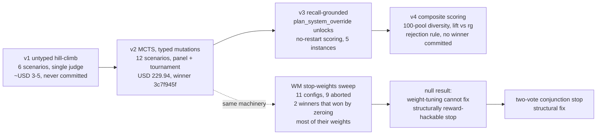
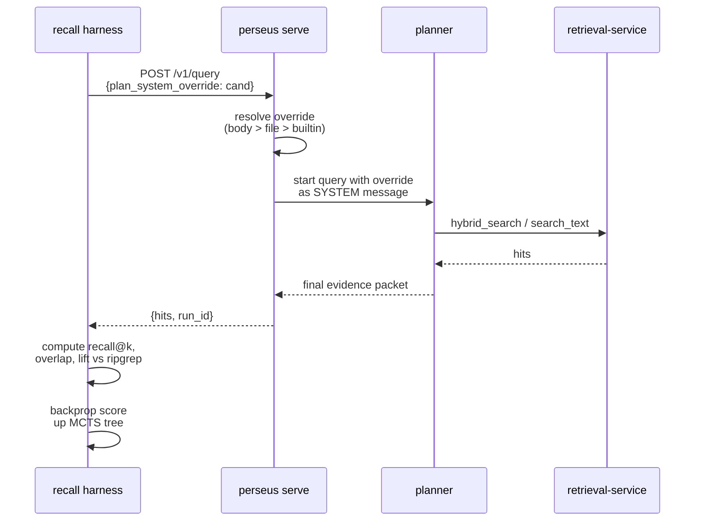
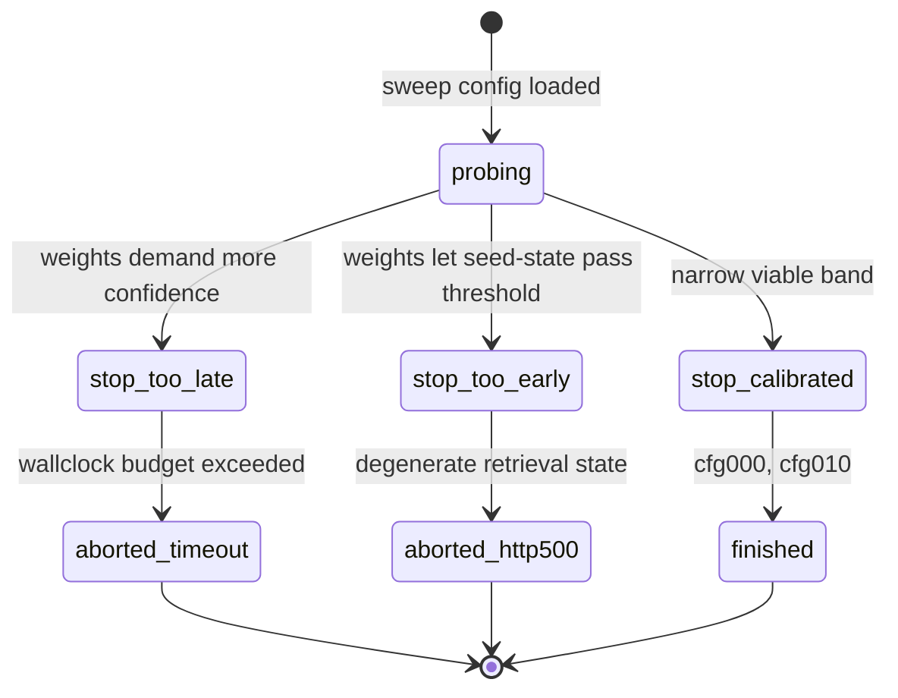
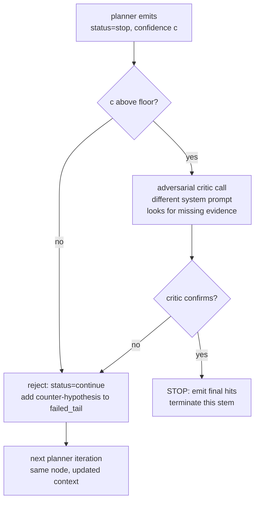

We ran the same MCTS machinery against two different optimization targets and got two cleanly opposite outcomes. Against a high-dimensional discrete space (planner system prompts) the search produced a USD 229.94 winner that shipped to production for three weeks. Against a low-dimensional continuous space (six weights that compose a world-model stop signal) it produced eleven configurations, nine of which aborted on sanity timeouts, and two "winners" that won by zeroing most of their weights. The second outcome is not a tuning failure. It is a structural proof that weight-tuning cannot rescue a stop function the planner is incentivized to game.

This essay walks the four prompt-search generations (v1 through v4) and the parallel null-result branch (the stop-weights sweep). The lesson is at the bottom and is short. The interesting part is the asymmetry between the two domains.

## 1. Two trees, one algorithm

Perseus has two MCTS loops. They share UCB1, backprop, and a node/edge data model, and nothing else.

The first, autoresearch, is offline Python that lives in `scripts/prompt_autoresearch_v{2,3,4}.py`. Nodes are candidate planner-system-prompt bodies. Edges are typed prompt-mutation actions (`add_counterexample`, `decision_tree_explicit`, etc.). Values are composite scores against a probe corpus. Trees persist as JSON across rounds; a single run takes hours and costs dollars; the winner ships as a source-code constant.

The second, the runtime planner, is embedded Rust inside `perseus serve`. Nodes are `(tool, args)` invocations. Edges are planner-emitted tool options. Values are tool-evidence quality blended with a world-model scalar. Trees live in memory for the duration of a single query (seconds); per-step root-children visit distributions persist to a Postgres table.

The two trees never share state. They differ in one numerically-important parameter and one structurally-important one. The exploration constant in UCB1,

$$
\text{UCB1}(n) = \mu_n + C \sqrt{\frac{\ln(N_{\text{parent}} + 1)}{n_n}},
$$

is fixed at $C = 1.2$ in autoresearch and $C = 2.2$ in the runtime. The autoresearch tree explores conservatively because each leaf evaluation costs real money; the runtime tree explores aggressively because each leaf evaluation costs cheap tokens and the priors are noisy. The two constants do not need to agree, and they do not. Confusing them costs hours.

The structural asymmetry matters more. Autoresearch optimizes a discrete, high-dimensional object (a multi-kilobyte text prompt) against a score function the candidate cannot observe. The runtime planner optimizes a continuous, low-dimensional object (the rest of an MCTS rollout) against signals it directly produces. The candidate-vs-scorer separation in autoresearch is what makes the search well-posed. The lack of separation in the runtime is what made the stop-weights sweep ill-posed from the start.

## 2. v1: the hill-climb that never shipped

v1 (942 lines, late April) was a flat optimizer loop, not yet MCTS. Each round extracted the current planner-system body from the Rust source via regex, ran it against six hand-crafted scenarios using Haiku 4.5 as the subject model, scored each output with Opus 4.7 as a single judge against a 6-axis rubric (json-validity, schema-correctness, status-correctness, options-groundedness, rationale-quality, confidence-reasonableness), and then asked Opus to optimize: given the round's scores and judge feedback, produce a revised prompt body. The history was a list and the next round started from whichever round scored highest so far.

There was no tree, no UCB, no concurrency. The action space was an untyped optimizer instruction ("improve it based on these scenario failures"). The value function was the sum of the 6-axis judge scores across six scenarios, max 66.

Four pathologies killed v1, all fixed by v2 the same day. (1) Single judge meant high per-scenario variance. (2) No tree meant older mutation chains were never revisited even if they looked promising. (3) Untyped mutations made "why did this branch win" unanswerable. (4) Pure serial loop meant the cost-per-round was dominated by walltime.

A fifth defect v1 *kept* and only v3 fixed: the candidate prompt never entered a running perseus. The Opus judge graded Haiku's parse of the prompt, not real planner outcomes. v1 never produced a committed winner. It was the throwaway prototype that proved the optimizer-loop pattern was sound end-to-end.

## 3. v2: the winner, USD 229.94

v2 (1997 lines, commit `0c808b14`) was the first true MCTS-over-prompts. Each round did six things. (1) Selection picked $K = 5$ leaves via UCB1. (2) Expansion sampled $M = 4$ distinct mutation actions per leaf from a 12-entry catalogue, each calling the Opus optimizer concurrently to produce a child. (3) Evaluation ran Haiku-as-subject and Opus-as-judge on every (candidate, scenario) pair. (4) Critique fired one Opus critic call per candidate, concurrent. (5) Tournament ran top-$N = 8$ candidates through an all-pairs Bradley-Terry-lite arbiter (strength = wins / played). (6) Backprop walked the sample's mean total up every ancestor. A meta-optimization phase analyzed the last three rounds' per-action stats and injected per-mutation guidance into the next round's optimizer prompts.

The mutation catalogue (twelve entries: `add_rule`, `remove_redundant`, `tighten_schema`, `add_counterexample`, `reorder`, `clarify_jargon`, `shorten_aggressive`, `lengthen_critical`, `meta_insight_injection`, `adversarial`, `few_shot_swap`, `decision_tree_explicit`) is the search action space. Typed, named, traceable. The chain of mutations to the winner is preserved verbatim.

The probe corpus was 12 hand-written planner fixtures stressing ambiguous queries, contradictory evidence, circular coverage, noise-flooded context, very-late-budget, fresh queries with prior-failure context, and the original six v1 scenarios. The rubric was 9-axis (max 14 per scenario, 168 total). The mean total across the 12 valid scenarios was what got backpropagated; invalid scenarios (where the judge failed to parse) were excluded from the mean rather than counted as zero, which was the critical fix after an earlier run silently produced a bogus 0.00 baseline because temperature-deprecated calls were being logged as zero scores.

The production run was `run-20260423T063052Z`. Nine of ten rounds completed, 4528 API calls, 165 prompt nodes explored, baseline score 11.83 ascending to best 13.50 at round 7 (node `n07-0109`). Spend USD 229.94. The winner's mutation chain was `root → add_counterexample → decision_tree_explicit → clarify_jargon → clarify_jargon → few_shot_swap → reorder`. The committed prompt (12559 characters) added a glossary defining `stem`, `evidence_packet`, `global_digest`, `too_broad`, `stem-cold`, `concrete-evidence`, `named-candidate`, `circular-coverage`, `budget`, and `confidence` with operational definitions; a decision tree walked top-to-bottom in sections A through E; seven worked examples each tagged with the decision-tree rule they demonstrate; and seven anti-patterns each with a "why wrong" pointer to a specific rule.

Three pathologies got fixed inside v2 itself. The first, *subject deadlock*, happened when candidate-wrappers and scenario sub-tasks were submitted to the same thread-pool: the wrappers occupied all worker slots and starved the inner calls. The fix flattened the submission shape so the executor never holds an aggregating task — every leaf task is a single (node, scenario) pair, and the aggregation is done by the caller after futures resolve. The second, *Opus 4.7 temperature rejection*: 4.7 deprecated the `temperature` and `top_p` parameters; the payload builder now strips them for Opus models, and a fatal-payload-error abort fires on any HTTP 400 mentioning "deprecated" so the whole run dies loudly rather than silently logging zeros. The third, *judge invalidation*, marks scenarios as invalid and excludes them from the mean when the judge fails to parse; otherwise a single judge failure contaminates the entire candidate score. The right denominator for the mean is the count of *valid* scenarios, not the count of *attempted* ones.

The aggregated value at node $n$ after evaluation is

$$
\mu_n = \frac{1}{|\mathcal{S}_{\text{valid}}|} \sum_{s \in \mathcal{S}_{\text{valid}}} \text{rubric}(n, s)
$$

where $\mathcal{S}_{\text{valid}}$ is the subset of scenarios on which the judge parsed successfully. This denominator change is the difference between a meaningful score and a silently-degraded one when judges fail.

The score trajectory by round was:

$$
R_0 = 11.83 \to R_1 = 12.50 \to R_2 = 12.83 \to R_3 = 12.83 \to R_4 = 13.17
$$
$$
R_5 = 13.42 \to R_6 = 13.42 \to R_7 = 13.50 \to R_8 = 13.42 \to R_9 = 13.42
$$

The trajectory peaks at round 7 and *regresses* slightly in rounds 8 and 9. This is the signature of UCB1 doing what it is supposed to do: by round 8 the exploration term has driven the loop to visit less-promising branches, and one of them happens to score lower than the round-7 best. The right thing is to take the round-7 winner and stop, which is what we did. The mutation-rank distribution across the live run gives an empirical picture of which actions were paying off: the adversarial mutation won twice with average 12.78, decision-tree-explicit won once at 13.03, clarify-jargon at 12.99, add-counterexample at 12.89, and meta-insight-injection at 12.79. Mutations that lost rounds (`tighten_schema`, `shorten_aggressive`, `remove_redundant`) are the ones that reduce prompt surface area; the winners are the ones that add structured information.

The v2 winner survived seventeen subsequent hand-edits through 2026-05-01 and was the production planner-system prompt until the V2-to-perseus reset. What v2 still got wrong, and what motivates v3: the candidate prompt never entered a running perseus. The "11.83 to 13.50" gain measured Opus's preference for the prompt, not real planner outcomes. A prompt scoring 14 of 14 on the v2 rubric might not improve real retrieval at all.

## 4. v3: per-request override unlocks recall-grounded scoring

v3 (1448 lines, commit `e11dd257`) preserved v2's MCTS shape but replaced the value function entirely. The Opus judge is gone. Each candidate is now scored by running real query API calls against the multi-bench fix-patch gold set and measuring file-level recall and mean reciprocal rank.

The first thing v3 needed was a way to install a candidate prompt without restarting perseus. Phase 1 of v3 used the old restart-per-candidate path: SCP the candidate to engram, kill the running perseus (matching basename only with `pkill -x perseus`, never `pkill -f 'perseus serve'`, because the ssh remote shell's own argv would match the latter pattern and self-kill), SSH-launch perseus with an override env var pointing at the SCP'd file, wait for the health endpoint, then run the recall harness. The bottleneck was that every cold-start re-ran the perseus semantic index from scratch, Azure embeddings stalled under burst, and every autoresearch score came back zero. Hours of Anthropic budget burned on a search that couldn't distinguish any candidate from any other.

The fix (commit `b7017298`) was a runtime API change: the query request body gained an optional `plan_system_override` string, threaded through the planner's system message for *that query only*; a header fallback (`X-Plan-System-Override`) for when the body field is absent; and a server env-var gate (`PERSEUS_ALLOW_PLAN_OVERRIDE=1`) so unset means a 403 reject and prompt-injection in production is impossible. The resolver is three-layered: if the override is non-empty and the gate is on, use it for this call only; else if a file-based override was set at process startup, use the once-memoized file body resolved at first planner call; else use the baked-in built-in.

A single running perseus can now serve N candidate prompts concurrently without restart. Cost saved per candidate: 200 to 300 seconds of cold-start plus index warm-up. Across an 8-round 12-candidate run, roughly five hours of wallclock and the equivalent in Azure embedding burst. The per-request override is the unlock that makes recall-grounded scoring economically viable.

Note that the override applies *only* to the planner's system message. The retrieval-service, the tool registry, the world-model, and every other subsystem see no override at all. This is the right scope: prompt search is about the planner, not about the rest of the stack.

The v3 probe corpus auto-selected $N = 5$ instances from multi-bench, filtered to those with at most three gold files and a patch size between 2000 and 8000 bytes. For each instance the harness parses the fix-patch via diff-header regex to extract gold file paths, posts an index-build for the pre-fix repo and polls until indexed, builds a seed query from the issue title plus the first 150 characters of the issue body, posts the query with the candidate prompt as override, and computes recall at $k$, recall over files, and mean reciprocal rank against the gold set:

$$
\text{recall@}k(q) = \mathbb{1}\left[\bigcup_{i=1}^{k} \{\text{file}(h_i)\} \cap G(q) \neq \emptyset\right]
$$

where $G(q)$ is the gold-file set and $h_i$ is the $i$-th hit. The aggregate score per candidate is

$$
\text{score}_{v3} = \overline{\text{recall@}k} + 0.1 \cdot \overline{\text{mrr}} + \text{compactness}
$$

with three runs per candidate averaged and a compactness bonus equal to $\max(0, 1 - L/8000) \cdot 0.15$ where $L$ is the prompt character length.

v3 seeded three roots: the current production prompt (regex-extracted), a hand-written 20-line minimal variant with the 17-tool catalogue, and a near-empty skeleton (JSON contract plus tool name list only). The optimizer has room to grow the skeleton from scratch if the baseline is a local minimum.

What v3 fixed: Opus-judge irrelevance (score is now real retrieval recall), restart cold-start (per-request override obsoletes it), the `pkill -f` self-kill (basename-only matching everywhere).

What v3 still got wrong: a prompt can hit the right *file* without hitting the right *function*. Recall at 10 rewards file-level matches; it gives no signal on whether perseus landed at the line range the human fix actually touched. Worse, a prompt that emits text searches with the right keywords will hit any file containing those keywords, which is exactly what `rg --files-with-matches` does. Perseus has to *beat* plain grep to add value, not match it. v3 cannot see that bar.

## 5. v4: composite scoring against ripgrep lift

v4 (1670 lines, commit `b7017298`) preserved v3's MCTS shape and per-request override installation and made four structural changes. (1) Snippet-level overlap against fix-patch hunks replaced raw file-path match as the dominant signal. (2) Lift versus ripgrep was added: perseus must beat plain text-grep, not just match it. (3) A diversity-balanced 100-instance pool replaced v3's 5-instance auto-select. (4) A rejection rule disqualifies candidates whose lift is more than 5 percentage points below ripgrep; UCB1 sees 0.0 for such candidates, same as an unexplored branch.

A new seed loaded from v3's latest winner artifact let v4 stand on v3's shoulders rather than restart from the baseline.

**The 100-instance pool.** Built deterministically and cached to disk, the pool widens v3's filters (at most five gold files, patch bytes between 2000 and 15000) and caps any single repo family at fifteen instances out of 100. The cap is load-bearing. Without it, zstd (which has the most multi-bench records) dominated the pool, and the autoresearch loop optimized prompts that were good at zstd-shaped queries and mediocre at everything else. The cap forces six to ten families. Each pool entry persists with its instance id, repo directory, repo id, gold file list, gold hunks per file as old-side line ranges (pure-addition hunks where the old-side length is zero are skipped because they contribute zero gold lines to overlap math), family tag, and patch size.

**Snippet overlap.** For each perseus hit matching a gold file, the harness extracts the line range from the hit, falls back to anchoring the hit's snippet to a unique line in source when line numbers are absent, clamps the range to 500 lines, and computes the covered intersection with the gold line set. Hits with no recoverable span get zero credit; the whole point is to punish mispositioned snippets. Aggregated, the overlap fraction is total covered gold lines divided by total gold lines.

**Lift.** For each instance, the harness extracts the top three keywords from the seed query (CamelCase first like `SessionCtx` or `ConnectionPool`, then snake-case or long tokens like `heartbeat` or `expire_at`, with a stoplist filter), runs `rg --files-with-matches --no-ignore --hidden --max-count 1` on each keyword, and computes a ripgrep hit indicator (one if any gold file appears in rg's path list, else zero). Lift is the difference between the perseus recall-at-$k$ indicator and the ripgrep hit indicator, in the discrete set $\{-1, 0, +1\}$.

**The v4 composite.** The scoring function that the tree backprops is

$$
\text{score}_{v4} = 0.50 \cdot \overline{\text{overlap}} + 0.30 \cdot \overline{\text{lift}} + 0.10 \cdot \overline{\text{recall@}10} + 0.05 \cdot \overline{\text{mrr}} + 0.05 \cdot \text{compactness}.
$$

The 0.50 on overlap encodes the conviction that line-range precision is the tightest signal we have. The 0.30 on lift forces the optimizer to discover routing paths past plain text-grep. The 0.10 on recall is a backstop for the case where line ranges are unavailable. The 0.05 on MRR captures that rank matters downstream when the planner feeds hits into its evidence packet. The 0.05 on compactness, where compactness is $\max(0, 1 - L/8000)$, is a tie-break on prompt length. Weights are command-line-tunable; defaults sum to 1.0 and a warning fires when they do not.

**The rejection rule.** After all OK runs are collected, the harness computes the average lift across runs and disqualifies the candidate if it falls below the threshold (default minus 0.05). UCB1 sees 0.0 for disqualified candidates, the same value as an unexplored branch, so autoresearch never wastes another visit on a strictly-worse-than-grep prompt.

**Two new mutations.** The catalogue grew from twelve to fourteen entries. The two new ones are direct codifications of the v4 scoring weights. `snippet_precision_focus` targets overlap: it instructs the Opus optimizer that downstream we measure snippet-level overlap with gold fix hunks, not just file match, and that the prompt should sharpen rules around precise snippet landing. `beat_ripgrep` targets lift: it instructs the optimizer that perseus is measured against a ripgrep baseline on the same keywords, and that the prompt should add rules that actively route past raw text-grep, preferring hybrid search, similar-files embedding, symbol lookup, callgraph neighbors, and references lookup over plain text search. The autoresearch loop is self-referential: the mutation catalogue evolves with the scoring function, and each new score component gets a dedicated mutation that the optimizer knows how to apply.

**Cost.** v4 spend was not documented as a single dollar figure like v2's USD 229.94. Optimizer plus critic Opus calls are similar in count to v3's; the compute side is heavier:

$$
\text{queries per run} \approx 100 \text{ instances} \times 3 \text{ runs} \times 3 \text{ cands} \times 8 \text{ rounds} \approx 7200 \text{ to } 24000
$$

depending on candidate replication. At about 30 seconds per query on warm indexes that is roughly 60 to 200 hours of perseus walltime, parallelized at concurrency 8 to roughly 8 to 25 hours of real time. A cheap-smoke flag caps Anthropic spend at under USD 5 for a 2-round verification with 20 max calls, one run per candidate, ten eval instances. The smoke flag is what we run before paying for a full sweep.

No v4 winner has been committed. The v4 runs landed too close to the 2026-04-25 prompt-drift fixes (UCB-C raised from 1.5 to 2.2, the stop semantics changed to self-calibrated, the C.1/E.4/A.2 sections rewritten) for a clean A-vs-B against the v2 winner. The v2 prompt remained in production until the reset.

To make the four-generation evolution legible at a glance, the table below collapses the differences along the dimensions that actually changed:

| | v1 | v2 | v3 | v4 |
|---|---|---|---|---|
| Lines of driver | 942 | 1997 | 1448 | 1670 |
| Tree | history list | UCB1 | UCB1 | UCB1 |
| UCB-C | n/a | 1.2 | 1.2 | 1.2 |
| Mutations | untyped | 12 typed | 12 typed | 14 typed |
| Seeds | 1 | 1 | 3 | 3 to 4 |
| K leaves / round | n/a | 5 | 3 | 3 |
| M cands / leaf | n/a | 4 | 4 | 4 |
| Runs / candidate | n/a | 1 | 3 | 3 |
| Probe corpus | 6 hand-crafted | 12 hand-crafted | 5 multi-bench | 100 diversity-balanced |
| Subject | Haiku 4.5 | Haiku 4.5 | live perseus | live perseus |
| Value function | Opus rubric (max 66) | Opus rubric (max 168) | recall + mrr + compact | overlap + lift + recall + mrr + compact |
| Installation | n/a | n/a | per-request override | per-request override |
| Tournament | none | top-8 Bradley-Terry | none | none |
| Meta-optimizer | none | last 3 rounds | none | none |
| Rejection rule | none | invalid excluded | none | lift below threshold gets 0 |
| Cold-start hazard | n/a | n/a | fixed post-refactor | none |
| Cost (live run) | ~USD 3 to 5 | USD 229.94 | not single-line | not single-line |
| Winner committed | none | 3c7f945f | none | none |

The "winner committed" row is the operational truth. v2's `n07-0109` ran in production until the reset. v3 and v4 produced top candidates but neither got swapped into the production planner-system constant.

## 6. The stop-weights sweep

By mid-May the world-model composite stop function was generating its own tuning question. The composite is six normalized signals weighted into a scalar that gets compared to a threshold:

| signal | default weight | meaning |
|---|---|---|
| $v_\text{norm}$ | 1.0 | WM value head via HL-Gauss bounds |
| $j_\text{norm}$ | 1.0 | WM judge head, tanh-bounded |
| $r_\text{norm}$ | 0.5 | WM step-reward head |
| $\ell_\text{norm}$ | 1.5 | $\sigma(\text{line\_bearing\_hits} / 2)$ |
| $p_\text{norm}$ | 1.0 | aggregator top-path score divided by 5 |
| $s_\text{norm}$ | 1.0 | $\sigma((\text{step} - 4) / 2)$ |

Stop fires when $\sum_i w_i \cdot x_i / \sum_i w_i \geq \tau$ with default $\tau = 0.85$. The composite replaced an earlier per-leaf WM stop that was reward-hackable: a single-head value-norm gate would fire on initial seed state because every fresh query has $v_\text{norm} \approx 0.78$ just from seed candidates loaded into the aggregator. The HL-Gauss decoding maps a "typical bad state" of raw value around minus 0.7 to a normalized 0.78, which is above many reasonable thresholds. A forensic note from session `61f74930` puts it bluntly: "picked the cheapest WM signal that would fire early and called it sub-5s. The thing was reward-hacking on initial seed state."

The composite was the proposed fix. The theory: no single signal is load-bearing, so no single signal can be hacked. Six surfaces, one threshold. The seed-state reward-hack is suppressed softly because at step zero the step-progress feature drags the composite down regardless of how high WM value is.

Six weights and one threshold is a seven-dimensional continuous tuning problem. We had cato idle at zero marginal cost. Pointing autoresearch at it looked natural. Same UCB tree in principle, same scoring loop, same multi-bench corpus.

The sweep lived at `cato:/home/cato-user/perseus_sweeps_v6_20260517T174856/`. Twelve knobs in total: the six weights above plus the composite threshold, plus four auxiliary scale parameters that control line-hit saturation, primary-path normalization, step-progress midpoint, and step-progress softness. Each configuration probes about 1000 queries against the multi-bench corpus, with ripgrep run as a baseline on the same keywords. Per-query records go to one JSONL file per configuration; a summary JSONL aggregates means.

Eleven configurations went into the sweep. Nine aborted. Two finished:

| cfg | recall_mean | ok_rate | wall_median | wall_p95 | sweep_score | $w_v$ | $w_\ell$ | $w_p$ | $\tau$ |
|---|---|---|---|---|---|---|---|---|---|
| cfg000 | 0.129 | 0.915 | 7.82s | 25.0s | **0.0561** | 2.0 | 3.0 | 1.0 | 0.70 |
| cfg010 | 0.136 | 0.961 | 7.99s | 23.5s | 0.0547 | 1.5 | 0.0 | 0.0 | 0.65 |

The outer metric (`sweep_score`) is intentionally a different composite from the inner stop function: it weights recall, OK rate, and p95 walltime. The two configs that finished did so by *not stopping the planner prematurely*. cfg010 set the line-hits and primary weights to zero, turning off two of the six signals entirely. cfg000 set line-hits to 3.0, the highest weight in the table, making line-hit evidence overwhelmingly dominant.

Neither of these is tuned. They are emergent deletions expressed as parameter values. cfg010 deletes line-hits and primary; cfg000 deletes everything except line-hits. The two "winners" are configurations whose weight choices happened to land far enough from the failure modes that they did not trigger either of them.

## 7. The nine aborts are the result

The nine configurations that aborted did not crash because of bugs in perseus. They crashed because their composite-stop weights let MCTS continue past the planner's natural completion until the walltime budget exploded into a sanity timeout, or because they let MCTS terminate so early that an HTTP 500 fired downstream from a degenerate retrieval state.

In both abort directions, the failure mode is *the planner adversarially gaming the continuous stop signal*. With composite weights tuned toward "more confidence required to stop," the planner happily keeps proposing options and the loop runs until it hits hardcoded sanity caps. With weights tuned toward "less confidence required," the planner stops on the seed state and downstream code cannot recover.

This is exactly the reward hack that the composite was supposed to prevent. Spreading the gate across six signals did not fix it. It just gave the planner six surfaces to push against simultaneously. The composite expression $\sum w_i x_i \geq \tau$ has a level set in six-dimensional state-feature space; the planner's UCB rollout finds a path that crosses or hugs that level set depending on which side of the cliff is locally rewarded.

Worse, the "winning" configurations confirm the diagnosis rather than refute it. cfg010 with line-hits and primary zeroed out is a two-signal gate (value head plus judge head) dressed as a six-signal gate. cfg000 with line-hits at 3.0 and everything else dominated is a one-signal gate dressed as a six-signal gate. The configurations that finished are the ones that collapsed back toward simple gates the planner could not easily push around. The configurations that aborted are the ones where the planner found the cliff.

## 8. Why prompt search worked and weight search did not

Compare the two domains formally. Let $\mathcal{X}$ be the search space and $V: \mathcal{X} \to \mathbb{R}$ the score function. For prompt search, $\mathcal{X}$ is a set of multi-kilobyte strings; the local move set is the typed mutation catalogue (twelve to fourteen actions, each producing a child via a separate Opus call); the value is computed by a fixed external probe corpus the candidate has no access to. The reward signal at each leaf is:

$$
V_{\text{prompt}}(x) = \mathbb{E}_{q \sim \text{probe}}\left[\text{score}(q, \text{perseus}(q; \text{system}=x))\right]
$$

where $x$ is the candidate prompt, $q$ is a probe query, and $\text{perseus}(q; \text{system}=x)$ is a fresh perseus call with that prompt as the planner system message. The candidate $x$ cannot influence the choice of $q$, cannot influence the scoring function, and cannot influence the ripgrep baseline (which is computed externally from the same query). The optimization is well-posed in the standard supervised sense: a better $x$ produces strictly better $V_{\text{prompt}}(x)$ in expectation, modulo evaluation noise.

For weight search, $\mathcal{X}$ is $[0, 3]^6 \times [0, 1]$; the moves are continuous; the value is computed by running a closed-loop perseus that *contains the weights being evaluated*. The reward at each probe is:

$$
V_{\text{weights}}(w) = \mathbb{E}_{q \sim \text{probe}}\left[\text{outcome}(q, \text{perseus}(q; \text{stop\_weights}=w))\right]
$$

where the planner inside `perseus(q; stop_weights=w)` is *actively optimizing against* $w$ through its UCB rollout. The planner sees $w$ through state features (because line-hit counts, primary scores, and step-progress features are all things the planner can read), and it chooses tool calls that move state in directions that the composite either favors or disfavors depending on whether the planner wants to stop. The candidate $w$ co-determines the policy, and the policy co-determines the score. This is a fixed-point problem, not a supervised one.

The empirical signature is the abort distribution: nine of eleven configurations failed in two opposite directions (timeout on too-tight stop, HTTP 500 on too-loose stop). A supervised score function would show smooth degradation as $w$ moves away from the optimum. A fixed-point score function shows cliffs in both directions, with a narrow viable band in between that has nothing to do with the optimum we wanted.

## 9. The shape lesson

Three things came out of the stop-weights sweep.

**One.** Neither cfg000 nor cfg010 has been promoted into production. There is no good answer to which one to ship, because neither is better in a way that survives the question "what does this weight mean."

**Two.** The planner is an adversary against the stop function. This is structural, not a calibration issue. The runtime planner is prompted to maximize information gain per step. Any continuous stop signal $f(\text{state}) \in [0, 1]$ that depends on planner-observable features (hit counts, line-hit counts, value-head estimates of state quality) can be either undershot or overshot by planner output. Tuning weights changes *where* the cliff is, not whether there is a cliff. The optimal planner behavior in the neighborhood of the threshold is always to push exactly there.

**Three.** Autoresearch over low-dimensional continuous parameters is the wrong shape when the failure is reward-hack-by-construction. The v1 through v4 work succeeded because the search space (planner system prompt text) is high-dimensional and discrete, and the score function is ungameable by the candidate: a prompt does not get to observe the recall harness or the ripgrep baseline. The stop-weights sweep failed because the search space (six weights in non-negative reals plus one threshold in zero to one) is low-dimensional and continuous, and the score function is adversarially gameable by the planner at every probe. These are different optimization regimes.

## 10. The structural fix

The fix is a conjunction:

$$
\text{stop} \iff \text{(planner emits status=stop)} \;\wedge\; \text{(adversarial critic confirms)}.
$$

Both votes must agree. The planner's vote is the natural completion signal: it says "I'm done" when its prompt-encoded heuristics say the stem has enough evidence. The critic's vote is a separate adversarial LLM call with a different system message that actively looks for missing evidence and counter-hypotheses.

The conjunction is structural in a way no continuous threshold can be. (1) The planner cannot game both votes simultaneously because the critic is a separate model call with its own prompt and its own context. (2) A weight sweep cannot reduce the gate to a single signal because both votes are binary, not weighted. (3) The threshold has been removed; there is no continuous parameter to reward-hack.

This costs one extra LLM call per stop proposal, which is the price of structural correctness. The composite-stop infrastructure remains in the codebase, gated off by default since 2026-05-17 (the per-stem-confirm flag defaults to false, the composite threshold defaults to a value high enough that it almost never fires), as a fallback. Production traffic routes through the conjunction.

The two cfg000/cfg010 winners can stay where they are, in the sweep summary on cato alongside the nine aborted siblings. They are a useful artifact: a recorded null result that documents *why* the conjunction gate exists.

There is a tempting objection: maybe the sweep just did not search hard enough. Eleven configurations is a thin grid in a seven-dimensional space, and a more aggressive search (Bayesian optimization, evolutionary strategies, more probes) might find a region where the composite is robust. The objection misses the structural argument. The reward-hack mechanism is

$$
\pi_{\text{planner}}^{\star}(\text{state}) \in \arg\max_a \mathbb{E}\left[\text{UCB-value}(a) \,\big|\, f(\text{state}) < \tau\right]
$$

which is to say: as long as the planner's value estimate of an action depends on whether stopping is *not yet* triggered, the planner has gradient pressure to keep the composite below threshold for as long as it is profitable to continue. The shape of $f$ does not matter. The number of signals composed into $f$ does not matter. The weights do not matter. What matters is that $f$ is a continuous function of planner-visible state, with a threshold the planner can predict locally. Any such function can be hugged from below by a planner with enough budget. The fix is to remove the prediction, which the conjunction does by inserting a second LLM call with different context.

## 11. When to point autoresearch at a problem

The decision rule that falls out of this saga is a two-part diagnostic. (1) Is the search space high-dimensional and discrete? Prompts qualify; weights do not. Code-generation candidates qualify; hyperparameters do not. Architecture variants in a discrete catalogue qualify; continuous learning-rate schedules do not. (2) Is the score function independent of the candidate's incentives? A prompt cannot game a recall harness because the prompt does not get to see the harness. A weight configuration *can* game a runtime planner because the planner observes (indirectly, through state features) the gate the weights define.

Both conditions must hold. If either fails, autoresearch is the wrong tool. The stop-weights sweep failed condition (1) (continuous, low-dimensional) and condition (2) (the inner planner has incentive to game the outer score). Either failure alone would have been a warning; both together meant the search was structurally hopeless before the first probe.

The corollary is that autoresearch is appropriate for: prompt optimization (clearly), system-prompt-derived rules and decision trees (the v2 winner), tool-catalogue expansion (when the candidate is a new tool definition), few-shot example selection (when candidates are discrete fixtures), and possibly entire prompt-engineering DSLs once such a thing exists. It is inappropriate for: any hyperparameter that the runtime can observe, any loss-function coefficient that the optimizer can target, any stop-rule threshold the planner can predict, any continuous knob in a closed-loop system where the inner loop has agency.

## 12. Lesson

Autoresearch over high-dimensional discrete spaces, where the search itself is the win: v1 through v4 found a prompt that improved real retrieval by surfacing a glossary, a decision tree, worked examples, and anti-patterns, none of which would have been discovered by a weight sweep over five scoring coefficients. The mutation catalogue is the search space; the score function answers "did this help?"; UCB1 keeps explore/exploit honest. Total spend USD 229.94, gain 11.83 to 13.50 on the v2 rubric, real production deployment for three weeks. The chain of mutations that produced the winner (`add_counterexample → decision_tree_explicit → clarify_jargon → clarify_jargon → few_shot_swap → reorder`) is preserved verbatim in the parking-lot archive; it is a record of how the optimizer discovered, mutation by mutation, that the planner system prompt benefits from explicit definitions, decision rules, examples, and reorderings of existing content. None of these are surprising in hindsight. None of them would have been found by a coefficient sweep.

Autoresearch over low-dimensional continuous spaces where the score function is reward-hackable is the wrong shape. The stop-weights sweep had eleven configurations because there are only so many points in $[0, 3]^6 \times [0, 1]$ that are worth probing; nine of them aborted because each probe is itself a 1000-query MCTS run, and the inner MCTS adversarially games whichever weights it sees. The two survivors are deletions in disguise. The right move is not to keep searching for better weights. It is to recognize that the score function is structurally broken and replace it with a discrete conjunction that has no weights at all. The conjunction stop costs one extra LLM call per stop proposal, which is the price of structural correctness, and it has zero tuning knobs to game.

The same machinery, pointed at two different problems, produced one production deployment and one structural-impossibility proof. Both are honest results. Only the first one shipped. The second one is a record that we can point at next time someone proposes to sweep weights for a function the inner planner can see.
