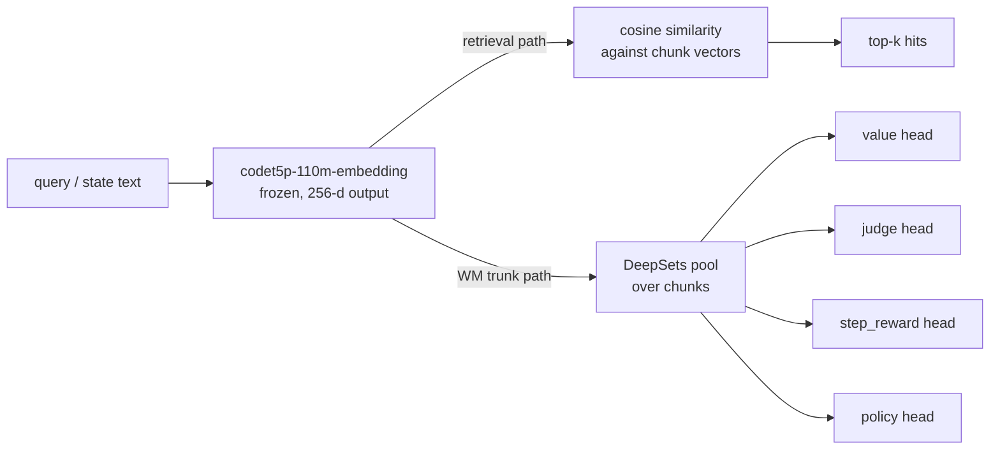

import Figure from "../../components/Figure.astro";

> tl;dr: `Salesforce/codet5p-110m-embedding` is the single backbone that serves
> two consumers in Perseus. The retrieval path calls it for raw 256-dimensional
> sentence vectors compared by cosine similarity. The world model (WM) Phase-2
> head stack uses it as a frozen feature extractor whose 256-d output feeds a
> DeepSets pool and four MLP heads (`value`, `judge`, `step_reward`,
> `policy`). Code-pretraining is what justifies the choice over a
> general-purpose text embedder — tokenizer efficiency on identifiers,
> semantic neighborhoods learned from code corpora, public-bench CoIR scores
> in the 60–75 nDCG@10 range against ada-002 below 40. It is not the best
> embedder we evaluated. Qwen3-Embedding-4B beats it on CoIR by ~15 points.
> But codet5p is 40× smaller, runs in the per-MCTS-expansion latency budget
> for the WM trunk, and the deployed retrieval path uses qwen3 anyway. This
> essay covers the model card, why code-pretraining matters, the endpoint
> integration, the WM trunk reuse pattern, the CoIR comparison, the
> p3pp_codet5p_220m scale-up disaster, and the open audit gaps.

## 1 · Model card

`Salesforce/codet5p-110m-embedding` is the embedding-only variant of the
CodeT5+ family released by Salesforce Research. Relevant facts:

- **Parameter count.** 110M. Encoder-only architecture; the decoder half of
  the seq2seq parent model is dropped for the embedding variant.
- **Output dimensionality.** 256 floats per input. Fixed-size sentence
  embedding produced by pooling the encoder's last hidden state.
- **License.** Apache-2.0. No copyleft, no non-commercial restriction.
- **Format.** Safetensors available on the HF repo, alongside a legacy
  `.bin` pickle file. Under PyTorch 2.5 the pickle path is blocked by
  CVE-2025-32434 unless the loader passes `weights_only=True` or selects
  the safetensors file explicitly — see `HISTORY/07_dead_ends.md:130`.
  Both `wm-serve/wm_serve.py` and `python/muzero/variants/finetune_codet5p.py`
  set `trust_remote_code=True` and select safetensors to sidestep the issue.
- **Pretraining corpus.** CodeSearchNet — multi-language but
  Python-heavy. Objectives include masked span prediction, identifier
  tagging, and contrastive bimodal pretraining (NL ↔ code pair
  alignment).

The variant string in Perseus configuration is the literal HF model id:

```rust
// src/search/engine/config_types.rs:279-282
semantic_primary_model: env::var("PERSEUS_SEMANTIC_PRIMARY_MODEL")
    .ok()
    .or_else(|| env::var("OPENAI_EMBED_MODEL").ok())
    .unwrap_or_else(|| "Salesforce/codet5p-110m-embedding".to_string()),
```

256-d is small by modern embedder standards. Qwen3-Embedding-4B is
2560-d — exactly 10× wider. The narrowness is deliberate: every byte of
the vector is paid for in qdrant storage, in HNSW index size, in dot-product
arithmetic at retrieval time, and (most acutely) in the trunk-output width
fed to the WM head MLPs. A 256-d trunk keeps the head MLPs small enough
that a per-MCTS-expansion forward pass stays inside the 50ms uncached
budget on a V100.

## 2 · Why code-pretraining matters

A code embedder beats a general-purpose text embedder on code retrieval
for two compounding reasons.

**Tokenizer efficiency.** CodeT5+'s tokenizer was trained on code, so
identifiers like `gather_seed_candidates` or `RetrievalClient` are emitted
as a small number of tokens — often a single token for common
identifiers, two or three for novel ones. A general-purpose BPE tokenizer
trained on web text shatters `gather_seed_candidates` into something like
`["gather", "_", "se", "ed", "_", "candidates"]`. Each shard costs a token
budget cell, and the encoder has to recompose meaning across the
fragments. Both effects make code text behave like a foreign language to a
text-pretrained encoder — possible to embed, but with worse semantic
fidelity per token.

**Semantic neighborhoods.** What "nearby" means in the embedding space is
learned from training pairs. CodeT5+ saw contrastive pairs of
`(docstring, function_body)`, `(identifier, definition_site)`, and
`(call_site, callee_body)`. So in its embedding space,
`gather_seed_candidates` is near `seed_candidates`, near `seed_priors`,
near `candidate_collection.rs`. A web-text encoder learned that
"gather seed candidates" is near "harvest crop samples" — semantically
parallel English, but irrelevant to code retrieval.

CoIR (the Code Information Retrieval public benchmark) measures exactly
this gap. The CodeT5+ embedding variants score in the **60–75 nDCG@10**
range across CoIR subtasks. `text-embedding-ada-002` — the most common
general-purpose text embedder — scores **below 40** on the same subtasks.
That is not a 5-percentage-point gap. It is a category-distance gap; the
text embedder is doing fundamentally the wrong thing on code.

The CoIR numbers do not justify codet5p over other code embedders. They
justify *any* code-pretrained embedder over a text-pretrained one.
The within-family choice (codet5p-110m vs bge-code-v1 vs Qwen3-Embedding-4B)
turns on different axes — see [§5](#5--coir-comparison-and-the-qwen3-promotion).

## 3 · Azure OpenAI endpoint integration

The Perseus retrieval client (`src/search/retrieval.rs`) speaks the
OpenAI `embeddings` wire format. The endpoint can be:

- A vLLM server fronting codet5p locally.
- The Azure OpenAI service using the `Salesforce/codet5p-110m-embedding`
  model deployment.
- The retrieval-service Rust port (`crates/retrieval-service/`) which
  proxies through LiteLLM to whatever embedder the pool is configured for.

The client speaks both wire shapes in serde to remain agnostic:

```rust
// src/search/retrieval.rs:194-204
pub(crate) struct EmbedResp {
    /// Accept both `embeddings` (Rust port contract) and `vectors` (Python
    /// service contract). Both encode the same float32 matrix of stacked
    /// 256-d vectors — so aliasing lets one client speak to either service
    /// without redeploying.
    #[serde(default, alias = "vectors")]
    pub embeddings: Vec<Vec<f32>>,
    pub model: Option<String>,
}
```

The auth header is sniffed at runtime based on URL host. Azure endpoints
get the `api-key: <key>` header; OpenAI-format endpoints get the
`Authorization: Bearer <key>` header; vLLM endpoints get whichever the
LiteLLM proxy is configured to forward. The two shapes coexist in one
client so a misconfigured endpoint produces a 401 rather than a panic.

### 3.1 Deterministic hashed-embedding fallback

When the embedding endpoint is unreachable, the in-process semantic path
does not fail. It downgrades. `src/search/engine/semantic.rs:794-820`
implements a sha256-folded hashed embedding:

```rust
fn hash_embed(text: &str, dims: usize) -> Vec<f32> {
    let mut v = vec![0f32; dims.max(8)];
    for token in text.split_whitespace() {
        let t = token.to_ascii_lowercase();
        // FNV-1a hash → fold into dims float slots, +1 at slot index.
        ...
    }
    // L2-normalise.
    ...
}
```

The output is a 256-d vector that is deterministic for the same input
text and roughly captures bag-of-tokens overlap — no semantic
neighborhoods, no identifier-to-identifier similarity, just a hashing
trick to keep the retrieval surface alive when the embedder is down. The
deployment policy is to treat hashed-embedding hits as "degraded retrieval
quality but never silent failure" — surfaced via
`RetrievalDiagnostics.fallback_used` and the `retrieval_calls_failed`
counter so dashboards can see the gap.

### 3.2 Two-tier embedder design (and why bge-code-v1 sits idle)

Perseus config carries a primary and a secondary embedder model:

```rust
// src/search/engine/config_types.rs:279-286
semantic_primary_model:   "Salesforce/codet5p-110m-embedding"  // default
semantic_secondary_model: "BAAI/bge-code-v1"                   // default
```

The intent was a quality-tier escalation path: when codet5p endpoint
flakes but a richer code-aware model is reachable, swap to
`bge-code-v1` before falling all the way down to the hashed vector
fallback. In practice the secondary was never exercised in any deployed
sweep. The retrieval-service layer moved to qwen3-embed-4b (see §5) which
covers the "richer code-aware model" slot at a different layer. The
secondary slot remains configured but untested — documented in
`HISTORY/30_retrieval_research.md` §3 as "soft alternative; superseded by
the qwen3 stack at the retrieval-service layer."

## 4 · WM trunk reuse — one backbone, two consumers

This is the structural reason codet5p stays in the tree even after qwen3
takes the deployed retrieval slot. The WM Phase-2 head stack uses
codet5p-110m as a **frozen feature extractor**.



The asymmetry between the two paths is sharp:

- **Retrieval consumer.** Raw 256-d output → L2-normalise → cosine
  similarity against pre-indexed chunk vectors. No further weights
  involved. The embedder is the entire model in this path.
- **WM consumer.** Raw 256-d output → DeepSets pool across the state's
  chunks → 4 head MLPs trained on
  `(value, judge, step_reward, policy)` targets. The embedder is the
  *trunk*; downstream heads carry the learned task-specific weights.

The cosine math for the retrieval consumer is the standard form:

$$
\cos(\theta) = \frac{\mathbf{a} \cdot \mathbf{b}}{\|\mathbf{a}\|\|\mathbf{b}\|}
= \frac{\sum_{i=1}^{256} a_i b_i}{\sqrt{\sum_i a_i^2}\sqrt{\sum_i b_i^2}}.
$$

With L2-normalised vectors (the standard convention so we can hand qdrant
flat dot products and recover cosine), this collapses to
$\mathbf{a} \cdot \mathbf{b}$ — a single 256-wide fused multiply-add per
candidate, trivially vectorisable.

The WM consumer wraps this 256-d output in the architecture defined in
`wm-serve/wm_serve.py`:

```python
# wm-serve/wm_serve.py:86-104
class FinetuneCodet5pWM(nn.Module):
    """Inference-only mirror of FinetuneCodet5pWM. Loads:
        - codet5p backbone (256-d embedding pooled)
        - DeepSets pool
        - 4 head MLPs (value/judge/step_reward/policy)
    """
    CODET5P_DIM = 256
    CODET5P_NAME = "Salesforce/codet5p-110m-embedding"
    CODET5P_MAX_LEN = 512
```

When `hybrid_search` (or any other retrieval tool) calls codet5p via the
Azure endpoint, it is the *same model* whose checkpoint
`finetune_codet5p` builds its trunk from. Same tokenizer, same
encoder weights at the moment of WM checkpoint save. Drift between the
two paths is bounded by the fact that the WM checkpoint freezes the
trunk at save time, whereas the retrieval endpoint serves whatever the
deployment is currently fronting — a known but small operational concern.

### 4.1 LRU cache at the WM forward layer

The WM trunk forward is dominated by codet5p encode cost — roughly
30–50ms per state on V100, even at fp16. The MCTS planner can issue
hundreds of WM queries per query (one per node expansion at the prior
blend point). To make this affordable, `wm-serve` puts a 10k-entry
LRU cache in front of the encode:

- **Cache key.** `sha256(state_text)` — content-addressable, no eviction
  on rebuild.
- **Cache hit latency.** 0.04ms (CPU dict lookup + tensor decode).
- **Cache miss latency.** ~30ms (V100 codet5p forward + heads).

p50 cached / p95 uncached observed live (`wm-serve/wm_serve.py` `/health`
endpoint reports both percentiles). The 750× speedup on cached states
matters because the same state text recurs across MCTS expansions —
re-evaluating a node that was already visited (UCB re-selection) hits the
cache; only newly-expanded children pay the full cost.

## 5 · CoIR comparison and the qwen3 promotion

| Embedder | params | dim | CoIR nDCG@10 | License | Deployed where |
|---|---|---|---|---|---|
| `Salesforce/codet5p-110m-embedding` | 110M | 256 | ~60–75 | Apache-2.0 | in-process semantic.rs + WM trunk |
| `BAAI/bge-code-v1` | ~110M | 1024 | not benchmarked in-house | MIT | configured secondary, never exercised |
| `Qwen/Qwen3-Embedding-4B` | 4B | 2560 | **89.18** | Apache-2.0 | retrieval-service `/retrieve` (primary, 2026-05-03+) |
| `Qwen/Qwen3-Embedding-8B` | 8B | ~4096 | ~91 (within 2pp of 4B) | Apache-2.0 | rejected — V100 fit |
| `text-embedding-ada-002` | unknown | 1536 | &lt;40 | proprietary | rejected (not code-pretrained) |
| `nomic-embed-code` | unknown | unknown | not published | — | rejected — no public bench |
| `SFR-Embedding-Code` | unknown | unknown | not used | CC-BY-NC | rejected — license |

Two readings of this table:

**Within the code-pretrained family, bigger wins.** Qwen3-Embedding-4B
beats codet5p-110m on CoIR by ~15 points. Qwen3-8B beats Qwen3-4B by
another ~2 points. The published-bench evidence is unambiguous: scale +
modern training recipes win on code retrieval just like they win
everywhere else.

**The right embedder depends on the call site.** Retrieval queries are
outside the MCTS hot path — one embedding per `hybrid_search` call,
which is one of N tool calls per planner step. The per-call latency
budget can absorb a 4B encoder. So the retrieval-service `/retrieve`
endpoint runs Qwen3-Embedding-4B via vLLM at cato `:8050` and pays the
cost. The WM trunk, by contrast, is called per MCTS expansion — one
forward per option per node, potentially hundreds per query. A 4B trunk
would blow the latency budget. So the WM stays on codet5p-110m.

This is the structural justification for keeping codet5p in the tree
even after the retrieval-service promoted qwen3. The two consumers have
fundamentally different latency budgets, so they need different
backbones — and codet5p happens to land in the sweet spot for the WM
trunk's combination of (small, code-pretrained, 256-d, Apache-2.0).

Selection rationale from `claude_revival.md:217–218`:

> Selected on published bench + Apache-2.0 + "fits 3 replicas per V100 at
> fp16". No in-house head-to-head vs codet5p-110m was run before
> promotion.

The "no in-house head-to-head" is the honest caveat. See §7.

## 6 · The p3pp_codet5p_220m catastrophe

A separate question lurked beneath the embedder choice: does scaling
codet5p from 110M → 220M move the WM value-R² needle? We tried it.
The result, train and val both: **R² = −744**.

Negative R² means worse than predicting the mean. The model was
producing predictions whose squared error against the targets was 745×
the variance of the targets themselves. Full autopsy in
[p3pp catastrophe](/essays/p3pp-codet5p-220m/) — the short version is
that the failure was not the backbone. It was the output representation:
single-scalar MSE cannot fit bimodal-with-outliers sparse-reward
distributions, and the export bug (terminal_reward = 0 on every row, see
the 2026-05-11 entry in `Claude.md`) had produced exactly that
distribution. HL-Gauss with 51 categorical bins, same backbone, same
corpus, took it from −744 to roughly 0; and to +0.112 once the corpus
was decontaminated.

Two takeaways for the embedder essay:

1. The codet5p **family** is not at fault. The 110M variant trained
   under HL-Gauss heads landed at val-R² in the positive range; the
   220M variant trained under scalar MSE landed at −744. The failure
   mode was the head decoding scheme, not the encoder pretraining.
2. The scale-up question is **settled, not blamed**. We do not have
   evidence that codet5p-220m is worse than codet5p-110m as a trunk; we
   have evidence that the single MSE head was wrong. A 220M trunk with
   HL-Gauss heads on the post-2026-05-11 corpus is an open experiment.
   It just was not the one that ran.

## 7 · Open audit gaps

Three are worth naming explicitly.

**No in-house head-to-head recall@k sweep.** Every claim about codet5p
vs bge-code-v1 vs qwen3 in this essay traces back to CoIR public bench
numbers. We have not run bm25 / dense (codet5p) / dense (qwen3) / hybrid
/ hybrid+rerank against gold patches on our own corpus. The closest
signal is the autoresearch v3/v4 composite score in
`scripts/planner_recall_eval_v2.py`, but that measures prompt × pipeline
together, not encoder isolation. The retrieval-quality reference table
in `HISTORY/30_retrieval_research.md` carries "not measured" honestly in
~7 of its rows.

**Semantic-cache stampede.** `SemanticCache: HashMap<String, Arc<SemanticIndex>>` had no LRU eviction; the in-process semantic
feature was leaking memory on long-running perseus instances. Diagnosed
2026-05-13 in `HISTORY/06_architecture_decisions.md:177`. Production
multi-bench builds strip the entire semantic feature with
`--no-default-features` to dodge it. Closing this — adding LRU eviction
so the feature can stay on by default — is an open item.

**459MB ckpt format incompatibility.** The live `wm_serve_full.py`
expects the Phase-2 stack format (codet5p-110m backbone + DeepSets +
4 heads, ~459MB on disk). The v3_chain_deepsets variant uses a
15MB chain-only ckpt format that is architecturally different.
Architecture swap was deferred to a clean retrain rather than hot-swap.
See [wm-v3-chain-deepsets](/essays/wm-v3-chain-deepsets/).

## 8 · Cross-references

- [hybrid search tool](/essays/hybrid-search-tool/) — the primary
  consumer of codet5p (via the retrieval-service when promoted, via
  in-process semantic when not). Uses RRF fusion between dense
  (codet5p / qwen3) and sparse (BM25), with optional cross-encoder
  rerank.
- [wm heads decoding](/essays/wm-heads-decoding/) — what sits on top of
  the frozen codet5p trunk in the WM. HL-Gauss 51-bin categorical
  decoding for `value`, tanh-bounded `judge`, scalar `step_reward`,
  softmax over tool actions for `policy`.
- [wm-v3-chain-deepsets](/essays/wm-v3-chain-deepsets/) — the 15MB
  variant that drops the codet5p trunk in favor of a smaller chain
  encoder. Honest baseline metrics (terminal_reward_r2 = 0.112) and
  format incompatibility notes.
- [cross encoder rerank](/essays/cross-encoder-rerank/) — Qwen3-Reranker-4B
  on top of dense (codet5p or qwen3) + sparse fusion. The reranker is
  cross-encoder, not bi-encoder — it cannot be substituted for the
  embedder despite sharing the qwen3 family name.
- [p3pp catastrophe](/essays/p3pp-codet5p-220m/) — the 220M scale-up
  experiment with the wrong head, settling the "is the codet5p family
  the problem" question (no, it was the head).

## 9 · Sources

- `src/search/engine/config_types.rs:279-286` — `semantic_primary_model`
  and `semantic_secondary_model` defaults.
- `src/search/engine/semantic.rs:591,606,630,794-820` — deterministic
  hashed-embedding fallback path; FNV-1a token folding into 256 slots
  + L2 normalisation.
- `src/search/retrieval.rs:194-204` — `EmbedResp` serde struct with
  `embeddings` / `vectors` alias for Rust-port vs Python-service wire
  shapes.
- `wm-serve/wm_serve.py:3-104` — codet5p backbone loader, DeepSets pool,
  4-head MLP stack, LRU cache, `/health` endpoint with p50/p95.
- `python/muzero/variants/finetune_codet5p.py` — training-time variant
  whose checkpoint `wm-serve` loads.
- `HISTORY/30_retrieval_research.md` §2 (codet5p adoption), §3 (bge-code-v1
  secondary), §4 (qwen3 promotion), and the quality reference table at
  the bottom.
- `claude_revival.md:217-218` — qwen3 selection log; CoIR numbers
  (89.18 for 4B, 35.97 rejected for bge-reranker-v2-m3).
- `HISTORY/07_dead_ends.md:130` — pickle `.bin` loader bug under
  PyTorch 2.5 CVE-2025-32434.
- `HISTORY/06_architecture_decisions.md:151,156,177` — qwen3 promotion
  date, RRF-fused top-100 rerank budget, SemanticCache LRU open item.
- `Claude.md` "Semantic Defaults" — codet5p primary, bge-code-v1
  secondary, deterministic hashed fallback.
- `Claude.md` 2026-05-11 entry — judge_label / value_target export
  pipeline fix that retracted the 2026-05-05 p3pp data window.
