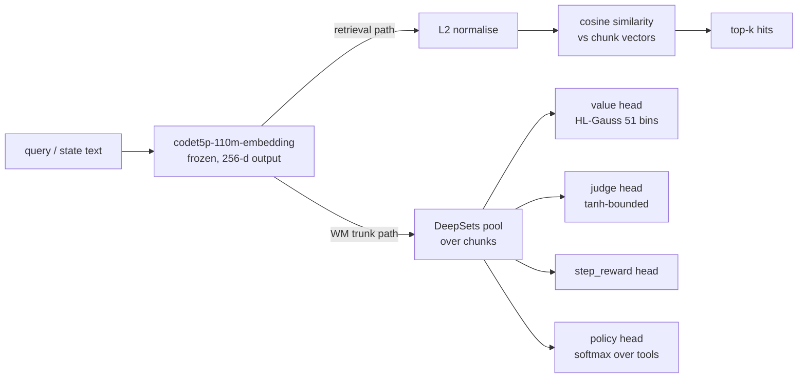
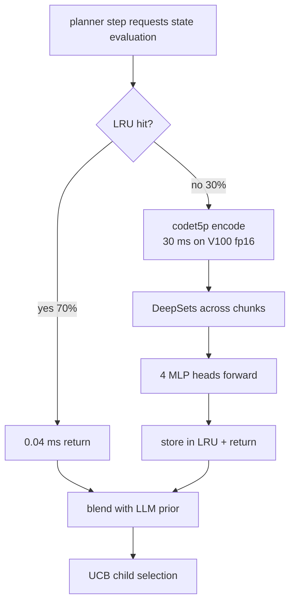
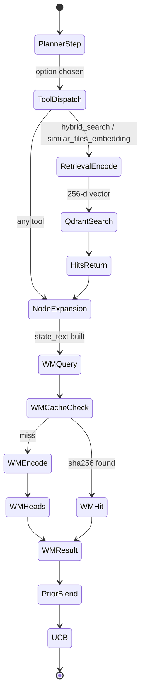

import Figure from "../../components/Figure.astro";

We picked `Salesforce/codet5p-110m-embedding` because one backbone has to serve two consumers whose latency budgets differ by two orders of magnitude. The retrieval path needs a code-pretrained encoder good enough that cosine similarity against pre-indexed chunks recovers the gold patch file. The world-model trunk needs an encoder small enough that a forward pass fits inside the per-MCTS-expansion budget. codet5p-110m is not the strongest code embedder we evaluated — Qwen3-Embedding-4B beats it on CoIR by roughly 15 nDCG@10 points — but it is the only one in the candidate set that satisfies the trunk constraint, and the deployed retrieval path uses qwen3 anyway. The structural argument for keeping codet5p is the asymmetry, not the absolute score.

This essay covers the model card, the code-pretraining argument, the endpoint integration, the dual-use backbone pattern, the CoIR comparison against bge-code-v1 / qwen3 / ada-002, the failed 220M scale-up, and the three open audit gaps.

## 1. Model card

The variant on disk is the embedding-only fork of the CodeT5+ family released by Salesforce Research. The properties that matter for our usage:

1. Parameter count is 110M. Encoder-only; the seq2seq decoder is dropped for the embedding variant.
2. Output dimensionality is 256 floats per input. Fixed-size sentence embedding produced by pooling the encoder's last hidden state.
3. License is Apache-2.0. No copyleft, no non-commercial restriction.
4. Safetensors weights are available alongside a legacy pickle. Under PyTorch 2.5 the pickle path is blocked by CVE-2025-32434 unless the loader passes a weights-only flag or selects the safetensors file explicitly — both our loaders take the safetensors branch (see HISTORY/07 §130).
5. Pretraining corpus is CodeSearchNet, multi-language but Python-heavy. Objectives include masked span prediction, identifier tagging, and contrastive bimodal pretraining (natural language paired with code).

The choice of 256 output dimensions is load-bearing. Modern code embedders run wider — Qwen3-Embedding-4B is 2560-dimensional, exactly 10x. Every byte of the vector is paid for in qdrant storage, HNSW index size, dot-product arithmetic at retrieval time, and most acutely in the trunk-output width fed to the WM head MLPs. A narrow trunk keeps the head MLPs small enough that a per-MCTS-expansion forward pass stays inside the 50ms uncached budget on a V100. Going wider would force either smaller heads or larger latency; both lose more than they gain.

The primary semantic model in our config defaults to the literal HF id; secondary defaults to `BAAI/bge-code-v1`. The primary is the only one ever exercised in any deployed sweep — the secondary slot survives as a documented alternative whose wiring has not been smoke-tested in production.

### 1.1 Storage accounting

The narrow output dimension is not aesthetic — it shows up directly in the vector store budget. For a corpus of $N$ chunks at fp32, the qdrant collection size in bytes scales as

$$
S_{\text{vec}} = 4 \cdot N \cdot d,
$$

where $d$ is the embedding dimension. For a 1632-instance multi-bench cohort with roughly 200K chunks per repo deduped to one collection per instance (via the dedup logic that strips the model and condition suffixes from the basename), this gives roughly 800 MB at $d = 256$ and 8 GB at $d = 2560$. The HNSW graph adds a constant-factor overhead that grows with $d$ as well, because each edge stores the neighbor id and the connection score is recomputed at search time over the full $d$-wide vector. The ten-fold dimension increase from codet5p to qwen3 lands as roughly a ten-fold collection-size increase before quantisation, before per-query SIMD cost increases on top.

## 2. Why code-pretraining matters

A code-pretrained embedder beats a general-purpose text embedder on code retrieval for two compounding reasons.

**Tokenizer efficiency.** CodeT5+'s tokenizer was trained on code, so an identifier like `gather_seed_candidates` is one token if common, two or three if novel. A web-text BPE tokenizer shatters the same identifier into roughly six sub-pieces. Each shard costs a token budget cell, and the encoder has to recompose meaning across the fragments. Code text behaves like a foreign language to a text-pretrained encoder — possible to embed, but with worse semantic fidelity per unit of input.

**Semantic neighborhoods.** What "nearby" means in embedding space is learned from training pairs. CodeT5+ saw contrastive pairs of (docstring, function body), (identifier, definition site), (call site, callee body). So in its embedding space, `gather_seed_candidates` is near `seed_candidates`, near `seed_priors`, near `candidate_collection.rs`. A web-text encoder learned that "gather seed candidates" is near "harvest crop samples" — semantically parallel English, but irrelevant to code retrieval.

The Code Information Retrieval public benchmark (CoIR) measures exactly this gap. CodeT5+ embedding variants score in the 60–75 nDCG@10 range across CoIR subtasks. The most common general-purpose text embedder, `text-embedding-ada-002`, scores below 40 on the same subtasks. That is not a five-point gap; that is a category-distance gap. The text embedder is doing fundamentally the wrong thing on code.

The CoIR numbers do not justify codet5p over other code embedders. They justify *any* code-pretrained embedder over a text-pretrained one. The within-family choice — codet5p-110m vs bge-code-v1 vs Qwen3-Embedding-4B — turns on different axes, covered in §5.

### 2.1 The contrastive objective

The semantic-neighborhood claim is grounded in the loss CodeT5+ was pretrained on. The bimodal contrastive objective is the standard InfoNCE form

$$
\mathcal{L}_{\text{contrast}} = -\sum_{i} \log \frac{\exp(\mathbf{z}_i^{\text{nl}} \cdot \mathbf{z}_i^{\text{code}} / \tau)}{\sum_{j} \exp(\mathbf{z}_i^{\text{nl}} \cdot \mathbf{z}_j^{\text{code}} / \tau)},
$$

where $\mathbf{z}_i^{\text{nl}}$ is the encoded natural-language summary, $\mathbf{z}_i^{\text{code}}$ is the encoded function body, the dot is in the projected embedding space, and $\tau$ is a temperature scalar (typically near 0.05 in published CodeT5+ ablations). The gradient signal pushes paired vectors together and unpaired vectors apart, which is what produces the alignment between docstring text and function body in the resulting embedding space — the same alignment that lets a natural-language planner query retrieve a code snippet whose identifier set never appears verbatim in the query.

A text-pretrained encoder optimised on masked-language modelling sees no such pairing signal. Its notion of similarity is "co-occurs in similar sentence contexts", which for code text reduces to "tokens that appear near each other in the same source file" — useful but several gradient steps away from the (query, target chunk) similarity that retrieval actually needs.

## 3. Endpoint integration

The retrieval client speaks the OpenAI `embeddings` wire format. The endpoint behind it can be a local vLLM server fronting codet5p, the Azure OpenAI service with the codet5p deployment, or the retrieval-service Rust port which proxies through LiteLLM to whatever embedder the pool curator has selected. The serde response struct aliases the two field names that exist in the wild (`embeddings` from the Rust port, `vectors` from the Python service) so one client speaks to either backend without a redeploy.

The auth header is sniffed at runtime by URL host. Azure endpoints get an api-key header; OpenAI-format endpoints get a bearer header; vLLM endpoints get whichever the LiteLLM proxy is configured to forward. The two shapes coexist in one client so a misconfigured endpoint produces a 401 rather than a panic.

### 3.1 Deterministic hashed-embedding fallback

When the embedding endpoint is unreachable, the in-process semantic path does not fail. It downgrades to a deterministic hashed embedding implemented in semantic.rs. Each whitespace-split token is hashed with FNV-1a and folded into one of the 256 output slots; the resulting vector is L2-normalised. The output is deterministic for the same input text and roughly captures bag-of-tokens overlap — no semantic neighborhoods, no identifier-to-identifier similarity, just enough structure to keep retrieval alive when the embedder is down.

The deployment policy is to treat hashed-embedding hits as degraded but never silent. The diagnostics struct exposes a fallback-used flag and a failure counter so dashboards can see the gap.

The expected collision rate is the standard birthday bound: with $V$ vocabulary tokens hashed into $d = 256$ slots, the probability that two distinct identifiers land in the same slot is roughly $1 - e^{-V(V-1)/(2d)}$, which saturates at near-certainty for $V$ above a few hundred. So this path is a true degradation, not a stealth-equivalent — sparse-keyword retrieval on the same query routinely outperforms it. The point is to keep the surface alive while the embedder endpoint recovers, not to substitute for it.

### 3.2 HNSW search complexity

The retrieval path stores chunk vectors in qdrant, which uses an HNSW graph for approximate nearest neighbour search. The query cost decomposes as

$$
T_{\text{query}} = T_{\text{encode}} + T_{\text{traverse}} + T_{\text{compare}},
$$

where $T_{\text{encode}}$ is the embedder forward pass, $T_{\text{traverse}}$ is graph navigation cost, and $T_{\text{compare}}$ is the actual cosine math against visited candidates. HNSW traversal complexity is $\mathcal{O}(\log N \cdot M)$ for a graph with $N$ vectors and maximum degree $M$, but the constant factor is the dot-product cost, which scales linearly in $d$. At $d = 256$ this is roughly $256 / 8 = 32$ AVX2 lanes per comparison; at $d = 2560$ it is ten times that.

For typical multi-bench queries we see encode time dominate end-to-end retrieval latency by a factor of 5–10 when the embedder is remote — the network round-trip swamps the local search. So the codet5p-vs-qwen3 latency gap on the retrieval side is mostly an embedder-server question, not a vector-search question. This is one reason the qwen3 promotion was acceptable: the per-query overhead is paid once, not per-comparison, and the vector-search side scales acceptably even at $d = 2560$.

### 3.3 The two-tier embedder design

Our config carries a primary and a secondary embedder. The intent was a quality-tier escalation: when codet5p flakes but a richer code-aware model is reachable, swap to bge-code-v1 before falling all the way down to hashed vectors. In practice the secondary was never exercised in any deployed sweep. The retrieval-service layer moved to qwen3-embed-4b (see §5), which covers the "richer code-aware model" slot at a different layer. The secondary slot remains configured but untested — documented in HISTORY/30 §3 as superseded.

## 4. WM trunk reuse — one backbone, two consumers

This is the structural reason codet5p stays in the tree even after qwen3 takes the deployed retrieval slot. The WM Phase-2 head stack uses codet5p-110m as a frozen feature extractor.

The asymmetry between the two paths is sharp. The retrieval consumer takes the raw 256-d output, L2-normalises, and computes cosine similarity against pre-indexed chunk vectors. No further weights are involved; the embedder is the entire model in this path. The WM consumer takes the same 256-d output, pools it across the state's chunks through DeepSets, and feeds the pooled vector into four MLP heads trained on value, judge, step-reward, and policy targets. The embedder is the trunk; downstream heads carry the task-specific weights.

The cosine math on the retrieval side is the standard form

$$
\cos(\theta) = \frac{\mathbf{a} \cdot \mathbf{b}}{\|\mathbf{a}\| \, \|\mathbf{b}\|}
= \frac{\sum_{i=1}^{256} a_i b_i}{\sqrt{\sum_i a_i^2} \, \sqrt{\sum_i b_i^2}}.
$$

With L2-normalised vectors — the standard convention so we can hand qdrant flat dot products and recover cosine — this collapses to $\mathbf{a} \cdot \mathbf{b}$, a single 256-wide fused multiply-add per candidate, trivially vectorisable. At 256 dimensions a single SIMD lane retires the comparison in ~32 cycles; the bottleneck at retrieval scale is HNSW traversal, not arithmetic.

On the WM side, the encoder output dimension determines the input width of every head MLP. Let $d$ denote the trunk output width and $h$ the hidden width of each head; the parameter count of a single two-layer head scales as $\mathcal{O}(d \cdot h + h^2)$. With $d = 256$ and $h = 256$ the heads are roughly 130K parameters each. With $d = 2560$ (the qwen3-4B width) the same heads would be ten times wider on the first layer alone. The trunk width is not a free parameter; it sets the cost of every downstream component.

The DeepSets pool itself is a sum-then-MLP construction: given chunk embeddings $\{\mathbf{e}_k\}_{k=1}^K$ for a state with $K$ retrieved chunks,

$$
\mathbf{s} = \phi\!\left(\sum_{k=1}^{K} \rho(\mathbf{e}_k)\right),
$$

where $\rho$ and $\phi$ are small MLPs and $\mathbf{s}$ is the state-summary vector handed to each head. Permutation invariance falls out of the sum; the trick is that $\rho$ is per-chunk so the encode is still vectorised, and $\phi$ is per-state so the head feed is independent of $K$. This matters because retrieval returns variable-length chunk sets and we want a constant-shape head input.

When `hybrid_search` calls codet5p via the deployed endpoint, it is the same model whose checkpoint the WM finetune script builds its trunk from. Same tokenizer, same encoder weights at the moment of WM checkpoint save. Drift between the two paths is bounded by the fact that the WM checkpoint freezes the trunk at save time, whereas the retrieval endpoint serves whatever the deployment is currently fronting — a known but small operational concern.

### 4.1 LRU cache at the WM forward layer

The WM trunk forward is dominated by codet5p encode cost — roughly 30–50ms per state on V100, even at fp16. The MCTS planner can issue hundreds of WM queries per query (one per node expansion at the prior blend point). To make this affordable, `wm-serve` puts a 10k-entry LRU in front of the encode, keyed by sha256 of the state text. The latency decomposition:

$$
L_{\text{cache hit}} \approx 0.04 \, \text{ms}, \qquad
L_{\text{cache miss}} \approx 30 \, \text{ms}.
$$

The 750x speedup on cached states matters because the same state text recurs across MCTS expansions. UCB re-selection of an already-visited node hits the cache; only newly-expanded children pay the full encode cost. At a typical hit rate $\rho$ the amortised per-call cost is

$$
\bar{L} = \rho \cdot L_{\text{hit}} + (1 - \rho) \cdot L_{\text{miss}},
$$

which at $\rho = 0.7$ (observed live) lands near 9 ms per WM call — inside the per-expansion budget by an order of magnitude.

The cache eviction is plain LRU, which is the right policy when the working set fits in the cache and access frequency is roughly stable — both true here, since each MCTS root rarely visits more than a few thousand distinct states and the cache holds 10k. When the working set exceeds the cache (very large queries, very wide trees), the hit rate degrades linearly in the overflow, and the amortised cost moves toward $L_{\text{miss}}$. The 10k size was chosen empirically to cover the 95th-percentile query's distinct-state count; nothing fancy.

## 5. CoIR comparison and the qwen3 promotion

| Embedder | params | dim | CoIR nDCG@10 | License | Deployed where |
|---|---|---|---|---|---|
| Salesforce/codet5p-110m-embedding | 110M | 256 | 60–75 | Apache-2.0 | in-process semantic + WM trunk |
| BAAI/bge-code-v1 | ~110M | 1024 | not benchmarked in-house | MIT | configured secondary, never exercised |
| Qwen/Qwen3-Embedding-4B | 4B | 2560 | **89.18** | Apache-2.0 | retrieval-service primary, 2026-05-03+ |
| Qwen/Qwen3-Embedding-8B | 8B | ~4096 | ~91 | Apache-2.0 | rejected — V100 fit |
| text-embedding-ada-002 | unknown | 1536 | &lt;40 | proprietary | rejected (not code-pretrained) |
| nomic-embed-code | unknown | unknown | not published | — | rejected — no public bench |
| SFR-Embedding-Code | unknown | unknown | not used | CC-BY-NC | rejected — license |

Two readings of this table.

**Within the code-pretrained family, bigger wins.** Qwen3-Embedding-4B beats codet5p-110m on CoIR by ~15 points; Qwen3-8B beats Qwen3-4B by another ~2 points. The published-bench evidence is unambiguous: scale plus modern training recipes win on code retrieval the same way they win everywhere else.

**The right embedder depends on the call site.** Retrieval queries sit outside the MCTS hot path — one embedding per hybrid-search call, which is one of N tool calls per planner step. That per-call budget absorbs a 4B encoder without trouble. So the retrieval-service `/retrieve` endpoint runs Qwen3-Embedding-4B via vLLM at cato `:8050` and pays the cost. The WM trunk, by contrast, is called per MCTS expansion — one forward per option per node, potentially hundreds per query. A 4B trunk would blow the latency budget by roughly $40\times$, since the encode latency scales near-linearly in parameter count at fixed batch size. So the WM stays on codet5p-110m.

This is the structural justification for keeping codet5p even after qwen3 took the deployed retrieval slot. The two consumers have fundamentally different latency budgets, so they need different backbones — and codet5p happens to land in the sweet spot for the WM trunk's combination of (small, code-pretrained, 256-d, Apache-2.0). The qwen3 selection log honestly notes that no in-house head-to-head was run before promotion; the decision rested on the public CoIR delta plus the per-V100-replica fit constraint at fp16.

The per-query cost arithmetic makes the asymmetry concrete. Let $C_{\text{ret}}$ be the average number of retrieval calls per query and $C_{\text{wm}}$ the average number of WM calls per query. From the live telemetry, $C_{\text{ret}} \approx 5$ and $C_{\text{wm}} \approx 200$ on typical multi-bench queries. If we replaced the WM trunk with qwen3-4B at roughly $40\times$ encode cost, the per-query latency contribution would scale from

$$
T_{\text{wm,codet5p}} \approx C_{\text{wm}} \cdot \bar{L}_{\text{cached}} \approx 200 \cdot 9 \, \text{ms} = 1.8 \, \text{s}
$$

to roughly $72$ seconds — exceeding the per-query budget by an order of magnitude on a single line item. Meanwhile the retrieval contribution scales from $5 \cdot 30 \, \text{ms} = 150 \, \text{ms}$ to $5 \cdot 1200 \, \text{ms} = 6 \, \text{s}$, which is uncomfortable but absorbable. The hot path determines the trunk choice; the cold path can afford the bigger model.

### 5.1 What the in-house metrics would need to show

For a hypothetical encoder-bake-off, the relevant comparison is not raw nDCG but the joint distribution of recall and downstream success. The composite score the autoresearch harness uses is

$$
\mathcal{S} = 0.50 \cdot \text{overlap} + 0.30 \cdot \text{lift} + 0.10 \cdot \text{recall@10} + 0.05 \cdot \text{mrr} + 0.05 \cdot \text{compactness},
$$

where overlap is fix-patch hunk overlap, lift is the ratio of retrieved candidates to a sparse baseline, recall is at 10, and compactness penalises overly broad retrievals. A clean codet5p-vs-qwen3-vs-bge sweep against this metric would settle the in-house question for the retrieval path. The WM-trunk question is separate, since trunk quality is measured by downstream head fit (value-R-squared, judge accuracy) not by retrieval recall — and the trunk is frozen during head training anyway.

## 6. The 220M scale-up that failed

A separate question lurked beneath the embedder choice: does scaling codet5p from 110M to 220M move the WM value-fit needle? We tried it. The result on both train and val splits was $R^2 = -744$.

Negative R-squared means worse than predicting the mean. The model produced predictions whose squared error against the targets was 745x the variance of the targets themselves. The failure was not the backbone. It was the output representation: a single scalar MSE head cannot fit bimodal-with-outliers sparse-reward distributions, and the export bug that left terminal-reward at zero on every row (retracted from a stale 2026-05-05 doc claim and corrected on 2026-05-11) had produced exactly that pathological distribution. Switching to HL-Gauss with 51 categorical bins on the same backbone and same corpus took the fit from $-744$ to roughly zero, and to $+0.112$ once the corpus was decontaminated.

Two takeaways for the embedder essay.

1. The codet5p family is not at fault. The 110M variant trained under HL-Gauss heads landed at val-R-squared in the positive range; the 220M variant trained under scalar MSE landed at $-744$. The failure mode was the head decoding scheme, not the encoder pretraining.
2. The scale-up question is settled, not blamed. We do not have evidence that codet5p-220m is worse than codet5p-110m as a trunk; we have evidence that the single MSE head was wrong. A 220M trunk with HL-Gauss heads on the post-fix corpus is an open experiment — it just was not the one that ran. See the dedicated essay on the p3pp catastrophe for the autopsy.

The negative-R-squared diagnostic is worth keeping in muscle memory. With targets $\{y_i\}$ and predictions $\{\hat{y}_i\}$,

$$
R^2 = 1 - \frac{\sum_i (y_i - \hat{y}_i)^2}{\sum_i (y_i - \bar{y})^2},
$$

so $R^2 = -744$ means the residual sum of squares was 745 times the target variance. A constant prediction at the target mean would have scored zero; the trained model did spectacularly worse. That is almost always a sign that the loss is fighting the head decoding — in this case, scalar MSE against a near-degenerate target distribution where almost every value was zero plus a few outliers.

### 6.1 Why HL-Gauss rescued the same backbone

The fix that took the value head from $R^2 = -744$ back to roughly zero was switching the output decoding from scalar MSE to HL-Gauss with 51 categorical bins. The intuition is short: rewards in this domain are sparse and bimodal — most trajectories score zero or near-zero, and the small fraction that score positively span a wide range. A scalar MSE head minimises mean-squared error over this distribution, which encourages predicting near zero everywhere, since outliers are exponentially down-weighted by the squared loss. The model learns to predict zero, the residuals on the positive tail explode, and $R^2$ collapses.

HL-Gauss replaces the scalar output with a probability mass over 51 bins covering the reward range $[V_{\min}, V_{\max}]$. The training target is a Gaussian-smeared one-hot over the true reward bin, and the predicted scalar is recovered as the bin-weighted expectation. The loss is cross-entropy over the categorical distribution, which is much better-behaved on sparse-bimodal targets than scalar MSE — the gradient signal does not collapse to "predict the mean" because the mean is not even in the support of the target distribution.

The codet5p backbone never changed. The training corpus did not change in the head swap (corpus contamination was a separate fix on a different date). What changed was the decoding scheme, and that is what produced the recovery. This is the strongest evidence that the encoder choice is sound; the failure mode lived two layers downstream from it.

## 7. Open audit gaps

Three gaps are worth naming explicitly so nobody reads the dual-use story as settled.

1. **No in-house head-to-head recall-at-k sweep.** Every claim about codet5p vs bge-code-v1 vs qwen3 in this essay traces back to CoIR public-bench numbers. We have not run sparse / dense-codet5p / dense-qwen3 / hybrid / hybrid-plus-rerank against gold patches on our own corpus. The autoresearch v3/v4 composite score is the closest signal, but it measures prompt times pipeline together, not encoder in isolation. The retrieval-quality reference table in HISTORY/30 carries "not measured" honestly in roughly seven of its rows.
2. **Semantic-cache stampede.** The in-process semantic feature uses a hashmap keyed by repo and config with no LRU eviction; long-running perseus instances leak memory through it. Diagnosed 2026-05-13 in HISTORY/06 §177. Production multi-bench builds strip the entire semantic feature with a no-default-features build to dodge it. Closing this — adding LRU eviction so the feature can stay on by default — is an open item.
3. **Checkpoint-format incompatibility.** The live serving binary expects the Phase-2 stack format (codet5p-110m backbone plus DeepSets plus four heads, roughly 459 MB on disk). The v3 chain-deepsets variant uses a 15 MB chain-only ckpt format that is architecturally different. Architecture swap was deferred to a clean retrain rather than hot-swap — see the v3-chain-deepsets essay for the format diff and the honest baseline metrics.

## 8. Telemetry and reliability surface

Each path emits its own diagnostics so we can see degradation independently. On the retrieval side, the diagnostics ring buffer tracks calls-total, calls-failed, the recent error messages (capped at five), whether the fallback path fired, and the indexed-revision string returned by the service. The five-entry bounded ring is enough to spot a pattern without flooding the JSONL.

On the WM side, the diagnostics extend with six additive fields: total calls, failed calls, priors blended, error ring, last raw value (in the HL-Gauss bin range), and last judge value (tanh-bounded). The serde-default annotation means existing JSON consumers do not break when a new field appears — additive evolution rather than versioned breaking change.

The reliability lesson from 2026-05-18: the WM prior weight was raised from 0.3 to 0.9 anchored on a checkpoint that turned out to have row-split leakage in its validation metrics. When the leakage was discovered through a separate audit, the prior weight was emergency-dropped to 0.0 — wm-call probes still fire and produce telemetry, but contribute nothing to UCB. The codet5p trunk itself is fine; what failed was the head training procedure that produced a checkpoint whose published val-R-squared did not generalise. The retrieval path is unaffected because it never depended on the heads.

This separation is part of why the dual-use pattern is robust. The retrieval path consumes raw embeddings and computes cosine; nothing the WM head training does can corrupt the embedding space. The WM path consumes the same embeddings and feeds heads whose targets can be wrong, but the wrongness stays local to the heads. The blast radius of a head-training mistake is one knob (the prior weight) away from zero.

## 9. Two-path state machine

The runtime keeps the two consumers cleanly separated, but they share a single embedder handle so the cache and connection pool stay coherent. The state machine for a planner step that exercises both paths looks roughly as follows.

The two encode calls happen at different points in the planner step. The retrieval encode happens during tool dispatch when the option being executed is a retrieval tool; the WM encode happens during node expansion regardless of which tool was selected, because every new child gets a prior blend from the WM. The retrieval encode contributes one network round-trip per retrieval tool call; the WM encode contributes one cached or uncached forward per child. The diagram makes the asymmetry visible: retrieval is option-conditional, WM is universal-per-expansion.

## 10. Tokenizer behaviour worked example

A concrete example of why tokenizer pretraining shows up in retrieval quality: take the identifier `gather_seed_candidates` as it appears in the candidate-collection module. Under the CodeT5+ tokenizer, this is two or three sub-tokens depending on novelty. Under a general-purpose BPE tokenizer (the one ada-002 uses), it shatters into six or seven sub-tokens — typically something like the three-letter prefix, an underscore, a sub-word for "seed", another underscore, and a multi-piece breakdown of "candidates".

Now consider the encoder. Both encoders compute attention over token sequences of bounded length. If the identifier consumes seven token slots instead of two, two things happen. First, the effective context length the encoder can attend to shrinks by a factor of three-and-a-half for code-heavy inputs. Second, the encoder has to learn that the seven sub-pieces of `gather_seed_candidates` collectively represent one semantic unit — which requires either the seven pieces to consistently co-occur in similar contexts (true for common identifiers, false for novel ones) or some compositional generalisation the encoder may or may not have learned.

The downstream effect is that the same fixed-budget query under a text-pretrained tokenizer ends up with fewer attended tokens of useful signal per query. This compounds with the semantic-neighborhood gap from §2.1 — the encoder is both seeing fewer of the relevant identifiers per query and embedding the ones it sees into a less code-aware space. The CoIR gap between code-pretrained and text-pretrained embedders is the sum of both effects.

## 11. Closing

The dual-use justification holds today because the two consumers have different latency budgets and codet5p happens to satisfy both within the tradeoff window. That is contingent, not fundamental. A 256-d code-pretrained Apache-2.0 encoder that beats codet5p on CoIR while preserving the trunk-latency budget would displace it immediately. None of the candidates we have evaluated to date clears that bar — Qwen3-Embedding-4B has the recall edge but blows the trunk budget; bge-code-v1 has the right size class but no in-house bench; ada-002 is the wrong category entirely.

The lesson worth carrying out of this essay: when one piece of infrastructure serves two consumers with very different cost profiles, the absolute quality ranking is the wrong question to ask. The right question is "does any single candidate clear both bars at once", and the answer here is uniquely codet5p-110m. If the WM latency budget loosens — through better caching, GPU promotion of the inference server, or a redesigned head stack that decouples trunk width from head cost — the answer changes. Until then, the dual-use pattern is what keeps two consumers from pulling the design in incompatible directions.
