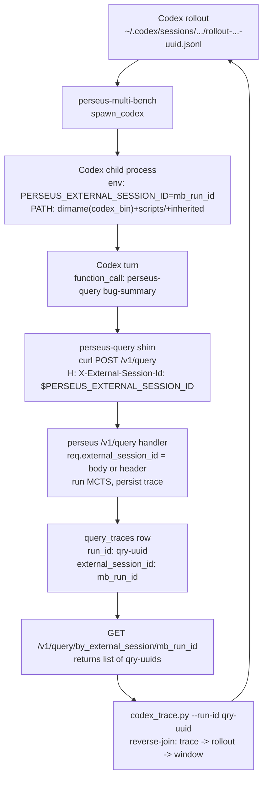

> tl;dr: Codex is one consumer of perseus, not part of its core. Three
> pieces of glue thread a perseus `run_id` back to the Codex rollout
> that spawned it: a `perseus-codex` CLI shim that auto-detects the
> active rollout (env → `lsof $PPID` → newest-mtime fallback), an
> `X-External-Session-Id` header that round-trips through the
> `query_traces.external_session_id` column, and a `codex_trace.py`
> reverse-join script that prints an event window from the Codex side
> given a perseus `run_id`. Before 2026-04-25 none of this existed.
> The muzero-export pipeline tried to join `multi_bench_runs.run_id`
> (`<instance>-<uuid>`) against `query_traces.run_id` (`qry-<uuid>`),
> got the empty set every time, and emitted training rows with
> `action_name='unknown'` and empty `visit_distribution`. The fix is
> not in core. It's in `lab/codex/` and stays there.

## 1. The V2 problem

Two run_ids. Two namespaces. Zero overlap.

The multi-bench driver inserts one row per `(instance, model,
condition)` into `multi_bench_runs` and stamps a primary key of the
form `<instance>-<uuid>`, e.g. `astropy__astropy-12907-a3f8c1d2-...`.
That row is the trajectory's outer key — it carries the bug, the
gold patch, the F2P/P2P test lists, the eventual judge label.

Inside that row's lifecycle, Codex shells out one or more times to
the perseus `/v1/query` endpoint to get retrieval hits. Each call
generates a `query_traces` row keyed by `qry-<uuid>` (a fresh uuid
minted server-side at query time). That row carries the perseus
side of the story: planner events, MCTS step snapshots, tool events,
the final hits, the diagnostics blob.

The two namespaces are disjoint by construction. `<instance>-<uuid>`
never starts with `qry-`. `qry-<uuid>` never carries an instance
prefix. The naive join

```sql
SELECT *
FROM multi_bench_runs mb
JOIN query_traces qt ON qt.run_id = mb.run_id
```

returns zero rows on every cohort, every time.

This wasn't noticed initially because downstream consumers mostly
didn't need the join. The sweep driver tracked outcomes via
`multi_bench_runs.status`. The dashboard rendered each side
separately. The training pipeline — muzero-export — was the first
system that needed both sides stitched per-step.

The symptom in muzero-export was concrete. Each parquet row carried
fields like `action_name`, `visit_distribution`,
`chosen_action_index` meant to come from the perseus side
(`tool_events` for actions, `mcts_step_snapshots` for visits). The
join returned nothing, so every step got the default:
`action_name='unknown'`, `visit_distribution=[]`,
`chosen_action_index=null`. The policy head was training against a
constant.

The architectural answer was obvious in hindsight: add a column the
multi-bench side can populate at query time, that perseus persists
verbatim, that downstream tools reverse-join on. Call it
`external_session_id`. Make it nullable. Don't retrofit the
`run_id` namespace; just add the explicit link column.

## 2. The fix (2026-04-25)

Three pieces, none of them in core.

### Piece one: the `perseus-codex` CLI shim

For the interactive case — a developer at a Mac terminal running
`codex`, with Codex shelling out to `perseus` to get retrieval hits
mid-session — perseus has no way to know which Codex rollout file
the call belongs to. The Codex CLI doesn't pass its session id to
its subprocesses. So we wrote a wrapper.

`scripts/perseus-codex` is a bash shim that runs a three-fallback
discovery chain before exec-ing the real `perseus` binary:

1. **`$CODEX_SESSION_ID`** — if the caller set this env var
   explicitly, take it verbatim. Always wins. The escape hatch for
   automation that knows its own session.

2. **`lsof -p $PPID`** — enumerate the parent process's open file
   descriptors and grep for the rollout JSONL path. Codex keeps its
   rollout file open for appending throughout a session, so its path
   shows up in the parent's open-fd list. Extract the uuid via

   ```bash
   sed -n 's/.*rollout-.*-\([0-9a-f-]\{36\}\)\.jsonl.*/\1/p'
   ```

   The middle field captures the ISO timestamp without constraining
   its format — Codex has changed it a few times.

3. **Newest mtime under `~/.codex/sessions/`** — `ls -t` sorted
   newest-first, take the head, but only if its mtime is within 30
   seconds. The 30-second window is the key guardrail: a stale
   session from yesterday must not have its id stapled onto today's
   unrelated `perseus` invocation. 30s matches Codex's typical
   "function_call → function_output" turn budget, so a real
   in-flight session is still inside the window.

If all three fail, the shim exec's `perseus` with the same argv it
received, logs `no active Codex session detected; running perseus
unchanged` to stderr, and proceeds. The perseus call still works;
the row just lands with `external_session_id = NULL` and can't be
reverse-joined later. Soft failure.

When discovery succeeds, the shim exec's `perseus "$@"
--external-session-id "$sid"`. `exec` not subshell — so perseus's
exit code propagates verbatim and signals land directly on the
child. The stderr log line is critical for debugging "why is
`external_session_id` NULL on this trace": without it the failure is
silent.

### Piece two: the `X-External-Session-Id` header path

For the sweep case — perseus-multi-bench spawning Codex
non-interactively, with Codex calling `perseus-query` on every
retrieval step — there's no rollout-file lookup to do. The
multi-bench driver already knows the session id: it's the
`multi_bench_runs.run_id` it just inserted. The chain is:

1. Driver builds `mb_run_id = "<instance>-<uuid>"` and inserts the
   `multi_bench_runs` row.
2. Driver calls `spawn_codex(... mb_run_id)` which sets the env var
   `PERSEUS_EXTERNAL_SESSION_ID=<mb_run_id>` on the child.
3. Codex child boots with that env var in scope.
4. Codex's prompt instructs it to call `perseus-query "<bug
   summary>"` as its first action. (Codex is the LLM; the prompt is
   how we steer it.)
5. `perseus-query` reads `$PERSEUS_EXTERNAL_SESSION_ID` and fires
   `curl -sS -X POST -H "X-External-Session-Id:
   $PERSEUS_EXTERNAL_SESSION_ID" $PERSEUS_URL/v1/query --data-binary
   "$BODY"`.
6. Perseus's `/v1/query` handler reads the header, runs MCTS, and
   persists a `query_traces` row with `external_session_id =
   <mb_run_id>`.

The HTTP wire supports both body field and header. `core::contracts::QueryRequest`
declares `external_session_id: Option<String>` with `#[serde(default)]`;
the handler reads the header as a fallback when the body doesn't
carry the field:

```rust
if req.external_session_id.is_none() {
    req.external_session_id = header_str(&headers, "X-External-Session-Id");
}
```

Body wins on conflict — the body field is "explicit caller intent."
The header is the fallback for callers that can only set headers
(like a curl-based shim driven by environment variables).

`migrations/003_external_trace.sql` adds both columns nullable plus
a partial index excluding NULL rows so size scales with the
fraction of session-tagged traces. `external_step_id` is the
sibling sub-id for callers wanting to distinguish multiple perseus
calls within a session — multi-bench's retrieval-only mode fans out
3 variants per row and tags each (`issue_full`, `error_focus`,
`symbol_focus`).

### Piece three: `codex_trace.py` reverse-join

Given a perseus `run_id`, walk it back to the originating Codex
turn. `scripts/codex_trace.py` is stdlib-only Python 3.11+ with two
modes.

`--run-id <perseus_run_id>` mode:

1. `GET /v1/runs/<run_id>/trace` via `urllib.request`. Exits 2 on
   404.
2. Read `trace["external_session_id"]`. Exit 4 if absent — the
   trace wasn't invoked via the shim.
3. Glob `~/.codex/sessions/**/rollout-*-{session_id}.jsonl`. Exit 3
   if no match.
4. Read the rollout file line-by-line, JSON-decode each line
   (silently skip malformed lines).
5. `pick_window(events, window)` scans for the first
   `function_call` event whose dumped payload contains
   `"perseus"` (case-insensitive substring). That's the anchor: the
   Codex turn that invoked perseus. Return `events[anchor - window :
   anchor + window + 1]`, default `window=20`.
6. Print each event as `json.dumps(ev, indent=2, sort_keys=True)`.

`--session-id <uuid>` mode skips the perseus lookup entirely. Glob
directly for the rollout file by uuid and dump all events. Useful
when you know the rollout uuid from the shim's stderr log and just
want to inspect the Codex side without round-tripping through the
DB.

The whole thing is ~150 lines. No dependencies beyond Python
stdlib. Runs on the Mac, on cato, on engram — anywhere the rollout
files happen to live (or are NFS-mirrored).

## 3. The `spawn_codex` PATH-prepend fix

Adjacent to the session-id work but technically a separate bug. The
multi-bench driver's `spawn_codex` function in
`src/multi_bench/runner.rs` spawns Codex as a non-interactive
subprocess on the cato workers. Codex ships as a Node.js shell
script with `#!/usr/bin/env node` at the top.

Under non-interactive ssh — the way the multi-bench driver invokes
Codex on cato — `node` was not on the inherited `PATH`. nvm
initializes only in interactive shells; the non-interactive PATH is
the minimal one from `/etc/environment`. Codex would exit before
its first chat call with `env: 'node': No such file or directory`.
The driver, watching for an empty `git diff` after the codex run,
would classify the row as `FailureLabel::CodexNoPatch` and retry.
The retries would fail the same way. The row would eventually flip
to `failed` with the unhelpful label.

The fix prepends `dirname(codex_bin)` to the child's `PATH`:

```rust
let existing = std::env::var("PATH").unwrap_or_default();
let mut prefix = String::new();
if let Some(parent) = cfg.codex_bin.parent() {
    prefix.push_str(&parent.to_string_lossy());
    prefix.push(':');
}
if let Ok(cwd) = std::env::current_dir() {
    let scripts = cwd.join("scripts");
    if scripts.is_dir() {
        prefix.push_str(&scripts.to_string_lossy());
        prefix.push(':');
    }
}
cmd.env("PATH", format!("{prefix}{existing}"));
```

`dirname(codex_bin)` is where the sibling `node` from the same
install lives. `$cwd/scripts` is prepended too so the spawned Codex
finds `perseus-query` on PATH — Codex's prompt references it by
bare name, and without the prepend Codex would fall back to
hand-rolling curl, which broke on shell-hostile characters in real
bug summaries (parens, backticks, ellipses).

Two ssh-environment problems in one block. Both surface as "empty
patch" at the driver level; only the stdout.log reveals `node: not
found`. Bug class: silent environment failures masquerading as
model failures.

## 4. The new HTTP surface

`GET /v1/query/by_external_session/{sid}?limit=<n>` returns every
perseus `run_id` whose `external_session_id` matches the given sid,
ordered by `occurred_at desc`, truncated to `limit` (default 50,
clamped to 1000).

Defined in `src/api/router.rs`:

```rust
.route(
    "/v1/query/by_external_session/{sid}",
    get(handlers::query_by_external_session),
)
```

The handler delegates to
`App::list_query_traces_by_external_session(sid, limit)` which
delegates to
`Store::list_query_traces_by_external_session(sid, limit)`. The
postgres impl is a straightforward query against the partial index
from migration 003:

```sql
SELECT run_id, occurred_at, index_id, query, top_k, external_step_id
FROM query_traces
WHERE external_session_id = $1
ORDER BY occurred_at DESC
LIMIT $2
```

The returned projection is metadata only — `run_id`, `occurred_at`,
`index_id`, `query`, `top_k`, `external_step_id`. The full
`record` JSONB (hits + scorecard + MCTS snapshot + graph) is left
out for response size. Callers who need the full trace follow up
with `GET /v1/runs/{run_id}/trace`.

`codex_trace.py` is the primary consumer of this endpoint, but
it's also useful from the dashboard and from ad-hoc shell debugging
during a sweep:

```bash
curl -s "http://66.172.10.101:18192/v1/query/by_external_session/<mb_run_id>?limit=100" | jq .
```

Returns `{traces: [{run_id, occurred_at, ...}]}`. Each entry is a
separate perseus MCTS call that the same Codex session made.
Cardinality of 0 on a `condition='perseus'` row is the canonical
"integration broken" signal: either the env var wasn't threaded
through `spawn_codex`, or Codex bypassed `perseus-query` and used
raw curl without the `-H` flag.

## 5. The flow, end-to-end

The whole trace-join thread in one picture:



Forward: rollout uuid threaded as env var, threaded as header,
landed in DB column. Reverse: DB column queried, rollout file
located, event window extracted.

## 6. Why this lives in `lab/codex/`

Codex is one consumer of perseus. There will be others. There
already are others — perseus-multi-bench itself is a non-Codex
consumer (the retrieval-only mode bypasses Codex entirely and POSTs
directly to `/v1/query`), and operators calling the HTTP API by
hand are a third.

The generic primitive — "let a caller stamp a session id on a
query, persist it, expose a reverse-lookup endpoint" — belongs in
core. That's what `external_session_id` on `QueryRequest`, the
header alias, the `query_traces` column, and
`/v1/query/by_external_session/{sid}` collectively are. None of
those know about Codex. They'd work the same for a Claude Code
consumer, an internal agent, a future tool.

Codex-specific glue knows Codex's specific rollout file layout,
`$CODEX_HOME` convention, and `node`-shebang gotcha:

- `perseus-codex` knows the rollout filename pattern
  `rollout-<timestamp>-<uuid>.jsonl` and the directory layout
  `~/.codex/sessions/<YYYY>/<MM>/<DD>/`.
- `spawn_codex` knows about Codex's `#!/usr/bin/env node` shebang
  and about `$CODEX_HOME` redirection for sweep isolation.
- `codex_trace.py` knows the rollout event schema: `task_started`,
  `function_call`, `function_output`, `reasoning`, `task_completed`.
- The prompt rewrite (`PERSEUS_SYSTEM_PROMPT`,
  `render_perseus_prompt`) knows what Codex needs to be told about
  the `perseus-query` shim, the env vars, the header contract.

None of this generalizes. A Claude Code integration would have its
own session-file convention, home-dir layout, prompt vocabulary,
and gotchas. Putting any of this in core means either a
Codex-shaped interface others work around or a generic abstraction
that's Codex-with-extra-steps. Both are worse than `lab/codex/`.

`lab/codex/README.md` makes the graduation criterion explicit: this
module never graduates wholesale. The generic primitive is already
in core. Codex-specific helpers stay in `lab/` forever. CI
grep-fails any `from perseus.lab.codex` import inside `core/**`.
The boundary is enforced, not hoped-for.

## 7. What this enables downstream

Three things, in order of impact.

**MuZero export.** Before, every training row had
`action_name='unknown'`. After,
`list_query_traces_by_external_session(mb_run_id, N)` returns the
list of perseus calls; per call, `list_mcts_steps` returns the root
visit distribution and `list_tool_events` returns the executed
action. The trajectory assembler in `src/muzero/trajectory/mod.rs`
walks all three and emits parquet rows decorated with the real
action name, visit distribution, planner prompt, and completion.
The policy and reward heads finally have signal.

**End-to-end debugging.** "Codex called perseus 3 times during this
mb row; the patch was empty. Where did it break?" becomes
tractable: forward via `stdout.log` (count `perseus-query`
invocations), bridge via
`/v1/query/by_external_session/<mb_run_id>` (list of perseus
`run_id`s), forward per run via `/v1/query/<run_id>/events`
(planner call sequence, tool calls, confirm_stop, give_up), reverse
via `codex_trace.py --run-id <run_id>` (rollout event window). Each
step is one curl or grep.

**Cohort sanity checks.** The query

```sql
SELECT
  mb.run_id,
  COUNT(DISTINCT qt.run_id) AS perseus_run_count
FROM multi_bench_runs mb
LEFT JOIN query_traces qt
  ON qt.external_session_id = mb.run_id
WHERE mb.condition = 'perseus'
  AND mb.completed_at > now() - interval '24 hours'
GROUP BY mb.run_id
HAVING COUNT(DISTINCT qt.run_id) = 0
LIMIT 50;
```

returns the rows where the perseus condition was selected but no
perseus call was ever made. That's a broken-integration signal,
detectable in seconds, fixable before contaminating a whole sweep.
The 2026-04-25 fix made it possible to ask this question; the
`policy_fingerprint` work later that day made it possible to ask it
per-cohort.

See [the reset](/essays/the-reset/) for the broader fingerprint and
cohort-hygiene story this fits into. See [multi-swe-bench
wiring](/essays/multi-swe-bench-wiring/) for the harness side of the
same sweep pipeline — different bug class, same era, same lesson:
silent integration failures are worse than loud ones, and joining
on the right column matters more than picking the right one to
start with.

---

## Sources

- `parking_lot/v2_archive_2026-05-18/HISTORY/45_codex_integration.md`
  §1–§12 — the canonical V2 codex-integration writeup. Shim
  discovery chain, `spawn_codex` PATH-prepend, HTTP wire, migration
  003, MuZero-export trajectory decoration, debugging recipe.
- `lab/codex/README.md` — scope, graduation criteria, ADR-006 /
  ADR-012 boundary rationale, current status (empty;
  V2-archive-port pending).
- `Claude.md` 2026-04-23 (external-session-trace branch) — the
  `QueryTraceRecord` field additions, the
  `migrations/003_external_trace.sql` partial index, the
  `--external-session-id` / `--external-step-id` CLI flags, the
  `perseus-codex` shim's three-fallback discovery, the
  `codex_trace.py` reverse-join.
- `Claude.md` 2026-04-25 (multi-bench ↔ perseus trajectory
  linkage) — the run_id namespace problem, the
  `PERSEUS_EXTERNAL_SESSION_ID` env-var threading, the muzero-export
  walk through `external_session_id`.
- `Claude.md` 2026-04-25 (experiment-integrity fixes) — the
  `spawn_codex` PATH-prepend that resolved `node: not found` under
  non-interactive ssh.
- `src/api/handlers.rs::query_by_external_session`,
  `src/api/router.rs` — the HTTP surface.
- `src/multi_bench/runner.rs::spawn_codex`,
  `src/multi_bench/prompt.rs` — the sweep-side integration and the
  Codex-facing system prompt.
- `scripts/perseus-codex`, `scripts/perseus-query`,
  `scripts/codex_trace.py` — the three pieces of glue themselves.
