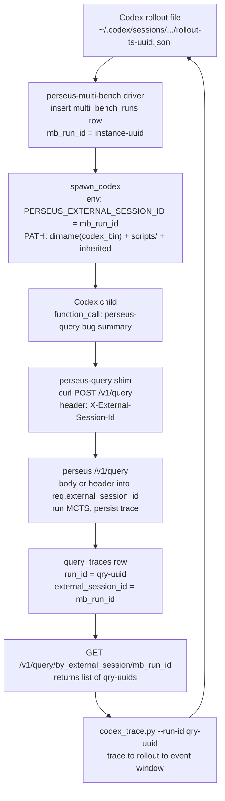
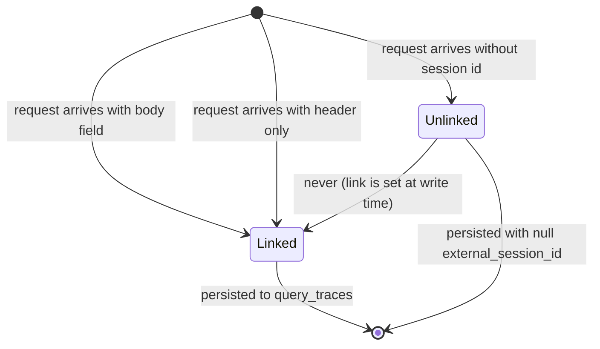

We claim that the right way to stitch Codex rollouts to perseus retrieval traces is a single nullable
column on `query_traces` plus three pieces of glue outside the core. The column is the contract; the
glue is disposable. Before 2026-04-25 this contract did not exist, and the consequence was a MuZero
policy head training against a constant: every parquet row had `action_name='unknown'` and an empty
visit distribution because the join we needed could not succeed by construction. The fix is not in core.
It is in `lab/codex/`, and we argue here that it should stay there forever.

The strong version of the claim has three parts. First, the link must be carried by the request and
persisted by the server; inferring it server-side from timing or content correlation is unsound and we
should not try. Second, the link must be optional; making it required would force every non-Codex
consumer to invent a session id it does not have. Third, the reverse-direction lookup must be a
first-class HTTP endpoint, not a SQL incantation; the asymmetric cost of "easy to write a trace, hard to
read it back" is exactly how an integration silently degrades for weeks before anyone notices.

## 1. Two namespaces, zero overlap

The multi-bench driver inserts one row per `(instance, model, condition)` triple into the runs table
with a primary key of the form $\textsf{instance}\text{-}\textsf{uuid}$, e.g.
`astropy__astropy-12907-a3f8c1d2-...`. That row is the outer key of a trajectory: it carries the bug,
the gold patch, the F2P/P2P test lists, the eventual judge label.

Inside that row's lifecycle, Codex shells out one or more times to the perseus retrieval endpoint. Each
call mints a fresh `query_traces` row keyed by $\textsf{qry}\text{-}\textsf{uuid}$, a uuid generated
server-side at query time. That row holds the perseus-internal story: planner events, MCTS step
snapshots, tool events, hits, diagnostics.

The two namespaces are disjoint. An instance-prefixed id never starts with `qry-`; a query id never
carries an instance prefix. The naive equi-join on `run_id` returns the empty set on every cohort, every
time. Concretely, if $M$ is the multi-bench table and $Q$ is the query-traces table, then

$$
|M \bowtie_{\text{run\_id}=\text{run\_id}} Q| = 0
$$

for every sweep we have ever run, and for every sweep we ever will, because the keys are minted by
disjoint generators.

This was tolerable for a while because nothing downstream needed the join. The driver tracked outcomes
via the multi-bench status column. The dashboard rendered each side independently. The first system that
actually needed both sides stitched per-step was MuZero export, and the symptom was loud: a constant
policy target. The fields meant to come from the perseus side (`action_name` from `tool_events`, the
visit distribution from `mcts_step_snapshots`, `chosen_action_index`) all collapsed to their defaults.
The policy head was learning nothing because there was nothing to learn from.

A loss-function sanity check makes the point. The MuZero policy loss is the cross-entropy of the network
output against the search visit distribution $\pi^M_t$ at each step:

$$
\mathcal{L}_\pi = -\sum_t \sum_a \pi^M_t(a)\, \log p_\theta(a \mid s_t).
$$

When the join silently fails, $\pi^M_t$ degenerates to the all-zeros vector (or a uniform vector after a
defensive normalization), and the gradient $\nabla_\theta \mathcal{L}_\pi$ either drives the network to
a degenerate constant or vanishes outright. In neither case is there learning signal. The reward and
value heads were similarly starved on the cross-traversal of trajectory and step. A constant target is
not a small bug; it is the absence of the training data the head exists to consume.

The architectural answer is forced once you state the problem. We do not get to retrofit the run-id
namespace; the keys are already in use by both sides. What we can do is add an explicit link column the
multi-bench side populates at query time, perseus persists verbatim, and downstream tools reverse-join
on. We named it `external_session_id`. We made it nullable. We did not touch the existing keys.

We considered three alternatives and rejected them. The first was to make perseus mint a deterministic
id from query content plus a timestamp; this is fragile under retries and under benign re-runs (the same
query at two times is two different traces and must be kept distinct, while the same query in a single
sweep is one trace and must stay singular). The second was to put the link in the response and have the
caller persist it; this puts the contract on the wrong end of the wire, because the caller is the one
with the authoritative session identity and the server is the one writing the durable row. The third was
to log the link to a sidecar JSONL and never touch the database schema; this trades a real index for a
grep, and at sweep scale that is the difference between a one-second query and a five-minute scan. The
chosen design has one column, one nullable header, one partial index, and one new HTTP route. It is the
smallest contract we could find that admits both forward and reverse lookups in $O(\log n)$.

## 2. Three pieces of glue

Glue has a structure. There is a forward path that stamps the link onto a query as it happens, and a
reverse path that walks from a perseus trace back to the originating Codex turn. The forward path splits
cleanly into an interactive case (a developer at a terminal) and a sweep case (a non-interactive
subprocess), and they want different mechanisms. The reverse path is a single script. We describe each
in prose; the structural argument is in the diagram in section 4.

### The CLI shim, for the interactive case

In the interactive case a developer runs Codex at a terminal and Codex shells out to perseus mid-session
for retrieval. Perseus has no way to know which rollout file the call belongs to because the Codex CLI
does not pass its session id to its subprocesses. We wrote a wrapper, `perseus-codex`, that runs a
three-fallback discovery chain before exec-ing the real perseus binary.

The first fallback is an environment variable named `CODEX_SESSION_ID`. If the caller sets it
explicitly, the shim takes the value verbatim and stops. This is the escape hatch for automation that
already knows its own session id and does not want any inference.

The second fallback enumerates the parent process's open file descriptors and greps for a rollout JSONL
path. Codex keeps its rollout file open for appending throughout a session, so the path appears in the
parent's fd list. A loose regex pulls the uuid out of a filename like `rollout-<timestamp>-<uuid>.jsonl`
without constraining the timestamp format, because Codex has changed it a few times and we do not want
to re-deploy the shim every time the upstream renames a field.

The third fallback sorts session files under the Codex home directory by mtime, takes the newest, and
accepts it only if its mtime is within 30 seconds. The 30-second window is the load-bearing guardrail.
Without it, a stale session from yesterday gets its id stapled onto today's unrelated perseus
invocation, and the reverse-join silently joins on the wrong rollout. The window is short enough to
exclude stale sessions and long enough to cover Codex's typical $\textsf{function\_call} \to
\textsf{function\_output}$ turn budget, so a real in-flight session is still inside it.

The choice of 30 seconds is a bias-variance trade. Let $T$ be the staleness threshold. A larger $T$
raises the probability that an unrelated stale session is misidentified as active; a smaller $T$ raises
the probability that a legitimate in-flight session is missed because its rollout has not been flushed
recently enough. Codex flushes the rollout on every event boundary, and the typical turn fires events on
at most a handful of seconds; 30 seconds gives the legitimate case a margin of 5x while still excluding
sessions that ended several minutes ago. We could imagine tuning $T$ down further with a per-session
keep-alive heartbeat from Codex, but that requires upstream cooperation we do not have and the
false-positive rate at 30 seconds is empirically zero across the sweeps we have inspected.

If all three fallbacks fail, the shim exec's perseus with the original argv, logs `no active Codex
session detected; running perseus unchanged` to stderr, and proceeds. The call still works; the row
lands with the link column null and cannot be reverse-joined later. Soft failure. The stderr line
matters: without it, the failure is silent and you only notice when training rows turn up with
`action_name='unknown'`.

When discovery succeeds, the shim exec's perseus with the original argv plus `--external-session-id
<sid>`. We use `exec`, not a subshell, so the exit code propagates verbatim and signals land on the
child directly.

The order of the fallbacks matters and reflects a strict precedence of authority. An explicit
environment variable is the highest authority because the caller is asserting they know. An open file
descriptor on the parent is the next authority because it is direct evidence of an active session right
now. The mtime heuristic is last because it is the only one that can be wrong about a session that is
not actually associated. Reversing the order — letting mtime win when both signals are present —
would create a class of bug we cannot debug after the fact because the wrong link gets persisted and the
trace looks plausible.

### The header round-trip, for the sweep case

In the sweep case there is no rollout file to discover. The multi-bench driver already knows the session
id because it just minted the multi-bench row. The forward chain is mechanical: the driver inserts the
row, spawns Codex with the link id set as the `PERSEUS_EXTERNAL_SESSION_ID` environment variable, Codex
runs with the prompt instructing it to call `perseus-query "<bug summary>"` as its first action, the
`perseus-query` shim reads the env var and sends a POST with an `X-External-Session-Id` header, and the
perseus query handler reads the header, runs MCTS, and persists a `query_traces` row with the link id in
the new column.

The HTTP wire accepts the link in two places. The request struct declares a nullable field
`external_session_id` with a serde default, and the handler additionally reads the same header as a
fallback when the body does not carry the field. Body wins on conflict, because the body is explicit
caller intent and the header is the path for callers that can only set headers (a curl-driven shim
threaded through environment variables). The migration that introduced the column added both the link id
and a sibling sub-id `external_step_id` for callers wanting to distinguish multiple perseus calls within
a session, with a partial index over the link column that excludes null rows so the index size scales
with the fraction of session-tagged traces rather than the full table.

Multi-bench's retrieval-only mode fans out three variants per row, tagged `issue_full`, `error_focus`,
and `symbol_focus` on the sub-id. The two-column design lets us aggregate by session for cohort metrics
and by sub-id for variant-level ablations without re-keying.

A subtle correctness point: the body field and the header field must agree when both are present, or the
body wins. The reason is that the body is part of the request payload that the caller signed off on (it
appears in audit logs as part of the same blob), while the header is part of the transport envelope that
intermediaries can rewrite. If a proxy strips or rewrites the header, the body still carries the intent.
The implementation reflects this: if the body field is null, the handler reads the header; otherwise the
header is ignored. Symmetric "if header present, body is ignored" would be wrong because it inverts the
authority relationship.

### The reverse-join script

Given a perseus run id, the reverse-join walks it back to the originating Codex turn. The script is
stdlib-only Python and has two modes. In run-id mode it fetches the trace from the perseus HTTP API,
reads the link id off the returned record, globs for the matching rollout file under the Codex home
directory, decodes the rollout line by line (silently skipping malformed lines), scans for the first
`function_call` event whose payload mentions perseus (case-insensitive substring), treats that event as
the anchor, and prints a window of $\pm W$ events around it, default $W = 20$. In session-id mode it
skips the perseus lookup entirely, globs directly for the rollout file by uuid, and dumps all events;
useful when you know the rollout uuid from the shim's stderr log and just want to inspect the Codex side
without a DB round-trip.

The whole thing is about 150 lines. No dependencies. Runs on a Mac, on cato, on engram, anywhere the
rollout files happen to live or are NFS-mirrored.

The anchor heuristic — first `function_call` mentioning perseus — is a deliberate choice over
alternatives. We could match on exact perseus run id (the rollout records the curl command in its
function-call payload, so the run id appears verbatim), but that fails on the case we care about most:
the run that returned hits Codex chose to ignore. We could match on timestamp proximity to the trace,
but Codex's rollout timestamps and perseus's database timestamps come from different clocks separated by
a network. The substring anchor is robust to both failure modes and only goes wrong on the (negligible)
case where the Codex rollout mentions perseus in some context unrelated to a function call, in which
case the operator sees the context immediately and re-runs with an earlier window.

## 3. The PATH-prepend bug, adjacent

We mention this because it shipped in the same patch and looks like a session-id bug from the outside
even though it is a separate defect. The multi-bench driver spawns Codex as a non-interactive subprocess
on the cato workers. Codex ships as a Node.js shell script whose shebang is the `env`-mediated lookup of
`node`. Under non-interactive ssh, the inherited PATH is the minimal one from `/etc/environment`, and
`nvm` does not initialize because it only runs in interactive shells. The child Codex would exit before
its first chat call with `node: not found`, the driver would see an empty diff and classify the row as
$\textsf{CodexNoPatch}$, the retries would fail the same way, and the row would eventually flip to
failed with the unhelpful label.

The fix prepends two directories to the child's PATH: the directory containing the Codex binary (which
is also where the sibling `node` lives in the same install), and the perseus scripts directory (where
`perseus-query` lives, because the Codex prompt references it by bare name and without the prepend Codex
would fall back to hand-rolling curl, which broke on shell-hostile characters in real bug summaries:
parentheses, backticks, ellipses).

Two ssh-environment bugs in one block. Both surface as empty patch at the driver level; only the
captured stdout reveals the underlying `node: not found`. We list it here because the bug class is the
same as the one the session-id work targets: silent integration failures that masquerade as model
failures.

The asymmetry is brutal. Model failures are expected, statistically distributed, and have known failure
modes; integration failures are bimodal (works perfectly or 100% broken) and frequently invisible
because they cause downstream metrics to look "normal but bad." A sweep where 30% of runs hit `node: not
found` looks indistinguishable from a sweep where the model has regressed by 30% if you only look at
pass-rates. The lesson generalizes: any integration that crosses an OS process boundary or a
shell-environment boundary needs explicit health-check telemetry, and "did the patch end up non-empty?"
is not a health check, it is an outcome metric.

## 4. The trace-join flow

Here is the full forward-and-reverse path on one picture.

Forward: the rollout uuid is threaded as an environment variable into the Codex child, threaded as a
header onto the curl call, and landed in a database column on the trace row. Reverse: the database
column is queried, the rollout file is located by uuid glob, and a window of events around the anchoring
function call is dumped.

## 5. The reverse-lookup endpoint

The HTTP surface adds one route. Given a session id, return every perseus run id whose link column
matches, ordered by occurrence descending and truncated to a caller-supplied limit (default 50, clamped
to 1000). The handler delegates to an app method which delegates to a store method; the postgres
implementation is a single SELECT against the partial index from the migration. The returned projection
is metadata only: run id, occurrence timestamp, index id, query string, top-$k$, and the sub-id. The
full record JSONB (hits plus scorecard plus MCTS snapshot plus graph) is left out for response size, and
callers who need it follow up with the per-run trace endpoint.

Reverse-join is the primary consumer of this endpoint, but the same query is useful from the dashboard
and from ad-hoc shell debugging during a sweep. Cardinality of zero on a perseus-condition row is the
canonical broken-integration signal: either the env var was not threaded through the spawn, or Codex
bypassed the shim and used raw curl without the header.

The state machine of a trace's link is small but worth drawing because each transition has a distinct
failure mode.

Once a trace is persisted, its link is immutable. We do not provide an admin endpoint to backfill the
link on a previously-unlinked trace, and we should not, because the operator has no way to verify which
session the trace truly belonged to and a wrong backfill is worse than a missing link.

## 6. Why this lives outside core

We claim Codex is one consumer of perseus and there will be others. There already are others. The
retrieval-only mode of the multi-bench driver bypasses Codex entirely and posts directly to the query
endpoint. Operators calling the HTTP API by hand are a third. The generic primitive — let a caller
stamp a session id on a query, persist it, expose a reverse-lookup endpoint — is what belongs in core.
That is the link column on the request type, the header alias, the database column, and the
reverse-lookup endpoint together. None of those four know about Codex. They work the same for any
consumer.

Codex-specific glue knows things only Codex knows. The shim knows the rollout filename pattern and the
directory layout under the Codex home. The spawn helper knows about the Node.js shebang and about a
per-sweep redirection of the Codex home directory for isolation. The reverse-join knows the rollout
event schema: `task_started`, `function_call`, `function_output`, `reasoning`, `task_completed`. The
system prompt knows what Codex specifically needs to be told about the shim, the env vars, and the
header contract.

None of this generalizes. A Claude Code integration would have its own session-file convention, its own
home-directory layout, its own prompt vocabulary, and its own gotchas. Putting any of it in core means
either a Codex-shaped interface that other consumers work around or a generic abstraction that is
Codex-with-extra-steps. Both are worse than the current arrangement, which keeps the generic primitive
in core and the Codex-specific helpers in `lab/codex/` indefinitely. The boundary is grep-enforced in
CI; any import of the codex lab from inside core fails the build.

The graduation criterion for `lab/codex/` is explicit and we hold ourselves to it: this module never
graduates wholesale. The generic primitive is already in core. The Codex-specific helpers stay outside
indefinitely. We expect the same boundary for every future agent integration we add — a thin generic
primitive in core (column, header, lookup) and an arbitrary amount of agent-specific glue in a sibling
lab directory. If the right boundary turns out to be different for a future agent, we move the line
then; we do not move it pre-emptively.

## 7. What this enables downstream

Three things, in decreasing order of impact.

1. The MuZero export pipeline can decorate every trajectory row with the real action name, the real
visit distribution, the planner prompt, and the completion. The reverse-lookup endpoint plus the
existing per-run accessors gives the trajectory assembler everything it needs to populate the row. The
policy and reward heads finally have signal instead of a constant.

2. End-to-end debugging becomes tractable. The question "Codex called perseus three times during this
multi-bench row; the patch was empty; where did it break?" decomposes into one curl per step: count the
perseus-query invocations in captured stdout, list the perseus run ids via the reverse-lookup endpoint,
walk planner events per run, and dump the rollout event window per run via the reverse-join script. Each
step is a single command.

3. Cohort sanity checks are now a SQL query away. We left-join multi-bench rows against the link column
with a $\textsf{HAVING COUNT}(\cdot) = 0$ clause and filter to the perseus condition within a recent
time window; the result is exactly the set of rows where the perseus condition was selected but no
perseus call was ever made. That is a broken-integration signal, detectable in seconds, fixable before
it contaminates a whole sweep. The 2026-04-25 fix made the question askable; the policy-fingerprint work
later that day made it askable per-cohort.

The cohort-sanity query is worth running as a CI check before any new sweep launches. The check is
cheap: it scans the partial index and aborts the sweep launcher if any recent perseus-condition row has
zero perseus calls. The check is also nearly free of false positives: in legitimate retries or partial
sweeps, the row is in some state other than `done` and the launcher's filter excludes it. The only false
positive we have observed is the brief window during a sweep restart where multi-bench rows are inserted
ahead of their first perseus call, which the launcher handles by waiting on a settle interval before
evaluating the check.

## 8. Failure modes we still accept

We are not done. Three known gaps survive the 2026-04-25 fix and we want to be honest about them.

The first gap is the substring match in the reverse-join's anchor selection. A rollout that mentions
perseus in a reasoning event before the first function call will produce a window centered on the
reasoning rather than the call. The workaround is straightforward (widen the window) but the right fix
is to filter on event kind before the substring match. We have not done this because the case is rare
and changing the anchor algorithm has the property that previous reverse-join outputs become
non-reproducible.

The second gap is that the sub-id is currently set only by multi-bench's retrieval-only mode. An
interactive Codex session that makes 17 perseus calls in a row will have 17 traces all sharing one
session id and no sub-id to distinguish them. The reverse-join handles this correctly (returns all 17 in
occurrence order), but the forward direction is awkward: there is no way to ask "which of the 17 calls
did Codex use the hits from?" without parsing the rollout function-output events. The fix is a per-call
sub-id generated client-side and stamped onto each curl, and we have not landed it because the
interactive case has been low-priority next to the sweep case.

The third gap is the policy-fingerprint interaction. The fingerprint column lives on the trace row, not
on the multi-bench row, so it captures the perseus configuration at query time and not the multi-bench
configuration at sweep launch. For cohort hygiene we want both, and we currently rely on the convention
that the sweep launcher records the multi-bench-side fingerprint in a sidecar artifact rather than in
the database. This works but it is fragile; an honest design would have a configuration-snapshot table
that both sides reference. We flag it as future work in [the reset](/essays/the-reset/) rather than
fixing it here, because the changes interact with the per-cohort gate logic and we want one place to
make the change.

## 9. The shape of the contract

Stepping back, the entire integration is described by four objects: a nullable column on the trace row,
a nullable header on the request, a partial index on the column, and one new HTTP route. Everything else
— shim, env-var threading, prompt rewrite, reverse-join script — is a consumer of those four. The
discipline of keeping the contract small is what makes it possible to put the glue outside the core; if
any of the four had grown a special case for Codex, the boundary would have leaked, and `lab/codex/`
would not be a separate lab anymore. As we add Claude Code and other agent integrations, the test of
whether the design is right is whether each new integration adds zero columns and zero routes to core.
If it does not, the contract was too narrow; if it does, the contract is doing its job.

The forward-only thread — env var to header to column — is unremarkable in isolation. What matters
is that the reverse direction now exists and is cheap. The space of questions you can ask about a sweep
changes shape when reverse-join is one curl. See [the reset](/essays/the-reset/) for the broader
cohort-hygiene story this fits into, and [multi-swe-bench wiring](/essays/multi-swe-bench-wiring/) for
the harness side of the same pipeline, which has the same flavor of bug: silent integration failures are
worse than loud ones, and joining on the right column matters more than picking the right one to start
with.
