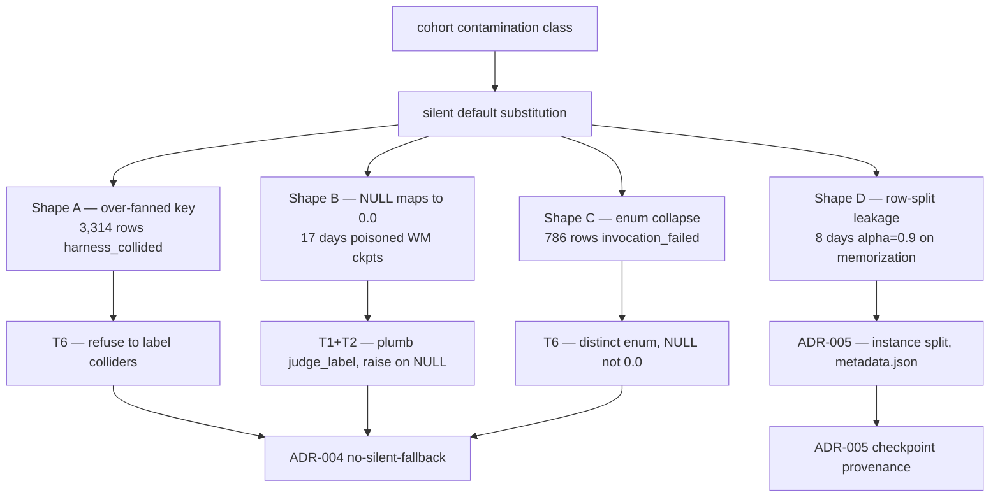
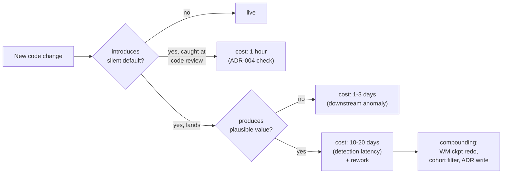
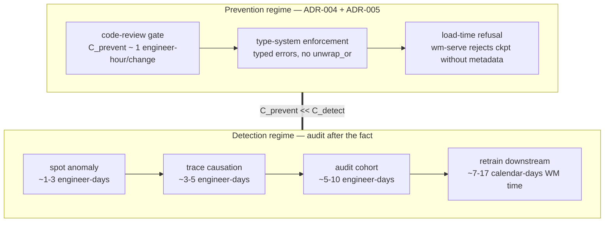
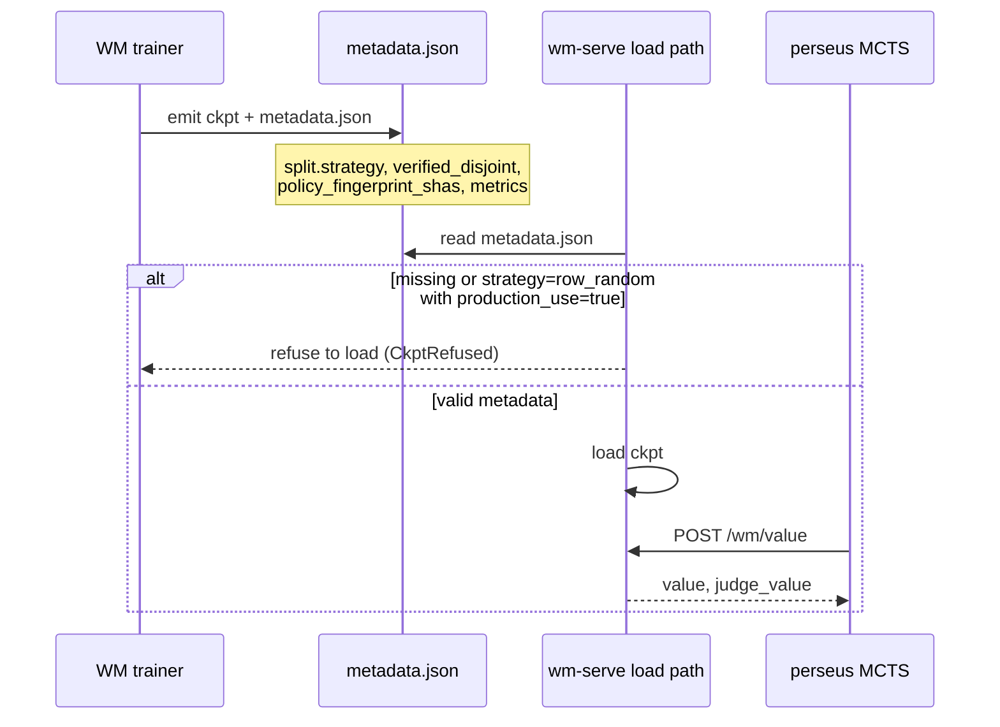
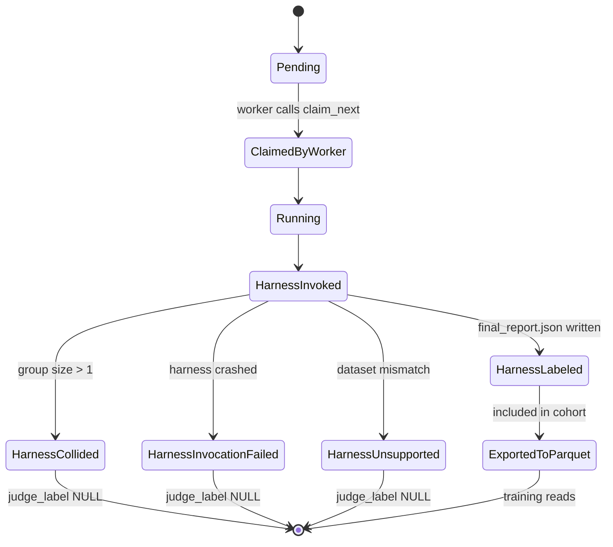

We claim that the four contamination incidents that landed in perseus's training pipeline between 2026-04-23 and 2026-05-18 are not four bugs. They are four instances of one bug: a pipeline node silently substitutes a *labeled* value for an *unknown* one, and a downstream consumer treats the substituted label as ground truth. Fixing each instance produces four patches and a fifth incident next month. Fixing the class — via ADR-004 (no-silent-fallback) and ADR-005 (checkpoint provenance metadata) — closes the family. This essay argues the class.

The generative identity, stated once, holds across all four shapes:

$$
\text{truth} = \mathtt{UNKNOWN} \xrightarrow{\text{silent default}} \text{stored} = \mathtt{LABELED} \xrightarrow{\text{consumer trusts label}} \text{contamination}
$$

The four shapes differ only in what `UNKNOWN` got renamed to and which consumer trusted the rename. We will write each shape's identity as a map from the truth state to the stored state, and the contamination follows mechanically. Reading each section is mostly a matter of identifying the substitution arrow and the volume bound it produces.

A second framing, equivalent in content: each shape is a violation of the rule that the conditional distribution of the stored value $\hat{y}$ given the truth $y$ must preserve the marginal $\Pr[y = \mathtt{UNKNOWN}]$. Silent default substitution sets $\Pr[\hat{y} = \mathtt{UNKNOWN}] = 0$ while $\Pr[y = \mathtt{UNKNOWN}] > 0$. The estimator is no longer unbiased; the bias is structurally toward the substituted value. For perseus, all four substitutions biased toward the *negative* class (zero reward, FAIL verdict, low generalization signal), so the contamination consistently *underestimated* perseus capability — but the direction is incidental to the class.

## 1. Four shapes in a 30-day window

Each shape was discovered by a different engineer on a different day and fixed in a different commit. Each was treated as a one-off until the 2026-05-18 retraction pass forced the side-by-side.

| Shape | Detected | Rows affected | Days live | Proximate fix |
|---|---|---|---|---|
| A — over-fanned key | 2026-05-11 | 3,314 collided + ~1,730 unfanned twins | ~9 | T6 collision guard |
| B — silent default | 2026-05-11 | every WM ckpt 2026-04-25 → 2026-05-11 | 17 | T1+T2 plumbing |
| C — enum collapse | 2026-05-11 | 786 rows | ~9 | T6 distinct enum value |
| D — train/val leakage | 2026-05-18 | 6,545 perseus rows poisoned by alpha=0.9 | 8 | ADR-005 instance split |

We claim the table looks like four unrelated rows and reads like one law. The remainder of this essay defends that reading.

## 2. Shape A — over-fanned key

The Multi-SWE-bench harness keys each verdict by the triple `(org, repo, pr_n)`. Perseus's multi-bench grid produces $M = 5$ models times $C = 2$ conditions of every upstream PR, giving $M \cdot C = 10$ rows in the runs table per upstream PR. The harness, however, assumes one row per key, so it writes exactly one verdict to its `final_report.json`. The pre-fix demultiplexer was equivalent to a deterministic function

$$
\text{label}(r) := \text{verdict}\bigl(\text{key}(r)\bigr)
$$

which is correct when keys are unique and silently wrong when the fan-out factor exceeds one. The harness picks *whichever patch it happened to score last* per key, non-deterministically, so the broadcast verdict for the other nine siblings is a function of harness scheduling rather than the patch under test. Direction of bias is set by which `prediction.patch` got scored, not by the patch content.

We bound the contamination volume by

$$
|\text{contaminated}| \le \sum_{k \in \mathcal{K}_{\text{fanned}}} (n_k - 1), \quad n_k = |\{r : \text{key}(r) = k\}|
$$

On the live table, this sum is 3,314 rows tagged `harness_collided` after the T6 audit, plus an estimated ~1,730 sibling rows whose verdict was correct only by accident. Pre-fix, all of them counted as real harness verdicts in any dashboard or downstream cohort.

The structural fix is to refuse to label the unknowable case. The T6 patch in the multi-swe-bench runtime groups rows by `instance_id` before invoking the harness; any group of size greater than one writes `judge_source = 'harness_collided'` and leaves `judge_label` NULL for every member. Rows are preserved, not deleted, so they can be re-judged later in single-row batches. The generative identity holds: when the harness cannot disambiguate, the truth is *we don't know whose verdict this is*, and the pipeline now stores `NULL` rather than guessing.

The math per shape, stated explicitly. For Shape A the truth state and stored state are

$$
y(r) = \text{true verdict for }r, \qquad \hat{y}(r) = \text{verdict}\bigl(\text{key}(r)\bigr)
$$

and the substitution is $\hat{y}(r) = \hat{y}(r')$ whenever $\text{key}(r) = \text{key}(r')$, which holds for all $r, r'$ in any group of size greater than one. The bias on the label distribution is computable: if the harness scores patches uniformly at random within a key, the broadcast label is the true verdict with probability $1/n_k$ for each row $r$ in a group of size $n_k$, so expected label accuracy is $1/n_k$. With $n_k = 10$ this is 10%. The substituted label is approximately uniform random over the value the harness happened to score, which destroys most of the signal even when individual rows by accident receive a correct verdict.

## 3. Shape B — silent default

The judge-label columns landed in the schema on 2026-04-23 via migration 008. The Rust row struct did not gain the matching fields. Every `SELECT * FROM multi_bench_runs` silently dropped the four new columns. Compounding this, the terminal-reward extractor read a different column — `result` — that is NULL on every row produced by the modern driver. The matched pattern was `Some("pass")`, which on NULL becomes `None`, which is `false`, which maps to `terminal_reward = 0.0`. The full chain is the trivial composition

$$
\mathtt{result} = \mathtt{NULL} \;\Rightarrow\; \mathrm{Option::as\_deref} = \mathtt{None} \;\Rightarrow\; \mathrm{matches}(\mathtt{Some("pass")}) = \bot \;\Rightarrow\; r_T = 0
$$

For 17 days every WM checkpoint trained under judge-source rewards saw constant-zero terminal labels. The HL-Gauss head, which discretizes the reward target into 51 bins over $[-10, +2]$, observed only the per-step shaping signal in $[-2.0, +0.285]$. The value head learned to predict $\approx 0 + \text{shaping noise}$. The 2026-05-05 Claude.md entry claimed this exact bug had been fixed; the 2026-05-11 audit found the fix had been *specified but never landed*. The strikethrough'd entry now reads (verbatim, kept as historical record): "~~2026-05-05 — muzero-export value\_target fix~~ — **Retracted 2026-05-11**: this entry described a fix that was specified but NEVER landed in code."

Honest behavior is to raise. The terminal-reward extractor now reads `judge_label`, returns `Ok(label)` when the column is in $[0, 1]$, and returns `Err(Unlabeled)` when the column is NULL. The export binary either filters unlabeled rows or fails loudly. Both options preserve the truth that *we don't have a label*. Returning $0.0$ does not.

Generative model: identical to Shape A. The node returned a labeled value where the truth was *unknown*. The fix is identical in shape: refuse to label the unknown.

The shape math: Shape B substitutes

$$
y(r) = \mathtt{NULL} \;\longmapsto\; \hat{y}(r) = 0
$$

on a fraction of rows that is empirically 100% under the modern driver, because the `result` column is NULL by construction. The distribution of the substituted label is a delta at zero. The HL-Gauss target is a Gaussian smear around zero rather than a one-hot at the correct bin. For the 17-day window, the value-head training loss is

$$
\mathcal{L}_v = \mathbb{E}_{(s, r_T)} \bigl[ D_\text{KL}\bigl(p_\text{HL-Gauss}(r_T) \,\|\, p_\theta(\cdot \mid s)\bigr) \bigr], \quad r_T = 0
$$

so the value head converges to the zero-bin posterior, which is in $[-2.0, +0.285]$ per the per-step shaping contribution, and zero out-of-trajectory generalization signal is learned. Detection only happened when the audit traced *why* WM checkpoints stopped improving on the validation parquet; the loss curve itself looked monotonically decreasing because the target was a constant.

## 4. Shape C — enum collapse

The multi-swe-bench harness occasionally exits non-zero on collision-heavy batches without writing `final_report.json`. Pre-fix, the runtime recovered the partial results, wrote them with `judge_source = 'mswebench_harness'`, and stamped `judge_label = 0.0` on every row in the batch — including rows that had no corresponding entry in the partial report. Two distinct semantic categories collapsed onto one label:

$$
\{\,\text{harness returned FAIL}\,,\;\text{harness never ran}\,\} \mapsto 0.0
$$

786 rows on the live table now sit in `harness_invocation_failed` after detection. Pre-fix they were indistinguishable from real FAIL verdicts. The structural bias matters: invocation failures cluster on hard-to-invoke instances (large repos, slow Docker pulls, flaky CI), so the contamination favored *the appearance of failure on exactly the hard instances we most needed to measure*. This is not random label noise; it is adversarial label noise against the difficult tail.

The fix introduces a distinct enum value, `harness_invocation_failed`, and leaves `judge_label` NULL. The downstream terminal-reward gate masks the judge-value gradient for rows in any of `harness_collided`, `harness_invocation_failed`, or `harness_unsupported`. Zeroed rows contribute no signal even when they coincidentally shape-match real fails. The same identity again: distinct truth states must not collapse onto the same label.

The shape math: Shape C substitutes a two-element truth space onto a one-element label space,

$$
y \in \{\text{FAIL}, \text{NEVER\_RAN}\} \;\longmapsto\; \hat{y} = 0
$$

with empirical fraction of `NEVER_RAN` rows on the live table at 786 of approximately $n$ rows in the affected window, where the conditional probability $\Pr[\text{NEVER\_RAN} \mid \text{instance is hard}] \gg \Pr[\text{NEVER\_RAN} \mid \text{instance is easy}]$. The contamination is therefore *correlated with instance difficulty*, which means the headline pass rate is biased downward by an amount that depends on the difficulty distribution of the sweep. For perseus this is the adversarial pattern: the harder the instance, the more likely the contamination, the more confident the bias against perseus capability. The class identity holds — the substitution maps an unknown state to a labeled one — but the operational consequence is sharper than for Shape B, because the bias direction is *systematic* rather than uniform.

## 5. Shape D — train/val leakage

The WM v4 ablation `wm_v4_random_split` hit val\_r2 = 0.997. Four sibling configurations reproduced 0.997 ± 10⁻³. The reproducibility looked like architectural strength; it was a corpus property.

The corpus is a sequence of trajectories. Each trajectory is a sequence of steps. Every step in trajectory $\tau$ carries the same terminal reward:

$$
r_T(s) = R(\tau(s)) \quad \forall s \in \tau
$$

A uniform-random 80/10/10 row split distributes steps of one trajectory across train, val, and test. Predicting $r_T$ on a val row reduces to retrieving the trajectory ID from the state embedding and looking up any sibling row in train. Generalization is not measured; trajectory-ID memorization is.

The honest measurement is an instance-keyed split: hold out entire instances, not rows. Under that split, the same checkpoint scored val\_r2 $\approx 0.114$. The corpus has 691 passes over 19,881 rows ($\approx 3.5$% pass rate); a constant predictor of "fail with confidence 0.965" trivially scores $\approx 0.997$ R² against the row-leaked distribution.

The production blend deployed `wm_v4_random_split` at $\alpha = 0.9$, meaning the LLM prior contributed 10% and the WM-derived prior contributed 90% of the UCB weight:

$$
\pi(a \mid s) = (1 - \alpha) \cdot \pi_\text{LLM}(a \mid s) + \alpha \cdot \pi_\text{WM}(a \mid s), \quad \alpha = 0.9
$$

The pipeline produced a *labeled* generalization measurement where the truth was *we measured memorization*. Same identity.

The shape math: Shape D substitutes the metric

$$
y = \mathrm{R}^2\bigl(\text{val rows from held-out instances}\bigr) \;\longmapsto\; \hat{y} = \mathrm{R}^2\bigl(\text{val rows leaked from train trajectories}\bigr)
$$

with $\hat{y} - y \approx 0.997 - 0.114 \approx 0.88$. The bias is enormous and unidirectional. The conditional structure is: given that the row-random split with high probability places sibling rows in train and val, the embedding distance between train and val rows of the same trajectory is bounded by the embedding model's intra-trajectory similarity, which is empirically small. Memorization via embedding retrieval is therefore the optimal strategy under the loss, and the model learns exactly that.

## 6. The class, in one diagram

The four substitutions, in one column:

1. Shape A renamed "this row's verdict is unknown" to "this row's verdict equals its sibling's."
2. Shape B renamed "this row has no judge label" to "this row's reward is 0.0."
3. Shape C renamed "the harness crashed before scoring this row" to "this row scored FAIL."
4. Shape D renamed "we measured memorization" to "we measured generalization."

The common defect is silent default substitution. None of the four substitutions raised. None logged a warning. Each was visible only by counting rows after the fact and noticing the count was wrong.

## 7. Detection latency vs blast radius

We tabulate the per-shape detection economics. The shorthand: $C_\text{detect}$ is the engineering cost between deploy and "wait, those numbers look off"; $C_\text{rework}$ is the cost of retraining everything downstream once the contamination is identified.

| Shape | Detection mechanism | Days to detect | Blast radius (rework) |
|---|---|---|---|
| A | T6 audit, group-by-instance count | ~9 | 5,044 rows re-labeled, no model rework (rows pre-WM) |
| B | T1 audit traced WM regression to constant-zero terminal | 17 | 17 days WM training redone |
| C | T6 audit, rows with `judge_label=0.0` and no `final_report.json` | ~9 | Re-judge 786 instances, partial pass-rate recompute |
| D | val\_r2 = 0.997 outlier provoked instance-split audit | 8 | alpha=0.9 ckpt rolled back, 8 days WM training redone |

A second per-shape table makes the trigger asymmetry explicit. The "trigger anomaly magnitude" column records *how far from expectation* the downstream number was when the audit fired. A higher magnitude provoked faster detection.

| Shape | Trigger anomaly | Magnitude | Days live |
|---|---|---|---|
| A | row count for a key was 10x expected | 10x | ~9 |
| B | WM loss curve looked normal but val on new instances stagnated | small, easily dismissed | 17 |
| C | rows with `judge_label=0.0` had no harness output file on disk | binary present/absent | ~9 |
| D | val\_r2 = 0.997 was 9x the next-best ablation's val\_r2 | 9x | 8 |

The pattern is regression-on-magnitude: detection latency scales inversely with how far the contaminated signal moved the downstream metric from baseline. Shape B's signal moved the metric *toward* the expected pattern (low early reward, slow convergence), which is structurally undetectable without explicit audit.

The structural observation: latency is *inversely* correlated with how anomalous the contaminated number looks downstream. Shape D was caught fastest (8 days) because val\_r2 = 0.997 is *too good* — it provoked a sanity check by being a positive anomaly. Shape B was slowest (17 days) because constant-zero terminal rewards produced loss curves that looked like *normal early training*, exactly the expected pattern. The more plausible the substituted value, the longer the contamination persists.

This is the load-bearing economic claim. The expected detection latency is

$$
\mathbb{E}[T_\text{detect}] \propto \frac{1}{|\,\text{downstream anomaly}\,|}
$$

so the *most plausible-looking* contamination patterns are the *most expensive* by survival time. Silent default substitution is precisely the pattern that maximizes plausibility — it produces values within the expected range, not outside it. The class is structurally optimized to evade detection.

## 8. Detection economics — when class fixes beat instance fixes

Whack-a-mole cost for $N$ instances over time $T$:

$$
C_\text{instance}^{(N)} = \sum_{i=1}^{N} \bigl(C_\text{detect}^{(i)} + C_\text{fix}^{(i)} + C_\text{rework}^{(i)}\bigr)
$$

Class-fix cost:

$$
C_\text{class} = C_\text{ADR-004} + C_\text{ADR-005} + N \cdot \epsilon
$$

where $\epsilon$ is the residual instance cost after structural enforcement catches new substitutions at introduction time. The class fix pays back when

$$
C_\text{ADR-004} + C_\text{ADR-005} \;<\; \sum_{i=1}^{N} C_\text{rework}^{(i)}
$$

For perseus at $N = 4$ over 30 days, with $C_\text{rework}$ dominated by 17-day WM training loss per Shape B-class incident, the class fix paid back within the first instance. The four-incident audit (the T1–T9 work) cost ~2 weeks of engineering; the cumulative rework cost from continuing to whack instances would have exceeded that within another 30-day window.

The diagram is the economic argument. Caught at code review costs hours. Caught downstream costs days. Caught after a model trains on the contamination costs weeks. The structural enforcement at code review is the cheap intervention; the field-detection-and-rework loop is the expensive one.

We can state the prevention-vs-detection tradeoff as an explicit cost diagram, where $C_\text{prevent}$ is the cost to enforce a class-level rule at code-review time and $C_\text{detect}$ is the cost to find the same contamination after it has propagated into a trained model. The ratio $C_\text{detect} / C_\text{prevent}$ is the multiplier that justifies the ADR investment.

The diagram is what justifies writing this essay rather than fixing the fifth instance directly. Prevention regime is bounded above by a few engineer-hours per code change. Detection regime is bounded below by roughly 16 engineer-days plus 7–17 days of calendar time for downstream retraining. For perseus's current incident rate of one new contamination every 7.5 days, the prevention regime saves approximately $4 \cdot 23 = 92$ engineer-days over a 30-day window (counting one detection cycle per instance), against an ADR enforcement cost of a few engineer-hours per code change times the number of changes per window, which is far less.

A further per-shape table separates blast radius along two axes: rows affected (the contamination footprint) and downstream artifacts affected (the rework footprint).

| Shape | Rows affected | Downstream artifacts | Calendar-time rework |
|---|---|---|---|
| A | 5,044 | none (caught pre-WM training) | 1 day re-judging |
| B | 478k training rows × 17 days | every WM ckpt 2026-04-25 to 2026-05-11 | 17 days retraining |
| C | 786 | partial pass-rate dashboards | 2 days re-judging + recompute |
| D | 6,545 (perseus condition) | alpha=0.9 production blend | 8 days retraining + 2 days redeploy |

The rework footprint is what makes class-fixes payback so fast. Each contamination instance that lands a downstream model requires *that model's training time* as recovery overhead. WM training is 7–17 days per epoch-converged ckpt; planner training is 1–3 days; PRM training is 5–10 days. A pipeline that emits one contaminated downstream artifact per 7.5 days, with rework of 7–17 days per artifact, has loss rate $\rho > 1$ and is in a degenerate regime where contamination outpaces clean training.

## 9. ADR-004 — no-silent-fallback

ADR-004 codifies the rule: no production code path may substitute a default value when the input is unknown, without either raising a typed error or emitting an explicit warning. The banned patterns are the Rust shorthand `unwrap_or(default)` on options whose semantic `None` carries meaning, the Python `except: return []` swallow, the `numerator / (denominator + 1e-9)` silent epsilon, and the falsy-default-on-zero pattern common in JSON parsing. The required patterns are typed-error propagation via the question-mark operator in Rust and explicit raised exceptions in Python, with `tracing::warn!` or equivalent at any fallback point that is permitted by exception.

The discipline reduces to: every code path that could substitute a default must either *raise the substitution as a typed error* or *log it loudly enough that operators see it*. Silent zeros and silent epsilons become syntactically identifiable in code review, which is the cheap intervention point in the cost diagram above.

ADR-004 also generalizes the earlier retraction of the parser-repair-at-higher-temperature retry pattern. The 2026-04-22 LLM API surface entry retracted "+0.2 \* retry" temperature bumps on parse failure because a malformed-JSON failure is rarely fixed by sampling more diversely. The generalization: do not paper over an unparseable response by re-rolling the random seed.

The ADR-004 decision tree at code review is simple. For each branch in a function that could substitute a default for an absent input, ask three questions in order:

1. Is the absent input a valid state of the world, or a corrupted state? If valid (e.g. an unlabeled row), the function must return a typed error variant or NULL; substitution is forbidden.
2. Is the absent input expected to occur frequently in production? If yes, the typed error must be specifically named (e.g. `RewardError::Unlabeled`) so callers can match on it rather than generic-catch.
3. Is the call site within a hot path that cannot afford to raise? If yes, the substitution must be logged at warn level with sufficient context (run\_id, input, fallback value) that the audit can reconstruct after the fact.

The decision tree is small enough that code review can apply it by inspection. The class of bugs it eliminates is the entire silent-default family.

## 10. ADR-005 — checkpoint provenance metadata

ADR-005 requires every WM (or planner, or PRM) training run to emit a `metadata.json` next to the checkpoint with required fields: `git_sha`, training-data parquet path with row count and filter SQL, the `policy_fingerprint_shas` of the source cohort, excluded-row count with exclusion reason, full split specification, metrics, and promotion timestamp. The load-bearing field is `split.strategy`, with four permitted values:

1. `"instance"` — held-out by instance ID; the ground truth for generalization claims.
2. `"time"` — held-out by `claimed_at` cutoff; the second-best truth when instance overlap is unavoidable.
3. `"paired"` — held-out paired (baseline, perseus) of the same instance; useful for paired-difference statistics.
4. `"row_random"` — permitted only with explicit `production_use: false` and emits a loud warning at train time.

The pre-flight check at the WM-serve load path refuses any checkpoint whose `metadata.json` is missing, whose `verified_disjoint` is not true, or whose `split.strategy = "row_random"` is missing the `production_use: false` flag. The pre-2026-05-18 deployment of `wm_v4_random_split` at alpha=0.9 would have been refused at load time under ADR-005 — the metadata file either wouldn't exist or would carry `strategy: "row_random"` with default `production_use: true`.

The pre-flight is the structural enforcement; the diagram is the contract.

A few clarifying observations on the metadata schema. The `excluded_row_count` and `excluded_reason` fields are load-bearing: they document the contamination filter that the training run applied, so a future reader knows that for example rows with `judge_source` in the contamination tags were removed. Without these fields, the question "did this checkpoint train on Shape A or Shape C contaminated rows?" requires SQL archaeology against a snapshot of the rows that existed at training time, which is hard if not impossible after subsequent backfills. With these fields, the question is answered by reading `metadata.json`.

The `policy_fingerprint_shas` field is the cohort identity. Perseus's policy fingerprint captures git SHA, planner and confirm-stop prompt SHAs, UCB-C constant, retrieval endpoint, and a SHA of the sorted environment variables. Different fingerprint means different policy means different behavior distribution means a different training population. Training on a mixture of fingerprints without recording the mixture is a sibling contamination shape: the cohort is not what we think it is. ADR-005's `policy_fingerprint_shas` field forces the mixture to be explicit.

A useful framing for ADR-005 is as a state machine over the lifecycle of a single cohort row, from "harness invoked" through "label written" to "consumed by training."

The four contamination tags are distinct terminal states. Pre-fix, all four collapsed onto a single state "HarnessLabeled with `judge_label = 0.0`." The fix is to make the diagram's distinct states distinct in the database, which is the data-side analog of ADR-004's typed-error rule at the function-call level.

## 11. Provenance columns are the prerequisite, not the audit

Each shape was caught only because a forensic column on the row let us run a one-line audit query. For Shape B, the audit is to group `multi_bench_runs` by `judge_source` and count. For Shape A, the audit is to filter on `judge_source = 'harness_collided'` and read the `judge_detail.error` peer-set list. For Shape D, the audit is to read `split.strategy` from `metadata.json`. The detection cost collapses from "human notices numbers look wrong, traces back through git history, reads three days of session logs" to "one query against a forensic column." The provenance column is the prerequisite that makes the audit feasible at all.

The generalization: every cohort row, every checkpoint, every artifact must carry forensic provenance such that *when a downstream number looks wrong, the audit is a single query against the provenance*. ADR-005 makes this explicit for checkpoints. The `judge_source`, `judge_detail`, and `policy_fingerprint_sha` columns make it explicit for rows. The structural cost saver is forensic plurality, not retrospective archaeology.

## 12. The audit-as-class pass found the same pattern in the docs

The 2026-05-18 retraction pass audited Claude.md itself against the actual code and flagged three stale claims that fell into the same generative shape:

1. The temperature-retry-bump claim ("+0.2 \* retry, clamped at 0.6") was strikethrough'd; the actual code is constant-temperature.
2. The planner-call timeout default of 90 000 ms was strikethrough'd; the actual default is 0.
3. The 17-column parquet schema claim was updated inline; the actual schema is 23 columns.

Each was a doc-level instance of silent default substitution. Documentation stored a *labeled* value (the stated default) where the truth was *the default had changed and the doc hadn't*. The retraction template — strikethrough plus inline note — is the doc-level analog of `metadata.json`: preserve the original text so future readers can grep for `~~strike~~` and discover the discrepancy.

We claim the audit found the same class in the docs that it found in the data. ADR-004's analog at the doc layer is: don't substitute a stale default for ground truth; raise the discrepancy (strikethrough plus inline note) so future readers see both.

## 13. The cost of doing this honestly

The 2026-05-11 audit (T1–T9) cost ~2 weeks of engineering. The 2026-05-18 retraction pass cost a day. ADR-004 and ADR-005 are landing piecewise.

The alternative cost structure compounds. Each new instance resets the WM training clock by 1–3 weeks; four instances in 30 days is one new instance every 7.5 days; at 17 days of WM training lost per Shape-B-class incident, the project loses $\approx$ 2.3 weeks of effective training time per week of wall-clock time:

$$
\mathrm{loss\_rate} = \frac{17 \text{ days WM lost}}{7.5 \text{ days/incident}} \approx 2.3 \text{ weeks lost / week elapsed}
$$

A pipeline that introduces contamination faster than it produces ground truth is not a pipeline; it is a noise generator. That math is the reason audit-as-class is the load-bearing discipline rather than the optional cleanup pass.

The same logic, restated for the final time: silent default substitution is structurally optimized to evade detection, which means it must be structurally optimized *against* at code review. ADR-004 and ADR-005 are the two enforcement points. Every additional contamination shape we identify in the next 30 days should fit the same identity or expose a new generative move; if a new move is found, the ADR set extends. We do not whack the next bug; we extend the structural enforcement.

## 14. What is still open

Four candidate retractions from HISTORY/36 have not been resolved:

1. The default-feature drop in the build manifest never landed.
2. The confirm-stop livelock cap is operationally working but the prompt that triggers the cap is unfixed.
3. The unsafe pattern for killing the perseus process is rebanned in one doc but the safe pattern is not propagated to the others.
4. A planner-prompt production-readiness claim is contradicted three paragraphs down in the same status report.

Each is a candidate Shape-E-or-later. The discipline says: catalog them, run the audit pass, extend the ADRs if a new generative move is found, and update the table at the top of this essay when they resolve.

We close on the table that opened. Four shapes, one identity, two ADRs. The class is not done — the next instance is a falsifying test of whether ADR-004 and ADR-005 are sufficient. If a fifth shape lands in the next 30 days that fits the existing identity, the ADRs are insufficient at code-review enforcement. If a fifth shape lands and introduces a new generative move, the identity itself extends. Either outcome is informative; only the *absence* of a fifth shape would be evidence that the class is fully bounded.

## 15. A note on the LessWrong-style asymmetry

Most engineering writeups of incidents are post-mortems: they explain a single bug, name a remediation, and stop. The argument of this essay is that single-bug post-mortems are misallocated effort relative to class-level audits, *for the specific category of bugs where the generative mechanism repeats*. Silent-default substitution is one such category. There may be others — contract drift, stale specifications, missing serialization aliases, race-condition broadcast — and the discipline carries.

The general principle: when a bug class is generative rather than incidental, the post-mortem effort goes to the class identity and the structural enforcement. The instance fixes are bookkeeping. Sam's framing in MEMORY.md: "Audit comprehensively, don't whack bugs one at a time — when a bug is a class, audit for siblings in one pass." We claim every word of that is load-bearing, especially "comprehensively" and "one pass." The audit-as-class discipline pays back in the same window because the rework footprint of any single instance exceeds the audit cost of the whole class.

We also claim the discipline is rare. Most engineering organizations whack each bug as it surfaces, accept the rework, and rebuild downstream artifacts. The pattern is sustained only by under-counting the rework time, which in perseus's case is recoverable from the WM training calendar. The honest accounting — once we did it — was a 2.3-weeks-lost-per-week-elapsed regime, which is degenerate. Class-fixing is the only sustainable response to a contamination-class bug. Instance-fixing is the response that produces the fifth instance.

The structural fixes (ADR-004 no-silent-fallback and ADR-005 checkpoint provenance metadata) are not a panacea. They are a specific, narrow set of code-review rules and load-time refusals. Their scope is precisely the silent-default substitution class. New classes will arrive — we expect at least one in the next 60 days, given perseus's surface area — and the discipline will repeat: identify the generative move, name the class, write the ADR. The output of this essay is one of those ADR pairs. Future essays will be the same shape for the next class.

## 16. Predictions

We commit to four predictions as falsifying tests of the framing above:

1. If ADR-004 is enforced uniformly, no Shape-A-or-Shape-B-or-Shape-C class incident will land in the next 30 days. A landing instance falsifies the claim that the ADR's three-question decision tree is sufficient at code review.
2. If ADR-005 is enforced at the WM-serve load path, no checkpoint with `split.strategy = "row_random"` will reach production. A landing instance falsifies the claim that load-time refusal is sufficient.
3. The next contamination shape that lands will fit the silent-default-substitution identity with probability greater than 0.7, conditioned on the surface-area distribution of perseus's pipeline. A landing shape that does *not* fit the identity is informative — it means a new generative move exists and the class extends.
4. The detection latency for the next instance will be inversely proportional to the magnitude of its trigger anomaly, per the table in section 7. A counter-example — a low-anomaly shape detected quickly — would indicate that audit infrastructure (provenance columns, forensic queries) has improved beyond the trigger-anomaly bottleneck.

Each prediction is structured to fail loudly. If any falsifies, the framing above is wrong in a specific place, and the next essay will say exactly where.

We end where we started: cohort contamination is a class, not an incident. The four shapes are four instances of one bug. The fix is structural, not instance-by-instance. The cost of doing this honestly is the cost of the audit that produced this essay, against the cost of continuing to whack instances at one per 7.5 days while losing 17 days of WM training per Shape B-class incident. The arithmetic does not work for the whack-a-mole strategy. The class-fix strategy is the only one that converges.
