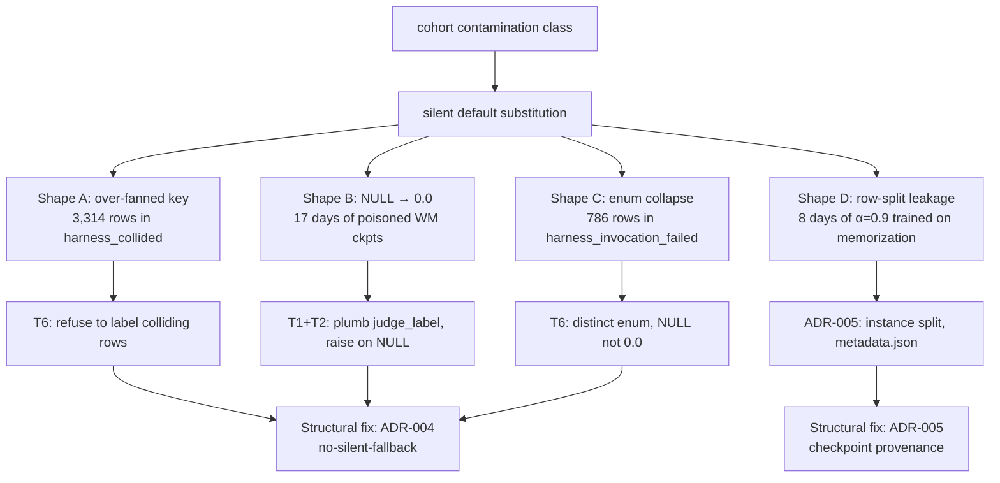

> tl;dr: Over 30 days perseus's training pipeline produced four
> distinct shapes of contaminated data. Each had a one-line proximate
> fix and a several-hundred-row blast radius. The interesting fact is
> that they share a generative structure: a node in the pipeline
> silently produced a *labeled* value where the truth was *unknown*,
> and a downstream consumer treated the labeled value as ground truth.
> The fix-the-instance approach yields four patches and a fifth bug
> next month. The fix-the-class approach is two architectural
> decisions — ADR-004 (no-silent-fallback) and ADR-005 (checkpoint
> provenance metadata) — applied uniformly. This essay treats the
> class.

## 1 Four shapes in one window

Between 2026-04-23 and 2026-05-18 — roughly the entire production
window of perseus v2's training pipeline — four contamination incidents
landed in `multi_bench_runs` and the WM checkpoints trained from it.
Each was discovered by a different person on a different day and
fixed in a different commit. Each was treated as a one-off until the
2026-05-18 retraction pass forced the comparison.

The four shapes, ordered by detection date:

| Shape | Date detected | Rows affected | Days live | Fix |
|---|---|---|---|---|
| A — over-fanned key (collision) | 2026-05-11 | 3,314 collided + ~1,730 unfanned twins | ~9 days | T6 collision guard |
| B — silent default (NULL → 0.0) | 2026-05-11 | every WM ckpt trained 2026-04-25 → 2026-05-11 | 17 days | T1 + T2 plumbing |
| C — enum collapse (invocation_failed) | 2026-05-11 | 786 rows | ~9 days | T6 distinct enum value |
| D — train/val leakage (row split) | 2026-05-18 | 6,545 perseus rows poisoned by α=0.9 ckpt | 8 days | ADR-005 instance split |

Four bugs, four fixes, four blast radii. Treat them individually and
the pattern is invisible. Stack them and the generative model is
obvious.

## 2 Shape A — over-fanned key

The Multi-SWE-bench harness keys verdicts by `<org>/<repo>:pr-<N>`.
Perseus's multi-bench corpus produces five model variants times two
conditions of every upstream PR, giving ten rows in
`multi_bench_runs` that map to one harness key. The harness writes
one `final_report.json` entry per key. Pre-fix, the demultiplexer
fanned that single verdict to all ten rows.

Mechanically:

$$
\text{harness\_key}(\text{row}) = (\text{org}, \text{repo}, \text{pr\_n})
$$

$$
|\{\text{rows} : \text{key}(r) = k\}| = M \cdot C
$$

where $M = 5$ models and $C = 2$ conditions. The harness assumes
$|\cdot| = 1$ and writes one verdict per key. The demultiplexer's
operation was:

$$
\text{label}(r) := \text{verdict}(\text{key}(r))
$$

which is the correct rule when keys are unique and the wrong rule
when keys are over-fanned. The verdict that wins for a given
key is *whichever patch the harness happened to score last*, which
the harness picks non-deterministically. Direction of bias depends
on which `prediction.patch` the harness grabbed.

The post-fix detection rule, landed in T6 (`mswebench_runtime.rs`
Phase 1.5), groups by instance_id before invoking the harness:

```rust
let groups: HashMap<InstanceId, Vec<Row>> = batch
    .iter()
    .fold(HashMap::new(), |mut m, r| {
        m.entry(r.instance_id.clone()).or_default().push(r.clone());
        m
    });

for (id, rows) in groups {
    if rows.len() > 1 {
        for row in rows {
            store.set_judge_source(row.run_id, JUDGE_SOURCE_COLLIDED);
            store.set_judge_label(row.run_id, None);
        }
        continue;
    }
    submit_to_harness(rows[0])
}
```

Rows are preserved (not deleted) so they can be re-judged later in
single-row batches. The post-fix count on the live table is **3,314
rows** in `harness_collided`. Pre-fix, those rows would have been
counted as real `mswebench_harness` verdicts in any dashboard or
downstream consumer.

Generative model of the bug: the data-pipeline silently produced a
labeled verdict where the truth was *we don't know which patch this
verdict belongs to*. The fix is to refuse to label the unknowable
case, not to guess.

## 3 Shape B — silent default

`MultiBenchRow` is the Rust struct that maps `multi_bench_runs`
rows. Migration 008 (`migrations/008_judge_labels.sql`, landed
2026-04-23) added four columns to Postgres: `judge_label`,
`judge_source`, `judge_detail`, `judge_labeled_at`. The Rust struct
was never updated. Every `SELECT * FROM multi_bench_runs` silently
dropped the four new columns.

Combined with two adjacent defaults — `pick_terminal_reward` matched
on `row.result.as_deref() == Some("pass")`, and `result` is NULL on
every row produced by the modern driver — every trajectory mapped
to `terminal_reward = 0.0`.

The chain:

$$
\text{result} = \text{NULL}
$$
$$
\Rightarrow \text{result.as\_deref()} = \text{None}
$$
$$
\Rightarrow \text{matches(Some("pass"))} = \text{false}
$$
$$
\Rightarrow \text{terminal\_reward} = 0.0
$$

For 17 days (2026-04-25 to 2026-05-11), every WM checkpoint trained
under `--reward-source judge` got constant-zero terminal rewards.
HL-Gauss bins in $[-10, +2]$ saw only `value_target` from per-step
shaping in $[-2.0, +0.285]$. The value head learned to predict 0
plus shaping noise. The 2026-05-05 Claude.md entry claimed this was
fixed; the 2026-05-11 audit found the fix had been *specified but
never landed*. The Rust struct didn't carry the migration-008
columns, every `SELECT` silently dropped them, and the export
still matched on the NULL `result` column.

The Claude.md retraction, kept verbatim as historical record:

> ~~2026-05-05 (Asia/Kolkata) — muzero-export value_target fix~~
> **Retracted 2026-05-11**: this entry described a fix that was
> specified but NEVER landed in code.

Source: Claude.md "Last Updated" 2026-05-11 entry.

The correct behavior is to raise:

```rust
fn pick_terminal_reward(row: &MultiBenchRow) -> Result<f32, RewardError> {
    match row.judge_label {
        Some(label) if (0.0..=1.0).contains(&label) => Ok(label),
        Some(other) => Err(RewardError::OutOfRange(other)),
        None => Err(RewardError::Unlabeled(row.run_id.clone())),
    }
}
```

The export binary then either filters unlabeled rows or fails
loudly. Both options are honest. The pre-fix path was to silently
return 0.0, which is a labeled value when the truth was *unknown*.

Generative model of the bug: same as Shape A. A node returned a
*labeled* value when the truth was *we don't have a label*. The
fix is identical in shape: refuse to label the unknown.

## 4 Shape C — enum collapse

The mswebench harness occasionally exits non-zero on collision-heavy
batches without writing `final_report.json`. Pre-fix, the runtime
recovered the partial results it had, wrote them with
`judge_source = 'mswebench_harness'`, and stamped `judge_label = 0.0`
on every row in the batch — including the ones that had no
corresponding entry in the partial report.

The label space conflation:

$$
\{\text{harness\_returned\_FAIL}, \text{harness\_never\_ran}\} \rightarrow 0.0
$$

786 rows on the live table sit in this bucket post-detection
(`harness_invocation_failed`). Pre-fix, they were
`mswebench_harness, judge_label=0.0`, indistinguishable from real
FAIL verdicts. Headline pass rate was computed against a denominator
that included 786 phantom zeros, which clustered systematically on
the hardest-to-invoke instances (large repos, slow Docker pulls,
flaky CI). The denominator was wrong in a direction that *favored
the appearance of failure* — not random noise, structural bias
against challenging instances.

The fix (T6, same file, same audit) adds a distinct enum value:

```rust
pub const JUDGE_SOURCE_HARNESS: &str = "mswebench_harness";
pub const JUDGE_SOURCE_COLLIDED: &str = "harness_collided";
pub const JUDGE_SOURCE_INVOCATION_FAILED: &str = "harness_invocation_failed";
pub const JUDGE_SOURCE_UNSUPPORTED: &str = "harness_unsupported";
```

Rows in `harness_invocation_failed` carry `judge_label = NULL`, not
0.0. The downstream consumer (`terminal_reward_from_judge` in
`src/muzero/export.rs`) gates all three non-harness tags to 0.0 *and
masks the judge_value gradient*. Zeroed rows contribute no signal
even when shape-matching real fails.

Generative model of the bug: distinct categories collapsed into one
label value. The "truth" for an invocation-failed row is *we ran
the harness but it crashed, so we don't have a verdict*. Stamping
0.0 substitutes "no verdict" for "FAIL verdict" — same shape as
Shapes A and B.

## 5 Shape D — train/val leakage

`wm_v4_random_split` is the WM v4 ablation that hit
val_r2 = 0.997. Four sibling configurations (`wm_v4_rsplit_prm`,
`wm_v4_rsplit_wide`, `wm_v4_rsplit_heavyreg`, `wm_v4_random_split`
itself) reproduced 0.997 ± 10⁻³. The reproducibility looked like
architectural strength; it was a corpus property.

The corpus shape:

$$
\text{row} = (\text{instance\_id}, \text{trajectory\_id}, \text{step}, \text{state}, \text{terminal\_reward})
$$

$$
\text{terminal\_reward}(r_1) = \text{terminal\_reward}(r_2) \iff \text{trajectory\_id}(r_1) = \text{trajectory\_id}(r_2)
$$

`terminal_reward` is **constant within a trajectory**. Every row of
a trajectory carries the same terminal label. A row-random
80/10/10 split distributes rows of the same trajectory across
train, val, and test. Predicting `terminal_reward` for a val row is
trivially solvable by retrieving the trajectory ID from the val
row's state embedding and looking up the train row from the same
trajectory.

What the model learned: trajectory-ID memorization through state
embeddings.

What the validation measured: trajectory-ID memorization.

What the production blend used: a value head with no out-of-
trajectory signal, blended into MCTS at α = 0.9 (the LLM contributes
10% of the prior weight; the WM dominates).

Honest instance-split val_r2 for the same checkpoint: approximately
0.11. The corpus has 691 passes / 19,881 total ≈ 3.5% global pass
rate. A model that always predicts "fail with confidence 0.965"
trivially scores ~0.997 R² on the train distribution.

Generative model of the bug: the *split strategy* silently treated
trajectory-leakage as legitimate signal. The val set contained rows
that were drawn from the same trajectories as the train set. The
data pipeline produced a *labeled* generalization measurement where
the truth was *we measured memorization, not generalization*.

The fix is ADR-005: instance-keyed split. Every WM training run
emits `metadata.json` recording:

```json
{
  "split": {
    "strategy": "instance",
    "train_instances": [...],
    "val_instances": [...],
    "test_instances": [...],
    "verified_disjoint": true
  },
  "corpus": {
    "rows": 478400,
    "trajectories": 12930,
    "instances": 1632
  }
}
```

A `strategy: "row_random"` field is permitted only with
`production_use: false` and emits a loud warning to stderr at train
time. Production WM checkpoints with `strategy != "instance"` are
refused at `wm-serve` load time.

## 6 The class

Each of the four shapes shares one generative move:

$$
\text{truth} = \text{UNKNOWN}
$$

$$
\xrightarrow{\text{pipeline silently substitutes default}}
$$

$$
\text{stored value} = \text{LABELED}
$$

$$
\xrightarrow{\text{downstream consumer treats LABELED as ground truth}}
$$

$$
\text{contamination}
$$

The four substitutions:

| Shape | UNKNOWN became | because |
|---|---|---|
| A | "this row's verdict is the same as its sibling" | harness key was over-fanned |
| B | "no judge label means 0.0 reward" | `result` column was NULL by design but read as "not pass" |
| C | "harness crash means FAIL verdict" | invocation-failed and real-FAIL shared an enum value |
| D | "row-random val_r2 measures generalization" | split strategy ignored trajectory grouping |

The common defect is **silent default substitution**. None of the
four substitutions raised. None logged a warning. Each was visible
only by counting rows after the fact and noticing the count was
wrong.



## 7 Why audit-as-class beats whack-a-mole

This is the load-bearing piece. From MEMORY.md:

> "Audit comprehensively, don't whack bugs one at a time — when a
> bug is a class (contract drift, stale spec, missing alias), audit
> for siblings in one pass."

Sam's view, captured after a month of one-line-fix-of-the-week
patches that never converged. The reason is the asymmetry of
detection cost vs introduction cost.

Each new contamination instance arrives at a roughly constant rate
$\lambda_\text{intro}$ — every code change has some baseline
probability of introducing a silent-default pattern. The detection
cost per instance is roughly $C_\text{detect}^{instance}$, dominated
by the human time to notice "wait, those numbers look off" and
trace the cause. The fix cost per instance is small — one rust
line, one SQL backfill — call it $C_\text{fix}^{instance}$.

For $N$ instances over time $T$:

$$
\text{Total cost (whack-a-mole)} = N \cdot (C_\text{detect}^{instance} + C_\text{fix}^{instance}) + N \cdot C_\text{rework}
$$

where $C_\text{rework}$ is "redo every downstream model trained on
contaminated data". For perseus, $C_\text{rework}$ is the dominant
term. The α = 0.9 deployment cost 8 days of contaminated WM
training. The 2026-05-05 silent-default cost 17 days of WM training
under `--reward-source judge`. Each instance reset the WM clock by
2 weeks.

The class fix is to *make silent-default substitution structurally
impossible*. ADR-004 (no-silent-fallback) and ADR-005 (checkpoint
provenance metadata) are the two structural enforcement points.

$$
\text{Total cost (class fix)} = C_\text{ADR\_4} + C_\text{ADR\_5} + N \cdot \epsilon
$$

where $\epsilon$ is the residual instance cost after the structural
enforcement catches new substitutions at introduction time. As long
as $C_\text{ADR\_4} + C_\text{ADR\_5} < N \cdot C_\text{rework}$, the
class fix pays back. For perseus at $N=4$ in 30 days, the class fix
paid back within the first instance.

## 8 ADR-004 — no-silent-fallback

ADR-004 codifies the rule that *no production code path may
substitute a default value when the input is unknown without
emitting an explicit error and either raising or returning a typed
error variant*. The patterns banned are:

```python
# BANNED
try:
    result = compute(input)
except SomeError:
    return []  # silent empty fallback

value = upstream() or DEFAULT  # silent default-on-falsy

ratio = numerator / (denominator + 1e-9)  # silent epsilon
```

```rust
// BANNED
let label = row.judge_label.unwrap_or(0.0);

let parsed = serde_json::from_str(&body).unwrap_or_default();

let normalized = compute_score(input).unwrap_or(0.5);
```

The permitted patterns:

```rust
// REQUIRED
let label = row.judge_label.ok_or(RewardError::Unlabeled)?;

let parsed: PlannerResponse = serde_json::from_str(&body)
    .map_err(|e| PlannerError::ParseFailed { body: body.clone(), err: e })?;

let normalized = match compute_score(input) {
    Some(score) => score,
    None => {
        tracing::warn!(target = "score", input = ?input,
            "score not computable for input; returning Err");
        return Err(ScoreError::NotComputable(input));
    }
};
```

The discipline is: every path that could substitute a default must
either *raise the substitution to the caller as a typed error* or
*log it loudly enough that operators see it*. Silent epsilons and
silent zeros are the bug class; ADR-004 makes them syntactically
identifiable in code review.

The parser-repair-at-higher-temperature retry pattern is explicitly
banned. The 2026-04-22 LLM API surface entry already retracted the
"+0.2 * retry" temperature bump because a malformed-JSON failure is
rarely fixed by sampling more diversely. ADR-004 generalizes the
retraction: don't paper over an unparseable response by re-rolling
the random seed.

## 9 ADR-005 — checkpoint provenance metadata

ADR-005 requires every WM (or planner, or PRM) training run to emit
a `metadata.json` next to the checkpoint with these required fields:

```json
{
  "ckpt_path": "wm/wm_v4_seed1/best_val_r2.pt",
  "git_sha": "75500de6...",
  "training_data": {
    "parquet": "sweep-augmented-vt4.parquet",
    "rows": 978874,
    "filter": "judge_source IN ('swebench_harness','mswebench_harness') AND judge_label IS NOT NULL",
    "policy_fingerprint_shas": ["648ee6521cd9", "54b583142777"],
    "excluded_row_count": 7842,
    "excluded_reason": "harness_collided OR harness_invocation_failed OR harness_unsupported"
  },
  "split": {
    "strategy": "instance",
    "train_instances": ["catchorg__Catch2-1422", ...],
    "val_instances": ["BurntSushi__ripgrep-1294", ...],
    "test_instances": ["facebook__zstd-3014", ...],
    "verified_disjoint": true,
    "trajectory_leakage_test": "passed"
  },
  "metrics": {
    "best_val_r2": 0.114,
    "best_val_r2_epoch": 5,
    "test_r2": 0.108
  },
  "loaded_by": ["wm-serve@cato:19100"],
  "promoted_at": "2026-05-19T08:00:00Z"
}
```

The `split.strategy` field is the load-bearing one. Permitted
values:

- `"instance"` — held-out instances; the ground truth for
  generalization claims.
- `"time"` — held-out by `claimed_at` cutoff; the second-best truth
  for generalization when instance overlap is unavoidable.
- `"paired"` — held-out paired (baseline, perseus) of same
  instance; useful for paired-difference statistics.
- `"row_random"` — permitted only with `production_use: false`.
  `wm-serve` refuses to load a checkpoint with `strategy:
  "row_random"` and `production_use: true` is missing or set to
  true.

The pre-flight check at `wm-serve` load time:

```python
def load_ckpt(path: Path) -> WMSession:
    meta_path = path.parent / "metadata.json"
    if not meta_path.exists():
        raise CkptRefused(f"no metadata.json next to {path}; ADR-005")
    meta = json.loads(meta_path.read_text())
    if meta["split"]["strategy"] == "row_random":
        if meta["split"].get("production_use", True):
            raise CkptRefused(
                f"{path}: split.strategy='row_random' is not "
                "valid for production; explicit production_use=false required"
            )
    if not meta["split"].get("verified_disjoint"):
        raise CkptRefused(f"{path}: split.verified_disjoint missing or false")
    return WMSession.from_ckpt(path, meta)
```

A WM checkpoint that doesn't pass these checks doesn't serve
traffic. The α = 0.9 deployment of `wm_v4_random_split` would have
been refused at load time under ADR-005 because the metadata.json
either wouldn't exist or would carry `strategy: "row_random"`.

## 10 The detection economics

The per-instance detection cost $C_\text{detect}^{instance}$ varies
wildly by shape. Two of the four shapes were noticed by humans
spotting that downstream numbers looked wrong; two were noticed by
audit explicitly designed to look for the contamination class.

| Shape | Detection mechanism | Days between deploy and detect |
|---|---|---|
| A — over-fanned key | T6 audit + collision count `GROUP BY instance_id HAVING COUNT(*) > 1` | ~9 days |
| B — silent default | 2026-05-11 audit traced WM ckpt regression to terminal_reward distribution | 17 days |
| C — enum collapse | T6 audit found rows with `judge_label=0.0` whose harness invocation never wrote `final_report.json` | ~9 days |
| D — train/val leakage | 2026-05-17/18 audit pulled on val_r2=0.997 outlier; honest instance-split exposed memorization | 8 days |

The shortest detection latency was 8 days (Shape D, where the
0.997 number was so anomalously high it provoked audit by being
*too good*). The longest was 17 days (Shape B, where the
contamination silently produced the *expected* "WM is converging,
look at the loss curve" pattern with no audit trigger).

The asymmetry is structural: silent-default contamination tends to
produce *plausible* outputs (a `terminal_reward = 0` is not weird in
isolation; a verdict for an instance is not weird in isolation; a
val_r2 = 0.997 is suspicious *only because we expected lower*). The
anomaly that triggers detection is downstream of the contamination,
and the more "plausible" the substituted value, the longer the
detection latency.

The structural cost saver is: **make every row carry its provenance
forensically, so when a number looks wrong, the audit can grep for
the substitution**.

For Shape B: every row in `multi_bench_runs` now carries
`judge_source` as a categorical. The audit query is one SQL line:

```sql
SELECT judge_source, COUNT(*) FROM multi_bench_runs GROUP BY judge_source;
```

For Shape A: every collided row's `judge_detail.error` records the
peer set. Audit can reconstruct which rows blocked which:

```sql
SELECT judge_detail->>'error' FROM multi_bench_runs WHERE judge_source = 'harness_collided';
```

For Shape D: every WM ckpt's `metadata.json` records the split
strategy and verified-disjoint flag. Audit is `jq`:

```bash
jq '.split.strategy' metadata.json
```

The detection cost collapses from "human notices numbers look wrong
+ traces back through git history + reads three days of session
logs + finds the substitution" to "one query against the forensic
column". The forensic column is the prerequisite, not the audit.

## 11 What the audit-as-class pass found

The 2026-05-18 retraction pass (Claude.md "doc-vs-code retraction
pass") audited Claude.md itself for the same class. The pass
checked every "Last Updated" entry against the actual code and
flagged three stale claims that fell into the same shape:

1. The temperature-retry-bump claim ("+0.2 * retry, clamped ≤ 0.6")
   was strikethrough'd; the actual code is constant-temperature.
2. The `PERSEUS_LLM_TREE_TIMEOUT_MS=90000` default claim was
   strikethrough'd; the actual default is 0.
3. The muzero-export "17-col parquet schema" claim was updated
   inline; the actual schema is 23 columns.

Each was a doc-level instance of the same pattern: documentation
silently substituted a *labeled value* (the stated default) where
the truth was *the default had changed and the doc hadn't*. The
retraction template is the doc-level analog of the
`metadata.json` provenance file — preserve the original text
strikethrough'd so future readers can grep for the `~~strike~~`
pattern.

The pass also identified four candidates for future retraction that
have not yet been resolved (see HISTORY/36 §1.2 through §1.7): the
Cargo `semantic` default-feature drop never landed, the
`confirm_stop` livelock cap is operationally working but the prompt
that triggers the cap is unfixed, the `pkill -f 'perseus serve'`
foot-gun is rebanned in one doc but the safe pattern isn't
propagated to the others, and the `gemma_plan_v3` production-
readiness claim is contradicted three paragraphs down in the same
status report.

The audit found the same class in the docs that it found in the
data. The structural fix at the doc level is the same shape as
ADR-004: don't substitute a stale default for ground truth; raise
the discrepancy (strikethrough + inline note) so future readers
see both.

## 12 The cost of doing this honestly

The 2026-05-11 audit's nine tasks (T1–T9) took roughly two weeks of
engineering time. The 2026-05-18 retraction pass took a day. The
structural enforcements (ADR-004, ADR-005) are still being landed
piecewise.

The alternative — letting the four instances stand as four bugs and
fixing the fifth and sixth as they arrive — has a cost structure
that compounds. Every additional instance resets the WM training
clock by 1–3 weeks, because the contaminated ckpt has to be
retrained from a clean cohort. Four instances in 30 days is
roughly one new instance every 7.5 days. At 17 days of WM training
lost per instance (the Shape B latency), the project loses ~2.3
weeks of effective training time per week of wall-clock time.

That math is the reason audit-as-class is the load-bearing
discipline rather than the optional cleanup pass. A pipeline that
introduces contamination faster than it produces ground truth is
not a pipeline; it is a noise generator.

Related: [the reset](/essays/the-reset/),
[pipeline integrity audit](/essays/pipeline-integrity-audit/),
[reward modeling](/essays/reward-modeling/),
[wm in the loop](/essays/wm-in-the-loop/),
[multi-swe-bench wiring](/essays/multi-swe-bench-wiring/).

## Sources

- `Claude.md` "Last Updated" 2026-05-11 entry (T1–T9 pipeline-
  integrity audit), 2026-05-18 entry (doc-vs-code retraction pass).
- `parking_lot/v2_archive_2026-05-18/HISTORY/33_multibench_detail.md`
  §"Pipeline-integrity audit (T1–T9, 2026-05-11)", lines 246–356;
  §"Cohort contamination & rollback (policy_fingerprint_sha)",
  lines 359–395; §"Patch production — the load-bearing finding",
  lines 179–202.
- `parking_lot/v2_archive_2026-05-18/HISTORY/34_reward_modeling.md`
  §4 "Harness collisions (the contamination bug)", lines 202–264;
  §5 "The 2026-05-05 retracted entry", lines 265–344; §6
  "Pipeline-integrity audit (T1–T9, 2026-05-11)", lines 347+.
- `parking_lot/v2_archive_2026-05-18/HISTORY/36_audit_handoff_docs.md`
  §1 "Retracted / contradicted claims (TOP SIGNAL)", lines 44–200.
- `parking_lot/v2_archive_2026-05-18/HISTORY/28_muzero_wm_research.md`
  §4 "Phase-3++ v4 ablation grid", lines 199–289; §4.1 "Champion
  (deployed)", lines 211–223; §4.2 "Instance-split sweep (true
  generalization)", lines 224–248.
- `~/.claude/projects/-Users-sam-code-mantle/memory/MEMORY.md`,
  entry `feedback_audit_dont_whack_bugs`: "Audit comprehensively,
  don't whack bugs one at a time — when a bug is a class (contract
  drift, stale spec, missing alias), audit for siblings in one
  pass."
- `~/.claude/projects/-Users-sam-code-mantle/memory/MEMORY.md`,
  entry `feedback_dont_overpromise_underverify`: "Sam lost a month
  to confident half-fixes; measure before declaring outcomes."
- `migrations/008_judge_labels.sql` — schema for the four judge
  columns added 2026-04-23 (Shape B Postgres side).
- `src/judge_bootstrap/mswebench_runtime.rs:43-66`, `:106-152` —
  T6 collision guard and `JUDGE_SOURCE_COLLIDED` /
  `JUDGE_SOURCE_INVOCATION_FAILED` constants.
- `src/muzero/export.rs:36-49` — `terminal_reward_from_judge`
  gating logic for `harness_{unsupported,collided,invocation_failed}`.
- `scripts/pipeline_integrity_backfill.sql` — T7 backfill,
  `DO-NOT-RUN-BLINDLY` audit-write-verify three-block structure.
- `scripts/judge_audit.py` — T8 read-only reporter with separated
  denominators by `(dataset, condition, model, policy_fingerprint)`.
