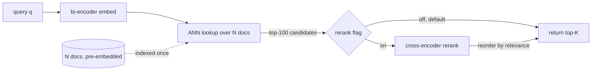
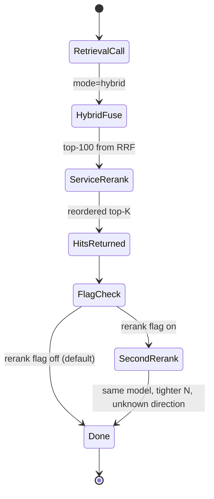
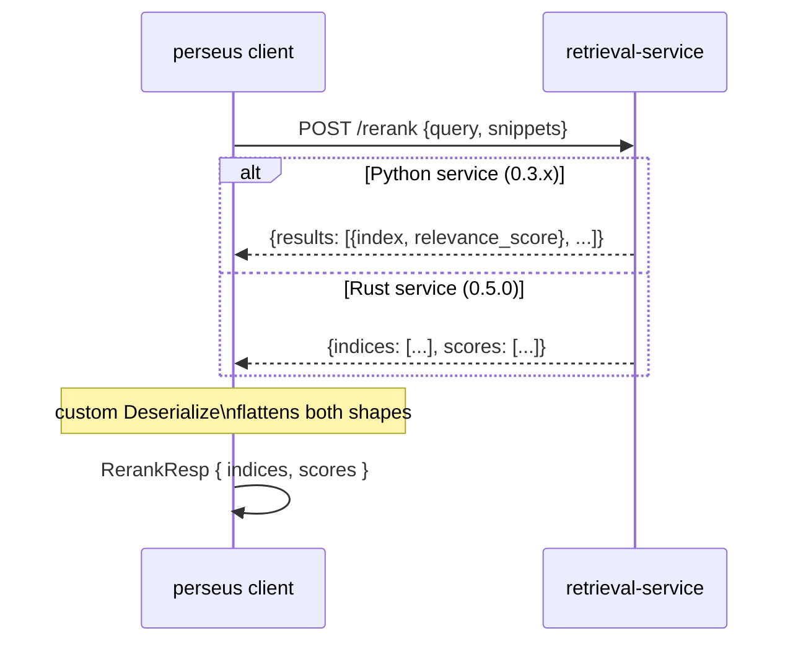

We retrieve top-100 with a bi-encoder, then optionally rerank to top-K with a cross-encoder. The bi-encoder is $O(\log N)$ per query against the corpus; the cross-encoder is $O(N L^2 d)$ over the candidate set. The cascade earns its keep when the bi-encoder leaves real signal on the table *and* the latency budget can absorb $N \cdot L^2$. In Perseus the second pass is off by default — the retrieval-service already reranks inside hybrid mode, the perseus-side knob duplicates that work on the same candidates with the same model, and the recall delta has never been measured on our own gold set.

## 1. Two questions, two cost shapes

Retrieval is two questions composed. First, which 100 documents out of $N$ are even plausible candidates? Second, given those 100, which 10 belong at the top? The right architecture is different for each, and the asymmetry between them is the whole story.

The bi-encoder answers the first question. The query embeds once into a $d$-dimensional vector; every document in the corpus embeds *once at index time* into the same space; retrieval is an approximate-nearest-neighbour lookup of the query vector against the indexed corpus. Per-query cost is

$$C_{\text{bi}} \;=\; T_{\text{embed}}(L_q) \;+\; O(\log N \cdot d)$$

under a competent ANN structure (HNSW, IVF-PQ). The model never sees the query and document jointly; the dot product is the only interaction.

The cross-encoder answers the second question. For each of $N$ candidates the model reads the concatenation `[CLS] query [SEP] doc [SEP]` as one sequence and emits a single relevance score from the `[CLS]` head. The per-pair cost is one transformer forward pass over length $L = L_q + L_d$:

$$C_{\text{cross}}(N) \;=\; N \cdot \Theta(L^2 d \cdot \text{layers})$$

The $L^2$ is the attention block inside each layer; the $d \cdot \text{layers}$ is the per-layer parameter scan.

The asymmetry is load-bearing. Bi-encoder retrieval is cheap because the document side is amortised across queries: only the query embed and ANN lookup happen on-line. Cross-encoder rerank is expensive because the document side is *not* amortised — every query re-encodes every candidate jointly with the query text, and the rerank cost is paid per query, per candidate.

## 2. The cost in numbers

For the live stack the budget decomposes as follows. One query embed through Qwen3-Embedding-4B at fp16 on a V100 over $L_q \approx 32$ tokens runs in roughly 50ms wall-clock. The ANN lookup against the qdrant collection is low-millisecond. Document embeds are pre-computed at index time and never recomputed on-line.

The cross-encoder side is one forward pass through Qwen3-Reranker-4B per pair, with $L \approx 32 + L_{\text{snippet}}$ tokens. With the retrieval-service default of 100 candidates that is 100 forward passes through a 4B-parameter cross-encoder per query. The ratio that matters: bi-encoder retrieval is one query-side forward pass; cross-encoder rerank of top-100 is one hundred forward passes on `(query, doc)`-concatenated input.

For $L = 512$ — a comfortable snippet budget for codet5p-class encoders — the attention block alone does roughly $L^2 = 262144$ pair-token interactions per layer per head. The bi-encoder over the same snippet pays the same $L^2$ once at index time, not $N$ times per query.

Two consequences fall out of the arithmetic:

1. Reranker latency is governed by $N$ and $L$, not by corpus size. Doubling the corpus does not double rerank cost; doubling the candidate-set size does.
2. There is a sweet spot for $N$. Below it, the reranker has too little to work with — the top-K it produces is just the top-K the bi-encoder already produced. Above it, you pay $L^2$ for diminishing recall gains. The Perseus default of 100 candidates is inherited from the Python service; no in-house sweep over $N \in \{50, 100, 200\}$ has been logged.

## 3. Why end-of-query rerank is off by default

The planner-side rerank knob triggers a second rerank pass *after* the retrieval call returns. The implementation sends the query and the returned snippets to the rerank endpoint, reorders the final hits by the returned indices, and overwrites the hit scores with rerank scores. Partial or out-of-range indices silently preserve the original order — that is the no-op failure mode.

The default is off. Three reasons.

1. The retrieval-service already reranks inside hybrid mode. The hybrid retriever does a reciprocal-rank-fusion of dense and sparse results, then reranks the top $K_{\text{rerank}}$ candidates (default 100). When perseus calls the hybrid tool it is already getting a reranked list back. A second perseus-side rerank pass is *the same model on the same candidates with a tighter $N$* — at best a refinement of the same signal, at worst a contradictory reorder if the snippet text fed to the second pass differs from the first.
2. The reranker was never validated on our own corpus. The choice was made on Qwen3-Reranker-4B's published CoIR nDCG@10 of 89.18 and the operational rule that bge-reranker-v2-m3's 35.97 was unacceptable. No in-house head-to-head against gold patches has been run on either model. The single-source-of-truth retrieval quality table lists every row as "not measured" for in-house recall@k. Shipping a second rerank pass on top of an unmeasured first pass is double-blind.
3. Silent no-op behaviour bit us during the 2026-05 sweep thrash. The catalogued risk is "end-of-query rerank silently swaps top hits when the flag is set" — measurable behaviour change, unmeasured direction. Operational guidance during the thrash was to explicitly disable rerank and force dense mode to neutralise reranker flakiness when the rerank service was unhealthy.

The flag exists, it is wired, and it is off because turning it on costs $N \cdot L^2$ ms per query and the recall delta has never been measured on our own gold set.

## 4. Models tried

Four reranker candidates went through the pipeline. Three rejected, one live.

**Qwen3-Reranker-4B, live.** Cross-encoder, 4B parameters, fp16 on V100 served by vLLM at the cato reranker port with three replicas. CoIR nDCG@10 of 89.18 on the code corpus; selected on published bench plus Apache-2.0 plus the operational fit of three replicas per V100 at fp16. The HF-override that pins the architecture to `Qwen3ForSequenceClassification` and the classifier head to the `no`/`yes` tokens is load-bearing — without it the default architecture resolver falls through to a generation head that does not exist on the reranker checkpoint, and the container restarts.

**bge-reranker-v2-m3, rejected.** CoIR nDCG@10 of 35.97. Open-license alternative, but the 53-point gap to Qwen3 is catastrophic; not deployed.

**Qwen3-Reranker-0.6B, rejected.** Smaller variant of the same architecture, marked "too small" in the selection log. No CoIR number cited at rejection.

**jina-reranker-v3, rejected expensively.** Tried first on the 2026-04-22 cato rebuild. Published bench was higher than Qwen3 at the time. The failure mode was an architecture-resolution loop: the pinned vLLM image did not contain the `JinaForRanking` architecture, the resolver fell back to a generic causal-LM head, the language-model head weights failed to initialise, the container restarted. We watched this cycle 1084 times before pulling the plug. The relevant upstream PR was reported merged on 2026-04-10 per research notes, but the pinned `latest` digest did not contain it. Standing rule: do not retry jina-v3 until that PR is verified present in the pinned digest. Adjacent miss: our gateway expects singular `query` on the rerank route, jina exposes `/score` with plural `queries`, so a translator would have been required either way.

The 53-point gap between Qwen3-Reranker-4B and the next candidate is the one number that justifies the cascade at all. If the reranker delivers that much nDCG@10 over the next-best, the $O(L^2 N)$ tax buys real signal. Had the gap been five points, the cost-benefit would have looked very different and the cascade would not be in the codepath.

## 5. The wire-shape alias shim

Two retrieval services have run in production. The Python service shipped first; the Rust port replaced it during the 2026-04-24 audit-fix chain. They speak different wire shapes for the same logical response.

The Python rerank endpoint returns a list of result objects, each carrying an `index` field and a `relevance_score` field. The Rust port returns two parallel arrays, `indices` and `scores`. The perseus-side blocking client must speak to either, and the fix is a custom deserializer that accepts both shapes and flattens them to one canonical struct of parallel arrays. If the `results` array is present it gets collapsed into `(indices, scores)`; otherwise the parallel arrays pass through unchanged.

The embedding side has the same problem in milder form. Python returned `vectors`; the Rust port returned `embeddings`. Both shapes carry the same nested float array, so a single serde alias on the canonical field handles both: declare the canonical field `embeddings` and alias it to `vectors`. One client speaks to either service unchanged.

Two unit tests pin both directions. The first round-trips the Python rerank shape — a `results` array of `{index, relevance_score}` objects — and asserts it deserializes into the parallel-array struct. The second round-trips an embed response whose top-level field is named `vectors` and asserts it lands on the `embeddings` field. The alias shim was load-bearing during the cutover: the Rust service was promoted to default endpoint the same week it shipped, and any client still pointing at the Python service — autoresearch, eval harnesses, the multi-bench driver — kept working without recompilation.

This is the kind of compatibility layer that looks like over-engineering in isolation and is mandatory in practice. The cost is roughly twenty lines of custom deserialization; the benefit is that a service rewrite does not break every caller in the dependency tree.

## 6. When the cascade earns its keep

The cascade is worth its $N \cdot L^2$ cost when two conditions hold simultaneously.

The first condition is that the bi-encoder leaves real signal on the table. This happens when the query-doc semantic gap is too large for the bi-encoder to bridge in $d$ dimensions. The symptoms are diagnosable: top-1 from the bi-encoder is wrong but top-10 contains the right answer; queries paraphrase rather than quote the gold doc; queries require multi-hop reasoning over text the bi-encoder has not seen jointly. Hypothetical-document expansion is a cheaper version of the same fix — synthesise a hallucinated doc that is lexically closer to the gold doc, then bi-encode that. When that is already on and the top-100 still misses, the cross-encoder is the next lever.

The second condition is that the latency budget can absorb $N \cdot L^2$. For the Perseus planner loop a single retrieval call is one of dozens of operations inside a multi-second MCTS expansion; an extra one-to-two seconds for top-100 rerank is in-budget. For an interactive code-search box where the user expects sub-300ms first-paint, top-100 rerank is out of budget; the cascade truncates to top-20 rerank or skips rerank entirely.

The flip side: when the bi-encoder is already good enough — when top-1 is right 95% of the time on the actual workload — the reranker is paying $O(L^2 N)$ to reshuffle the same answer. For ripgrep-style exact-match code search the bi-encoder over codet5p-110m already lands the right file in top-3 most of the time; the cross-encoder rerank is theatre.

The default-off posture is exactly this calculus. Until the in-house recall@k sweep comparing bm25 / dense / hybrid / hybrid-plus-rerank against gold patches is logged, the three things we know are these.

1. Qwen3-Reranker-4B beats bge-reranker-v2-m3 by 53 nDCG@10 points on public CoIR — the reranker choice is correct.
2. The retrieval-service already reranks inside hybrid mode — one rerank pass is already in the budget.
3. A second perseus-side rerank pass on top of hybrid has unknown direction — default off.

What is open: an in-house recall@k sweep on the multi-bench gold-patch set, holding the embedder fixed and toggling rerank on and off, with the candidate-set size sweeping over $\{50, 100, 200\}$ to find the actual sweet spot. Without that sweep the flag stays off and the cascade stays in the retrieval-service.

The shape of the answer we expect: hybrid-plus-rerank dominates dense-alone on multi-hop queries where the bi-encoder paraphrase gap matters, and ties dense-alone on exact-match queries where the bi-encoder already lands top-1. If both halves of that prediction hold, rerank stops being a global flag and becomes a per-query routing decision driven by the planner's read of the query shape. That is the version of the cascade that earns its $O(L^2)$ tax honestly — not by reranking everything, but by reranking only the queries where the bi-encoder demonstrably fails.
