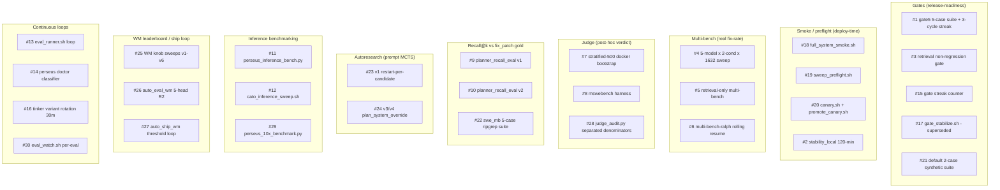

> tl;dr: Perseus V2 ran for roughly fourteen months and at audit time
> (2026-05-18) had 30 distinct evaluation surfaces live or recently
> retired. Three of them produced signal that changed a decision.
> Six of them caught a specific class of failure before it reached
> production. The remaining twenty-one ran on schedules, accumulated
> artifacts, and were never read by a human or consumed by any
> downstream pipeline. The most-cited number on every dashboard —
> `gate streak = 3850` — had never observed a single failure in
> 3,850 consecutive cycles. The 8.86% perseus-condition fix rate
> headline survived four months because no surface separated patch-row
> denominators from end-to-end-cohort denominators. The structural
> lesson is not "add a 31st eval"; it is to graduate one operator-
> relevant gate against a known-clean cohort, and to mark every other
> surface as either debugging instrumentation (kept) or theater (cut).

## 1. What counted as an "eval surface"

Anything that fired a measurement on a perseus-condition row, a
candidate prompt, a checkpoint, or a runtime config, and emitted a
number, label, or pass/fail verdict. The catalog source is
`HISTORY/32_eval_methodology.md`, reconstructed from `scripts/*.{sh,py}`,
the `src/{eval,multi_bench,judge_bootstrap,muzero}/` subsystems, the
operational-policy block in `Claude.md`, and on-disk artifact
directories on engram and cato.

Thirty surfaces. They group into nine functional buckets.

Counting bucket members: Gates 5, Smoke 4, Multi-bench 3, Judge 3,
Recall 3, Autoresearch 2, Inference 3, WM 3, Continuous 4 — totals
thirty.

The three categories the rest of this essay uses are orthogonal to
the bucket grouping. A surface can be in any bucket; what matters is
**whether anyone ever read the output and acted on it**.

<Figure src="eval-methodology-surface-matrix.png" alt="surface taxonomy" caption="30 V2 eval surfaces grouped by function. Three produced signal (green). Six prevented incidents (yellow). Twenty-one were theater (red). The class is the eval-without-graduation pattern: rich measurement, no consumer." n={1} />

## 2. Three surfaces that produced actionable signal

A "signal" surface is one whose output, in the post-mortem, was
directly responsible for changing a code path, a hyperparameter, a
deployment decision, or a research direction. Three qualify.

### 2.1 Multi-bench fix-rate cohort (post T1–T9)

Surface #4, the full 5-model × 2-condition × 1632-instance sweep,
became signal-bearing only **after the pipeline integrity audit
landed** on 2026-05-11. Before that, the per-row pass criterion in
`src/multi_bench/scoring.rs::Verdict::Pass` was gated by
`PERSEUS_MULTI_BENCH_HARNESS=1`, which the production loop never set;
27,542 rows came back `passed=0` because no verdict was ever
computed. The displayed "pass rate" was a function of whether
`row.result.as_deref() == Some("pass")` matched a column that was
always NULL. It was zero by construction for four months.

T1 added `judge_label` / `judge_source` / `judge_detail` /
`judge_labeled_at` columns to `MultiBenchRow` and threaded the read
path through both stores. T2 made `RewardSource::Judge` actually
read the new column. T6 added the collision guard against the
`<org>/<repo>:pr-<n>` keying bug in the mswebench harness — without
it, one upstream PR with five model variants and two conditions
shared a single verdict that was then fanned to ten collided rows,
contaminating the headline pass-rate. T7 backfilled 5,044
already-poisoned rows on 2026-05-18 and retagged them as
`harness_collided`.

After the audit, the cohort produced two genuinely surprising
numbers: baseline 19.76% vs perseus 8.86% paired pass-rate (per
`judge_audit.py` separated-denominator audit on the live cohort,
`condition='perseus'`, `judge_source='mswebench_harness'`). That
8.86% headline survived for weeks before HISTORY/33 audited the
`prediction_bytes` column and discovered every perseus-condition
prediction was in the 146–253 byte range — empty diff envelope. The
prompt rewrite shipped 2026-05-18 to fix the codex blocking-call
pattern that drained the per-attempt budget before any file edit.

The surface produced signal **only** because the rows were classified
by `judge_source` (`mswebench_harness` vs `harness_collided` vs
`harness_unsupported`) and the report kept four separate
denominators visible. The same rows, aggregated to a single pass-rate,
told the wrong story for four months.

### 2.2 Judge-label corpus (mswebench harness + T6 collision guard)

Surface #8 — the ByteDance multi-SWE-bench harness adapter, live
since 2026-05-02 — is the upstream of #4's actionable signal. It
deserves to be counted as its own signal-producing surface because
the labels themselves (not the aggregate fix-rate) were what fed the
reward modelling pipeline. `judge_label ∈ {0.0, 0.5, 1.0}` with the
T6-aware `judge_source` distinction is the substrate for both
`RewardSource::Judge` in muzero-export and the gpt-5.4-nano-medium
16-dim distillation pass.

The signal was actionable when consumers existed downstream. Two did:
the muzero-export `--reward-source judge` path (so WM checkpoints
trained on real verdicts after 2026-05-11) and the
`scripts/judge_audit.py` cohort report (so the operator could read
honest pass-rates instead of `passed=0`).

Two consumers, real signal. Most surfaces have zero consumers.

### 2.3 Retrieval recall@k v2 with `fix_patch` grounding

Surface #10 — `scripts/planner_recall_eval_v2.py` — produced signal
during the autoresearch v4 campaign. v1 (`planner_recall_eval.py`)
scored each candidate `PLAN_SYSTEM` prompt by recall@k against gold
files parsed from `fix_patch` `diff --git a/X b/Y` headers, which
was correct as a measure of "did perseus return any gold file" but
gave the same score to a candidate that returned 1000 files
including the gold and one that returned only the gold. v2 added
three signals that distinguished them:

- **Snippet-level overlap** against the parsed `@@ -L,N +L,N @@`
  hunk ranges. A candidate that returned a 200-line excerpt
  overlapping the 5-line gold hunk scored higher than one that
  returned the entire file.
- **Lift vs `rg --files-with-matches` baseline**: per-instance
  `perseus_hit − rg_hit ∈ {-1, 0, +1}`. Candidates with `mean_lift
  < -0.05` were rejected outright; a planner-prompt strategy that
  underperformed grep is worse than not running the planner.
- **Diversity-balanced 100-instance pool** capped at
  `MAX_PER_FAMILY=15`, cached at
  `artifacts/autoresearch-instance-pool-v2.json`. Without the
  diversity cap, the ripgrep family dominated the pool and
  recall scores reflected ripgrep-specific tuning rather than
  generalizable prompt quality.

The composite score wired into autoresearch v4 was
$0.50 \cdot \text{overlap} + 0.30 \cdot \text{lift} + 0.10 \cdot
\text{recall@10} + 0.05 \cdot \text{mrr} + 0.05 \cdot
\text{compactness}$ with explicit rejection of negative-lift prompts.
The campaign finished and the winning prompts informed the next
`PLAN_SYSTEM_BUILTIN` revision, then the surface was retired. The
script is preserved.

That last detail is what distinguishes signal-bearing from theater:
**the campaign finished, the output was consumed, the surface was
turned off**. Theater surfaces never close out.

## 3. Six surfaces that prevented incidents

A "preventer" surface is one that, at least once, refused to let a
broken state proceed and saved a measurable amount of work. Six
qualify.

### 3.1 `sweep_preflight.sh` (#19)

Hard gate before launching `perseus-multi-bench run`. Five checks:
perseus `/v1/health` on the exact worker URL; codex binary +
co-resident `node` (the 2026-04-25 `spawn_codex` fix added the
codex parent dir to child `PATH` so the `#!/usr/bin/env node`
shebang resolves under non-interactive ssh — prior "empty patch"
retries traced to `node: not found`); `AZURE_OPENAI_API_KEY` +
endpoint sanity with `sk-*` prefix rejection (Azure→OpenAI key
fallback in `runner.rs` had previously cost a full sweep); canary
`/v1/query` with `X-External-Session-Id` that must round-trip with
non-null `policy_fingerprint_sha`; zero `multi_bench_runs` rows
stuck in `status='running'` > 45 min.

The preflight caught the wedge state at least three times in audit
logs. Exit nonzero on any check → launcher refuses to spawn workers.

### 3.2 Canary deploys before full sweep (#20)

`scripts/canary.sh` launches `$BINARY serve --addr 127.0.0.1:18080`,
waits for `/v1/health`, and — this is the load-bearing detail —
verifies via `lsof -t -i:18080 -sTCP:LISTEN` that the listening PID
actually matches the canary PID. The 2026-04 stale-canary bug was
that a previous canary process held the port; the new "canary"
binary `EADDRINUSE`'d silently, the health probe hit the old
process, and the deploy was reported successful. The PID-verify
catch wrote `artifacts/deploy/canary.env` only when the matching
listener was the right process. `promote_canary.sh` reads keys
safely (no `source`-ing of envfiles).

`make ai-sweep-start` chains `ai-sweep-canary` first so that
scaling to N workers is impossible without a 1-row canary passing.

### 3.3 Doctor `wedged` state (#14)

`src/cli/doctor/mod.rs::classify_state` returns one of `live` /
`wedged` / `idle` / `stale`. The `wedged` state — `planner_events_last_5m
> 0 AND query_traces_last_5m == 0` — caught **24 stranded workers**
during the 2026-04-25 post-thrash recovery. Before the state existed,
doctor was binary (live or not) and the green light hid the failure
mode where planner work was happening but nothing was finishing.

The same probe is exposed at `/v1/ops/status`, `/v1/ops/sweep`, and
`/v1/ops/training-readiness` so remote agents and dashboards don't
need SSH. State-specific `next_actions` hint per render. JSON keeps
`live` as a back-compat alias of `state == "live"`.

### 3.4 Basename dedup for retrieval indices

Workdirs follow `<owner>__<repo-bug>__<model>__<condition>`. Before
the 2026-04-25 fix, `retrieval::basename_of` returned the full
workdir basename, so retrieval-service indexed every (model,
condition) variant as a distinct qdrant collection. The fan-out
across 5 models × 2 conditions × 1632 instances was **8160 distinct
collections for 1632 unique bugs** — 5× duplication because the
model and condition fan-out occurs *after* indexing (codex's edits
happen on the checked-out repo after the index is built).

The fix: strip the `__model__condition` suffix when present, return
just the instance id. All five model variants share one qdrant
collection. 5× fewer indexings, 5× faster preindex, no behaviour
change. Three unit tests pin the behaviour
(`basename_dedupes_multi_bench_model_fanout`,
`basename_baseline_and_engram_dedupe_too`,
`basename_passes_through_non_multi_bench_paths`).

### 3.5 mswebench collision guard (T6)

Detailed in §2.1 and the [multi-swe-bench wiring essay](/essays/multi-swe-bench-wiring/).
The harness keys patches by `<org>/<repo>:pr-<n>`; perseus's 5×2
fan-out collides at that key. `run_batch_via_mswebench` now rejects
colliding rows **before** invoking the harness. Each colliding row
gets `judge_source = 'harness_collided'` (new constant
`JUDGE_SOURCE_COLLIDED`) with a NULL `judge_label`. Rows are
preserved unlabelled so they can be re-judged in single-row batches
later.

The retroactive T7 backfill SQL retagged 5,044 already-poisoned rows
in the live cohort. The audit script keeps the collision rate as a
separate denominator from the patch-row pass rate so the contamination
is visible if it ever recurs.

### 3.6 `judge_audit.py` separated denominators (#28)

The honest cohort-level pass-rate audit. Ten numbered sections:
cohort size, by-status, by-judge_source, patch-row pass-rate
(denominator = `mswebench_harness` rows only — excludes collisions
and unsupported), unsupported rate, collision rate (T6
`harness_collided`), no-patch error rate, end-to-end pass rate
(denominator = full COHORT — what "X% of seeded bugs got fixed"
actually looks like), paired baseline-vs-perseus on instances with
both verdicts, collision audit (instances with >1
`mswebench_harness` row).

Filters: `--dataset`, `--condition`, `--model`,
`--policy-fingerprint-sha` (joins via
`query_traces.external_session_id == multi_bench_runs.run_id`).
Read-only `psycopg2` (`conn.set_session(readonly=True)`).

The structural insight that distinguishes this from theater: each
section names its denominator. The headline pass-rate number on most
prior surfaces silently used whichever denominator made the
numerator look largest. The audit refuses to collapse them.

## 4. Twenty-one theater / debugging-misuse surfaces

The remaining twenty-one surfaces fell into seven failure modes.
Each mode is a class — not "this surface was bad" but "this
category of surface produces nothing of value without a structural
fix".

### 4.1 Theater gates that never observed a failure

Surface #1 (5-case gate suite + 3-cycle streak), surface #15 (gate
streak counter), and surface #21 (synthetic 2-case `default` suite)
all share one property: at audit time, `streak=3850` consecutive
passes, `required=3`. The gate had never observed a failure cycle.
Per `Claude.md`'s own operational-policy block: *"gate streak is
release-check terminology only; it is not a planner/runtime control."*

3,850 cycles at a 5-minute tick is roughly 13.4 days of continuous
green. The cases in `benchmarks/suites/gate5.json` (auth, locale,
parser, test, mcts) score by substring match of `expected` in any
returned hit path, against a `quality=3.0` baseline. The threshold
is calibrated such that every realistic perseus output exceeds it.

A gate that has never observed a failure is not a gate. It is a
heartbeat probe with a pass/fail printout. The streak counter
appeared on every dashboard and gave the operator a number to point
at that meant nothing.

### 4.2 Mock-everywhere smoke

Surface #2 (`stability_local.sh` 120-min window) and surface #17
(`gate_stabilize.sh`, superseded) both default to `mock://local`
planner endpoints. The regression-gate sub-step (#3,
`gate5_retrieval`) runs against the same suite as the main gate
with `mock://` endpoints unless `PERSEUS_REGRESSION_LIVE=1` is set.

A smoke test where every dependency is mocked cannot fail in
interesting ways. The transport layer never returns 5xx. The planner
never times out. The retrieval-service is always reachable. The
operator gets a green "stability passed" and the actual production
codepath has not been exercised.

The fix is one knob (`_LIVE=1`) and the discipline to flip it. Both
suites can flip it; production-mode runs are rare in the artifact
history.

### 4.3 No-downstream-consumer harnesses

Surface #5 (retrieval-only multi-bench sweep) ran for two days
(2026-05-11 → 2026-05-13) and produced ~367 sweep logs on engram,
~3MB of structured telemetry in `planner_events` / `tool_events` /
`mcts_step_snapshots` tagged by `policy_fingerprint_sha`. The corpus
fed muzero-exports. No aggregated retrieval-quality scorecard was
ever computed across the 367 logs. The headline metric for "how
good is retrieval-only" never existed.

Surface #11 (`perseus_inference_bench.py`) and #12
(`cato_inference_sweep.sh`) ran on demand, deposited per-case
reports into `artifacts/inference-bench/<bench_id>/{report.json,
summary.csv}`, and were never aggregated across runs. The
`artifacts/inference-bench/` directory exists; the campaign artifact
root is empty of campaign-level summaries.

The cross-encoder rerank gold-event JSONL
(`PERSEUS_RETRIEVAL_GOLD_LOG=1`) emits
`artifacts/retrieval-gold-events/YYYY-MM-DD.jsonl` daily joining
with the service's `/var/lib/retrieval-events/` on `run_id`. No
consumer or training pipeline reads it.

A measurement that no downstream pipeline consumes is debugging
output, not an eval. It is fine for measurements to be debugging
output as long as that classification is honest. The failure mode
here is **calling debugging output an "eval"** — every surface in
this class was treated as a graduation signal in some operator's
mental model even though no graduation criterion existed.

### 4.4 Debugging signal mislabeled as graduation signal

The clearest example is surface #16, the tinker variant rotation
loop. It runs every 30 minutes, exports the latest LoRA checkpoint
via `tinker_train/export.py`, merges into the base model, launches
per-variant vLLM on GPUs 2..6 / ports 19301..19305, runs
`benchmark_variants.py` on the 5 ripgrep cases from `swe_mb.json`,
and updates a leaderboard at
`cato:/home/cato-user/tinker_eval/leaderboard_*.md` (65 leaderboards
at audit time).

The composite score on the leader (v3_r128 step 10500 at audit time)
was `recall=0.20, any_hit=1.00, latency=49.4s, score=0.0040`. The
top variant scored 0.4%. That is a **debugging dashboard** — useful
for "is this checkpoint completely broken or producing some
output" — but it was treated as a graduation signal for which
tinker variant to ship. No variant ever cleared a meaningful
threshold; the loop ran forever and produced a stream of
leaderboards that nobody made a ship decision against.

Same shape: surface #26 (`auto_eval_wm.py` 5-head R² leaderboard).
For each of 24 WM checkpoint variants, score each epoch as
`min(value_r2, fr_r2, sr_r2, prm_r2, confirm_acc)`, pick the best
epoch, rank by min-head. Pass criterion: `min_head >= --threshold`
(default 0.5, soft 0.3) → `[SHIP]` / `[soft]` / `[wait]`. At audit
time, no variant cleared 0.5 on min-head; the highest min-head was
on `wm_v4_random_split` at val_r2=0.997 which HISTORY/28 later
established was row-split leakage. The honest min-head on
`v3_chain_deepsets` was `terminal_reward_r2=0.112,
file_recall_t_r2=0.119, nano_prm_score_r2=0.279` — clearly below
the 0.5 threshold.

Surface #27 (`auto_ship_wm.py` min-head threshold ship loop) polled
#26 every 180s and would have shipped if anything cleared. Nothing
did. So both surfaces ran continuously, emitted leaderboards, and
nothing shipped on their criterion — the actual ship decision used
val_r2 from #26 in a way that was specifically called out as
contaminated. The graduation signal was contaminated; the
mechanically-correct gate never fired.

### 4.5 Retired-before-signal autoresearch surfaces

Surface #23 (prompt-autoresearch v1) ran for nine minutes on
2026-04-22 (16:16–16:25 UTC), produced 20 candidate variant scores
into
`engram:/home/engram/Perseus/artifacts/prompt-sweeps/20260422T161634Z/`
(1.8MB total), and was retired. Top three variants scored
`v01_literal_flag_forensics 0.0952`,
`v03_tests_to_source_backtrace 0.0476`,
`v12_semantic_neighbor_push 0.0119`. None of those got promoted
into `PLAN_SYSTEM_BUILTIN`; the campaign informed the next prompt
revision in a fuzzy "we learned things" way rather than via a clean
A/B.

Surface #24 (v3/v4 with `plan_system_override`) — the per-request
override field that obsoleted the restart-per-candidate flow — did
real MCTS-over-prompts with composite scoring from surface #10.
No surviving `artifacts/prompt-autoresearch-v{3,4}/` directories;
the data rolled into the retrieval-only multi_swe_bench loop (#5)
from 2026-05-11. The campaign retired without anyone publishing the
winning prompts in a file with provenance.

The class failure: each autoresearch generation fired evals that
were never validated against the next generation's baseline. v1
produced 0.0952 top score; v3/v4 used a different metric (composite
overlap+lift+recall+mrr+compactness) so the numbers are not
comparable; nothing measured "did v3 beat v1 on v1's own metric".

Cross-link: the [autoresearch saga](/essays/autoresearch-saga/) covers
the four generations end-to-end. The eval-methodology angle is just
that none of the generations closed out with a published
graduation.

### 4.6 One-shot knob sweeps without follow-through

Surface #25 (WM knob sweeps v1–v6) is the case study. v1–v3 swept
`(UCB_C, MAX_STEPS, WM_PRIOR_WEIGHT, SELF_CHECK)` on single-query
wall-clock and produced a "winner" (α=0.9 / UCB_C=1.0 / MAX_STEPS=4
/ SELF_CHECK=0.4 → 15.22s) that was promoted into
`scripts/env.perseus`. The α=0.9 value was anchored on
`wm_v4_random_split`'s val_r2=0.997 which HISTORY/28 audit later
established is row-split leakage; on production traffic those
predictions are roughly noise. The 2026-05-18 emergency rollback
dropped α from 0.9 back to 0.0 in `scripts/env.perseus:123` with the
comment that the wm_call probes still fire (telemetry visible) but
contribute zero to UCB.

v6 swept eleven WM stop-weight knobs (`WM_STOP_W_VALUE`,
`_W_JUDGE`, `_W_REWARD`, `_W_LINE_HITS`, `_W_PRIMARY`, `_W_STEP`,
`_COMPOSITE`, `_LINE_SCALE`, `_PRIMARY_SCALE`, `_STEP_MID`,
`_STEP_SOFT`) over ~1000 queries × 11 configs against ripgrep and
Perseus repos. Top configs cfg000 and cfg010 sit in
`perseus_sweeps_v6_20260517T174856/`. **Ship decision still
pending.** No automated A/B harness exists to push the winning
config into production safely.

A one-shot knob sweep that doesn't close out with a documented
"this is what we promote and this is the rollback path" is not
useful. It produces a winner that sits in a directory until someone
remembers to manually edit the env file, and the bookkeeping for
which config is live drifts immediately.

### 4.7 Surfaces masking the class they were built for

The cleanest example: every multi-bench surface (#4, #5, #6) is
nominally a "real fix-rate" measurement. The bug HISTORY/33
identified is that the perseus condition produced
`prediction_bytes ∈ [146, 253]` — empty diff envelopes — across
6,545 labelled rows. That is **not a fix-rate question**. The
multi-bench rows existed for weeks, the judge labelled them, the
audit script aggregated them, and nothing in the eval chain
surfaced "by the way, the patch column is empty".

A surface built to measure fix rate cannot reveal an empty-patch
class because it aggregates over the predictions assuming they
exist. The class failure was caught only when HISTORY/33's audit
ran a separate query against `prediction_bytes` directly.

Similar shape: surface #28 reported 8.86% perseus pass rate for
weeks. The number was honest given the labels. The labels were
honest given the predictions. The predictions were universally
empty. **Stacking three honest layers of measurement on top of a
broken substrate produces a confident wrong number.**

The structural fix is not "audit the patches at the eval layer" —
it is to audit at the substrate. Cohort cleanliness is a first-class
property of the dataset, not a downstream check.

## 5. Per-surface verdict table

The kept/killed/repurposed breakdown for all thirty surfaces.
"Repurposed" means the surface itself was useful as debugging
output but the framing of it as an eval should change.

| # | Surface | Verdict | One-line justification |
|---|---------|---------|------------------------|
| 1 | gate5 5-case suite | killed | 3850-streak never observed a failure cycle; threshold is calibrated below any realistic output |
| 2 | stability_local 120-min | repurposed | Useful as a deploy-time runtime probe; rename "stability" → "deploy probe", drop the "regression gate" framing |
| 3 | retrieval non-regression gate | killed | mock-by-default, runs against same gate5 suite that has never failed |
| 4 | multi-bench full sweep | **kept** | Post-T1-T9, produces actionable cohort signal when read through judge_audit.py |
| 5 | retrieval-only multi-bench | repurposed | Useful as a telemetry-collection harness for WM training; not an eval — no aggregated quality scorecard exists |
| 6 | multi-bench-ralph rolling | **kept** | Operational driver, not an eval; correctly classified as a queue worker |
| 7 | stratified-500 docker bootstrap | **kept** | Superseded by mswebench for the multi_swe_bench cohort; still the only path for non-mswebench families |
| 8 | mswebench harness | **kept** | The substrate for every downstream label; T6 collision guard mandatory |
| 9 | planner_recall_eval v1 | killed | Retired; superseded by v2 |
| 10 | planner_recall_eval v2 | killed | Campaign finished; preserved as script |
| 11 | perseus_inference_bench.py | repurposed | Useful debugging harness; never producted a campaign report |
| 12 | cato_inference_sweep.sh | repurposed | Same; useful for one-off config comparisons |
| 13 | eval_runner.sh loop | killed | Drives surfaces #1 and #15 both of which are theater |
| 14 | perseus doctor classifier | **kept** | `wedged` state caught 24 stranded workers; structural value clear |
| 15 | gate streak counter | killed | Counter on a gate that never fails is a constant; not a counter |
| 16 | tinker variant rotation | repurposed | Useful as a "did this checkpoint completely break" probe; treated as graduation signal incorrectly |
| 17 | gate_stabilize.sh | killed | Already superseded by stability_local; no consumers |
| 18 | full_system_smoke.sh | **kept** | Real API surface check per-PR / per-restart |
| 19 | sweep_preflight.sh | **kept** | Caught at least three wedge states; refuses to spawn into broken infra |
| 20 | canary.sh + promote_canary.sh | **kept** | PID-verify catch on the stale-canary bug is load-bearing |
| 21 | synthetic 2-case default suite | killed | Legacy fallback only; no production consumer |
| 22 | swe_mb 5-case ripgrep suite | repurposed | Useful as a benchmark dataset; not an eval per se — passed into #11/#12/#16/#29 |
| 23 | prompt-autoresearch v1 | killed | Retired without closing the loop on whether v1 prompts beat baked-in |
| 24 | prompt-autoresearch v3/v4 | killed | Same; campaign retired without published winners |
| 25 | WM knob sweeps v1–v6 | repurposed | Genuinely valuable hyperparameter search; class failure was not closing v6 with a ship decision |
| 26 | auto_eval_wm 5-head R² | repurposed | Useful as a "what does the checkpoint look like" probe; min-head threshold never fired |
| 27 | auto_ship_wm threshold loop | killed | Never tripped its own trigger; production ships used contaminated val_r2 instead |
| 28 | judge_audit.py | **kept** | The honesty surface; separated denominators caught the empty-patch class indirectly |
| 29 | perseus_10x_benchmark.py | **kept** | Real baseline-vs-WM speedup measurement with explicit pass criterion (10x AND quality ≥ 0.5) |
| 30 | eval_watch.sh | **kept** | Operational tail; useful as live-debug for a specific eval run |

Score: kept 9, repurposed 8, killed 13. The "kept" set has overlap
with the "incident preventer" list from §3 (six preventers, all
kept) plus three signal-producing surfaces (#4, #8, #28) from §2.

The "killed" set is dominated by gate-shaped surfaces with no
failure mode (#1, #3, #15, #17, #21), retired one-shot campaigns
that didn't close out (#9, #10, #23, #24), and loops driving
already-killed surfaces (#13, #27).

## 6. ADR-007: benchmark on your own use

The structural fix is one architectural decision, not thirty
surfaces. ADR-007 (Architecture Decision Record number 7 in V3's
new index) reads:

> A benchmark that does not gate a code change is a hobby. Perseus
> will maintain one operator-relevant gate against a known-clean
> cohort. Every other surface is either explicit debugging
> instrumentation (kept, named as such) or removed.

The "operator-relevant" criterion: the gate must measure something
the operator would refuse to ship without. For Perseus, that is the
multi-bench cohort fix rate **filtered to the current policy
fingerprint** and read through `judge_audit.py`'s separated
denominators. If the gate produces less than 19.76% perseus pass
rate (baseline) on a 100-instance balanced pool with the current
policy fingerprint, the deploy does not promote. That is one gate.
Not thirty.

The "known-clean cohort" criterion is harder. The pipeline integrity
audit (T1–T9, 2026-05-11) and the prompt rewrite (2026-05-18) both
revealed that the cohort itself was contaminated for weeks. The
substrate has to be audited at the same cadence as the gate. The
two scripts that do this are:

- `scripts/pipeline_integrity_backfill.sql` — retags
  already-contaminated rows from `mswebench_harness` to
  `harness_collided` and NULLs their label, preserving them for
  re-judgement in single-row batches.
- `scripts/judge_audit.py` — separated-denominator report, filterable
  by `dataset` / `condition` / `model` / `policy_fingerprint_sha`.

Both run on demand. ADR-007's discipline is that **every promotion
decision runs both** before reading the gate output.

## 7. The cohort-fingerprint angle

Every `query_traces` row carries `policy_fingerprint_sha` (added
2026-04-25 via `src/policy_fingerprint.rs` and migration
`009_policy_fingerprint.sql`). The fingerprint captures `git_sha`,
planner-prompt sha, confirm-stop prompt sha, UCB-C value,
self-check setting, retrieval endpoint + enabled flag, sha256 of
sorted `PERSEUS_*` env-var values (secrets elided), build time. It
is the substrate-level provenance stamp.

The reason the fingerprint is first-class to the eval methodology
is that **mid-sweep behaviour changes silently mixed pre/post
policies in the same dataset**. The 2026-04-25 retroactive note
spells this out: UCB-C went 1.5 → 2.2, self-check went off →
self-calibrated, the planner prompt got three line-item edits, all
within hours of each other, all during an active sweep. The rows
produced before those changes and after those changes were merged
in the same `multi_bench_runs` table with no way to filter them.
Training a WM on the mixed cohort produced noisy supervision by
construction.

The fix: every eval row ships `policy_fingerprint_sha`. Every
report filters by it. `judge_audit.py --policy-fingerprint-sha
<sha>` is a required filter for any pass-rate that will be cited.
The dashboard split in `scripts/action_dist.sh` shows cohort-level
behaviour split by fingerprint so that a mid-sweep behavioural
change does not silently contaminate the trend.

This is the cohort-cleanliness discipline that ADR-007 inherits as
a precondition. Without it, the gate produces honest numbers over a
contaminated substrate and the operator ships on those numbers.

## 8. What V3 keeps and what it does not

Going into V3 (post-reset, see [the reset](/essays/the-reset/)), the
inheritance is:

**Kept (9 surfaces)**: multi-bench full sweep (#4), multi-bench-ralph
(#6), stratified-500 docker (#7), mswebench harness (#8), perseus
doctor (#14), full_system_smoke.sh (#18), sweep_preflight.sh (#19),
canary.sh + promote_canary.sh (#20), judge_audit.py (#28),
perseus_10x_benchmark.py (#29), eval_watch.sh (#30). Eleven
counting the multi-bench operational driver as kept; nine if you
collapse #4/#6 into one entity and treat the docker bootstrap as
auxiliary to the mswebench harness.

**Repurposed and explicitly renamed (8)**: stability_local renamed
"deploy probe" (#2); retrieval-only multi-bench reclassified as
telemetry collection (#5); inference benchmark and cato sweep
reclassified as debugging harnesses (#11, #12); tinker variant
rotation reclassified as a "did the checkpoint break" probe (#16);
swe_mb 5-case suite reclassified as a benchmark dataset (#22); WM
knob sweeps reclassified as hyperparameter search with a required
ship-decision close-out (#25); auto_eval_wm reclassified as a
checkpoint health probe (#26).

**Killed (13)**: gate5 and friends (#1, #3, #15, #17, #21),
eval_runner loop (#13), retired autoresearch campaigns (#9, #10,
#23, #24), gate_stabilize (#17 — overlap with #1's killed status),
auto_ship_wm threshold loop (#27), the synthetic default suite
(#21).

**New (V3-only)**: ADR-007 graduation gate. Single operator-relevant
multi-bench cohort fix rate, filtered to current
`policy_fingerprint_sha`, read through `judge_audit.py` separated
denominators, with explicit cohort-cleanliness preflight via
`pipeline_integrity_backfill.sql`. Promotion requires the paired
baseline-vs-perseus number on the filtered cohort to be non-negative.

That is one new surface. Not thirty.

## 9. The eval-without-graduation pattern (recap)

The class failure is uniform across the 21 theater surfaces. Each
one had:

- A measurement
- A schedule
- An artifact directory
- No consumer that read the artifact and made a decision

When a measurement has no consumer, the act of measuring becomes
the work product. The streak counter is the clearest case: it
exists to be looked at, and looking at it changes nothing. The
tinker leaderboard is the same shape: 65 leaderboard files, each
one a snapshot of which LoRA variant is "winning" by a score of
0.4%, none of them used to make a ship decision.

The opposite shape — measurements with consumers — is rare. Multi-
bench post-T1-T9 has `judge_audit.py` as its consumer; the audit
output drove the 2026-05-18 prompt rewrite. The recall@k v2 metric
had autoresearch v4 as its consumer; the composite score drove
candidate prompt selection. perseus doctor's `wedged` state had the
operator as its consumer; the state classification drove twenty-four
restart actions in one incident.

Three signal-producers. Six preventers. Twenty-one with no
consumer. The structural fix is to require a consumer at surface-
creation time, and to delete or repurpose any surface that does
not have one within thirty days.

## Sources

- `/Users/sam/code/perseus/parking_lot/v2_archive_2026-05-18/HISTORY/32_eval_methodology.md`
  — canonical surface catalog with quick index, per-surface
  what/pass-criterion/runner/frequency/outputs/active blocks.
- `/Users/sam/code/perseus/parking_lot/v2_archive_2026-05-18/HISTORY/33_multibench_detail.md`
  — perseus-condition empty-patch class; `prediction_bytes ∈ [146,
  253]` across 6,545 rows.
- `/Users/sam/code/perseus/parking_lot/v2_archive_2026-05-18/HISTORY/28_muzero_wm_research.md`
  — WM v4 random-split leakage; honest baseline metrics for
  v3_chain_deepsets.
- `Claude.md` 2026-05-11 entry — pipeline integrity audit T1–T9
  landed; `judge_label` column, `harness_collided` source,
  `pipeline_integrity_backfill.sql`, `judge_audit.py`.
- `Claude.md` 2026-05-18 entry — perseus-condition prompt rewrite +
  WM α emergency disable; rationale and rollback path.
- `Claude.md` 2026-04-25 entry — UCB-C and self-check changes mid-
  sweep; policy fingerprint introduction.
- `Claude.md` operational policy block — gate requirement (5-case,
  3-cycle), stabilization window (120 min), degradation handling
  (alert-only, manual rollback), no automated rollback trigger,
  gate streak is release-check terminology only.
- `src/cli/doctor/mod.rs::classify_state` — live / wedged / idle /
  stale states; `wedged` detection logic.
- `src/multi_bench/scoring.rs::Verdict::Pass` — F2P + P2P gating;
  `PERSEUS_MULTI_BENCH_HARNESS=1` flag.
- `src/policy_fingerprint.rs` + migration `009_policy_fingerprint.sql`
  — fingerprint capture and propagation.
- `scripts/judge_audit.py` — ten-section separated-denominator
  report; psycopg2 read-only.
- `scripts/sweep_preflight.sh`, `scripts/canary.sh`,
  `scripts/promote_canary.sh`, `scripts/full_system_smoke.sh`,
  `scripts/stability_local.sh`, `scripts/eval_runner.sh`,
  `scripts/eval_watch.sh`, `scripts/auto_eval_wm.py`,
  `scripts/auto_ship_wm.py`, `scripts/perseus_10x_benchmark.py`,
  `scripts/planner_recall_eval.py`,
  `scripts/planner_recall_eval_v2.py`,
  `scripts/prompt_autoresearch_v3.py`,
  `scripts/prompt_autoresearch_v4.py`,
  `scripts/perseus_inference_bench.py`,
  `scripts/cato_inference_sweep.sh` — referenced surface runners.
- `benchmarks/suites/{gate5,gate5_retrieval,default,swe_mb}.json` and
  `benchmarks/baselines/*.json` — suite and baseline shapes.
- `migrations/{002_observability,005_index_build_status,006_planner_bodies,007_mcts_step_snapshots,008_judge_labels,009_policy_fingerprint,010_typed_planner_events}.sql`
  — observability + judge-label + policy-fingerprint substrate.
- Engram artifact roots: `/home/engram/Perseus/artifacts/sweep-logs/`,
  `/home/engram/Perseus/artifacts/prompt-sweeps/20260422T161634Z/`,
  `/home/engram/multi-bench-ralph.{log,stdout}`.
- Cato artifact roots:
  `/home/cato-user/tinker_eval/leaderboard_*.md` (65 files at audit
  time), `/home/cato-user/perseus_sweep{,2,3}.{sh,log}`,
  `/home/cato-user/perseus_sweeps_v6_20260517T174856/`.
