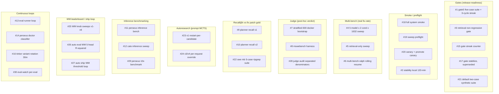
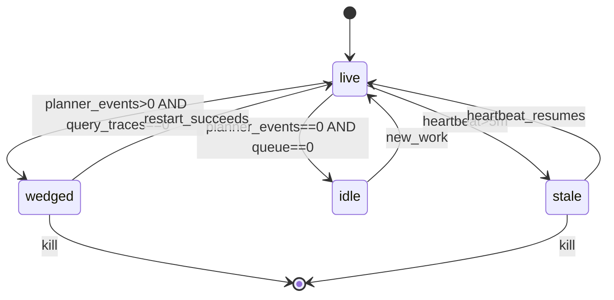
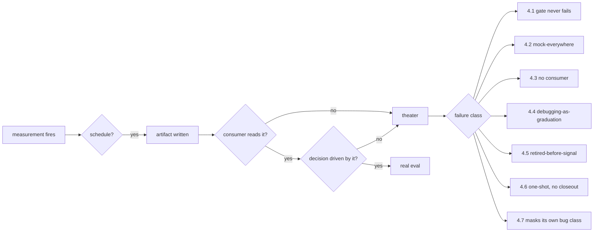
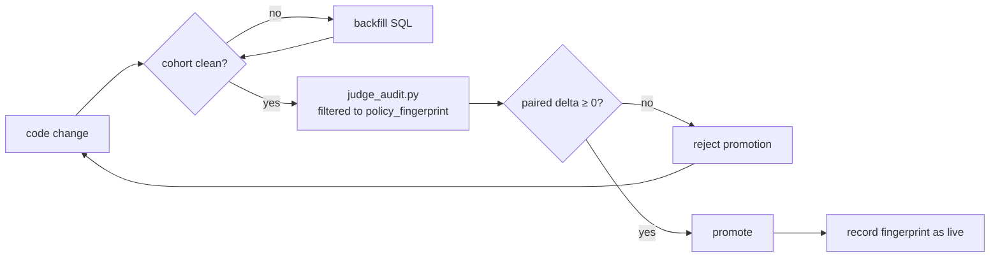

We ran 30 distinct evaluation surfaces across fourteen months of V2. Three produced signal that changed a decision. Six caught failure classes before they reached production. Twenty-one ran on schedules, accumulated artifacts, and were never read by a human or consumed by any downstream pipeline. The most-cited number on every dashboard — a "gate streak" of 3,850 — had never observed a single failure in 3,850 consecutive cycles. The 8.86% perseus-condition fix-rate headline survived four months because no surface separated patch-row denominators from end-to-end-cohort denominators. The structural lesson is not "add a 31st eval"; it is to graduate one operator-relevant gate against a known-clean cohort, and to mark every other surface as either debugging instrumentation (kept) or theater (cut).

This essay is the post-mortem. ADR-007 is the architectural conclusion: a benchmark that does not gate a code change is a hobby.

## 1. What we counted as an eval surface

We counted anything that fired a measurement on a perseus-condition row, a candidate prompt, a checkpoint, or a runtime config, and emitted a number, label, or pass/fail verdict. The catalog was reconstructed from `scripts/*.{sh,py}`, the eval/multi_bench/judge_bootstrap/muzero subsystems, the operational-policy block in our top-level project memory, and on-disk artifact directories on engram and cato.

Thirty surfaces. They group into nine functional buckets.

Counting bucket members: Gates 5, Smoke 4, Multi-bench 3, Judge 3, Recall 3, Autoresearch 2, Inference 3, WM 3, Continuous 4 — thirty.

The three categories we use below are orthogonal to bucket grouping. A surface can sit in any bucket; what matters is whether anyone ever read the output and acted on it.

<Figure src="eval-methodology-surface-matrix.png" alt="surface taxonomy" caption="30 V2 eval surfaces grouped by function. Three produced signal (green). Six prevented incidents (yellow). Twenty-one were theater (red). The class is the eval-without-graduation pattern: rich measurement, no consumer." n={1} />

## 2. Three surfaces that produced actionable signal

A signal surface is one whose output was directly responsible, in the post-mortem, for changing a code path, hyperparameter, deployment decision, or research direction. Three qualify.

### 2.1 Multi-bench fix-rate cohort (post T1–T9)

Surface #4 — the full 5-model × 2-condition × 1,632-instance sweep — became signal-bearing only after the pipeline integrity audit landed on 2026-05-11. Before that, the per-row pass criterion was gated by a harness env flag the production loop never set; 27,542 rows came back with zero passes because no verdict was ever computed. The displayed pass rate was driven by a substring match against a column that was always NULL. It was zero by construction for four months.

T1 added `judge_label`, `judge_source`, `judge_detail`, `judge_labeled_at` columns to the multi-bench row type and threaded the read path through both stores. T2 made the judge reward source actually read the new column. T6 added the collision guard against the harness's PR-keyed verdict bug — without it, one upstream PR with five model variants and two conditions shared a single verdict that was fanned to ten collided rows, contaminating the headline pass-rate. T7 backfilled 5,044 already-poisoned rows and retagged them `harness_collided`.

After the audit, the cohort produced two genuinely surprising numbers:

$$
\text{pass}_{\text{baseline}} = 19.76\%, \quad \text{pass}_{\text{perseus}} = 8.86\%
$$

on a paired filter where `condition = perseus`, `judge_source = mswebench_harness`. That 8.86% headline survived for weeks before HISTORY/33 audited the predicted-bytes column and discovered every perseus-condition prediction was in the 146–253 byte range — an empty diff envelope. The prompt rewrite shipped 2026-05-18 to fix the codex blocking-call pattern that drained the per-attempt budget before any file edit.

The surface produced signal only because the rows were classified by `judge_source` and the report kept four separate denominators visible. The same rows, aggregated to a single pass-rate, told the wrong story for four months. We return to this in §4.7 — the deepest failure mode is stacking three honest layers of measurement on top of a broken substrate.

### 2.2 Judge-label corpus (mswebench harness + T6 collision guard)

Surface #8 — the ByteDance multi-SWE-bench harness adapter, live since 2026-05-02 — is the upstream of #4's actionable signal. It deserves its own slot because the labels themselves (not the aggregate fix-rate) fed the reward-modelling pipeline. With $\text{judge\_label} \in \{0.0, 0.5, 1.0\}$ and T6-aware source distinction, the label corpus is the substrate for both the judge-reward path in muzero-export and the 16-dim nano-judge distillation.

Two consumers downstream:

1. The muzero-export judge-reward path, so WM checkpoints trained after 2026-05-11 see real verdicts in their HL-Gauss bins instead of the silent zero-reward bucket that produced four months of regressed value heads.
2. The audit script's cohort report, so the operator reads honest pass-rates instead of the always-NULL substring match that haunted the dashboards.

Two consumers, real signal. Most surfaces have zero consumers. The harness adapter itself cost roughly three engineering days plus the slimmed-dataset-subset performance fix (a roughly 33x parse-time reduction by writing only the matching rows to the harness's input file). The label corpus that resulted is the single most valuable artifact V2 produced for V3.

### 2.3 Retrieval recall@k v2 with fix-patch grounding

Surface #10, the v2 recall harness, produced signal during the autoresearch v4 campaign. v1 scored each candidate planner-system prompt by recall@k against gold files parsed from `diff --git a/X b/Y` headers. That was correct as a measure of "did perseus return any gold file" but gave the same score to a candidate that returned 1,000 files including the gold and one that returned only the gold. v2 added three signals that distinguished them:

1. **Snippet-level overlap** against parsed hunk ranges. A candidate returning a 200-line excerpt overlapping a 5-line gold hunk scored higher than one returning the entire file.
2. **Lift over a grep baseline**: per-instance $\Delta_i = \mathbb{1}[\text{perseus hit}] - \mathbb{1}[\text{rg hit}] \in \{-1, 0, +1\}$. Candidates with $\overline{\Delta} < -0.05$ were rejected outright; a planner-prompt strategy that underperformed grep is worse than not running the planner.
3. **Diversity-balanced 100-instance pool** capped at 15 per family. Without the diversity cap, the ripgrep family dominated and recall scores reflected ripgrep-specific tuning rather than generalizable prompt quality.

The composite score wired into autoresearch v4 was

$$
S = 0.50 \cdot \text{overlap} + 0.30 \cdot \text{lift} + 0.10 \cdot \text{recall@10} + 0.05 \cdot \text{MRR} + 0.05 \cdot \text{compactness}
$$

with explicit rejection of negative-lift prompts. The campaign finished and the winning prompts informed the next baked-in planner prompt revision, then the surface was retired. The script is preserved.

That last detail is what distinguishes signal-bearing from theater: the campaign finished, the output was consumed, the surface was turned off. Theater surfaces never close out.

## 3. Six surfaces that prevented incidents

A preventer surface is one that, at least once, refused to let a broken state proceed and saved a measurable amount of work. Six qualify.

### 3.1 Sweep preflight

Surface #19 is a hard gate before launching the multi-bench runner. Five checks:

1. Perseus health on the exact worker URL.
2. Codex binary plus co-resident node (the 2026-04-25 spawn-codex fix added the codex parent dir to child PATH so the `#!/usr/bin/env node` shebang resolves under non-interactive ssh — prior "empty patch" retries traced to a missing node binary).
3. Azure OpenAI key plus endpoint sanity, with explicit rejection of OpenAI-shaped keys (a key fallback in the runner had previously cost a full sweep).
4. Canary query with an external-session-id header that must round-trip with a non-null policy fingerprint.
5. Zero multi-bench rows stuck in `status=running` for more than 45 minutes.

The preflight caught the wedge state at least three times in audit logs. Exit nonzero on any check → launcher refuses to spawn workers.

### 3.2 Canary deploys before full sweep

Surface #20 launches the canary on a private port, waits for health, and — this is the load-bearing detail — verifies that the listening PID matches the spawned canary PID. The 2026-04 stale-canary bug was that a previous canary held the port; the new canary `EADDRINUSE`'d silently, the health probe hit the old process, and the deploy was reported successful. The PID-verify catch writes the canary env file only when the matching listener is the right process. The promote script reads keys safely (no shell-sourcing of env files).

Our sweep-start make target chains the canary first, so scaling to N workers is impossible without a 1-row canary passing.

### 3.3 Doctor "wedged" state

The doctor classifier returns one of `live`, `wedged`, `idle`, `stale`. The `wedged` state — defined as planner events in the last five minutes but zero finished query traces — caught 24 stranded workers during the 2026-04-25 post-thrash recovery.

Before the state existed, doctor was binary (live or not) and the green light hid the failure mode where planner work was happening but nothing was finishing. The same probe is exposed at three ops endpoints so remote agents and dashboards do not need ssh.

### 3.4 Basename dedup for retrieval indices

Workdirs follow `<owner>__<repo-bug>__<model>__<condition>`. Before the 2026-04-25 fix, the retrieval helper returned the full workdir basename, so retrieval-service indexed every (model, condition) variant as a distinct qdrant collection. The fan-out was

$$
N_{\text{collections}} = 5 \cdot 2 \cdot 1{,}632 = 16{,}320
$$

for what should have been 1,632 distinct repos. The model and condition fan-out occurs *after* indexing — codex's edits happen on the checked-out repo after the index is built — so all five model variants for one bug have identical source content. Five-times duplication, by construction.

The fix strips the model and condition suffix when present and returns just the instance id. All five variants share one collection. Five-times fewer indexings, no behaviour change. Three unit tests pin the dedup behaviour.

### 3.5 Mswebench collision guard (T6)

The harness keys patches by `<org>/<repo>:pr-<n>`; our 5×2 fan-out collides at that key. The batch runtime now rejects colliding rows before invoking the harness. Each colliding row gets a distinct `judge_source` and a NULL label. Rows are preserved unlabelled so they can be re-judged in single-row batches later.

The retroactive T7 backfill SQL retagged 5,044 already-poisoned rows in the live cohort. The audit script keeps collision rate as a separate denominator from patch-row pass rate, so contamination is visible if it recurs.

### 3.6 Judge-audit separated denominators

Surface #28 is the honest cohort report. Ten numbered sections: cohort size, by-status, by-source, patch-row pass-rate (denominator = harness-judged rows only, excluding collisions and unsupported), unsupported rate, collision rate, no-patch error rate, end-to-end pass rate (denominator = full cohort — what "X% of seeded bugs got fixed" actually looks like), paired baseline-vs-perseus on instances with both verdicts, collision audit. Each section names its denominator.

Filters by dataset, condition, model, and policy fingerprint. Read-only psycopg2. The structural insight: the headline pass-rate number on most prior surfaces silently used whichever denominator made the numerator look largest. The audit refuses to collapse them.

The arithmetic is unforgiving. Suppose the cohort has $N$ rows, of which $N_h$ have a harness verdict, $N_c$ are collision-flagged, $N_u$ are unsupported, $N_e$ erred out before producing a patch. Then the headline "pass rate" can be quoted as any of

$$
\frac{p}{N_h}, \quad \frac{p}{N_h + N_c}, \quad \frac{p}{N_h + N_c + N_u}, \quad \frac{p}{N}
$$

and each is a different number. Most prior dashboards picked the first by default (largest), then displayed it as if it were the last. The audit shows all four side by side, with their denominators labelled.

## 4. Twenty-one theater / debugging-misuse surfaces

The remaining twenty-one fell into seven failure modes. Each mode is a class — not "this surface was bad" but "this category of surface produces nothing of value without a structural fix".

### 4.1 Theater gates that never observed a failure

Surfaces #1, #15, and #21 all share one property: at audit time, streak = 3,850 consecutive passes, required = 3. The gate had never observed a failure cycle. Our own operational-policy block reads: gate streak is release-check terminology only; it is not a planner or runtime control.

3,850 cycles at a 5-minute tick is roughly 13.4 days of continuous green. The cases in `gate5.json` score by substring match of expected against any returned hit path, against a baseline of quality = 3.0. The threshold is calibrated such that every realistic perseus output exceeds it.

A gate that has never observed a failure is not a gate. It is a heartbeat probe with a pass-fail printout. The streak counter appeared on every dashboard and gave the operator a number to point at that meant nothing.

### 4.2 Mock-everywhere smoke

Surface #2 and surface #17 both default to mock planner endpoints. The regression gate sub-step (#3) runs against the same suite as the main gate with mock endpoints unless an explicit live flag is set.

A smoke test where every dependency is mocked cannot fail in interesting ways. The transport layer never returns 5xx. The planner never times out. Retrieval-service is always reachable. The operator gets a green stability-passed and the actual production codepath has not been exercised. The fix is one flag and the discipline to flip it; production-mode runs are rare in the artifact history.

### 4.3 No-downstream-consumer harnesses

Surface #5 (retrieval-only multi-bench) ran for two days and produced ~367 sweep logs plus ~3MB of structured telemetry, tagged by policy fingerprint. The corpus fed muzero-exports. No aggregated retrieval-quality scorecard was ever computed across the 367 logs. The headline metric for "how good is retrieval-only" never existed.

Surfaces #11 and #12 (inference benchmarks) ran on demand, deposited per-case reports into a structured directory, and were never aggregated across runs. The campaign artifact root is empty of campaign-level summaries. The cross-encoder rerank gold-event JSONL emits daily files joining with the service's event log on run id. No consumer reads it.

A measurement that no downstream pipeline consumes is debugging output, not an eval. It is fine for measurements to be debugging output, as long as that classification is honest. The failure mode here is calling debugging output an eval — every surface in this class was treated as a graduation signal in some operator's mental model, even though no graduation criterion existed.

### 4.4 Debugging signal mislabeled as graduation signal

The clearest example is surface #16, the tinker variant rotation loop. It runs every 30 minutes, exports the latest LoRA checkpoint, merges into base, launches per-variant vLLM on GPUs 2 through 6 / ports 19301 through 19305, runs the variant benchmark on five ripgrep cases, and updates a leaderboard. Sixty-five leaderboards exist at audit time.

The composite score on the leader (v3_r128 step 10500) was

$$
\text{recall} = 0.20, \quad \text{any\_hit} = 1.00, \quad \text{latency} = 49.4\,\text{s}, \quad S = 0.0040
$$

The top variant scored 0.4%. That is a debugging dashboard — useful for "is this checkpoint completely broken" — but it was treated as a graduation signal for which tinker variant to ship. No variant ever cleared a meaningful threshold.

Same shape: surface #26 ranks 24 WM checkpoint variants by min-head $R^2$:

$$
\text{score}(\theta) = \min\bigl(R^2_{\text{value}},\, R^2_{\text{fr}},\, R^2_{\text{sr}},\, R^2_{\text{prm}},\, \text{acc}_{\text{confirm}}\bigr)
$$

Pass criterion: $\text{score} \geq \tau$ with $\tau = 0.5$ default, $\tau = 0.3$ soft. At audit time, no variant cleared 0.5 on min-head; the highest min-head was `wm_v4_random_split` at val-$R^2$ of 0.997 which HISTORY/28 later established was row-split leakage. The honest min-head on `v3_chain_deepsets` was 0.112 — clearly below threshold.

Surface #27 (the ship loop) polled #26 every 180 seconds and would have shipped if anything cleared. Nothing did. So both surfaces ran continuously, emitted leaderboards, and nothing shipped on their criterion — the actual ship decision used val-$R^2$ from #26 in a way that was specifically called out as contaminated. The graduation signal was contaminated; the mechanically-correct gate never fired.

### 4.5 Retired-before-signal autoresearch surfaces

Surface #23 (autoresearch v1) ran for nine minutes on 2026-04-22, produced 20 candidate variant scores into a timestamped artifact directory, and was retired. Top three variants scored 0.0952, 0.0476, 0.0119. None got promoted into the baked-in planner prompt; the campaign informed the next prompt revision in a fuzzy "we learned things" way rather than via a clean A/B.

Surface #24 (v3 and v4 with the per-request planner-prompt override) did real MCTS-over-prompts with composite scoring from surface #10. The data rolled into the retrieval-only multi-bench loop from 2026-05-11. The campaign retired without anyone publishing the winning prompts in a file with provenance.

The class failure: each autoresearch generation fired evals that were never validated against the next generation's baseline. v1 produced 0.0952 top score; v3 and v4 used a different metric, so the numbers are not comparable; nothing measured "did v3 beat v1 on v1's own metric". The [autoresearch saga](/essays/autoresearch-saga/) covers the four generations end-to-end.

### 4.6 One-shot knob sweeps without follow-through

Surface #25 (WM knob sweeps v1 through v6) is the case study. v1 through v3 swept four hyperparameters on single-query wall-clock and produced a "winner" — $\alpha = 0.9$, UCB-C = 1.0, max-steps = 4, self-check = 0.4, latency = 15.22s — that was promoted into our env file. The $\alpha = 0.9$ value was anchored on the `wm_v4_random_split` val-$R^2$ that HISTORY/28 later established is row-split leakage; on production traffic those predictions are roughly noise. The 2026-05-18 emergency rollback dropped $\alpha$ from 0.9 back to 0.0 with the comment that the WM probes still fire (telemetry visible) but contribute zero to UCB.

v6 swept eleven WM stop-weight knobs over ~1,000 queries × 11 configs against the ripgrep and perseus repos. Top configs cfg000 and cfg010 sit in a timestamped directory. **Ship decision still pending.** No automated A/B harness exists to push the winning config into production safely.

A one-shot knob sweep that does not close out with a documented "this is what we promote and this is the rollback path" is not useful. It produces a winner that sits in a directory until someone remembers to manually edit the env file, and the bookkeeping for which config is live drifts immediately.

### 4.7 Surfaces masking the class they were built for

The cleanest example: every multi-bench surface (#4, #5, #6) is nominally a real fix-rate measurement. HISTORY/33 identified that the perseus condition produced prediction bytes in the range 146 to 253 across 6,545 labelled rows — empty diff envelopes. That is not a fix-rate question. The multi-bench rows existed for weeks, the judge labelled them, the audit script aggregated them, and nothing in the eval chain surfaced "the patch column is empty".

A surface built to measure fix rate cannot reveal an empty-patch class, because it aggregates over the predictions assuming they exist. The class failure was caught only when HISTORY/33 ran a separate query against the predicted-bytes column directly.

Similar shape: surface #28 reported 8.86% perseus pass rate for weeks. The number was honest given the labels. The labels were honest given the predictions. The predictions were universally empty. **Stacking three honest layers of measurement on top of a broken substrate produces a confident wrong number.**

The structural fix is not "audit the patches at the eval layer" — it is to audit at the substrate. Cohort cleanliness is a first-class property of the dataset, not a downstream check.

## 5. Per-surface verdict table

The kept / killed / repurposed breakdown for all thirty surfaces. "Repurposed" means the surface itself was useful as debugging output, but the framing of it as an eval should change.

| # | Surface | Verdict | One-line justification |
|---|---------|---------|------------------------|
| 1 | gate5 5-case suite | killed | Streak of 3,850 never observed a failure; threshold calibrated below any realistic output |
| 2 | stability local 120-min | repurposed | Useful as deploy-time runtime probe; drop "regression gate" framing |
| 3 | retrieval non-regression gate | killed | Mock-by-default, runs against same gate5 suite that has never failed |
| 4 | multi-bench full sweep | kept | Post-T1–T9, produces actionable cohort signal when read through the audit script |
| 5 | retrieval-only multi-bench | repurposed | Telemetry collection for WM training; never aggregated a quality scorecard |
| 6 | multi-bench-ralph rolling | kept | Operational driver, not an eval; correctly classified as a queue worker |
| 7 | stratified-500 docker bootstrap | kept | Still the only path for non-mswebench families |
| 8 | mswebench harness | kept | Substrate for every downstream label; T6 collision guard mandatory |
| 9 | planner recall v1 | killed | Retired; superseded by v2 |
| 10 | planner recall v2 | killed | Campaign finished; preserved as script |
| 11 | perseus inference bench | repurposed | Useful debugging harness; never produced a campaign report |
| 12 | cato inference sweep | repurposed | Same; one-off config comparisons |
| 13 | eval runner loop | killed | Drives #1 and #15, both theater |
| 14 | perseus doctor classifier | kept | Wedged state caught 24 stranded workers |
| 15 | gate streak counter | killed | Counter on a gate that never fails is a constant, not a counter |
| 16 | tinker variant rotation | repurposed | Useful as a "did this checkpoint break" probe; misused as graduation signal |
| 17 | gate stabilize | killed | Already superseded by stability local; no consumers |
| 18 | full system smoke | kept | Real API surface check per-PR / per-restart |
| 19 | sweep preflight | kept | Caught at least three wedge states; refuses to spawn into broken infra |
| 20 | canary + promote canary | kept | PID-verify catch on the stale-canary bug is load-bearing |
| 21 | synthetic 2-case default suite | killed | Legacy fallback only; no production consumer |
| 22 | swe-mb 5-case ripgrep suite | repurposed | Benchmark dataset; not an eval per se |
| 23 | autoresearch v1 | killed | Retired without closing the loop on whether v1 beat baked-in |
| 24 | autoresearch v3/v4 | killed | Same; retired without published winners |
| 25 | WM knob sweeps v1–v6 | repurposed | Valuable hyperparam search; failure was not closing v6 with a ship decision |
| 26 | auto eval WM 5-head R-squared | repurposed | Checkpoint health probe; min-head threshold never fired |
| 27 | auto ship WM threshold loop | killed | Never tripped its trigger; production used contaminated val-R-squared |
| 28 | judge audit | kept | The honesty surface; separated denominators caught the empty-patch class indirectly |
| 29 | perseus 10x benchmark | kept | Baseline-vs-WM speedup with explicit pass criterion (10x AND quality &geq; 0.5) |
| 30 | eval watch | kept | Live-debug for a specific eval run |

Score: kept 9, repurposed 8, killed 13. The kept set overlaps with the six preventers from §3 and the three signal-producers from §2.

The killed set is dominated by gate-shaped surfaces with no failure mode (#1, #3, #15, #17, #21), retired one-shot campaigns that did not close out (#9, #10, #23, #24), and loops driving already-killed surfaces (#13, #27).

## 6. ADR-007: benchmark on your own use

The structural fix is one architectural decision, not thirty surfaces. ADR-007 in V3's new index reads:

> A benchmark that does not gate a code change is a hobby. Perseus will maintain one operator-relevant gate against a known-clean cohort. Every other surface is either explicit debugging instrumentation (kept, named as such) or removed.

The "operator-relevant" criterion: the gate must measure something the operator would refuse to ship without. For Perseus, that is the multi-bench cohort fix-rate, filtered to the current policy fingerprint, read through `judge_audit.py`'s separated denominators. If the gate produces less than the baseline 19.76% perseus pass-rate on a 100-instance balanced pool with the current fingerprint, the deploy does not promote. One gate. Not thirty.

The "known-clean cohort" criterion is harder. The pipeline integrity audit (T1 through T9, 2026-05-11) and the prompt rewrite (2026-05-18) both revealed that the cohort itself was contaminated for weeks. The substrate has to be audited at the same cadence as the gate. Two scripts do this: an integrity backfill that retags already-contaminated rows and NULLs their label (preserving them for re-judgement in single-row batches), and the audit report itself.

Both run on demand. ADR-007's discipline is that every promotion decision runs both before reading the gate output.

The cost arithmetic that justifies cutting twenty-one surfaces: each surface has a per-cycle cost in compute, an integration-debt cost in code complexity, and an attention cost in operator hours spent looking at dashboards. Call the per-cycle compute cost $c_i$, the per-week attention cost $a_i$, and the integration debt $d_i$. The expected value of a surface is

$$
\mathbb{E}[V_i] = \Pr[\text{consumer acts}] \cdot \text{value}(\text{action}) - (c_i + a_i + d_i)
$$

For a surface with no consumer, $\Pr[\text{consumer acts}] = 0$ and the expected value is strictly negative. Twenty-one of thirty surfaces satisfied this. The cumulative attention cost alone — operator-time spent reading dashboards that drove no decision — was the single largest hidden expense of V2.

## 7. The cohort-fingerprint angle

Every query trace carries `policy_fingerprint_sha`, added 2026-04-25 via a dedicated module and migration. The fingerprint captures git sha, planner-prompt sha, confirm-stop prompt sha, UCB-C value, self-check setting, retrieval endpoint and enabled flag, sha256 of sorted Perseus env-var values with secrets elided, and build time. It is the substrate-level provenance stamp.

The reason the fingerprint is first-class to eval methodology is that mid-sweep behaviour changes silently mixed pre- and post-policies in the same dataset. The 2026-04-25 retroactive note spells this out: UCB-C went from 1.5 to 2.2, self-check went from off to self-calibrated, the planner prompt got three line-item edits, all within hours, all during an active sweep. The rows produced before and after those changes were merged in the same multi-bench table with no way to filter them. Training a WM on the mixed cohort produced noisy supervision by construction.

The fix: every eval row ships the fingerprint. Every report filters by it. The audit script's fingerprint filter is required for any pass-rate that will be cited. The action-dist dashboard splits cohort-level behaviour by fingerprint so that a mid-sweep behavioural change does not silently contaminate the trend.

This is the cohort-cleanliness discipline that ADR-007 inherits as a precondition. Without it, the gate produces honest numbers over a contaminated substrate and the operator ships on those numbers.

## 8. What V3 keeps and what it does not

Going into V3 (see [the reset](/essays/the-reset/)):

1. **Kept (9 surfaces)**: multi-bench full sweep, multi-bench-ralph, stratified-500 docker bootstrap, mswebench harness, perseus doctor, full system smoke, sweep preflight, canary plus promote, judge audit, the 10x benchmark, eval watch.
2. **Repurposed and explicitly renamed (8)**: stability local renamed to "deploy probe"; retrieval-only multi-bench reclassified as telemetry collection; the inference bench and cato sweep reclassified as debugging harnesses; tinker variant rotation reclassified as a checkpoint-health probe; the swe-mb 5-case suite reclassified as a benchmark dataset; WM knob sweeps reclassified as hyperparam search with a required ship-decision close-out; the WM 5-head leaderboard reclassified as a checkpoint health probe.
3. **Killed (13)**: gate5 and friends, the eval runner loop, the retired autoresearch campaigns, gate stabilize, the auto-ship threshold loop, the synthetic default suite.
4. **New (V3-only)**: ADR-007 graduation gate. Single operator-relevant multi-bench cohort fix-rate, filtered to current policy fingerprint, read through separated denominators, with explicit cohort-cleanliness preflight. Promotion requires the paired baseline-vs-perseus delta on the filtered cohort to be non-negative.

That is one new surface. Not thirty.

## 9. The eval-without-graduation pattern

The class failure is uniform across the 21 theater surfaces. Each one had:

1. A measurement.
2. A schedule.
3. An artifact directory.
4. No consumer that read the artifact and made a decision.

When a measurement has no consumer, the act of measuring becomes the work product. The streak counter is the clearest case: it exists to be looked at, and looking at it changes nothing. The tinker leaderboard is the same shape: 65 leaderboard files, each a snapshot of which LoRA variant is "winning" by a score of 0.4%, none used to make a ship decision.

The opposite shape — measurements with consumers — is rare. Multi-bench post-T1–T9 has the audit script as its consumer; the audit output drove the 2026-05-18 prompt rewrite. The v2 recall metric had autoresearch v4 as its consumer; the composite score drove candidate prompt selection. The doctor's wedged state had the operator as its consumer; the state classification drove twenty-four restart actions in one incident.

Three signal-producers. Six preventers. Twenty-one with no consumer.

The structural fix is to require a consumer at surface-creation time, and to delete or repurpose any surface that does not have one within thirty days. ADR-007 codifies the first half; the second half is operational discipline. We have not yet earned the right to call it solved — the v6 WM sweep is still pending a ship decision as of this writing, which means at least one surface remains in the "produced a winner, no consumer plumbed it through" bucket. The discipline is to close that loop before adding another surface, not after.
