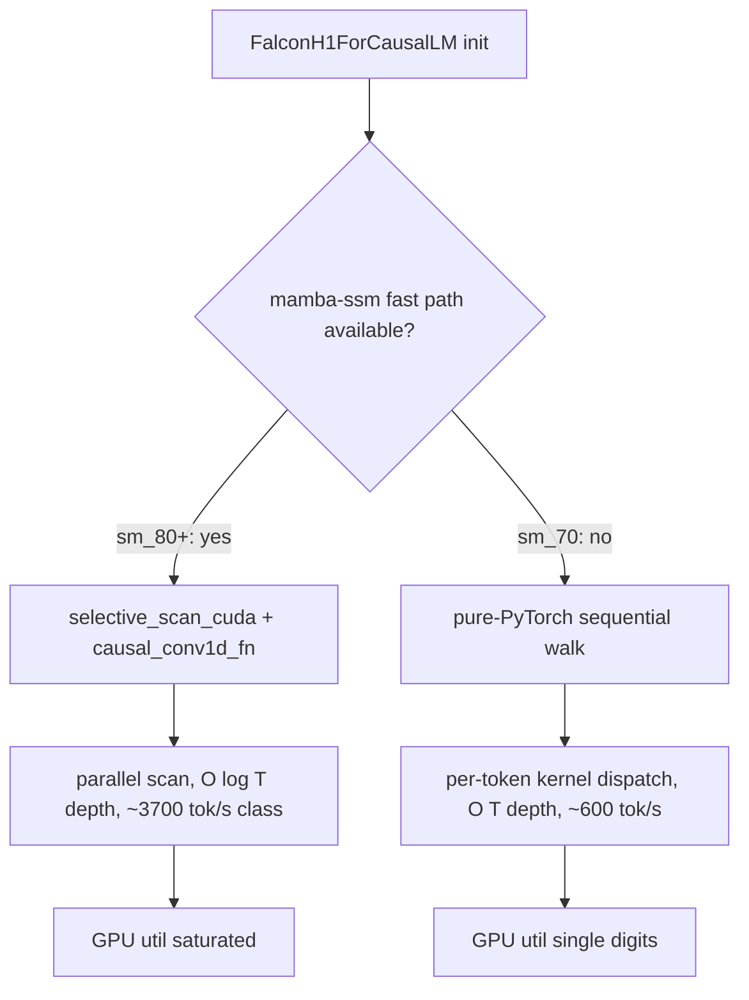
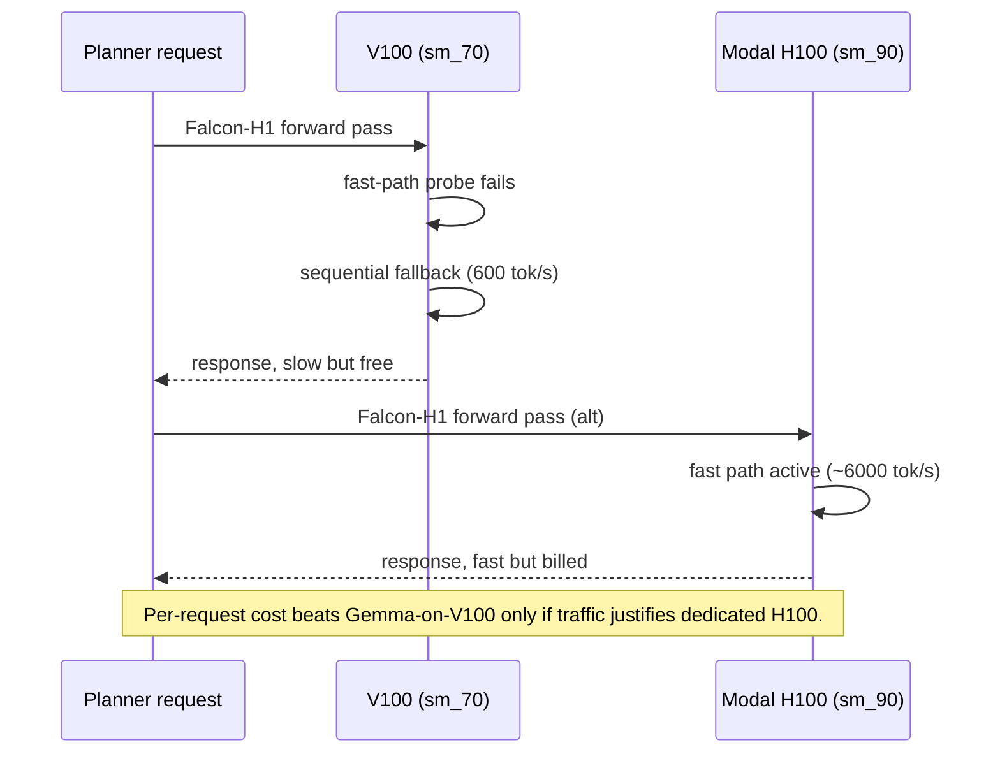
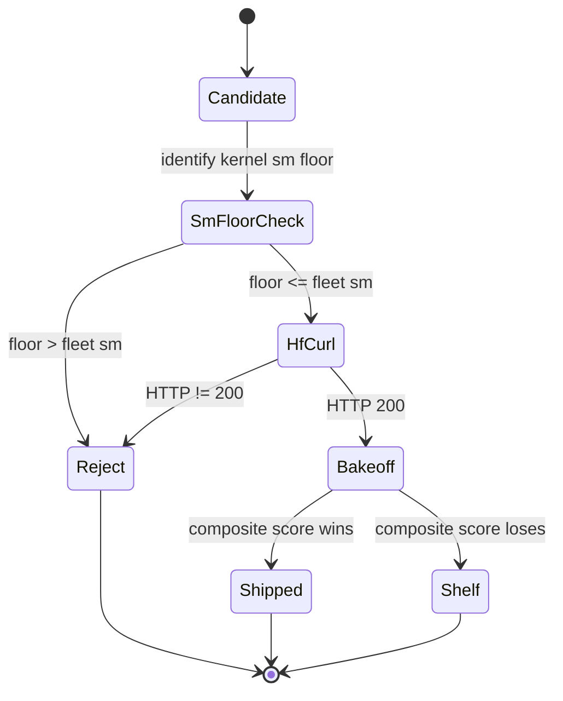

## Thesis

Falcon-H1-Tiny-Coder-90M is, on paper, the best small planner candidate we evaluated: 91M parameters, a hybrid Mamba/attention stack, and a long-context recurrence with $O(\log T)$ parallel-scan depth that should dominate attention's $O(T^2)$ at sequence lengths we actually serve. In practice it ran 6× slower than a 3× larger pure-attention competitor on the only GPUs we own. The architecture is correct; the kernels target compute capability sm_80+, our V100 fleet is sm_70, and the gap between "hardware that supports the right primitives" and "hardware we have" turned a theoretical 2× win into a measured 6× loss. We shipped Gemma3-270m and put Falcon on the shelf until we own H100s end-to-end.

## The recurrence and why hardware matters

Mamba's selective state-space layer maintains a hidden state $h_t \in \mathbb{R}^N$ per token via a discretized linear recurrence

$$
h_t = \bar{A}_t\, h_{t-1} + \bar{B}_t\, x_t, \qquad y_t = C_t\, h_t
$$

where the recurrence matrices $\bar{A}_t, \bar{B}_t, C_t$ are themselves functions of the current input $x_t$. This input-conditioned gating is what distinguishes Mamba from earlier linear-attention variants with fixed decay, and it is the source of the model's expressive power: the recurrence parameters adapt to what the model sees rather than being baked in at training time. Concretely, $\bar{A}_t = \exp(\Delta_t \odot A)$ and $\bar{B}_t = \Delta_t \odot B_t$, where $\Delta_t$ is a token-dependent timestep scalar that lets the model selectively forget or remember per position. Holding $\Delta_t$ fixed across the sequence recovers a linear RNN; letting it vary is what makes the layer competitive with attention on copy and induction tasks.

Naively the recurrence is sequential, $O(T)$ depth, because $h_t$ depends on $h_{t-1}$. On a GPU with thousands of cores idle behind that walk, that is catastrophic. The Mamba authors observed that the recurrence is associative in the right encoding — pairs $(\bar{A}_t, \bar{B}_t x_t)$ under the composition $(A_1, b_1) \circ (A_2, b_2) = (A_2 A_1, A_2 b_1 + b_2)$ — and any associative reduction admits the standard parallel prefix scan with $O(\log T)$ depth and $O(T)$ total work. The asymptotic improvement is real:

$$
\text{depth}_{\text{seq}}(T) = O(T) \quad\longrightarrow\quad \text{depth}_{\text{scan}}(T) = O(\log T).
$$

This is the entire architectural pitch. Attention is $O(T^2)$ in sequence length and $O(\log T)$ depth on a well-tiled GPU; the selective scan is $O(T)$ work at the same depth. Past a few thousand tokens the scan wins decisively on the work axis, and a hybrid stack lets attention handle the short-range copy operations it is genuinely good at while pushing long-range state-tracking into the Mamba layers where it is cheaper. At 4k context the predicted FLOP ratio favors the scan by roughly an order of magnitude on a transformer-equivalent parameter budget.

The qualifier "on hardware that supports the right primitives" is doing all the load-bearing work in that pitch. Take the primitives away and the scan reverts to the $O(T)$ depth it inherited from the recurrence definition, and the entire asymptotic edge evaporates along with the wall-clock win.

## What sm_70 is missing

The cato fleet runs V100-SXM3-32GB cards. Compute capability sm_70 — Volta, released 2017. It has fp16 tensor cores, fp32 CUDA cores, a respectable shared-memory budget. The official `mamba-ssm` kernels — `selective_scan_cuda` and the `causal_conv1d` companion — target sm_80+ and rely on four things Volta does not provide:

1. Async global-to-shared copy, introduced in sm_80, used to double-buffer the prefix-scan reduction with the next chunk's load.
2. The fp16/bf16 reductions with f32 accumulators that the Triton parallel-scan kernels depend on for numerical stability at long contexts.
3. BF16 tensor cores. Volta is fp16-only on the tensor path.
4. The shared-memory pressure profile the kernels were tuned for; the sm_80 occupancy targets do not transfer cleanly.

A sm_70-compatible parallel scan is possible in principle — shared-memory staging with explicit synchronization instead of async copy — but nobody has written and merged it. Community demand sits with sm_80+ users; Volta is a five-year-old training card running customer workloads.

When transformers initializes the Falcon-H1 model loader on a V100, it probes for the fast path, fails, and emits a warning naming the three missing entry points (`selective_state_update`, `causal_conv1d_fn`, `causal_conv1d_update`) before falling back to a pure-PyTorch sequential walk through the recurrence. That fallback dispatches a separate CUDA kernel per token-step in the worst case, with no fusion and no scan. Python-side dispatch overhead alone is enough to keep utilization in the single digits.

## What the fallback costs

We ran the same distillation trainer with identical rank, $\alpha$, and dropout configuration across three base-model families. The results:

| Base                       | Throughput (steps/hr) | Projected h/epoch | Notes                         |
| -------------------------- | --------------------- | ----------------- | ----------------------------- |
| Gemma3-270m                | 3,700                 | ~10               | Pure attention. V100-friendly. |
| LFM2-350M                  | ~2,800                | ~15               | Conv + full hybrid. No Mamba. |
| Falcon-H1-Tiny-Coder-90M   | ~600                  | 64–110            | Mamba fallback. Dead end.     |

Read the last row carefully. Falcon is the smallest of the three at 91M parameters. Gemma is roughly 3× larger by parameter count. Gemma trains 6× faster per step. The asymptotic argument for Mamba — fewer FLOPs per token at long context — would have predicted Falcon to be the faster trainer. On sm_80+ it likely is. On sm_70 the constant factor on the recurrence dominates so badly that the FLOP advantage becomes irrelevant.

Inference was worse. At realistic decode batch sizes the Mamba layers ran at roughly 600 tokens/sec single-stream against Gemma3-270m's 3,700 tokens/sec on the same card:

$$
\frac{\text{tok/s}_{\text{Gemma}}}{\text{tok/s}_{\text{Falcon}}} \approx \frac{3700}{600} \approx 6.17.
$$

In the bake-off composite score — quality weighted against throughput against memory — the throughput axis effectively zeroed Falcon's column. The model could be the best planner candidate in the world on quality and we still could not ship it at planner-request volume on the cards we already pay for.

## The composite that killed it

Our bake-off rolls quality, throughput, and memory into a composite score with weights we tune to reflect deployment economics. Let $q$ be normalized planner quality on the eval suite, $\tau$ normalized throughput in tokens per second, and $\mu$ normalized peak memory headroom on a single V100. The composite is

$$
S = w_q \log q + w_\tau \log \tau + w_\mu \log \mu, \qquad w_q + w_\tau + w_\mu = 1.
$$

The log weighting is deliberate: a candidate that wins one axis by 10× and loses another by 10× nets to zero, which matches the practical truth that an unservable model is worth nothing regardless of quality. With $w_q = 0.5, w_\tau = 0.4, w_\mu = 0.1$ and Falcon's throughput penalty $\log(600/3700) \approx -1.82$, the throughput contribution to Falcon's score is roughly $-0.73$. Even if Falcon's quality matched Gemma's exactly (it did not in our distillation runs, though it was close), the composite places it behind. The composite is not the cause of the rejection — the throughput is — but it is the artifact that made the rejection obvious in one number.

## The dollar arithmetic

The natural fallback is to train and serve on H100s, where the fast path works and the inverse asymptotic story dominates. We tried this on Modal: one Falcon adapter (9.5MB) finished cleanly and never deployed. The reason is unit economics. Let $c_{\text{H100}}$ and $c_{\text{V100}}$ be hourly GPU costs, $\rho_{\text{H100}}$ and $\rho_{\text{V100}}$ the per-card token rates for the model in question. A request of $T$ tokens costs

$$
\text{cost}(T) = \frac{T}{\rho} \cdot c.
$$

On the V100 fleet the marginal cost is zero — we own the cards and have paid the capex already; the only thing throughput affects is request latency. On Modal H100 the marginal cost is positive and meaningful, billed per GPU-hour with restart fragility on long jobs. Even with $\rho_{\text{H100}} / \rho_{\text{V100, Falcon}} \sim 10$, the multiplier on $c$ — Modal H100 hourly versus owned V100 zero — pushes the per-request cost above what Gemma-on-V100 charges, and the entire point of the small planner LM was cheap inference on owned hardware. The cost crossover only flips when traffic justifies a dedicated H100 reservation rather than per-minute Modal billing, and the Perseus planner does not currently run at that volume. The Modal path produces a trained artifact; it does not produce a deployment.

## The shape of the missing kernel

It is worth being precise about what a sm_70-compatible scan would need to do, because the gap between "in principle possible" and "actually merged into mamba-ssm" is exactly the gap between Falcon being viable and Falcon being a dead end. The reduction needs to combine pairs $(\bar A, b)$ across a chunk of $T_c$ tokens in shared memory, then propagate the chunk-boundary state across chunks. On sm_80 the inner-chunk combine overlaps with the next chunk's load through async copy. On sm_70 it would have to issue the load as a synchronous global-to-shared transfer and explicitly stage it through `__syncthreads`, paying full memory latency on every chunk boundary.

A rough latency model: let $L_{\text{load}}$ be the per-chunk global load latency and $L_{\text{combine}}$ the per-chunk reduction latency. The async-copy variant achieves

$$
L_{\text{sm80}}(T) \approx \max(L_{\text{load}}, L_{\text{combine}}) \cdot \tfrac{T}{T_c}
$$

while the synchronous variant pays both costs in sequence:

$$
L_{\text{sm70}}(T) \approx (L_{\text{load}} + L_{\text{combine}}) \cdot \tfrac{T}{T_c}.
$$

For typical chunk sizes and HBM2 latencies on Volta the ratio is around 2× on the reduction itself — bad but not catastrophic. The catastrophic factor is the fp16-accumulator-in-f32 scan that the published kernels require for numerical stability past a few hundred tokens. Volta tensor cores accumulate fp16 into fp32, but the scan kernels live outside the tensor path; they use the same instruction footprint Ampere exposes through PTX intrinsics that Volta cannot match without precision loss large enough to break training. Cumulative log-domain drift in $\bar A_t$ across thousands of tokens is unforgiving.

So the missing kernel is technically writable, would land at perhaps 2-3× slower than the sm_80 version rather than the ~6× we measured against the PyTorch fallback, and nobody has written it because the audience for sm_70 Mamba inference is small and shrinking. We are that audience. We are not large enough to fund the kernel work.

## Three days, then the decision

We spent three days probing alternatives before accepting the loss:

1. We checked whether Triton-based selective-scan kernels work on sm_70. They do not; the same accumulator-precision requirements apply.
2. We checked whether a partial Mamba disable — running only the attention layers — was viable. It is not; the attention layers alone do not carry the model at 90M parameters, and the resulting outputs were qualitatively broken.
3. We checked whether offloading the Mamba state to CPU bought anything. It did not; the per-step latency rose by another ~4×, bringing inference effectively to a halt.

Gemma3-270m shipped. The Falcon LoRA adapters — `falcon_plan_v3` (40MB), `falcon_quick` (138MB), and the empty slot directories from a 3-variant ensemble launch that OOM'd at batch=16 — remain on the cato training volume as a record of the attempt. The 9.5MB Modal-produced tarball sits unused.

## The verify-existence side lesson

Before any of the throughput work, the effort nearly stalled on a different failure mode. An earlier agent claimed Falcon-H1-90M "doesn't exist on HF" and recommended pivoting to a different family entirely. The claim was wrong. The correct handle is `tiiuae/Falcon-H1-Tiny-Coder-90M`; a HEAD request against the model card returns HTTP 200. The agent had not checked.

There is an asymmetry here worth naming. The cost of a wrong negative-existence claim about a HuggingFace artifact is large, because the claim removes a viable option from the design space and the removal is hard to undo: the next agent reads the design doc as ground truth and the candidate never gets re-evaluated. The cost of running a HEAD request against the candidate URL is approximately zero. Any policy that does not require the HEAD before propagating the claim is leaving free verification on the table.

We lost roughly two hours to the wrong claim. Trivial in absolute terms, expensive as a precedent. The fix is procedural: every negative-existence claim about an HF artifact requires a curl receipt attached inline, and that requirement now lives in the model-selection ADR. See the auto-memory entry on verifying HF existence with curl.

## What the gate looks like now

The deeper lesson is that hardware-architecture matching is a hard gate, not a soft preference. Every model evaluation runs a compute-capability floor check before any throughput measurement:

1. Identify which CUDA kernels the candidate model requires for its fast inference path.
2. Identify the compute-capability floor of those kernels.
3. Reject the candidate if that floor exceeds the deployment hardware's sm level.

For the cato fleet that floor is sm_70. For the GCP fleet it is sm_90. A model whose fast path requires sm_80+ is rejected from a V100-only bake-off before any download. This costs nothing and saves the three days we spent confirming the rejection empirically the first time.

## Why the architecture still belongs on the shelf, not the trash

It would be easy to read this as "Falcon was bad." That is the wrong read. Falcon-H1 is a strong architecture on the hardware it was designed for. The selective-scan recurrence has real asymptotic advantages over attention at long context, and the hybrid Mamba+attention stack is a serious answer to the question of how to keep attention layers narrow without sacrificing long-range modeling capacity. The only mistake we attribute to the model is one of implicit hardware floor: the model card does not say "sm_80+ required for fast path" explicitly, but the dependency on the `mamba-ssm` package carries that floor by transitive implication, and a user who reads the parameter count and architecture diagram alone will be wrong on Volta.

When we own H100s end-to-end — for both training and serving — Falcon-H1 deserves another evaluation. The cost of revisiting then is small. The cost of pretending it never existed is much larger, because pretending forecloses an option that becomes live the moment the hardware floor moves. The model goes on the shelf, not in the trash.

## The broader sm_70 dead-end class

Falcon is not a unique data point. It belongs to a class of "fast path requires sm_80+" rejections we have logged over the past quarter. Flash-attention v2 requires sm_80+ for its forward kernel; GPTQ Marlin kernels require sm_80+ for the int4 matmul fast path; the vLLM V1 engine refuses to start on sm_70 because its CUDA graph capture paths assume Ampere primitives. The Triton prefix-prefill fork that eventually let us serve Qwen-Coder-7B on V100 is the exception, not the rule, and it took targeted upstream patches to make it work.

The pattern is consistent: kernels live where the user base lives, the user base lives on rented Ampere/Hopper, and small organizations running depreciated Volta inherit the fallback path. The strategic response is not to fight that current — writing maintenance-grade kernels for a five-year-old architecture is not on our roadmap — but to make the hardware-floor check a first-class gate so we stop discovering the mismatch empirically on a three-day training run.

## Findings, distilled

1. Selective state-space models like Mamba achieve their $O(\log T)$ depth via parallel prefix scan, and that depth advantage is entirely conditional on async-copy and fp16-accumulator primitives introduced in sm_80.
2. On sm_70 the published `mamba-ssm` kernels fail their fast-path probe at load time and silently fall back to a sequential PyTorch walk that runs roughly 6× slower than equivalent attention.
3. A 91M Mamba model on V100 trained at ~600 steps/hour against a 270M pure-attention model's ~3,700 steps/hour. The smaller model was slower because the constant-factor penalty on the fallback recurrence overwhelmed the FLOP advantage.
4. The H100-train, V100-serve plan does not work: Modal H100 hourly cost times the request rate exceeds the zero marginal cost of owned V100 Gemma at our current planner traffic.
5. A sm_70-compatible scan is technically writable and would land at perhaps 2-3× slower than the sm_80 version, but nobody has written it and our org is not large enough to fund the kernel work.
6. The lesson generalizes: flash-attn v2, GPTQ Marlin, bnb 8-bit, and vLLM V1 sit in the same hardware-floor class. Volta is a depreciating asset for new kernels.
7. Hardware-floor checks belong in the ADR as a gate before any model is downloaded, not after a three-day empirical confirmation.
8. Negative-existence claims about HuggingFace artifacts require a curl receipt inline. The asymmetry between a free HEAD request and a foreclosed design option is too steep to leave unchecked.

## What we got out of it

A clearer policy, encoded in the ADR for base-model selection. A concrete dead end documented in the dead-ends catalogue, sitting alongside the broader sm_70 set: flash-attn v2, GPTQ Marlin, bnb 8-bit, and vLLM V1 in the same fast-path-floor class. A 9.5MB Modal-produced LoRA tarball that proves the training pipeline works when the hardware cooperates. The `falcon_plan_v3` adapter as evidence that the model itself, given a real GPU, distills cleanly from the gpt-5-nano planner outputs we use as supervision. And the wrong claim — that Falcon-H1-90M does not exist on HF — neutralized in the codebase with a curl-first policy attached, so the next agent does not make it again. When the H100 fleet is ours end to end, Falcon-H1 comes off the shelf and gets a real evaluation. Until then, Gemma3-270m carries the planner and the Mamba option waits.
