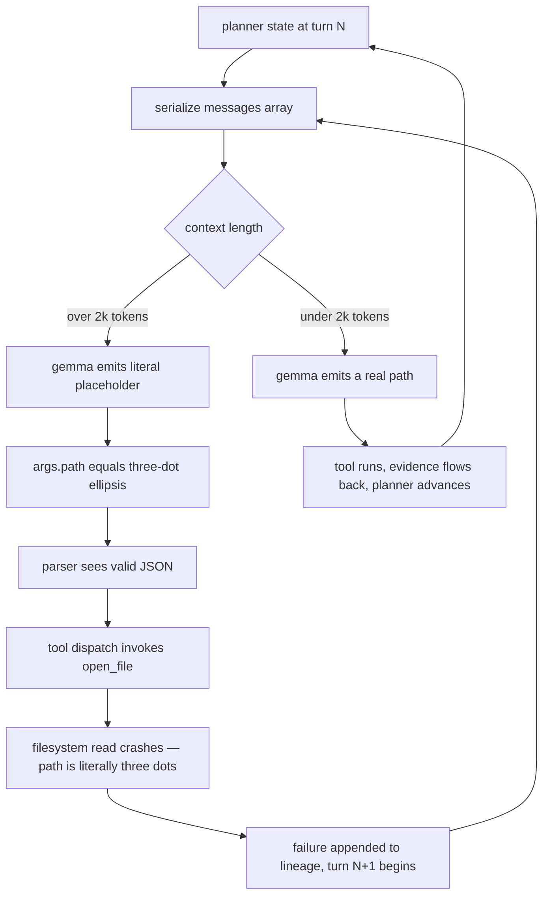

# Gemma3-270m as a planner base

We tested Gemma3-270m as a self-hosted replacement for the OpenAI planner call and the result was structurally clean and operationally fatal.

It was the fastest base on V100, trained to flawless single-shot JSON in under a day, and then leaked literal schema placeholders into roughly 10% of multi-turn planner outputs once the running lineage crossed about 2k tokens. The placeholders parsed as valid JSON, passed every schema check we had, and crashed the tool dispatcher when fed downstream.

A 4.6x-bigger base trained on the same objective cut that failure rate by 10x without any RL, which is the signature of a capacity-bound failure rather than a policy-bound one. We then launched REINFORCE on Gemma anyway, which was the wrong tool, for reasons that became clear only after the Llama numbers landed.

## The bake-off, and why throughput selected the wrong base

The planner LLM in Perseus is invoked once per MCTS expansion. At sweep concurrency 48 against gpt-5-nano, the per-call latency floor was 700-1500 ms even on a warm path, and the OpenAI bill scaled linearly with rollouts.

The replacement target was a teacher-distilled small LM trained on 180,720 rows of nano planner output, totalling 8.6 GB. We baked off three families on cato V100s:

1. Falcon-H1-Tiny-Coder-90M (Mamba+attention hybrid)
2. Gemma3-270m (pure attention)
3. LFM2-350M (conv+full hybrid)

Each was small enough to LoRA-tune in a day. The question was throughput first, then quality at fixed compute.

Falcon's Mamba state-update operators have no fused kernel on V100 — the selective-state-update, causal-conv1d, and causal-conv1d-update calls are all `None` in the runtime, and the framework silently falls back to a naive Python loop.

We measured 600 steps/hr against Gemma's 3,700 steps/hr at identical batch and sequence settings, a 6x gap that projected Falcon's first epoch out to 64-110 hours of wall time. We dropped Falcon. LFM2-350M trained successfully but no serving shim was ever wired. Gemma won the throughput cut cleanly.

In hindsight, this was throughput-on-the-wrong-hardware. The Falcon Mamba path would have fused on A100 or H100. The bake-off was hardware-bound in a way the bake-off itself could not see, and we let the V100 kernel availability pre-decide a base-model selection that should have been decided on merit.

The cure going forward is to gate base selection on a fast neutral hardware tier before ever paying production-rig compute.

## A compressed timeline of the deployment cycle

The cycle from first-pass adapter to abandonment took five days.

On 2026-05-13 the bake-off launched and the Falcon V100 kernel gap surfaced within hours. On 2026-05-14 Gemma3-270m clocked 3,700 steps/hr and won the throughput cut.

On 2026-05-15 morning the first-pass adapter at rank 16 / $\alpha = 32$ landed at 12 MB, establishing the LoRA format; that afternoon the rank-32 / $\alpha = 64$ / dropout-0.05 variant finished a full three-epoch run, and by evening the PEFT merge-and-unload step had produced a 545 MB bf16 directory intended for vLLM. That night vLLM rejected the merged weights with the transformers-model LoRA-incompatibility branch, and we fell back to uvicorn at port 19200 by midnight.

On 2026-05-16 morning the first end-to-end planner runs ran clean against 200 single-shot probes. By the afternoon, the multi-turn sweep was emitting give-up actions from the parser at a rate that did not match the live action distribution; inspection showed valid JSON with literal-ellipsis leaf values.

On 2026-05-17 we pivoted to Llama-3.2-1B via Tinker LoRA on a larger seq budget and launched REINFORCE on the merged Gemma weights in parallel to test whether the schema-leak was recoverable via reward. By the next day the Llama numbers made the answer obvious.

## The training setup and the capacity ceiling it imposed

We trained Gemma3-270m via completion-only LoRA SFT. The loss masks all prompt positions to label $-100$ so gradient flows only through the teacher's planner output, not through the messages-array prefix.

The objective was

$$
\mathcal{L}_{\text{SFT}}(\theta) = -\frac{1}{|C|} \sum_{t \in C} \log p_\theta(y_t \mid y_{<t}, x)
$$

where $C$ indexes positions inside the completion, $x$ is the prompt, and $y$ is the planner-output JSON. The prompt contributes zero gradient by construction. We used LoRA rank 32, $\alpha = 64$, dropout 0.05, on the q/k/v/o projection modules.

The architectural detail that mattered: Gemma3-270m runs 15 sliding-window attention layers and 3 full-attention layers. Five-sixths of the depth is local-window, which means three layers at hidden dimension 640 carry the entire global routing burden.

On training rows where prompt plus completion fit within the sliding window this is invisible. On planner inputs whose lineage extends past 2k tokens — which is most of them once the loop has run a few turns — the full-attention layers are the only path through which a leaf value (e.g. a file path appearing in a tool observation 1800 tokens upstream) can be lifted into the current generation step.

At a leaf-position decode for an `args.path` token, the next-token distribution is $p_\theta(y_t \mid y_{<t}, x) = \mathrm{softmax}(W_{\text{lm}} h_t)$ where $h_t$ is the final hidden state. For $h_t$ to encode a specific upstream path, the attention pattern at one of the three full-attention layers has to retrieve that span.

With 268M parameters distilled across 180,720 rows, the model learns the *shape* of the answer cheaply — schema keys, tool names, nesting — because that information appears in every row. It learns the *content* expensively — specific paths, specific symbols — because those vary per row.

Under capacity pressure, the model trades content fidelity for schema fidelity. The placeholder leak is what that trade-off looks like in tokens.

## Why distillation looked sufficient but wasn't

The 180,720 rows were sampled from the production sweep with gpt-5-nano as planner. Every row is an input-output pair where the input is exactly the messages array Perseus would have constructed and the output is the JSON the teacher emitted.

The implicit assumption was that completion-only SFT on this corpus teaches the student to act like nano at planner positions, modulo capacity.

The flaw is that nano itself solves leaf-value grounding by *having* the capacity to encode long context. The teacher rows contain the answers but not the mechanism. A student that mimics the answer distribution can pattern-match when its own capacity suffices to retrieve the relevant input span; when it does not, it falls back to the highest-probability schema-conforming completion.

The schema example in the system prompt contains literal ellipses as placeholders. That string is the highest-probability completion when the model knows the *shape* of `args.path` but cannot anchor it to a real value from upstream context.

This is the known general result that distillation teaches output mimicry, not the underlying procedure. The specific shape on schema-structured outputs is: the easy part of the output (schema keys) distills cheaply because the supervision signal directly encodes it; the hard part (leaf values dependent on long-range retrieval) does not, because the supervision encodes only the value, not the retrieval.

A larger student fixes this because the retrieval is recoverable. A smaller student does not.

## What the failure actually looked like

Both single-shot and multi-turn evaluation hit the same merged weights through the same FastAPI shim at cato port 19200. The differential was lineage length. Single-shot tests pulled a leaf-value distribution close to the easiest part of the corpus and passed all 200 manual probes. Multi-turn tests pulled progressively harder sub-distributions as lineage extended, and the placeholder rate climbed monotonically with depth.

<Figure src="" alt="multi-turn placeholder leak failure loop" caption="The failure loop. Every key, every type, and every confidence value in the output is correct — only the leaf path is the literal three-character ASCII ellipsis." n={1} />

A typical failure output had every key correct, every value type correct, the confidence field a sensible float in $[0, 1]$, the reason field a grammatical English sentence that even referred correctly to the prior turn, and the tool field a real entry from the known-tools list.

Only the leaf `path` value was the literal three-character ASCII ellipsis — not a Unicode ellipsis, not a typo, exactly the character that appeared in the schema example inside the few-shot block of the system prompt. The model had memorized that those positions can hold three dots, and under capacity pressure that memory beat the harder retrieval-from-context task.

The single-shot probe missed this entirely. With no prior tool outputs to ground against, the model emits a first-turn action that requires inventing a path from the query alone, which it does competently because the few-shot examples in the system prompt show exactly how.

The model is good at the cold-start move and bad at the warm-state move, in a way that is structurally inverted from what we instinctively measure.

## Why repair retry was useless

Perseus has two layers of JSON discipline upstream of the planner output: the OpenAI JSON-mode flag attached to every chat call, and a repair-retry path that re-prompts the model when parsing fails.

The repair path is built for the case where output is *malformed* JSON; the parser extracts the largest balanced-brace substring and reissues the prompt at temperature $0.0$. Gemma's failure is the opposite shape: the output is well-formed JSON whose strings are wrong.

There is no parser intervention that can rescue a well-formed payload whose `args.path` is the literal three-character ellipsis, because nothing about the surface form distinguishes it from a legitimate planner response that decided to read a file literally named with three dots. The parser does the only thing it can — pass the payload to the dispatcher — and the dispatcher crashes.

Bumping the retry temperature also does not help. A placeholder-leak failure has the same property the malformed-JSON case has: sampling more diversely does not move the model off a memorized schema-shaped output, because the schema region is the high-probability region by construction.

## Why no decode-time guard could catch it

Perseus attaches the OpenAI JSON-mode flag to every chat completion request. That flag guarantees the output is valid JSON. It guarantees nothing about the contents.

The Gemma shim silently ignored the flag anyway, but even if it had honored it the model's output was already valid JSON. JSON-mode protects against malformed-JSON failures and is inert against well-formed-but-wrong-content failures.

Constrained decoding (XGrammar, vLLM guided-JSON) goes one level deeper: it can enforce the schema — required fields, types, enum values for tool names. That would catch a placeholder with the wrong type (e.g. a numeric path) but not one with the correct type and wrong content (the literal ellipsis string). Schema constraints do not model semantic ground-truth.

The only mechanism that could have caught placeholder leaks at decode time is a *content* constraint — for instance, requiring `args.path` to be a substring of the upstream context, or matching a regex of valid filesystem path characters minus the literal placeholder character. We have no clean way to express that in current constrained-decoding frameworks.

The brace-bounded JSON repair path in the planner parser, similarly, is built for malformed-output recovery; against well-formed-wrong-content output it is a no-op. The cure is to fix the model, not the decoder.

## The val_loss numbers and why a 0.17 gap is load-bearing

We later trained Llama-3.2-1B at 4.6x Gemma's parameter count under the same SFT objective on a curated subset of the corpus.

| metric | gemma3-270m | llama32-1b | ratio |
|---|---|---|---|
| params | 268M | 1.24B | 4.6x |
| LoRA rank | 32 | 64 | 2x |
| max seq len | 2048 | 8192 | 4x |
| V100 throughput | ~3700 steps/hr | n/a (Tinker H100-class) | n/a |
| best val_loss | ~1.1 (plateau) | 0.932 | -0.17 |
| single-shot JSON valid | yes | yes | tied |
| multi-turn placeholder rate | ~10% | under 1% | 10x |
| production traffic | no (probe only) | yes | n/a |

A val_loss of 1.098 against 1.1 sounds like a tie. It is not.

Cross-entropy is a mean over token positions, and positions are not equally important. The schema keys are predicted at probability close to $1.0$ by any model that has seen the corpus twice, so they contribute near-zero loss. The leaf values are where the difficulty lives, and they are a minority of tokens.

A model that fails on 10% of leaf-value tokens but is perfect everywhere else can still score val_loss 1.1, because that 10% is averaged with the 90% of trivially-easy schema tokens.

Crossing below $1.0$ on this corpus requires getting the hard leaf-value positions right at a meaningfully higher rate, because the schema-token contribution is already saturated. The fact that no Gemma3-270m configuration crossed 1.0 — across rank 16, rank 32, three epochs, and the full data — is the signal that the model is at its capacity ceiling on this corpus, not that it needs more training.

The runtime exposes that 0.17 gap as a step function in placeholder rate at lineage depth 4+.

## Why seq length beat LoRA rank

A reader might object that the Llama win is confounded with data, since longer sequences see more tokens per row. Two countersignals:

1. The rank-64 / seq-4096 variant we trained on a quality-filtered 88,918-row subset hit val_loss 1.120 at half the compute and half the data of the seq-8192 winner. Data quality at fixed seq does not get below ~1.12 on Llama-1B with rank-64.
2. The rank-128 / seq-4096 variant on a 50,000-row cap hit val_loss 1.283. Cutting data hurts; cutting seq while raising rank does not recover it.

The cleanest framing is per-row attention budget. At seq 4096, a 3,200-token row is truncated; at seq 8192 it fits whole. The planner corpus has multi-tool completions with long observation segments; truncating the observation at training time leaves the model unable to learn the mapping from observation to `args.path`.

Gemma3-270m at seq 2048 sees an even more truncated version of the same problem, and the 268M params at hidden 640 cannot productively use a longer context window even if we provided one.

The implication is grim for the Gemma family on this corpus: the path to a competent Gemma planner requires either substantially longer effective context the architecture cannot use, or a curated corpus where the answer fits in the model's natural window — which means deliberately filtering out the multi-tool deep-lineage cases the planner most needs to handle.

## Why REINFORCE was the wrong tool

We launched a REINFORCE run on the merged Gemma weights on 2026-05-17 with a reward function carrying a schema-leak penalty term:

$$
r(y) = r_{\text{json}}(y) + r_{\text{fields}}(y) + r_{\text{tools}}(y) + r_{\text{rarity}}(y) + r_{\text{calib}}(y) - \lambda_{\text{leak}} \cdot \mathbb{1}[\text{has\_placeholder}(y)]
$$

with the rarity term adding $+2.0$ for tools below 1% corpus frequency and $-1.5$ for the search-text / hybrid-search / open-file trio. The leak penalty was meant to drive the policy off the placeholder-emitting mode.

The category error: REINFORCE searches over policy variants the model can already represent and the gradient can reach. If the failure mode is that the model lacks the capacity to ground leaf values against long context, no reward shaping recovers it.

The placeholder-emitting mode is not a preference for laziness; it is the highest-likelihood completion when attention cannot anchor to a real path in the lineage. REINFORCE was operating on the wrong axis.

The Llama-3.2-1B numbers landing during the same week confirmed this. A 1B base, with no RL, at the same SFT objective, hit a placeholder rate under 1%. The cure for a capacity-bound failure is more capacity. The cure for a policy-bound failure is RL. We were applying the latter to the former.

The diagnostic that distinguishes the two cases: does the failure rate scale with input distribution width, or with output preference? Scaling with input width — as we observed, the placeholder rate climbs monotonically with lineage depth — means capacity.

The same diagnostic shows up in the world-model track, where every single-task value-only variant collapsed to negative val_r2 and only multi-head variants generalized: single-task target plus a tight model is a capacity trap. The lesson generalizes across the project.

## The serving-path tax that disqualified Gemma independently

After distillation finished, we tried to serve the merged FP16 weights through vLLM. The load failed with the message that the transformers-model code path does not support LoRA, even though the weights had been merged via the standard PEFT merge-and-unload routine and there was no LoRA delta present at load time.

The vLLM Gemma3 path goes through that transformers-model branch unconditionally, and the branch fires on architecturally-Gemma3 weights regardless of whether LoRA is attached.

We fell back to a uvicorn + transformers + PEFT shim at cato port 19200. The shim is single-stream by construction. It does not implement OpenAI JSON-mode, loses continuous batching, loses PagedAttention, loses prefix-cache reuse, and pays roughly 3.6 s per planner call against vLLM's sub-second steady state.

At sweep concurrency 48 this is not a 10% performance loss; it is a complete throughput floor below what production traffic requires.

The cost arithmetic that motivated self-hosting in the first place ran roughly: at concurrency 48 over the 1632-instance multi-swe-bench cohort, ~30 planner calls per instance, ~2.35M calls per sweep, with average prompt ~6k tokens and output ~400 tokens at gpt-5-nano-2025-08-07 pricing of ~`$0.05/1M` input and ~`$0.40/1M` output.

Per-call cost ~`$0.00046` USD, per-sweep cost ~`$1,080` USD against a weekly sweep cadence. A self-hosted small LM at zero marginal token cost would have eliminated the variable cost entirely.

But the Gemma shim could not have served the workload regardless — at 3.6 s per call times 2.35M calls, even unbounded parallelism inside a single shim process saturates instantly. The vLLM serve on Llama-3.2-1B did close it. Gemma simply had no path to production throughput, with or without the placeholder leak.

## A more uncomfortable observation about evaluation

The single-shot success and multi-turn failure decouple cleanly along the same dimension that capacity decouples leaf-value fidelity from schema fidelity. Single-shot probes test schema knowledge. Multi-turn lineage probes test task knowledge. They are not the same measurement.

The single-shot success rate of the Gemma adapter was 100%. The task success rate at lineage depth 4+ was below 90%. A 10-point gap is not measurement noise — it is the signature of evaluating the wrong thing.

The minimum-viable fix to our evaluation harness is to probe at production lineage depth from the start, not at depth 1. The cost of that fixture is one hour of setup. The cost of not running it was the entire Gemma deployment cycle: distillation, merging, vLLM rejection, FastAPI shim, two weeks of probe traffic, REINFORCE setup, and only then the realization that the model was structurally unfit.

A complementary fix is to track leaf-value accuracy as a separate metric from val_loss. A post-hoc evaluator that grades only the `args.*` leaf positions on a held-out set would have shown the Gemma adapter at 85-90% leaf accuracy and the Llama adapter above 99%.

That single number would have killed the Gemma path before the FastAPI shim work began.

## A historical asymmetry about "small fast model wins"

The choice of a 268M-parameter base reflected an assumption that has been broadly true in the inference-throughput literature: smaller models are faster, and at fixed throughput-budget per call, fewer parameters allow more concurrent traffic. For decode-bound workloads with short outputs and short inputs, that holds.

Planner workloads break the assumption in two places. First, the input is long — 6k prompt tokens, growing with lineage. Second, the output is structured rather than free-text, so the per-token cost dimension overweights tokens that are essentially free to generate (schema keys) and underweights the few tokens that actually matter (leaf values).

The total latency budget per call does not separate the two, but the model's capacity allocation does. A small fast model is the right answer when per-call cost is roughly proportional to total tokens. For Perseus, per-call quality is roughly proportional to a few hard tokens, and the model needs to be capacity-large enough to get the hard tokens right with everything else a wash.

This pushes the operating point away from the cheap-small regime and toward smallest-model-that-gets-hard-tokens-right. Llama-3.2-1B sits at that boundary on our corpus. Gemma3-270m sits below it.

This also implies the Falcon-H1-Tiny-Coder-90M case would have been worse than Gemma on the same axis even if the V100 kernel problem had not dropped it. 91M params at a comparable hidden-dim profile would have hit the leaf-value problem harder, not softer.

The throughput advantage on appropriate hardware would have been spent on a worse outcome.

## What it taught us

1. Single-shot JSON validity is not a proxy for multi-turn JSON validity. A model that passes 200 single-shot tests can still hit a 10% placeholder rate in a running loop. The schema is memorized cheaply; the values are not. Evaluation must probe at production lineage depth.
2. Diagnose capacity versus policy before reaching for RL. The placeholder rate scaled with input lineage length, not with reward shaping or sampling temperature. The same training objective on a 4.6x-bigger base with 4x the sequence budget cut the rate by 10x with zero RL. REINFORCE against a capacity-bound failure is a category error.
3. Sequence length sometimes beats LoRA rank. The seq-8192 / rank-64 Llama variant beat the seq-4096 / rank-128 variant on val_loss by $0.19$. On a planner corpus with long multi-tool completions, the compute that goes into seq does more work per epoch than the same compute going into rank. This is corpus-specific but the corpus is the only one we care about.
4. Throughput on the wrong base is not throughput. The 6x training-speed win that selected Gemma over Falcon was a V100-kernel-availability artifact. The base that ultimately worked ran on different hardware altogether. Base selection should be gated on a fast neutral hardware tier, then shipped to production hardware only after passing an architecture-quality bar that excludes kernel availability.
5. Schema validity and content fidelity decouple under capacity pressure. A small model can be perfect at "what shape is the answer" and broken at "what value goes in that shape's leaf positions." Detecting the decoupling at training time requires evaluating leaf-value tokens as a separate metric class from schema tokens, and no aggregate loss number will surface it on its own.
6. The serving-path tax is a separate disqualifier from the capacity tax, and either one alone is sufficient. Gemma3 plus LoRA cannot serve over vLLM's high-throughput path until upstream lands the support, and the FastAPI fallback floor sits below any reasonable production concurrency budget. Test the serving path before merging the adapter, not after.

## Operational gotchas worth remembering

1. The vLLM transformers-model LoRA-incompatibility branch on Gemma3 survives the PEFT merge-and-unload step, because the architecture class falls through to that path regardless of whether the weights are merged. The merge is necessary but not sufficient. The workaround is the FastAPI shim, which costs throughput.
2. The shim at port 19200 is single-stream by construction. Production sweeps at concurrency 48 saturate it instantly even if quality were good.
3. The Falcon Mamba-kernel fallback warning logs on every V100 Falcon training run. The 6x throughput delta is real and explains why the Falcon adapter directories are mostly empty stubs. A V100 cluster is not the place to evaluate state-space models — the comparison was decided by hardware before it was decided by architecture.
4. LoRA-soup recipes exist in the training code but every shipped Tinker variant had a single shard, so the soup path was never tested on real output. This was a known open item; Gemma3-270m would not have been the right base to test it on.
5. A pretokenization bug on 2026-05-15 silently dropped the completion field for a full afternoon of distillation runs. The masked-label tensors were correct; the labels themselves were all $-100$. A second-pass tokenizer at 16 workers, writing tensors with completion masking applied explicitly, fixed it. The cost was one afternoon of zero-gradient training nobody noticed in real time. The cure is to assert non-zero loss-position counts at trainer startup.

## Where this lives now

The Gemma3-270m adapter survives on cato disk as a comparison data point but is not in the production endpoint list. The merged weights remain probeable at port 19200 as a single-stream FastAPI shim.

The REINFORCE run launched 2026-05-17 is still training at the time of writing with no deployed weights. Production planner traffic runs against gpt-5-nano-2025-08-07 directly while the Llama-3.2-1B variants finish their bake.

The 268M attention-only profile is dropped from the planner roadmap as a viable base — it loses on capacity at the sequence lengths the planner corpus actually requires, and it loses on serving at the throughput production demands. Llama-3.2-1B is the production planner base going forward.
