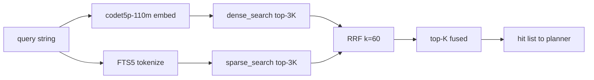

We added Reciprocal Rank Fusion over dense and sparse retrieval as the seventeenth Perseus tool on 2026-04-22, and for three days it sat at under two percent of planner traffic. Two paragraphs of prompt surgery on 2026-04-25 pushed it to 39.4%. The model did not change, the training data did not change, the specificity table did not change. Only the prompt did. That episode is why every trajectory we collect now carries a policy fingerprint hashed over the prompt text, and why we treat the planner prompt as part of the model rather than as configuration.

This essay covers three things in order: the math of RRF and why we chose the textbook constant, the candidate-set sizing that makes fusion actually add information, and the prompt-drift episode that taught us cohort discipline the expensive way.

## 1 Rank fusion, and why rank rather than score

For each document $d$ and each retrieval list $\ell$, let $\text{rank}_\ell(d)$ denote its zero-indexed position in $\ell$, or $+\infty$ if $d$ is absent. The Reciprocal Rank Fusion score is

$$
\text{RRF}(d) \;=\; \sum_{\ell \in \{\text{dense},\, \text{sparse}\}} \frac{1}{k + \text{rank}_\ell(d)}, \qquad k = 60.
$$

The fused list sorts documents by $\text{RRF}(d)$ descending. A document missing from one branch contributes zero from that branch; absence is its own penalty, no out-of-band term required.

Two design choices carry the weight here, and both deserve to be defended explicitly.

The first is fusing rank rather than score. A dense retriever returns cosine similarities in $[-1, 1]$, in practice $[0, 1]$ after a clamp at zero, with a distribution shape that depends on the embedder, the corpus, and the specific query. A BM25 sparse retriever returns scores unbounded above, dependent on document length, term IDF, and the saturation parameter $k_1$. The two scalars live on incomparable scales — one approximately multiplicative under cosine geometry, the other additive-with-saturation under Robertson-Sparck-Jones. Score-level fusion requires a calibration map between them, and any such map is brittle across corpora.

Rank is corpus-free. The first document in a list is always rank zero, whether the underlying score is $0.94$ cosine or $28.7$ BM25. RRF takes the only invariant available and uses only that invariant. The information loss is real — a sparse list with a tied top-2 and a sparse list with scores $0.99$ and $0.31$ look identical to RRF — but Cormack, Clarke, and Büttcher in 2009 made the empirical case that this loss is more than paid back by corpus portability. We inherited that position rather than re-litigating it.

The second is the choice $k = 60$. The original RRF paper swept $k$ across two orders of magnitude, from roughly $1$ to $100$, and reported that fused mean-average-precision was approximately flat across the entire range with the maximum sitting near $60$. The intuition follows from the curve shape of $1/(k + \text{rank})$. For very small $k$, the first few ranks dominate so completely that fusion collapses toward winner-take-all over the two lists. For very large $k$, the curve flattens into near-linearity in rank and adjacent ranks become indistinguishable. Somewhere in the middle the curve preserves the head while still letting the tail vote, and that middle is wide. The specific value $60$ is "a round number near the flat region," not a tuned optimum. We have not run an in-house sweep on a Perseus corpus, and the public-bench evidence is strong enough that the sweep is not on the active queue.

The mental model that anchors this for us is **weighted Borda count**. In Borda voting, each ballot ranks candidates and each candidate receives points equal to $(n - \text{rank})$ per ballot. RRF replaces the linear weight $(n - \text{rank})$ with the concave decaying weight $1/(k + \text{rank})$ — placing far more mass on the head than the tail — and treats retrieval lists as ballots. Our two ballots are the dense codet5p embedder and the BM25 sparse index, both voting on which chunks the planner should see.

## 2 Two retrievals, both over-fetched

The two lists come from independent paths. The dense path embeds the query with `Salesforce/codet5p-110m-embedding`, a 256-dimensional code-aware embedder, and runs cosine similarity in qdrant against the indexed chunk collection for the active repository. The sparse path tokenises the query through a lightweight regex normaliser — keeping alphanumerics, spaces, dots, dashes, and underscores, and dropping tokens shorter than two characters — then runs FTS5 BM25 over the chunk-content full-text index. Both lists are pulled at $3K$ depth where $K$ is the caller's requested limit, typically $K = 10$, so each branch returns thirty candidates before fusion.

The over-fetch factor is doing real work. Consider what happens at $K = 10$ without it. A typical query has dense top-10 and sparse top-10 sharing five to seven documents, so the union $|A \cup B|$ is thirteen to fifteen. Fusion over those two lists can only produce a reordering of that thirteen-to-fifteen set. The "fusion adds value in the middle" property — where a document at rank $4$ in dense and rank $7$ in sparse outranks a document at rank $0$ in sparse but absent from dense — never manifests because there is no middle.

With $3 \times$ over-fetch, the union grows to roughly fifty to fifty-five, and the middle ranks of either list can promote documents that would have fallen below the $K = 10$ cutoff in both single-retrieval paths. Empirically the fused top-$10$ output adds three to five documents that neither single retriever placed in its own top-$10$. That is the bandwidth where fusion earns its keep. The choice of $3 \times$ specifically was tested by hand on a handful of queries and kept; no formal sweep against $5 \times$ or $10 \times$ exists, and we recognise that as a known calibration gap rather than a settled question.

## 3 Implementation shape

The whole tool is one method on one class plus a fifteen-line helper. The helper accumulates reciprocal-rank scores into a chunk-id-keyed dictionary, preserves the first-seen chunk metadata via setdefault, and returns the items sorted by descending score. The class method validates that the query is non-empty, embeds it once with the shared embedder factory, fires the dense and sparse retrievals at $3K$ depth, fuses, slices the top-$K$, and wraps the result in the standard tool-evidence envelope. The helper is agnostic to the number of input lists — we pass two today, and three (dense plus sparse plus a hypothetical symbol-graph retriever) would work unmodified.

Two implementation details matter for cohort discipline downstream. The `chunk_id` is the deduplication key, so the same chunk surfacing in both lists accumulates contributions from both $1/(60 + r_\text{dense})$ and $1/(60 + r_\text{sparse})$. And the dictionary stores the first-seen chunk object so the metadata payload — path, line ranges, snippet body, kind, enclosing symbol — survives fusion intact and is available to the planner without a second hydration round-trip.

The data flow:

The two retrievals run sequentially in the current implementation — the dense call awaits to completion before the sparse call starts. Parallelisation is on the to-do list, but the practical cost is modest: the dense path is dominated by the qdrant round-trip at roughly $20$ ms locally, the sparse path by SQLite FTS5 at $5$ to $15$ ms, total around $30$ to $40$ ms serially. That sits comfortably inside the planner's per-call budget, so the parallelisation is a latency micro-optimisation rather than a load-bearing fix.

## 4 The seventeenth tool

Through 2026-04-22 Perseus carried sixteen tools: fifteen retrieval primitives — text search, path search, file open, snippet extract, symbol lookup, references lookup, callgraph neighbours, dependency neighbours, sibling scan, similar-files embedding, diff pattern scan, test locator, error signature match, broad scan, repo stats — plus the give-up leaf-state transition. The retrieval-service integration branch landed `hybrid_search` as the seventeenth, intentionally positioned as the preferred retrieval entry point combining the best of dense and sparse.

The motivation is the failure mode that single-retriever tools display on code corpora. The sparse tools miss semantic-only queries: "where is the cross-encoder reranker called" fails when the file uses `Reranker` instead of the string "cross-encoder." The dense tools miss exact-symbol queries: embedding the helper `_rrf` and embedding the helper `_fts_query` are close in 256-d space because they are both small helpers in the same file, but a planner asking specifically for the first does not want the second as a co-equal hit. Hybrid fusion fixes both — BM25 nails exact-symbol queries, dense catches semantic-only queries, RRF produces a list that does both at once.

We assigned the tool a specificity coefficient of $1.45$ in the schema table — tied with snippet-extract for the highest in the catalogue. The MCTS prior multiplies the planner's proposed prior by this coefficient, so a $1.45$-specificity tool is boosted in the UCB selection versus a $1.0$ tool (text search) or a $0.5$ tool (repo stats). The design intent was for the planner to prefer hybrid over its constituents when both were plausible options at a node.

That intent did not survive contact with the deployed prompt.

## 5 The prompt-drift episode

From 2026-04-22 through 2026-04-25, `hybrid_search` usage in the planner traces sat below two percent. Across roughly $1{,}157$ tool observation events in the local query-progress JSONL, text search was at $19.6\%$ and path search at $18.7\%$; hybrid was barely above repo-stats noise. The MCTS prior boost from the $1.45$ specificity was real and visible in the per-node logs, but it was being swamped by the planner LLM's proposed prior, which placed almost all the option mass on the older, prompt-resident tools.

The cause was prompt drift, not model behaviour. The planner system prompt — the document that describes the tool catalogue to the planner LLM — had been written when there were sixteen tools. The seventeenth was added to the JSON schema, the runtime registry, and the reference docs, but the instructional spine of the prompt still walked the planner through "exploratory branches" using text-search and path-search as the canonical examples. The few-shot trajectories shipped inline in the prompt did not call hybrid once. The LLM did exactly what the prompt told it to do, which is the only thing an LLM can ever be relied on to do.

The fix landed on 2026-04-25 as part of the prompt-drift audit. Two edits to the planner system prompt. First, the section on exploratory branches was rewritten to make `hybrid_search` a first-class member of the exploratory toolkit — when no candidate path or symbol is known, the exploratory option set should include `hybrid_search` alongside text-search and path-search. Second, a new anti-pattern was added in the rejected-examples block, explicitly calling out exploratory option sets that omit `hybrid_search` when no candidate is known as a bad pattern. In the same pass the few-shot trajectories were updated so two of the cold-start examples opened with a `hybrid_search` call. Nothing else changed.

Usage jumped from under two percent to $39.4\%$ within a week. The next-highest tool was text-search at $19.6\%$, followed by path-search at $18.7\%$. `hybrid_search` was now firing more often than the next two tools combined. The full post-fix distribution on local traces:

| tool | calls | share |
|---|---:|---:|
| hybrid_search | 462 | 39.4% |
| search_text | 230 | 19.6% |
| search_path | 219 | 18.7% |
| diff_pattern_scan | 111 | 9.5% |
| broad_scan | 61 | 5.2% |
| open_file | 55 | 4.7% |
| snippet_extract | 9 | 0.8% |
| repo_stats | 7 | 0.6% |
| symbol_lookup | 3 | 0.3% |
| symbol-graph tools (combined) | 0 | 0.0% |

Roughly two-thirds of exploratory traffic moved from the sparse-text duo onto `hybrid_search`. No retraining. No specificity-table tuning. No ablation. Two paragraphs in the prompt and two updated few-shot examples.

## 6 Prompt drift is data drift

The $1.7\% \to 39.4\%$ usage shift is a $23 \times$ change in how often a given tool fires. It is also a $23 \times$ change in the action distribution that downstream training data sees. A trajectory collected on 2026-04-23 carries roughly a $2\%$ probability of a `hybrid_search` step at any given depth; a trajectory collected on 2026-04-29 carries a $39\%$ probability. If both land in the same trajectory table with no cohort key, a downstream policy-head training run that bucket-samples uniformly across the table will see an action distribution that is a prompt-weighted mixture of two distinct policies.

The policies are not "slightly different" in the way two seeds of the same training run are slightly different. They are produced by different prompts. From the planner LLM's point of view, prompts are different programs. The trajectories are samples from $\pi_\text{old}(\cdot \mid \text{prompt}_\text{old})$ and $\pi_\text{new}(\cdot \mid \text{prompt}_\text{new})$, and these are not the same distribution.

Worse, the change was invisible at the model layer. Model weights did not change, training data did not change, the specificity table did not change, the runtime registry did not change. Every conventional cohort key — model id, training run, tool specificity hash — was identical across the boundary. The only difference was a hash of the planner system prompt file.

This is the failure mode that motivated `policy_fingerprint_sha`. The fingerprint, which landed alongside the prompt-drift fix on 2026-04-25, is a SHA-256 over the relevant tuple: the planner prompt text, the confirm-stop prompt text, the UCB exploration constant, the self-check toggle, the retrieval endpoint and enabled flag, a hash of the sorted Perseus-prefixed environment variables with secrets elided, and the build time. Every trajectory row gets the fingerprint stamped at write. Cohort-aware training queries can now filter on `policy_fingerprint_sha = ?` and isolate trajectories produced by a single coherent prompt-runtime combination.

The audit work this enables, retroactively, is exactly what the fingerprint was designed for. Queries of the form "show per-tool action distribution broken down by policy_fingerprint_sha" expose the $2\% \to 39\%$ shift as a clean step function aligned to the 2026-04-25 commit, rather than a smeared gradual-adoption trend. Without the fingerprint, the shift is invisible to any aggregate query, and any downstream training that mixes rows across the boundary is training on a mixture distribution with no way to deconvolve.

The general lesson is uncomfortable but unavoidable: in a planner-LLM-based system, the prompt is part of the model. A prompt change is a model change. A registry change without a corresponding cohort fingerprint update is silent data poisoning. Every Perseus component that emits trajectories now treats prompt SHA as a first-class cohort key, on equal footing with model checkpoint hash.

## 7 What the fingerprint hashes

The tuple is small and intentionally so. Each field is either a content hash of a file that affects behaviour, a behaviour-affecting numeric or boolean knob, or a hash over an opaque environment slice. The canonical fingerprint is the JSON object with these fields sorted by key and SHA-256'd, and two Perseus instances are cohort-equivalent iff their fingerprints match.

1. The git SHA of the Perseus build, embedded at compile time, so binary-level drift between cohorts is always captured.
2. The SHA-256 of the planner prompt file, which is the field that caught the 2026-04-25 episode and the primary motivator for the whole mechanism.
3. The SHA-256 of the adversarial confirm-stop prompt, which lives in a separate file because it is invoked under a different system message during the global-stop check.
4. The UCB exploration constant, currently $2.2$ after the 2026-04-25 depth tuning, since selection geometry directly shapes which actions get visit mass.
5. A boolean for self-check, since the confidence-calibration behaviour changes the stop distribution.
6. The retrieval endpoint URL and the retrieval-enabled flag, since six of the seventeen tools route through that service.
7. A SHA-256 over the sorted Perseus-prefixed environment variables with any key ending in KEY, TOKEN, or SECRET elided. This catches subtler drift — somebody flipping the planner temperature from $0.0$ to $0.3$ on a production worker without touching the prompt or the binary still changes the cohort.
8. The build time as an RFC-3339 timestamp, which is a tiebreaker rather than a primary discriminator but useful when otherwise-identical fingerprints need to be ordered.

The pre-fix and post-fix instances have different prompt SHAs, therefore different policy fingerprints, therefore distinct cohorts in any downstream query. That is the whole point.

## 8 The empirical gap we have not closed

This essay describes math, implementation, and a deployment episode honestly. It does not describe an in-house ablation of `hybrid_search` against dense-only or sparse-only on a Perseus corpus, because we do not have one. The closest public-bench evidence is that `Qwen3-Embedding-4B` scores $89.18$ CoIR nDCG@10 on the public code-retrieval suite, and the Cormack-Clarke-Büttcher paper shows that RRF fusion provides a consistent lift over either single retrieval across the TREC corpora they tested. Neither is a Perseus recall-at-K number.

The autoresearch v4 composite score we use to evaluate prompt candidates is

$$
0.50 \cdot \text{overlap} + 0.30 \cdot \text{lift\_vs\_rg} + 0.10 \cdot \text{recall@10} + 0.05 \cdot \text{mrr} + 0.05 \cdot \text{compactness}
$$

which is the closest in-house signal we have, and it measures prompt and retrieval stack together. We have not isolated the retrieval-stack contribution from the prompt-engineering contribution. Closing that gap is an open item, and the right form is a multi-bench sweep with retrieval mode varying across dense, sparse, and hybrid while every other field of the policy fingerprint is held constant.

Until that sweep runs, the case for `hybrid_search` rests on three things: the math, the public-bench evidence for both the embedder and RRF as a technique, and the operational observation that moving $23 \times$ more traffic onto the tool has not produced a benchmark regression that anyone has spotted. The third leg is the weakest, because of the cohort-fingerprint problem itself — the prompt changed at the same moment the traffic shifted, so any downstream metric move conflates "the tool is good" with "the new prompt is better at instructing the LLM." The fingerprint lets us deconvolve in principle; running the controlled sweep is what would let us deconvolve in practice.
