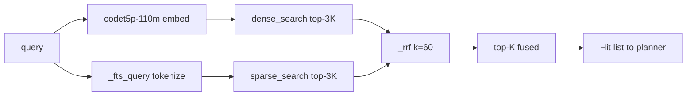

> tl;dr: `hybrid_search` is one Python class. It does two retrievals,
> fuses their ranks with the textbook RRF formula at $k = 60$, and
> returns the top-$K$. The interesting work is not in the code, which
> is fifteen lines. It is in (a) the choice to fuse rank rather than
> score, (b) the choice of $k$, and (c) the prompt-drift episode that
> took the tool from 1.7% to 39.4% usage in a week with the model and
> training unchanged. The last fact is what made `policy_fingerprint`
> mandatory: prompt drift is data drift, and a registry without a
> fingerprint silently mixes cohorts.

## 1 The math

For each document $d$ and each retrieval list $\ell$, let
$\text{rank}_\ell(d)$ be the 0-indexed position of $d$ in $\ell$ (or
$+\infty$ if $d \notin \ell$). The Reciprocal Rank Fusion score is

$$
\text{RRF}(d) \;=\; \sum_{\ell \in \{\text{dense},\, \text{sparse}\}} \frac{1}{k + \text{rank}_\ell(d)}, \qquad k = 60.
$$

The fused list is the documents sorted by $\text{RRF}(d)$ descending.
Documents missing from one of the two lists simply contribute zero
from that branch — there is no out-of-band penalty for absence, just
the absence itself.

Two design choices are doing the work.

**Rank, not score.** A dense retriever returns cosine similarities in
$[-1, 1]$ (in practice $[0, 1]$ after a $\max$ with zero), with a
distribution that depends on the embedder, the corpus, and the
specific query. A BM25 sparse retriever returns scores that are
unbounded above and depend on document length, term IDF, and the
saturation parameter $k_1$. The two scalars are not on the same
scale, and they are not even on the same kind of scale —
multiplicative in one case, additive-with-saturation in the other.
Any score-level fusion has to learn or assume a calibration between
the two, and any such calibration is brittle across corpora.

Rank is corpus-free. The first document in a list is always rank
zero, regardless of whether the score behind it is $0.94$ cosine or
$28.7$ BM25. RRF takes the only invariant available and uses only
that invariant. The price is information loss — a tied top-2
sparse list and a top-2 list with one document at score $0.99$ and
the next at score $0.31$ look the same to RRF. The empirical
position taken by Cormack, Clarke, and Büttcher in 2009 was that
this information loss is more than paid for by the corpus-portability
gain. We inherited that position; we did not re-litigate it.

**Why $k = 60$ specifically.** The Cormack-Clarke-Büttcher paper
ran $k$ across two orders of magnitude — from roughly $1$ to $100$ —
and reported that the fused MAP was flat across the entire range,
with the best value sitting near $60$. The shape of the
$1/(k + \text{rank})$ curve makes this intuitive: for very small
$k$, the first few ranks dominate so completely that fusion behaves
like a winner-takes-all over the two lists; for very large $k$, the
curve becomes nearly linear in rank and the differences between
adjacent ranks wash out. Somewhere in the middle, you get a curve
that preserves the head while still letting the tail vote. The
specific value $60$ is a "round number near the flat region" rather
than a tuned optimum. We did not run our own sweep — there is no
in-house artifact for $k \in \{10, 30, 60, 100, 200\}$ on a Perseus
corpus, and the public-bench evidence is strong enough that the
sweep is not currently on the queue.

The analogy that helps me is **weighted Borda count**. In a Borda
election, each voter ranks the candidates and each candidate
receives points equal to $(n - \text{rank})$ for each ballot. RRF
is the same shape with two changes: the linear $(n - \text{rank})$
is replaced by $1/(k + \text{rank})$ — a concave, decaying weight
that places far more mass on the head than the tail — and the
"ballots" are retrieval lists rather than human voters. The two
ballots in our case are the dense embedder and the BM25 sparse
index, voting on which chunks the planner should see.

## 2 Dense plus sparse, both over-fetched

The two lists themselves are produced by `store.dense_search` and
`store.sparse_search`. The dense path embeds the query with
`Salesforce/codet5p-110m-embedding` (256-d) and runs cosine
similarity in qdrant against the indexed chunk collection. The
sparse path tokenises the query through `_fts_query` (alphanumerics,
spaces, dot, dash, underscore; tokens shorter than two characters
dropped) and runs FTS5 BM25 over the chunk-content full-text index.
Both lists are pulled at $3K$ where $K$ is the caller's requested
`limit` — typically $K = 10$, so each list is $30$ deep.

The over-fetch is deliberate. If both lists were pulled at exactly
$K$, every document in the fused output would be one that appeared
in the top-$K$ of either dense or sparse. The "fusion adds value
in the middle" property — a document that lands at rank $4$ in
dense and rank $7$ in sparse can outrank a document at rank $0$ in
sparse but absent from dense — only manifests when there is a
middle to fuse over.

The arithmetic on a typical query at $K = 10$: dense top-10 and
sparse top-10 usually share five to seven documents. Without
over-fetch, the fused top-10 is at best a reordering of the union
$|A \cup B|$ which has size $13$ to $15$. With $3 \times$
over-fetch you have $|A \cup B|$ around $50$ to $55$, and the
middle ranks of either list can promote documents that *would
have been below the $K = 10$ cutoff in both single-retrieval
paths*. In practice the top-$10$ fused output adds three to five
documents that neither single retriever placed in its top-$10$.
That is the bandwidth where RRF earns its keep.

## 3 The implementation in fifteen lines

The whole tool is one method on one class. From
`perseus/core/retrieval/tools/search.py`:

```python
def _rrf(lists: list[list], k: float = 60.0):
    """RRF over chunk_id-bearing items."""
    scores: dict[int, float] = {}
    items: dict[int, object] = {}
    for L in lists:
        for rank, ch in enumerate(L):
            scores[ch.chunk_id] = scores.get(ch.chunk_id, 0.0) + 1.0 / (k + rank)
            items.setdefault(ch.chunk_id, ch)
    return sorted(items.values(), key=lambda c: -scores[c.chunk_id])


class HybridSearch:
    name = ToolName.HYBRID_SEARCH

    async def run(self, call, *, repo_root, index_id):
        q = str(call.args.get("query", "")).strip()
        top_k = int(call.args.get("limit", 10))
        if not q:
            raise PerseusValidationError("hybrid_search requires non-empty 'query'")
        store = store_factory()
        embedder = embed_factory()
        [qvec] = await embedder.embed([q])
        raw_k = top_k * 3
        dense = await store.dense_search(UUID(index_id), qvec, raw_k)
        sparse = await store.sparse_search(UUID(index_id), _fts_query(q), raw_k)
        fused = _rrf([dense, sparse])[:top_k]
        return ToolEvidence(hits=[...], outcome_score=_outcome(fused))
```

The `_rrf` helper is independent of the number of input lists — it
takes any list-of-lists and sums the reciprocal-rank contributions.
We use exactly two lists today (dense + sparse), but the same code
would handle three (dense + sparse + symbol-graph) without
modification if we ever wire a third.

The `chunk_id` is the deduplication key. Both dense and sparse
return chunk records with stable integer IDs, and the same chunk
appearing in both lists accumulates contributions from both
$1/(60 + r_\text{dense})$ and $1/(60 + r_\text{sparse})$. The
`items.setdefault` line preserves the first-seen chunk object so
the metadata (path, line ranges, snippet, kind, enclosing symbol)
survives the fusion.

The flow:



Both retrievals run sequentially in the current implementation —
the `await` on the dense call completes before the sparse call
starts. The parallelisation is on the to-do list; in practice the
dense path is dominated by the qdrant round-trip (around $20$ ms
locally) and the sparse path by the SQLite FTS5 query (around $5$
to $15$ ms), so the serial cost is around $30$ to $40$ ms which
sits well inside the planner's per-call budget. The over-fetch
factor of three was tested by hand on a handful of queries and
kept — no $3 \times$-vs-$5 \times$ sweep exists.

## 4 The seventeenth tool

Through 2026-04-22, Perseus had sixteen tools. Fifteen retrieval
tools — `search_text`, `search_path`, `open_file`, `snippet_extract`,
`symbol_lookup`, `references_lookup`, `callgraph_neighbors`,
`dependency_neighbors`, `sibling_scan`, `similar_files_embedding`,
`diff_pattern_scan`, `test_locator`, `error_signature_match`,
`broad_scan`, `repo_stats` — plus `give_up` as the leaf-state
transition. The 2026-04-22 retrieval-service integration branch
added `hybrid_search` as the seventeenth, intentionally positioned
as "the preferred retrieval entry point combining the best of dense
and sparse."

The motivation is the failure mode that single-retriever tools have
on code corpora. `search_text` and its sparse cousins miss
semantic-only queries — "where is the cross-encoder reranker called"
fails when the file uses `Reranker` instead of `cross-encoder`.
`similar_files_embedding` and its dense cousins miss exact-symbol
queries — embedding `_rrf` and embedding `_fts_query` are close
in 256-d space because they are both helper functions in
`search.py`, but the planner asking for `_rrf` specifically does
not want `_fts_query` as a co-equal hit. Hybrid fusion fixes
both: the BM25 branch nails exact-symbol queries; the dense branch
catches semantic-only queries; RRF gives you a list that does both.

The tool was assigned a `specificity` of $1.45$ in the schema
table — tied with `snippet_extract` for the highest value in the
catalogue. The UCB selection prior in MCTS multiplies the planner's
proposed prior by this scalar, so a $1.45$-specificity tool is
effectively boosted versus a $1.0$ tool (`search_text`) or a $0.5$
tool (`repo_stats`). The intent was to make the planner prefer
hybrid over its constituents when both are plausible.

That intent did not survive contact with the deployed prompt.

## 5 The prompt-drift fix

From the moment `hybrid_search` shipped on 2026-04-22 until
2026-04-25, its usage in the planner traces was below two percent.
Across roughly $1,157$ tool observation events in the local
query-progress JSONL, `search_text` was at $19.6\%$ and
`search_path` at $18.7\%$; `hybrid_search` was barely above
`repo_stats`. The MCTS prior boost from specificity $= 1.45$ was
real and measurable in the per-node logs, but it was getting
overwhelmed by the LLM's proposed prior, which placed almost
all the mass on the older, prompt-resident tools.

The cause was prompt drift, not model behaviour. The planner
system prompt — the document that describes the tool catalogue
to the planner LLM — had been written when there were sixteen
tools. The new seventeenth tool had been added to the schema, to
the runtime registry, and to the documentation, but the
instructional spine of the prompt still walked the planner through
"exploratory branches" using `search_text` and `search_path` as the
canonical examples. The few-shot trajectories shipped in the prompt
did not call `hybrid_search` once. The LLM did exactly what the
prompt told it to do.

The fix landed on 2026-04-25 as part of the prompt-drift audit. Two
edits to `scripts/strict_planner_system.txt`:

1. **C.4 ("exploratory branches")** was rewritten to make
   `hybrid_search` a first-class member of the exploratory toolkit
   — "when no candidate path or symbol is known, the exploratory
   branch SHOULD include `hybrid_search` alongside `search_text`
   and `search_path`."
2. **BAD8** was added as an anti-pattern in the rejected-examples
   block: "exploratory option set missing `hybrid_search` when no
   candidate is known is a BAD pattern."

The few-shot trajectories were updated in the same pass to include
a `hybrid_search` call as the first option in two of the cold-start
examples. Nothing else changed: the model was the same, the
training data was the same, the specificity table was the same,
the runtime registry was the same.

Usage of `hybrid_search` jumped from below two percent to $39.4\%$
within a week. The next-highest tool was `search_text` at $19.6\%$,
followed by `search_path` at $18.7\%$. `hybrid_search` was now
firing more often than the next two tools combined.

The full distribution from the local traces, post-fix:

| tool | calls | share |
|---|---:|---:|
| hybrid_search | 462 | 39.4% |
| search_text | 230 | 19.6% |
| search_path | 219 | 18.7% |
| diff_pattern_scan | 111 | 9.5% |
| broad_scan | 61 | 5.2% |
| open_file | 55 | 4.7% |
| snippet_extract | 9 | 0.8% |
| repo_stats | 7 | 0.6% |
| symbol_lookup | 3 | 0.3% |
| symbol-graph tools (combined) | 0 | 0.0% |

The shift is roughly two-thirds of all exploratory traffic moving
from the sparse-text duo onto `hybrid_search`. No retraining. No
specificity-table tuning. No SPECIFICITY-weight ablation. Just
two paragraphs in the prompt and two new few-shot examples.

## 6 Why this matters for cohort discipline

The $1.7\% \to 39.4\%$ usage shift is a 23× change in how often a
given tool fires. It is also a 23× change in the action
distribution that downstream training data sees. A trajectory
collected on 2026-04-23 has roughly a $2\%$ probability of
containing a `hybrid_search` step at any given depth; a trajectory
collected on 2026-04-29 has a $39\%$ probability. If both
trajectories land in the same `query_traces` table with no cohort
key, a downstream MuZero policy-head training run that bucket-samples
across the table will see an action distribution that is a
prompt-weighted average of two distinct policies.

The policies are not "slightly different" in the way two seeds of
the same training run are slightly different. The policies are
generated by *different prompts*. From the planner LLM's point of
view, the prompts are different programs. The trajectories are
samples from $\pi_\text{old}(\cdot \mid \text{prompt}_\text{old})$
and $\pi_\text{new}(\cdot \mid \text{prompt}_\text{new})$. These
are not the same distribution.

Worse, the change was not visible at the model layer. The model
weights did not change. The training data did not change. The
specificity table did not change. The runtime registry did not
change. Every conventional cohort key — `model_id`, `training_run`,
`tool_specificity_hash` — was identical across the boundary. The
only thing that differed was a hash of the planner system prompt
file.

This is the failure mode that motivated `policy_fingerprint_sha`.
The fingerprint, which landed alongside the prompt-drift fix on
2026-04-25, is a SHA-256 over the relevant tuple — the planner
prompt text, the confirm-stop prompt text, the UCB exploration
constant, the self-check toggle, the retrieval endpoint and
enabled flag, a SHA over the sorted Perseus environment variables
with secrets elided, and the build time. Every `query_traces` row
gets the fingerprint stamped on it. Cohort-aware training queries
can now filter on `policy_fingerprint_sha = ?` and isolate
trajectories produced by a single coherent prompt × runtime.

The audit work this enabled, retroactively, is exactly what the
fingerprint was designed for: queries like "show me the action
distribution per tool, broken down by `policy_fingerprint_sha`"
expose the $2\% \to 39\%$ shift as a clean step function aligned
to the 2026-04-25 commit, rather than a smeared "gradual
adoption" trend. Without the fingerprint, the shift would be
invisible to any aggregate query, and any downstream policy-head
training that included rows from both cohorts would be training
on a mixture distribution with no way to deconvolve.

The general lesson is uncomfortable: in a planner-LLM-based
system, **the prompt is part of the model**. A prompt change is a
model change. A registry change without a corresponding cohort
fingerprint update is silent data poisoning. Every Perseus
component that emits trajectories now treats prompt SHA as a
first-class cohort key, on equal footing with model checkpoint
hash.

## 7 What the fingerprint contains

The exact tuple, from `src/policy_fingerprint.rs`:

- `git_sha` — the Perseus build, embedded at compile time by `build.rs`.
- `planner_prompt_sha` — SHA-256 of `scripts/strict_planner_system.txt`.
- `confirm_stop_prompt_sha` — SHA-256 of the adversarial-confirm prompt.
- `ucb_c` — the UCB-C exploration constant (currently $2.2$).
- `self_check_enabled` — boolean.
- `retrieval_endpoint` — base URL of the retrieval-service.
- `retrieval_enabled` — boolean.
- `env_sha` — SHA-256 of `PERSEUS_*` environment variables, sorted,
  with secrets (any var ending in `KEY`, `TOKEN`, `SECRET`) elided.
- `build_time` — RFC3339 timestamp.

The canonical fingerprint is a JSON object with these fields, sorted
by key, SHA-256'd. Two Perseus instances are cohort-equivalent iff
their fingerprints match. The 2026-04-22 (pre-fix) and the
2026-04-25 (post-fix) instances have different
`planner_prompt_sha`, therefore different `policy_fingerprint_sha`,
therefore distinct cohorts in any downstream query.

The `env_sha` field catches a subtler class of drift: someone flips
`PERSEUS_LLM_TREE_TEMPERATURE` from $0.0$ to $0.3$ on a production
worker without updating the prompt or the binary. The fingerprint
changes; the cohort changes; downstream queries can distinguish.
The elision of `*KEY` / `*TOKEN` / `*SECRET` keeps credentials out
of the fingerprint (and out of any logs that include it) while
still hashing every behaviour-affecting environment knob.

## 8 The honest empirical gap

This essay describes the math, the implementation, and the
deployment episode honestly. It does not describe an in-house
ablation of `hybrid_search` against `dense_only` or
`sparse_only` on a Perseus corpus, because we do not have one.
The closest public-bench evidence is that `Qwen3-Embedding-4B`
scores $89.18$ CoIR nDCG@10 on the public code-retrieval suite,
and the Cormack-Clarke-Büttcher paper shows that RRF fusion
provides a consistent lift over either single retrieval across
the TREC corpora they tested. Neither of those is a Perseus
recall@K number.

The autoresearch v4 composite score —
$0.50 \cdot \text{overlap} + 0.30 \cdot \text{lift\_vs\_rg} + 0.10 \cdot \text{recall@10} + 0.05 \cdot \text{mrr} + 0.05 \cdot \text{compactness}$
— is the closest in-house signal, and it measures prompt and
pipeline together. We have not isolated the retrieval-stack
contribution from the prompt-engineering contribution. Closing
that gap is an open item; it would take the form of a
multi-bench `--retrieval-mode-default ∈ {dense, sparse, hybrid}`
sweep with `policy_fingerprint_sha` held constant on everything
except the retrieval flag.

Until that sweep runs, the case for `hybrid_search` rests on (a)
the math, (b) the public-bench evidence for both the embedder
and the RRF technique, and (c) the operational observation that
moving 23× more traffic onto the tool did not cause a
benchmark regression that anyone has spotted. Item (c) is the
weakest evidence because of the cohort-fingerprint problem
above: the prompt changed at the same time the traffic shifted,
so any downstream metric move conflates "the tool is good" with
"the new prompt is better at instructing the LLM."

## Sources

- `/Users/sam/code/perseus/perseus/core/retrieval/tools/search.py`
  — `_rrf` and `HybridSearch.run` implementation (verbatim).
- `/Users/sam/code/perseus/parking_lot/v2_archive_2026-05-18/HISTORY/24_tool_registry.md`
  — full 17-tool catalogue, specificity table, usage frequency
  ($39.4\%$), per-tool latency budgets.
- `/Users/sam/code/perseus/parking_lot/v2_archive_2026-05-18/HISTORY/30_retrieval_research.md`
  — retrieval-service architecture, embedder/reranker selection
  log, RRF candidate-set sizing, CoIR public-bench numbers.
- `Claude.md` (root of Perseus) — 2026-04-22 retrieval-service
  integration entry, 2026-04-23 hybrid_search tool addition,
  2026-04-25 prompt-drift fix entry, 2026-04-25 policy fingerprint entry.
- Cormack, Clarke, Büttcher (2009). *Reciprocal Rank Fusion outperforms
  Condorcet and individual rank learning methods.* SIGIR. The
  original RRF paper; $k = 60$ flat-region observation.
