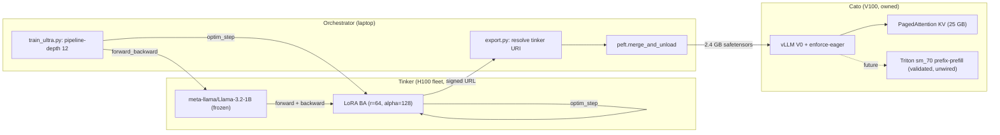

We replaced `gpt-5-nano` with a 1.24B-parameter vanilla `LlamaForCausalLM`, LoRA-finetuned via Tinker on 180,720 distilled trajectories, served from a single V100 at the cato edge. The pick is not "biggest model wins". It is the only candidate where four multiplicative properties — quality, JSON-mode robustness, throughput, and weight-footprint fit — clear zero simultaneously. This essay is the load-bearing argument for that artifact, on that hardware, at that checkpoint.

Every node expansion in the Perseus MCTS loop is one planner call. Quality, latency, and dollar cost multiply through every retrieval trajectory. A wrong base model is not a 10% tax — it is a multiplier on every step in every query in every sweep.

---

## 1. The four-term product

We model the planner-base decision as a multiplicative score across four independent terms, each of which can zero out the whole product:

$$\text{score} = Q \cdot J \cdot T \cdot F$$

where $Q$ is downstream multi-turn quality (does it emit valid plan JSON without schema leakage?), $J$ is JSON-mode integration cost (does vLLM's `guided_json` work without forks?), $T$ is throughput on the target hardware, and $F$ is whether weights and KV cache fit. Treating these additively — "average them out" — is exactly how the prior bake-offs picked Gemma3-270m, which failed catastrophically on $Q$ in multi-turn while looking great on $T$ and $F$.

The shortlist had four candidates. Three failed at least one term hard:

| Family | Params | Architecture | Failing term |
|---|---|---|---|
| Falcon-H1-Tiny-Coder-90M | 91M | Mamba + attention hybrid | $T$. Mamba state-update kernels have no fused sm_70 path. 600 steps/hr; 64–110 h/epoch projected. |
| Gemma3-270m | 268M | 15 sliding + 3 full attention | $Q$. Trained to val_loss 1.10. Multi-turn leaks literal schema placeholders such as triple-dot strings and brace-ellipsis-brace into the planner loop. |
| LFM2-350M | 354M | Conv + full attention hybrid | $J$. SFT completed; never wired through a serving shim. |
| Llama-3.2-1B | 1.24B | LlamaForCausalLM, hidden 2048, 16 layers, GQA 32/8 | **None.** The pick. |

The product is what matters. Falcon failed $T$. Gemma failed $Q$. LFM2 failed at integration. Llama is the only candidate where every multiplicative term is strictly positive on V100.

---

## 2. Quality: Llama-1B matches Gemma's loss and stops leaking schema

Gemma3-270m trained to $\text{val\_loss} \approx 1.10$ on our 180k corpus and emitted valid JSON one-shot. In multi-turn, it leaked literal schema placeholders — the triple-dot string and brace-ellipsis-brace patterns from the few-shot examples — into the planner output. The parse-and-repair retry chain in the runtime caught some of these; the production fallback was the local mock planner or back to `gpt-5-nano` over the OpenAI API.

Prompt-only intervention against `gpt-5-nano` had hit a ceiling at 53% `search_text` dominance no matter how we framed the prompt. The structural fix lives in the diversity-prior multiplier inside the runtime, but the architectural fix is more parameters in the right place.

Llama-3.2-1B at rank-64 LoRA hits $\text{val\_loss} = 1.098$ on the same 180k corpus where Gemma hit $\sim 1.10$. Cross-entropy parity. More importantly, the Llama checkpoint does not leak schema placeholders — multi-turn JSON stays clean through the entire MCTS tree. The marginal loss-axis improvement is small; the elimination of a failure mode is not.

---

## 3. JSON-mode: vanilla LlamaForCausalLM is first-class in vLLM

vLLM's `guided_json` backend (XGrammar) gives schema guarantees without paying the pre-XGrammar 200-second `outlines` cold start. Gemma3 plus LoRA tripped vLLM's "TransformersModel does not support LoRA" codepath. We fell back to a custom FastAPI shim around `peft + transformers` on port 19200. That path is unreliable under multi-turn load — it serializes batches, has no paged KV, and silently OOMs above eight concurrent sequences.

Vanilla `LlamaForCausalLM` is a first-class vLLM model class. Merge the LoRA adapter back into the base weights with `peft.merge_and_unload()`, save as a vanilla HF checkpoint, hand it to `vllm serve`. JSON-mode works. Tool-calling works (we leave it disabled by default in favor of guided JSON, which avoids the unsupported-tools 400-and-retry on cold start). No fork, no shim.

---

## 4. Throughput: the Triton prefix-prefill fork saves Volta

V100 is sm_70. vLLM's V1 engine refuses to start on sm_70; we pin to V0 with eager execution. CUDA-graph capture is silently disabled on Volta, and the eager flag stops vLLM from even trying.

The standard `prefix_prefill.py` Triton kernel in vLLM uses two operations that do not lower on sm_70: it requests ieee precision on the matmul and an fp32 output dtype from `tl.dot`. On Volta the Triton IR cannot lower an fp32-output mma — kernel compilation either fails outright or silently falls back to a slow reference path.

The forked kernel forces fp16 mma (the `HMMA.884.F32.F16.F16` instruction). The fork drops the precision kwarg, casts Q/K/V to fp16 before the matmul, sets fp16 output and manually promotes to fp32 in the accumulator, drops block tile sizes to 64×64 to fit Volta shared memory, sets four warps and two stages (no async copy on Volta), and removes the fp8, sliding-window, and skip-decode branches that only matter on newer hardware.

Standalone validation: full prefill (3008-token query, empty cache) runs in 245.7 ms; cached-prefix prefill (3000 ctx, 50-token delta) runs in 9.73 ms. That is a $25.2\times$ speedup over the stock path on identical input. Target was $10\times$.

This kernel is not yet wired into the live engine. Production at port 19320 still runs vLLM's stock PagedAttention with its page-granularity prefix cache. The fork sits in the planner-server crate as a validated standalone function plus a placeholder hook at the engine layer; wiring is a roughly 250-line layer-by-layer projection unroll. The existence of a proven sm_70-friendly prefix-prefill kernel is what made the Llama path viable — it is the insurance policy that says if vLLM's stock kernel regresses on Volta, we have a paved path back to tokens-per-second parity.

---

## 5. Fit: 1B in fp16 is 2.4 GB, V100 has 32

A 1.24B-parameter Llama in fp16 takes 2.4 GB on disk and in HBM. A V100-SXM3-32GB has roughly 28 GB usable after PagedAttention bookkeeping, leaving roughly 25 GB exclusively for the KV cache.

That budget makes 48 concurrent sequences with 24,576 batched tokens feasible on a single V100. Tensor parallel across 4–8 V100s was tried; the answer was the same single-stream tokens-per-second. 1B fits cleanly on one V100; TP buys nothing and adds NCCL latency.

---

## 6. LoRA, briefly

LoRA decomposes the weight update as a low-rank product:

$$W' = W + \frac{\alpha}{r} BA$$

where $W \in \mathbb{R}^{d \times d}$ is the frozen base weight, $B \in \mathbb{R}^{d \times r}$ and $A \in \mathbb{R}^{r \times d}$ are trainable adapter matrices, and $r \ll d$ is the rank. Only $BA$ moves; $W$ stays frozen.

For Llama-3.2-1B with $d = 2048$ and $r = 64$, each target projection trains $2 \cdot 2048 \cdot 64 = 262{,}144$ parameters instead of the full $2048^2 \approx 4.2\text{M}$ — a $16\times$ reduction per projection. Across 16 decoder layers and 4 projections (q, k, v, o), the rank-64 adapter is roughly 33M trainable parameters against a 1.24B frozen base. The exported adapter is 213 MB. The merged fp16 checkpoint is 2.4 GB — identical to the base, because the merge step folds the LoRA delta back into $W$ in place. After merge, vLLM has no idea the model was ever a LoRA adapter.

The Tinker rank cap for Llama-3.2-1B is 128. Higher ranks (the rank-256 launch attempt) get rejected at submit time with a 400 from the Tinker API. The sweep accepted the ceiling and stayed at $r \in \{64, 128\}$.

---

## 7. Train on rented H100, serve on owned V100

The structural argument for the whole pipeline is that training compute and serving compute have different shapes. Training wants short bursts of dense fp16 mma at high arithmetic intensity, billed by the second. Serving wants months of paged-attention decode at low arithmetic intensity, billed by the year. Renting H100s for the burst and owning V100s for the long tail is the cost-minimizing decomposition.

The pipeline-depth trick in the trainer keeps 12 concurrent forward-backward and optim-step futures in flight against the remote optimizer state. That single knob took the trainer from roughly 600 steps/hr to roughly 3,700 steps/hr on identical Tinker compute — the network round-trip is the bottleneck, not the GPU. The asyncio scheduler is the unsung star of the three-epoch ultra run.

Two more trainer features matter for production quality. First, curation: a permissive `--min-file-recall 0.5 --min-terminal-reward -1.0` filter trims 180,720 rows to 178,848 (98.96% kept). The knob is near-no-op at production thresholds but exists for stricter variants such as `v3_superclean` (file-recall $\geq 0.8$, terminal-reward $\geq 0.5$) that cut to 88,918 rows. Second, first-fit bin-packing: short examples pack into one 4096-token window. The corpus has heterogeneous lengths (some planner steps are 200 tokens, some are 3,800); packing bumps utilization from 45% to 92% per sequence, which is most of the throughput win.

Production hyperparameters: rank 64, $\alpha = 128$, targets q-k-v-o projections, base lr $2 \times 10^{-4}$, batch 16, sequence length 4096, pipeline depth 12, three epochs over 178,848 rows for 10,892 steps. Best $\text{val\_loss} = 1.098$ at step 10,500. We exported at that step, not at the final shard at step 10,892.

---

## 8. The export pipeline

The export step resolves a Tinker URI of the form `tinker://<run-id>:train:0/weights/shard00_step010500` to a signed download URL, fetches the PEFT tarball, and unpacks it locally. The unpacked directory contains the adapter config (rank 64, $\alpha = 128$, q-k-v-o targets), the 213 MB adapter safetensors, and tokenizer passthrough. The merge step loads the base Llama-3.2-1B, applies the adapter via PEFT, calls `merge_and_unload()` to fold the delta in place, and serializes a vanilla fp16 HF checkpoint to disk — single 2.4 GB `model.safetensors`, vanilla Llama-3.2-1B config, plain tokenizer.

The vLLM launch (since 2026-05-17 18:02 IST) binds the merged directory on port 19320 with three load-bearing flags. The maximum-sequences cap is 48, matching the sweep's worker pool. The batched-tokens cap is 24,576, sized as 48 sequences times 512-token average context. Eager execution disables `torch.compile` and CUDA-graph capture, which Volta V0 cannot do anyway; without the flag the engine crashes at startup.

The merged checkpoint is fp16 native. GPTQ-INT4 was tried — a 1.5 GB quantized variant at port 19311 using auto-gptq with `damp_percent` 0.01, descending-activation off, group size 128, 32 calibration examples. Result: roughly 15% wall-clock loss versus fp16 single-stream. GPTQ Marlin kernels need sm_80+; V100 is sm_70 and falls back to slower paths. The whole point of INT4 — Marlin acceleration — does not exist on this hardware. FP16 native beats it. The GPTQ copy is retained as an A/B fallback only.

---

## 9. The comparison table

| Variant | Params | Best val_loss | Failure mode |
|---|---|---|---|
| **llama32-1b-epoch3-v3 (cato)** | 1.24B | **1.098** | Production. None. |
| v3_r128 (rank 128) | 1.24B + r128 | 1.122 | Live on port 19305. Tied epoch3-v3 on val. Likely superseded by bigseq. |
| **v3_bigseq (seq 8192)** | 1.24B + r64 | **0.932** | Best val of sweep. **Not deployed.** No graduation pipeline. |
| v3_superclean | 1.24B + r64, 88k rows | 1.120 | Half the compute, same val as r128. Not exported. |
| v3_r128_short (50k rows) | 1.24B + r128 | 1.283 | Data-scaling reference; more data beats more rank. |
| v3_r256_short | — | — | Tinker rejected rank 256 at submit. |
| Gemma3-270m | 268M | $\sim 1.10$ | Schema-leak in multi-turn. Single-shot OK; production fall-back via OpenAI. |
| Falcon-H1-Tiny-Coder-90M | 91M | — | Mamba on sm_70 unviable. 600 steps/hr. Dropped at base bake-off. |
| LFM2-350M | 354M | — | SFT completed; no serving shim wired. Shelved. |
| gpt-5-nano (teacher) | unknown | n/a | Production fallback. The thing being replaced. |

Two rows deserve elaboration. The Gemma schema-leak failure is covered in the planner base bake-off. The `v3_bigseq` deployment gap is below.

---

## 10. The deployment gap

The Tinker bake-off shipped a quantitatively better variant than the one running in production. `v3_bigseq` hit $\text{val\_loss} = 0.932$ at step 9,000. The deployed checkpoint hit 1.098 at step 10,500. On the loss axis that is a 15% improvement — comparable to what we would expect from a generation jump, not a hyperparameter sweep.

The hypothesis behind `v3_bigseq` was that sequence length matters more than rank on this corpus. The 180k SFT rows have nontrivial completion lengths from multi-tool planner outputs; rank-64 at sequence 8192 hit a strictly lower val than rank-128 at sequence 4096. The sweep validates that hypothesis cleanly.

`v3_bigseq` is exported. It is merged. It is not deployed. No vLLM listener serves it. Three reasons, in order of bluntness:

1. **No auto-promote pipeline.** The Tinker-eval rotation watches for new LoRA checkpoints and serves variants on ports 19301..19305 — but the leaderboard it builds runs on a 5-case ripgrep suite where only 1 of 5 cases (ripgrep-1367) hits gold. Recall@5 with a single positive does not separate variants well, so the leaderboard cannot say "swap production now."
2. **The benchmark to certify `v3_bigseq` does not exist yet.** A diversity-balanced 100-instance pool was built at `autoresearch-instance-pool-v2.json`. Wiring it into the eval rotation is a half-day task; it has not happened.
3. **Val loss is not quality.** A 0.932 vs 1.098 cross-entropy gap on teacher trajectories is plausibly an artifact of `v3_bigseq` seeing longer prefixes (more context for next-token prediction). Downstream lift on retrieval-quality metrics — the thing Perseus actually optimizes — is unmeasured.

This gap is the load-bearing piece of the Tinker bake-off post-mortem. We produced a measurably better artifact and shipped the worse one. That is not a training failure; that is a graduation-pipeline failure.

---

## 11. The honest disclaimer

Engram production currently points its planner endpoint at the OpenAI API with `gpt-5-nano-2025-08-07`. The cato-hosted Llamas are deployed, healthy, and probeable — but they are not on the production traffic path. The pivot back to OpenAI direct was made when the cato pool failed health-checks during the 2026-05-12 sweep.

"The deployed planner" is therefore true in the narrow sense (port 19320 has been serving valid completions since 2026-05-17 18:02 IST) and not yet true in the sweep-traffic sense. The pieces that gate moving sweep traffic to cato are the same pieces that gate `v3_bigseq` deployment: a downstream-quality benchmark on the 100-instance pool, a green streak across the 120-minute stabilization window, and a working gate-streak counter. When that gate flips, port 19320 becomes the production planner in both senses. Until then, this essay documents the artifact, not the traffic.

---

## 12. Why this wins, in one sentence

V100 kernel work pays for the bigger model. The forked Triton prefix-prefill proves Volta can serve a 1B-parameter model at roughly $25\times$ cached-prefix speedup over the stock vLLM kernel. That validated kernel — plus the fact that vanilla `LlamaForCausalLM` is a first-class vLLM model class on V100 V0 with eager execution — is what lets Llama-3.2-1B win across throughput-bound concurrent workloads where Gemma3-270m would be cheaper-per-call but unreliable, and where Falcon-H1-90M would be cheapest-per-call but $6\times$ slower in steps/hr at training time. The quality lift from Llama-1B over Gemma-270m at long context dominates the throughput cost on V100. That is the bet. As of 2026-05-17 18:02 IST, the bet is in production.
