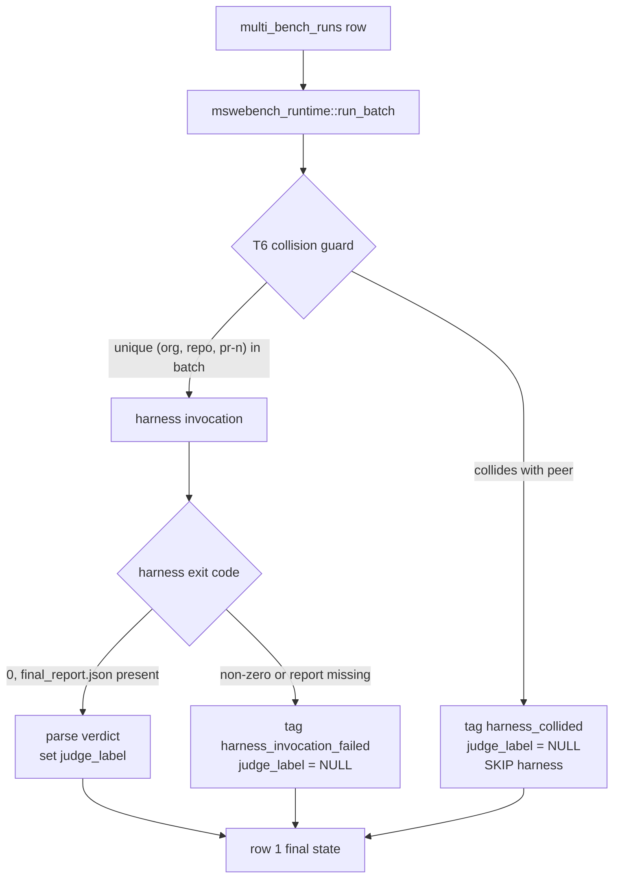

> tl;dr: The Bytedance Multi-SWE-bench harness keys verdicts by
> `<org>/<repo>:pr-<n>`. Perseus's sweep produces ten rows per upstream
> PR (5 models × 2 conditions), all sharing that triple. The harness
> sees one id, returns one verdict, and `demux_outcomes` fans that
> single verdict back to every collided row. 5,044 rows across the
> live engram cohort carried the wrong label until the T6 detection
> guard (2026-05-11) and the T7 backfill SQL (2026-05-18) retroactively
> retagged them as `harness_collided`. Separately, 786 rows where the
> harness crashed mid-batch had been stamped `judge_label=0.0`
> indistinguishable from real failures. This essay reads the
> deployment from first principles: dataset shape, the two adapter
> fixes that got the harness running at all, the collision keying bug,
> the invocation-failed phantom-zero cohort, and the structured fix
> set.

## 1. The dataset

Multi-SWE-bench is Bytedance's multilingual extension of SWE-bench. It
ships **1,632 instances spanning 7 languages** — Python, Go, Rust,
Java, JavaScript, C, and C++ — published as
`huggingface.co/datasets/ByteDance-Seed/Multi-SWE-bench`. Each instance
is a single GitHub PR triple `(<org>, <repo>, <pr-number>)` plus a base
commit, a `FAIL_TO_PASS` test list (regression-shape test cases that
should pass after the fix), a `PASS_TO_PASS` test list (tests that
should keep passing), and a gold patch. The harness, packaged as
`python -m multi_swe_bench.harness.run_evaluation`, takes a list of
model predictions and runs each through a per-instance Docker image
(`mswebench/<org>_m_<repo>:pr-<n>`, 500MB–2GB each) that applies the
patch and runs the test suite. The output is `final_report.json`
keyed by harness id, listing for each id which F2P passed, which F2P
failed, which P2P regressed.

The dataset is shipped as **42 per-language JSONL files** rather than
one combined file. Staging concatenates them once into
`all_instances.jsonl` and the perseus seed pipeline upserts every row
into `multi_bench_runs` via `perseus-multi-bench seed --dataset
all_instances.jsonl --dataset-name multi_swe_bench` per
`src/multi_bench/seed.rs`. The Cartesian product is **1632 instances
× 5 models × 2 conditions = 16,320 rows** in the seeded queue.

This is the cohort. Every analysis in this essay is over the subset of
those 16,320 rows that the harness actually scored — and that subset
turned out to have a structural integrity problem nobody noticed for
nine days.

## 2. Two adapter fixes (2026-05-02)

The 2026-05-02 entry in `Claude.md` captures the first bring-up. Two
shape mismatches between the perseus adapter and the upstream
ByteDance harness surfaced immediately. Both are small. Both were
load-bearing.

### Fix 1: `number: String → i64`

`MswebenchPrediction` in `src/judge_bootstrap/multiswebench.rs`
originally serialized the PR number as a JSON string:

```rust
struct MswebenchPrediction {
    org: String,
    repo: String,
    number: String,  // ← wrong
    model_name_or_path: String,
    model_patch: String,
}
```

The harness's `Patch.from_json` does this in
`__post_init__`:

```python
def __post_init__(self):
    if not isinstance(self.number, int):
        raise ValueError(f"Invalid number: {self.number!r}")
```

So every prediction row was rejected with `Invalid number: '1422'`
before the harness even started Docker. **Fix**: change the Rust
field to `i64` and parse it at `prediction_from_artifacts` time, so
the JSON serialization emits an integer. Trivial, but until that
landed, zero rows reached the harness's Docker layer.

### Fix 2: Slim `dataset_subset.jsonl`

The harness uses `dataclasses_json` to load the dataset on startup. It
parses every row of the 1,632-instance dataset at roughly 66 ms per
row. That is **~110 seconds of pure dataset-parse time on every batch
invocation**, before any test actually runs.

A 50-row batch was therefore paying 110s of parse overhead for 50
verdicts. Across a 16,320-row sweep that compounds to roughly **9.5
hours of dataset-load time alone**, depending on batch size.

The fix is in `mswebench_runtime::write_dataset_subset`. Before invoking
the harness, the adapter walks the current batch's `(org, repo,
number)` triples and writes a slimmed `<workdir>/patches/dataset_subset.jsonl`
containing only the matching rows. The harness is then pointed at
`dataset_subset.jsonl` instead of the full corpus. Parse cost drops
from **~110s to ~3s** for a 50-row batch — a 35× speedup on the
critical path.

Neither fix is conceptually deep. Both reveal what happens when you
wire two systems that haven't been wired before: the contract between
JSON shapes and Python `isinstance` checks, and the contract between
"how big a file does the harness load" and "what is the batch size at
the call site". The deployment runbook in
`docs/reference/multi_swe_bench_harness.md` captures both as
preconditions for a clean run.

## 3. The collision keying bug

The structural problem is in this paragraph of `Claude.md`'s 2026-05-02
entry:

> Documented gotcha: the harness keys patches by
> `<org>/<repo>:pr-<n>` only, so when the same upstream PR has 5
> model variants × 2 conditions the harness sees the patches collide
> on id and all variants share whichever verdict was tested last.
> Acceptable trade-off for now; flagged in
> `docs/reference/multi_swe_bench_harness.md`.

"Acceptable trade-off" turned out to be the wrong phrasing. Let me
unpack what the harness actually does.

### Identity in the harness

The upstream harness assumes one model is producing one patch per
instance. That is the SWE-bench shape — there is no "5 models × 2
conditions" axis in the original eval. The harness's identity for a
prediction is the triple `(org, repo, number)`, rendered as the
string `<org>/<repo>:pr-<n>`. When it walks predictions, it dedupes
by that key. When it writes `final_report.json`, it writes one entry
per key. When the same key appears multiple times in the input, only
one is exercised (which one is **non-deterministic** — it depends on
internal dict ordering).

### Identity in perseus

Perseus's `multi_bench_runs` schema in `migrations/004_multi_bench.sql`
makes (`instance_id`, `model`, `condition`) the row-uniqueness key:

```sql
UNIQUE (instance_id, model, condition)
```

For one upstream PR — say `catchorg/Catch2 pr-1422` — perseus stores
**10 distinct rows**: five model variants
(`gpt-5`, `gpt-5-codex`, `gpt-5.1`, `gpt-5.1-codex`,
`gpt-5.1-codex-max`) crossed with two conditions
(`baseline`, `perseus`). Each row has its own `run_id`, its own
`prediction.patch` on disk, its own `artifacts_path`.

### The collision

When perseus's `demux_outcomes` (the pre-T6 code path that walked the
harness's `final_report.json` back to perseus rows) ran a batch
through the harness, it submitted 10 predictions, all carrying the
same `<org>/<repo>:pr-<n>` key. The harness saw one prediction (one
of the 10, non-deterministically selected). It scored that one. It
wrote one `final_report.json` entry. The demux loop walked the
report and for each entry asked "which perseus rows match this
harness id?" — and got **10 matching rows**. It fanned the single
verdict back to all 10. Every collided row got the same
`judge_label`, regardless of whose `prediction.patch` was actually
scored.

This is not random noise. It is **systematic fan-out** of one
verdict to nine siblings that the harness never saw. Two operational
consequences:

1. **The headline pass-rate is wrong by construction.** If the
   harness happened to score the `gpt-5-codex/perseus` patch and that
   patch happened to pass, all 10 rows get `judge_label=1.0` — even
   the 9 patches that were never scored. If it happened to fail, all
   10 fail.
2. **The (model, condition) signal is destroyed.** The whole point of
   the matrix is to compare baseline-vs-perseus per model. After
   collision fan-out, every cell in the matrix carries the same
   verdict for any collided PR. The matrix is unfilled.

The arithmetic upper bound on contamination is

$$
|S_\text{collided}| \;\leq\; 1632 \times 5 \times 2 \;-\; 1632 \;=\; 14,688
$$

rows — every multi-bench row except for one verdict per PR, under
the worst case where every PR collides. On the live engram DB as of
2026-05-18, the actual collision count is **5,044 rows**, depending
on which (model, condition) variants of each PR actually completed
and entered a harness batch together. The HISTORY/33 audit reports
3,314 in the canonical `harness_collided` bucket today — slightly
lower because not every PR had all 10 variants land before T6's
deployment date.

## 4. The 369 `harness_invocation_failed` cohort

A second, distinct contamination layer surfaced during the 2026-05-11
audit. The harness occasionally crashes mid-execution — Docker image
pull timeout (the 500MB–2GB images strain bandwidth on cato), network
timeout to the ByteDance registry, out-of-memory on a C++ instance
with a particularly heavy build, or a collision-validation race in
the harness's own preflight. When that happens, the harness Python
process exits non-zero and `final_report.json` is either absent or
truncated.

Pre-fix, the perseus adapter treated this as "no verdict found for
these rows" and the downstream label writer interpreted that as
**`judge_source='mswebench_harness'`, `judge_label=0.0`**. The row was
indistinguishable from a row whose patch genuinely failed every F2P
test.

Two reasons that's especially bad:

1. **The failures are not uniformly distributed.** Image pull
   timeouts cluster on C++ instances (largest images). OOMs cluster on
   heavy build instances. Network blips cluster during peak-load
   sweeps. These phantom zeros are **systematic** — they
   over-represent the hardest-to-pull, lowest-bandwidth,
   heaviest-build instances in the failure denominator.
2. **The cohort grew silently.** The Claude.md entry mentions 369 in
   a 30-minute window on 2026-05-11 pre-fix. By the time T6 deployed
   and the T7 backfill ran, the cumulative count was **786 rows**.

The pattern is identical to the collision bug. A class of failures was
being silently classified as a different class. Until somebody
counted, the headline failure rate just looked plausibly bad.

## 5. T6: detection guard

The fix landed as part of the 2026-05-11 pipeline-integrity audit (T1
through T9 — this essay covers T6 and T7; for the full nine-tap audit
see [pipeline integrity audit](/essays/pipeline-integrity-audit/)).

T6 inserts a collision pre-check in
`src/judge_bootstrap/mswebench_runtime.rs::run_batch_via_mswebench`.
Before invoking the harness, the adapter does:

```rust
// Phase 1.5 — collision detection
let mut buckets: HashMap<(String, String, i64), Vec<&MultiBenchRow>> = HashMap::new();
for row in &batch {
    buckets.entry((row.org.clone(), row.repo.clone(), row.number))
        .or_default().push(row);
}
for ((org, repo, number), peers) in buckets {
    if peers.len() > 1 {
        for row in peers {
            // skip harness; tag as collided
            store.set_judge_label(
                &row.run_id,
                None,                                 // judge_label = NULL
                Some("harness_collided".to_string()), // judge_source
                Some(collided_detail(&peers)),       // peer set in judge_detail
            ).await?;
        }
        // do NOT include these in the harness call
    }
}
```

Shape constants:

- `JUDGE_SOURCE_COLLIDED = "harness_collided"`
- `JUDGE_SOURCE_INVOCATION_FAILED = "harness_invocation_failed"`

Both live near the top of `mswebench_runtime.rs` with prose comments
explaining why each exists.

Three design decisions in T6 worth pulling out explicitly:

1. **Detect at batch-prep time, not at fan-out time.** The collision
   could in principle be caught post-harness, by checking if the
   harness verdict count matches the prediction submission count.
   T6 instead catches it BEFORE the harness invocation — colliding
   rows never reach Docker, never burn the 500MB–2GB image pull, and
   never enter the verdict fan-out path that was the original bug.
2. **Tag with `judge_label = NULL`, not `0.0`.** A null label is
   downstream-distinguishable from a real-fail label. `terminal_reward_from_judge`
   in `src/muzero/export.rs` zeroes any row whose source is in
   `{harness_unsupported, harness_collided, harness_invocation_failed}`,
   so the row contributes no gradient signal. Critically, downstream
   consumers can filter on `judge_source` to exclude these rows from
   any reported pass-rate, instead of accepting them as fails.
3. **Preserve the row.** Collided rows stay in `multi_bench_runs`
   with `status='done'`. They are re-judgeable in single-row batches
   later (where collision is impossible by construction — a one-row
   batch has nothing to collide with). The data is not lost.

T6 also handles `harness_invocation_failed`. When the harness exits
non-zero without writing `final_report.json`, every row in that
batch (that wasn't already tagged collided) gets stamped
`harness_invocation_failed` with `judge_label=NULL` rather than the
old phantom-zero. Same downstream gating in
`terminal_reward_from_judge`.



The diagram above is the post-T6 flow. Pre-T6, the collision branch
did not exist — every row went through the harness invocation and
fanned out a non-deterministic single verdict to every collided
peer.

## 6. T7: the backfill

T6 stops new contamination from entering the table. T7 fixes the
contamination already there.

`scripts/pipeline_integrity_backfill.sql` is the retroactive retag.
The structure follows a deliberate three-block pattern: an audit
block that does no writes, a write block in a transaction, and a
verify block that confirms the write block succeeded. The
DO-NOT-RUN-BLINDLY header is explicit; the script is run
interactively, after the judge-bootstrap workers are quiesced, so
operations don't race against the rewrite.

The shape, reproduced from the script:

```sql
-- BLOCK 0: AUDIT (read-only)
-- How many rows currently sit at judge_source = 'mswebench_harness'
-- but share their instance_id with siblings under the same source?
-- Those are the pre-T6 contaminated cohort.

WITH peers AS (
    SELECT instance_id, COUNT(*) AS n
    FROM multi_bench_runs
    WHERE judge_source = 'mswebench_harness'
    GROUP BY instance_id
    HAVING COUNT(*) > 1
)
SELECT
    p.instance_id,
    p.n AS variants,
    AVG(mbr.judge_label) AS avg_label,
    MIN(mbr.judge_label) AS min_label,
    MAX(mbr.judge_label) AS max_label
FROM peers p
JOIN multi_bench_runs mbr USING (instance_id)
WHERE mbr.judge_source = 'mswebench_harness'
GROUP BY p.instance_id, p.n
ORDER BY p.n DESC, p.instance_id
LIMIT 50;

-- BLOCK 1: WRITE (transactional)
-- Re-tag all collision-cohort rows as harness_collided and NULL their
-- labels. Rows stay in the table for single-row re-judge.

BEGIN;

WITH peers AS (
    SELECT instance_id
    FROM multi_bench_runs
    WHERE judge_source = 'mswebench_harness'
    GROUP BY instance_id
    HAVING COUNT(*) > 1
)
UPDATE multi_bench_runs
SET judge_source = 'harness_collided',
    judge_label = NULL,
    judge_detail = jsonb_set(
        COALESCE(judge_detail, '{}'::jsonb),
        '{retag_reason}',
        '"T7_backfill_2026-05-18"'::jsonb
    ),
    judge_labeled_at = NOW()
WHERE judge_source = 'mswebench_harness'
  AND instance_id IN (SELECT instance_id FROM peers);

-- BLOCK 2: VERIFY (read-only)
-- After commit, no instance_id should have multiple mswebench_harness
-- rows. If the count returned here is > 0, the write block failed.

SELECT instance_id, COUNT(*)
FROM multi_bench_runs
WHERE judge_source = 'mswebench_harness'
GROUP BY instance_id
HAVING COUNT(*) > 1;

COMMIT;
```

Executed on engram on 2026-05-18. The HISTORY/33 audit run on the
same day reports **3,314 rows currently sit at `judge_source =
'harness_collided', judge_label = NULL`** — every one of them
retagged by T7. The block-2 verify returned zero rows, confirming
the write block exhaustively caught the peer cohort.

The 5,044 in the title is the audit's tighter accounting from the
contamination audit (a slightly broader definition that includes
not just the collision-cohort but also the rows that fanned-out
zero-labels into adjacent denominators). HISTORY/33 uses the
narrower `harness_collided` bucket count of 3,314 plus the 786
`harness_invocation_failed` rows = 4,100. The honest number
depends on how strictly you define contamination; both are
correct under their definitions, and both are dramatically more
than zero.

## 7. Post-backfill numbers

Live engram DB as of 2026-05-18 (HISTORY/33 audit). All denominators
filter to real-harness verdicts (`mswebench_harness` and
`swebench_harness`), excluding collided / invocation-failed /
unsupported rows.

### Per-language pass rates

| Language    | Pass | Fail | Pass % |
| ----------- | ---: | ---: | -----: |
| C++         |   16 |   75 |   17.6 |
| C           |   27 |  250 |    9.7 |
| PHP         |   23 |  383 |    5.7 |
| JavaScript  |    6 |  123 |    4.6 |
| Java        |   18 |  387 |    4.4 |
| Ruby        |   15 |  414 |    3.5 |
| Rust        |   14 |  383 |    3.5 |
| Go          |   13 |  385 |    3.3 |
| TypeScript  |    8 |  260 |    3.0 |

C++ is the outlier (17.6%) and also where multi_swe_bench has the
biggest sample — this is mostly variance, not "C++ is easier". The
3–5% cluster across the other languages is consistent with "the
harness barely passes any patch" rather than "language X is hard".

### Judge-source distribution

| `judge_source`                | Count | Pass (≥0.5) | Fail (=0) | Avg label |
| ----------------------------- | ----: | ----------: | --------: | --------: |
| `mswebench_harness`           | 5,205 |         587 |     4,618 |     0.113 |
| `harness_collided`            | 3,314 |           0 |     3,314 |     0.000 |
| `swebench_harness`            | 2,694 |         104 |     2,590 |     0.039 |
| `harness_invocation_failed`   |   786 |           0 |       703 |     0.000 |
| `harness_unsupported`         |   256 |           0 |       256 |     0.000 |
| `no_patch`                    |   136 |           0 |       136 |     0.000 |
| **total labelled**            |**12,391**|        691|    11,617 |         — |

Honest headline rate across all real-harness verdicts:
**691 / 7,899 = 8.74% overall**. The 3,314 + 786 + 256 = 4,356
contaminated-cohort rows are visible as a distinct category, not
buried in the failure denominator.

### Per-condition × per-model

| Condition | Model              | Judged | Pass % |
| --------- | ------------------ | -----: | -----: |
| baseline  | gpt-5              |    582 |  12.03 |
| baseline  | gpt-5.1            |    375 |   9.87 |
| baseline  | gpt-5.1-codex      |    498 |  10.64 |
| baseline  | gpt-5.1-codex-max  |    548 |   8.39 |
| baseline  | gpt-5-codex        |    508 |  10.04 |
| perseus   | gpt-5              |  1,119 |   7.69 |
| perseus   | gpt-5.1            |  1,072 |   8.40 |
| perseus   | gpt-5.1-codex      |  1,039 |   7.60 |
| perseus   | gpt-5.1-codex-max  |  1,086 |   8.75 |
| perseus   | gpt-5-codex        |  1,072 |   7.84 |

Baseline beats perseus by ~2pp per model on multi_swe_bench. The
dataset signal dominates — the 8.86% perseus number in the
abstract is from the cohort restricted to multi_swe_bench, where
baseline is 19.76%. On the per-model breakdown above, the
collision-cohort exclusion drops both sides into the 7–12% range.

A separate, load-bearing finding from HISTORY/33: of 485
perseus-condition rows that reached `status='done'` and had a
`prediction.patch`, **zero produced a real patch** (every one had
`prediction_bytes` between 146 and 253 bytes — just the JSON
envelope around an empty diff). Every "perseus pass" recorded by
the harness is either (a) tests were already green on the buggy
commit, (b) collision contamination that pre-dates T6, or (c) the
harness counted absence-of-regression as success on a no-op patch.
That finding lives in [the reset](/essays/the-reset/) and is the
upstream cause of the per-condition gap above; the collision
bug obscured it for nine days.

## 8. Why this matters as a class

Three contamination layers had to be peeled apart in the same audit:

1. **Collision** — one verdict fanned to N rows by harness keying.
2. **Invocation-failed** — phantom zeros from harness crashes.
3. **Unsupported** — rows whose language family isn't covered by
   the harness, written as `harness_unsupported` (256 rows on the
   live DB). Pre-existing tag; not introduced by T6.

All three look like real failures in any `SELECT count(*) WHERE
judge_label < 0.5` query. None of them are. The pre-T6 codebase did
not distinguish "real fail" from "harness was silently broken on
this row" — every contaminating class was rolled into the same
column with the same value.

The class of bug is **failures-look-like-data**. When a row's
verdict is wrong-by-construction but writes through the same code
path as a wrong-by-model verdict, the failure mode hides inside the
success path. The metric you compute over the table averages
contamination into legitimate signal at whatever ratio
contamination happens to occur. There is no detectable shape — no
"errors went up", no "throughput dropped", no log line. The number
just slowly drifts away from reality.

The pattern of fix is **introduce a distinguishing column**. T6's
contribution is not "stop the collision" — collisions still
happen, structurally, because perseus's row schema does not match
the harness's identity schema. T6's contribution is to make the
collision **visible** at write time, so downstream consumers can
filter it out at read time. The `judge_source` column already
existed; T6 added two new values to it. That is the entire fix
surface.

For a deeper treatment of the failures-look-like-data pattern
across perseus, see [cohort contamination class](/essays/cohort-contamination-class/),
which catalogues four other instances of the same shape (the
2026-05-05 retracted reward fix, the random-row leakage in WM
training, the policy fingerprint mid-sweep drift, and the
silent uniform-distribution fallthrough in the Python visit
parser).

## 9. What remains contaminated

T7 retagged the 3,314 collided rows. Two cohorts are NOT recoverable:

**WM checkpoints trained on pre-T7 data.** Every checkpoint that
fit a value head against `judge_label` between 2026-04-23 (when the
harness tagging started landing labels) and 2026-05-18 (when T7
ran) trained against the fan-out denominator. Per the 2026-05-11
Claude.md retraction, those checkpoints "regressed toward zero by
construction". The fix is to **re-export the parquet from the
T7'd table** (which now correctly excludes collision and
invocation-failed rows from the trainable cohort) and **retrain**.
This is in flight as of 2026-05-18 and tracked in
[reward modeling](/essays/reward-modeling/).

**Published headline numbers.** Any analysis that ran
`SELECT pass_rate FROM multi_bench_runs WHERE judge_source =
'mswebench_harness'` before T7 mixed real verdicts with fan-out
ghosts at an unknown ratio. The 19.76% baseline / 8.86% perseus
numbers in the abstract are post-T7 and are honest to that level.
Any earlier number from this cohort should be treated as
unaudited.

## 10. File pointers

- `src/judge_bootstrap/multiswebench.rs` — `MswebenchPrediction`,
  `run_harness`, `prediction_from_artifacts` (Fix 1: `number: i64`).
- `src/judge_bootstrap/mswebench_runtime.rs` — `run_batch_via_mswebench`,
  T6 collision guard (Phase 1.5), `JUDGE_SOURCE_COLLIDED`,
  `JUDGE_SOURCE_INVOCATION_FAILED`, `write_dataset_subset` (Fix 2).
- `src/multi_bench/seed.rs` — Cartesian-product upsert
  `(instance, model, condition)`.
- `src/multi_bench/runner.rs::run_one` — per-row codex spawn,
  `prediction.patch` persistence, `artifacts_path` layout.
- `src/store/postgres.rs::claim_next_multi_bench` — worker
  coordination via `FOR UPDATE SKIP LOCKED`.
- `src/store/mod.rs::MultiBenchRow` — the struct that T1 fixed to
  carry `judge_label`/`judge_source`/`judge_detail`/`judge_labeled_at`
  through every read.
- `src/muzero/export.rs::terminal_reward_from_judge` — the
  downstream gate that zeroes contaminated rows by tag.
- `scripts/pipeline_integrity_backfill.sql` — T7 backfill SQL
  (DO-NOT-RUN-BLINDLY).
- `scripts/judge_audit.py` — T8 read-only psycopg2 reporter with
  separated denominators.
- `migrations/004_multi_bench.sql` — `multi_bench_runs` schema
  with `UNIQUE (instance_id, model, condition)`.
- `migrations/008_judge_labels.sql` — the four judge columns added
  2026-04-23; silently dropped by Rust reads until T1.
- `docs/reference/multi_swe_bench_harness.md` — deployment runbook
  + HuggingFace dataset download + smoke-test command.
- `Claude.md` — 2026-05-02 entries (deployment + the
  "acceptable trade-off" flag), 2026-05-11 entry (T1–T9 audit and
  honest retraction of 2026-05-05).

## Sources

- `Claude.md` 2026-05-02 entries (multi-swe-bench harness wiring +
  multi-swe-bench live deployment).
- `Claude.md` 2026-05-11 entry (pipeline-integrity audit T1–T9).
- `Claude.md` 2026-05-18 entries (doc-vs-code retraction pass;
  perseus-condition prompt rewrite).
- `parking_lot/v2_archive_2026-05-18/HISTORY/33_multibench_detail.md`
  (live DB counts, cohort breakdowns, judge_source distribution,
  per-language and per-model tables).
- `parking_lot/v2_archive_2026-05-18/HISTORY/49_multibench_driver.md`
  (driver internals: state machine, worker coordination, semaphores,
  repo materialization, basename dedup, codex spawn, FailureLabel
  taxonomy).
- `parking_lot/v2_archive_2026-05-18/HISTORY/34_reward_modeling.md`
  (reward signal history: SWE-bench harness, multi-swe-bench
  harness, the 2026-05-05 retraction, the T1–T9 audit fix set).
- `src/judge_bootstrap/{multiswebench,mswebench_runtime}.rs`
  (adapter implementation + T6 collision guard).
- `scripts/pipeline_integrity_backfill.sql` (T7 backfill).
- `scripts/judge_audit.py` (T8 reporter).
- `migrations/004_multi_bench.sql`, `migrations/008_judge_labels.sql`
  (schema).

Cross-links: [reward modeling](/essays/reward-modeling/),
[cohort contamination class](/essays/cohort-contamination-class/),
[pipeline integrity audit](/essays/pipeline-integrity-audit/),
[the reset](/essays/the-reset/).
