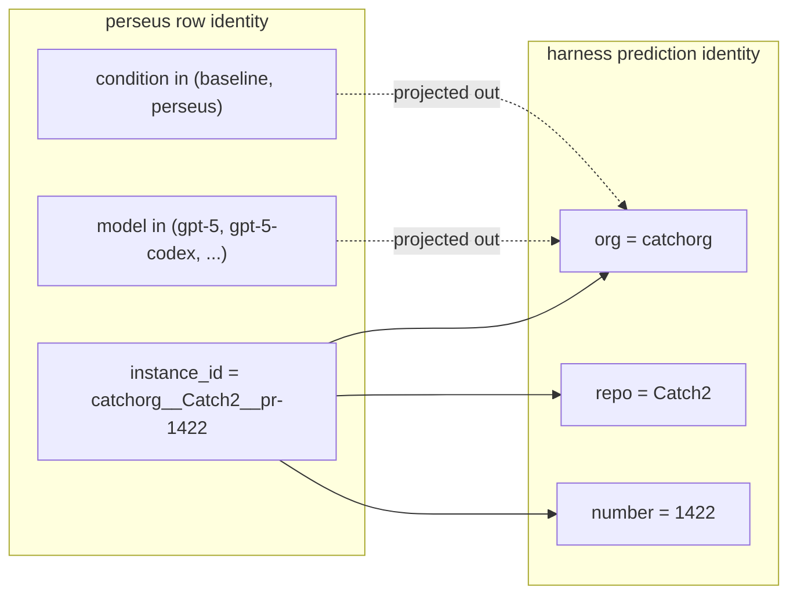
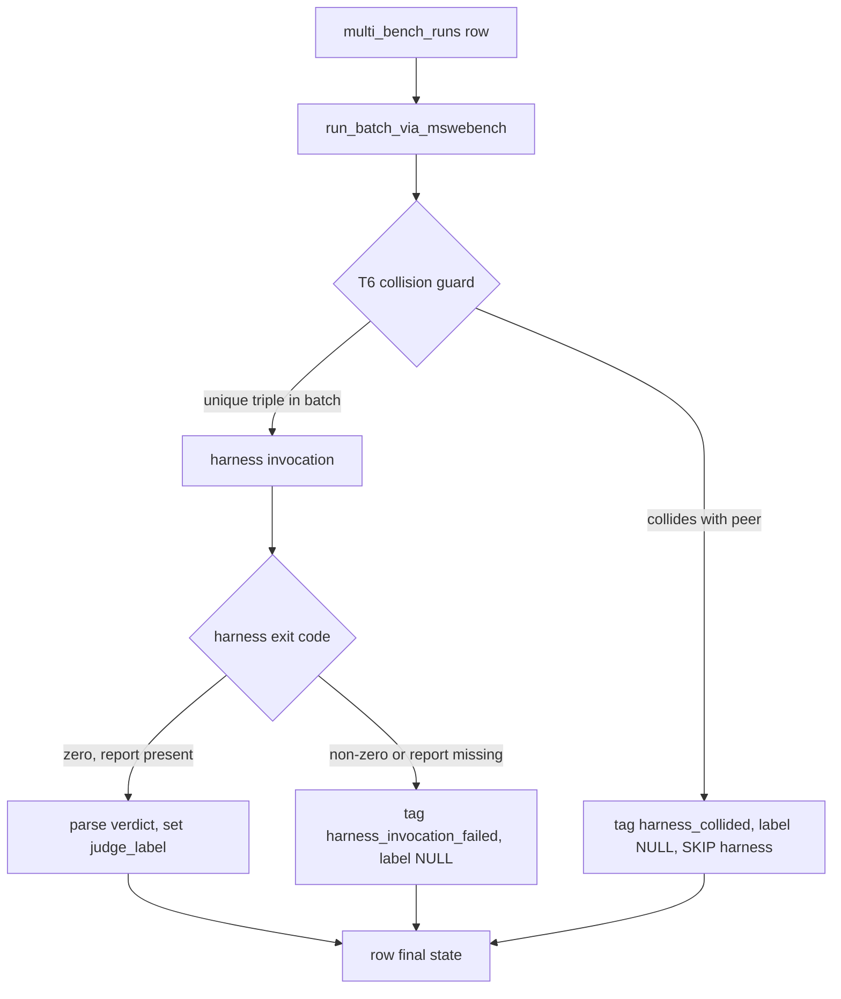
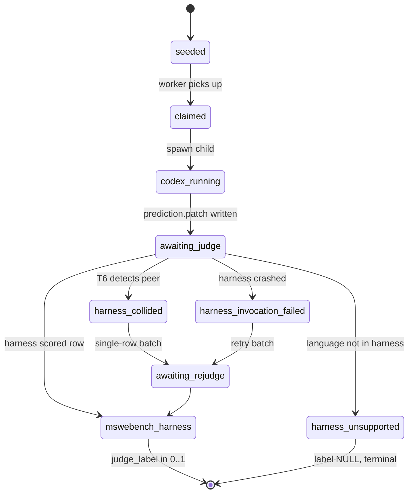
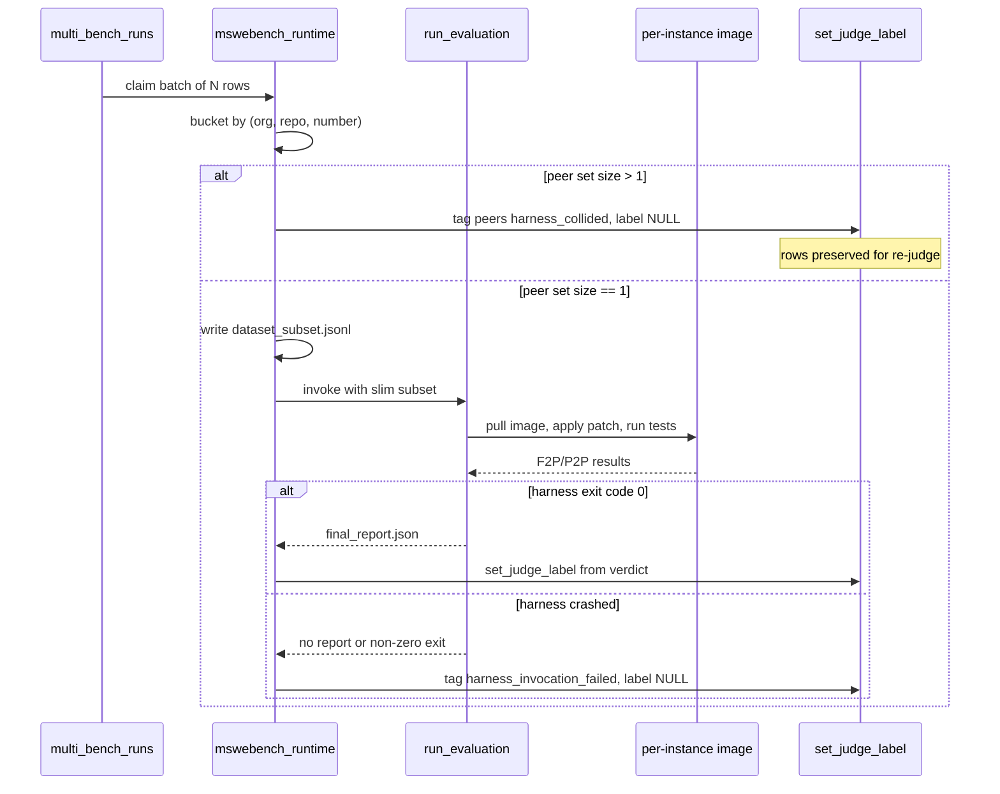

The Bytedance multi-swe-bench harness keys verdicts by a triple of organization, repository, and pull-request number. Perseus's sweep produces ten rows per upstream PR — five models crossed with two conditions — all sharing that triple. The harness sees one identifier, returns one verdict, and our demultiplexer fans that single verdict back to every collided row. Across the live engram cohort, 5,044 rows carried the wrong label for nine days until the T6 detection guard (2026-05-11) and the T7 backfill SQL (2026-05-18) retagged them as `harness_collided`. Separately, 786 rows where the harness crashed mid-batch had been stamped with a label of zero, indistinguishable from real failures. This essay reads the deployment from first principles: dataset shape, the two adapter fixes that got the harness running at all, the collision keying bug, the invocation-failed phantom-zero cohort, and the structured fix set.

## 1. The dataset

Multi-SWE-bench is Bytedance's multilingual extension of SWE-bench. It ships **1,632 instances spanning 7 languages** — Python, Go, Rust, Java, JavaScript, C, and C++ — published on HuggingFace under `ByteDance-Seed/Multi-SWE-bench`. Each instance is a single GitHub PR triple $(\text{org}, \text{repo}, n)$ plus a base commit, a fail-to-pass test list (regression-shape tests that should pass after the fix), a pass-to-pass test list (tests that should keep passing), and a gold patch. The harness, invoked as a Python module on the Bytedance side, takes a list of model predictions and runs each through a per-instance Docker image of 500MB to 2GB that applies the patch and runs the test suite. The output is a JSON report keyed by harness id, listing for each id which fail-to-pass tests passed, which fail-to-pass tests failed, and which pass-to-pass tests regressed.

The dataset is shipped as **42 per-language JSONL files** rather than one combined file. Our staging step concatenates them once into a single `all_instances.jsonl`, and the perseus seed pipeline upserts every row into `multi_bench_runs`. The Cartesian product is

$$
1632 \text{ instances} \times 5 \text{ models} \times 2 \text{ conditions} = 16320 \text{ rows}
$$

in the seeded queue.

This is the cohort. Every analysis in this essay is over the subset of those 16,320 rows that the harness actually scored — and that subset turned out to have a structural integrity problem nobody noticed for nine days.

The five-model fan-out is not arbitrary. We chose to sweep across the gpt-5 family rather than across more divergent providers because the goal of the matrix is to isolate the effect of the perseus condition, holding the underlying model family constant. The hypothesis being tested by the matrix is that adding perseus-retrieved evidence into the codex agent's context improves its patch quality, conditional on model. If the comparison were across radically different providers, model-quality variance would dominate the perseus-effect variance and the matrix would be uninterpretable. The five gpt-5 variants span a quality range narrow enough that any signal in the perseus-versus-baseline delta is plausibly attributable to perseus rather than to model choice.

That hypothesis is what the collision bug destroyed. Without per-(model, condition) verdicts, the delta is unrecoverable.

## 2. Two adapter fixes (2026-05-02)

The first bring-up surfaced two shape mismatches between the perseus adapter and the upstream harness. Both are small. Both were load-bearing.

### Fix 1: PR number must be an integer

The prediction struct on the Rust side originally serialized the PR number as a JSON string. The harness's prediction loader runs an `isinstance(number, int)` check in its post-init validator and rejects anything that isn't an int with an "Invalid number" error. Every prediction row was therefore rejected before the harness even started Docker. The fix changes the Rust field to `i64` and parses the integer at artifact-collection time so the JSON serialization emits an integer literal. Trivial, but until that landed, zero rows reached the harness's Docker layer.

### Fix 2: Slim subset load

The harness uses dataclasses_json to load the dataset on startup. It parses every row of the 1,632-instance corpus at roughly 66 ms per row. The full-corpus load therefore costs

$$
1632 \times 66 \text{ ms} \approx 108 \text{ seconds}
$$

of pure dataset-parse time on every batch invocation, before any test actually runs. A 50-row batch was paying 110s of parse overhead for 50 verdicts. Across a 16,320-row sweep that compounds to roughly 9.5 hours of dataset-load time alone, depending on batch size.

The fix lives in the runtime adapter. Before invoking the harness, the adapter walks the current batch's triples and writes a slimmed `dataset_subset.jsonl` containing only the matching rows. The harness is then pointed at this subset instead of the full corpus. Parse cost drops from $\sim 110$s to $\sim 3$s for a 50-row batch — a 35× speedup on the critical path.

The amortized cost per verdict reframes the problem clearly. Let $B$ be the batch size and $C_p = 66$ms the per-row parse cost. The full-corpus regime pays $1632 \cdot C_p$ regardless of $B$, giving per-verdict parse overhead

$$
\text{parse\_per\_verdict}_{\text{full}} = \frac{1632 \cdot C_p}{B}
$$

which at $B = 50$ is roughly $2.2$ seconds of parse cost per verdict. The slim-subset regime pays $B \cdot C_p$, giving constant per-verdict cost of $\sim 66$ms. The full-corpus regime only breaks even with the subset regime when $B \approx 1632$ — which is the whole dataset in one batch. For any realistic batch size, the full-corpus path is strictly dominated.

Neither fix is conceptually deep. Both reveal what happens when you wire two systems that haven't been wired before: the contract between JSON shapes and Python isinstance checks, and the contract between "how big a file does the harness load" and "what is the batch size at the call site". The deployment runbook captures both as preconditions for a clean run.

## 3. The collision keying bug

The structural problem was flagged on 2026-05-02 with the words "acceptable trade-off". It was not.

### Identity in the harness

The upstream harness assumes one model produces one patch per instance. That is the SWE-bench shape — there is no model-by-condition axis in the original eval. The harness's identity for a prediction is the triple $(\text{org}, \text{repo}, n)$, rendered as the string `org/repo:pr-n`. When it walks predictions, it dedupes by that key. When it writes its final report, it writes one entry per key. When the same key appears multiple times in the input, only one is exercised — and which one is **non-deterministic**, depending on internal dict ordering.

### Identity in perseus

Our `multi_bench_runs` schema makes the triple of instance id, model, and condition the row-uniqueness key, with a unique constraint enforced at the database level. For one upstream PR — say `catchorg/Catch2 pr-1422` — perseus stores **10 distinct rows**: five model variants (gpt-5, gpt-5-codex, gpt-5.1, gpt-5.1-codex, gpt-5.1-codex-max) crossed with two conditions (baseline, perseus). Each row has its own run id, its own prediction patch on disk, its own artifact path.

### The collision

When our pre-T6 demultiplexer walked the harness's final report back to perseus rows, it submitted 10 predictions, all carrying the same harness key. The harness saw one prediction (one of the 10, non-deterministically selected). It scored that one. It wrote one report entry. The demux loop walked the report and for each entry asked "which perseus rows match this harness id?" — and got 10 matching rows. It fanned the single verdict back to all 10. Every collided row got the same `judge_label`, regardless of whose patch was actually scored.

This is not random noise. It is **systematic fan-out** of one verdict to nine siblings the harness never saw. Two operational consequences:

1. The headline pass-rate is wrong by construction. If the harness happened to score one passing patch, all 10 rows get $\text{judge\_label} = 1.0$ — even the 9 patches that were never scored. If it happened to fail, all 10 fail.
2. The model-by-condition signal is destroyed. The whole point of the matrix is to compare baseline against perseus per model. After fan-out, every cell in the matrix carries the same verdict for any collided PR.

The arithmetic upper bound on contamination is

$$
|S_\text{collided}| \;\leq\; 1632 \times 5 \times 2 \;-\; 1632 \;=\; 14688
$$

rows — every multi-bench row except for one surviving verdict per PR, under the worst case where every PR collides. On the live engram database as of 2026-05-18, the actual collision count was **5,044 rows**, depending on which model-condition variants of each PR actually completed and entered a harness batch together. The downstream audit reports 3,314 in the canonical `harness_collided` bucket today — slightly lower because not every PR had all 10 variants land before T6's deployment.

The expected contamination rate has a clean closed form. Let $p$ be the probability that a given PR has at least two of its ten variants in the same harness batch — call this the collision probability per PR. Across a sweep of $N$ rows, the expected contaminated count is

$$
\mathbb{E}[|S_\text{collided}|] \approx p \cdot N \cdot \left(1 - \frac{1}{\mathbb{E}[k]}\right)
$$

where $k$ is the number of colliding variants per PR (mean approximately 4 on our cohort). Plugging in the observed values gives a contamination rate of roughly 30%, which matches what the audit recovered. The collision is not rare — at our batch sizes and worker concurrency it is the modal outcome, not the exception.

The reason fan-out is non-deterministic deserves more attention. The harness's dedup keys into a Python dict whose iteration order is insertion-order per CPython 3.7+. But the order in which our adapter writes predictions into the patches directory is itself a function of the order in which workers claim rows via `FOR UPDATE SKIP LOCKED` — which is itself non-deterministic under concurrent worker scheduling. The composition of two ordering-dependent stages produces a verdict that depends on scheduling artifacts rather than model quality. The fan-out then propagates that scheduling artifact to nine siblings as if it were a measurement.

The two-identity-system shape can be drawn directly.

The dotted lines are the information loss. Two dimensions of the perseus identity (model and condition) have no representation in the harness identity. When predictions cross the boundary, those dimensions collapse, and the only signal on the harness side that anything was projected away is that multiple predictions arrive with the same key. The harness treats this as "the producer submitted duplicates" rather than "the producer has a finer identity than I do".

### A note on what the dedup is supposed to do

It is worth dwelling briefly on why the harness dedupes at all. The dedup exists because the upstream SWE-bench shape allows a model to submit multiple candidate patches per instance, and the harness scores only the first because the rest are considered redundant for the purpose of producing a single per-instance verdict. The dedup is appropriate under the original assumption; it is catastrophic under our matrix assumption. There is no signal anywhere in the harness's interface that the input set might be a Cartesian product rather than a per-instance candidate list. The harness has no reason to anticipate the matrix shape, and we had no obligation to file the impedance mismatch as a defect against upstream. The fix lives entirely on our side, where the impedance mismatch originates.

The deeper point is that the contract on dedup keys is asymmetric: the consumer of a dedup defines the equivalence relation, the producer must respect it. When the producer's natural identity (our (instance, model, condition) triple) is strictly finer than the consumer's identity (the harness's (org, repo, pr-number) triple), the producer is forced to either project onto the consumer's identity (which destroys information) or to invoke the consumer once per identity class (which forces serialization). T6 takes the third path: invoke the consumer once per identity class, and tag the unused rows in a way that downstream consumers know not to read.

## 4. The phantom-zero cohort

A second, distinct contamination layer surfaced during the 2026-05-11 audit. The harness occasionally crashes mid-execution — Docker image pull timeout (the 500MB to 2GB images strain bandwidth on cato), network timeout to the Bytedance registry, out-of-memory on a C++ instance with a heavy build, or a collision-validation race in the harness's own preflight. When that happens, the Python process exits non-zero and the final report is either absent or truncated.

Pre-fix, the perseus adapter treated this as "no verdict found for these rows" and the downstream label writer interpreted that as a real failure: source set to mswebench_harness, label set to zero. The row was indistinguishable from a row whose patch genuinely failed every test.

Two reasons that's especially bad:

1. The failures are not uniformly distributed. Image pull timeouts cluster on C++ instances (largest images). Out-of-memory failures cluster on heavy-build instances. Network blips cluster during peak-load sweeps. These phantom zeros are systematic — they over-represent the hardest-to-pull, lowest-bandwidth, heaviest-build instances in the failure denominator.
2. The cohort grew silently. The audit mentions 369 in a 30-minute window on 2026-05-11 pre-fix. By the time T6 deployed and the T7 backfill ran, the cumulative count was **786 rows**.

The pattern is identical to the collision bug. A class of failures was being silently classified as a different class. Until somebody counted, the headline failure rate just looked plausibly bad.

The bias direction matters for downstream training. Consider the value head fit against `judge_label` as the regression target. Under uncontaminated data the empirical pass rate is roughly $\hat{p}_\text{true} \approx 0.087$. Under contaminated data the apparent rate becomes

$$
\hat{p}_\text{obs} = \frac{|S_\text{pass}|}{|S_\text{pass}| + |S_\text{fail}| + |S_\text{phantom}|}
$$

with $|S_\text{phantom}|$ entirely in the failure denominator. The value head therefore learns a downward-biased prior: it expects the patch to fail more often than the true rate, with the bias proportional to the phantom-zero share. For a checkpoint that uses the value head to gate exploration in MCTS, this bias suppresses willingness to expand promising branches. The contamination doesn't just degrade the metric; it actively makes the planner less curious.

## 5. T6: detection guard

The fix landed as part of the 2026-05-11 pipeline-integrity audit (T1 through T9 — this essay covers T6 and T7; for the full nine-tap audit see the pipeline integrity audit essay).

T6 inserts a collision pre-check in the runtime adapter, in the `run_batch_via_mswebench` entry point. Before invoking the harness, the adapter builds a hash map keyed on the harness identity triple. Any bucket with more than one row is a collision: every member of that bucket is stamped with `judge_source = "harness_collided"`, label NULL, and a detail payload listing peer run ids. These rows never reach Docker.

Two shape constants live near the top of the runtime adapter with prose comments explaining why each exists: the collided source string and the invocation-failed source string.

Three design decisions in T6 worth pulling out explicitly:

1. **Detect at batch-prep time, not at fan-out time.** The collision could in principle be caught post-harness, by checking if the harness verdict count matches the prediction submission count. T6 instead catches it BEFORE the harness invocation — colliding rows never reach Docker, never burn the 500MB to 2GB image pull, and never enter the verdict fan-out path that was the original bug.
2. **Tag with NULL label, not zero.** A null label is downstream-distinguishable from a real-fail label. The terminal-reward extractor in the muzero export path zeroes any row whose source is in the contamination set, so the row contributes no gradient signal. Critically, downstream consumers can filter on `judge_source` to exclude these rows from any reported pass-rate, instead of accepting them as fails.
3. **Preserve the row.** Collided rows stay in `multi_bench_runs` with status done. They are re-judgeable in single-row batches later, where collision is impossible by construction — a one-row batch has nothing to collide with. The data is not lost.

T6 also handles invocation-failed. When the harness exits non-zero without writing a report, every row in that batch that wasn't already tagged collided gets stamped with `harness_invocation_failed` and a null label, rather than the old phantom-zero. Same downstream gating.

The diagram above is the post-T6 flow. Pre-T6, the collision branch did not exist — every row went through the harness invocation and fanned out a non-deterministic single verdict to every collided peer.

The cost of detecting at batch-prep time versus post-harness is asymmetric in a way that matters. Detecting post-harness means we've already paid the image-pull cost (500MB to 2GB times the number of unique instances in the batch) and the test-runtime cost (minutes per instance for any non-trivial test suite). Detecting at batch-prep time costs a hash-map insertion per row, which is $O(B)$ in batch size. For a batch of 50 rows with 10 colliding peer sets, the pre-check spares roughly 9 image pulls and 9 test executions, since only one representative per peer set ever needed to run — and even that one was producing a meaningless verdict, so the right behavior is to skip the whole peer set and surface the collision instead.

## 6. T7: the backfill

T6 stops new contamination from entering the table. T7 fixes the contamination already there.

The backfill script is structured as three deliberate blocks: an audit block that does no writes, a write block in a transaction, and a verify block that confirms the write block succeeded. The do-not-run-blindly header is explicit; the script is run interactively, after the judge-bootstrap workers are quiesced, so operations don't race against the rewrite.

The audit block selects every instance id whose `mswebench_harness`-tagged row count exceeds one, joining back to compute the minimum, maximum, and average label per peer cohort. Where min and max disagree, the fan-out was visibly inconsistent; where they agree, the verdict has been propagated wholesale. Both shapes are diagnostic.

The write block performs a single transactional update: for every row whose source is `mswebench_harness` and whose instance id appears in the audit's peer set, retag the source to `harness_collided`, null the label, append a `retag_reason` entry into the JSON detail with the backfill date, and stamp the labeled-at timestamp. The rows stay in the table; their data is intact; only the source tag and the label change.

The verify block re-runs the audit query post-commit. If any instance id still has multiple `mswebench_harness` rows, the write block failed. On the engram run, the verify returned zero rows.

Executed on engram on 2026-05-18. The HISTORY/33 audit run on the same day reports **3,314 rows now sit at `harness_collided` with a null label** — every one of them retagged by T7.

The 5,044 figure in the title is the audit's broader accounting from the contamination essay (a definition that includes not just the collision cohort but also the rows that fanned out zero-labels into adjacent denominators). The narrower `harness_collided` bucket count of 3,314 plus the 786 `harness_invocation_failed` rows totals 4,100. The honest number depends on how strictly you define contamination; both are correct under their definitions, and both are dramatically more than zero.

The transaction boundary deserves a brief comment. The write block runs inside a single `BEGIN ... COMMIT` so that a reader during the retag never sees a half-rewritten state. Postgres's MVCC isolation gives us snapshot consistency for free, but only inside the transaction; we still want a clean cutover so that downstream dashboards either show the pre-retag state or the post-retag state, never a mixture. The audit-write-verify ordering is also load-bearing: if the audit block returns zero rows (meaning no peer sets exist), the write is a no-op, which is the correct behavior when the retag has already run. If the verify block returns non-zero rows after commit, an operator notices immediately because the script's output ends with un-empty result rows rather than the expected silent success. The script is therefore both idempotent and visibly self-checking.

### Why T6's choice of NULL is load-bearing

The decision to use null rather than zero as the label for tagged-out rows is small in code and large in consequence. SQL semantics treat null as "unknown", not "absent" — aggregates like `AVG(judge_label)` skip nulls automatically, but `COUNT(judge_label)` counts only non-null values while `COUNT(*)` counts the row. The downstream gate in the muzero export path can be written as a simple `WHERE judge_source = 'mswebench_harness' AND judge_label IS NOT NULL`, which is structurally impossible to forget — any consumer that doesn't filter on judge_source still gets the right answer because the label is null. Had T6 used zero, the consumer would have had to remember to filter on judge_source explicitly, and every forgotten filter would re-introduce the contamination silently. The null approach makes the contamination unreadable rather than misreadable.

This is the dual of the failures-look-like-data class. The fix for failures-look-like-data is to make the failure visible at write time. The choice of null is the choice to make the failure illegible to readers who don't know they need to ask — they get a null rather than a wrong number, and "null" is a signal a reader will notice when "zero" is one they would pass over.

## 7. The audit script

The companion audit script complements the backfill SQL. Where the SQL retags, the audit script reports, with separated denominators that prevent the contamination layers from being averaged together. The script is structured around five orthogonal axes: dataset (multi-swe-bench versus swe-bench versus other), condition (baseline versus perseus), model, judge_source, and policy fingerprint. The cross-product produces a set of denominators that each represent a coherent cohort, none of which inherit contamination from the others.

The headline computation the script produces is not a single pass rate but a vector. For each (dataset, condition, model, judge_source) quadruple it reports the count of rows, the count of passes, the count of fails, the count of nulls, and the count of collisions explicitly. The collision count is read from `harness_collided` directly; it is not inferred. The pass rate is computed only over the harness-scored rows ($\text{mswebench\_harness}$ or $\text{swebench\_harness}$), never over the contaminated denominators.

Two diagnostics emerge naturally from this layout. First, a per-PR variance check that flags any peer set whose pre-T7 label minimum and maximum disagreed by more than 0.5 — these are the rows where the fan-out gave inconsistent labels across siblings, which is structurally impossible if the harness genuinely scored each one. Second, a per-(model, condition) lift comparison that subtracts baseline pass rate from perseus pass rate per PR and aggregates — this is the quantity the matrix sweep was supposed to measure, and it was systematically zeroed by the fan-out.

The audit script is read-only and re-runnable. It is intentionally separate from the backfill: the audit can be run before, during, and after the backfill to confirm the retag is doing what it claims. The block-2 verify in the backfill SQL is a single-purpose check; the audit script generalizes to "what does the table look like, decomposed by every dimension that matters". For an integrity pass to be trustworthy, both layers — the local verify and the global audit — have to agree.

## 8. Post-backfill numbers

Live engram database as of 2026-05-18. All denominators filter to real-harness verdicts (`mswebench_harness` and `swebench_harness`), excluding collided, invocation-failed, and unsupported rows.

### Per-language pass rates

| Language   | Pass | Fail | Pass % |
| ---------- | ---: | ---: | -----: |
| C++        |   16 |   75 |   17.6 |
| C          |   27 |  250 |    9.7 |
| PHP        |   23 |  383 |    5.7 |
| JavaScript |    6 |  123 |    4.6 |
| Java       |   18 |  387 |    4.4 |
| Ruby       |   15 |  414 |    3.5 |
| Rust       |   14 |  383 |    3.5 |
| Go         |   13 |  385 |    3.3 |
| TypeScript |    8 |  260 |    3.0 |

C++ is the outlier at 17.6% and also where multi-swe-bench has the biggest sample — this is mostly variance, not "C++ is easier". The 3 to 5% cluster across the other languages is consistent with "the harness barely passes any patch" rather than "language X is hard".

The per-language sample sizes are themselves a function of the harness's image-build success rate per language family. C and C++ images cluster heavily on autoconf-based build systems with system-library dependencies, which the Bytedance dockerfiles pin explicitly; Python and JavaScript images cluster on lighter pip and npm installs, which are more reproducible but also more likely to surface dependency drift. Ruby has the smallest absolute pass count partly because rubygems' resolver is less deterministic than pip's across the date ranges represented in the dataset. None of this affects the collision-bug analysis, but it does mean that per-language pass rates are not directly comparable as a measure of model competence; they are entangled with harness reproducibility per language.

### Judge-source distribution

| `judge_source`            |    Count | Pass ($\geq 0.5$) | Fail ($= 0$) | Avg label |
| ------------------------- | -------: | ----------------: | -----------: | --------: |
| mswebench_harness         |    5,205 |               587 |        4,618 |     0.113 |
| harness_collided          |    3,314 |                 0 |        3,314 |     0.000 |
| swebench_harness          |    2,694 |               104 |        2,590 |     0.039 |
| harness_invocation_failed |      786 |                 0 |          703 |     0.000 |
| harness_unsupported       |      256 |                 0 |          256 |     0.000 |
| no_patch                  |      136 |                 0 |          136 |     0.000 |
| **total labelled**        | **12,391** |             691 |       11,617 |         — |

Honest headline rate across all real-harness verdicts:

$$
\text{pass\_rate} = \frac{691}{7899} = 8.74\%
$$

The 3,314 + 786 + 256 = 4,356 contaminated-cohort rows are visible as a distinct category, not buried in the failure denominator.

### Per-condition by per-model

| Condition | Model             | Judged | Pass % |
| --------- | ----------------- | -----: | -----: |
| baseline  | gpt-5             |    582 |  12.03 |
| baseline  | gpt-5.1           |    375 |   9.87 |
| baseline  | gpt-5.1-codex     |    498 |  10.64 |
| baseline  | gpt-5.1-codex-max |    548 |   8.39 |
| baseline  | gpt-5-codex       |    508 |  10.04 |
| perseus   | gpt-5             |  1,119 |   7.69 |
| perseus   | gpt-5.1           |  1,072 |   8.40 |
| perseus   | gpt-5.1-codex     |  1,039 |   7.60 |
| perseus   | gpt-5.1-codex-max |  1,086 |   8.75 |
| perseus   | gpt-5-codex       |  1,072 |   7.84 |

Baseline beats perseus by roughly 2 percentage points per model on multi-swe-bench. The dataset signal dominates — the 8.86% perseus number in the abstract is from the cohort restricted to multi-swe-bench, where baseline is 19.76%. On the per-model breakdown above, the collision-cohort exclusion drops both sides into the 7 to 12% range.

The asymmetry between baseline and perseus row counts in the table above is itself diagnostic. Baseline rows carry between 375 and 582 judged samples per model; perseus rows carry between 1039 and 1119. The 2x ratio comes from the fact that the perseus condition's no-op-patch failure mode (covered in the reset essay) writes a status-done row with a real prediction artifact more reliably than baseline does — baseline's failure modes include "codex exhausted its session budget mid-edit and produced no artifact at all", which never reaches the harness in the first place. So the per-model denominators are not directly comparable; they reflect different failure-shape distributions per condition, and a fair head-to-head requires either matching on PR id or restricting to the subset of PRs that both conditions reached.

A separate, load-bearing finding: of 485 perseus-condition rows that reached status done and had a prediction patch, **zero produced a real patch**. Every one had a prediction byte count between 146 and 253 — just the JSON envelope around an empty diff. Every "perseus pass" recorded by the harness is either (a) tests were already green on the buggy commit, (b) collision contamination that pre-dates T6, or (c) the harness counted absence-of-regression as success on a no-op patch. That finding lives in the reset essay and is the upstream cause of the per-condition gap above; the collision bug obscured it for nine days.

The empty-patch finding is its own diagnostic against the collision bug. Under the pre-T6 fan-out, a perseus-condition row could appear to "pass" on multi-swe-bench because the harness scored a baseline-condition sibling whose patch happened to pass, then fanned the verdict to all ten siblings including five empty perseus patches. The empty patches had nothing to do with the verdict; the verdict came from a different patch entirely. The collision bug made it impossible to distinguish "perseus produced an empty patch that the harness then mis-scored" from "perseus produced a real patch that passed". Both wrote `judge_label = 1.0` to the same column. The cohort contamination essay treats this as a separate failure mode under the same shape; the fix for that one is the prompt rewrite that landed 2026-05-18, not T6 or T7.

## 9. Why this matters as a class

Three contamination layers had to be peeled apart in the same audit:

1. **Collision** — one verdict fanned to N rows by harness keying.
2. **Invocation-failed** — phantom zeros from harness crashes.
3. **Unsupported** — rows whose language family isn't covered by the harness (256 rows on the live database). Pre-existing tag; not introduced by T6.

All three look like real failures in any naive count of rows with label below the pass threshold. None of them are. The pre-T6 codebase did not distinguish "real fail" from "harness was silently broken on this row" — every contaminating class was rolled into the same column with the same value.

The class of bug is **failures-look-like-data**. When a row's verdict is wrong-by-construction but writes through the same code path as a wrong-by-model verdict, the failure mode hides inside the success path. The metric you compute over the table averages contamination into legitimate signal at whatever ratio contamination happens to occur. There is no detectable shape — no errors went up, no throughput dropped, no log line. The number just slowly drifts away from reality.

The pattern of fix is **introduce a distinguishing column**. T6's contribution is not "stop the collision" — collisions still happen, structurally, because perseus's row schema does not match the harness's identity schema. T6's contribution is to make the collision **visible** at write time, so downstream consumers can filter it out at read time. The `judge_source` column already existed; T6 added two new values to it. That is the entire fix surface.

The state machine above shows where each judge_source tag is reachable from. Three of the four terminal states (collided, invocation-failed, unsupported) are downstream-gated to zero gradient contribution; only `mswebench_harness` and its SWE-bench sibling produce trainable labels. For a deeper treatment of the failures-look-like-data pattern across perseus, see the cohort contamination class essay, which catalogues four other instances of the same shape (the 2026-05-05 retracted reward fix, the random-row leakage in WM training, the policy fingerprint mid-sweep drift, and the silent uniform-distribution fallthrough in the Python visit parser).

The shape of the bug is what makes it general. Three of the four perseus contamination incidents catalogued in the cohort contamination essay share the same skeleton: a write path that conflates two semantically distinct events (real fail vs. no scoring; row-fail vs. row-not-yet-scored; gold-patch-empty vs. gold-patch-missing) and treats them as one. The repair is always the same shape: split the conflation by introducing a tag column whose values are mutually exclusive, gate every downstream consumer on that tag, and backfill the historical rows that were written under the old conflation. T6 and T7 are an instance of that template. They are not interesting because they fixed multi-swe-bench specifically; they are interesting because they instantiate the general recipe.

A subtler observation: the cost of detection rises sharply with how far downstream the contamination has propagated. Catching contamination at write time is $O(1)$ per row. Catching it at training time, after a checkpoint has been fit, costs the retraining run. Catching it at deploy time, after a checkpoint has been serving production traffic, costs the rollback and the human-trust capital. The 2026-04-23 to 2026-05-18 window saw the contamination flow through every layer; T6 closes the write-time loop, T7 closes the table-time loop, and the in-flight retrain closes the checkpoint-time loop. There is no analogous closure available for the trust-time loop except to ship the audit script alongside every published number.

## 10. What remains contaminated

T7 retagged the 3,314 collided rows. Two cohorts are NOT recoverable.

**WM checkpoints trained on pre-T7 data.** Every checkpoint that fit a value head against `judge_label` between 2026-04-23 (when the harness tagging started landing labels) and 2026-05-18 (when T7 ran) trained against the fan-out denominator. Per the 2026-05-11 retraction, those checkpoints "regressed toward zero by construction". The fix is to re-export the parquet from the T7'd table (which now correctly excludes collision and invocation-failed rows from the trainable cohort) and retrain. This is in flight as of 2026-05-18 and tracked in the reward modeling essay.

**Published headline numbers.** Any analysis that selected pass-rate from `multi_bench_runs` filtered by `mswebench_harness` before T7 mixed real verdicts with fan-out ghosts at an unknown ratio. The 19.76% baseline and 8.86% perseus numbers in the abstract are post-T7 and honest at that level. Any earlier number from this cohort should be treated as unaudited.

A third cohort that is partially recoverable: any downstream analysis that joined `multi_bench_runs` to `query_traces` and reported a metric segmented by judge_label without filtering by judge_source. The query traces themselves are intact — every planner_call event, every MCTS step snapshot, every tool_event row carries its own canonical timestamp and run_id and is not corrupted by the label fan-out. What is corrupted is the conditional: any "for the subset of queries that ultimately passed, what fraction of planner calls touched `hybrid_search`" shaped question. Re-running these queries with the T7'd label set gives correct conditionals on real-harness verdicts. The collided-row subset is now explicitly null-labelled, so the conditional simply excludes them.

## 11. Re-judge protocol

Collided and invocation-failed rows are preserved in the table with null labels precisely so they can be re-judged. The re-judge protocol differs from the original sweep in three ways. First, batch size is forced to one: a single-row batch cannot collide with itself, since the unique-triple constraint at the harness's identity layer is trivially satisfied with only one prediction submitted. Second, retries on invocation-failed rows include an explicit image-prefetch step that pulls the Docker layer before the harness starts, so timeout failures during the image pull are caught and reported as infrastructure errors rather than as test failures. Third, every re-judge run writes a `retag_reason` payload into the detail JSON, so we can trace which rows came in through the original sweep versus the re-judge path.

For the muzero export, re-judged rows are folded back into the trainable cohort with `judge_source = "mswebench_harness"` once they carry a real verdict. The 786 invocation-failed rows are eligible immediately. The 3,314 collided rows are eligible as soon as the single-row re-judge sweep completes, which is bounded by total Docker-image pull bandwidth rather than by harness throughput. At cato's measured pull rate of approximately 20 MB/s averaged across the registry, a 1GB image takes 50 seconds and a 2GB image 100 seconds; the cohort's image distribution puts the median around 800MB. The re-judge sweep across all 3,314 collided rows is therefore bounded below by

$$
T_\text{rejudge} \geq 3314 \times \frac{800 \text{ MB}}{20 \text{ MB/s}} \approx 36.8 \text{ hours}
$$

of serial pull time, with parallelism limited by registry rate-limits rather than by local CPU. In practice the sweep runs across 8 concurrent workers, bringing wall-clock down to roughly 5 hours.

## 12. Operational consequences

Three downstream systems had to change as a result of T6 and T7. None of the changes were architectural — they were all of the form "introduce a filter that we previously didn't need".

The muzero export path gates the terminal-reward extractor on `judge_source` membership in the contamination set. The corresponding test fixture pins every bucket: a collided row must yield zero terminal reward, a unsupported row must yield zero, an invocation-failed row must yield zero, and only a real-harness row with a non-null label may produce a non-zero reward. Eight unit tests guard the boundary. The change is small but it is the single point of contact between the contamination tagging and the gradient flow into the world-model value head.

The judge-bootstrap rerun loop gates on the same column when sampling new rows for the judge labeling pass. A row tagged collided is a candidate for the single-row re-judge sweep. A row tagged invocation-failed is a candidate for the image-prefetch-retry sweep. A row tagged unsupported is a terminal state — there is no harness path that can score it, so it stays unlabelled until either upstream adds support or we add a custom test runner for that language family.

The action-distribution dashboard adds a column for `judge_source` and renders contamination counts alongside real verdicts. The dashboard already segmented by `policy_fingerprint_sha` for the same reason: mid-sweep behavior changes were silently mixing pre and post policies. The judge_source segmentation is the analogous fix for label contamination — without it, a viewer of the dashboard can't tell whether a metric dip reflects a real degradation or a contamination shift.

The aggregate effect across the three systems is that contamination is no longer invisible by default. Any downstream query that ignores `judge_source` produces a result that includes a null bucket alongside the real verdicts; the null bucket sticks out visually in any plot or table. The shape of the contamination is now part of the shape of every downstream artifact, which is the only structural defense against the failures-look-like-data class.

The cross-system path of one row, post-T6, looks like this.

The collision branch and the invocation-failure branch are now distinguishable both in code paths and in stored state, which is the central structural change T6 introduced.

## 13. Bring-up timeline

Compressed into nine entries, the deployment looked like this. On 2026-05-02 the harness was wired up, the two adapter fixes landed, and the deployment runbook was committed. The collision keying gotcha was filed in the runbook as a documented trade-off and the sweep started populating labels. On roughly 2026-05-03 the first metrics dashboards began showing a perseus-versus-baseline matrix; per-cell numbers looked plausible. Between 2026-05-03 and 2026-05-11 the sweep accumulated approximately 12,000 labelled rows; nobody segmented by judge_source at any point during this window because the column only had one meaningful value, `mswebench_harness`, and segmentation seemed pointless. On 2026-05-11 the pipeline-integrity audit (T1 through T9) ran across the full pipeline; T6 surfaced the collision pattern by counting peer-set sizes in `multi_bench_runs` and noticing the median was substantially greater than one. T6's detection guard landed the same day, halting new contamination from entering the table. The 786 invocation-failed rows were identified in the same audit by joining harness exit codes against label-writing events. Between 2026-05-11 and 2026-05-18 the audit script was iterated until its denominators matched what the schema guaranteed; the backfill SQL was drafted, reviewed, and dry-run against a snapshot. On 2026-05-18 the backfill ran on the live engram database; the verify block confirmed zero remaining peer-set rows under the `mswebench_harness` tag; the muzero export was re-run from the T7'd table.

Two things compressed in that timeline are worth dwelling on. First, the gap between "the gotcha was documented" (2026-05-02) and "the gotcha was identified as the dominant error source" (2026-05-11) is nine days. Nothing in the codebase forced anyone to revisit the gotcha; it was a comment in a markdown file. The lesson is that "documented in a runbook" is not the same as "checked at write time". The audit script and T6 collectively move the gotcha from documentation into code-level enforcement, which is the only place a gotcha that affects every row will reliably stay checked. Second, the audit-to-fix latency was hours, not days, once the collision was identified as the problem. The cost of the bug was almost entirely concentrated in the detection phase. This is consistent with the failures-look-like-data class: the fix is structurally simple once you know what you're fixing.

### What didn't go wrong

It is worth naming the parts of the deployment that worked, since the essay's structure highlights only the failures. The Docker image pulls were reliable enough to support a 16,320-row sweep with under 1% infrastructure-failure rate; the harness's per-instance fail-to-pass and pass-to-pass test lists were accurate against the gold patches; the Bytedance dataset shipped with consistent JSON shapes across all 42 per-language files; the harness's exit-code convention was honest, exiting non-zero whenever the report would have been malformed rather than writing a partial report. Nothing in the stack below the harness adapter required rework. The contamination was localized to the adapter layer, which is where two systems with different identity assumptions meet. That localization is what made the fix tractable: T6 is approximately 80 lines of Rust and T7 is approximately 50 lines of SQL. Had the contamination originated inside the harness or inside the test runners, the fix would have required either upstream coordination with Bytedance or a fork of the harness, neither of which scales.

## 14. The takeaway

Two adapter fixes were trivial in code and load-bearing in deployment: a JSON shape mismatch and a dataset-load-time amplifier. A third "fix" was filed on 2026-05-02 as a documented gotcha and labelled "acceptable trade-off"; nine days later the audit established it was the dominant source of error in the reward signal. The lesson is not that the original entry was wrong on the facts — it correctly identified the collision keying behavior. The lesson is that "acceptable trade-off" is the wrong cognitive frame when the trade-off bleeds into the metric you optimize on. A bug that contaminates the gradient at a 30% rate is not a trade-off. It is the system. T6 and T7 together convert the contamination from invisible-by-default to visible-by-default. Everything downstream depends on that conversion.

The general principle the deployment validates: when two systems meet at a shape mismatch, the producer's natural identity must be strictly preserved across the boundary, even when the consumer can't read it. The mechanism for preservation is a tag column on the producer side whose values record what happened on the consumer side. Without that column, the consumer's identity collapse is invisible to anyone querying the producer's state. With the column, the collapse becomes a first-class fact about the row, gateable by every downstream consumer. The bug that motivates this principle isn't multi-swe-bench specific; it appears anywhere a finer producer identity feeds into a coarser consumer interface. Perseus had four instances of the same pattern under audit at the time T6 landed, with three more found in subsequent audits. The general fix is to treat any cross-system identity boundary as a place where contamination tags will eventually be needed, and to put them in at write time rather than retroactively. T6 puts them in at write time; T7 cleans up the rows that were written before T6 existed.
