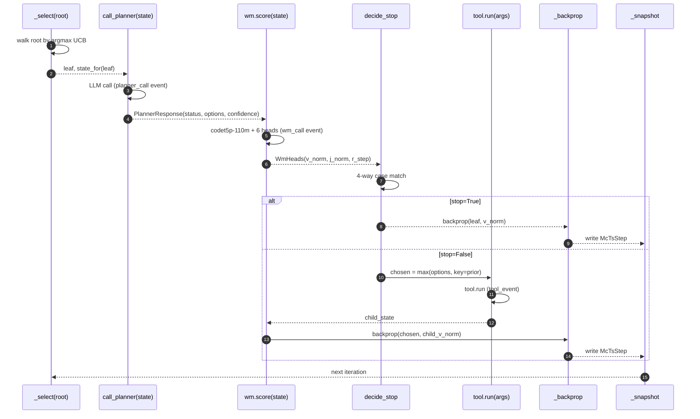
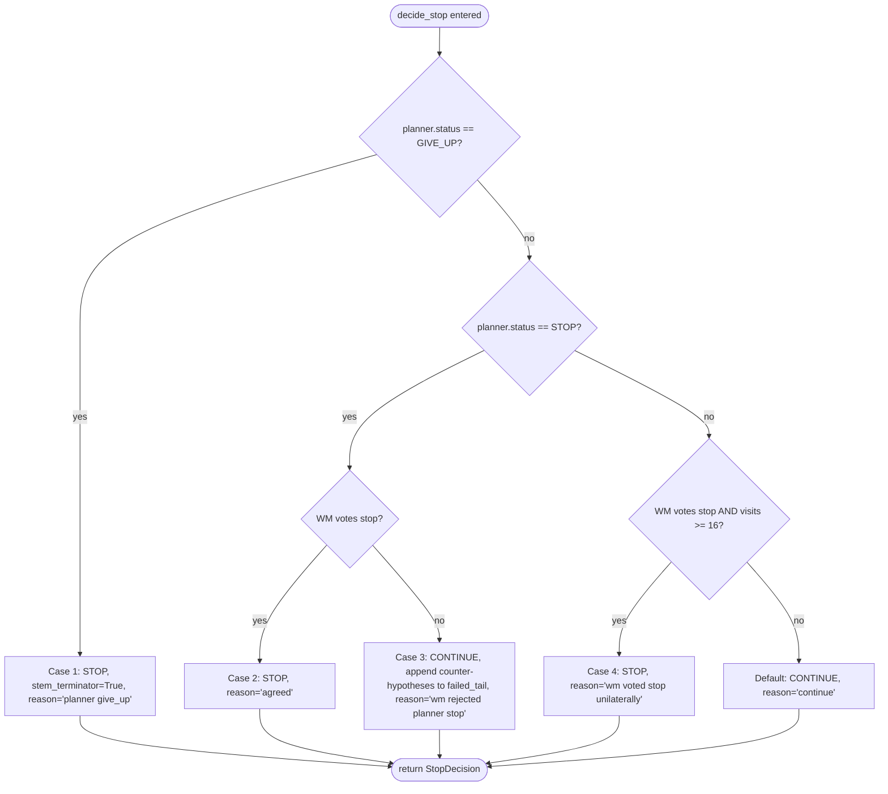

## 1. Identity

Perseus IS MuZero. Not "retrieval with optional planner." Not "tool-use agent with a value head bolted on." The system is, by construction, an instantiation of the MuZero training loop where the environment is a code repository, the actions are retrieval tools, and the terminal reward is whether a downstream patch lands.

This is settled in ADR-012 at `/Users/sam/code/perseus/docs/adr/012-perseus-is-muzero.md`. The short version: MCTS + a learned world model + multi-head training is the canonical loop. Everything else — the HTTP API, the index build path, the dashboard — is plumbing.

Three things flow out of taking the identity seriously:

1. **The planner is one signal among many.** It writes priors over actions and proposes a stop label. The WM heads also write priors, also vote on stop. UCB1 selects across both. Neither side is allowed to terminate the search alone in the consensus case (see Section 5).
2. **MCTS snapshots are not telemetry.** The per-step visit distribution $\pi^M_t$ at the root is the policy training target. If you stop recording it, you cannot train the policy head. If you record it inconsistently, the policy head trains on noise. The schema migration `007_mcts_step_snapshots.sql` that introduced this column on 2026-04-23 is therefore not a "nice to have" — it is the training loop's load-bearing data contract.
3. **The 17 tools are not a heuristic toolbox.** They are the discrete action space the policy maps over. Folding the four codeshape tools into one because their combined V2 usage was 0.26% would shrink the action space the policy learns over and silently change the math. ADR-012 settles this: keep all 17, let the policy learn the usage frequencies.

The rest of this essay walks the loop top-to-bottom: state, actions, MCTS, two-vote stop, snapshotting, lifecycle, and the math.

## 2. State $s_t$

The state object is the `SearchState` dataclass at `perseus/core/state.py`. It is what the planner sees, what the WM scores, and what gets serialized into the parquet row when we train.

Fields, grouped by purpose:

**Query identity**
- `query: str` — the verbatim user query
- `index_id: str` — UUID of the index this query runs against

**Branch context** (`branch: BranchContext`)
- `node_id` — MCTS node identity
- `depth` — distance from root
- `parent_id` — parent node identity (None at root)
- `lineage: list[BranchObservation]` — the (tool, args, outcome_score, n_hits, top_paths) tuples observed walking root→leaf
- `branch_evidence: list[Hit]` — hits the current stem has accumulated
- `failed_tail: list[str]` — counter-hypotheses appended after rejected stops

**Cross-stem aggregation**
- `aggregated_hits: list[Hit]` — top hits across the whole tree
- `coverage_paths: int` — distinct file paths covered
- `coverage_dirs: int` — distinct directories covered
- `line_bearing_hits: int` — hits with concrete line spans (not just file-level)

**Budget snapshot**
- `visits_used: int` — root visits so far
- `max_visits: int` — visit budget for this query
- `elapsed_ms: float` — wall-clock since `run_mcts` started

**WM-written fields**
- `wm_value_norm: float` — value head, normalized to $[0, 1]$
- `wm_judge_value_norm: float` — judge head (will a judge call this state "answered")
- `wm_step_reward_norm: float` — last-step reward in normalized form

Per-call state size lands at roughly 2–5 KB of JSON for a typical query. This is small enough that we serialize it into the planner LLM prompt verbatim (no compression, no summarization), and small enough that the parquet exporter can keep the full state per step without blowing up disk.

The WM-written fields are populated by `wm.score(state)` after planner expansion and before the stop decision. They live on the state, not on a side channel, because the stop function reads them. See `perseus/core/planner/mcts.py:194-196`:

```python
st.wm_value_norm = wm_heads.value_norm
st.wm_judge_value_norm = wm_heads.judge_value_norm
st.wm_step_reward_norm = wm_heads.step_reward_norm
```

That line is the WM-in-the-loop closure point. Before that assignment, the state was a pure description of where MCTS is; after, it carries the WM's verdict on where MCTS should go next.

### 2.1 Why the state is per-node, not per-query

A common source of confusion in MuZero implementations is whether the "state" is the input to the dynamics model (`s_{t+1} = g(s_t, a_t)`) or the input to the prediction model (`p(s_t), v(s_t) = f(s_t)`). In Perseus they are the same object — `SearchState` — and we construct a fresh one for every node we hand to the planner or the WM. The function `state_for(node)` at `perseus/core/planner/mcts.py:129-164` walks the node's ancestry to build the `lineage`, copies the cross-stem `aggregated_hits` from the shared `HitAggregator`, and stamps the current budget snapshot.

This per-node construction is cheap (a few hundred microseconds, dominated by the lineage walk) and means we never have to maintain a "current state" mutation invariant across the loop. The state is a value, not a reference. Each `_select` → `state_for(leaf)` → `call_planner` → `wm.score` chain is purely functional in the state itself; the only mutable structure is the tree.

The trade-off: state size scales with depth. A 50-visit query with a 10-deep branch carries 10 `BranchObservation` entries in `lineage`, each ~200 bytes serialized. That's still well under our 5 KB upper bound, but it's why the lineage entries strip down to `(step, tool, args, outcome_score, n_hits, top_paths[:3])` rather than carrying the full evidence packet for every ancestor.

## 3. The 17-action space

The action space is fixed and discrete. The planner picks from these; the policy head trains on the visit distribution over these. They are grouped by family in `perseus/core/actions.py`:

**Search family (4)**
- `hybrid_search` — dense + sparse joint scoring, the default exploratory entry point
- `dense_search` — semantic-only, codet5p embeddings + ANN
- `sparse_search` — BM25/sparse, lexical signal
- `path_search` — search by filename/path patterns

**Files family (4)**
- `open_file` — read a path
- `snippet_extract` — pull a specific line span
- `sibling_scan` — list neighbors of a file
- `test_locator` — find tests adjacent to a source path

**Patterns family (4)**
- `search_text` — literal regex/string scan
- `error_signature_match` — match an error string to known traces
- `diff_pattern_scan` — find patches matching a shape
- `broad_scan` — wide net for exploratory hits

**Codeshape family (4)**
- `symbol_lookup` — find a symbol definition
- `references_lookup` — find references to a symbol
- `callgraph_neighbors` — walk the callgraph
- `dependency_neighbors` — walk import/include edges

**Terminal (1)**
- `give_up` — stem-local terminator; the planner's escape hatch for a dead branch

Each tool carries a `SPECIFICITY` weight in $[0, 1]$ used as the LLM-prior fallback when the planner does not write a `prior_hint`. Specificity is roughly: how much does running this tool tell you per unit cost. `symbol_lookup` is high (0.85), `broad_scan` is low (0.2), `give_up` is exactly 1.0 because it's a non-information action whose UCB score should be the planner's confidence directly.

ADR-012 settled the "should we merge the four codeshape tools" debate. Codeshape's combined V2 usage was 0.26%. The argument for merging was bandwidth: smaller action space, faster policy convergence. The counter-argument (which won) was: a 17-way categorical is not the bottleneck on a 110M-parameter policy head; the policy head will learn to give codeshape near-zero mass on most queries by itself; merging tools loses information because the four codeshape tools have different per-hit interpretations (symbol vs reference vs callgraph vs dependency) that we want available when the rare codeshape-relevant query comes through. Keep the 17. Let the policy learn the frequencies.

## 4. The MCTS loop

The loop is in `perseus/core/planner/mcts.py`. One `_Node` per tree node, one `run_mcts` function, no inheritance, no plugin hooks. The four standard MCTS phases are open-coded in sequence inside `while root.visits < s.mcts_max_visits`.

### 4.1 Selection (UCB1)

Walk from root by argmax UCB until you hit a leaf. The UCB1 formula:

$$\text{UCB}(s, a) = Q(s, a) + c \cdot P(a) \cdot \frac{\sqrt{N(s) + 1}}{1 + N(s, a)}$$

with $c = 2.2$ (set in `Settings.mcts_ucb_c`, raised from the original 0.9 → 1.5 → 2.2 over the 2026-04-25 depth tuning sweep — see `Claude.md` "Last Updated" 2026-04-25). $Q(s, a)$ is the running mean of value backed up through this child; $P(a)$ is the blended prior; $N(s)$ is parent visits; $N(s, a)$ is this child's visits.

The implementation is verbatim a one-liner — `perseus/core/planner/mcts.py:63-66`:

```python
def _ucb(child: _Node, parent: _Node, c: float) -> float:
    if child.terminal:
        return -math.inf
    return child.q() + c * child.prior * math.sqrt(parent.visits + 1) / (1 + child.visits)
```

Terminal children are returned `-inf` so the descent never picks them. Selection itself is at `perseus/core/planner/mcts.py:69-73`:

```python
def _select(root: _Node, c: float) -> _Node:
    n = root
    while n.children and not n.terminal:
        n = max(n.children, key=lambda x: _ucb(x, n, c))
    return n
```

There is no flat frontier, no priority queue, no rollout policy. Re-selection from root each iteration is the price of admission to a real MCTS — it lets the tree decide on each iteration where the most under-explored high-prior leaf lives, instead of greedily extending one stem.

### 4.2 Expansion + prior blend

When `_select` returns a leaf, we ask the planner LLM for `options` (zero or more proposed next-step `ToolCall` values). Each option's final prior is a convex combination of the LLM's prior and the WM's prior — `perseus/core/wm/blend.py:5-10`:

```python
def blend_prior(*, llm_prior: float, wm_prior: float, alpha: float) -> float:
    if not 0.0 <= alpha <= 1.0:
        raise ValueError(f"alpha must be in [0, 1], got {alpha}")
    llm_prior = max(0.0, min(1.0, llm_prior))
    wm_prior = max(0.0, min(1.0, wm_prior))
    return (1.0 - alpha) * llm_prior + alpha * wm_prior
```

Math form:

$$P(a) = (1 - \alpha) \cdot P_\text{llm}(a) + \alpha \cdot P_\text{wm}(a)$$

The default $\alpha = 0.3$ in `Settings.wm_prior_weight`. The history of this value is its own essay (see [wm in the loop](/essays/wm-in-the-loop/)): we shipped at $0.3$, raised to $0.9$ once `wm_v4_random_split` reported val_r2 = 0.997, then HISTORY/28 audit established that R² was row-split leakage, and the 2026-05-18 emergency revert took $\alpha$ to $0.0$ pending an instance-split retrain. Until v4_instance_split deploys, the WM probes still fire (telemetry is intact) but contribute zero to selection.

If the planner returns zero options, the leaf is marked terminal with reason `"no options"` and the WM value is backed up — the planner is telling us this stem is exhausted. See `perseus/core/planner/mcts.py:222-227`.

### 4.3 Rollout

There is no traditional rollout (no random simulation). We pick the highest-prior new child and actually execute its tool — `perseus/core/planner/mcts.py:246-263`:

```python
chosen = max(leaf.children, key=lambda c: c.prior)
if chosen.action is None:
    raise PerseusValidationError("expansion produced child with no action")

t_tool = time.perf_counter()
tool = reg.get(chosen.action.tool)
evidence = await tool.run(chosen.action, repo_root=repo_root, index_id=str(index_id))
chosen.branch_hits = list(evidence.hits)
agg.merge(chosen.id, chosen.action.tool, evidence.outcome_score, evidence.hits)
```

The tool returns a `ToolEvidence` carrying `hits: list[Hit]` and an `outcome_score`. Hits merge into the cross-stem `HitAggregator` — that's how the `aggregated_hits` field on the state gets populated. Then we re-score the child's new state with the WM and back that value up the tree.

Calling this a "rollout" is generous; it is more accurately "expansion followed by one real action and one bootstrapped value estimate". MuZero proper does the same thing — the WM's value head replaces the leaf evaluation that AlphaGo Zero used a neural-net rollout for.

### 4.4 Backprop

Walk parent → root, accumulating value and incrementing visits. Pure additive, no discount. `perseus/core/planner/mcts.py:76-80`:

```python
def _backprop(node: _Node | None, value: float) -> None:
    while node is not None:
        node.visits += 1
        node.value_sum += value
        node = node.parent
```

Why no discount: a single query is short (low single-digit depth on average, hard cap ~50 visits per query), and the per-step reward shaping is already small relative to the terminal value. A discount factor here would buy us nothing and break the interpretability of $Q(s, a)$ as "mean WM value of leaves reachable from this child."

## 5. The two-vote stop

The most consequential design decision in the loop is also the smallest piece of code. Every iteration, after expansion and WM scoring but before rollout, `decide_stop` runs — `perseus/core/planner/stop.py:23-61`:

```python
def decide_stop(
    planner: PlannerResponse, wm: WmHeads, state: SearchState,
    *, settings: Settings | None = None,
) -> StopDecision:
    s = settings or load_settings()

    if planner.status is PlannerStatus.GIVE_UP:
        return StopDecision(
            stop=True,
            stem_terminator=True,
            reason="planner give_up",
            counter_hypotheses=_counter_hypotheses(wm, s),
        )

    planner_proposes_stop = planner.status is PlannerStatus.STOP

    wm_votes_stop = (
        wm.value_norm >= s.stop_v_threshold
        and wm.judge_value_norm >= s.stop_j_threshold
        and wm.step_reward_norm >= 0.0
    )

    if planner_proposes_stop and wm_votes_stop:
        return StopDecision(stop=True, stem_terminator=False, reason="agreed")
    if planner_proposes_stop and not wm_votes_stop:
        return StopDecision(
            stop=False,
            stem_terminator=False,
            reason="wm rejected planner stop",
            counter_hypotheses=_counter_hypotheses(wm, s),
        )
    if (
        not planner_proposes_stop
        and wm_votes_stop
        and state.visits_used >= s.stop_min_wm_override_visits
    ):
        return StopDecision(stop=True, stem_terminator=False, reason="wm voted stop unilaterally")

    return StopDecision(stop=False, stem_terminator=False, reason="continue")
```

The WM vote is a conjunction of three thresholds:

$$\text{wm\_votes\_stop} \iff v_\text{norm} \geq \theta_v \;\wedge\; j_\text{norm} \geq \theta_j \;\wedge\; r_\text{step norm} \geq 0$$

with defaults $\theta_v = 0.55$, $\theta_j = 0.55$, and $r_\text{step norm} \geq 0$ (the step-reward floor is at zero because the head is centered around zero by training construction; we want last-step-was-not-actively-bad, not last-step-was-great).

The four cases:

**Case 1 — Planner gives up.** Always honored. `stem_terminator=True` means only the current stem terminates, not the whole query. `give_up` is the planner's structured escape hatch when it can see this branch is dead; we trust it because the planner has the full lineage and `failed_tail` context to judge the stem.

**Case 2 — Planner stops, WM agrees.** Stop with reason `"agreed"`. This is the consensus path: both signals say "we have enough." `stem_terminator=False` because an agreed stop with strong WM scores is a candidate global terminator (the outer loop handles whether the *whole query* stops or just this stem).

**Case 3 — Planner stops, WM disagrees.** Continue with reason `"wm rejected planner stop"`. The planner's stop is rejected and counter-hypotheses are appended to this stem's `failed_tail`. The counter-hypothesis text comes from `_counter_hypotheses(wm, s)` and names which WM head fired — e.g. `"WM judge head 0.41 < 0.55: answer unlikely to pass a judge"`. The next planner call on this stem sees the counter-hypothesis in its prompt and gets a chance to revise.

**Case 4 — Planner continues, WM votes stop, visits ≥ 16.** Stop with reason `"wm voted stop unilaterally"`. The WM unilateral override exists for the case where the planner is over-eagerly expanding (LLM models love to take more actions) but the WM is confident we've already accumulated enough evidence. The `visits_used >= 16` floor (set in `Settings.stop_min_wm_override_visits`) prevents the WM from terminating queries before MCTS has explored at all — early stops on under-explored trees are the worst kind of false confidence.

The default fall-through is continue. Stops have to actually defend themselves.

History worth knowing: before 2026-04-25, stops were either "planner says so" (with no WM check) or the global confirm-stop adversarial pass at the end of the query. The per-stem two-vote was introduced in the 2026-04-25 "Per-stem confirm_stop" change (see Claude.md, that date's entry). The combined effect of (a) UCB-C 1.5 → 2.2, (b) self-calibrated planner stop instructions, and (c) per-stem WM vote was the depth tuning that pushed average query depth from ~3 to ~7 without blowing up latency.

## 6. The per-step snapshot

Every iteration of the MCTS loop, after backprop and before the next selection, we snapshot the root's children — `perseus/core/planner/mcts.py:83-96`:

```python
def _snapshot(step: int, root: _Node, ts_ms: float, chosen: str | None) -> McTsStep:
    children = [
        {
            "tool": c.action.tool.value if c.action else "(root)",
            "visits": c.visits,
            "q": c.q(),
            "prior": c.prior,
            "terminal": c.terminal,
        }
        for c in root.children
    ]
    return McTsStep(
        step=step, root_visits=root.visits, chosen_action=chosen, children=children,
    )
```

This `McTsStep` flows out via the `on_snapshot` callback (typically wired to the SSE event bus and the Postgres `mcts_step_snapshots` writer). The schema is migration `007_mcts_step_snapshots.sql` (Claude.md "Last Updated" 2026-04-23):

```
mcts_step_snapshots(
    run_id UUID,
    step INTEGER,
    ts_ms BIGINT,
    root_visits INTEGER,
    children JSONB,
    chosen_action_index INTEGER,
    PRIMARY KEY (run_id, step)
)
```

The reason this snapshot has to fire *every* iteration, not just at terminal, is the policy training target. The MuZero policy head learns:

$$\pi^M_t(a) = \frac{N(s_t, a)}{N(s_t)}$$

That is, the policy target for the state at MCTS iteration $t$ is the *current* visit distribution at the root after $t$ iterations. If you snapshot only at the end, you have one $\pi^M$ for the whole search; if you snapshot every iteration, you have $T$ training targets per query, each with the partial visit distribution observed up to that point. The exporter at `src/muzero/export.rs` (now 23-column vt2 schema — Claude.md "Last Updated" 2026-04-23 muzero-export entry, updated 2026-05-18) joins these snapshots into the per-trajectory parquet rows.

Before migration 007 landed, the muzero-export rows had empty `visit_distribution` (see Claude.md 2026-04-25 "Multi-bench ↔ perseus trajectory linkage" — that was a different cause, but related symptom). Per-step snapshots fix the data-availability side; the trajectory linkage fix wires the multi-bench `run_id` to perseus `external_session_id` so the exporter can find the snapshots at all.

## 7. Query lifecycle in 9 timesteps

A `POST /v1/query` walks through nine distinct phases. Each is observable in the trace.

- **t=0** — `POST /v1/query` arrives at `perseus/core/server.py`. Headers checked for `X-External-Session-Id`. Body parsed into `QueryRequest`.
- **t=1** — Insert into the `runs` table with status `pending`. `run_id` minted (UUID v7). Postgres `runs` row is the durable identity for everything that follows.
- **t=2** — Index lookup: fetch `IndexState` for `index_id` from the `indices` table. If status != `ready`, fast-fail with a structured error (don't run MCTS against a half-built index).
- **t=3** — Event bus setup: open the SSE queue for this `run_id`, register `on_event` and `on_snapshot` callbacks that fan out to (a) the Postgres writer tasks for `planner_events` / `wm_events` / `tool_events` / `mcts_step_snapshots`, (b) the SSE subscriber if one is attached.
- **t=4** — `run_mcts` invoked. The whole loop in Section 4 runs here. Hot path; per-iteration latency dominated by planner LLM call (~hundreds of ms) and WM call (~tens of ms cached).
- **t=5** — Loop termination. Either `root.visits >= mcts_max_visits`, all root children terminal, or the leaf returned terminal on entry. `SearchOutput` constructed.
- **t=6** — Aggregator finalize: `agg.top_hits(s.default_top_k)` returns the cross-stem top-K. Hits are deduped by `(path, line_start, line_end)`, sorted by score, optionally reranked by the cross-encoder if `PERSEUS_RETRIEVAL_RERANK=1`.
- **t=7** — Persist completion: update the `runs` row to `status='done'`, write the trace record into `query_traces` (with `policy_fingerprint`, `retrieval_index_revision`, full diagnostics blob). Close the event bus.
- **t=8** — Return `QueryResponse` over HTTP. Status code 200, body carries `run_id` + `hits` + `diagnostics`.
- **t=9** — SSE subscriber side (`/v1/events/{run_id}`): a separate request can attach to the event bus and stream `planner_call`, `wm_call`, `tool_event`, `mcts_step` events until the bus closes. This is the dashboard's data source.

The reason these are nine separate timesteps and not "one request" is observability. Every transition writes to a table; every table is queryable; every query can be reconstructed from the tables post-hoc. The 2026-04-23 "observability-persistence branch" (Claude.md, that date) made this durable — before that, traces only lived in an in-memory ring buffer and were lost on restart.

See `/Users/sam/code/perseus/parking_lot/v2_archive_2026-05-18/HISTORY/53_query_lifecycle.md` for the full breakdown of which tables get written at which timestep and how the SSE subscriber catches up if it attaches mid-query.

## 8. The math, in one place

**UCB1 selection**

$$\text{UCB}(s, a) = Q(s, a) + c \cdot P(a) \cdot \frac{\sqrt{N(s) + 1}}{1 + N(s, a)}, \quad c = 2.2$$

with $Q(s, a) = \frac{1}{N(s, a)} \sum_{i=1}^{N(s,a)} v_i$ the running mean of values backed up through the child.

**Prior blend at expansion**

$$P(a) = (1 - \alpha) \cdot P_\text{llm}(a) + \alpha \cdot P_\text{wm}(a), \quad \alpha \in [0, 1]$$

with $\alpha = 0.3$ default (currently 0.0 on production pending the v4_instance_split deploy).

**Per-step policy training target**

$$\pi^M_t(a) = \frac{N(s_t, a)}{N(s_t)}$$

where $N(s_t, a)$ is the visit count of root child taking action $a$ after $t$ MCTS iterations, and $N(s_t) = \sum_a N(s_t, a)$.

**Policy head loss (cross-entropy against the MCTS visit target)**

$$\mathcal{L}_\pi = -\sum_a \pi^M_t(a) \log \pi_\theta(a \mid s_t)$$

with $\pi_\theta(a \mid s_t)$ the policy head's softmax over the 17-action space. Note the asymmetry: the target $\pi^M$ is computed by MCTS at training-data-generation time (months ago, on engram during a sweep), the prediction $\pi_\theta$ comes from the WM head at training time (now, on GPU). This is the MuZero loss in code; see [wm training sweep](/essays/wm-training-sweep/) for the full multi-head loss and the per-head weights.

**Value head target**

$$v^M_t = r_t + \gamma \cdot v_{t+1}$$

with $\gamma = 1$ (no discount, see Section 4.4) and the terminal $v_T$ set from the harness verdict (judge_label ∈ {0, 0.5, 1} mapped to $\{-1, 0, +1\}$ — Claude.md 2026-05-11 audit entry).

**Two-vote stop condition (Case 2 — agreed stop)**

$$\text{stop} \iff \text{planner.status} = \text{STOP} \;\wedge\; v_\text{norm} \geq \theta_v \;\wedge\; j_\text{norm} \geq \theta_j \;\wedge\; r_\text{step norm} \geq 0$$

with $\theta_v = \theta_j = 0.55$.

## 9. Two diagrams

### 9.1 One MCTS iteration



### 9.2 Two-vote stop, four cases



The four labeled cases correspond exactly to the four `return StopDecision(...)` exits in `decide_stop`. The default fall-through at the bottom (`return StopDecision(stop=False, stem_terminator=False, reason="continue")` at `perseus/core/planner/stop.py:61`) is "continue" — the system biases toward more search when the signals don't align.

## 10. Code excerpts, verbatim

These three excerpts are reproduced from `perseus/core/` for the reader who wants to grep them.

**UCB1 (perseus/core/planner/mcts.py:63-66):**

```python
def _ucb(child: _Node, parent: _Node, c: float) -> float:
    if child.terminal:
        return -math.inf
    return child.q() + c * child.prior * math.sqrt(parent.visits + 1) / (1 + child.visits)
```

**Stop decision core (perseus/core/planner/stop.py:37-61):**

```python
planner_proposes_stop = planner.status is PlannerStatus.STOP

wm_votes_stop = (
    wm.value_norm >= s.stop_v_threshold
    and wm.judge_value_norm >= s.stop_j_threshold
    and wm.step_reward_norm >= 0.0
)

if planner_proposes_stop and wm_votes_stop:
    return StopDecision(stop=True, stem_terminator=False, reason="agreed")
if planner_proposes_stop and not wm_votes_stop:
    return StopDecision(
        stop=False,
        stem_terminator=False,
        reason="wm rejected planner stop",
        counter_hypotheses=_counter_hypotheses(wm, s),
    )
if (
    not planner_proposes_stop
    and wm_votes_stop
    and state.visits_used >= s.stop_min_wm_override_visits
):
    return StopDecision(stop=True, stem_terminator=False, reason="wm voted stop unilaterally")

return StopDecision(stop=False, stem_terminator=False, reason="continue")
```

**Prior blend (perseus/core/wm/blend.py:5-10):**

```python
def blend_prior(*, llm_prior: float, wm_prior: float, alpha: float) -> float:
    if not 0.0 <= alpha <= 1.0:
        raise ValueError(f"alpha must be in [0, 1], got {alpha}")
    llm_prior = max(0.0, min(1.0, llm_prior))
    wm_prior = max(0.0, min(1.0, wm_prior))
    return (1.0 - alpha) * llm_prior + alpha * wm_prior
```

Three small functions. The whole identity claim of Section 1 — Perseus IS MuZero — reduces in code to these three blocks plus the snapshot writer and the per-step backprop. The rest is plumbing: HTTP handlers, Postgres writers, SSE fan-out, parquet exporters, dashboards. Necessary plumbing. But not the loop.

## 11. Cross-links

- [wm heads decoding](/essays/wm-heads-decoding/) — what the WM's six output heads actually predict and how `value_norm` / `judge_value_norm` / `step_reward_norm` are computed from the 51-bin HL-Gauss outputs.
- [planner llm call](/essays/planner-llm-call/) — the planner prompt structure (stable-prefix layout for vLLM cache hits), JSON-mode contract, repair retries, and the per-stem confirm-stop adversarial pass.
- [wm training sweep](/essays/wm-training-sweep/) — the multi-head loss with weights, the v1→v4 chain, the leakage discovery, and the instance-split retrain plan.
- [wm in the loop](/essays/wm-in-the-loop/) — the $\alpha$ history (0.3 → 0.9 → 0.0), the fail-open semantics, and the WM-serve uvicorn deployment on cato.
- [the reset](/essays/the-reset/) — why the Rust v1 was archived and what the Python v2 keeps vs throws out. Companion piece to ADR-012.

## Sources

- `/Users/sam/code/perseus/perseus/core/planner/mcts.py` — the loop itself (`_ucb`, `_select`, `_backprop`, `_snapshot`, `run_mcts`)
- `/Users/sam/code/perseus/perseus/core/planner/stop.py` — `decide_stop` and `_counter_hypotheses`
- `/Users/sam/code/perseus/perseus/core/planner/llm.py` — `call_planner`, `PlannerResponse`, `PlannerStatus`
- `/Users/sam/code/perseus/perseus/core/wm/blend.py` — `blend_prior`
- `/Users/sam/code/perseus/perseus/core/wm/heads.py` — `WmHeads` dataclass, `policy_prior_for`
- `/Users/sam/code/perseus/perseus/core/wm/client.py` — `WmClient.score`, the HTTP client to `wm-serve`
- `/Users/sam/code/perseus/perseus/core/state.py` — `SearchState`, `BranchContext`, `BranchObservation`
- `/Users/sam/code/perseus/perseus/core/actions.py` — the 17 `ToolCall` actions, `SPECIFICITY` weights, `ToolRegistry`, `default_registry`
- `/Users/sam/code/perseus/docs/adr/012-perseus-is-muzero.md` — the identity ADR
- `Claude.md` "Last Updated" entries:
  - 2026-04-22 — MCTS refactor (UCB + backprop + branch-local stop)
  - 2026-04-23 — per-step MCTS snapshot capture (migration 007)
  - 2026-04-25 — depth tuning (UCB-C 2.2, self-calibrated stop, per-stem confirm_stop)
  - 2026-05-10 — WM-in-the-loop closure (RL pipeline live)
- `/Users/sam/code/perseus/parking_lot/v2_archive_2026-05-18/HISTORY/31_mcts_research.md` — MCTS design notes from the v1→v2 transition
- `/Users/sam/code/perseus/parking_lot/v2_archive_2026-05-18/HISTORY/28_muzero_wm_research.md` — the leakage audit that drove $\alpha$ to 0
- `/Users/sam/code/perseus/parking_lot/v2_archive_2026-05-18/HISTORY/53_query_lifecycle.md` — the nine-timestep walk-through

## Last updated

2026-05-18
