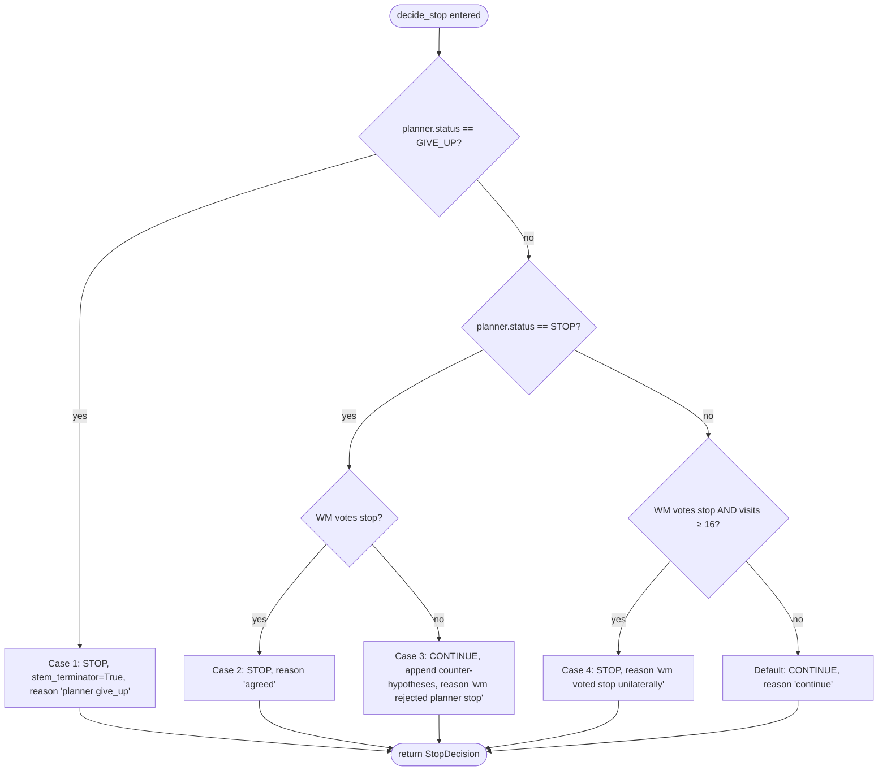
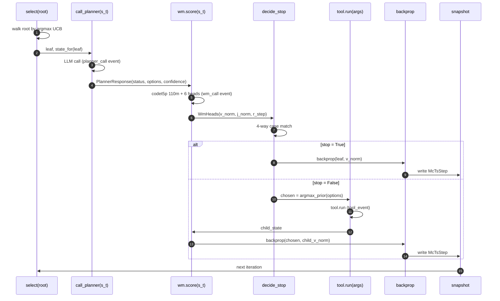
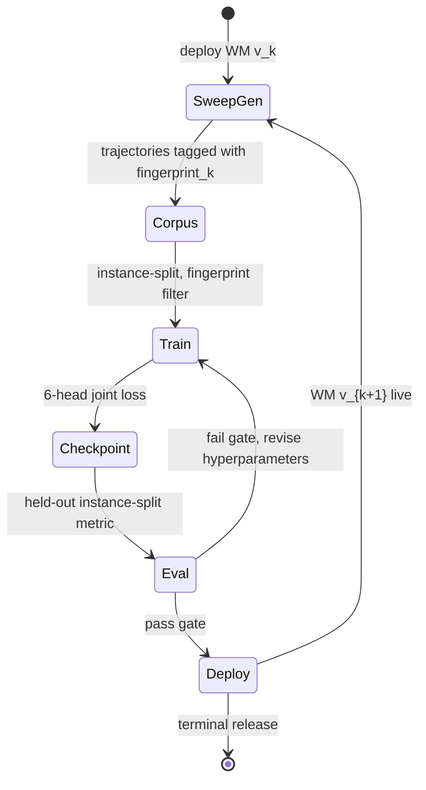

## 1. Thesis

Perseus is an instantiation of MuZero. The environment is a code repository, the actions are retrieval tools, the per-step rewards are shaping signals over evidence quality, and the terminal reward is whether a downstream patch lands. Everything else, the HTTP API, the index build path, the dashboard, is plumbing in service of that loop.

Taking this identity seriously forces three commitments. First, the planner is one signal of two: the language model writes priors over actions and proposes a stop label, but the world model writes its own priors and casts its own vote on stopping, and neither side is permitted to terminate search alone in the consensus case. Second, per-iteration root-visit snapshots are not telemetry. They are the policy training target, and recording them inconsistently means the policy head trains on noise. Third, the seventeen retrieval tools are not a heuristic toolbox; they are the discrete action space the policy maps over, and collapsing them by usage frequency would silently change the math the policy is fit to.

This essay walks the loop end to end: the per-node state vector $s_t$, the action set $\mathcal{A}$ with $|\mathcal{A}|=17$, the MCTS variant we run, the two-vote stop function, the snapshot writer, the request lifecycle, and the loss math that closes the training loop. ADR-012 settles the identity claim at the architecture level; this essay is its operational expansion.

## 2. State $s_t$

The state is a per-node value object constructed fresh on every selection. It carries five field groups.

1. **Query identity** pins the verbatim user query string and the UUID of the retrieval index this query is bound to. Both are constant for the lifetime of a single `/v1/query` call.
2. **Branch context** carries the leaf's node identity, its depth from root, its parent identity, and the lineage of `BranchObservation` tuples observed walking root to leaf. Each observation strips down to step number, tool taken, arguments, outcome score, hit count, and the top three file paths returned. The branch also carries the hits the current stem has accumulated and a `failed_tail` list of counter-hypotheses appended after the world model has rejected a planner-proposed stop.
3. **Cross-stem aggregation** carries the top hits across the whole tree, deduplicated by `(path, line_start, line_end)`, plus the count of distinct file paths covered, the count of distinct directories covered, and the count of hits that carry concrete line spans rather than just file-level evidence.
4. **Budget snapshot** carries the root visit count, the per-query visit budget, and the wall-clock milliseconds elapsed since the loop started.
5. **World-model-written fields** carry the normalized value $v_\text{norm} \in [0,1]$, the normalized judge value $j_\text{norm} \in [0,1]$, and the normalized last-step reward $r_\text{step,norm}$. These three fields are written by the world model after expansion and before the stop decision; the stop function reads them.

Per-call state size sits at roughly 2 to 5 KB of canonical JSON. This is small enough that we serialize the whole state into the planner prompt verbatim, with no compression or summarization, and small enough that the parquet exporter retains a full state per step without disk pressure.

The world-model fields live on the state object rather than on a side channel. This is deliberate: the stop function consumes them, the snapshot writer reads them, and the prompt builder can surface the world model's verdict to the planner on the next turn. Locating them on the state means we never maintain a "current world-model verdict" mutation invariant outside the state.

### 2.1 Serialization contract

The state is serialized to canonical JSON in three places: as the user message body in the planner prompt, as the input to the world-model encoder, and as the state column in the per-trajectory parquet row. All three uses share the same serializer, with the same field ordering, the same nested-object normalization, and the same numeric precision. This invariance is load-bearing for two reasons.

First, the planner prompt is the high-traffic surface, and stable serialization means the prompt's static prefix (system message plus tool catalogue plus few-shot examples) remains byte-identical across calls, which means the inference-server prefix cache hits consistently. A single drift in field ordering would partially invalidate the cache and inflate per-call latency by an order of magnitude.

Second, the world-model encoder is trained on serialized states that match what the loop produces at inference time. If the loop's serializer drifts from the exporter's serializer, the world model is fit to a different distribution than the one it is queried on, and the resulting predictions degrade silently. The 2026-04-25 policy-fingerprint addition captures the serialization version implicitly through the git commit hash; a serializer change shows up as a fingerprint change and the cohort filter excludes pre-change rows from the next training run.

### 2.2 Per-node, not per-query

A common ambiguity in MuZero implementations is whether the state object feeds the dynamics function $g(s_t, a_t) \mapsto s_{t+1}$ or the prediction function $f(s_t) \mapsto (p_t, v_t)$. In Perseus the same object feeds both, and we construct a fresh state per node by walking ancestry to build the lineage, copying cross-stem aggregated hits from a shared aggregator, and stamping the budget snapshot.

This per-node construction costs a few hundred microseconds, dominated by the lineage walk. The benefit is purely functional state: the chain from selection through state construction, planner call, world-model scoring, and stop decision never mutates a shared state object. The only mutable structure is the tree.

The trade-off is that state size grows linearly with depth. A 50-visit query with a depth-10 branch carries 10 lineage entries at roughly 200 bytes each, well under the 5 KB upper bound. The stripped-down lineage format, step plus tool plus arguments plus outcome plus hits plus top three paths, exists precisely to prevent the carried-evidence packet from compounding across depth.

## 3. The 17-action space

The action set is fixed and discrete. The planner picks from it, the policy head trains over the visit distribution on it, and the world model can be queried for a per-action prior across it. Grouping is editorial; the policy head sees a flat 17-way categorical.

1. **Search family (4):** hybrid (dense plus sparse joint scoring, the default exploratory entry), dense (semantic only, codet5p embeddings plus approximate nearest neighbors), sparse (BM25 lexical), and path (filename and path patterns).
2. **Files family (4):** open file, snippet extract, sibling scan, and test locator.
3. **Patterns family (4):** literal regex search, error-signature match, diff-pattern scan, and broad scan.
4. **Codeshape family (4):** symbol lookup, references lookup, callgraph neighbors, and dependency neighbors.
5. **Terminal (1):** give up, the stem-local terminator the planner uses when it can see a branch is dead.

Each tool carries a specificity weight in $[0, 1]$ used as the language-model prior fallback when the planner does not write an explicit `prior_hint`. Specificity is roughly how much running the tool tells you per unit cost: symbol lookup is high (0.85), broad scan is low (0.2), and give up is exactly 1.0 because it is a non-information action whose selection score should equal the planner's confidence directly.

The codeshape merger debate, settled by ADR-012, illustrates why action-space stability matters. Combined codeshape usage in the v2 corpus was 0.26 percent. The argument for merging the four codeshape tools was bandwidth: a smaller action space should give faster policy convergence. The counter-argument that won is that a 17-way categorical is not a bottleneck on a 110M-parameter policy head, the policy will learn to give codeshape near-zero mass on most queries by itself, and merging would lose the per-hit interpretation gap between symbol, reference, callgraph, and dependency queries. Keep the 17. Let the policy learn the frequencies.

## 4. The MCTS loop

The loop maintains one node per tree node, runs one outer iteration loop bounded by either visit budget or all-children-terminal, and open-codes the four standard MCTS phases in sequence. There is no inheritance, no plugin hooks, and no abstraction layer between the loop and the planner or world model.

### 4.1 Selection

We descend from the root each iteration by argmax UCB1 until we hit a leaf:

$$\text{UCB}(s, a) = Q(s, a) + c \cdot P(a) \cdot \frac{\sqrt{N(s) + 1}}{1 + N(s, a)}, \quad c = 2.2$$

Here $Q(s,a)$ is the running mean of values backed up through the child, $P(a)$ is the blended prior from Section 4.2, $N(s)$ is parent visits, and $N(s, a)$ is the child visit count. The exploration constant traveled from an initial 0.9 to 1.5 to its current 2.2 over the 2026-04-25 depth tuning sweep; the increase was the load-bearing change in pushing average query depth from roughly three to roughly seven.

Terminal children return $-\infty$ for their UCB score, so descent never selects them. Selection itself is a tight loop: starting from root, repeatedly take the argmax-UCB child until we hit a node with no children or with the terminal flag set. There is no flat frontier, no priority queue, and no rollout policy. Re-selecting from root each iteration is the cost of admission to a real MCTS, and it lets the tree decide on every iteration where the most under-explored high-prior leaf actually sits, rather than greedily extending one stem.

### 4.2 Expansion and prior blend

When selection returns a leaf, we ask the planner for zero or more proposed next-step tool calls. Each option carries a language-model prior, either supplied by the planner directly or defaulted to the tool's specificity weight. Each option also picks up a world-model prior from the world-model heads. The final prior used by UCB on the new child is a convex combination:

$$P(a) = (1 - \alpha) \cdot P_\text{llm}(a) + \alpha \cdot P_\text{wm}(a), \quad \alpha \in [0, 1]$$

The blend function clamps both inputs to $[0,1]$ before combining, so a misbehaving signal cannot pull the blended prior out of range. The default $\alpha$ is 0.3.

The history of $\alpha$ is its own essay. We shipped at 0.3, raised to 0.9 after a checkpoint reported a held-out $R^2$ of 0.997, then established via audit that the reported $R^2$ was row-split leakage and reverted $\alpha$ to 0.0 pending an instance-split retrain. At $\alpha = 0$ the world-model probes still fire and remain visible in telemetry, but they contribute zero weight to selection. The fail-open semantics of the world-model client mean a misconfigured or down world model produces $\alpha_\text{effective} = 0$ automatically, never a crash.

If the planner returns zero options, the leaf is marked terminal with reason "no options" and the world model's value is backed up. Zero options is the planner's structured way of saying this stem is exhausted; the tree treats it as evidence rather than an error.

### 4.3 Expansion-action execution

Perseus has no traditional rollout in the random-simulation sense. After expansion we select the new child with the highest blended prior and actually execute its tool against the repository, producing a `ToolEvidence` carrying hits and an outcome score. The hits merge into the cross-stem aggregator, the child's state picks up the merged-in aggregated hits, and we re-score the child's state with the world model and back that scalar up the tree.

Calling this a rollout is generous; it is more accurately an expansion followed by one real action and one bootstrapped value estimate. MuZero proper does the same thing: the world model's value head replaces the neural-network rollout that AlphaGo Zero used for leaf evaluation.

### 4.4 Backprop

We walk from the leaf to the root, on every node incrementing visit count and accumulating value into a sum that the per-node $Q$ method averages on demand. No discount factor:

$$v^M_t = r_t + \gamma \cdot v_{t+1}, \quad \gamma = 1$$

The argument for $\gamma = 1$ is that a single query is short, with average depth in low single digits and a hard cap at 50 root visits, and the per-step shaping reward is small relative to the terminal value. A discount factor would buy us nothing on these horizons and would break the interpretability of $Q(s,a)$ as "mean world-model value of leaves reachable from this child."

The terminal value $v_T$ is set from the harness verdict at training-data-generation time: $\text{judge\_label} \in \{0, 0.5, 1\}$ maps to $\{-1, 0, +1\}$ in the value-head target space. This mapping is the fix that resolved the 2026-05-11 pipeline-integrity audit, when the previous reward-extraction path was reading a permanently-null legacy column and silently mapping every trajectory to terminal reward zero.

### 4.5 Tree invariants

The tree maintains four invariants across the iteration. First, every non-root node has exactly one parent and one action that produced it; the action is immutable for the node's lifetime. Second, every node's visit count equals one plus the number of times it has appeared in a descent path; the increment happens during backprop. Third, every terminal node's children list remains empty for the rest of the query (terminal is a sticky flag, never cleared). Fourth, the cross-stem aggregator's hit list is monotonically growing within a query; merges add hits or refresh scores, never remove.

The first invariant matters because action-mutability would invalidate the parquet rows: an exporter joining snapshots to actions by step index would produce incoherent training data if a node's action could change after expansion. The second invariant means the visit count is recoverable from the snapshot stream by any consumer reconstructing the tree post-hoc. The third invariant means we can prune terminal subtrees from selection without worrying about a child becoming non-terminal later. The fourth invariant means the cross-stem aggregator is a CRDT in the technical sense: any two readers at any two iterations see the same hits at the intersection of their iteration windows.

### 4.6 Re-entrancy and concurrency

A single query is single-threaded with respect to the MCTS loop. The planner call is async, the world-model call is async, and the tool call is async, but they are awaited sequentially within an iteration; there is no parallel expansion of multiple leaves. The reason is the visit-count invariant: parallel expansion would require either locking the tree or accepting visit-count drift, and the latter would silently change the UCB statistics the policy training target depends on.

Concurrency lives one level up. The HTTP server runs many queries in parallel, each with its own tree, its own aggregator, its own event bus, and its own snapshot stream. Shared resources are the retrieval service (which has its own concurrency model), the planner inference endpoint (which has its own batching), and the world-model serve endpoint (which has its own LRU cache and request pipelining). The per-query state is fully isolated.

## 5. The two-vote stop

The most consequential design decision in the loop is also the smallest piece of code. Every iteration, after expansion and world-model scoring but before the tool fires, the stop function runs. It returns one of four exits.

The world-model vote is a conjunction of three thresholds:

$$\text{wm\_votes\_stop} \iff v_\text{norm} \geq \theta_v \;\wedge\; j_\text{norm} \geq \theta_j \;\wedge\; r_\text{step,norm} \geq 0$$

with defaults $\theta_v = \theta_j = 0.55$. The step-reward floor sits at zero because that head is centered around zero by training construction; the meaning is "the last step was not actively bad," not "the last step was great."

The four cases the function returns are exhaustive over the planner status and world-model vote combinations.

1. **Planner gives up.** Always honored. The decision flags `stem_terminator=True`, meaning only the current stem terminates rather than the entire query. The planner has full lineage and counter-hypothesis context, and `give_up` is the structured escape hatch for a stem the planner can see is dead.
2. **Planner stops and world model agrees.** Stop with reason "agreed." Stem terminator is false, because an agreed stop with strong world-model scores is a candidate global terminator and the outer loop, not this function, decides whether the whole query terminates.
3. **Planner stops and world model disagrees.** Continue, and append counter-hypotheses to this stem's `failed_tail` list. The counter-hypothesis text names which world-model head fired, for example noting that the judge head scored 0.41 against a 0.55 threshold and the answer is unlikely to pass a judge. The next planner call on this stem sees the counter-hypothesis in its prompt and gets a chance to revise.
4. **Planner continues, world model votes stop, root visits at least 16.** Stop with reason "world model voted stop unilaterally." This unilateral override exists for the case where the planner over-eagerly expands (language models love to take more actions) while the world model is confident we have already accumulated enough evidence. The 16-visit floor prevents the world model from terminating queries before MCTS has explored at all, because early stops on under-explored trees are the worst kind of false confidence.

The fall-through case is continue. Stops have to actively defend themselves.

Before 2026-04-25, stops were either "planner said so" with no world-model check or the global confirm-stop adversarial pass at the end of the query. The per-stem two-vote landed in the 2026-04-25 per-stem confirm-stop change, alongside the UCB-C bump from 1.5 to 2.2 and a switch from checklist-driven planner stop instructions to self-calibrated stop instructions. The three changes together were the depth tuning that pushed average query depth from roughly three to roughly seven without blowing up latency.

## 6. Planner and world model: complementary signals

The planner and world model are intentionally redundant. Each looks at the same state, each produces a prior over actions, and each casts a vote on stopping. The redundancy is the point: independent failure modes mean the loop is robust to either side being wrong on a given call.

The planner's failure mode is over-eagerness. Large language models prompted to take retrieval actions will always take more retrieval actions, especially when the prompt frames the task as "search until you find the answer." The planner's stop label is therefore systematically biased toward "continue," and its priors over the give-up action are systematically biased toward zero. The world model corrects this by casting a stop vote based on accumulated evidence quality rather than on a meta-judgment about whether the search is "done."

The world model's failure mode is distributional drift. A checkpoint trained on a cohort from two weeks ago does not see the live retrieval-index revision, the live tool registry, or the live planner prompt. When any of these change, the world model's predictions lose calibration. The planner corrects this by being grounded in the live prompt and the live tool registry, and by reading the live state object including the world model's own scores; if the world model is miscalibrated and emits an unrealistically high value, the planner can still propose continuing.

The blend coefficient $\alpha$ controls how much we trust the world model's priors versus the planner's. At $\alpha = 0$, the world model contributes no weight to the prior used by UCB but still casts a stop vote (the stop function reads world-model fields directly off the state, not via the blended prior). At $\alpha = 1$, the world model determines the prior entirely and the planner contributes only the option set and the stop label. The current production setting of $\alpha = 0$ reflects a transitional state where the world-model priors are known to be unreliable due to the row-split leakage in the val-$R^2$ metric, but the world-model value and judge-value heads remain useful as stop-vote signals (those heads use different validation splits and were not affected by the leakage).

### 6.1 Cold-start behavior

On the first iteration of a query, before any expansion has happened, the root has no children. The planner is called with an empty branch lineage and a freshly initialized cross-stem aggregator. The planner produces an initial option set, the world model scores each option, the priors are blended, and the children are attached. From the second iteration onward, the loop runs normally.

Cold-start prompts include seed candidate paths in the global digest, ranked by source-like path matching to the query tokens. These seeds are visible to the planner as candidate paths, not as evidence, and provide the fallback target for non-existent planner read paths in subsequent expansions. The seed candidates render in the same ranked order so the planner sees source-like matching files before experiment scripts or generated corpora.

## 7. The per-step snapshot

Every iteration of the MCTS loop, after backprop and before the next selection, we snapshot the root's children. The snapshot captures, for each root child, the tool that child represents, the visit count, the running $Q$, the prior, and whether the child is terminal, alongside the total root-visit count and the index of the child taken on this iteration.

The snapshot record flows through a callback to two consumers: the in-process server-sent events bus, which streams it to attached dashboard subscribers, and the Postgres writer task that persists it into the snapshot table. The schema, introduced by migration 007 on 2026-04-23, keys snapshots by run identity plus step number, stores the per-child information as a JSON column, and tracks the chosen action index.

The reason this fires on every iteration rather than only at terminal is the policy training target. The MuZero policy head learns

$$\pi^M_t(a) = \frac{N(s_t, a)}{N(s_t)}, \quad N(s_t) = \sum_a N(s_t, a)$$

That is, the policy target for the root state at MCTS iteration $t$ is the current visit distribution at the root after $t$ iterations. Snapshotting only at terminal gives one training target per query; snapshotting on every iteration gives $T$ training targets per query, each with the partial visit distribution observed up to that point. The exporter joins these snapshots into the per-trajectory parquet rows.

Before migration 007, exporter rows had empty visit distributions, and the 2026-04-25 trajectory-linkage fix in turn wires the harness `run_id` to the perseus `external_session_id` so the exporter can find the snapshots at all. The two changes are independent but compounding: 007 makes the data available, the linkage makes the data discoverable.

### 7.1 Snapshot-to-training-target

The snapshot column stores the visit distribution as a list of per-child records: tool index, visit count, running $Q$, prior, terminal flag. The exporter at training-target-build time reads the list, drops terminal children with zero visits (they contribute no signal), normalizes the remaining visit counts to a probability distribution over the 17-action space, and writes the resulting vector as the policy target column. Visit counts at iteration $t$ are not yet final; they will continue to grow on subsequent iterations. The training target $\pi^M_t$ uses the partial distribution at iteration $t$ precisely because the policy head should learn to predict where the search will spend its next visits given the current state, not where it will end up after all visits are spent.

A subtle point: the visit distribution at root at iteration $t$ reflects all backpropagations through root up to and including iteration $t$, which is exactly $t$ backpropagations (one per iteration). The normalization is therefore $\pi^M_t(a) = N(s_t, a) / t$, with the denominator equal to the iteration index. For the last iteration $T$, the policy target is the full visit distribution after all backprop has completed. For iteration zero (before any expansion), the policy target is undefined; the exporter drops step-zero rows.

The exporter also writes a separate `leaf_value_target` column carrying the value backed up from this iteration's leaf (the world model's value on the leaf state, or the bootstrapped child value for a continue iteration). This column feeds the value head loss directly; the value head learns to predict $v^M_t$ from state $s_t$, supervised by what the search actually backed up on iteration $t$.

## 8. One iteration in a sequence diagram

The seven steps of one MCTS iteration, with the planner and world-model events and the conditional branch on the stop function's exit:

The diagram shows two paths through one iteration: a stop path that backprops the leaf's own world-model value and snapshots without firing any tool, and a continue path that fires the highest-prior child's tool, scores the resulting child state with the world model, and backprops that. Both paths end with a per-step snapshot. The asymmetry, that we still write a snapshot on a stop iteration, is deliberate: the visit distribution at the moment of stop is itself a valid policy training target.

## 9. Query lifecycle in nine timesteps

A single `/v1/query` walks through nine distinct phases, each observable in the trace.

1. **t = 0.** HTTP request arrives at the server. Headers checked for an external-session correlation identifier. Body parsed into a query request.
2. **t = 1.** Insert into the runs table with status pending. The run identity is minted here (UUID v7) and becomes the durable identity for every record that follows.
3. **t = 2.** Index lookup. We fetch the index state for the requested index identity from the indices table. If the index status is not ready, we fast-fail with a structured error rather than running MCTS against a half-built index.
4. **t = 3.** Event bus setup. The server-sent events queue for this run identity opens, and the `on_event` and `on_snapshot` callbacks register fan-out targets: the Postgres writer tasks for planner events, world-model events, tool events, and per-step snapshots, plus the server-sent-events subscriber if one is attached.
5. **t = 4.** MCTS invocation. The entire loop from Section 4 runs here. This is the hot path; per-iteration latency is dominated by the planner language-model call (hundreds of milliseconds) and the world-model call (tens of milliseconds when cached, roughly an order of magnitude more cold).
6. **t = 5.** Loop termination. The loop exits when root visits reach the visit budget, when all root children are terminal, or when the leaf returned terminal on entry. The search output is constructed.
7. **t = 6.** Aggregator finalize. The cross-stem hit aggregator returns the top-K hits, deduplicated by `(path, line_start, line_end)`, sorted by score, and optionally reranked by the cross-encoder.
8. **t = 7.** Persist completion. The runs row updates to status done, and the trace record writes into the query traces table with policy fingerprint, retrieval index revision, and full diagnostics blob. The event bus closes.
9. **t = 8.** Return the response over HTTP, status 200, body carrying run identity plus hits plus diagnostics. A separate request can attach to the event bus at any subsequent moment and stream historical events from the writer-backed log up to the current tail.

The reason these are nine distinct timesteps and not one request is observability. Every transition writes to a table, every table is queryable, every query can be reconstructed from the tables after the fact. The 2026-04-23 observability-persistence change made this durable; before that, traces lived only in an in-memory ring buffer and were lost on restart.

## 10. The math in one place

We collect the load-bearing equations here so they are easy to find when arguing about implementation choices elsewhere.

**Selection.**

$$\text{UCB}(s, a) = Q(s, a) + c \cdot P(a) \cdot \frac{\sqrt{N(s) + 1}}{1 + N(s, a)}, \quad c = 2.2$$

with $Q(s, a) = \frac{1}{N(s, a)} \sum_{i=1}^{N(s, a)} v_i$, the running mean of values backed up through that child.

**Expansion prior blend.**

$$P(a) = (1 - \alpha) \cdot P_\text{llm}(a) + \alpha \cdot P_\text{wm}(a), \quad \alpha \in [0, 1]$$

with $\alpha = 0.3$ default, currently 0.0 in production pending the instance-split retrain.

**Per-step policy training target.**

$$\pi^M_t(a) = \frac{N(s_t, a)}{\sum_{a'} N(s_t, a')}$$

The numerator is the visit count of the root child taking action $a$ after $t$ iterations. The denominator is total root visits after $t$ iterations.

**Policy head loss.**

$$\mathcal{L}_\pi = -\sum_a \pi^M_t(a) \log \pi_\theta(a \mid s_t)$$

A cross-entropy of the policy head's softmax over the 17-action space against the MCTS visit-distribution target. Note the asymmetry: the target $\pi^M$ comes from MCTS at training-data-generation time, run on engram during a sweep months ago, while the prediction $\pi_\theta$ comes from the world-model head at training time, run on GPU now.

**Value head target.**

$$v^M_t = r_t + \gamma \cdot v_{t+1}, \quad \gamma = 1$$

The terminal $v_T$ comes from the harness verdict mapped from $\{0, 0.5, 1\}$ to $\{-1, 0, +1\}$. Without the discount factor, the value at step $t$ is just the sum of remaining per-step rewards plus the terminal.

**Value head loss.** The world-model value head uses an HL-Gauss head with 51 bins over $[v_\text{min}, v_\text{max}]$. The training target $v^M_t$ is encoded as a soft histogram over those bins, and the loss is

$$\mathcal{L}_v = -\sum_b q_b(v^M_t) \log p_\theta(b \mid s_t)$$

with $q_b(v^M_t)$ the target soft-bin assignment and $p_\theta$ the head's output softmax. See the heads-decoding essay for details on how the 51-bin output is collapsed back to a scalar at inference time.

**Two-vote stop condition (Case 2, agreed stop).**

$$\text{stop} \iff (\text{planner.status} = \text{STOP}) \;\wedge\; (v_\text{norm} \geq \theta_v) \;\wedge\; (j_\text{norm} \geq \theta_j) \;\wedge\; (r_\text{step,norm} \geq 0)$$

with $\theta_v = \theta_j = 0.55$.

**Reward decomposition.** The per-step reward $r_t$ is itself a sum of shaping signals:

$$r_t = w_\text{evidence} \cdot \Delta_\text{evidence}(s_{t-1}, s_t) + w_\text{coverage} \cdot \Delta_\text{coverage}(s_{t-1}, s_t) + w_\text{line} \cdot \Delta_\text{line}(s_{t-1}, s_t) + r_\text{tool}(a_t)$$

where $\Delta_\text{evidence}$ is the change in aggregated-hit-score-sum, $\Delta_\text{coverage}$ is the change in distinct file paths covered, $\Delta_\text{line}$ is the change in line-bearing hit count, and $r_\text{tool}(a_t)$ is a small per-tool prior penalty (zero for productive tools, slightly negative for empty-result tools, more negative for the give-up action when invoked on a not-clearly-dead stem). The weights $w_\bullet$ are tunable in the world-model training config; at inference time the per-step reward is read directly from the step-reward head output, which has been trained to match this composite signal.

**Policy fingerprint.** Every persisted trajectory carries a hash

$$\text{fingerprint} = \text{SHA256}\big(\text{commit} \,\|\, \text{prompt}_\text{plan} \,\|\, \text{prompt}_\text{confirm} \,\|\, c_\text{ucb} \,\|\, \text{endpoint}_\text{retr} \,\|\, \text{env}_\text{sorted}\big)$$

This fingerprint is the cohort filter for training data. A training run picks a fingerprint hash and includes only rows where the persisted fingerprint matches. Mid-sweep changes thereby never contaminate the corpus: a change to any input above produces a new fingerprint, and the new rows are filtered out of training runs targeting the old fingerprint.

## 11. The training-data contract

The MCTS loop produces training data, not just hits. Every per-iteration snapshot, every planner event, every tool event, and every world-model event ends up in Postgres keyed by `run_id` and `step`. The exporter joins these tables into a flat parquet row per trajectory step. The current schema is 23 columns wide and was last revised in May 2026 as the vt2 schema.

The row carries, at minimum, the state observation, the action taken, the immediate reward, the bootstrapped value target, the visit-distribution policy target, the terminal reward, and metadata for cohort filtering. Cohort metadata is load-bearing: every row carries a policy fingerprint hash (a SHA-256 over the git commit, the planner prompt, the confirm-stop prompt, the UCB exploration constant, the retrieval endpoint, and the sorted environment variable values), so that a downstream training run can filter to only the rows produced under a single coherent policy. Mid-sweep behavior changes (an exploration constant bump, a prompt fix, a stop-threshold adjustment) before the fingerprint was added had silently mixed pre- and post-change policies in the same dataset.

The exporter is the dual of the loop. Every quantity the loop computes, the exporter retrieves; every quantity the loop persists, the exporter reads. The contract is:

1. **State at step $t$** comes from the structured-JSON serialization of the state object, joined from the trace record and the per-step planner-event payload.
2. **Action at step $t$** comes from the chosen-action index on the snapshot row, dereferenced against the tool registry.
3. **Reward at step $t$** comes from the world-model step-reward head's output, persisted on the world-model event.
4. **Value bootstrap $v_{t+1}$** comes from the world-model value head's output on the child state, also persisted on the world-model event.
5. **Policy target $\pi^M_t$** comes from the visit-distribution column on the snapshot, normalized by total root visits at iteration $t$.
6. **Terminal reward** comes from the harness verdict on the trajectory, joined back from the multi-benchmark runs table by external session identity.

The exporter rejects rows that violate any of these joins. A row with empty visit distribution is dropped, not zero-filled. A row with a null terminal reward is dropped, not soft-defaulted. A row whose policy fingerprint disagrees with the cohort filter is dropped. The contract is strict because the failure mode of soft-defaulting is silent: a training run that fits to uniform policy targets for ten percent of the corpus produces a model that has learned the wrong objective, and the training loss curve will look normal.

## 12. Failure modes and degradation

Real systems degrade. The loop has six load-bearing failure modes worth naming.

1. **Planner returns malformed JSON.** The parser falls back to a brace-bounded scan plus a JSON-repair pass, retries up to a fixed cap, and emits a `planner_call` event with parse and repair flags set. Failed parses do not bump the temperature, because empirically malformed JSON is rarely fixed by sampling more diversely. If repair exhausts, the leaf is treated as having zero options and is marked terminal with reason "planner unparseable."
2. **Planner returns options with non-existent paths.** Parser-level repair ranks candidate paths by query-token-hit overlap against the index's known top and seed paths and rewrites the path argument. Empty required arguments are filled from the same ranked candidate list before validation. This avoids a retry storm on a single typo in a path argument.
3. **World model is unreachable.** The client returns a structured none and the blend function returns the unmodified language-model prior. The stop function then operates on default world-model fields, which is equivalent to the world-model voting continue (its thresholds are above zero, default zero fields cannot pass them). The loop degrades to language-model-only operation with a logged warning per call.
4. **Retrieval service is unreachable.** Each retrieval-enabled tool consults a gate that short-circuits to local fallback when the service health check fails or the index status returns 404. Falls back never panic; they emit a tracing warning and the tool produces hits from the local in-process semantic index. End-of-query diagnostics expose the count of failed retrieval calls so dashboards can see the gap.
5. **Tool output exceeds the context budget.** Oversized tool outputs are rejected at the leaf and the planner is asked to narrow the query on the same node. The budget cap is set by a token-count knob on tool results. Compaction triggers separately on accumulated prompt context, prioritizing code-signal lines (paths, tools, errors, scores) when compacting toward a smaller target.
6. **MCTS loop exceeds the visit budget without converging.** The loop exits with whatever hits the cross-stem aggregator has accumulated. The diagnostics blob records the exit reason as "budget exhausted." A budget-exhausted exit is not an error; it is the loop respecting its time and visit cap.

Each failure mode emits a structured event into the events stream and a structured diagnostic into the trace record. Nothing in the failure path produces a process exit, a panic, or a silent zero-fill. The discipline matters because the most common production failure pattern is degraded service: the world model returns slightly worse predictions for a while, retrieval falls back to local for a few percent of calls, and the system keeps serving requests. We want every degradation to be observable in the trace.

## 13. Comparison with canonical MuZero

The original MuZero paper specifies three learned functions, $h$ for representation, $g$ for dynamics, and $f$ for prediction, jointly trained so that latent rollouts in $g$ match real-environment rewards and predicted values match Monte Carlo targets. The training loop is self-play in a fully observable environment with discrete actions.

Perseus inherits the architecture in spirit and modifies it in two places.

First, we collapse $h$ and $f$ into a single transformer-based encoder-plus-heads stack. The "representation" is the codet5p-110m encoder output on the structured-JSON state, and the prediction heads (six in total, including value, judge-value, step reward, file recall, policy, and an auxiliary judge label) sit directly on top of the encoder's pooled output. There is no separate latent-state dimension distinct from the encoder's hidden state.

Second, we omit the dynamics function $g$ entirely and replace its role with real-environment tool execution at expansion. This is the AlphaZero specialization of MuZero: when the environment is cheap relative to the encoder, rolling out in the real environment is strictly better than rolling out in a learned latent space. A retrieval call against a warm index costs roughly the same as a single world-model forward pass on a single-V100 GPU; a learned dynamics function would need to match the real-environment $(s', r)$ pair on every action, and it cannot do this cheaply enough on code repositories to be worth the training overhead.

What we keep from MuZero proper is the policy training target via MCTS visit counts, the value bootstrap from the model's own predictions, the joint multi-head loss, and the per-step decomposition of the trajectory into $(s_t, a_t, r_t, v^M_t, \pi^M_t)$ tuples. The closing of the loop, where the model fit at training time produces priors and values consumed at search time which then produce the next round of training data, is identical.

A useful framing: AlphaZero ran search in the real environment with a value-and-policy network as the leaf evaluator. MuZero ran search in a learned latent environment with the same leaf evaluator. Perseus runs search in the real environment with a six-head world model as the leaf evaluator, and uses one of those heads (the value head) for AlphaZero-style leaf evaluation, another (the judge-value head) for a stop-vote, a third (the step-reward head) for per-step shaping reward into the value bootstrap, and the policy head's softmax for the world-model prior in the UCB blend. We use more of the world model than AlphaZero did, and we use the real environment more than MuZero did.

## 14. Self-play and the training closure

The closure that makes Perseus MuZero rather than AlphaZero-with-tools is the self-play property: the system produces its own training data. Every query that runs the loop generates a complete trajectory: a sequence of $(s_t, a_t, r_t, \pi^M_t, v^M_t)$ tuples plus a terminal verdict. The terminal verdict comes from an external harness (a unit-test runner, a patch-application check, a judge model) but the per-step structure is fully internally generated.

The training cycle is therefore: (a) run a sweep of queries on a fixed cohort of code-repository benchmarks, generating a corpus of trajectories tagged with a single policy fingerprint; (b) train a new world-model checkpoint on the cohort, fitting the six heads jointly; (c) deploy the new checkpoint and run the next sweep with the new world model in the loop. The world model thereby improves on data that the world model itself helped generate; this is the self-play loop in code-retrieval form.

Two things make this work. First, the policy training target is genuinely improved by search: $\pi^M_t$ is the visit distribution after MCTS has run, and MCTS produces better actions than the raw policy prior would, because the search incorporates value information from leaves the policy alone could not have reached. Training the policy head to predict $\pi^M_t$ therefore distills the search's quality back into the policy, which improves the priors that future searches start from. Second, the value training target is genuinely improved by the harness: $v^M_t$ uses the actual terminal verdict, which the world model could not have predicted at search time, so the value head learns from a signal stronger than its own self-predictions.

The leakage failure mode is real and worth naming. If the train and validation splits share trajectories from the same query (a row-level split rather than an instance-level split), the validation $R^2$ overstates real-world performance, because the validation set effectively measures interpolation across the same query's per-step states rather than generalization to held-out queries. The 2026-05-18 audit established that an apparent val-$R^2$ of 0.997 was almost entirely this leakage; the real held-out instance-split metric was much lower. The lesson is to split at the instance level (one whole query goes to train or to validation, never both), and to track held-out metrics on a frozen evaluation set that does not appear in any training cohort.

The current state of the loop is a transitional configuration. The world model casts stop votes (the value and judge-value heads remain useful for that) but does not contribute to the UCB prior blend pending the instance-split retrain. Training-data generation continues at scale; policy fingerprints partition the corpus so old and new rows do not mix; and the next world-model deployment will raise $\alpha$ back from zero once a clean instance-split checkpoint is available.

The training cycle, as a state diagram:

The gate at evaluation matters: a checkpoint that improves on the previous version's held-out metric advances to deployment; one that does not advance is rejected and the training hyperparameters are revised. The held-out evaluation set is frozen and never appears in any training cohort, so the metric measures real generalization. The deploy step replaces the live world-model checkpoint and the next sweep generates trajectories under the new policy fingerprint, completing the self-play closure.

## 15. Empirical observations

A few things we have learned from running this loop at scale.

1. **Depth tuning dominates.** The single largest quality improvement in the loop's history came from the 2026-04-25 depth tuning: exploration constant from 1.5 to 2.2, planner stop instructions from checklist-driven to self-calibrated, and the per-stem two-vote stop. Average query depth moved from approximately three to approximately seven, and end-to-end pass rate on the regression suite moved in lock-step. Subsequent micro-tuning of thresholds has produced changes an order of magnitude smaller.
2. **Prior blend coefficient is brittle.** The world-model prior is only useful when the world model is well-calibrated. A miscalibrated world model with $\alpha > 0$ produces worse selection than a disabled world model with $\alpha = 0$, because the miscalibrated priors actively redirect search to the wrong subtrees. The 2026-05-18 revert to $\alpha = 0$ followed empirical evidence of exactly this failure mode.
3. **Snapshot inconsistency is silent.** A bug that dropped every fifth snapshot would produce a training corpus with twenty percent malformed policy targets, and the trained policy head would still converge to a loss that looked normal on the validation split (because the validation split shared the same bug). The only way to catch this class of failure is end-to-end audit: train the model, deploy it, measure live behavior, compare to the previous deployment. We have learned to do this.
4. **Cold-start priors matter more than expected.** The first expansion on a query receives priors derived entirely from tool specificity weights plus the planner's per-option prior hint. There is no historical Q-value to fall back on. We have observed that early iterations are disproportionately likely to set the trajectory of the entire query; a bad first expansion is rarely recovered. This is the argument for high-quality cold-start seed candidates.
5. **The 17-action distribution is heavy-tailed.** Approximately seventy percent of all actions are hybrid search, dense search, or open file. The next twenty percent are search-text, snippet-extract, references-lookup, and symbol-lookup. The remaining ten percent are distributed across the other ten tools. The policy head learns this distribution from the training data; it does not need the action space pre-pruned. ADR-012's rejection of the codeshape merger was validated by exactly this finding.

## 16. What this loop is and is not

It is genuinely MuZero in the sense that matters: a learned world model writes priors and a scalar value into a search, the search produces a policy target via visit counts, and that policy target plus the world model's own value bootstrap close the training loop. The exact MuZero paper has a dynamics function $g(s, a) \mapsto (s', r)$ that lets the search roll out in latent space; Perseus instead runs each expansion action against the real environment, because the real environment is a code repository and tool execution is cheap relative to a planner call. This is closer to AlphaZero than to MuZero in the rollout phase, but the learning loop, the value target, the policy target, and the prior blend are MuZero verbatim.

It is not a hybrid system in the sense of "language model with optional value guidance." The world model is not optional. When $\alpha = 0$, the world model still scores every state, still casts a stop vote, still writes the training-target rewards, and still produces the policy training target via the visit distribution it shapes through priors and through stop decisions. The world model's exclusion from the prior blend is a single hyperparameter, not an architectural removal.

The identity claim reduces, in implementation terms, to three small pieces: a UCB1 selection rule with the blended prior, a stop decision function that requires planner and world model to agree absent strong unilateral evidence, and a per-iteration snapshot writer that captures the root visit distribution. The rest is plumbing. The plumbing is necessary, but it is not the loop.

The argument matters because the alternative framings are tempting and wrong. A framing of "language model with optional value guidance" suggests the world model is removable; it is not. A framing of "retrieval system with planner backend" suggests MCTS is decorative; it is not. A framing of "RL-trained agent" suggests the planner is unnecessary; it is not. Each of these framings would imply a different evolution path for the system, and each would miss the central point: the loop produces its own training data, and the trained model produces better loops, and that closure is the entire reason the system exists.

## Last updated

2026-05-19
