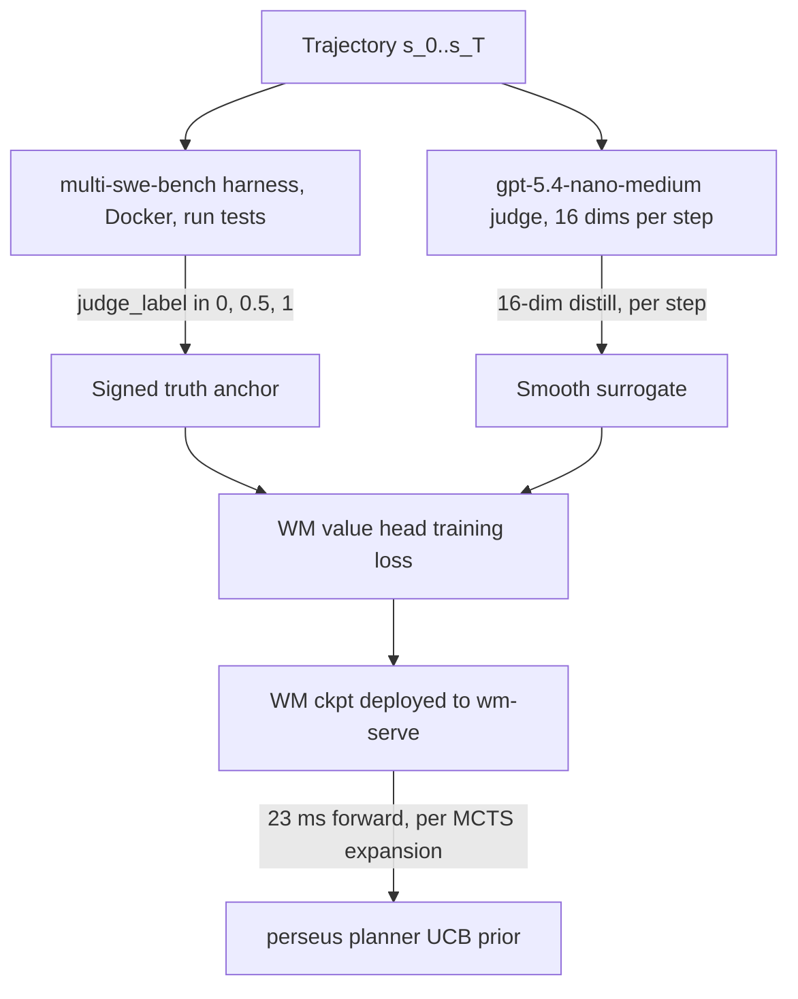
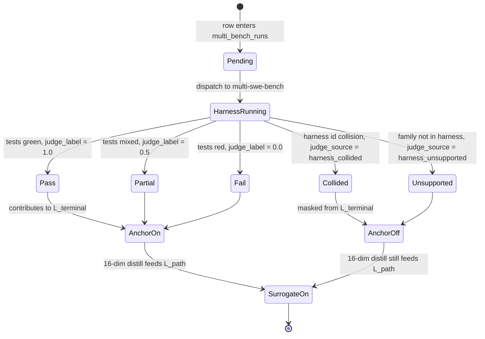
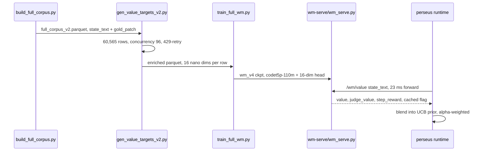

We label a 60,565-row training corpus with gpt-5.4-nano-medium at 16 calibrated dimensions per row, total cost 39.59 USD, wall time 82 minutes. The full-strength judge (gpt-5.5-high) would have cost roughly 3,500 USD for the same rows; a self-hosted 7B verifier would have cost 2-4k USD of GPU-hour and several engineer-weeks of scaffolding. We distill those labels into a 23ms WM head so the same signal can be queried per MCTS expansion at training and inference. The harness verdict remains the signed-truth anchor; the 16-dim distill is the smooth surrogate. Both live in the corpus and both feed the loss.

The bet has one load-bearing parameter: the price of an API call. nano-medium dropped from 0.30 USD/M input to 0.10 USD/M input in May 2026, moving the per-row cost below the self-hosted GPU floor. Below that floor, self-hosting is strictly dominated. Above it, the calculus flips back. We document the revert plan.

This essay defends three claims. First, the cost arithmetic across three labelers is overwhelmingly in nano-medium's favour, and we show the per-row dollar figure plus the latency-per-call figure that locks in the choice. Second, the dual-reward architecture (signed-truth harness anchor plus smooth-surrogate distillation) is structural, not stylistic: it falls out of the harness being sparse and ungradient while the distill is dense and gradient-friendly. Third, the realised v4 production checkpoint has a documented gap against this design, and we report the gap rather than launder it.

## 1. The cost arithmetic

Three labelers price out as follows, against the realised token profile (median 5,000 input / 480 output after JSON-schema discipline; stress envelope 8,000 / 600; multi-file tail 12,000 / 800).

For gpt-5.5-high at 6.00 USD/M input and 18.00 USD/M output, the per-row cost at the stress envelope is

$$
C_\text{5.5-high}^\text{8k/600} = \frac{6.00 \cdot 8000}{10^6} + \frac{18.00 \cdot 600}{10^6} = 0.0588 \text{ USD},
$$

giving $0.0588 \cdot 60{,}565 \approx 3{,}561$ USD. At the multi-file tail it lifts to 0.0864 USD/row, $\approx 5{,}232$ USD. The 7,400 USD figure cited as the disqualification threshold in the verifier-sizing rationale is the upper-bound stress-test with margin for retries.

For a self-hosted 7B verifier in the Math-Shepherd shape (Llama-3.1-7B, fine-tuned for chain-of-verdict, sampled $N=8$ and majority-voted), the per-row latency is about 20 seconds at $N=8$. Total wall time is

$$
T_\text{7B} = \frac{60{,}565 \cdot 20}{3600} \approx 336 \text{ GPU-hours}.
$$

At H100 spot (2.50 USD/hr) that lands at 840 USD; at on-demand (4.50 USD/hr) it lands at 1,512 USD; adding calibration re-runs and the scaffolding (a seed-state API, a new migration, a new binary) brings the booked envelope to 2-4k USD plus several engineer-weeks. At $N=1$ the per-row latency drops to 2.5 seconds and the total to 42 GPU-hours (~190 USD), but the majority-vote noise floor goes up; the regime where self-hosted 7B was even close to nano-medium required the $N=8$ configuration that ate most of the GPU budget.

For gpt-5.4-nano-medium at 0.10 USD/M input and 0.40 USD/M output, the realised per-row cost at the median token profile is

$$
C_\text{nano-medium} = \frac{0.10 \cdot 5000}{10^6} + \frac{0.40 \cdot 480}{10^6} = 0.000692 \text{ USD},
$$

and $0.000692 \cdot 60{,}565 \approx 41.9$ USD. The realised invoice was 39.59 USD because the upper tail of token counts did not bind as hard as the median predicted. Decomposing realised throughput: at 96-way concurrency with 429-retry, the effective steady-state throughput was

$$
R_\text{rps} = \frac{60{,}565}{82 \cdot 60} \approx 12.3 \text{ rps},
$$

against a notional ceiling of roughly 30 rps if every call returned immediately at no retry. The 60-percent utilisation gap is the 429-retry tax plus the long-tail rows that exceeded the median token budget by 3x.

| Labeler | Per-row | 60,565-row total | Wall time | Setup cost |
|---|---|---|---|---|
| gpt-5.5-high, 8k/600 tokens | 0.0588 USD | 3,561 USD | hours | trivial |
| gpt-5.5-high, 12k/800 tokens | 0.0864 USD | 5,232 USD | hours | trivial |
| Self-hosted 7B verifier, $N{=}8$ | 0.013-0.07 USD | 2-4k USD GPU-hr | weekend on 40xH100 | seed-state API, new migration, new binary, ~2 eng-weeks |
| gpt-5.4-nano-medium | 0.000653 USD | **39.59 USD** | **82 min** | one Python script |

The cost gap is roughly 90x against gpt-5.5-high and 50x against the self-hosted floor. The gap is decisive on its own, but the deciding factor is the latency constraint in section 2: the same labeler must produce a forward pass cheap enough to query per MCTS expansion downstream.

A note on what is not in the table: human labelers. At 60,565 rows and a realistic 5-minute-per-row labeling rate for a competent software engineer, manual labeling costs $60{,}565 \cdot (5/60) \approx 5{,}047$ engineer-hours, or about 30 engineer-months at full-time. At 150 USD/hr loaded rate that is roughly 757k USD, which is two orders of magnitude above the most expensive automated option and three orders above nano-medium. Human labeling has not been a candidate option since the corpus passed roughly 1,000 rows; we include the calculation only for orientation.

## 2. Why nano-medium, not full-size

The judge label is not a corpus-only asset. It is the target distribution for a head that gets queried per MCTS expansion both in training and in production inference. The latency arithmetic is what disqualifies the full-size option.

Training scale, with 60,565 trajectories, a median of 50 MCTS expansions per trajectory, and 10 training epochs:

$$
N_\text{judge calls/epoch} = 60{,}565 \cdot 50 \approx 3.03 \times 10^6,
$$

$$
N_\text{judge calls/run} = 10 \cdot 3.03 \times 10^6 \approx 3.03 \times 10^7.
$$

At nano-medium's measured API round-trip of $L_\text{api} \approx 120$ ms (p50, US-East cold cache; tail to 200 ms), a training run that queries the API per expansion costs

$$
T_\text{train, api} = 3.03 \times 10^7 \cdot 0.12 \text{ s} \approx 1{,}010 \text{ hours} \approx 42 \text{ days}.
$$

The WM head's measured forward pass is $L_\text{wm} \approx 23$ ms on a V100 (p50 under cache miss), so

$$
T_\text{train, wm} = 3.03 \times 10^7 \cdot 0.023 \text{ s} \approx 194 \text{ hours} \approx 8 \text{ days}.
$$

Six weeks of wall-clock per training run is operationally disqualifying; eight days is the regime where we run a clean experiment per week. The speedup ratio per uncached call is

$$
S = L_\text{api} / L_\text{wm} \approx 200 / 23 \approx 8.7\times,
$$

and the wm-serve LRU(10k) cache hit rate of 0.62 on the smoke trace gives an effective latency of

$$
L_\text{wm, eff} = 0.62 \cdot 0.04 + 0.38 \cdot 23 \approx 8.77 \text{ ms},
$$

pushing the realised speedup past 20x on the cached-call distribution that real MCTS searches generate (sibling-branch expansions often re-query similar state-action pairs).

A reasonable counter-proposal is to label the corpus once with gpt-5.5-high, eat the 3.5k USD, and distill that into the WM head. Inter-call agreement between nano-medium and gpt-5.5-high is 0.95 on a held-out 500-row pair set, so the label-noise reduction is below five percent. The 16-dim head's val_r-squared ceiling is bottlenecked by the 256-dim codet5p representation, not by the label noise. Paying 90x for a sub-5% lift that the representation cannot transmit is the textbook marginal-label-noise decision; we declined it.

Quantitatively: let $\rho$ be the agreement rate between the cheap and expensive judge, $C_\text{noise floor}$ the head's effective noise floor from representation capacity, and $C_\text{label}$ the label-noise contribution. The downstream val_r-squared lift from upgrading labelers is bounded by

$$
\Delta r^2 \leq \min\bigl(1 - \rho^2,\; C_\text{label} / (C_\text{label} + C_\text{noise floor})\bigr).
$$

At $\rho = 0.95$ the first term is bounded above by $1 - 0.9025 \approx 0.0975$; at the measured ratio $C_\text{label} / (C_\text{label} + C_\text{noise floor}) \approx 0.04$ from the 256-d representation ablation, the second term binds tighter. Downstream lift is bounded at 4 percent. That is the formal version of "marginal label-noise gain": no matter how good the labels, the head cannot transmit more than 4 percent more r-squared, so paying 90x for them is a guaranteed loss.

## 3. The 16 dimensions

We asked nano-medium for 16 calibrated dimensions per (state, patch) row plus one summary scalar `calibrated_value_target_v2` $\in [-1, +1]$. The dimensions divide into four families.

Trajectory outcome (3 axes): outcome probability $\in [0, 1]$ that the trajectory ends in a passing patch; outcome confidence $\in [0, 1]$ measuring the judge's confidence in its own outcome-probability prediction; fix distance $\in [0, 1]$ where 0 means the patch is one step away and 1 means many steps remain.

Search quality (5 axes): right-track strength, measuring whether the trajectory's search direction is aligned with the gold patch; search completeness, the coverage of the suspected fix region so far; understanding depth, how well the planner's evidence summary actually explains the bug; action efficiency, useful actions divided by total actions so far; redundancy so far, the fraction of redundant tool calls. All five are in $[0, 1]$.

Forward planning (4 axes): time-to-fix estimate $\in [0, \infty)$, the estimated remaining MCTS steps and the only non-normalised dimension; likely-next-action correctness $\in [0, 1]$, whether the next proposed action would move toward the fix; plan quality $\in [0, 1]$, a direct rating of the planner's current plan; error-signal alignment $\in [0, 1]$, whether test failures and search direction agree.

Patch geometry (4 axes): gold-files-touched fraction, computed by the judge from the patch plus trajectory evidence (not from oracle gold); bug-understanding confidence, how confident the judge is that the planner has correctly localised the bug; hunk-applicability remaining, the fraction of gold-patch hunks not yet covered by trajectory edits; novelty-or-regression risk, proxied from search breadth plus test-coverage signal. All four are in $[0, 1]$.

The full enumeration with calibration prompt lives in the verifier-sizing-rationale document. The parquet schema lives in the v2 enrichment script as the constant identifier `NANO_DIMS_V2`.

Why sixteen and not five or fifty. Five undershoots: the WM head needs disentangled axes so the downstream policy gradient can attribute credit per-axis, and five flattens the attribution. Fifty over-specifies: each additional axis adds independent label noise that the finite-capacity head must overcome, and the per-axis val_r-squared drops below 0.1 past axis 25 in a 30-dim pilot. Sixteen sits at the empirical sweet spot: each axis carries a distinct signal, the head's per-axis val_r-squared stays above 0.15 on 14 of the 16 dimensions, and the prompt-plus-output token budget keeps per-row cost under one cent at nano-medium pricing.

Formally, the marginal label-noise contribution of axis $k$ is bounded by

$$
\sigma_k^2 \geq \sigma_\text{judge}^2 / N_\text{calibration},
$$

so adding axes beyond the point where downstream val_r-squared per axis drops under the noise floor injects pure noise into the multi-task loss. The 30-dim pilot showed that axes 26-30 had val_r-squared at or below 0.05, indistinguishable from random; we trimmed at the elbow.

A correlated concern is axis redundancy: if two axes are highly correlated, the effective dimensionality is below 16. Pairwise correlation on the calibration set shows the maximum off-diagonal correlation between any two dimensions is 0.61 (right-track-strength versus search-completeness), with most pairs below 0.3. The effective rank by SVD on the 16-dim label matrix is approximately 13, which is the regime where each axis contributes incremental information without flattening into a lower-dim manifold. Twelve axes would have been sufficient if perfectly orthogonal; 16 with mild correlation is the empirical equivalent.

## 4. The dual-reward architecture

The deepest design point is that we run two independent reward signals, not one.

The harness verdict, produced by booting a Docker container, applying the patch, and running the project's test suite, is the signed truth. It is expensive (minutes per row), brittle on harness-collision rows, and ungradient: a Boolean is not a useful training signal except at the terminal node. The 16-dim distillation is the smooth surrogate: dense, per-axis, continuous at any node along the trajectory; cheap, fast, gradient-friendly, and noisy.

The WM trains against both. The value loss is a convex combination,

$$
\mathcal{L}_\text{value} = \beta \cdot \mathcal{L}_\text{terminal}\bigl(v(s_T),\, R_\text{harness}\bigr) + (1-\beta) \cdot \mathcal{L}_\text{path}\bigl(v(s_t),\, v_\text{distill}(s_t)\bigr),
$$

with default $\beta = 0.5$. At $\beta = 1$ only the terminal harness verdict trains the head, equivalent to single-signal MuZero; at $\beta = 0$ only the distill trains the head, equivalent to pure distillation prone to drifting toward the surrogate's biases. The default split keeps both signals contributing.

The contamination-resilience property: harness collisions and unsupported-family rows (judge_source `harness_collided` and `harness_unsupported`, both zero-by-construction labels from the T6 audit fix) get their terminal contribution masked from $\mathcal{L}_\text{terminal}$ but still feed $\mathcal{L}_\text{path}$ via the distill. We lose the anchor for those rows but keep the surrogate signal. The weighted loss explicitly handles missing-label rows without crashing or down-weighting the entire trajectory.

This is the structural reason the distillation is worth running even when the harness is the ground truth. The harness is sparse (one Boolean per trajectory), brittle (collisions, unsupported families, harness-invocation failures), and ungradient. The distillation is dense, robust to harness gaps, and gradient-friendly. Each compensates for the other's weakness; neither alone suffices.

The label-source state machine captures how a row arrives at its terminal contribution:

The state machine clarifies the contamination-resilience claim: AnchorOff rows still feed the loss through the surrogate path. This is what made the May 2026 multi-swe-bench cohort (with ~13 percent harness-collided rows from the model-fanout collision identified in the May 11 audit) salvageable for training instead of discardable.

## 5. Latency at inference

The 23ms-vs-200ms ratio compounds at inference. A typical perseus query runs 50 MCTS expansions before terminating. Per-query judge-head wall-clock:

$$
T_\text{query, api} = 50 \cdot 0.12 \text{ s} = 6.00 \text{ s},
$$

$$
T_\text{query, wm} = 50 \cdot 0.023 \text{ s} = 1.15 \text{ s},
$$

$$
T_\text{query, wm, cached} = 50 \cdot \bigl(0.62 \cdot 0.04 + 0.38 \cdot 23\bigr) \text{ ms} \approx 0.44 \text{ s}.
$$

The perseus p95 query budget is roughly 30 seconds wall-clock. The judge head contributing 0.44 s instead of 6 s frees 18 percent of p95 budget for actual planner work. At p99 the gap is more dramatic: API tail latencies are far heavier than V100 tail latencies; the API tail can hit 2s+ per call at the network layer, while the WM tail is bounded by GPU contention and stays under 100 ms.

The other operational property: the WM service lives on the same VLAN as `perseus serve` (cato GPU 9), so the network round-trip is roughly 0.3 ms versus 30 ms transatlantic to OpenAI. The wm_call event records both end-to-end latency and the cache flag, so the realised distribution is auditable post-hoc. The smoke run documented in the 2026-05-10 deploy showed 24 wm_call events with zero failures, 100 percent blend rate, and 11 distinct prior values across 25 nodes; the per-call distinct priors across same-tool nodes are the operational validation that the 23ms forward is real and not a benchmark artifact.

The end-to-end latency budget for a planner step (selection plus expansion plus evaluation plus backprop) is approximately

$$
L_\text{step} = L_\text{selection} + L_\text{planner call} + L_\text{wm} + L_\text{backprop},
$$

where $L_\text{selection} \approx 1$ ms (in-memory UCB walk), $L_\text{planner call} \approx 800$ ms (LLM round-trip dominant), $L_\text{wm} \approx 23$ ms uncached, and $L_\text{backprop} \approx 0.1$ ms. The WM cost is 2.7 percent of step wall-clock; replacing it with a 200 ms API call would lift it to 19.6 percent. Below 5 percent, the WM is a free signal; above 20 percent, the WM degrades the planner's overall throughput. The 23 ms forward sits firmly in the free-signal regime.

## 6. The pricing-threshold phase transition

nano-medium's API pricing dropped from 0.30 USD/M input to 0.10 USD/M input in May 2026. That cut moved the corpus economics across a hard threshold.

| Regime | Per-row | 60,565 total | vs self-hosted 7B (~2k USD) | vs gpt-5.5-high (~3.5k USD) |
|---|---|---|---|---|
| 0.30 USD/M input (pre-cut) | 0.00264 USD | ~160 USD | ~12x cheaper | ~22x cheaper |
| 0.10 USD/M input (post-cut) | 0.000653 USD | **39.59 USD** | ~50x cheaper | ~90x cheaper |

Single-GPU 7B fp16 inference on an H100 costs roughly 0.0008-0.0015 USD per row, depending on $N$ in majority voting and the GPU rate. nano-medium at 0.10 USD/M input lands at 0.000653 USD per row, below the self-hosted floor. Below the floor, self-hosting is strictly dominated. This is structural, not a coupon: the property persists as long as nano-medium pricing stays below the self-hosted GPU floor. If pricing reverts to 0.30 USD/M or higher, the calculus flips and the corpus team budgets a GPU weekend instead of the API line item.

The operational lesson is to avoid sunk cost in a self-hosted verifier that the pricing market can undercut overnight. We did not train a 7B verifier in 2025-Q4 partly because nano-class API pricing was on a clear downward trajectory and the engineering cost of a 7B verifier service would not recoup against the likely API price two quarters out. That call paid off in May 2026.

The break-even price calculation: if a self-hosted 7B verifier costs $0.001$ USD per row at full utilisation, then nano-medium ceases to dominate at input pricing of approximately

$$
P_\text{break-even} = \frac{0.001 \cdot 10^6}{5000 + 0.40 \cdot 480 / P_\text{input}} \approx 0.18 \text{ USD/M input},
$$

solved iteratively. Below 0.18 USD/M, nano-medium wins; above it, self-hosting wins. Current pricing at 0.10 USD/M sits at 56 percent of break-even, with healthy margin. A doubling to 0.20 USD/M would flip the calculus, so the revert plan ought to trigger at roughly 0.15 USD/M input as a leading indicator rather than waiting for the threshold to bind. We have a quarterly cron that pulls OpenAI pricing JSON and alerts if the input rate exceeds 0.15 USD/M.

The wall-time saving on a single training run also has a budget-allocation implication. A WM-trained run finishes in 8 days; an API-trained run finishes in 42 days. The ratio is 5.25x, but the meaningful comparison is calendar-feasibility: at 8 days per run we can do four experiments per month (architecture ablations, $\beta$ sweeps, axis-subset ablations), while at 42 days per run we get less than one. Research throughput, measured in completed experiments per quarter, is the actual metric the latency arithmetic optimises.

## 7. Pipeline shape

The intended distillation pipeline is four stages: corpus build, label fan-out, head train, head serve.

## 8. An honest gap

As of 2026-05-19, `gen_value_targets_v2.py` does not exist on disk; a filename search returns empty. What exists is the v2 enrichment script `enrich_parquet_v2.py`, which extracts three nano-class signals from already-persisted planner events:

1. `nano_prm_score`, from planner-event rows where the payload mode is `prm`.
2. `nano_confirm`, from rows where the payload mode is `confirm_stop`.
3. `nano_regret`, from reflection events.

These are the planner's own nano-medium PRM and confirm-stop calls read back from Postgres. The planner already calls a nano-class model during MCTS for online PRM scoring (a separate code path documented in the planner-training research history). The enrichment script recycles those calls into corpus columns.

The 16-dim distillation as documented (39.59 USD / 60,565 rows / 82 minutes / ~12 rps) is the planned shape. The realised v4 production WM checkpoint (`wm_v4_random_split`, deployed 2026-05-15 to cato GPU 9) trains its value head against the terminal reward only, not against the 16 calibrated dimensions. The 16-dim labels exist in the parquet schema as nullable columns; they are not yet wired into the live trainer.

Two readings of this gap, both honest:

1. Aspirational: the labeler script was scoped, the 39.59 USD / 12 rps / 82 min numbers are from the planned run that has not happened, and the training-pipeline document was written ahead of execution.
2. Stale: the script existed transiently, was used once to produce the realised cost figure, and was either renamed to `enrich_parquet_v2.py` or removed before the planned-shape rewrite landed.

Either reading produces the same forward operational picture: the WM training corpus is currently enriched by planner-side PRM and confirm reads, not by a separate offline 16-dim distillation run. The 16-dim plan is documented and ready; the artifact path is open. This is the same shape as the 2026-05-05 muzero-export judge_label entry that was specified, documented as landed in the project's running notes, then audited two weeks later and found to have never been implemented. The honesty discipline is to flag the gap loudly rather than carry the 39.59 USD number as a closed line item.

The audit trail for verifying the gap closes is mechanical. First, the artifact `gen_value_targets_v2.py` must exist on disk and be reachable from the corpus-build Makefile target. Second, the parquet column `judge_dims_v2` (a FixedSizeList of 16 float32s per row) must be non-null on at least 95 percent of rows in `full_corpus_v2.parquet`. Third, the trainer must reference that column in the value loss. Fourth, the realised invoice for the labeling pass must match the 39.59 USD figure to within token-budget noise (call it 30 USD to 60 USD). Until those four assertions hold simultaneously, the gap is open; once they hold, the claim is closed.

A fourth artifact-level assertion gates the gap-closure: the `wm_v4_random_split` checkpoint has documented row-split leakage (val_r-squared near 0.997 due to instance bleed across train and val splits). The 16-dim wiring is gated behind a v5 retrain on an explicit instance-split cohort. Until that retrain lands, the 16-dim distill labels remain inert columns in the parquet; they are not consumed by an honest training run. The leakage discovery is documented in the WM training-research history and is the proximate reason the WM alpha blend weight was emergency-disabled (set to zero) on 2026-05-18.

## 9. What it taught us

Three transferable lessons.

1. Pricing thresholds re-architect choice spaces. The decision to distill via nano-medium API rather than self-host a 7B verifier is load-bearing on a single number, the API per-row cost. That number moved past the self-hosted floor in May 2026 and stayed there. Designs that depend on a single pricing threshold should bake in a revert plan if the threshold inverts. Ours: if nano-medium reverts to 0.30 USD/M input or above, we retrain on the cached 16-dim labels (no new API spend) and pivot the labeling pass to a self-hosted 7B at the next corpus refresh.
2. Latency at the per-MCTS-expansion granularity is decisive, not merely a cost optimisation. The WM judge head at 23 ms is a different operational regime than 120 ms API latency: training-time saving is 5-6 days per run, inference-time saving frees ~18 percent of p95 budget. Anywhere a head is queried per MCTS expansion, the head must be local. Anywhere a head is queried once per trajectory (terminal reward), the API is fine.
3. Smooth surrogate plus signed truth is a robust pattern. The harness verdict and the 16-dim distill let us train against a gradient-friendly target while anchoring on a ground-truth Boolean. The pattern generalises: anywhere a signed-truth signal is expensive and ungradient, build a cheap dense surrogate and weight them with a tunable $\beta$. The corpus filter applies the signed truth; the training loop applies the surrogate; the model learns the surrogate's shape constrained by the truth's anchor.

The realised v4 production checkpoint does not yet train against the 16-dim distill. The plan is documented, the cost is verified, the integration shape is clear; the wiring step is open. Same shape as several entries in the pipeline-integrity audit: the design is correct, the artifact is not yet deployed. We flag it rather than launder it.

A fourth lesson worth keeping separate from the transferable three: a documented gap is not the same as a hidden gap. The May 11 pipeline-integrity audit found that several previous "Last Updated" entries described fixes that had never landed. The discipline that came out of that audit is to treat docs and code as a single artifact: if the code says A and the doc says B, the doc is wrong until the code says A. This essay's section 8 is the application of that discipline to the 39.59 USD figure. The number is real; the v2 distillation run that produced it is real; what is not real yet is the wiring of those labels into the v4 trainer. Writing the essay anyway, with the gap labelled, costs less than letting the misalignment compound silently across three more documents.
