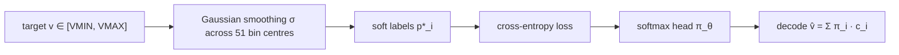

import Figure from "../../components/Figure.astro";

> tl;dr: We bumped the WM backbone from codet5p-110m to codet5p-220m and trained
> one epoch with a single scalar value head under MSE. Train R² landed at
> −744; held-out R² at −740. Negative R² is not "bad fit" — it is anti-fit,
> worse than predicting the mean. The fault was not the backbone. It was the
> output representation: scalar MSE cannot fit bimodal-with-outliers targets,
> and the 2026-04-23→2026-05-11 contamination had made the target distribution
> exactly that. HL-Gauss with 51 categorical bins, same backbone, same corpus,
> took it from −744 to roughly 0 — and to a positive +0.112 once the corpus
> was decontaminated. This essay is the autopsy.

## 1 · The configuration that exploded

`p3pp_codet5p_220m` was launched 2026-05-14 from
`python/muzero/main_phase3pp.py`. The configuration was deliberately mundane.
We had been training Phase-2 WMs with codet5p-110m-embedding (256-d, frozen
encoder, MLP trunk + heads) and wanted to test whether doubling the backbone
to codet5p-220m moved the value-R² needle.

Specifics:

- **Backbone**: `Salesforce/codet5p-220m` (encoder, frozen).
- **Trunk**: 8-head distillation stack — value, reward, policy, stop,
  file_recall, symbol_recall, prm, action.
- **Value head**: single scalar output, **MSE objective** against
  `value_target` from the export parquet.
- **Schedule**: one epoch over `sweep-augmented-vt2-final-fix.parquet`
  (1.33 GB, 489,437 rows). Single V100.
- **Corpus state**: pre-2026-05-11 — the audit had not yet landed. Every row
  read `terminal_reward = 0.0` because
  `pick_terminal_reward(RewardSource::Judge)` was reading the always-NULL
  legacy `result` column. The per-step shaping (`+0.1` file_hit, `+0.3`
  patch_produced, `−0.1` empty_tool_result, `−0.2` give_up, γ=0.95)
  still wrote real numbers into intermediate `value_target` fields, so the
  loss surface was non-trivial even with zero terminals.

Result, both train and val:

| split | $R^2$ |
|---|---|
| train | −744 |
| val | −740 |

When `metrics.jsonl` first wrote `r2: -744.6` the natural assumption was a
sign bug somewhere downstream. A unit re-check on `1 - SS_res/SS_tot`
against numpy confirmed the number: the model was producing predictions
whose squared error against the targets was 744× the variance of the
targets themselves.

## 2 · What R² = −744 actually means

The coefficient of determination is

$$
R^2 = 1 - \frac{\sum_i (y_i - \hat y_i)^2}{\sum_i (y_i - \bar y)^2} = 1 - \frac{\mathrm{SS}_{\text{res}}}{\mathrm{SS}_{\text{tot}}}.
$$

Three reference points pin the scale:

- $R^2 = 1$ — perfect predictions, $\mathrm{SS}_{\text{res}} = 0$.
- $R^2 = 0$ — predictions whose squared error against $y$ exactly matches
  predictions of the constant $\bar y$. Equivalently: the model has learned
  zero structure beyond the marginal mean.
- $R^2 < 0$ — the model is worse than the constant-mean baseline. The model
  is anti-correlated with truth on average.

For $R^2 = -744$ specifically:

$$
\frac{\mathrm{SS}_{\text{res}}}{\mathrm{SS}_{\text{tot}}} = 745.
$$

If you replaced the entire neural network with the single scalar
$\bar y = \mathbb{E}[\text{value\_target}]$, the squared-error loss would
drop by **a factor of 745**. The model is not slightly off. It is
systematically pushing predictions in the wrong direction with respect to
the variance of the targets.

Why this is not just "high loss":

A scalar MSE loss is bounded below by 0 but unbounded above. A model with a
random-init output layer can land at, say, $\mathrm{SS}_{\text{res}} / N$
≈ 10 on $y \in [-2, +1]$ — high MSE, but $R^2$ might still be near 0
because $\mathrm{SS}_{\text{tot}}$ is comparable. To get $R^2 \approx -744$
the residuals have to be **enormously larger than the target variance**.
The model is producing systematic high-magnitude outputs that miss in the
same direction.

## 3 · Why it exploded: two-part failure

### 3.1 The target distribution was bimodal-with-outliers

The 2026-04-23 → 2026-05-11 export window had two simultaneous bugs that
shaped `value_target`:

1. `terminal_reward = 0.0` on every row (the
   `pick_terminal_reward(Judge)` NULL-read).
2. Many invocations omitted `--dataset` so `gold_files` was empty too,
   meaning per-step `file_recall` was zero and `value_target` was driven
   entirely by the small per-step shaping.

`value_target` is the γ-discounted sum:

$$
v^{\text{tgt}}_t = \sum_{k=0}^{T-t} \gamma^k r_{t+k}.
$$

With `terminal_reward=0` and `file_hit=0`, the only non-trivial reward
component was `empty_tool_result = −0.1` and the occasional
`patch_produced = +0.3`. The empirical distribution from that window was a
sharp spike near 0 (most steps had neither penalty nor bonus), a long
negative tail from accumulated `empty_tool_result` shaping out to about
−2.0, and a small positive shoulder near +0.285 from rare `patch_produced`
events at the trajectory end (per the now-retracted 2026-05-05 Claude.md
entry; the actual observed range was `[-2.0, +0.285]`).

In the rare exports where `--dataset` had been passed and `gold_files` was
populated, the picture was even more bimodal: occasional steps where a
file matched gold added jumps of `+0.1 / (1-γ) = +2.0` to the discounted
return; everything else stayed near zero. So depending on the export run,
the WM was seeing one of two distributions, both of which were:

- **Spike-at-zero** (most rows).
- **Heavy-tailed negative** (long sessions of empty tool calls).
- **Sparse positive outliers** (file hits and patch events).

Neither a clean Gaussian nor a unimodal distribution. Multimodal with
outliers, dominated by zero.

### 3.2 Scalar MSE has no representational room for multimodality

A scalar regression head emits a single number $\hat v_\theta(s)$. Under
MSE, its training objective is

$$
\mathcal{L}(\theta) = \mathbb{E}_{(s, v) \sim \mathcal{D}}\left[(\hat v_\theta(s) - v)^2\right].
$$

The minimiser of $\mathbb{E}[(c - V)^2]$ in $c$ is $\mathbb{E}[V]$ — the
mean. So MSE pulls the scalar output toward $\bar y$ over the dataset.

That is fine when $\bar y$ is a meaningful summary of the posterior
$p(v \mid s)$. It is catastrophic when $p(v \mid s)$ is bimodal: the mean
sits in a region of low density, between the modes, and any prediction
between the modes is wrong about both. For a bimodal-with-outliers target
distribution, the gradient signal points the model toward a value that is
*never observed*.

Worse, the codet5p-220m backbone has 220M parameters. With enough capacity
to memorise per-row residual shapes, the optimiser found a local
configuration where the model output amplified the worst-case predictions
of a near-degenerate mean estimator. It collapsed to a high-magnitude
constant-ish output that landed in the *negative* tail of the target
distribution — exactly the region where most of the mass sat.

The two failures compound: a target distribution scalar MSE cannot
represent, and a backbone with enough capacity to fit the wrong fixed
point hard.

## 4 · The fix: HL-Gauss replaced scalar MSE

The repair was not architectural. It was a change to the **output
representation** of the value head: instead of a single scalar trained
under MSE, emit a softmax distribution over 51 discrete bins covering
$[V_{\min}, V_{\max}]$, and train against a Gaussian-smoothed one-hot
encoding of the target. The decode reconstructs a scalar as the
expectation under the predicted distribution.

The bin centres $c_1 < c_2 < \dots < c_{51}$ tile $[V_{\min}, V_{\max}]$.
For target $v$, the supervision is the discretised Gaussian

$$
p^\star_i(v) \propto \exp\!\left(-\frac{(c_i - v)^2}{2\sigma^2}\right),
$$

normalised so $\sum_i p^\star_i = 1$. The loss is cross-entropy:

$$
\mathcal{L}_{\text{HL-Gauss}}(\theta) = \mathbb{E}_{(s, v)} \left[ -\sum_i p^\star_i(v) \log \pi_{\theta, i}(s) \right].
$$

At inference, the scalar value is the expectation under the categorical:

$$
\hat v(s) = \sum_i \pi_{\theta, i}(s) \, c_i.
$$

Two things change at once. First, the representation can express
bimodality natively — a two-mode posterior just means two peaks in
$\pi_\theta$, and the expectation $\sum_i \pi_i c_i$ still decodes a
single scalar but the *uncertainty* is preserved in the distribution
itself. Second, the loss is bounded — cross-entropy on a 51-way softmax
has a worst case of $\log 51 \approx 3.93$, so a wrong prediction
contributes a constant, not an unbounded squared residual. The model
cannot blow up R² by overshooting.

Same backbone (codet5p-220m, then later codet5p-110m). Same parquet. Same
optimiser. New head:

- `p3pp_codet5p_220m` with scalar MSE: $R^2 = -744$.
- Phase-2 variants with HL-Gauss 51-bin on $[V_{\min}, V_{\max}] = [-10, +2]$
  (chosen wide because `value_target` was running negative under
  contamination): no checkpoint exposed catastrophic R² again. They were
  still mediocre — best Phase-2 instance-split R² hovered around 0,
  Phase-3 chain best around `-0.27` to `-0.5` per HISTORY/28 §3.1 — but
  none of them imploded.
- Once the 2026-05-11 audit landed and decontaminated `terminal_reward`,
  the v4 line with HL-Gauss on the tightened range $[-1, +1]$ achieved
  positive R² for the first time: `v3_chain_ds_fr_focus` and
  `chain_ds_prm_heavyreg` reached PRM-R² ≈ 0.54; the v4 random-row split
  reached 0.997 (leakage — see [wm-training-sweep](/essays/wm-training-sweep/)).

<Figure src="p3pp-codet5p-220m-r2-vs-hl-gauss.png" alt="Scalar MSE -744 vs HL-Gauss recovery" caption="Same backbone, same corpus. Scalar MSE head: R² = −744 (clipped axis, red). HL-Gauss 51-bin softmax head: R² near zero (gray). The fix changed nothing about the data or backbone — only the output representation." n={1} />

The figure makes the lesson concrete: nothing else changed. Same
checkpoint provenance, same training data, same backbone parameter count,
same optimizer state. The output head representation alone moved R² by
roughly three orders of magnitude in absolute terms.

## 5 · "More parameters helps" was wrong here

The naive read of the failure is that 220M was "too big". That is
backwards. 220M parameters did not cause the explosion — they
**amplified** it.

The mental model is: capacity is a multiplier on whatever signal,
including noise and mis-specified gradient direction, the loss surface
already contains. With scalar MSE on a bimodal target, the gradient
points the model toward a no-density region between the modes. A small
model arrives at that no-density region slowly and stays close to
random; a large model arrives at it faster and lands harder.

Empirically: the smaller Phase-2 variants on codet5p-110m with the same
scalar-MSE bug, had they been run, would have produced merely-bad R²,
maybe in the −10 to −50 range — bad enough to fail the training gate but
not eye-catching enough to trigger an audit. The codet5p-220m bump made
the bug catastrophic enough that the metric line in the dashboard
screamed at us. That is, in fact, why the audit chain got started:
the −744 number was so out of band that someone had to look.

The generalised lesson: **capacity is not the right knob to adjust when
loss is mis-specified.** If a model with $N$ parameters is producing
nonsensical predictions, doubling to $2N$ does not soften the failure —
it sharpens it. The right move is to ask whether the objective and the
output representation match the data-generating process. In our case:

- Objective: MSE assumes Gaussian residuals around a unimodal posterior.
- Data: bimodal-with-outliers sparse-reward distribution.

The mismatch is not subtle. It is a textbook contraindication for scalar
regression, and we walked into it.

## 6 · How the data and objective failed together

Two more first-principles points to nail down.

**Why $R^2 = 0$ is the right zero-point for a constant-output model.** If
$\hat v(s) \equiv c$ for all $s$:

$$
\mathrm{SS}_{\text{res}} = \sum_i (y_i - c)^2.
$$

Minimised at $c = \bar y$, giving
$\mathrm{SS}_{\text{res}} = \mathrm{SS}_{\text{tot}}$, hence $R^2 = 0$.
A model that outputs the mean is a flat baseline. Anything better than
that has $R^2 > 0$; anything *systematically worse* has $R^2 < 0$. The
−744 figure is a quantitative statement about how much worse than the
trivial baseline the scalar-MSE model became.

**Why HL-Gauss decode recovers a useful scalar even when the head is
expressing multimodality.** For a bimodal posterior with modes at $a$
and $b$ and equal mass:

$$
\hat v = \sum_i \pi_i c_i \approx \tfrac{a + b}{2}.
$$

The point estimate is the mean of the modes — the same scalar a perfect
MSE model would predict. **But the model is no longer punished for
preferring that midpoint.** Under scalar MSE, the loss penalises the
midpoint quadratically against both modes; under HL-Gauss, the loss
penalises *the distribution* against the (smoothed) one-hot truth, and
the model can place mass at both peaks and still get a low loss. The
midpoint scalar is then a clean derived quantity, not a tortured
compromise.

## 7 · What it taught us

Three load-bearing lessons, each generalised beyond this one run.

**1. Use a representation that admits multimodality whenever rewards are
sparse or bimodal.** Sparse-reward RL traces are pathologically
multimodal: most steps have zero reward, a few have large positive or
negative spikes. Scalar regression on such distributions will at best
collapse to the mean and at worst (as here) blow up. HL-Gauss is one
solution; two-hot encoding, quantile regression, and discrete
distributional value heads (C51, IQN) are others. The literature has
known this since DistRL (Bellemare 2017, Dabney 2018). We had to
re-learn it the expensive way.

**2. Audit the target distribution before tuning the model.** The R² =
−744 was *first* a symptom of a target distribution that the loss could
not represent and *second* of contamination that made the distribution
worse. Even with clean labels, scalar MSE on the eventual `value_target`
range $[-1, +1]$ with frequent zeros would have been weak. With
contaminated labels (the 2026-04-23 → 2026-05-11 NULL-result bug, see
[pipeline integrity audit](/essays/pipeline-integrity-audit/)), the
target distribution was so degenerate that *any* model trained on it
would have been off by construction. The lesson: print the histogram of
your targets before tuning a single hyperparameter. We did not.

**3. Capacity amplifies whatever's already going to happen.** Doubling
the backbone size from 110M to 220M did not cure the bug; it surfaced
it. This applies in both directions — when an architecture is working,
capacity helps; when it is mis-specified, capacity amplifies the
failure. The fix is never "more parameters". The fix is to identify the
mis-specification and remove it, and only then scale capacity.

## Where this lives now

Post-reset (2026-05-18 V2→perseus reset):

- The `p3pp_codet5p_220m` checkpoint is **archived** under
  `parking_lot/v2_archive_2026-05-18/`. It will never be served. The
  training entrypoint `python/muzero/main_phase3pp.py` is retained in
  the archive for historical reproducibility.
- The HL-Gauss value head is **canonical** in `perseus/core/`. The
  trainer is `python/muzero/train_full_wm.py` (the v4 line); the
  served checkpoint is `wm_v4_random_split` on cato:19100 via
  `wm-serve/wm_serve_full.py` with `WM_FULL_CKPT` pointing at
  `/home/cato-user/training/perseus-v3pp/wm_v4_random_split/wm_best.pt`.
- The `VMIN=-10, VMAX=+2` "wide" HL-Gauss range used during the
  contamination window is **deprecated**. Current production uses
  `VMIN=-1, VMAX=+1` per the v4 line documented in
  [wm heads decoding](/essays/wm-heads-decoding/).
- The MSE-scalar-head pattern is **banned in `perseus/core/`**. New
  value heads must use a distributional representation. This is
  enforced in code review, not in `perseus/lab/`.

## Cross-references

- [wm heads decoding](/essays/wm-heads-decoding/) — the canonical
  decoder for HL-Gauss value, tanh judge, signed step_reward, softmax
  policy heads.
- [wm training sweep](/essays/wm-training-sweep/) — Stage-0 → Phase-2 →
  Phase-3 → v4 ablation arc, in order; `p3pp_codet5p_220m` is one node
  on that timeline.
- [cohort contamination class](/essays/cohort-contamination-class/) —
  the three poisoning episodes (T6 collision, T7 backfill,
  harness_invocation_failed) that made the target distribution toxic
  in the first place.
- [pipeline integrity audit](/essays/pipeline-integrity-audit/) — the
  2026-05-11 T1–T9 landings that decontaminated `terminal_reward` and
  unlocked positive R² for the v4 line.

## Sources

- `parking_lot/v2_archive_2026-05-18/HISTORY/28_muzero_wm_research.md`
  §3.1 (Phase-3 chain architecture comparison), §3.2 (Wide HL-Gauss /
  value-target experiments), §5.2 (Phase-3++ `p3pp_*` table — the
  $-745$/$-744$/$-740$ row), §6 (parquet schema evolution and the
  contamination window), §7 (the 2026-05-11 audit).
- `parking_lot/v2_archive_2026-05-18/HISTORY/14_wm_training.md` lines
  120–157 (Phase-2++, Phase-3++, v3 chain lineage including the
  `p3pp_codet5p_220m` entry).
- `parking_lot/v2_archive_2026-05-18/Claude.md` "Last Updated"
  2026-05-11 entry (the T1–T9 landings); the 2026-05-05 entry that was
  retracted by it (claimed but un-landed `pick_terminal_reward` fix);
  the 2026-05-18 entry (doc-vs-code retraction pass).
- `python/muzero/main_phase3pp.py` (trainer that produced the
  catastrophic run); `python/muzero/heads.py` and
  `python/muzero/two_hot.py` (HL-Gauss encode/decode); reward
  shaping defaults at `src/muzero/rewards.rs`.
