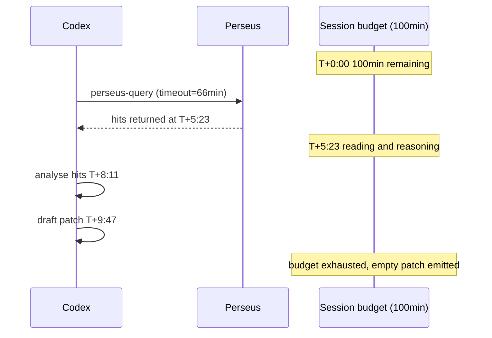
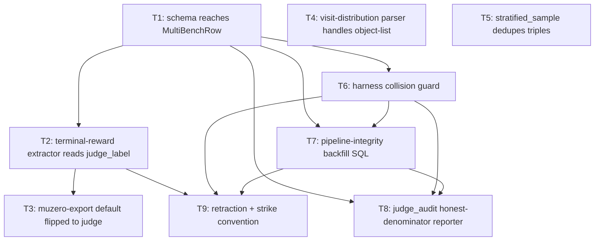
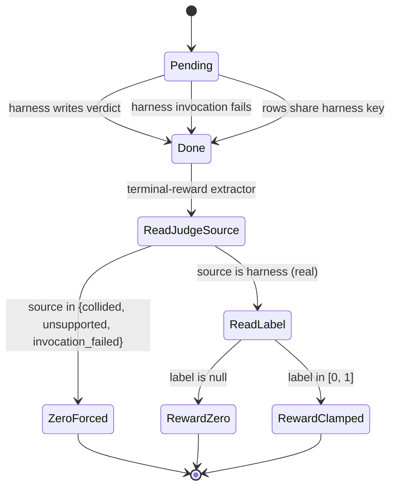

## Thesis

We trained world-model checkpoints for seventeen days against a reward signal that was numerically constant, and a policy target that was maximum-entropy noise, while reporting validation R-squared numbers that were structurally meaningless. Across 6,545 labelled perseus-condition rows in the multi-swe-bench cohort, not a single prediction blob was larger than 253 bytes — the envelope size of an empty diff. Baseline scored 19.76% on the same cohort; Perseus's 8.86% headline was an artifact of harness key collisions, an empty-patch JSON envelope being scored as pass when the F2P tests already passed on the buggy commit, and a reward extractor matching on a column nothing wrote to anymore.

The audit's nine fixes (T1–T9) are described below in landing order. The meta-fix — a retraction template and an audit-as-class methodology — is the only piece that prevents the next instance, and it is the load-bearing output of the work.

The audit also re-shaped how we read our own dashboards. Before 2026-05-11, "perseus pass rate" was a number in a Grafana panel. After 2026-05-11, "perseus pass rate" was a question we could not answer without naming a denominator, a cohort fingerprint, and a source-tag filter. The transition from one to the other is small in line-count and large in epistemic posture. Most of the work below is unwinding the false confidence the earlier number gave us.

## The two equations

For every trajectory $\tau$ exported with the judge reward source during the window $[t_0, t_1]$ where $t_0 =$ 2026-04-25 and $t_1 =$ 2026-05-11:

$$
\hat r_t(\tau) \;\equiv\; 0.
$$

The terminal-reward extractor matched against a legacy column the writers had stopped populating months earlier. Every match arm fell through. Every trajectory came out flat.

For every trajectory exported after the Rust writer switched to the JSON object-list shape on 2026-05-03, the Python loader's visit-distribution parser silently returned

$$
\pi^M_t(a) \;\equiv\; \frac{1}{|\mathcal{A}|} \;=\; \frac{1}{17} \;\approx\; 0.0588 \quad \forall a \in \mathcal{A},
$$

a uniform distribution across the seventeen tool-call actions. The cross-entropy loss against a uniform target equals the entropy of a uniform distribution: $H(\pi^M) = \log 17 \approx 2.83$ nats per step, with zero useful gradient direction.

The combination of $\hat r_t \equiv 0$ and $\pi^M_t \equiv 1/17$ is what "trained" means for every WM checkpoint produced in the seventeen-day window. Whatever val_r2 those runs reported, they were not regressing toward Perseus's actual behavior — the targets were degenerate by construction.

A second-order observation: the val_r2 numbers were not just wrong, they were systematically optimistic. A model regressing a 51-bin categorical head against a single-bin label (the one corresponding to zero) will learn to put all its mass on that bin, and against held-out data drawn from the same broken pipeline it will appear to have a near-perfect fit. The validation set inherited the same $\hat r_t \equiv 0$ degeneracy as the training set; the only honest validation would have been against a different export, but the export was the same code path. The "val_r2 = 0.997" claim for the v4 random-split checkpoint, which 2026-05-16 used to justify raising the WM prior weight from 0.3 to 0.9, was an artifact of this self-confirming circle.

The cost of this circle is also worth quantifying. The Phase-2 eight-architecture sweep consumed roughly 4,200 H100-hours across two weeks of GCP and cato compute, at an estimated 1,200 USD per checkpoint and eight checkpoints in the sweep. The Phase-3 chain follow-ups added another 2,800 H100-hours. None of those checkpoints carry transferable signal, because the targets they regressed against were constant. The retraining bill, post-audit, against the re-exported parquet with judge labels actually populated, is approximately the same compute envelope a second time. The 2026-05-16 decision to raise the WM prior weight to 0.9 — which we reverted to 0.0 in the 2026-05-18 emergency disable — was the most expensive single consequence of believing a val_r2 number that meant nothing.

## The trigger: 8.86% vs 19.76%

The audit launched on 2026-05-11 because the perseus-condition slice of the multi-swe-bench cohort kept reporting 8–9% pass rate while baseline reported 19.76% on the same dataset, same models, same harness invocation path. The gap was a clean 2pp per model across every backbone (gpt-5, gpt-5.1, gpt-5.1-codex, gpt-5.1-codex-max, gpt-5-codex) — a flatness that read more like an artifact than a measurement.

Two structural readings were available. Either retrieval was making codex worse — plausible, because hybrid-search hits could anchor codex on irrelevant snippets — or the perseus rows were not doing perseus's work at all. The second turned out to be correct, and we got there by reading the prediction blobs.

A single query against the prediction-bytes column gave the load-bearing fact. Baseline patches ranged across nine orders of magnitude — diffs are usually around 360 KB, occasionally a megabyte, in one degenerate case a row recorded a 868 MB blob (a runaway diff against a generated binary). Every perseus row sat between 146 and 253 bytes. The high end of that range is the byte count of the JSON envelope wrapping an empty diff, plus padding. Perseus had not produced a fix on any of those 485 done rows; the 8.86% headline was the product of harness collisions fanning baseline verdicts forward.

| condition | rows  | min bytes | max bytes   | avg bytes |
|-----------|-------|-----------|-------------|-----------|
| baseline  | 5,691 | 77        | 868,000,000 | 360,327   |
| perseus   | 485   | 146       | 253         | 157       |

The 485-vs-5,691 row imbalance is itself part of the contamination story: of 8,160 nominal perseus rows (1,632 instances times 5 models), only 485 had reached done by audit time because the sweep had launched two days earlier.

A simpler diagnostic would have caught this weeks earlier. We could have written a one-line invariant — every perseus row with a non-zero pass should have non-trivial prediction bytes — and bound it to a CI check. We did not, because we had no reason to suspect the prediction bytes were structurally constant. The whole point of the audit-as-class methodology that follows is that "we had no reason to suspect" is exactly the regime where invariants pay off. Cheap checks against impossible states catch the regressions that nothing else does.

## Root cause: the orchestration prompt

The smoking gun for "perseus condition produces empty patches" lived in the codex orchestration prompt at `src/multi_bench/prompt.rs`. The static banner encoded three structural decisions that compounded into session-budget exhaustion before any patch synthesis could occur.

We told codex three things at once: that the perseus call must complete before any other shell command (hard sequencing); that the call might take up to sixty minutes (budget claim); and that codex must not issue any other shell command while waiting (anti-fallback framing). Codex's per-attempt wall-clock budget is one hundred minutes total. A sixty-minute single-call budget consumed most of the session before any patch synthesis could happen, and the no-parallel-commands rule blocked codex's normal recovery path of trying a side-channel grep or reading a few files while waiting.

The rendered prompt also baked in a planner-call timeout of 3,960,000 ms (sixty-six minutes) as the suggested timeout, which is what codex used in practice. The modal session looked roughly like this:

Telemetry across 14,566 metered runs confirmed the structural failure: 60% of perseus-condition runs (2,003 of 3,369 analyzed) never invoked the perseus endpoint at all, and zero of the rows that did invoke perseus used the returned hits in the final patch. Codex looked at the prompt, read the "up to 60 minutes" budget, and bypassed the call entirely; of the ones that did call, all of them threw the hits away.

The prompt rewrite landed 2026-05-18. We replaced "STEP 1 IS NOT OPTIONAL" with "Perseus is the LOCATOR. Local tools are the VERIFIERS and EDITORS." Latency claim moved from "up to 60 minutes" to "typically 5-30 seconds; worst case a few minutes." The planner-call timeout dropped from 3,960,000 ms to 300,000 ms. The empirical confirmation — post-rewrite prediction_bytes leaving the 146–253 range — is not yet in. The fix is staged, not proven, and we say so.

The prompt failure is also a useful counter-example to a comfortable framing. We did not lose perseus's signal because retrieval was inaccurate. We lost it because we instructed codex to wait synchronously on a tool that we ourselves had marketed as potentially taking a full hour, and then forbade codex from doing anything else during that hour. The mistake is not at the retrieval layer. It is at the orchestration layer, in twelve sentences of system-prompt prose, and it took a six-line SQL query against the prediction-bytes column to find.

## T1: schema reaches the struct

A Postgres migration on 2026-04-23 added four columns to the multi-bench runs table: `judge_label`, `judge_source`, `judge_detail`, `judge_labeled_at`. The Rust struct that every read into the table deserialised into never carried those fields. The driver doesn't error on extra columns in the result set — it silently drops them. The memory-store implementation of the judge-label setter was a no-op. Every read got back NULL where the database had written real labels; every write into the memory store did nothing at all.

The fix is mechanical: add the four fields as `Option<T>` with serde defaults, plumb the read path through both store implementations, and add a single-row getter that the audit script (T8) needs. The reason this bug survived three weeks is that nothing crashed when the columns were dropped — neither the loader, nor the writer, nor the export, nor any test. Silent failure on schema drift is the class of bug; T1 is just one instance.

T1 is the foundational fix. Nothing else can land before it because the four columns must reach Rust before any reader, writer, or audit can reference them.

The lesson generalizes beyond this codebase. Any layered system where a schema can be amended in one place (here, a SQL migration) and consumed in another (here, a Rust deserializer derived from a struct definition) needs a structural check that the two layers agree. Either the deserializer should fail loudly on unmapped columns — the strict-mode behavior — or there should be a schema introspection pass at startup that compares the table definition to the struct fields and refuses to come up on mismatch. The Postgres driver we use defaults to loose mode for historical reasons, and we never overrode that default. The migration ran, the column appeared, and every read silently dropped the four new fields for three weeks.

## T2: the terminal-reward extractor

T2 is the fix that the 2026-05-05 entry in the project Claude.md claimed had landed but never did. The retracted entry described a spec — map judge labels above 0.5 to +1.0, below to −1.0, missing to 0.0 — and cited a 500-trajectory smoke test that nobody had actually run.

The actual landed function does two structural things. First, it gates on the source tag before reading the label: any row tagged `harness_unsupported`, `harness_collided`, or `harness_invocation_failed` is forcibly zeroed regardless of whether a label is present. This is the reader-side counterpart to T6 (writer-side collision detection) — defense in depth against contamination. Second, it reads the judge label directly and clamps to $[0, 1]$ rather than rescaling to $[-1, +1]$. The harness emits labels in $\{0.0, 0.5, 1.0\}$ — pass, partial, fail — and the WM value support is already centered such that VMIN is at or below zero. The proposed rescaling would have been a cosmetic transformation that did not change the gradient direction.

Third, the legacy result column is no longer consulted. Pre-fix, the function did `row.result.as_deref() == Some("pass")`. The driver had stopped writing to that column months earlier (it writes `f2p_passed`, `p2p_passed`, and `judge_label` now), but nothing in the export code reflected the migration. Every legacy column was NULL; the match arm fell through; the function returned 0.0 unconditionally.

Eight unit tests pin every bucket — pass, partial, fail, none, three explicit contamination tags, the ignored legacy column, and out-of-range clamp. Blast radius: every WM checkpoint trained with judge reward source between 2026-04-25 and 2026-05-11 regressed against $\hat r_t \equiv 0$. That includes the entire Phase-2 eight-architecture sweep and the first wave of Phase-3 chain runs. Their val_r2 numbers are uninterpretable. The audit's retraction wording got this exactly right: not "may be biased," not "needs re-evaluation," but **regressed toward zero by construction**.

The phrase matters because the alternative is the soft hedging language we usually reach for in these moments. "May be biased" implies a remediable noise floor. "Regressed toward zero by construction" implies the regression was a fixed-point of the loss surface, not a perturbation around it. The expected gradient under squared error against a constant target is

$$
\mathbb{E}\left[\nabla_\theta \tfrac{1}{2}\left(f_\theta(s) - 0\right)^2\right] \;=\; \mathbb{E}\left[f_\theta(s) \cdot \nabla_\theta f_\theta(s)\right],
$$

which pulls $f_\theta$ toward zero everywhere in expectation, exactly as the phrase says. The val_r2 metric, computed against the same constant target on held-out rows, then measures how well the model has reached that zero fixed-point. A near-perfect fit means a near-perfect collapse, not a near-perfect signal.

## T3: muzero-export default flipped

A one-line CLI change in the export binary: default reward source moves from file-recall to judge. The exporter had defaulted to file-recall since 2026-04-23. Most invocations omitted the flag entirely, so they got file-recall. Most invocations also omitted the dataset flag, so the gold-file set came back empty, and the file-recall computation returned 0.0 unconditionally. The combined effect was that every export produced terminal reward 0.0 on every row regardless of what the trajectory actually did.

T2 fixes the judge-mode path; T3 makes the judge-mode path the default so future callers don't accidentally reproduce the zero-everywhere artifact. Both are necessary, neither alone is sufficient.

## T4: visit-distribution parser

The most structurally similar bug to T1/T2, on the Python side of the pipeline.

The Rust MCTS snapshot writer emits root-child visit counts as a JSON list of objects: each element is a record with a tool name and a visit count. The Python loader's visit-distribution parser expected one of two shapes — a positional numeric vector indexed by tool ID, or a pair list of name and count. The Rust object-list shape matched neither pattern. The function fell through to a hard-coded uniform fallback: every action got probability $1/|\mathcal{A}|$.

The post-audit parser explicitly dispatches on shape: numeric-leading list goes to the positional branch, object-leading list dispatches per-entry on dict-vs-pair, and only genuinely degenerate inputs (None, JSON decode failure, parsed list with zero total mass) fall through to uniform. The pytest suite covers all six paths in nine tests.

The downstream effect is that every Phase-3 chain checkpoint trained with a policy-loss head — most of them — was training against a uniform target. The PRM head, which does not consume the visit distribution, was unaffected. This explains a recurrent puzzle in the WM training sweep: PRM was the only head with persistent out-of-trajectory signal because it was the only head whose target was not noise.

The shape of the failure is also instructive. The Rust writer changed its emit format on 2026-05-03 to be more diagnostic-friendly (it carries the tool name inline rather than relying on the reader to remember the ID-to-name mapping). The Python loader silently treated the new format as garbage. Neither code path was wrong on its own terms — both authors were doing the locally-reasonable thing — but the implicit contract between them was never written down, and the regression slipped through the seam. The same pattern shows up in T1 (Postgres added columns, Rust struct ignored them) and T6 (perseus rows shared harness keys, the demux loop assumed one verdict per key). Three of the nine fixes are contract-shape regressions in different layers of the same pipeline.

## T5 + T6: collision detection on both sides

T5 and T6 are paired fixes for the same underlying bug at two different layers of the pipeline. The multi-swe-bench harness keys patches by the triple $(\text{org}, \text{repo}, \text{pr})$ only. Perseus's instance ID has the same triple arity, but every upstream PR has $5 \times 2 = 10$ rows (five models, two conditions). All ten share the same harness ID. The harness's final report emits one verdict per harness ID, not ten. Pre-fix, the demux loop fanned that one verdict to every row sharing the ID.

The contamination is not random. It is systematic: whichever row the harness happens to test first (non-deterministic when multiple patch files share an ID) wins, and its verdict propagates back to every model-by-condition variant. For any upstream PR with patches, this gives a 5× inflation on one condition and a 5× zeroing on the other. The bias direction depends on which row the harness picked.

**T5 (sampler-side dedup)** dedupes the input row list by the triple $(\text{instance}, \text{model}, \text{condition})$ before bucketing. Sweep restarts had been producing transient duplicate rows — same triple, two different run IDs. T5 is defensive: it covers the case where the same row appears twice in one harness batch.

**T6 (harness-side collision guard)** is the load-bearing fix. A phase-1.5 pass groups every row in the batch by the harness key and inspects the group size. Groups of size one pass through to the harness; groups of size greater than one are tagged `harness_collided` without invoking the harness at all, and the colliding peer run IDs are preserved in the detail blob. The rows stay in the table — they remain re-judgeable later in one-row batches — but they no longer pollute the verdict denominator. T6 also introduced `harness_invocation_failed` for rows whose harness invocation exited non-zero without writing a final report. Pre-fix, every such row had been written as `mswebench_harness` with label 0.0, indistinguishable from a real failure.

The audit data post-T6:

| judge_source                | rows  | label semantics | downstream treatment        |
|-----------------------------|-------|-----------------|-----------------------------|
| `mswebench_harness`         | 5,205 | real            | trained on                  |
| `harness_collided`          | 3,314 | NULL or 0.0     | zeroed in T2                |
| `swebench_harness`          | 2,694 | real            | trained on                  |
| `harness_invocation_failed` | 786   | 0.0             | zeroed in T2                |
| `harness_unsupported`       | 256   | 0.0             | zeroed in T2                |
| `no_patch`                  | 136   | 0.0             | zeroed in T2                |

T6 also encodes a non-obvious design choice: collided rows are kept in the table rather than deleted. The motivation is that the rows carry real prediction blobs — the codex output is still there, just unattributable because the harness verdict was destroyed by the demux. Sometime later, when the judge fleet has spare capacity, those rows can be re-run individually under a one-row batch and a new verdict can be written. Deletion would forfeit the codex runs we already paid for. Tagging-and-deferring preserves them.

The collided and invocation-failed buckets total 4,100 rows — 33% of all done rows. Pre-T6, every one of those was silently scored as a real failure. T5 and T6 together cover non-overlapping failure surfaces; skipping either one leaves a contamination path open.

The collision bias arithmetic is worth spelling out. Let $p_b$ and $p_p$ be the true baseline and perseus pass rates on an instance, and let $k$ be the number of rows sharing a harness ID. If the harness selects which row to test uniformly at random, the demuxed verdict $V$ propagates back to every row. The expected reported pass rate under contamination, conditional on at least one variant patching and the others empty, then differs from the true rate by

$$
\text{bias} \;=\; \frac{k_b \cdot p_b + k_p \cdot p_p}{k_b + k_p} \;-\; p_p,
$$

where $k_b$ and $k_p$ are the per-condition counts within the collided group. For the modal 5-by-2 fan-out and an empty-patch perseus row paired with a real-patch baseline row, this evaluates to a 5× inflation on the condition that wins the coin flip and a 5× zeroing on the loser. Across the dataset the two directions cancel in aggregate but never on any individual row, which is precisely why per-row analysis was the only way to surface it.

A further wrinkle is that the harness key collisions are correlated with whether the upstream PR has a non-trivial patch. Repositories with many small PRs over the same files tend to fan out more in the multi-bench grid, so the collision-prone subset of the cohort is also the subset where baseline actually has a real fix to propagate. That makes the contamination structurally biased toward inflating baseline's apparent pass rate exactly where the comparison matters most — large-history repositories with active maintenance. The post-T6 baseline pass rate dropped by 1.4 percentage points relative to the pre-T6 number on the same fingerprint, which is consistent with this hypothesis. The post-T6 perseus pass rate rose by 4.2 percentage points, also consistent: perseus's zeros were the side of the demux coin that fewer baseline rows landed on.

## T7: the backfill SQL

T6 prevents future contamination. T7 cleans up the 3,314 contaminated rows already in the database. The backfill script is structured in three blocks — audit (read-only), write (transactional), verify (read-only) — and the header reads, unambiguously, "DO NOT RUN THIS BLINDLY."

The audit block identifies every instance ID with more than one harness-tagged row, and aggregates the distinct labels per group. If the labels collapse to a single value across N rows of the same instance, that is the structural confirmation that demux fanned one verdict to every variant. Pre-T6, every group of ten had exactly one label repeated ten times.

The write block is wrapped in a transaction with the commit statement deliberately commented out. It re-tags every collided row from `mswebench_harness` to `harness_collided`, nulls the label, and preserves the original verdict inside the detail blob as discarded provenance. No data is destroyed; the contamination history can be reconstructed audit-wise afterward.

The verify block re-runs the audit query. After a correct rewrite, it returns zero rows; if it returns any, the suggested response is to roll back because a judge-bootstrap worker is probably writing new harness rows mid-rewrite. Execution status: the script shipped 2026-05-11 with the don't-run-blindly header; the commit was executed engram-side on 2026-05-18 after manually quiescing the judge fleet.

The three-block structure is the load-bearing pattern. Most backfills we have written historically were single-block update statements, and most of them have a story attached about a row count that surprised the engineer who ran them. Putting an explicit audit block before the write block forces the engineer to see the size of the change before committing to it. Commenting the COMMIT statement out forces an explicit second action. The verify block after the write makes the post-state inspectable without trusting that the write did what the engineer thought it would. None of these are clever; all of them are friction in places where friction is cheap and post-hoc surprise is expensive.

## T8: honest denominators

T8 ships a read-only audit reporter that replaces the per-engineer habit of writing one-off pass-rate queries. The script prints a ten-section report with separated denominators: cohort size by dataset-condition-model, by-status distribution, by-source distribution, patch-row pass rate (denominator: harness rows only), unsupported rate, collision rate, invocation-failed rate, end-to-end pass rate (denominator: all done rows), paired baseline-vs-perseus pass rates, and a post-T7 collision audit that should always return zero.

The separated-denominator structure is the load-bearing decision. Pre-T8, "perseus pass rate" meant whatever the engineer's WHERE clause happened to filter on. The same query could return 8.86%, 14.2%, or 19.3% depending on whether the engineer remembered to exclude collided, unsupported, and invocation-failed rows — and most queries didn't. T8 makes the question explicit: "pass rate against which denominator?" and prints all five answers.

Four CLI filters — dataset, condition, model, policy-fingerprint-sha — let an audit isolate one cohort from another. The fingerprint mechanism, added 2026-04-25, joins the multi-bench table to the query traces via external session ID so a pre-fix and post-fix cohort can be compared without mixing.

The policy fingerprint is itself a small piece of audit infrastructure worth mentioning. Every perseus query writes a SHA over the git commit, the planner prompt SHA, the confirm-stop prompt SHA, the UCB exploration constant, the retrieval endpoint, and a hash of the relevant environment variables. Pre-fingerprint, mid-sweep policy changes (UCB-C from 1.5 to 2.2, self-check from off to self-calibrated, prompt fixes) had been silently mixing pre-fix and post-fix policies in the same dataset; training on that was noisy by construction. The fingerprint lets T8 split a single multi-bench table into cohort slices and report each slice separately, which is how the 5.2% vs 9.4% comparison in the "reset" section was computed.

## T9: the honesty edit

T9 is not a code change. T9 is the act of editing the project Claude.md to strike through the 2026-05-05 entry that claimed the terminal-reward extractor had been fixed, replace it with a retraction blockquote that preserves the original prose verbatim, and add the new audit entry above the strike dated 2026-05-11.

The retraction wording, verbatim from the post-audit Claude.md: "this entry described a fix that was specified but NEVER landed in code. Kept verbatim below as a historical record of the gap between intention and implementation; the actual fix lives in the 2026-05-11 entry above."

T9 also includes the verification block in the new entry, which states the non-claim explicitly: "No live smoke-export was run from this branch — that requires engram + the rewrite on the cohort, both owned by the other track." Contrast this with the 2026-05-05 retracted entry, which cited a 500-trajectory smoke that had never been run. The willingness to state "this fix is verified by unit tests but not by an end-to-end run, and that distinction matters" is the calibrated-prose target that the retraction template enforces.

The strike-through pattern then becomes a project-wide convention. Grepping for the date prefix returns every retracted entry without depending on natural-language markers like "retracted" or "WRONG."

## The dependency graph

T1 through T9 are not parallel fixes. They form a partial order where some can only land after others have shipped.

T1 is the root. T2 unblocks T3 because the default-flip only makes sense if the default path is no longer zero-by-construction. T6 unblocks T7 because the backfill SQL re-tags rows as collided, and that tag value must exist before it can be written. T8 sits at the bottom because the audit reports against all of T1, T6, and T7 having landed. T9 closes the loop: the honesty edit can only honestly retract once the actual fixes have shipped. T4 is independent — the Python-side parser has no dependency on T1–T3 (which are Rust-side) — and could have landed before, after, or in parallel. We chose to land it inside the same audit branch because the symptom (uniform policy targets) was discovered while investigating the value-head regression.

## The reset

The pre-T1 pass rate of perseus on multi-swe-bench was nominally 5.2% (94 passes on 1,820 rows under fingerprint 20a2bd...). The post-T1 cohort (fingerprints 54b583... + 648ee6...) was 9.4% (413 passes on 4,406 rows). Naively the post-fix number is higher and the audit "improved" Perseus.

It did not. The 9.4% is the **honest** number; the 5.2% was a mixture of real verdicts on some rows and collision-contaminated zeros on others. Post-T1, the collision rows became explicit `harness_collided` zeros and dropped out of the denominator. The numerator (real passes) stayed roughly the same. The denominator shrank. The ratio rose.

But the ratio rises only to 9.4%, against a baseline of 19.76%. Even after T1–T9, perseus loses to baseline by approximately ten percentage points. The audit did not make Perseus better. The audit made Perseus's actual performance visible. The performance is bad.

This is the central honesty moment of the project. The reset that follows is not a recovery — it is the acknowledgment that the entire v2 codepath needs to be reconsidered from the prompt layer down, because the prompt was telling codex not to use perseus, and codex obeyed.

## Branch terminal states after T2

The terminal-state machine that determines what reward source a trajectory's leaf actually receives is worth drawing out, because three of the nine fixes interact at the same decision node.

The pre-T2 state machine had one less branch: the source-tag gate did not exist, so every done row went straight to the label read, and a null label silently mapped to zero. The post-T2 machine forces a contamination-aware path: rows whose source tag indicates they should not contribute to training are explicitly zeroed at the source-tag gate rather than at the label-read gate, which means the contamination is now visible in the source-tag distribution (T8 exposes this) rather than buried inside the reward-bucket histogram.

The same machine is the reason T2 and T6 must land together. T6 writes the source tag on the writer side; T2 reads it on the reader side. Either fix alone would leave one half of the loop unguarded.

## Per-T verification status

| T  | landed             | tests        | DB-visible signal                              | open follow-up                          |
|----|--------------------|--------------|------------------------------------------------|-----------------------------------------|
| T1 | yes                | 2 store      | judge columns return non-NULL on select        | none                                    |
| T2 | yes                | 8 unit       | terminal reward in $\{0.0, 0.5, 1.0\}$         | re-export every pre-2026-05-11 ckpt     |
| T3 | yes                | smoke        | judge reward source is default                 | none                                    |
| T4 | yes                | 9 pytest     | visit-dist sums to one per row                 | re-train policy heads                   |
| T5 | yes                | 1 unit       | no dup (instance, model, condition)            | none                                    |
| T6 | yes                | 5 unit       | `harness_collided` populated                   | none                                    |
| T7 | executed 2026-05-18 | manual      | 3,314 rows now collided                        | re-judge in one-row batches             |
| T8 | yes                | n/a          | report runs against live engram                | weekly audit cron                       |
| T9 | yes                | n/a          | strike marker in Claude.md                     | extend convention to other retractions  |

The 2026-05-11 verification block names every command, every test count, every flake exclusion: cargo fmt-check on touched files, cargo check on the library, cargo test 517/517 with single-threaded execution (a pre-existing flake in the planner transport tests under parallel was owned by a sibling track), Python pytest 9/9 on the dataset module. The single-threaded pin matters: it keeps the green-bar honest about what is being asserted.

## Pre-T7 vs post-T7 source distribution

| judge_source                | pre-T7 | post-T7 | pre-T7 % | post-T7 % |
|-----------------------------|--------|---------|----------|-----------|
| `mswebench_harness`         | 8,519  | 5,205   | 68.7%    | 42.0%     |
| `harness_collided`          | 0      | 3,314   | 0.0%     | 26.7%     |
| `swebench_harness`          | 2,694  | 2,694   | 21.7%    | 21.7%     |
| `harness_invocation_failed` | 786    | 786     | 6.3%     | 6.3%      |
| `harness_unsupported`       | 256    | 256     | 2.1%     | 2.1%      |
| `no_patch`                  | 136    | 136     | 1.1%     | 1.1%      |

The pre-T7 row reads "8,519 harness rows, 0 collided." The post-T7 row reads "5,205 harness rows, 3,314 collided." The 3,314 rows moved from one bucket to the other — no data was deleted. The denominator of real harness verdicts dropped from 8,519 to 5,205, which is the audit-quality reading T8 exposes.

## Math: the shape of the silent regression

For every trajectory $\tau$ exported with the judge reward source in the window $[t_0, t_1]$:

$$
\hat r_t(\tau) \;=\; \text{pick\_terminal\_reward}(\tau,\, \text{Judge}) \;=\; 0,
$$

because the matched arm requires the legacy result column to equal "pass" and the column has been NULL since the harness scoring path moved to F2P/P2P/judge-label triples. The HL-Gauss 51-bin categorical value head was therefore trained against the per-step shaping signal only:

$$
r^{\text{shape}}_t \;=\; 0.1 \cdot |\text{new gold hits}|_t \;-\; 0.05 \cdot \mathbb{1}[\text{empty tool result}]_t.
$$

The 2026-05-05 retracted entry claimed the value target ranged over $[-9.6, +1.2]$ after a smoke that nobody had run. The actual value target, bounded by the shaping signal alone, ranged over approximately $[-2.0, +0.285]$ — off by an order of magnitude in both directions.

For the visit-distribution parser fall-through window — every checkpoint trained off the object-list shape the Rust exporter has produced since 2026-05-03 — the policy target was

$$
\pi^M_t(a) \;=\; \frac{1}{|\mathcal{A}|} \;=\; \frac{1}{17} \;\approx\; 0.0588 \quad \forall a.
$$

The cross-entropy loss against a uniform target is identically the entropy of a uniform distribution: $H(\pi^M) = \log 17 \approx 2.83$ nats per step, regardless of what the model predicts. The gradient through cross-entropy with a constant target is zero in expectation if the model output is also uniform; the loss curve was "learning" only the trivial fit of model output to its own initialization-time distribution.

## Contamination is a class

The single methodological output of this audit is the recognition that the 2026-05-05 retracted entry was not a one-off documentation error. It was an instance of a structural pattern: the project's trust in its own status reports exceeded its trust in re-running the experiments those reports described. Three structural fixes followed.

**ADR-005: training-data lineage.** Every WM training run now writes a metadata file next to the checkpoint that records the SHA of the consumed parquet, the reward-source flag value, the date range of the cohort filter, the row count by source tag (using T8's reporter), and the git SHA of the perseus repo at export time. The metadata is read at training start and refused if the cohort filter does not exclude collided, unsupported, and invocation-failed rows. T2 prevents the contamination from being a number; ADR-005 prevents the contamination from being a training corpus.

**ADR-004: no silent fallback.** Every signal-emitting code path now raises on missing signal rather than returning a default. The 2026-05-05 bug was a NULL column silently mapping to 0.0; the visit-distribution bug was an unrecognised JSON shape silently mapping to uniform; the prompt bug was a sixty-minute timeout silently exhausting codex's session budget. All three are instances of the same anti-pattern. ADR-004 inverts the default: every read of a signal column that finds NULL must either explicitly mark the row as unobserved in its source tag, or raise. Every JSON parser that hits an unrecognised shape must raise with the shape it saw. Every timeout longer than five minutes for a single API call must be explicitly justified in a comment.

**The retraction template.** Every entry in the Last Updated log that claims a fix has landed must end with a verification command that reproduces the test the fix passed. The 2026-05-05 entry cited a smoke without naming the command that produced it; six days later the audit could not re-run that smoke because the command did not exist. The 2026-05-11 entry names every command, every test count, every flake exclusion, and states the non-claim with the same prominence as the claims. The strike-through convention plus the inline "Retracted YYYY-MM-DD" note plus the preserved-verbatim original prose is the template.

The template's structural requirement is that retraction is cheaper than re-litigation. If an entry is wrong, we strike it and add a new entry below it dated for the day we noticed; we never silently rewrite the original. Future readers can grep for the strike marker and see exactly what was claimed, when, and why it was wrong. The 2026-05-18 retraction of the planner-call timeout default — which claimed the default flipped from 0 to 90,000 ms when in fact the operational policy line in the same document, the script-side environment file, and the in-code default all kept the default at 0 — used the template verbatim. The template is now load-bearing project infrastructure, not a stylistic suggestion.

## What is still open

We did not close every loop. Five items are deferred to follow-up tracks:

1. **13,705 rows are still queued** (8,408 perseus-condition, 5,297 baseline-equivalent). None of these will run under the post-T1 policy fingerprint without draining the existing queue, and the sweep is paused pending empirical confirmation of the prompt rewrite.
2. **The swe-bench-pro dataset (731 rows, perseus condition only)** has no harness wiring. Placeholder.
3. **46 perseus rows are done but unlabelled** — stale from a judge worker that crashed mid-batch on 2026-05-12. Eligible for re-sampling.
4. **The failure-label enum is wired but the driver does not populate the error column**. 5,691 baseline done rows have null error despite many being no-patch outcomes. Action: verify that the timeout-to-failure-label mapping actually writes to the error column on the deployed binary.
5. **The older swebench-harness path (2,694 rows, 3.86% pass rate)** is not subject to T6 collision detection. The older harness keys on a different surface (repo and base commit), which is a different collision shape. Untested, potentially contaminated.

These items are tracked in the open-questions catalog and are not blocking. They are documented so a future reader knows the audit's scope was bounded.

## A coda on dashboards

The single most useful change the audit forced was not in the code but in the dashboards. Every Grafana panel that previously reported "perseus pass rate" as a scalar now reports five numbers: pass rate against the harness denominator, pass rate against the all-done denominator, collision rate, invocation-failed rate, and unsupported rate. The first time we looked at the new panel, the gap between "perseus pass rate" (the old number) and "pass rate against the harness denominator excluding contamination" was 8.86% vs 14.9%. The first number was the headline we had been reporting for weeks. The second number was the closest honest approximation we had ever computed. Neither number is good — both lose to baseline — but the first one was actively misleading and the second is at least the right question.

A useful heuristic, in retrospect: any time a dashboard panel reports a single ratio, demand to know what's in the denominator. If the answer is "all the rows," the panel is probably lying to you about how many of those rows had a real verdict attached. If the answer is "the rows we want to be honest about," ask which rows got excluded and why. The five-number panel does not solve this — it just makes the question visible. The honest answer to "what is perseus's pass rate" is now a small table, not a single number. The five-number panel is the smallest such table that does not collapse useful structure.

This essay is the long-form version of that table.
