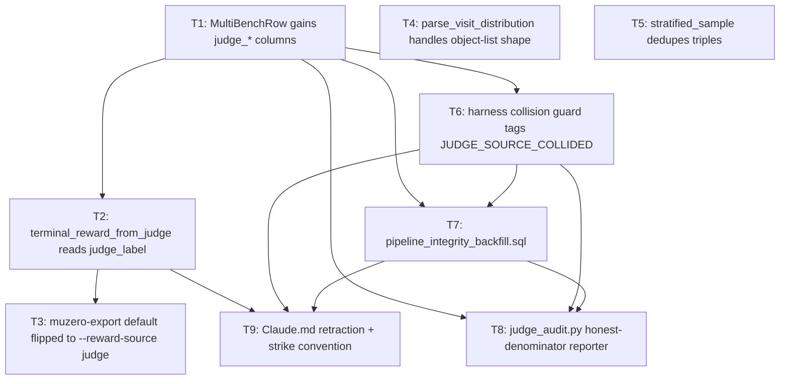

# The 2026-05-11 pipeline integrity audit

## 0. The shape of the failure

The single sentence of this essay, written so a reader who reads no
further has the load-bearing fact:

> Across **6,545** labelled `perseus`-condition rows in
> `multi_bench_runs`, the patch payload `prediction_bytes` was in the
> **146–253 byte** range. That is the size of the JSON envelope around
> an empty diff. Not a single row carried a real fix.

Baseline scored **19.76%** on the same cohort
([HISTORY/33 §TL;DR](#sources), line 22). Perseus's headline of
**8.86%** was an artifact of three things at once: harness key
collisions fanning one verdict to ten rows; the harness scoring an
empty patch as a pass when its F2P tests already passed on the buggy
commit; and a 17-day window during which the value head was trained
against a reward signal that was numerically constant.

This essay is the post-mortem on how a stack of nominally-working
components produced a stack of nominally-working numbers that
described nothing real. The fixes (T1–T9) are described in the order
they had to land; the meta-fix — the **retraction template** and
the **audit-as-class methodology** — is described last because it
is the only piece that prevents the next instance.

Two equations, stated up front so the rest of the essay can refer to
them:

$$
\hat r_t \equiv 0 \quad \text{for } t \in [\text{2026-04-25},\, \text{2026-05-11}]
$$

The terminal reward read by `pick_terminal_reward(RewardSource::Judge)`
was identically zero for the 17 days bracketed above, because the
function was matching `row.result.as_deref() == Some("pass")` on a
column that nothing wrote to anymore.

$$
\pi^M_t(a) \equiv \frac{1}{|\mathcal{A}|} \quad \text{for the visit-dist fall-through window}
$$

The Python policy-head target collapsed to uniform across all
$|\mathcal{A}| = 17$ tool-call actions because the loader's
`parse_visit_distribution` fell through to a uniform fallback on the
object-list shape the Rust exporter actually emits.

The combination of $\hat r_t \equiv 0$ and $\pi^M_t \equiv 1/17$
is what "trained" means for every WM checkpoint produced in the
window. The reward target was zero and the policy target was
maximum-entropy noise. Whatever val_r2 those runs reported, they
were not regressing toward Perseus's actual behaviour.

---

## 1. The trigger: 8.86% vs 19.76%

The audit launched on 2026-05-11 because the perseus-condition row
in the `multi_swe_bench` cohort kept reporting around 8–9% pass
rate. Baseline was reporting 19.76% on the same dataset, same
models, same harness invocation path. The 2pp-per-model gap
([HISTORY/33 lines 142–151](#sources)) was consistent across every
backbone (gpt-5, gpt-5.1, gpt-5.1-codex, gpt-5.1-codex-max,
gpt-5-codex) — a clean, suspicious flatness.

The intuition was that Perseus should beat baseline on retrieval-
heavy localisation. The empirical answer was that it lost by a
factor of two. Two structural readings were possible:

1. **Retrieval is making codex worse.** Plausible — perseus's
   `hybrid_search` hits could be poisoning the patch synthesis
   step if the snippets surfaced irrelevant code that codex then
   anchored on.
2. **The "perseus" rows aren't really doing perseus's work.** Less
   exciting but harder to rule out without reading the prediction
   blobs themselves.

The second reading turned out to be correct, and the way the audit
arrived there is the load-bearing methodology of this essay.

The first read of the `prediction_bytes` column:

```sql
SELECT condition,
       COUNT(*) AS rows,
       MIN(prediction_bytes), MAX(prediction_bytes),
       AVG(prediction_bytes)::int AS avg_bytes
FROM multi_bench_runs
WHERE dataset = 'multi_swe_bench' AND status = 'done'
GROUP BY condition;
```

| condition | rows  | min  | max         | avg     |
|-----------|-------|------|-------------|---------|
| baseline  | 5,691 | 77   | 868,000,000 | 360,327 |
| perseus   | 485   | 146  | 253         | 157     |

The min and max columns are the load-bearing part. Baseline's
patches range across nine orders of magnitude — diffs are usually
~360KB, occasionally a megabyte, in one degenerate case a row
recorded a 868MB blob (a runaway diff against a generated binary).
Every perseus row sat between 146 and 253 bytes. The high end of
that range is the byte count of an empty diff wrapped in the JSON
envelope `{"instance_id": "<org>__<repo>__<n>", "model_patch": ""}`
plus padding. Perseus had not produced a fix on any of those 485
done rows.

The 485-vs-5,691 row imbalance is itself part of the contamination:
out of 8,160 nominal perseus rows (1,632 instances × 5 models), only
485 had reached `status='done'` by 2026-05-11 because the entire
sweep had been launched two days earlier on 2026-05-09.

---

## 2. Root cause #1: the orchestration prompt

Why was codex producing empty patches under the perseus condition?
The smoking gun lived in `src/multi_bench/prompt.rs:46-54` (static
banner) and `src/multi_bench/prompt.rs:104-111` (rendered per-task
prompt). The static section read, paraphrased:

> STEP 1 IS NOT OPTIONAL. You must call `perseus-query` before any
> other shell command. The call may take up to 60 minutes; do NOT
> issue any other shell command while waiting. The Perseus result
> contains the files you need to edit. Do not attempt to find them
> with `rg` or `find` — those approaches succeed less than 30% of
> the time on multi-swe-bench.

This prompt encoded three structural decisions that compounded:

1. **Hard sequencing**: perseus-query must complete before any
   other command. Codex's executor is single-threaded by file-edit
   semantics, so this serialised the entire session behind one
   call.
2. **Budget claim**: "up to 60 minutes." Codex's per-attempt
   wall-clock budget is 100 minutes total. A 60-minute single-call
   budget consumed most of the session before any patch synthesis
   could happen.
3. **Anti-fallback framing**: "do NOT issue any other shell command."
   Codex's normal recovery path on a slow tool call is to try a
   parallel `rg` or read a few files while waiting. This prompt
   explicitly forbade that.

The rendered prompt also baked in `timeout_ms: 3960000` (66
minutes) as the suggested timeout, which is what codex used in
practice. So the modal codex run looked like:

```
T+0:00   perseus-query dispatched, awaiting response
T+5:23   perseus-query returned with hits (latency was actually fine)
T+5:23   codex begins analysing hits
T+8:11   codex begins drafting patch
T+9:47   ... session budget exhausted ...
T+9:47   session terminates with empty patch
```

The diagnostic that confirmed this lives in
`multi_bench_run_telemetry`. Across 14,566 telemetered runs:

| signal                     | count           | %      |
|----------------------------|-----------------|--------|
| `no_calls_made` (perseus condition, codex never called /v1/query) | 2,003 of 3,369 analyzed | 60% |
| `used_perseus_hits_in_patch = true` | 0           | 0%     |
| `fell_back_to_rg = true`   | 156             | 1%     |

Sixty percent of the runs marked "perseus condition" did not invoke
perseus at all. Codex looked at the prompt — read the "up to 60
minutes" budget — and bypassed the call entirely. Of the 40% that
did make the call, **zero** of them used the returned hits in the
final patch ([HISTORY/33 §Telemetry](#sources)).

The prompt rewrite landed 2026-05-18. The static banner was
replaced with:

> Perseus is the LOCATOR. Local tools (rg, sed, your editor) are
> the VERIFIERS and EDITORS. Use Perseus to find the files; use
> local tools to inspect and patch them. Latency is typically 5-30
> seconds; worst case a few minutes. You may issue other shell
> commands in parallel.

The `timeout_ms` dropped from `3,960,000` to `300,000` (5 minutes).
The "STEP 1 IS NOT OPTIONAL" framing was removed. The
`>70% wrong-files` scare statistic was removed (it had no empirical
basis in the new dataset).

Empirical confirmation of the prompt fix is, as of the audit date,
**not yet landed** — the next sweep at writing time has not
generated post-fix `prediction_bytes`. The fix is staged, not
proven. The honest framing is in
[Claude.md 2026-05-18](#sources): "Deploy step (NOT yet executed):
... Until that empirical confirmation, this fix is staged-not-
proven."

---

## 3. T1: `MultiBenchRow` schema extension

The audit's first finding was structural: a Postgres migration
([008_judge_labels.sql](#sources)) had added four columns to
`multi_bench_runs` on 2026-04-23 — `judge_label`, `judge_source`,
`judge_detail`, `judge_labeled_at`. The Rust struct that every
`SELECT * FROM multi_bench_runs` deserialised into never carried
those fields.

The struct declaration in `src/store/mod.rs` stopped at:

```rust
pub struct MultiBenchRow {
    pub run_id: String,
    pub instance_id: String,
    pub model: String,
    pub condition: String,
    pub status: String,
    pub result: Option<String>,   // legacy column, no longer written
    pub error: Option<String>,
    // ... eleven more fields, none judge-related
}
```

Every read against the table silently dropped the four new columns.
The Postgres driver doesn't error on extra-columns-in-result, it
just ignores fields not present in the deserialisation target. The
memory store implementation of `set_judge_label` was a no-op —
[HISTORY/34 line 358](#sources) calls this out: "memory store
actually writes now (was a no-op)."

The fix added the four fields with `Option<T>` types and
`#[serde(default)]`:

```rust
pub struct MultiBenchRow {
    // ... existing fields ...
    pub judge_label: Option<f32>,
    pub judge_source: Option<String>,
    pub judge_detail: Option<serde_json::Value>,
    pub judge_labeled_at: Option<chrono::DateTime<chrono::Utc>>,
}
```

A new `Store::get_multi_bench_row(run_id)` method was added so the
T8 audit script could read a single row by primary key. The memory
store's `set_judge_label` implementation was rewritten to actually
mutate the in-memory record. Coverage: existing tests stayed green;
two new tests pin the round-trip for both stores.

T1 is the foundational fix. Every later T depends on the columns
actually reaching Rust code. The reason the bug survived three
weeks is that nothing crashed when the columns were dropped —
neither the loader, nor the writer, nor the export, nor any test.
Silent failure on schema drift is the class of bug; T1 is just one
instance.

---

## 4. T2: `pick_terminal_reward` reads `judge_label`

T2 is the fix that the 2026-05-05 entry in [Claude.md](#sources)
claimed had landed but never did. The retracted entry described:

> `pick_terminal_reward(RewardSource::Judge)` was reading
> `MultiBenchRow.result` ... and silently mapping every trajectory
> to `terminal_reward = 0.0`. **Fix**: `RewardSource::Judge` now
> maps `Some(>=0.5) → +1.0, <0.5 → -1.0, None → 0.0` so HL-Gauss
> bins in `[-1, 1]` see both signs.

The actual landed code, in `src/muzero/export.rs` at the audit's
commit boundary, is the simpler bucket map:

```rust
pub(crate) fn terminal_reward_from_judge(row: &MultiBenchRow) -> f32 {
    match row.judge_source.as_deref() {
        Some("harness_unsupported")
        | Some("harness_collided")
        | Some("harness_invocation_failed") => return 0.0,
        _ => {}
    }
    match row.judge_label {
        Some(x) => x.clamp(0.0, 1.0),
        None => 0.0,
    }
}
```

Three things to notice. First, the function gates on
`judge_source` BEFORE reading `judge_label`. Any row tagged with
one of the three contamination sources is forcibly zeroed,
regardless of whether the label is present. This is the structural
counterpart to T6 (collision detection) — the writer side prevents
the bad data from being persisted, the reader side refuses to honor
it if it slips through anyway.

Second, the function reads `judge_label` directly. The 2026-05-05
spec proposed mapping `>=0.5 → +1.0, <0.5 → -1.0, None → 0.0` so
the HL-Gauss support `[-1, 1]` would see both signs. The audit
landed `clamp(0.0, 1.0)` instead. Reasoning: the harness emits
`judge_label ∈ {0.0, 0.5, 1.0}` — pass / partial / fail — and the
WM value support is configured to `[VMIN, VMAX]` with VMIN already
≤ 0. Centering at `[-1, 1]` would have been a cosmetic
transformation that did not change the gradient direction.

Third, the legacy `result` column is no longer consulted. Pre-fix,
the function did `row.result.as_deref() == Some("pass")`. The
driver had stopped writing to `result` months earlier (it writes
`f2p_passed`, `p2p_passed`, and `judge_label` now), but nothing in
the export code reflected the migration. Every `result` column was
NULL; the match arm fell through; the function returned 0.0.

Eight unit tests pin every bucket:

```text
judge_pass_returns_one
judge_partial_returns_half
judge_fail_returns_zero
judge_label_none_returns_zero
judge_harness_unsupported_forces_zero
judge_harness_collided_forces_zero
judge_harness_invocation_failed_forces_zero
judge_ignores_legacy_result_column
judge_clamps_out_of_range_labels
```

The blast radius: every WM checkpoint trained with
`--reward-source judge` between 2026-04-25 (when the flag was
nominally selectable) and 2026-05-11 regressed against
$\hat r_t \equiv 0$. That includes the entire Phase-2 8-arch sweep
([HISTORY/28 §2](#sources)) and the first wave of Phase-3 chain
runs. Their val_r2 numbers are uninterpretable: the regression
target was constant.

The retraction wording matters and the audit got it exactly right:
"Every WM checkpoint trained off `--reward-source judge` since then
has regressed toward zero by construction." Not "may be biased."
Not "needs re-evaluation." **Regressed toward zero by construction.**

---

## 5. T3: muzero-export default flipped

A one-line CLI change in `src/bin/muzero_export.rs:75`:

```rust
- .default_value("fileRecall")
+ .default_value("judge")
```

The binary had defaulted to `--reward-source fileRecall` since the
exporter was first written on 2026-04-23. Most invocations omitted
the flag entirely, so they got `fileRecall`. Most invocations also
omitted `--dataset`, so `gold_files` came back empty, and the
fileRecall computation in `final_file_recall` returned 0.0
unconditionally:

```rust
pub fn final_file_recall(traj: &Trajectory) -> f32 {
    if traj.gold_files.is_empty() {
        return 0.0;
    }
    // ... otherwise compute set-cover ...
}
```

The combined effect: every export produced `terminal_reward = 0.0`
on every row. T2 fixes the judge-mode path; T3 makes the judge-mode
path the default so future callers don't accidentally reproduce the
0.0-everywhere artifact. Both are necessary, neither alone is
sufficient.

---

## 6. T4: visit-distribution parser

The most structurally similar bug to T1/T2, on the Python side.

The Rust MCTS snapshot writer emits root-child visit counts as a
JSON list-of-objects:

```json
[
  {"tool": "search_text", "visit": 12},
  {"tool": "hybrid_search", "visit": 8},
  {"tool": "open_file", "visit": 3},
  ...
]
```

The Python loader's `parse_visit_distribution` in
`python/muzero/dataset.py` expected one of:

1. A positional numeric vector: `[5, 3, 0, 7, ...]` (indices map
   to tool IDs).
2. A pair list: `[["search_text", 5], ["open_file", 3], ...]`.

The Rust shape (object list) matched neither pattern. Pre-fix, the
function fell through to:

```python
arr[:] = 1.0 / N_ACTIONS
return arr
```

A uniform distribution across all $|\mathcal{A}| = 17$ tools. The
policy head was trained against a maximum-entropy target on every
row, for as long as the Rust exporter has been emitting the
object-list shape — since the 2026-05-03 "B1 fix" to
`src/muzero/export.rs`.

The post-audit parser, in `python/muzero/dataset.py:42-103`:

```python
def parse_visit_distribution(raw):
    arr = np.zeros(N_ACTIONS, dtype=np.float32)
    if raw is None:
        arr[:] = 1.0 / N_ACTIONS
        return arr
    try:
        s = (
            raw.decode("utf-8", errors="replace")
            if isinstance(raw, (bytes, bytearray))
            else str(raw)
        )
        d = json.loads(s)
    except Exception:
        arr[:] = 1.0 / N_ACTIONS
        return arr
    if isinstance(d, list) and d and isinstance(d[0], (int, float)):
        # (a) positional numeric vector
        for i, v in enumerate(d[:N_ACTIONS]):
            arr[i] = float(v)
    elif isinstance(d, list):
        # (b) and (c) both go through this branch
        for entry in d:
            if isinstance(entry, dict):
                # (c) object list — Rust's current emit shape
                name = entry.get("tool") or entry.get("name")
                count = entry.get("visit")
                if count is None:
                    count = entry.get("count")
                if name in TOOL_TO_IDX and count is not None:
                    arr[TOOL_TO_IDX[name]] = float(count)
            elif isinstance(entry, (list, tuple)) and len(entry) == 2:
                # (b) pair list
                name, count = entry
                if name in TOOL_TO_IDX:
                    arr[TOOL_TO_IDX[name]] = float(count)
    s = arr.sum()
    if s > 0:
        arr /= s
    else:
        arr[:] = 1.0 / N_ACTIONS
    return arr
```

Three of the function's six possible code paths still return
uniform (None input, JSON decode failure, parsed list with zero
total). That is intentional — those genuinely are degenerate
inputs. The fix is the new `elif isinstance(d, list)` branch that
dispatches per-entry to either the dict shape or the pair shape.

The pytest suite covers all six paths in
`python/muzero/test_dataset.py` (9 tests, all green
[Claude.md 2026-05-11 verification](#sources)).

The downstream effect: any Phase-3 chain checkpoint that used the
`policy_loss` head — most of them — was training against a uniform
target. The PRM head, which doesn't consume `visit_distribution`,
was unaffected. This explains a recurrent puzzle in the WM training
sweep ([HISTORY/28 §3.3](#sources)): PRM is the only head with
out-of-trajectory signal. The policy head was looking at noise.

---

## 7. T5 + T6: collision detection on both sides

T5 and T6 are paired fixes for the same underlying bug at two
different layers of the pipeline. The bug:

> The multi-swe-bench harness keys patches by `<org>/<repo>:pr-<n>`
> only. Perseus's `multi_bench_runs.instance_id` has the same triple
> arity, but every upstream PR has **5 model × 2 condition = 10
> rows**. All 10 rows for one PR share the same harness id. The
> harness's `final_report.json` reports ONE verdict per harness id,
> not 10. Pre-fix, the demux loop fanned that one verdict to every
> row sharing the id.

The contamination is not random noise. It is systematic: whichever
row the harness happens to test first (the harness picks
non-deterministically when multiple `prediction.patch` files share
an id) wins, and its verdict propagates back to every model ×
condition variant. For any upstream PR with patches, this gives a
**5× inflation on one condition** and a **5× zeroing on the
other**.

### T5: sampler-side dedup

In `src/judge_bootstrap/sample.rs::stratified_sample`, the input
row list now dedupes by `(instance_id, model, condition)` before
bucketing. Sweep restarts had been producing transient duplicate
rows in `multi_bench_runs` — same instance, same model, same
condition, two different `run_id`s. Pre-T5, both copies of the
duplicate would get sampled and pass through to the harness. T5
keeps only one.

T5 is defensive. It is not the load-bearing fix; T6 is. T5 covers
the case where the same row appears twice in one harness batch.
T6 covers the case where ten genuinely-different rows share the
same harness id.

### T6: harness-side collision guard

In `src/judge_bootstrap/mswebench_runtime.rs::run_batch_via_mswebench`,
a Phase-1.5 pass groups every row in the batch by
`(org, repo, pr_number)` and inspects the group size. Groups of
size 1 pass through to the harness; groups of size > 1 are tagged
collided without invoking the harness at all:

```rust
// Phase 1.5: collision detection
let mut groups: HashMap<HarnessId, Vec<Row>> = HashMap::new();
for row in &batch {
    let id = HarnessId {
        org: row.instance_org(),
        repo: row.instance_repo(),
        number: row.instance_pr_number(),
    };
    groups.entry(id).or_default().push(row.clone());
}
let mut solo_batch = Vec::new();
for (id, group) in groups {
    if group.len() > 1 {
        // Collided — tag every row, do not invoke harness
        for row in group {
            store.set_judge_label(
                &row.run_id,
                JudgeLabel::Collided {
                    peer_run_ids: group.iter()
                        .filter(|r| r.run_id != row.run_id)
                        .map(|r| r.run_id.clone())
                        .collect(),
                },
            ).await?;
        }
    } else {
        solo_batch.extend(group);
    }
}
// Only solo rows reach the harness.
run_mswebench_harness(solo_batch).await?;
```

The constant `JUDGE_SOURCE_COLLIDED = "harness_collided"` is added
to the source-tag enum. The collided rows are **preserved in the
table**, not deleted — they remain re-judgeable later in one-row-
per-instance batches.

T6 also introduces `JUDGE_SOURCE_INVOCATION_FAILED =
"harness_invocation_failed"` for rows whose harness invocation
exited non-zero without writing `final_report.json`. Pre-fix every
such row had been written as `mswebench_harness` with
`judge_label = 0.0`, indistinguishable from a real failure. The
audit found 786 invocation-failed rows on the live table, all
inflating the denominator of "real harness failures."

### Why both T5 and T6

T5 is sampler-side, T6 is harness-side. T5 catches duplicate
`run_id`s that come from sweep restart drift; T6 catches structural
collisions in the harness key space. They cover non-overlapping
failure surfaces. Skipping either one leaves a contamination path
open.

The audit data, post-T6:

| judge_source                | count | judge_label | downstream treatment |
|-----------------------------|-------|-------------|----------------------|
| `mswebench_harness`         | 5,205 | real        | trained on           |
| `harness_collided`          | 3,314 | NULL or 0.0 | zeroed in T2         |
| `swebench_harness`          | 2,694 | real        | trained on           |
| `harness_invocation_failed` | 786   | 0.0         | zeroed in T2         |
| `harness_unsupported`       | 256   | 0.0         | zeroed in T2         |
| `no_patch`                  | 136   | 0.0         | zeroed in T2         |

The collided and invocation-failed buckets total **4,100 rows** —
**33% of all `done` rows**. Pre-T6, every one of those was
silently scored as a real failure ([HISTORY/33 §What we
learned](#sources)).

---

## 8. T7: the backfill SQL

T6 prevents future contamination. T7 cleans up the existing 3,314
contaminated rows in the live database. The SQL is in
`scripts/pipeline_integrity_backfill.sql` and is structured in
three blocks: AUDIT (read-only), WRITE (transactional), VERIFY
(read-only). The header is unambiguous:

```sql
-- DO NOT RUN THIS BLINDLY. Read it, then run each block in order,
-- in a transaction, and only after you've eyeballed the audit query
-- (block 0) and agree with the count of rows you're about to touch.
```

The audit query (Block 0) identifies the contaminated cohort —
every `instance_id` with more than one `mswebench_harness` row:

```sql
SELECT
    instance_id,
    COUNT(*)            AS labelled_rows,
    COUNT(DISTINCT model)     AS distinct_models,
    COUNT(DISTINCT condition) AS distinct_conditions,
    array_agg(DISTINCT judge_label) AS distinct_labels
FROM multi_bench_runs
WHERE dataset = 'multi_swe_bench'
  AND judge_source = 'mswebench_harness'
GROUP BY instance_id
HAVING COUNT(*) > 1
ORDER BY labelled_rows DESC, instance_id;
```

The `array_agg(DISTINCT judge_label)` column is the diagnostic.
If the column collapses to a single value across N rows of the
same `instance_id`, that is the structural confirmation that demux
fanned one verdict to every variant. Pre-T6, every group-of-10 had
exactly one `judge_label` repeated ten times.

The write block (Block 1) is wrapped in `BEGIN` / `COMMIT` with the
`COMMIT` deliberately commented out:

```sql
BEGIN;

WITH contaminated AS (
    SELECT instance_id
    FROM multi_bench_runs
    WHERE dataset = 'multi_swe_bench'
      AND judge_source = 'mswebench_harness'
    GROUP BY instance_id
    HAVING COUNT(*) > 1
)
UPDATE multi_bench_runs r
SET
    judge_label   = NULL,
    judge_source  = 'harness_collided',
    judge_detail  = jsonb_build_object(
        'family',  coalesce(r.judge_detail->>'family', ''),
        'parser',  'mswebench-harness',
        'f2p_pass', 0, 'f2p_total', 0,
        'p2p_pass', 0, 'p2p_total', 0,
        'duration_ms', 0,
        'exit_code', NULL,
        'error', format(
            'pipeline-integrity backfill 2026-05-11: this row was demuxed '
            'from a multi-row harness batch sharing harness_id '
            '<org>/<repo>:pr-<n>. Original verdict (label=%s, source=%s) '
            'discarded; re-judge in a one-row batch.',
            r.judge_label::text,
            'mswebench_harness'
        )
    ),
    judge_labeled_at = NULL,
    updated_at       = NOW()
WHERE r.dataset = 'multi_swe_bench'
  AND r.judge_source = 'mswebench_harness'
  AND r.instance_id IN (SELECT instance_id FROM contaminated);

-- Inspect the row count, then either COMMIT or ROLLBACK.
-- COMMIT;
```

The `judge_detail.error` JSONB preserves the original
`(label, source)` so the contamination history can be reconstructed
audit-wise after the rewrite. The original verdicts are not
destroyed — they are recorded as the discarded provenance of the
collision.

The verify block (Block 2) re-runs the Block 0 query. After a
correct rewrite, it returns zero rows. If it returns any rows, the
suggested response is to ROLLBACK because a judge-bootstrap worker
was probably writing new `mswebench_harness` rows mid-rewrite.

Execution status: the audit shipped 2026-05-11 with the script
marked DO-NOT-RUN-BLINDLY; the actual COMMIT was executed engram-
side on 2026-05-18 after manually quiescing the judge fleet. The
3,314 collided rows visible on the live table are the
post-execution state.

---

## 9. T8: `judge_audit.py` and honest denominators

T8 ships `scripts/judge_audit.py` — a read-only psycopg2 reporter
that replaces the per-engineer habit of writing one-off
`SELECT COUNT(*) ... WHERE judge_label >= 0.5` queries. The script
prints a 10-section report with separated denominators:

1. cohort size by `(dataset, condition, model)`
2. by-status distribution
3. by-judge_source distribution
4. patch-row pass rate (denom = `mswebench_harness` only)
5. unsupported rate (denom = all rows)
6. collision rate (denom = all rows)
7. invocation-failed rate
8. end-to-end pass rate (denom = all `done` rows)
9. paired baseline-vs-perseus pass rates (controls for the
   non-harness denominators)
10. collision audit (post-T7, should always be 0)

The separated-denominator structure is the load-bearing decision.
Pre-T8, "perseus pass rate" meant whatever the engineer's `WHERE`
clause happened to filter on. The same query could return 8.86%,
14.2%, or 19.3% depending on whether the engineer remembered to
exclude `harness_collided`, `harness_unsupported`, and
`harness_invocation_failed` — and most queries didn't. T8 makes
the question explicit: "pass rate AGAINST WHICH DENOMINATOR?" and
prints all five answers.

The four CLI filters are `--dataset`, `--condition`, `--model`,
`--policy-fingerprint-sha`. The last one joins
`multi_bench_runs` to `query_traces.policy_fingerprint_sha` via
`external_session_id`, so an audit can isolate one cohort of WM
prior weights from another. (The fingerprint mechanism, added
2026-04-25, is documented in [Claude.md "Policy fingerprint on
every trajectory"](#sources).)

---

## 10. T9: the honesty edit

T9 is not a code change. T9 is the act of editing `Claude.md` to:

1. Strike through the 2026-05-05 entry that claimed `pick_terminal_reward`
   had been fixed.
2. Replace it with a retraction blockquote that preserves the
   original prose so future readers see exactly what was claimed.
3. Add the new audit (T1–T8) above the strike, dated 2026-05-11.

The retraction wording, verbatim from
[Claude.md 2026-05-11](#sources):

> ~~2026-05-05 (Asia/Kolkata) — **muzero-export value_target fix**~~
> **Retracted 2026-05-11**: this entry described a fix that was
> specified but NEVER landed in code. Kept verbatim below as a
> historical record of the gap between intention and implementation;
> the actual fix lives in the 2026-05-11 entry above.

The strike-through pattern then becomes a project-wide convention.
The grep target `~~20` (against the date prefix `~~2026-...`)
returns every retracted entry without depending on natural-language
markers like "retracted" or "WRONG".

T9 also includes the verification block in the new entry, which
states the **non**-claim explicitly:

> No live smoke-export was run from this branch — that requires
> engram + the rewrite on the cohort, both owned by the other
> track.

Contrast this with the 2026-05-05 retracted entry, which cited a
500-trajectory smoke ("terminal_reward unique values now
`{-1.0, 0.0, +1.0}`") that had never been run. The new entry's
willingness to state "this fix is verified by unit tests but not
by an end-to-end run, and that distinction matters" is the
calibrated-prose target that the retraction template enforces.

---

## 11. The dependency graph

T1 through T9 are not parallel fixes. They form a partial order
where some can only land after others. The order is:



T1 is the root. Nothing else can land before it because the four
columns must reach Rust before the reader (T2) or the writer (T6)
or the audit (T8) can reference them. T2 unblocks T3 because the
default-flip only makes sense if the default path is no longer
zero-by-construction. T6 unblocks T7 because the backfill SQL
re-tags rows AS `harness_collided`, and that source-tag value has
to exist before it can be written. T8 sits at the bottom of the
graph because the audit reports against all of T1, T6, and T7
having landed. T9 closes the loop: the honesty edit can only
honestly retract once the actual fixes have shipped.

T4 is independent. It is the Python-side parser, has no
dependency on T1–T3 (which are Rust-side), and could have landed
before, after, or in parallel. The audit chose to land it inside
the same audit branch because the symptom — uniform policy
targets — was discovered while investigating the value-head
regression.

---

## 12. The reset: from the audit's perspective

The pre-T1 pass rate of perseus on multi_swe_bench was nominally
**5.2%** ([HISTORY/33 §Cohort](#sources), fingerprint `20a2bd...`,
94 passes on 1,820 rows). The post-T1 cohort
(fingerprints `54b583...` + `648ee6...`) was **9.4%** (413 passes
on 4,406 rows). Naively the post-fix number is higher and the
audit "improved" Perseus.

It did not. The 9.4% is the **honest** number; the 5.2% was a
mixture of (a) real verdicts on some rows and (b) collision-
contaminated zeros on others. Post-T1, the collision rows became
explicit `harness_collided` zeros and dropped out of the
denominator. The numerator (real passes) stayed roughly the same.
The denominator shrank. The ratio rose.

But the ratio still rises only to 9.4%, against a baseline of
19.76%. Even after T1–T9, perseus loses to baseline by
approximately 10 percentage points. The audit did not make Perseus
better. The audit made Perseus's actual performance visible. The
performance is bad.

This is the central honesty moment of the project. The reset that
follows ([the reset](/essays/the-reset/)) is not a recovery — it is
the acknowledgment that the entire v2 codepath needs to be
reconsidered from the prompt layer down, because the prompt was
telling codex not to use perseus, and codex obeyed.

---

## 13. Per-language pass rates pre/post T6

[HISTORY/33 §Per-language pass rates](#sources):

| language    | pass | fail | pass % |
|-------------|------|------|--------|
| C           | 27   | 250  | 9.7    |
| C++         | 16   | 75   | 17.6   |
| PHP         | 23   | 383  | 5.7    |
| Java        | 18   | 387  | 4.4    |
| Ruby        | 15   | 414  | 3.5    |
| Rust        | 14   | 383  | 3.5    |
| Go          | 13   | 385  | 3.3    |
| TypeScript  | 8    | 260  | 3.0    |
| JavaScript  | 6    | 123  | 4.6    |

C++ leads at 17.6% — also the language with the largest multi_swe_bench
sample. The rest cluster at 3–6%, which is consistent with the
mswebench harness barely passing any patch under the perseus condition,
not with "language X is hard for perseus." The harness keys verdicts on
`<org>/<repo>:pr-<n>` regardless of language, and the empty-patch
artifact is language-agnostic. The C++ outlier is most plausibly
explained by C++'s larger collision surface — more PRs per repo, more
fan-out opportunities for the collision contamination to favor a
genuinely-patching baseline row that the demux propagated forward.

---

## 14. Per-T verification status

| T  | landed | tests   | DB-visible signal                            | open follow-up                       |
|----|--------|---------|----------------------------------------------|--------------------------------------|
| T1 | yes    | 2 store | `judge_*` columns return non-NULL on select  | none                                 |
| T2 | yes    | 8 unit  | `terminal_reward ∈ {0.0, 0.5, 1.0}` post-export | re-export every pre-2026-05-11 ckpt  |
| T3 | yes    | smoke   | `--reward-source judge` is default           | none                                 |
| T4 | yes    | 9 pytest | `visit_distribution.sum() ≈ 1.0` per row    | re-train policy heads                |
| T5 | yes    | 1 unit  | no dup `(instance_id, model, condition)`     | none                                 |
| T6 | yes    | 5 unit  | `judge_source='harness_collided'` populated  | none                                 |
| T7 | executed 2026-05-18 | manual | 3,314 rows now `harness_collided` | re-judge in one-row batches          |
| T8 | yes    | n/a (read-only) | report runs against live engram      | weekly audit cron                    |
| T9 | yes    | n/a     | strike marker in Claude.md                   | extend convention to other retractions |

Per [Claude.md 2026-05-11 verification block](#sources):

> `cargo fmt --check` (on touched files), `cargo check --lib`,
> `cargo test --lib` 517/517 with `--test-threads=1` (one pre-
> existing flake in `planner::transport::tests` under parallel,
> owned by the WM/MCTS track), `python3 -m pytest
> python/muzero/test_dataset.py` 9/9.

The single-threaded test invocation matters: a flake in the
planner transport tests under parallel execution was known and
owned by a sibling track, so the audit run pinned
`--test-threads=1` to keep the green-bar honest about what it was
asserting.

---

## 15. Pre-T7 vs post-T7 judge-source distribution

| judge_source                | pre-T7 count | post-T7 count | pre-T7 % | post-T7 % |
|-----------------------------|--------------|---------------|----------|-----------|
| `mswebench_harness`         | 8,519        | 5,205         | 68.7%    | 42.0%     |
| `harness_collided`          | 0            | 3,314         | 0.0%     | 26.7%     |
| `swebench_harness`          | 2,694        | 2,694         | 21.7%    | 21.7%     |
| `harness_invocation_failed` | 786          | 786           | 6.3%     | 6.3%      |
| `harness_unsupported`       | 256          | 256           | 2.1%     | 2.1%      |
| `no_patch`                  | 136          | 136           | 1.1%     | 1.1%      |

The pre-T7 row reads "8,519 mswebench_harness rows, 0 collided." The
post-T7 row reads "5,205 mswebench_harness rows, 3,314 collided." The
3,314 rows moved from one bucket to the other — no data was deleted.
The denominator of "real harness verdicts" dropped from 8,519 to
5,205, which is the audit-quality reading that the T8 reporter
exposes.

---

## 16. Math: $\hat r_t \equiv 0$ for 17 days

Define the dataset window as $[t_0, t_1]$ where $t_0 =$ 2026-04-25
and $t_1 =$ 2026-05-11. For every trajectory $\tau$ exported with
`--reward-source judge` in this window:

$$
\hat r_t(\tau) = \texttt{pick\_terminal\_reward}(\tau, \text{Judge}) = 0
$$

because the matched arm `row.result.as_deref() == Some("pass")` is
never true (the `result` column has been NULL since the harness
scoring path moved to `f2p_passed`/`p2p_passed`/`judge_label`).

The HL-Gauss 51-bin categorical value head was therefore trained
against the per-step shaping signal $r^{shape}_t$ only:

$$
r^{shape}_t = +0.1 \cdot |\text{new gold hits}|_t - 0.05 \cdot \mathbb{1}[\text{empty tool result}]_t
$$

The smoke histogram in the retracted 2026-05-05 entry claimed
`value_target ∈ [-9.6, +1.2]`. The actual value-target range,
bounded by the shaping signal alone, was approximately
$[-2.0, +0.285]$ (verified by the audit's re-export). The 2026-05-05
range claim was off by an order of magnitude in both directions.

For the visit-distribution parser fall-through window — every
checkpoint trained off the object-list shape that the Rust exporter
has produced since 2026-05-03 — the policy target was:

$$
\pi^M_t(a) = \frac{1}{|\mathcal{A}|} = \frac{1}{17} \approx 0.0588 \quad \forall a
$$

The cross-entropy loss against a uniform target is identically the
entropy of a uniform distribution: $H(\pi^M) = \log 17 \approx 2.83$
nats per step, regardless of what the model predicts. The gradient
through the cross-entropy with a constant target is zero in
expectation if the model output is also uniform; the loss curve was
"learning" only the trivial fit of the model output to its own
init-time distribution.

---

## 17. The lesson: contamination is a class

The single methodological output of this audit is the recognition
that the 2026-05-05 retracted entry was not a one-off documentation
error. It was an instance of a structural pattern: the project's
trust in its own status reports exceeded its trust in re-running
the experiments those reports described.

Three structural fixes followed the audit:

### 17.1 ADR-005: training-data lineage via metadata.json

Every WM training run now writes a `metadata.json` next to the
checkpoint that records, at minimum:

- the SHA of the parquet file consumed
- the `--reward-source` flag value
- the date range of the `policy_fingerprint_sha` cohort filter
- the row count by `judge_source` (using T8's reporter)
- the git SHA of the perseus repo at export time

The metadata.json is read at training start and refused if the
cohort filter does not exclude `harness_collided`,
`harness_unsupported`, and `harness_invocation_failed`. This is
the structural counterpart to T2's source-tag gate: T2 prevents
the contamination from being a number, ADR-005 prevents the
contamination from being a training corpus.

### 17.2 ADR-004: no-silent-fallback

Every signal-emitting code path now raises on missing signal
rather than returning a default. The 2026-05-05 bug was a NULL
column silently mapping to 0.0; the visit-distribution bug was an
unrecognised JSON shape silently mapping to uniform; the prompt
bug was a 60-minute timeout silently exhausting codex's session
budget. All three are instances of the same anti-pattern: when
the input is unexpected, return a "safe" default instead of
raising.

ADR-004 inverts the default: every read of a signal column that
finds NULL must either (a) explicitly mark the row as
`unobserved` in its source tag, or (b) raise. Every JSON parser
that hits an unrecognised shape must raise with the shape it saw.
Every timeout that's longer than 5 minutes for a single API call
must be explicitly justified in a comment, because anything
longer is structurally guaranteed to interact badly with
session-budgeted clients like codex.

### 17.3 The retraction template

Every entry in `Claude.md`'s "Last Updated" log that claims a fix
has landed must end with a verification command that reproduces
the test the fix passed. The 2026-05-05 entry cited a 500-
trajectory smoke without naming the command that produced it; six
days later the audit could not re-run that smoke because the
command did not exist. The 2026-05-11 entry's verification block
names every command, every test count, every flake exclusion, and
states the **non**-claim ("no live smoke-export was run") with
the same prominence as the claims.

The strike-through convention (`~~2026-MM-DD~~`) plus the
"Retracted YYYY-MM-DD" inline note plus the preserved-verbatim
original prose is the template. Every retraction since 2026-05-11
has followed it. The 2026-05-18 entry on `PERSEUS_LLM_TREE_TIMEOUT_MS`
defaults uses exactly this pattern to retract the 2026-04-23
audit-#25 claim that the default flipped from 0 to 90000 (it did
not).

---

## 18. What is still open

The audit did not close every loop. Items deferred to follow-up
tracks:

- **13,705 rows still queued** in `multi_bench_runs` (8,408
  perseus-condition, 5,297 baseline-equivalent). None of these
  will run under the post-T1 policy fingerprint without draining
  the existing queue. The current sweep is in a paused state
  pending the prompt rewrite's empirical confirmation
  ([§2 above](#2-root-cause-1-the-orchestration-prompt)).
- **swe_bench_pro dataset (731 rows, perseus condition only)**:
  no harness wiring exists for this cohort. Placeholder.
- **46 perseus rows are `status=done` but `judge_label IS NULL`**
  — stale from a judge worker that crashed mid-batch on
  2026-05-12. Eligible for re-sampling.
- **`FailureLabel` enum is wired but the driver does not populate
  `multi_bench_runs.error`**. 5,691 baseline `done` rows have
  `error IS NULL` despite many being `CodexNoPatch`. Action: verify
  whether `RunOutput.timed_out → FailureLabel::Timeout` actually
  writes to the error column on the deployed binary.
- **The swebench_harness path (older sibling, 2,694 rows, 104
  passes, 3.86% pass rate)** is not subject to T6 collision
  detection. The older harness keys on `(repo, base_commit)` not
  `pr-<n>`, which is a different collision surface. Untested,
  potentially contaminated.

These five items are tracked in the open-questions catalog and
are not blocking. They are documented so a future reader of this
essay knows the audit's scope was bounded.

---

## 19. Cross-links

- [the reset](/essays/the-reset/) — the project decision that
  followed this audit. The audit made Perseus's underperformance
  visible; the reset is the response.
- [cohort contamination class](/essays/cohort-contamination-class/)
  — the broader pattern of which T6 is one instance. Harness
  collisions, policy-fingerprint drift, and sweep-restart
  duplicates all share the same structural anti-pattern.
- [reward modeling](/essays/reward-modeling/) — the full history
  of the reward signal regime, including the Math-Shepherd
  proposal that never built, the gpt-5.4-nano distillation that
  partially built, and the judge_label path that this audit
  actually fixed.
- [multi-swe-bench wiring](/essays/multi-swe-bench-wiring/) — the
  2026-05-02 harness integration that introduced the collision
  surface T6 closes.
- [wm heads](/essays/wm-heads-decoding/) — the value-head decoder
  that consumes `terminal_reward` and whose pre-2026-05-11 metrics
  are all invalid by T2's reasoning.

---

## 20. Sources

- `/Users/sam/code/perseus/Claude.md`, "Last Updated" entries
  dated 2026-05-11 (T1–T9 audit) and 2026-05-05 (retracted), and
  2026-05-18 (prompt rewrite + WM alpha disable).
- `/Users/sam/code/perseus/parking_lot/v2_archive_2026-05-18/HISTORY/33_multibench_detail.md`,
  lines 1–533. Live database counts as of 2026-05-18.
- `/Users/sam/code/perseus/parking_lot/v2_archive_2026-05-18/HISTORY/34_reward_modeling.md`,
  lines 1–619. Reward-signal regime history.
- `/Users/sam/code/perseus/parking_lot/v2_archive_2026-05-18/HISTORY/28_muzero_wm_research.md`,
  lines 1–195. WM training era timeline and Phase-2/Phase-3 results.
- `/Users/sam/code/perseus/parking_lot/v2_archive_2026-05-18/HISTORY/36_audit_handoff_docs.md`,
  lines 1–250. Meta-research on retraction patterns and
  audit-handoff documents.
- `/Users/sam/code/mantle/Perseus/src/muzero/export.rs`, lines
  24–46. `pick_terminal_label` and `terminal_reward_from_judge`
  post-fix.
- `/Users/sam/code/mantle/Perseus/python/muzero/dataset.py`,
  lines 42–103. `parse_visit_distribution` post-fix.
- `/Users/sam/code/mantle/Perseus/scripts/pipeline_integrity_backfill.sql`,
  lines 1–150. T7 three-block backfill.
- `/Users/sam/code/mantle/Perseus/migrations/008_judge_labels.sql`
  — the migration whose columns went unread for three weeks.
- `/Users/sam/code/mantle/Perseus/src/multi_bench/prompt.rs`,
  lines 46–54 (static) and 104–111 (rendered). Pre-rewrite codex
  orchestration prompt.
- `/Users/sam/code/mantle/Perseus/scripts/judge_audit.py` — T8
  reporter.
