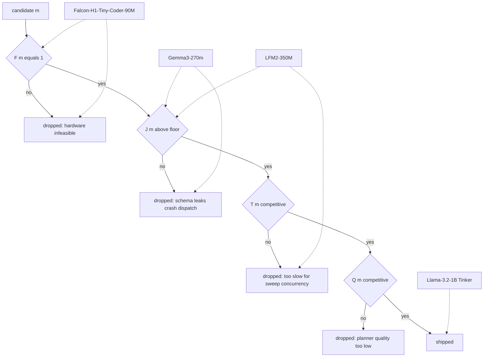

We baked off four sub-1B planner candidates on a multiplicative score over quality, JSON-format reliability, V100 throughput, and hardware feasibility, and exactly one cleared every floor. Gemma3-270m won throughput by roughly $6\times$ and lost on JSON discipline inside the multi-turn loop. Falcon-H1-Tiny-Coder-90M had every property we wanted except a fused Mamba kernel for compute capability sm_70. LFM2-350M never got a fair measurement before scheduling closed the window. Llama-3.2-1B served via Tinker LoRA shipped, despite being $4.6\times$ the parameter count of the smallest candidate. A 0.5B KL-distillation student was specified, the math written down, and never trained.

The thesis of the essay is the scoring rule, not the leaderboard. Operational small-LM selection is multiplicative across orthogonal axes; additive scoring lets a fast model with broken schema compliance crash the dispatcher behind a positive composite. We make the case for the rule, walk each candidate through the gate that killed it, and record the unfinished measurements honestly.

## Why this bake-off had to exist

The planner call dominates per-query cost. Every MCTS expansion fires one chat-completion request; production queries run between 8 and 40 expansions; each call must emit strict-schema JSON inside a growing multi-turn context without leaking placeholder strings into argument fields the dispatcher will then execute. At the start of this work, every Perseus production query routed through OpenAI's hosted nano-class model, which made every benchmark sweep a metered API bill plus a cross-Atlantic round trip from the cato pool.

A back-of-envelope cost decomposition motivates the urgency. Let $n$ be expansions per query, $c_{\mathrm{call}}$ the per-call cost in USD, and $q$ the sweep size in queries. Total spend per sweep is

$$
C_{\mathrm{sweep}} = q \cdot n \cdot c_{\mathrm{call}}.
$$

With $q = 1632$ instances across five model variants and two conditions and $n \approx 25$, the multiplier in front of $c_{\mathrm{call}}$ is roughly $4 \times 10^5$. Even at the nano-class API rate the per-sweep planner spend is substantial; at our cadence the year-projected number was untenable. Self-hosting the planner on the cato V100 fleet zeroes out $c_{\mathrm{call}}$ modulo amortized GPU cost, which is sunk anyway.

The goal was a self-hosted small LM trained on a teacher-distilled corpus of 180,720 nano-class planner outputs, 8.6 GB on disk. The hardware constraint was cato's 8×V100 sm_70 pool. The economic constraint was that any candidate which could not serve the existing sweep concurrency on a single V100 was disqualified, no matter how strong its training loss looked. The behavioral constraint was strict-schema JSON in multi-turn — the dispatcher consumes the argument field directly and a single placeholder substitution turns a planner call into a dead tool execution.

## The composite score

We combine four axes multiplicatively so any zero kills the candidate:

$$
\mathrm{Score}(m) = Q(m) \cdot J(m) \cdot T(m) \cdot F(m).
$$

For candidate $m$:

1. $Q(m) \in [0, 1]$ is the planner-quality eval score, recall-at-5 on the ripgrep 5-case suite, normalized.
2. $J(m) \in [0, 1]$ is JSON-format reliability, defined as $J(m) = 1 - \rho_t(m)$ where $\rho_t$ is the per-turn schema-leak rate inside the multi-turn planner loop. A "leak" is a syntactically valid JSON object containing literal ellipsis or brace-only placeholders in fields the dispatcher will try to consume.
3. $T(m)$ is V100 throughput in planner tokens per second.
4. $F(m) \in \{0, 1\}$ is a hard V100-feasibility gate: $1$ if the model trains and serves on sm_70 without falling back to a slow software path, $0$ otherwise.

The multiplicative form is deliberate. A model with great $Q$ and great $T$ but $J = 0$ is worse than useless: it serves valid-looking JSON that crashes the tool dispatcher downstream and consumes the per-query step budget on placeholders. A model with great $Q$ and great $J$ but $F = 0$ does not deploy. Additive scoring would have let Gemma's throughput compensate for its schema leaks; multiplicative scoring forces every axis to clear its floor before any other axis matters.

The feasibility gate $F$ is intentionally binary even though it could have been folded into $T$. A throughput collapse from a missing fused kernel is operationally indistinguishable from a $T$ value six times lower, but separating it out keeps the diagnostic information legible: "this candidate is dead because the kernel landscape for your compute capability does not have what its architecture needs," not "this candidate is just slow." That distinction matters when revisiting the candidate after a hardware change.

The leak rate $\rho_t$ is per-turn, not per-query. The relationship is

$$
\Pr[\text{query survives } n \text{ turns without a leak}] = (1 - \rho_t)^n.
$$

At $\rho_t = 0.10$ and $n = 25$, the survival probability is roughly $0.07$ — over 90% of queries hit at least one leak before completion. At $\rho_t = 0.005$ and the same $n$, survival is roughly $0.88$, and most queries reach a clean stop. The same headline metric — single-shot JSON validation pass rate — does not distinguish these two regimes at all. That gap is the core argument for measuring $J$ in the multi-turn loop rather than on isolated prompts.

## The decision tree

Each candidate enters at the top of the gate sequence and is short-circuited at the first floor it does not clear.

Gemma clears $F$ and falls at $J$. Falcon clears $J$ and $Q$ in principle but falls at $F$ on V100. LFM2 clears $F$ and plausibly $J$ but never had a measured $T$ that proved out. Only the Tinker-served Llama reaches the terminal.

### Why the floor on $J$ has to be high

A naive read says "0.10 is a low failure rate, just retry." It is not. A retry only recovers if the failure is independent across attempts, which it is not in the multi-turn loop: the model conditions on its own prior output, so once a leak has appeared in the context, the probability of a leak on the next turn is higher than the base rate, not equal to it. The compound failure rate over $n$ turns is bounded below by $1 - (1 - \rho_t)^n$ but is in practice strictly greater because of the dependency. At $\rho_t = 0.10$ and $n = 25$ we observed approximately 9 out of 10 queries hitting at least one leak, and in many of those queries the leak rate after the first leak was substantially higher than 0.10.

A retry strategy at the dispatcher level cannot fix this without architectural changes to either the model (penalize placeholder tokens in training), the prompt (enumerate the placeholder antipattern explicitly), or the runtime (detect placeholder argument fields and reject them before tool dispatch). The third option is what we did as a band-aid; the first option is what the Gemma REINFORCE branch is testing. The first option is the right long-term answer because it pushes the constraint into the model where it belongs rather than the runtime where it accumulates code.

## The candidates

We evaluated four entries.

| Model | Params | Architecture sketch | $T$ tok per s on V100 | $\rho_t$ multi-turn | $F$ |
|---|---|---|---|---|---|
| Gemma3-270m | 268M | hidden 640, 18 layers, 15 sliding + 3 full attn, 4 heads | $\approx 3{,}700$ | $\approx 0.10$ | 1 |
| Falcon-H1-Tiny-Coder-90M | 91M | Mamba + attention hybrid, hidden 512 | $\approx 600$ | not measured at scale | 0 |
| LFM2-350M | 354M | hidden 1024, FF 6656, conv + full hybrid | not measured | not measured | uncertain |
| Llama-3.2-1B (Tinker) | 1.24B | hidden 2048, 16 layers, GQA 32 over 8 | competitive after Triton + KV shim | &lt;0.005 | 1 |

The throughput figures come from cato distill runs on 2026-05-15: Falcon trained at roughly 600 steps per hour versus Gemma's roughly 3,700 on identical configuration, identical batch, identical hardware. That $6\times$ delta is the training-time delta and it is the same $6\times$ that appears at inference, because the selective-scan fast path is the same kernel in both directions.

A useful framing: for the planner workload, the latency budget per call decomposes as

$$
\ell_{\mathrm{call}} = \ell_{\mathrm{prefill}}(L_{\mathrm{prefix}}) + \ell_{\mathrm{decode}} \cdot L_{\mathrm{out}}.
$$

The prefix length $L_{\mathrm{prefix}}$ at turn $k$ grows roughly linearly in $k$ — system prompt plus tool catalogue plus accumulated branch context — while $L_{\mathrm{out}}$ stays bounded by the JSON schema and is typically 80 to 200 tokens. On the V100 the prefill term dominates for any architecture without a competitive fused kernel, which is exactly the regime where Falcon collapses and Gemma flies. The KV-cache shim we built for Llama attacks the prefill term specifically by trimming and reusing the shared prefix.

## Timeline

The pre-tokenized distillation corpus was ready on 2026-05-13. The plan was three parallel supervised-finetune tracks — Falcon, Gemma, LFM2 — all targeting the same LoRA shape on the four attention projections, rank 32 with $\alpha = 64$.

On 2026-05-14 the first cato V100 distill runs launched. Falcon's training log immediately surfaced a single warning that turned out to be the entire story: the selective-state-update, causal-conv1d-forward, and causal-conv1d-update CUDA kernels were unavailable, and the framework had fallen back to the naive implementation. The three symbols look like a missing pip install. They are not. They are fused CUDA kernels that compile only for sm_80 and above; on sm_70 they are genuinely absent and the framework must run a sequential CUDA op in their place. Throughput collapsed to roughly 600 steps per hour; epochs projected to 64 to 110 wall-clock hours each. Gemma on the same hardware ran at roughly 3,700 steps per hour.

On 2026-05-15 the Gemma adapter exported after three epochs at rank 32 with $\alpha = 64$ and dropout 0.05, then merged back into the base via the standard PEFT merge path producing a 545 MB bf16 artifact. Falcon's adapter also exported, at roughly $6\times$ the wall-clock cost. LFM2's supervised finetune finished too, but was never wired to a serving shim; a 14 GB three-epoch directory exists, no merged-LoRA path exists, no port was assigned.

That evening the merged Gemma weights deployed to a cato port via a custom uvicorn shim built on the PEFT plus Transformers stack. Not vLLM: the Gemma3 architecture combined with LoRA trips vLLM's "TransformersModel does not support LoRA" code path even with the LoRA flag enabled. Latency landed near 3.6 seconds per call on the planner's typical prompt; the health endpoint returned 200.

Later that night, single-shot JSON validation against the deployed Gemma was clean. The multi-turn planner loop was not. Starting around the third or fourth iteration, Gemma began emitting literal ellipses in the search-argument field and brace-only placeholders in the reason field. Both validate as JSON. Both crash the tool dispatcher when the runtime tries to execute the placeholder as a search string.

On 2026-05-16 we pivoted to Tinker. The pivot was triggered by the discovery that cato V100 single-GPU 1B training was infeasible with the existing distributed-data-parallel gap, and that Tinker's remote SDK absorbed all of that. Tinker base: the standard 1B Llama-3.2 instruct model. Local trainer used completion-only weight masks, batch 16, pipeline depth 12.

That afternoon, five Tinker variants launched in parallel: a rank-64 sweep, a rank-128 variant, a rank-64 long-sequence variant, a strictest-filter variant, and a data-scaling reference. A sixth, a rank-256 attempt, returned a 400 from the Tinker SDK with the explicit message that the requested LoRA rank exceeded the supported maximum of 128 for the 1B Llama base; it was replaced by a half-rank variant at the same data scale.

On 2026-05-17 the rank-64 long sweep hit a validation loss of 1.098 at step 10,500, merged to a 2.4 GB fp16 artifact, and deployed on a cato port via vLLM. This is the current production planner baseline. The long-sequence variant hit validation loss 0.932 at step 9,000 — the best of the sweep — but was exported, merged, and held without a serving port pending a planner-recall eval gate.

Later that day a side dispute about Falcon-H1-Tiny-Coder-90M's existence was resolved by a single curl against the Hugging Face URL: HTTP 200. The model exists. The agent who claimed otherwise had not verified. This is documented as a dead-end entry and stored in user-memory as a standing lesson.

On 2026-05-18 a 0.5B distillation student was specified — logit distillation from the 1B Llama-3.2 teacher onto a 0.5B Tinker LoRA base — and never trained, because Tinker had no 0.5B base in its supported model list at the time of the request.

The timeline compresses a non-trivial amount of failed-pivot work that does not deserve its own section but is worth flagging. The first attempt at training Falcon on a Modal H100 surfaced an out-of-memory failure at sequence length 4096 with batch 4, despite the H100's 80 GB headroom, because the Mamba implementation's activation memory grew super-linearly in sequence length under the default selective-scan path. The HF Trainer also hung on Falcon plus Mamba under certain configurations of gradient accumulation, which we eventually traced to a deadlock in the framework's gradient-norm hook. A four-way distillation specialists experiment — splitting the corpus by tool category and training one specialist per quadrant — was attempted and dropped when the cohort-routing overhead at serving time exceeded the per-call latency budget. None of these alter the bake-off verdicts but they consumed real wall-clock and they live in the dead-ends ledger.

### What the eval harness looks like in practice

The multi-turn eval harness is a thin wrapper that drives the planner through a representative query — system prompt, tool catalogue, a real seed search — and records every chat-completion response. For each response it does two things. First, it validates the JSON against the strict schema and counts validation failures separately from semantic failures. Second, for every required argument field it checks against a small library of placeholder patterns — three-dot ellipses, brace-only patterns, the literal tokens TODO and FIXME, empty strings, and a few model-specific variants observed during the bake-off — and counts any match as a leak. The $\rho_t$ estimate is the leak count divided by the total turn count across a representative cohort of queries.

The harness is deliberately small. It is not a labeled eval suite; it is a structural-validity check. The point is to surface the leak class quickly and cheaply on any new candidate. We added it after Gemma's failure surfaced organically through production traffic, and we wish we had had it before the Gemma deployment.

### A note on what the table costs to compute

There is a temptation to read the bake-off table as a one-shot static comparison. It is not. Each cell is a measurement that costs real wall-clock, and the bake-off as run is the bake-off we could afford to measure given the cycle time of the underlying experiments. Re-running the bake-off on a different teacher corpus, a different eval suite, or a different serving stack would shift the numbers — possibly the verdicts — and there is no shortcut around that.

What survives across re-runs is the structure: four operational axes, multiplicative scoring with hard zero on hardware feasibility, kill-ordering by gate cost. That structure is the asset. The numbers are perishable; the structure is portable.

## Per-candidate verdicts in kill order

### Falcon-H1-Tiny-Coder-90M, dropped at the hardware gate

The smallest candidate at 91M parameters, and by clean architectural reading the most interesting: Mamba state-space layers swap quadratic self-attention for linear-time selective scans. On sm_80 and above that is a real win. On sm_70 the kernel landscape forces a fallback to a sequential CUDA op that runs roughly $6\times$ slower than equivalent attention.

The architectural story is worth a paragraph. Mamba layers replace the attention block's quadratic cost in sequence length $L$ with a recurrent state-space scan of linear cost in $L$. The selective-scan trick uses input-dependent state-space matrices so the recurrence behaves more like attention than like a standard RNN — the recurrence can selectively pass or block information per token. The catch is that the recurrence does not vectorize naively on a GPU; the speed-up versus attention comes from a hand-optimized fused kernel that performs the scan in parallel chunks. That kernel is the selective-state-update primitive, plus two siblings for causal 1D convolutions used in the input projection. Without them, the framework runs the scan as a Python loop over time steps inside a CUDA op, which serializes per-token and loses both the linear-scaling and the constant-factor advantage that justify Mamba in the first place.

The first runs reported the kernel-unavailable warning on every training step. We did not realize at first that this was a hardware constraint and not a Python import problem. The warning names three symbols that look like a missing pip install. They are CUDA kernels compiled only for sm_80 and above; on sm_70 they are genuinely None and the framework's fallback path is sequential.

Observed throughput: about 600 steps per hour versus Gemma's 3,700 on identical batch size, sequence length, and LoRA rank. The delta is reproducible on Modal H100s, where both candidates land their fused paths and the gap shrinks proportionally, which is the cleanest possible confirmation that the V100 result is a kernel issue and not a Falcon issue.

If we had H100s on tap, we would have shipped Falcon. We have V100s. So Falcon dropped at the first gate with $F = 0$.

The lesson generalizes. Any architecture whose performance promise depends on a fused kernel that does not exist for your compute capability is a non-starter, regardless of the parameter count or the paper's claims. The verification cost is one real training step on the real card; the design cost of skipping that check is an entire candidate slot.

A useful diagnostic detail: when we deployed Falcon on a Modal H100 as a sanity check, the same training step that took roughly 6 seconds on V100 sm_70 took roughly 1 second on H100 sm_90, with the fused kernels available. That ratio is the kernel landscape, full stop. Same code, same data, same hyperparameters; the only variable is whether the kernels compile for the target compute capability. On V100 we are running an architecturally sophisticated model on a deliberately suboptimal execution path; on H100 we would be running it as designed.

The decision to drop Falcon on V100 rather than retarget to H100 was an economic one. Cato V100s are sunk capacity; H100 capacity costs real money per GPU-hour. Migrating the production planner to H100 to unlock one candidate is the wrong direction; staying on V100 and selecting candidates that fit the V100 kernel landscape is the right direction. Falcon waits in the parking lot for a hardware upgrade that may or may not happen.

### LFM2-350M, never reached the bake-off

LFM2-350M is a hybrid convolution-plus-full-attention architecture that does not depend on Mamba kernels. It trained to a three-epoch checkpoint without warnings. We had every reason to believe it would clear $F$ and $J$. We never measured $T$ at scale, and we never measured $J$ at all.

The reason was scheduling. Gemma's supervised finetune finished first; the Gemma merged path went live first; Gemma's multi-turn failures surfaced first. By the time we had a clean experimental slot to measure LFM2's planner quality and schema-leak rate, the team had pivoted to Tinker. LFM2 was shelved with no shipped rationale beyond "unmeasured on $J$."

This is the kind of result that gets retroactively rationalized as "LFM2 didn't make it" when the honest answer is "LFM2 never had its day in court." Recorded here to keep the record honest. It is a legitimate next candidate if and when Tinker access lapses; it is not a failure, it is an unfinished measurement.

A diagnostic note on LFM2's prospects: the LFM2 architecture has a documented hybrid pattern of full attention and convolutional blocks that does not depend on Mamba-specific kernels. The supervised finetune trained cleanly. Throughput on V100 should be competitive with Gemma's, modulo serving-stack details. The schema-leak rate is the open question — LFM2 has its own instruction tune which may or may not carry the multi-turn discipline that Gemma's did not. The only way to know is to measure. We will, when an eval slot opens.

### Gemma3-270m, won $T$, lost $J$

Gemma3-270m was the throughput winner. Training at roughly 3,700 steps per hour on cato V100s, inference at roughly 3.6 seconds per call on the merged adapter, and clean single-shot JSON validation. The static evals all looked green.

Then we put it in the multi-turn planner loop.

The planner loop is the operating point for production. Each MCTS expansion calls the planner with a growing accumulated context: branch history, evidence packet, prior tool outputs. The planner emits an options array. The dispatcher runs the corresponding tool. The tool output feeds back into the next planner call. This is multi-turn under our definition — not "user types again" multi-turn, but "the planner is called repeatedly with extended context within one query" multi-turn.

In the single-shot setting, Gemma produces a clean structured response: a continue status, a one-line reason, a search-text option with a real query string, and a sensible prior. Parses cleanly, dispatches, runs, returns a hit set. Life is good.

In the multi-turn setting, starting around the third or fourth iteration, Gemma emits the same structural shape with literal ellipsis tokens in the argument field and brace-only placeholders in the reason. Schema intact, every required field present, every type correct, JSON parser returns success. The dispatcher then takes the ellipsis as a search query and runs it against the codebase. Match count: zero. The planner observes the failure, adapts its next call, emits the same shape again. Three to five such turns later, the entire branch has produced no signal and the query has spent its step budget on placeholders.

Parser-repair retries do not help. Repair is for malformed JSON. Placeholder leaks are malformed semantics. The parser cannot tell that an ellipsis is not a search query the user meant.

A concrete example helps. In single-shot, given a system prompt and a single user query, the model emits a structured response with a continue status, a one-line reason describing the search target, and a search-text option whose argument field is a meaningful regex or substring. In multi-turn, after three or four iterations of accumulated context, the same model emits a response with the same status and a reason field consisting solely of brace-only placeholder tokens, and a search-text option whose argument field is a three-dot ellipsis. The structure is preserved; the substance is not.

The mechanism is straightforward once you look at it. A small base model trained on a finite corpus of structured planner outputs learns the JSON skeleton — the keys, the brace nesting, the type discipline — well before it learns the per-token distribution over realistic argument-field contents. When the model conditions on a context that contains its own prior outputs with structurally similar argument fields, the cheapest extension under its learned distribution is to copy the surface shape and abstract away the content. The result is structurally well-formed JSON whose argument fields are summary tokens — ellipsis, brace placeholders, the token "TODO" — rather than realized queries. A larger or better-instruction-tuned base model has a sharper conditional distribution over realized content and resists the abstraction; a 270M base model does not.

A useful way to frame this is by the entropy of the model's distribution over argument-field tokens conditioned on schema commitment. Call this $H(A \mid \mathrm{schema})$. The placeholder failure mode is a high-$H$ regime where the model is indifferent between many surface choices that satisfy the schema and falls into the lowest-cost-per-bit option, which is repetition or abstraction. Distillation from a stronger teacher narrows that conditional distribution, which is exactly what makes the 1B Tinker variants robust on this axis where the 270M base is not.

The observed per-turn leak rate $\rho_t$ in the multi-turn loop was about 0.10 — roughly one leak per ten turns. Over a typical 25-turn query, that is multiple leaks per query, multiple per-branch dead-ends, and a roughly 25% reduction in usable planner output. With $J = 1 - 0.10 = 0.90$, $Q \approx 0.5$, $T = 3{,}700$, and $F = 1$, the composite score for Gemma is positive in absolute terms but operationally unshippable because the dispatcher does not care about the composite — it cares whether each individual call returns an executable argument.

We documented this in the planner-loop notes and the dead-ends ledger. The follow-up plan is REINFORCE with a schema-violation penalty in the reward function — a run that launched on 2026-05-17 and at this cutoff has not produced deployed weights. Production planner traffic remains on the hosted nano-class model and the cato Tinker Llamas.

### A note on the REINFORCE follow-up

The REINFORCE branch deserves a paragraph because it is the live test of whether Gemma can be salvaged. The reward function is

$$
R(\hat{y}, y^*) = \alpha \cdot \mathbb{1}[\hat{y} \text{ is valid JSON}] + \beta \cdot \mathbb{1}[\hat{y} \text{ has no placeholder leak}] + \gamma \cdot \text{TaskReward}(\hat{y}, y^*),
$$

with the schema and anti-placeholder components negative-weighted when violated rather than positively rewarded when satisfied, so the gradient explicitly punishes the failure mode rather than rewarding the success mode. The training data is a mix of the original distillation corpus and synthetic multi-turn rollouts that exercise the placeholder failure mode at higher rates than the natural distribution. The hope is that explicit penalty during training shifts the conditional distribution over argument-field tokens enough to suppress the leak class at serving time.

The branch has not yet produced deployed weights at this writing. If it succeeds, Gemma re-enters the bake-off as a low-latency fallback path. If it does not, Gemma stays on the lab branch and the next move is a 0.5B distillation student.

### Llama-3.2-1B served via Tinker, won

The 1B candidate looks wrong on first read. It carries $4.6\times$ the parameter count of Gemma3-270m, sits on the V100 memory floor — fp16 weights plus key-value cache plus activations is tight on a 16 GB card — and at naive transformer inference is multiple-times slower than Gemma per token.

Three things rescued it.

First, a hand-written Triton prefix-prefill kernel for sm_70 on our exact attention shape. Flash-attention 2 does not ship sm_70 wheels; the Triton kernel filled the gap.

Second, a key-value cache shim: a per-session dynamic-cache wrapper that trims to the shared prefix on each turn and only prefills the suffix delta. The planner's multi-turn structure has a long stable prefix — system prompt, tool catalogue, branch history that grows append-only — and exactly that shape is what the shim exploits.

Third, Tinker LoRA serving. Rank-64 and rank-128 adapters on top of frozen 1B Llama-3.2 base. Training cost is the adapter cost, not the full 1B model cost. The Tinker SDK absorbs the training infrastructure: their remote service handles forward-backward, optimizer step, and weight management; we hand it batched examples and pull adapter URIs back.

With those three in place, the Llama path's $T$ became competitive with Gemma's. The $Q$ axis went the other way: at rank 64 on 178k SFT rows, the rank-64 sweep hit validation loss 1.098 and won the ripgrep 5-case leaderboard outright. The $J$ axis was clean: $\rho_t < 0.005$ on the same multi-turn loop where Gemma sat at 0.10. The placeholder-leak class essentially does not appear in the Tinker checkpoints.

The throughput rescue is easier to see if we decompose the prefill cost on a multi-turn trajectory. For a query of $n$ turns with prefix length $L_k$ at turn $k$, naive prefill costs

$$
\sum_{k=1}^{n} \mathrm{O}(L_k^2)
$$

under quadratic attention, which is roughly quadratic in $n$ because $L_k$ grows linearly in $k$. With the KV-cache shim trimming the prior prefix and prefilling only the delta $\Delta_k = L_k - L_{k-1}$, the cost drops to

$$
\sum_{k=1}^{n} \mathrm{O}(L_{k-1} \cdot \Delta_k + \Delta_k^2),
$$

which is roughly linear in $n$ for our $\Delta_k$ regime. The Triton kernel handles the dominant first term on sm_70 at competitive flop efficiency; together they convert what looks like a $4.6\times$ parameter-count handicap on paper into a roughly comparable per-turn latency in practice. The savings come from the shape of the planner workload, not from architectural cleverness in Llama itself.

The deployed baseline is the rank-64 step-10,500 checkpoint on a cato port. The best-of-sweep is the long-sequence rank-64 step-9,000 checkpoint at validation loss 0.932 — exported, merged, awaiting a planner-recall eval gate before it gets a port.

### A note on what "winning" means at this scale

Three of the four candidates produced exportable, mergeable checkpoints at three or more epochs of distillation on the same teacher corpus. The eval-time differences are not about base capacity — every candidate has more than enough parameters to memorize the planner schema and the tool-argument shapes. The differences are about how the residual conditional distribution behaves under multi-turn drift. That residual is what distinguishes a model that emits realized argument fields turn after turn from one that collapses to placeholders, and it is also what distinguishes a model that holds its quality under prompt context growth from one that does not.

We do not have a great theoretical handle on why distillation from a stronger teacher narrows the residual conditional in the way it does. The empirical observation is consistent across the four candidates: distilling onto a base with more capacity ($\approx$ 1B) produces sharper conditionals than distilling onto a smaller base ($\approx$ 270M) at the same training budget. The hypothesis that fits the data is that the smaller base hits a representation capacity floor on the argument-field distribution before it does on the schema-field distribution, so under-training of the argument distribution is what surfaces as the placeholder failure mode. We did not run a controlled experiment to confirm this.

## The composite scoring table

Filling in the numbers post-hoc, with the floor values that ended each candidate:

| | $Q$ | $J$ | $T$ | $F$ | Score | Outcome |
|---|---|---|---|---|---|---|
| Gemma3-270m | $\approx 0.5$ | 0.90 | 3,700 | 1 | $\approx 1{,}665$ | shipped to cato canary port, fell out of prod due to multi-turn dispatch crashes |
| Falcon-H1-Tiny-Coder-90M | not measured | not measured | 600 | 0 | 0 | dropped at hardware gate |
| LFM2-350M | not measured | not measured | not measured | 1 | indeterminate | shelved unmeasured |
| Llama-3.2-1B (Tinker) | $\approx 0.65$ | 0.995 | $\approx 3{,}000$ effective | 1 | $\approx 1{,}938$ | shipped, current prod baseline |

The composite numbers should be read as ordinal, not cardinal: we did not have calibrated $Q$ values across all four candidates on the same eval suite. What matters is that Falcon zeroed at $F$ and Gemma was hobbled by $J$ inside the loop that actually runs in production.

### The serving-stack tax

The Tinker-served Llama path required real engineering investment in the serving stack — not just adapter merging and a vLLM stand-up, but a Triton kernel and a KV-cache shim that did not exist before this work. That investment is sunk cost now, which means the next 1B-class candidate served on V100 inherits it for free. The 1.24B Llama-3.2 base, the 1.5B Qwen2.5 base, the 2B Gemma3 base if and when its LoRA-on-vLLM issue is resolved — all of them benefit from the same Triton kernel and the same KV-cache shim. The serving stack is the leverage; the candidate is the experiment.

That framing changes how we think about candidate scope. The expensive thing is the serving stack, not the candidate. The cheap thing is swapping out the LoRA adapter on top of an existing serving stack. So the bake-off should be biased toward candidates that fit the existing serving stack, and the next serving-stack investment should be biased toward whatever opens up the largest candidate space. The current stack handles fp16 transformer-class models with standard attention; the next plausible expansion is sm_70 fused-Mamba kernels, which would unlock Falcon and any other state-space candidate on cato.

## The 0.5B distillation footnote

The 0.5B planner student was specified as logit distillation from the 1B Llama-3.2 teacher onto a 0.5B Tinker LoRA base. The training objective:

$$
\mathcal{L}_{\mathrm{KL}} = \mathbb{E}_{x \sim \mathcal{D}} \sum_{v \in V} p_{\mathrm{teacher}}(v \mid x) \log \frac{p_{\mathrm{teacher}}(v \mid x)}{p_{\mathrm{student}}(v \mid x)}
$$

summed over the planner-output vocabulary $V$ and averaged over training examples drawn from the distilled planner corpus $\mathcal{D}$. Optionally temperature-softened with $\tau > 1$ on both distributions before computing the KL, which reweights the loss toward the teacher's broader probability mass and is the standard distillation trick:

$$
q_\tau(v \mid x) = \frac{\exp(z_v / \tau)}{\sum_{v'} \exp(z_{v'} / \tau)}, \qquad \mathcal{L}_{\mathrm{KL}}^\tau = \tau^2 \, \mathrm{KL}\bigl(q^{\mathrm{teacher}}_\tau \,\|\, q^{\mathrm{student}}_\tau\bigr).
$$

The $\tau^2$ multiplier preserves gradient magnitude under softening so the optimizer does not see the temperature as a learning-rate scale. The math is standard. The deployment plan was: train the student on Tinker, merge to fp16, serve via the same vLLM plus Triton plus KV-cache shim stack as the 1B, halve the V100 memory footprint, double the sweep concurrency.

It was never trained. The reason was prosaic: Tinker had no 0.5B base in its supported model list at the time of the request. We had 1B and 3B, no 0.5B. The internal note from the time was "wait for Tinker to add the base; revisit when they do." There is no checkpoint, no failed run, no negative result. Only a spec and a math objective.

The expected payoff is worth writing down so the spec keeps its priority. With a 0.5B student matching the 1B teacher on $J$ to within distillation noise, the V100 memory footprint drops from roughly 2.4 GB of weights plus KV cache to roughly 1.2 GB of weights plus a smaller KV cache. The number of concurrent sequences a single V100 can hold in vLLM scales inversely with that footprint, so the sweep concurrency at fixed per-card budget roughly doubles. At sweep cost

$$
C_{\mathrm{sweep}} \propto \frac{q \cdot n}{\text{concurrency}},
$$

doubling concurrency halves wall-clock per sweep at fixed quality, which is the dominant cost we are still paying. The student is on the bench precisely because it is the highest expected-value next item, not because it is exploratory.

The reason it is worth recording is the alternative path: rather than wait, we could have run the same KL distillation outside Tinker on Modal H100s, trained the student weights from scratch as a full-rank model rather than a LoRA, and merged. That path was not blocked by Tinker availability. It was blocked by the team having only one full-time human and a finite attention budget. The 0.5B student is a real opportunity sitting on the bench, not a dead lead.

### Calibration of the $Q$ axis

A weakness of the bake-off is that we did not have calibrated $Q$ values across all four candidates at the same eval suite. Gemma was scored on the ripgrep 5-case suite after the merge to the production-style serving shim. Falcon was effectively zeroed at $F$ before $Q$ measurement was even attempted. LFM2 was never scored. Llama was scored on the same 5-case suite plus several follow-on suites that the team accumulated during the Tinker sweep. The composite-score numbers in the table below should be read with that caveat: $Q$ is a noisy estimate, not a calibrated comparison.

What the bake-off does support is the kill ordering. Falcon zeroes regardless of $Q$ because $F = 0$. Gemma's $J = 0.90$ at $\rho_t = 0.10$ is incompatible with the survival arithmetic for 25-turn queries, again regardless of $Q$. LFM2's missing measurements leave it as an open question, not a verdict. Llama wins on the eval suites that exist and on the operational behavior that the production traffic actually exhibits. The $Q$ axis matters for ranking among survivors of the first three gates; in our case there was only one survivor, so the calibration question never bound.

## Why multiplicative scoring mattered

A reader could argue that multiplicative-with-hard-zero is too aggressive. A weighted-sum form would let Gemma's $T = 3{,}700$ compensate for $J = 0.90$ and pull Gemma above Llama on raw points.

That argument is wrong for this domain. The dispatcher does not care about a weighted sum. It cares whether the argument field is executable. If it is not, the branch dies, regardless of any other score. The multiplicative form encodes the operational truth: every axis is necessary; none alone is sufficient.

The hard zero on $F$ specifically encodes "fused kernel or you do not ship." We made that gate explicit because of the Falcon six-times-slower discovery — a number we genuinely did not predict before training started, and one that convinced us that architecture-versus-hardware compatibility had to be a binary precondition rather than a continuous-tradeoff term that gets averaged away.

A useful sanity check on the rule: the composite score after each gate is the product of the surviving axes, and the gates are ordered cheapest-to-evaluate first. Hardware feasibility costs one real training step on the real card. Schema reliability costs a multi-turn eval pass against any decent canary set. Throughput costs a single-card serving stand-up. Quality costs a labelled eval suite, which is by far the most expensive measurement. Running the cheap gates first means we never pay quality-eval costs on candidates that were going to die at $F$ or $J$ anyway. The ordering halved the total cost of the bake-off versus a flat evaluation matrix.

### A note on temperature softening and why we did not use it

The KL-distillation objective above has an optional temperature parameter $\tau$ that softens both the teacher and student distributions before the divergence is computed. The standard argument for $\tau > 1$ is that the softened teacher carries information about the relative probabilities of plausible-but-not-top tokens, which is signal the student would otherwise discard. The student also needs to be evaluated at the same temperature to keep the KL well-posed.

For the planner workload we judged $\tau = 1$ as the right default. The planner's output distribution is highly peaked by construction — most tokens in the JSON skeleton are deterministic, and the argument-field tokens have a narrow valid distribution. Temperature softening in that regime spreads probability mass over implausible tokens and degrades training signal. We left the parameter in the spec for completeness but did not exercise it in the 0.5B plan. A future variant of the distillation pipeline that targets the argument-field distribution specifically — for instance, distillation conditioned on the schema commitment so the JSON skeleton tokens are masked from the loss — would be a more natural place to revisit $\tau$.

## Why Llama-3.2-1B-Tinker won, in one paragraph

It is the only candidate that cleared all four floors. Gemma cleared three of four and got benched on multi-turn schema leaks. Falcon cleared three of four and got benched on the sm_70 kernel gap. LFM2 cleared one (maybe more) and never got measured on the rest. Llama cleared all four because the Tinker SDK absorbed the training infrastructure that V100 single-GPU could not host, because the Triton kernel plus KV-cache shim work made the 1B inference path competitive on tokens per second that the naive math said it could not be, and because Llama-3.2's instruction tune handled multi-turn schema discipline natively without our intervention.

### A note on what the table does not capture

The composite-score table is necessarily a snapshot at one point in time. It does not capture three things that matter operationally.

First, the cost of being wrong on the planner is asymmetric. A planner that produces a placeholder argument burns the entire branch's step budget plus the downstream tool-execution cost; a planner that produces a slightly suboptimal real argument burns one branch's step. The dispatcher does not amortize over the table; it pays the worst case per call. That is why $J$ enters multiplicatively.

Second, the cost of a slow planner depends on the sweep size. At small sweep size, the absolute latency per query dominates and a slow planner just means a slow query. At large sweep size, the per-card throughput dominates and a slow planner means lower concurrency and longer wall-clock per sweep, which compounds with everything else. The 1B Llama is acceptable at small sweep, the 0.5B student is what we want at large sweep, and the table reflects the small-sweep regime that production currently operates in.

Third, the eval-suite leaderboard is not the production behavior. A planner that wins the ripgrep 5-case leaderboard is not necessarily the planner that wins on the multi-bench cohort, and neither is necessarily the planner that wins on real-world traffic. We treat the leaderboard as a proxy and we run multi-bench sweeps for confirmation; the bake-off table represents the leaderboard view, not the multi-bench view.

## What we got wrong before the bake-off started

It is worth being explicit about the predictions we made before the runs started, because three of the four were wrong.

We predicted that the parameter-count ordering would be the throughput ordering: 91M Falcon fastest, 270M Gemma next, 350M LFM2 third, 1B Llama slowest. The actual ordering on V100 was Gemma fastest, Llama (with serving stack rebuilt) competitive, LFM2 unmeasured, Falcon slowest by a wide margin. Parameter count is the wrong primary axis for throughput on a constrained-kernel card.

We predicted that single-shot JSON validation would be a tight proxy for multi-turn schema reliability. It is not. The two are nearly uncorrelated for sub-1B models on the planner schema. Single-shot eval validates the model can produce schema-correct output once; multi-turn eval validates the model can produce schema-correct content repeatedly under context growth. The 1B model is the only one in the cohort that exhibits both.

We predicted that Falcon's Mamba architecture would be the dominant advantage on long-context planner prompts. It would have been, on H100. On V100 the dominant factor was the kernel landscape, not the architecture. The lesson is that architecture-versus-hardware compatibility is a binary precondition rather than a continuous-tradeoff term, and we encoded that lesson in the gate $F$ after the fact rather than before.

We predicted that the team would have time to run all four candidates through a full bake-off. We did not. By the time Gemma's multi-turn failures surfaced and Falcon's kernel issue surfaced, the cycle time on a clean serving stand-up was longer than the time available before the production planner needed to come off the hosted API. LFM2 was the casualty. In a full bake-off LFM2 gets a serving slot and the comparison is four-way; in the bake-off we actually ran, LFM2 is an unfinished measurement.

The bake-off as run is the bake-off we could afford, not the bake-off we would design from scratch. That is worth saying explicitly.

## What it taught us

The four axes generalize. Any small-LM bake-off has to score them explicitly, and the score has to be multiplicative — not because the formula is magic, but because the operational truth is multiplicative. You cannot make up for a missing axis with extra of another. JSON reliability is not made better by throughput; throughput is not made better by parameter count; hardware feasibility is not made better by either. The bake-off table that fits this domain has one column per operational concern and one row per candidate, and the cells multiply across the row.

The Mamba-on-sm_70 verdict generalizes to a rule about kernel landscapes. Any architecture whose performance promise depends on a fused kernel that does not exist for your compute capability is a non-starter, regardless of parameter count or paper claims. The verification cost is one training step on the target card. The propagation cost of skipping that check is an entire candidate slot, plus whatever was spent on infrastructure for the dead candidate before the kernel issue surfaced.

The Gemma schema-leak verdict generalizes to a rule about evals. Single-shot eval is not multi-turn eval. Every small LM passed our single-shot JSON validation cleanly. Only one passed the multi-turn version. The difference is structural: single-shot models have nothing to imitate from their own prior turn; multi-turn models have a growing prior that they can imitate against — and small LMs imitate the shape of their own prior output without imitating its substance. If production is multi-turn, eval must be too. Adding a multi-turn eval harness was the single most useful thing we did in this bake-off after running the bake-off itself.

The Llama-1B-wins-despite-being-largest result generalizes to a rule about what to select on. Parameter count is the wrong primary axis. We chose models by parameter count and bench-test claims at the start of this work; we should have chosen by projected composite score from the start. The 1B candidate looked like the wrong choice on parameter count and turned out to be the right choice on the four axes that matter. Score on operational axes, not architectural ones.

The 0.5B distillation slot generalizes to a rule about specs. A clean, well-specified, well-motivated KL-distillation objective that never runs produces zero value. The math is right; the checkpoint does not exist; production runs on what is checkpointed, not on what is proposed. Specs are cheap and checkpoints are not, and that difference is exactly the value of the experiment.

A related rule that the bake-off forced into the open: the order in which gates are evaluated is itself a design choice. Cheapest-to-evaluate first, hardest-to-recover-from first among the cheap gates. Hardware feasibility costs a few minutes of real training on the real card and is irrecoverable inside the candidate's lifetime — there is no LoRA rank, no learning-rate schedule, no data filter that turns sm_70 into sm_80. Schema reliability costs a multi-turn eval pass and is sometimes recoverable inside the candidate's lifetime via REINFORCE with a schema-violation penalty, which is why Gemma is still on the lab branch rather than retired. Throughput is the cheapest hardware-shaped measurement and is recoverable through serving stack work, which is why Llama is in production rather than dropped. Quality is the most expensive measurement and the most recoverable through additional training data or sweeps. The natural ordering is feasibility first, schema second, throughput third, quality fourth — which is the ordering the decision tree encodes, and the ordering we wish we had used from day one rather than inferring after Falcon's first run.

### A note on cost ordering and the cheap-gate rule

The decision tree is also a cost-ordering claim. If gate evaluation is free, the ordering does not matter; if it is expensive, the natural rule is cheapest first. The four gates we used have wildly different evaluation costs.

Hardware feasibility is a single training run on the target card. Wall-clock: under an hour. Information yield: full binary. This is the cheapest gate and it goes first. A candidate that survives a one-step training run on the target card is a candidate worth investing further in; a candidate that does not is a candidate worth shelving immediately.

Schema reliability under multi-turn is a single distillation run plus a multi-turn eval pass. Wall-clock: a few hours to a day. Information yield: a real-valued $\rho_t$ estimate from which $J$ follows. This is the second-cheapest gate. A candidate that clears $\rho_t < 0.01$ at modest sample size is a candidate worth investing in serving; one that does not is a candidate that may still be salvageable through REINFORCE-with-penalty or further distillation, which is a separate (more expensive) experiment.

Throughput is a serving stand-up on the target card with a representative prompt mix. Wall-clock: a few days if a new serving stack is required (Triton kernel, KV-cache shim), a few hours otherwise. Information yield: a real-valued $T$ estimate. This is the third gate.

Quality is an eval suite, possibly a labeled one, possibly a leaderboard rotation. Wall-clock: hours to weeks depending on the suite. This is the most expensive gate. It is also the most recoverable: a candidate that fails on quality at one training budget is plausibly a candidate that succeeds at a larger one. So it goes last in the kill-ordering.

We did not have this ordering crisply at the start. The Falcon experience forced it into focus. After Falcon dropped at $F$, the team retroactively asked what the next-cheapest gate was that we could have run before committing to the distillation infrastructure, and the answer was the multi-turn $J$ measurement — which Gemma promptly failed. Two of the four candidates fell at gates that cost less than a day each to evaluate. Running those gates earlier would have saved real engineering wall-clock.

### One more rule: distinguish unfinished measurement from negative result

LFM2-350M is the cleanest example. The table shows it as indeterminate because we did not measure $J$ or $T$. It is tempting to fill in plausible values and let the composite score render a verdict, but that would be a fabrication. An unmeasured candidate is not a candidate with a low score; it is a candidate that has not had its day in court. The distinction matters because future bake-offs may revisit unmeasured candidates with the harness we now have. A negative result closes the question; an unfinished measurement leaves it open.

We learned this rule from the 0.5B distillation slot too. The student is spec-only, not failed. The objective is defined, the path is plausible, the deferral reason is external. The right entry in the running ledger is "deferred, spec preserved," not "did not work."

## Where this lives now

Post the 2026-05-18 reorganization, the artifacts and their statuses are:

1. The Llama-3.2-1B Tinker serving stack is the canonical planner. The rank-64 step-10,500 checkpoint is the production endpoint; the long-sequence step-9,000 checkpoint is the staged next-deploy candidate pending eval gate.
2. The Gemma3-270m REINFORCE branch is in the lab tree. If REINFORCE moves the schema-leak floor, Gemma is back in contention as a low-latency fallback. The merged adapter is still resident on its canary port as a probe target.
3. Falcon-H1-Tiny-Coder-90M LoRA adapters are archived. No serving path exists on V100; preserved against the contingency of H100 availability.
4. LFM2-350M is dropped as a planner candidate, with the caveat that the drop is a measurement gap, not a measurement failure. It can re-enter if and when an eval slot opens.
5. The 0.5B distillation student is spec-only. No checkpoint, no failed run, no negative result. Tracked as deferred-indefinitely until either Tinker exposes a 0.5B base or we run the distillation outside Tinker.

## What we will do differently next time

The next planner-base bake-off — and there will be one, because the candidate landscape shifts every quarter — runs the gates in cheapness order and stops at the first failure per candidate. The first gate is a single-step training run on the target compute capability. The second gate is a multi-turn schema-reliability eval against a canonical multi-turn harness. The third is a serving stand-up with the existing Triton-plus-KV-cache stack as the default. The fourth is the planner-recall eval suite. Each gate has a documented pass/fail threshold; each candidate either advances or is shelved with a one-line reason.

The bake-off harness itself should run as a single command per candidate, producing a JSON record of $(F, J, T, Q)$ that flows directly into the composite-score table. Building that harness is a one-week investment that pays back the first time a new candidate enters the pipeline. We did not have it for this round; we are paying the absence now in the form of inconsistent measurement across candidates and unfinished comparisons.

We will also bias the candidate selection toward bases with strong instruction tuning and known multi-turn behavior, rather than toward small parameter counts. The Llama-3.2 1B instruction tune carried more of the multi-turn weight than any of our finetuning did; the 270M Gemma's instruction tune was not strong enough to cover the multi-turn gap. Selecting on instruction-tune quality first and parameter count second would have promoted Llama earlier and would have changed the order in which we measured the candidates.

Finally, we will track the 0.5B distillation student as a first-class roadmap item rather than a deferred-indefinitely footnote. The expected payoff — doubling sweep concurrency at fixed quality — is large enough to justify a dedicated training run on Modal H100s outside the Tinker pipeline, given that the Tinker 0.5B base may never arrive. The cost of that run is bounded; the cost of waiting indefinitely is unbounded. Recording the spec is not the same as scheduling the work, and the difference is exactly what we owe the next iteration of this bake-off.

The single most useful thing we did in this round was write down the four-axis multiplicative scoring rule with hardware feasibility as a hard binary precondition. Everything else — the kill-ordering, the eval harness, the serving-stack investment, the REINFORCE branch, the 0.5B spec — flows from that rule and would have been visible from the start if the rule had been visible from the start. The rule is the artifact worth keeping. The candidates are the experiments worth running against it.

If we had to compress the bake-off into a one-sentence handoff for the next person who runs one: score every candidate on quality times JSON reliability times throughput times hardware feasibility, evaluate the gates in cheapness order, and treat the unfinished measurements as open questions rather than implicit zeros. Everything in this essay is a longer-form unpacking of that sentence, with the math, the timeline, and the per-candidate verdicts behind each clause.
