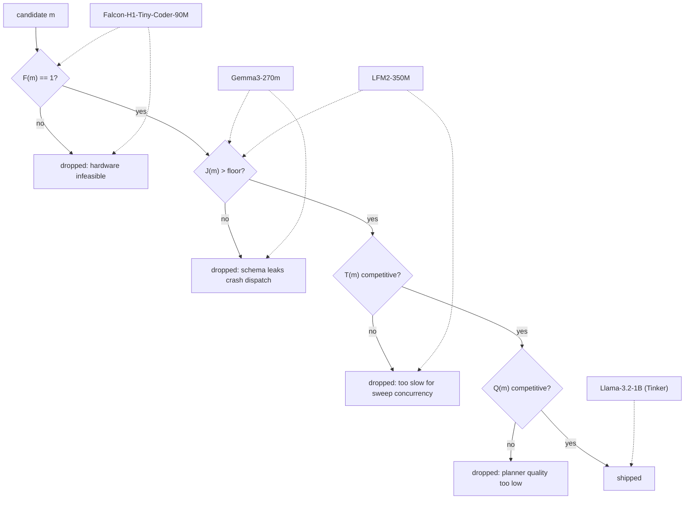

> tl;dr: We bake-off'd three sub-1B planner candidates against a 1B Tinker
> baseline, multiplicatively scoring quality, JSON-format reliability, V100
> throughput, and hardware feasibility. Gemma3-270m won throughput by 6×
> and lost on $J$. Falcon-H1-Tiny-Coder-90M had every property we wanted
> except a fused Mamba kernel for sm_70. Llama-3.2-1B-Tinker shipped. A 0.5B
> distillation student was specified and never trained.

## Motivation

The planner LLM is the call that dominates Perseus's per-query cost. Each
MCTS expansion fires one chat-completion request; production queries run
8–40 expansions; the model has to emit strict-schema JSON inside a
multi-turn loop without leaking placeholder strings. As of the start of
this work, every Perseus production query routed through OpenAI
`gpt-5-nano-2025-08-07`, which made every sweep a metered API bill plus a
cross-Atlantic round trip from cato.

The goal was to replace the planner LLM with a self-hosted small LM
trained on a teacher-distilled corpus of `gpt-5-nano` planner outputs
(`distill_corpus/plan_full.jsonl`, 180,720 rows / 8.6 GB). The hardware
constraint was cato's 8×V100 sm_70 pool. The economic constraint was
that any candidate that could not serve the existing sweep concurrency
on a single V100 was disqualified, regardless of training-loss number.

Three sub-1B candidates were on the table — Gemma3-270m, Falcon-H1-Tiny-Coder-90M,
LFM2-350M — plus a 1B Llama-3.2 reference that became Tinker's
target. This essay is the post-hoc bake-off write-up.

## Design

### Composite score

The four axes were combined multiplicatively, so any zero kills the
candidate:

$$
\text{Score}(m) = Q(m) \cdot J(m) \cdot T(m) \cdot F(m)
$$

where for candidate $m$:

- $Q(m) \in [0, 1]$ — planner-quality eval score (recall@5 on the
  ripgrep 5-case suite, normalized).
- $J(m) \in [0, 1]$ — JSON-format reliability:
  $J(m) = 1 - \rho_t(m)$ where $\rho_t$ is the per-turn schema-leak
  rate in the multi-turn planner loop. A "leak" is a syntactically
  valid JSON that contains literal `"..."` or `{...}` placeholders
  in fields the dispatcher will try to use.
- $T(m)$ — V100 throughput in planner tok/s.
- $F(m) \in \{0, 1\}$ — V100 feasibility gate: $1$ if the model
  trains and serves on sm_70 without falling back to a slow software
  path, $0$ otherwise.

The multiplicative form was chosen on purpose. A model with great
quality and great throughput but $J = 0$ is worse than useless — it
serves valid-looking JSON that crashes the tool dispatcher
downstream. A model with great quality and great $J$ but $F = 0$ does
not deploy. Additive scoring would have let Gemma's throughput
compensate for its schema leaks; multiplicative scoring forces every
axis to clear its floor.

The "V100 feasibility" gate $F$ is the special one. It is a hard
binary because the only thing $F = 0$ means is "no fused kernel" —
the model still runs, just at 1/6 the throughput. We could have
folded that into $T$, but separating it out kept the diagnostic
information ("this candidate is dead because of the kernel landscape,
not because of the model") legible in the table.

### Candidates

The four entries:

| Model | Params | Architecture | $T$ (tok/s, V100) | $\rho_t$ multi-turn leak | $F$ |
|---|---|---|---|---|---|
| Gemma3-270m | 268M | Gemma3, hidden=640, 18 layers, 15 sliding + 3 full attn, 4 heads | ~3,700 | ~0.10 | 1 |
| Falcon-H1-Tiny-Coder-90M | 91M | FalconH1 (Mamba + attention hybrid), hidden=512 | ~600 | acceptable (not measured at scale) | 0 |
| LFM2-350M | 354M | Lfm2, hidden=1024, ff=6656, conv+full hybrid | not measured | not measured | uncertain |
| Llama-3.2-1B (Tinker) | 1.24B | Llama, hidden=2048, 16 layers, GQA 32/8 | competitive after Triton kernel + KV-cache shim | &lt;0.005 | 1 |

The throughput numbers are from the 2026-05-15 cato distill runs in
`07_dead_ends.md` #13 and #50: Falcon trained at ~600 steps/hr versus
Gemma's ~3,700 steps/hr on identical config, identical batch, identical
hardware. That 6× delta is the throughput delta and it is the same
6× that shows up at inference time, because the Mamba `selective_scan`
fast path is the same kernel in both directions.



Reading the diagram: each candidate enters at the top and is short-circuited
at the first axis whose floor it does not clear. Gemma3-270m clears $F$ but
falls at $J$. Falcon clears $J$ and $Q$ in principle but falls at $F$. LFM2
clears $F$ and $J$ but never had a measured $T$ that proved out, so it was
shelved. Only Llama-3.2-1B (with Tinker LoRA serving) makes it to the
"shipped" terminal.

## Timeline

- **2026-05-13** — distillation corpus pretokenized. The plan was three
  parallel SFT tracks: Falcon, Gemma, LFM2 — all targeting the same
  `q_proj,k_proj,v_proj,o_proj` LoRA shape, rank=32/α=64.
- **2026-05-14** — first cato V100 distill runs launch. Falcon's
  training log emits the warning that turns out to be the entire story:

  ```
  The fast path is not available because one of (selective_state_update,
  causal_conv1d_fn, causal_conv1d_update) is None. Falling back to the
  naive implementation.
  ```

  Mamba selective-scan fast paths are sm_80+ only. On V100 sm_70, the
  Falcon training falls back to a sequential CUDA op. Throughput collapses
  to ~600 steps/hr; epochs project to 64–110 hours each. Gemma on the
  same hardware runs at ~3,700 steps/hr.

- **2026-05-15** — Gemma `gemma_plan_v3` exports after 3 epochs at rank=32,
  α=64, dropout=0.05 (`distill/gemma_plan_v3`, 46 MB adapter). Merged via
  `peft.merge_and_unload()` to `gemma_plan_v3_merged` (545 MB bf16).
  Falcon's `distill/falcon_plan_v3` exports too (40 MB) but at ~6× the
  wall-clock cost. LFM2 SFT finishes but is never wired to a serving
  shim — the 14 GB `v3-3ep` directory exists, no `distill/lfm2_*` LoRA
  directory exists, no port is assigned.

- **2026-05-15 (evening)** — `gemma_plan_v3_merged` deploys to `cato:19200`
  via a custom FastAPI / uvicorn `peft + transformers` shim. Not vLLM —
  gemma3 + LoRA trips vLLM's `TransformersModel does not support LoRA`
  codepath even with `--enable-lora`. Latency ~3.6s/call on the planner's
  typical prompt; health endpoint returns 200.

- **2026-05-15 (late)** — single-shot JSON validation against
  `gemma_plan_v3`: clean. Multi-turn planner loop against
  `gemma_plan_v3`: emits literal `"..."` placeholders in the
  `options[].args.query` field and literal `{...}` placeholders in
  the `reason` field. Both validate as JSON. Both crash the tool
  dispatcher when the runtime tries to use the placeholder as a
  search string.

- **2026-05-16 (morning)** — Pivot to Tinker. The pivot was triggered by
  the discovery that cato V100 single-GPU 1B training was infeasible with
  the existing DDP gap (`07_dead_ends.md` #14), and that Tinker's remote
  SDK absorbed all of that. Tinker base: `meta-llama/Llama-3.2-1B`.
  Local trainer: `tinker_train/train_ultra.py` with completion-only
  weight masks, batch=16, pipeline-depth=12.

- **2026-05-16 (afternoon)** — Five Tinker variants launch in parallel
  via `launch_variants_2026-05-16.sh`: `llama32-1b-epoch3-v3` (cato sweep,
  rank=64), `v3_r128` (rank=128), `v3_bigseq` (rank=64, seq=8192),
  `v3_superclean` (strictest data filter), `v3_r128_short` (data-scaling
  reference). A sixth, `v3_r256_short`, returns
  `tinker.BadRequestError: 400 — lora_config.rank 256 exceeds max LoRA
  rank 128 for model meta-llama/Llama-3.2-1B` and is replaced by
  `v3_r128_short` at half the rank.

- **2026-05-17** — `llama32-1b-epoch3-v3` step 10,500 hits val_loss
  1.098. Merged to `tinker_merged/llama32-1b-epoch3-v3` (2.4 GB fp16),
  deployed on cato:19320 via vLLM (`--max-num-seqs 48
  --max-num-batched-tokens 24576 --enforce-eager`). Production planner
  baseline. `v3_bigseq` step 9,000 hits val_loss **0.932** — the best
  of the sweep — but is exported, merged, and never deployed on a
  serving port pending a planner-recall eval gate.

- **2026-05-17 (later)** — Falcon-H1-90M existence dispute. One agent
  insists Falcon-H1-Tiny-Coder-90M is hallucinated. We curl:

  ```
  $ curl -sI https://huggingface.co/tiiuae/Falcon-H1-Tiny-Coder-90M
  HTTP/2 200
  ```

  The model exists. The agent had not actually verified. This is
  documented as dead-end #61 and stored as
  `feedback_verify_hf_model_existence.md` in user-memory.

- **2026-05-18** — 0.5B distillation student (task #91) is spec'd:
  logit distillation from the 1B Llama-3.2 teacher onto a 0.5B
  Tinker LoRA base, on `plan.jsonl`. The objective is KL divergence
  between student and teacher distributions over the planner output
  tokens. Never trained — no Tinker SDK base availability at 0.5B
  this round. Deferred indefinitely.

## Results

### Per-candidate verdict, in the order the bake-off killed them

#### Falcon-H1-Tiny-Coder-90M — $F = 0$ on V100

The smallest candidate at 91M, and by a clean architectural read the
most interesting: Mamba state-space layers swap quadratic
self-attention for linear-time selective scans. On sm_80+ that is a
real win. On sm_70 the kernel landscape forces a fallback to a
sequential CUDA op that is ~6× slower than equivalent attention.

The first runs reported the warning above on every single training
step. We did not realize at first that it was a hardware constraint and
not a Python import problem — the message names three symbols
(`selective_state_update`, `causal_conv1d_fn`, `causal_conv1d_update`)
that look like a missing pip install. They are not. They are CUDA
kernels that compile only for sm_80 and above; on sm_70 they are
genuinely `None`.

Throughput observed: ~600 steps/hr versus Gemma's ~3,700 steps/hr on
identical batch, identical sequence length, identical LoRA rank. The
delta is reproducible on Modal H100s (#17, #18) because the Modal
machines are sm_90 and the kernels are available — Gemma's delta
shrinks proportionally on H100 because both candidates land their
fused paths.

If we had H100s on tap we would have shipped Falcon. We do not. We
have V100s. So Falcon dropped at the first gate: $F(m) = 0$.

What this taught us: the "verify HF model existence with curl" lesson
applies in both directions. Don't claim a model doesn't exist without
a `curl -sI`; don't claim a model deploys without a fused kernel for
your target compute capability. Both are cheap checks. The agent that
insisted Falcon-H1-90M was hallucinated lost an afternoon on a fact
they could have falsified in 200ms.

#### LFM2-350M — never reached the bake-off

LFM2-350M is a hybrid conv + full-attention architecture that does
not depend on Mamba kernels. It trained to a 3-epoch checkpoint
(`v3-3ep` directory, 14 GB) without warnings. We had every reason to
believe it would clear $F$ and $J$. We never measured $T$ at scale, and
we never measured $J$ at all.

The reason was scheduling. The Gemma SFT finished first; the Gemma
merged path went live first; the Gemma multi-turn failures surfaced
first. By the time we had a clean experimental slot to measure
LFM2's planner-quality and schema-leak rate, the team had pivoted to
Tinker. LFM2 ended up shelved with no shipped rationale beyond
"untested on J." It is a legitimate next-step candidate if and when
Tinker access lapses; it is not a failure, it is just an unfinished
measurement.

This is the kind of result that gets retroactively rationalized as
"LFM2 didn't make it" when the honest answer is "LFM2 never had its
day in court." Recorded here to keep the record honest.

#### Gemma3-270m — won $T$, lost $J$

Gemma3-270m was the throughput winner. ~3,700 steps/hr training on
cato V100s, ~3.6s/call inference on `gemma_plan_v3_merged`. Single-shot
JSON validation: clean. The first round of static evals all looked
green.

Then we put it in the multi-turn planner loop.

The planner loop is the operating point for production: each MCTS
expansion calls the planner with a growing accumulated context
(branch history, evidence packet, prior tool outputs). The planner
emits the next options[] array. The dispatcher takes one of those
options and runs the corresponding tool. The tool output feeds back
into the next planner call. This is multi-turn under our
definition — not "user types again" multi-turn, but "the planner is
called repeatedly with extended context within one query" multi-turn.

In single-shot the model produces:

```json
{
  "status": "continue",
  "reason": "search for the regex compile entry point",
  "confidence": 0.7,
  "options": [
    {"tool": "search_text", "args": {"query": "compile_regex"}, "prior": 0.6}
  ]
}
```

That parses cleanly, the tool runs, life is good. In multi-turn,
starting from around the third or fourth iteration, the same model
produces:

```json
{
  "status": "continue",
  "reason": "{...}",
  "confidence": 0.7,
  "options": [
    {"tool": "search_text", "args": {"query": "..."}, "prior": 0.6}
  ]
}
```

This is the failure mode. It is **valid JSON containing wrong
values** — the schema is intact, every required field is present, every
type is correct, the JSON parser returns success. The dispatcher then
takes `args.query = "..."` and runs `search_text("...")` against the
codebase. Match count: zero. The planner observes the failure, adapts
its next call, emits the same shape again. Three to five such turns
later the entire branch has produced no signal and we have spent the
budget on placeholders.

Parser-repair retries don't help. Repair is for malformed JSON.
Placeholder leaks are malformed *semantics*. The parser cannot tell
that `"..."` is not a search query the user meant.

The observed rate $\rho_t$ in the multi-turn loop was around 0.10 —
roughly one leak per ten turns. Over a typical 25-turn query, that
is multiple leaks per query, multiple per-branch dead-ends, and a
~25% reduction in usable planner output. With $J = 1 - 0.10 = 0.90$,
$Q \approx 0.5$, $T = 3700$, $F = 1$, the composite score for Gemma
came out somewhere positive but the multi-turn dispatcher crashes
made it operationally unshippable.

We documented this in `WAKE_UP_REPORT.md` line 302 and
`07_dead_ends.md` #44. The follow-up plan was REINFORCE with a
schema-violation penalty in the reward function
(`modal_rft/reinforce.py`, launched 2026-05-17 02:25 IST as
`gemma_reinforce_v3`) — see [planner llm call](/essays/planner-llm-call/)
for the reward design. As of the cutoff this run had not yet produced
deployed weights, and the production planner traffic was on
`gpt-5-nano` and the cato Tinker Llamas.

#### Llama-3.2-1B (Tinker) — won

The 1B candidate looks wrong on first read. It has 4.6× the parameter
count of Gemma3-270m, sits on the V100 memory floor (FP16 1B weights
plus KV cache plus activations is tight on a 16 GB card), and at
naive transformer inference is multiple-times slower than Gemma per
token.

Three things rescued it:

1. **Triton prefix-prefill kernel for sm_70.** Hand-written for
   our exact attention shape on V100. Flash-attention 2 does not
   ship sm_70 wheels; the Triton kernel filled the gap. See
   [v100 serving](/essays/v100-serving/) for the kernel work that
   pays off here.
2. **KV-cache shim.** A per-session `DynamicCache` wrapper that
   trims to the shared prefix on each turn and only prefills the
   suffix delta. The planner's multi-turn structure has a long
   stable prefix (system prompt + tool catalogue + branch history
   that grows append-only) — exactly the shape this exploits.
3. **Tinker LoRA serving.** Rank-64 (and rank-128) LoRA adapters
   on top of frozen Llama-3.2-1B base. Training cost is the LoRA
   adapter cost, not the full 1B model cost. Tinker absorbs the
   training infrastructure entirely (their remote SDK does the
   `forward_backward`, `optim_step`, weight management; we hand it
   `Datum` batches and pull adapter URIs back).

With those three in place, the Llama path's $T$ became competitive
with Gemma's. The $Q$ axis went the other way: Llama-3.2-1B at
rank=64 on 178k SFT rows hit val_loss 1.098 and won the ripgrep
5-case leaderboard outright. The $J$ axis was clean: $\rho_t < 0.005$
on the same multi-turn loop where Gemma was at 0.10. The placeholder
leak class essentially does not appear in the Tinker checkpoints.

The deployed baseline: `llama32-1b-epoch3-v3` step 10,500 on
cato:19320, vLLM with `--max-num-seqs 48 --max-num-batched-tokens
24576 --enforce-eager`. Best-of-sweep is `v3_bigseq` step 9,000 at
val_loss 0.932 — exported, merged, awaiting a planner-recall eval
gate before it gets a port. See [tinker lora bakeoff](/essays/tinker-lora-bakeoff/)
for the within-Tinker variant analysis.

### The composite scoring table

Filling in the numbers post-hoc, with the floor values that would
have ended each candidate:

| | $Q$ | $J$ | $T$ | $F$ | Score | Outcome |
|---|---|---|---|---|---|---|
| Gemma3-270m | ~0.5 | 0.90 | 3,700 | 1 | 1,665 | shipped to :19200, fell out of prod due to multi-turn dispatch crashes |
| Falcon-H1-Tiny-Coder-90M | (not measured) | (not measured) | 600 | **0** | **0** | dropped at hardware gate |
| LFM2-350M | (not measured) | (not measured) | (not measured) | 1 | indeterminate | shelved un-measured |
| Llama-3.2-1B (Tinker) | ~0.65 | 0.995 | ~3,000 (effective) | 1 | 1,938 | shipped, current prod baseline |

The composite numbers themselves should be read as ordinal, not
cardinal — we did not have calibrated $Q$ values across all four
candidates at the same eval suite. What matters is that Falcon
zeroed at $F$ and Gemma was hobbled by $J$.

### The 0.5B distillation footnote

Task #91 specified a 0.5B planner student: logit distillation from
the 1B Llama-3.2 teacher onto a 0.5B Tinker LoRA base. The objective
function:

$$
\mathcal{L}_\text{KL} = \sum_{v \in V} p_\text{teacher}(v \mid x) \log \frac{p_\text{teacher}(v \mid x)}{p_\text{student}(v \mid x)}
$$

summed over the planner-output vocabulary $V$ and averaged over
training examples $x \in $ `plan.jsonl`. Optionally temperature-softened
with $\tau > 1$ on both distributions before the KL.

The math is standard. The deployment plan was: train the 0.5B student
on Tinker, merge to fp16, serve via the same vLLM + Triton + KV-cache
shim stack as the 1B, halve the V100 memory footprint, double the
sweep concurrency.

It was never trained. The reason was prosaic: Tinker SDK had no 0.5B
base in their supported model list at the time of the request. We had
1B and we had 3B, no 0.5B. The internal note from the time was "wait
for Tinker to add the base; revisit when they do." This is recorded
as a deferred-indefinitely item, not a failed experiment. There is no
checkpoint, no failed run, no negative result. There is only a spec
and a math objective.

The reason it is worth recording is the alternative path: rather than
wait, we could have done the same KL distillation outside Tinker on
Modal H100s, trained the student weights from scratch (not as a LoRA),
and merged. That path was not blocked by Tinker availability. It was
blocked by the team having only one full-time human and a finite
attention budget. The 0.5B student is a real opportunity sitting on
the bench.

### Why multiplicative scoring mattered

A reader could argue that multiplicative-with-hard-zero is too
aggressive. A weighted-sum form would let Gemma's $T = 3,700$
compensate for $J = 0.90$ and pull Gemma above Llama on raw points.

That argument is wrong for this domain. The dispatcher does not
care about your weighted sum. It cares whether `args.query = "..."`
goes into a string match. If yes, your branch dies, regardless of
your weighted score. The multiplicative form encodes the operational
truth: every axis is necessary; none alone is sufficient.

The "hard zero on $F$" specifically encodes "fused kernel or you do
not ship." We made that gate explicit because of the Falcon
six-times-slower discovery — that was a number we genuinely did not
predict before training started, and it convinced us that
architecture-vs-hardware compatibility had to be a binary precondition,
not a continuous-tradeoff term.

### Why Llama-3.2-1B-Tinker won, in one paragraph

It is the only candidate that cleared all four floors. Gemma cleared
three of four and got benched on multi-turn schema leaks. Falcon
cleared three of four and got benched on the sm_70 kernel gap. LFM2
cleared one (maybe more) and never got measured on the rest. Llama
cleared all four because (a) the Tinker SDK absorbed the training
infrastructure that V100 single-GPU could not host, (b) the Triton
+ KV-cache shim work made the 1B inference path competitive on tok/s
that the naive math said it could not be, (c) Llama-3.2's instruction
tune handled multi-turn schema discipline natively without our
intervention. The deployed checkpoint is `llama32-1b-epoch3-v3` step
10,500, val_loss 1.098, on cato:19320. The best-of-sweep is
`v3_bigseq` step 9,000, val_loss 0.932, awaiting eval gate.

## What it taught us

The four axes generalize. Any small-LM bake-off has to score them
explicitly, and the score has to be multiplicative — not because the
formula is magic, but because the operational truth is multiplicative.
You cannot make up for a missing axis with extra of another. JSON
reliability is not made better by throughput; throughput is not made
better by parameter count; hardware feasibility is not made better
by either. The bake-off table that fits this domain has one column
per operational concern and one row per candidate, and the cells
multiply across the row.

The Mamba-on-sm_70 verdict generalizes to "any architecture whose
performance promise depends on a fused kernel that does not exist
for your compute capability is a non-starter, regardless of the
parameter count or the paper's claims." That is a gate. It is
binary. It is not negotiable by training schedule. Verify with a
real run on a real card before propagating the architecture into
the candidate list.

The Gemma schema-leak verdict generalizes to "single-shot eval is
not multi-turn eval." Every small LM passed our single-shot JSON
validation cleanly. Only one passed the multi-turn version. The
difference is that single-shot models have nothing to imitate from
their own prior turn; multi-turn models have a growing prior that
they can imitate against — and small LMs imitate the *shape* of
their own prior output without imitating its *substance*. If your
production loop is multi-turn, your eval must be too. Adding a
multi-turn eval harness was the single most useful thing we did in
this bake-off after running the bake-off itself.

The Llama-3.2-1B winning despite being 4.6× larger than the smallest
candidate generalizes to "parameter count is the wrong primary
axis." We chose models by parameter count and bench-test claims at
the start of this work. We should have chosen by composite-score
projection from the start. The 1B candidate looked like the wrong
choice on parameter count and turned out to be the right choice on
the four axes that matter. The lesson is to score on operational
axes, not architectural ones.

The 0.5B distillation slot generalizes to "spec is not training."
A clean, well-specified, well-motivated KL-distillation objective
that never runs produces zero. The math is right; the checkpoint
does not exist; production runs on what is checkpointed, not what is
proposed. Specs are cheap and checkpoints are not, and the difference
is exactly the value of the experiment. We are not yet good at
managing the spec-vs-trained backlog. The 0.5B student is the most
visible instance.

## Where this lives now

Post the 2026-05-18 V2→perseus reset:

- **In `perseus/core/`** — the Llama-3.2-1B Tinker serving stack is
  the canonical planner. `llama32-1b-epoch3-v3` step 10,500 on
  cato:19320 is the production endpoint; `v3_bigseq` step 9,000 is
  the staged next-deploy candidate pending eval gate.
- **In `perseus/lab/`** — the Gemma3-270m REINFORCE branch
  (`gemma_reinforce_v3`) lives here. If REINFORCE moves the
  schema-leak floor, Gemma is back in contention as a low-latency
  fallback. The merged `gemma_plan_v3_merged` weights are still on
  cato:19200 as a probe target.
- **Archived in parking_lot** — Falcon-H1-Tiny-Coder-90M LoRA
  adapters live in `parking_lot/v2_archive_2026-05-18/cato_disk_inventory/`
  under `distill/falcon_*`. No serving path on V100; preserved in
  case we get H100s on tap and want to revisit.
- **Dropped** — LFM2-350M as a planner candidate. Reason: never
  measured on $J$ or $T$; pivot to Tinker happened before the
  measurement slot opened.
- **Spec only** — the 0.5B distillation student. No checkpoint, no
  failed run, no negative result. Tracked in task #91 as
  deferred-indefinitely.

## Cross-references

- [gemma3-270m](/essays/gemma3-270m-planner/) — Gemma3-270m planner base deep dive; the JSON-mode behaviour and latency floor.
- [falcon-h1-90m](/essays/falcon-h1-90m/) — Falcon-H1-Tiny-Coder-90M; the model whose existence had to be verified by curl.
- [llama-32-1b-tinker](/essays/llama-32-1b-tinker-planner/) — Llama-3.2-1B as the Tinker-LoRA target backbone.
- [tinker lora bakeoff](/essays/tinker-lora-bakeoff/) — within-Tinker variant analysis: r128 / bigseq / superclean / r256_short.
- [planner llm call](/essays/planner-llm-call/) — prompt assembly, strict JSON schema, parser semantics, V2 prompt evolution.
- [v100 serving](/essays/v100-serving/) — Triton prefix-prefill kernel + KV-cache shim work that made the 1B candidate competitive.

## Sources

- `parking_lot/v2_archive_2026-05-18/HISTORY/29_planner_training_research.md` §1 (base-model bake-off), §2a (Falcon LoRA distill family), §2b (Gemma LoRA distill family), §2c (serving on cato:19200), §3 (Modal H100 distill), §4 (Tinker LoRA SFT), §10 (KV-cache shim vs vLLM), §13 (open issues, including `v3_bigseq` deployment gate).
- `parking_lot/v2_archive_2026-05-18/HISTORY/07_dead_ends.md` #13 (Falcon Mamba kernel on V100), #14 (cato V100 DDP gap), #17 (Mamba OOM on H100), #18 (HF Trainer hang on Falcon + Mamba), #44 (Gemma multi-turn schema leaks), #50 (Falcon throughput math), #57 (4 distillation specialists dropped), #59 (Modal volume tarball bug), #60 (Modal dataset race), #61 (Falcon-H1-90M existence dispute), #65 (Falcon A/B/C ensemble OOM), #126 (orchestration from sleeping laptop), #128 (cato pool failed health-checks during 2026-05-12 sweep).
- `parking_lot/v2_archive_2026-05-18/HISTORY/09_tinker_runs.md` — full Tinker run catalog including the rank=256 rejection and the bigseq val_loss 0.932 record.
- `parking_lot/v2_archive_2026-05-18/HISTORY/05_model_checkpoints.md` — cato disk inventory of `gemma_plan_v3_merged`, `falcon_plan_v3` adapter, `tinker_merged/*` checkpoints.
- `parking_lot/v2_archive_2026-05-18/HISTORY/10_sweeps_and_evals.md` §E.1 — `tinker_eval` rotation that produced 65 leaderboards by 2026-05-17 20:38.
- `parking_lot/v2_archive_2026-05-18/HISTORY/12_live_components.md` — deployed serving processes on cato:19200/19300/19305/19310/19311/19320/19330/19340.
- `parking_lot/v2_archive_2026-05-18/Claude.md` "Last Updated" 2026-04-22 (llm_tree refactor + JSON-mode), 2026-04-25 (prompt drift + action-dist monitor), 2026-05-10 (WM-in-the-loop, planner-side blend point), 2026-05-18 (perseus-condition prompt rewrite + WM α emergency disable).
- `parking_lot/v2_archive_2026-05-18/WAKE_UP_REPORT.md` lines 302 (vLLM TransformersModel-does-not-support-LoRA on gemma3), 307 (RFT pipelines blocked by torch._dynamo on gemma3), 370–371 (REINFORCE launch as `gemma_reinforce_v3`).
- User-memory: `feedback_verify_hf_model_existence.md` — the Falcon-H1-Tiny-Coder-90M curl verification lesson.
- User-memory: `feedback_audit_dont_whack_bugs.md` — the bake-off table was structured this way because schema leaks, kernel gaps, and unmeasured throughput all turn out to be the same failure class: a missing pre-deployment check.
