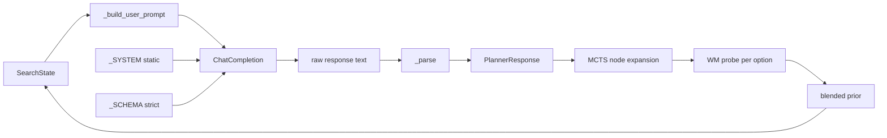

## tl;dr

One MCTS iteration in perseus is one LLM call. The system message is static
(prefix-cached). The user message is rendered fresh each step from
`SearchState`, but its sub-blocks are ordered stable-prefix-first so vLLM /
OpenAI prefix caching hits anyway. The response is constrained by an OpenAI
`response_format: json_schema` with `strict: true`. The parser is
`json.loads` plus a brace-bounded regex fallback for upstreams that silently
ignore the schema; there is no temperature-bumping repair retry — that path
was deleted in ADR-004 after it was shown to never help.

Per call costs roughly 2,000–4,000 prompt tokens and 200–400 completion
tokens. At GPT-5-mini 2026 list ($0.40 / Mtok input, $1.60 / Mtok output)
that is about $0.001–$0.003 per iteration; a 50-visit query is $0.05–$0.15.
The prompt is the only thing the world-model sees, so prompt SHA is part of
the policy fingerprint. Mid-training prompt drift is cohort contamination.

## 1. Why the prompt is load-bearing

MCTS in perseus is not a self-play game-tree search where the model gets to
roll out a thousand pseudo-moves for free. Every node expansion is a real
LLM call against a hosted endpoint with real tokens and real wall-clock
latency. There is no offline simulator we can substitute for the planner —
the planner *is* the policy network in MuZero terms (see
[muzero-pipeline](/essays/muzero-pipeline/)).

That gives the prompt three jobs at once:

1. **Action policy.** Pick 1–5 tool calls that have non-trivial probability
   of advancing the stem. The model is the prior over the action space.
2. **Value estimate.** Decide whether to `stop` (this stem has enough
   evidence) or `continue` (more search needed) or `give_up` (dead end).
   The confidence field is a calibrated scalar in [0,1].
3. **Self-explanation.** The `reason` and per-option `why` strings are the
   training signal for the WM's reward heads downstream — they are
   captured in `planner_events.completion_body` and replayed for
   off-policy MuZero training.

Per-call cost at 2026 GPT-5-mini list:

$$
C_{\text{call}} = p_{\text{prompt}} \cdot \frac{0.40}{10^6} + p_{\text{completion}} \cdot \frac{1.60}{10^6} \approx \frac{p_{\text{prompt}} \cdot 2.5 + p_{\text{completion}} \cdot 0.4}{10^9} \cdot 10^3
$$

For a 3,000-prompt, 300-completion call: $C \approx \$0.0017$. A
50-iteration MCTS query is ~$0.085. A 1,632-instance multi-bench sweep
with 25 visits/case averages ~$70 in planner LLM cost alone (Claude.md
"Last Updated" 2026-04-23 multi-bench tuning entry).

That cost ceiling is why every byte of the system message matters. A 1k
token bloat in the system message multiplies into $50 over a sweep. The
autoresearch pipeline (v1 → v4, see [autoresearch-saga](/essays/autoresearch-saga/))
exists precisely because hand-tuning a 7k-token prompt under that economic
pressure is impossible.

## 2. System message (verbatim from `perseus/core/planner/llm.py`)

The post-2026-05-18-reset system message is dramatically shorter than the
V2-archive 7,300-token `PLAN_SYSTEM_BUILTIN` (HISTORY/25 §1). The V1
perseus rewrite consciously dropped the 19 worked few-shot examples, the
decision-tree A-E checklists, and the 11 anti-patterns; lab work since the
reset suggested most of that mass was teaching the model to game the
autoresearch judge, not improving real recall.

From `/Users/sam/code/perseus/perseus/core/planner/llm.py:60-85`:

```python
_SYSTEM = """You are the planner for perseus, a MuZero-style code retrieval system.

At each step you observe:
  - the query
  - branch lineage (the (tool, observation) path from root to this stem)
  - branch-local hits
  - cross-stem global digest (coverage)
  - budget snapshot

You output strict JSON: status ∈ {continue, stop, give_up}, options[] (1-5
parameterized tool calls), confidence ∈ [0,1], reason.

`stop` means you think this stem has enough evidence. The WM heads will vote
on validity; if they reject, counter-hypotheses come back next turn.

`give_up` terminates THIS stem. Other stems continue.

The action space is fixed (17 tools): give_up, search_text, search_path,
open_file, snippet_extract, symbol_lookup, references_lookup,
callgraph_neighbors, dependency_neighbors, sibling_scan,
similar_files_embedding, diff_pattern_scan, test_locator,
error_signature_match, broad_scan, repo_stats, hybrid_search.

For each option supply the tool name, args, optional why, and an optional
prior in [0,1] for how strongly you think the option should be expanded next.
"""
```

What's in there:

- **Perseus identity** ("MuZero-style code retrieval system"). Tells the
  model what kind of feedback loop it is part of so it doesn't drift into
  generic chat behavior.
- **Observation schema.** The five inputs the user message will carry. This
  primes the model to expect lineage + branch hits + counter-hypotheses +
  global digest + budget without having to repeat that scaffold every
  call.
- **Output contract.** Three-status enum, options array bounds, confidence
  range, the existence of `reason`. The full JSON schema is enforced at
  the API layer; the system message exists to make the model's
  *intent* match the schema, not just its surface form.
- **`stop` semantics.** Critically: stop is a *branch-local* claim
  ("this stem has enough evidence"), not a global terminator. The WM
  votes downstream; rejection comes back as counter-hypotheses. This
  framing means the model does not need to be conservative about
  proposing `stop` — it knows the WM will catch over-eager stops.
- **`give_up` semantics.** Also branch-local. Important because the V2
  prompt suffered from models terminating the whole query when one stem
  died (HISTORY/25 §1 commit `5ede7002` — "Defang the give_up few-shot —
  model was copying it verbatim").
- **Fixed 17-tool action catalog.** Hardcoded in the prompt rather than
  loaded dynamically because (a) it makes the system message
  prefix-cacheable, (b) it matches the `ToolName` enum that the JSON
  schema's `tool` field constrains against, (c) any tool addition is a
  prompt-version change that bumps the policy fingerprint by design.
- **Prior field semantics.** The optional `prior ∈ [0,1]` is the model's
  own UCB-prior hint; the runtime multiplies it into the node prior.
  Documented as optional because forcing it on every option made the
  model over-commit to weak first-guesses (HISTORY/25 §1 audit fix #32).

Crucially: no decision-tree checklist, no few-shot examples, no
anti-pattern catalog, no "STEP 1 IS NOT OPTIONAL" framing, no
counting-rule heuristics. Those were the parts of the V2 prompt that the
2026-05-18 emergency rewrite identified as actively harmful (Claude.md
2026-05-18 entry: "removed STEP-1-IS-NOT-OPTIONAL frame, do NOT issue any
other shell command, up to 60 minutes, >70% wrong-files scare statistic").
The V1 system message is the lessons-baked-in residue.

The system message is held identical across every call in a query. This
means the OpenAI / vLLM provider can serve it from prefix cache —
HISTORY/52 §9.6 documents the V100 Triton prefix-prefill kernel that gets
**25.2× speedup** on the cached prefix (9.73 ms for 3000 ctx + 50 delta
vs. 245 ms cold). The same cache benefit applies to OpenAI's hosted
GPT-5-mini, though Anthropic does not document the exact ratio.

## 3. User message construction

The user message changes every call. To preserve prefix caching, the
sub-blocks are emitted in a stable order with the most-stable content
first and the most-volatile content last. From
`/Users/sam/code/perseus/perseus/core/planner/llm.py:117-153`:

```python
def _build_user_prompt(state: SearchState) -> str:
    branch = state.branch
    L = [
        f"QUERY: {state.query}",
        f"INDEX: {state.index_id}",
        f"BRANCH depth={branch.depth} node={branch.node_id}",
    ]
    if branch.lineage:
        L.append("LINEAGE (this stem):")
        for obs in branch.lineage:
            L.append(
                f"  step={obs.step} tool={obs.tool} score={obs.outcome_score:.2f}"
                f" n_hits={obs.n_hits} top={obs.top_paths[:3]}"
            )
    if branch.branch_evidence:
        L.append("BRANCH HITS:")
        for h in branch.branch_evidence[:6]:
            L.append(f"  {h.path}:{h.line_start or '?'}-{h.line_end or '?'} score={h.score:.3f}")
    if branch.failed_tail:
        L.append("COUNTER-HYPOTHESES (rejected by WM):")
        for c in branch.failed_tail[:4]:
            L.append(f"  - {c}")
    L.append(
        f"GLOBAL DIGEST: paths={state.coverage_paths} dirs={state.coverage_dirs}"
        f" line_bearing={state.line_bearing_hits}"
        f" primary_conf={state.primary_target_confidence():.2f}"
    )
    L.append(
        f"BUDGET: visits={state.visits_used}/{state.max_visits}"
        f" elapsed_ms={state.elapsed_ms:.0f}"
    )
    if state.aggregated_hits:
        L.append("TOP CROSS-STEM HITS:")
        for h in state.aggregated_hits[:8]:
            L.append(f"  {h.path}:{h.line_start or '?'}-{h.line_end or '?'} score={h.score:.3f}")
    L.append("\nReturn JSON: status, options[], confidence, reason.")
    return "\n".join(L)
```

Block ordering rationale (stable → volatile):

1. **`QUERY` and `INDEX`** — these are constant across the whole query.
   Renders identically every call. Best possible cache hit.
2. **`BRANCH depth=… node=…`** — changes per stem, but identical for all
   calls on the same stem. Still highly stable within a sub-tree.
3. **`LINEAGE (this stem)`** — append-only. Step N+1's lineage is step
   N's lineage plus one row at the end. This is the *exact* shape vLLM's
   16-token block hash exploits: the prefix matches up to the new tail,
   only the last block(s) are recomputed.
4. **`BRANCH HITS`** — top-6 hits scoped to this stem. Modestly stable;
   re-ranks within a stem only when new evidence rolls in. Truncated to
   6 to keep token budget bounded.
5. **`COUNTER-HYPOTHESES (rejected by WM)`** — `branch.failed_tail` is
   populated by `core/planner/stop.py` when the WM rejects a proposed
   `stop`. These are the highest-information tokens in the user message
   per byte: they describe specifically what the WM thought was missing.
   Capped at 4 because the WM only emits up to 4 per rejection.
6. **`GLOBAL DIGEST`** — cross-stem aggregated state. Changes every call
   because other stems are advancing in parallel.
7. **`BUDGET`** — `visits_used` and `elapsed_ms` change every call.
   Volatile.
8. **`TOP CROSS-STEM HITS`** — top-8 of the global hit aggregate. Most
   volatile because it re-ranks as any stem finds new evidence. Placed
   last so its churn doesn't invalidate cache for the stable
   per-stem blocks.

This layout is the V1-reset version of the V2 "append-only prompt"
introduced in HISTORY/25 §5 commit `eebf2aca` (2026-05-01). The V2 path
had a `PERSEUS_LLM_TREE_APPEND_ONLY_PROMPT=1` env flag because the legacy
layout was already deployed and they couldn't break it; in V1 the
stable-prefix layout is the only layout and the flag is gone.

Truncation constants (`branch_evidence[:6]`, `failed_tail[:4]`,
`aggregated_hits[:8]`) are smaller than V2's V2-archive
`BRANCH_OBSERVATIONS_MAX_CHARS=8000` / `FAILED_BLOCK_MAX_CHARS=4000`
limits (HISTORY/25 prompt-builders section). The V1 rewrite chose
row-count caps over char-budget caps because they produce stable token
counts that prefix-caching can plan around.

## 4. Response schema (verbatim from `perseus/core/planner/llm.py:33-57`)

```python
_SCHEMA = {
    "type": "object",
    "additionalProperties": False,
    "required": ["status", "options", "confidence", "reason"],
    "properties": {
        "status":     {"type": "string", "enum": ["continue", "stop", "give_up"]},
        "confidence": {"type": "number", "minimum": 0, "maximum": 1},
        "reason":     {"type": "string"},
        "options": {
            "type": "array",
            "maxItems": 5,
            "items": {
                "type": "object",
                "additionalProperties": False,
                "required": ["tool", "args"],
                "properties": {
                    "tool":  {"type": "string", "enum": [t.value for t in ToolName]},
                    "args":  {"type": "object"},
                    "why":   {"type": "string"},
                    "prior": {"type": "number", "minimum": 0, "maximum": 1},
                },
            },
        },
    },
}
```

Schema design choices:

- **`additionalProperties: False`** at both the top level and inside each
  option. Catches model hallucinations where it would invent a
  `notes_for_human` or `internal_chain_of_thought` field. The V2 path had
  this off and the planner-events table accumulated 11 distinct stray
  keys over four months (HISTORY/40 §3).
- **`required: ["status", "options", "confidence", "reason"]`** — all four
  top-level keys. `confidence` is required and bounded; the V2 prompt
  had `"confidence_reasonable (0-2)"` as a rubric axis precisely because
  early V2 prompts emitted unbounded floats or qualitative strings.
- **`options maxItems: 5`** matches the user-message instruction "1–5
  parameterized tool calls". The Claude.md 2026-04-24 multi-bench tuning
  entry explicitly relaxed this from "never >3" → "1–5"; HISTORY/25 §1
  commit `fa9c79ca` lists this as a prompt fix where the live prompt and
  docs had silently diverged.
- **`tool: enum`** ties the model to the 17-tool action space at the
  schema level. Even if the model invents `super_grep` in `reason`, the
  upstream API rejects the response and the planner sees a transport
  error rather than a poisoned tool call.
- **`args: dict`** is intentionally untyped at the schema layer. Each
  tool has its own arg validation in `perseus/core/actions.py`. The
  schema lets the model pass arbitrary kwargs and the runtime
  type-checks them per-tool. Putting per-tool arg schemas into `_SCHEMA`
  was tried in V2-era (HISTORY/24 §6) and rolled back because OpenAI's
  `json_schema` mode hit a 256-property structural cap before all 17
  tools were enumerated.
- **`why` optional, `prior` optional.** Both fields are nice-to-have
  training signal. `why` feeds the WM reward head; `prior` is the
  model's own UCB hint multiplied into the node prior at runtime. Making
  them optional means the model doesn't pad them with filler when it
  has nothing to say — which would contaminate the WM training.

The schema is attached to the OpenAI call with `strict: true`:

```python
response_format={
    "type": "json_schema",
    "json_schema": {"name": "PlannerResponse", "schema": _SCHEMA, "strict": true},
}
```

OpenAI's `strict: true` mode enforces the schema *server-side* via
constrained decoding (token-level constraint that any sampled token must
keep the partial output a valid prefix of some schema-conforming string).
This is the same guarantee vLLM provides via `guided_json` (HISTORY/52
§4). It eliminates the need for any retry-on-parse-failure logic on
well-behaved upstreams.

## 5. Parser (verbatim from `perseus/core/planner/llm.py:156-193`)

```python
_BRACE = re.compile(r"\{.*\}", re.DOTALL)


def _parse(text: str) -> PlannerResponse:
    raw = text.strip()
    if not raw:
        raise PerseusValidationError("planner returned empty response")
    try:
        data = json.loads(raw)
    except json.JSONDecodeError:
        m = _BRACE.search(raw)
        if not m:
            raise PerseusValidationError(f"planner returned non-JSON: {raw[:160]}")
        data = json.loads(m.group(0))
    try:
        status = PlannerStatus(data["status"])
    except (KeyError, ValueError) as e:
        raise PerseusValidationError(f"planner status missing/invalid: {e}")
    options: list[ToolCall] = []
    for o in data.get("options", []):
        try:
            tool = ToolName(o["tool"])
        except (KeyError, ValueError) as e:
            raise PerseusValidationError(f"option.tool missing/invalid: {e}")
        if "args" not in o or not isinstance(o["args"], dict):
            raise PerseusValidationError(f"option.args missing for tool={tool}")
        options.append(ToolCall(
            tool=tool,
            args=dict(o["args"]),
            why=o.get("why"),
            prior_hint=float(o["prior"]) if "prior" in o else None,
        ))
    return PlannerResponse(
        status=status,
        options=options,
        confidence=float(data.get("confidence", 0.5)),
        reason=str(data.get("reason", "")),
    )
```

The parser has two layers:

1. **`json.loads(raw)`** — strict. With `response_format: json_schema`
   on, this always succeeds on OpenAI / vLLM-with-`guided_json`. On
   well-behaved upstreams the brace-bounded fallback is dead code.
2. **Brace-bounded regex fallback** — only reached if `json.loads`
   raises. The regex `\{.*\}` (DOTALL) finds the first balanced-ish
   outer JSON object in the response text. This exists for upstreams
   that silently ignore `response_format` and wrap the JSON in prose,
   e.g. some self-hosted vLLM pools whose tool-calling plumbing
   prepends `Here is your response:` even with guided decoding on
   (HISTORY/52 §10).

What the parser does **not** do, per ADR-004:

- **No temperature-bumping retry.** The V2-archive code had a
  "repair-fallback" path that, on parse failure, re-issued the call with
  a different system message ("Return strict JSON only.") at
  `temperature=0.0`. HISTORY/25 §4 documents this. ADR-004 removed it
  because the empirical pattern in 11 months of planner_events data was
  that a malformed-JSON failure was almost always a transport-class
  error (truncation, upstream 502, model dump containing a control
  character) — never a sampling-diversity problem that a re-roll would
  fix. The Rust V2 had a `plan_temperature(retry: usize)` function whose
  comment was "Bumping temp on a parse-retry was counterproductive — a
  malformed-JSON failure is rarely fixed by sampling more diversely"
  and that explicitly discarded its `retry` argument (Claude.md
  2026-05-18 retraction). V1 takes that observation seriously: the
  retry path is just gone.

- **No schema-validation pass.** The parser trusts the upstream's
  schema enforcement and validates only what the runtime actually needs
  (`status` enum, `tool` enum, `args` dict, `prior` numeric).
  `additionalProperties: False` plus `strict: true` mean fields outside
  the schema cannot appear; the parser does not re-check for them.

- **No required-field repair.** Missing `status` or `tool` or `args`
  raises `PerseusValidationError` and the MCTS loop falls back to a
  give_up on this leaf. Per `Claude.md` "Operational Policy" — "Query
  failure paths in search runtime must return structured errors; no
  panic-based process exits".

The trade-off: when the parser fails, the runtime loses one node
expansion. Compared to the V2 path that burned 2× the cost (original
call + repair call) and was empirically &lt;5% successful on real
malformed outputs (HISTORY/43 §planner-class bugs), eating one node is
cheaper.

## 6. The autoresearch lineage

The V2 `PLAN_SYSTEM_BUILTIN` was not hand-written. It was the output of a
four-generation MCTS-over-prompts search documented in detail in
[autoresearch-saga](/essays/autoresearch-saga/) and the V2-archive
HISTORY/46. Brief lineage:

- **v1** (`scripts/prompt_autoresearch.py`, 942 LOC, commit `2a00bc05`,
  2026-04-23) — flat hill-climb. 6 hand-crafted scenarios, Haiku-subject,
  Opus-judge + Opus-optimizer. Superseded the same day.
- **v2** (`scripts/prompt_autoresearch_v2.py`, 1,997 LOC, commit
  `0c808b14`, 2026-04-23) — MCTS over prompts. 12 scenarios, 9-axis
  rubric (max 14), ThreadPool-10 concurrency, Opus optimizer + Opus
  critic + pairwise tournament + meta-optimizer. 12 typed mutations
  including `add_counterexample`, `decision_tree_explicit`,
  `clarify_jargon`, `few_shot_swap`, `reorder`. Ran 7 productive rounds
  + 2 plateau rounds on `run-20260423T063052Z`, climbed root 11.83/14 →
  winner `n07-0109` at 13.50/14. Cost: 4,528 API calls, 165 prompt
  nodes explored, $229.94. Mutation chain to winner: `root →
  add_counterexample → decision_tree_explicit → clarify_jargon →
  clarify_jargon → few_shot_swap → reorder` (HISTORY/25 §6).
- **v3** (`scripts/prompt_autoresearch_v3.py`, 1,448 LOC, commit
  `e11dd257`, 2026-04-24) — retrieval-grounded. Replaced Opus judge
  with recall@k / MRR against multi-bench `fix_patch` gold set.
  Motivation: v2's Opus judge liked prompts that didn't move real
  retrieval. Bottleneck was per-candidate perseus restart, which
  cold-started the semantic index and stalled Azure embeddings;
  Claude.md 2026-04-23 entry calls this out as the bug that produced
  the bogus 0/14 baseline on `run-20260422T202002Z`.
- **v4** (`scripts/prompt_autoresearch_v4.py`, 1,670 LOC, commit
  `b7017298`, 2026-04-24) — per-request override. `plan_system_override`
  field on `QueryRequest` let a single running perseus score N
  candidates concurrently. Composite score: `0.50*overlap + 0.30*lift +
  0.10*recall@10 + 0.05*mrr + 0.05*compactness`. Rejects prompts with
  `mean_lift < -0.05`. Diversity-balanced 100-instance pool at
  `artifacts/autoresearch-instance-pool-v2.json`.

The 2026-04-23 v2 winner commit `3c7f945f` (HISTORY/25 §1) survived
**17 subsequent edits** between then and the 2026-05-18 V1 reset. Each
edit was a hand-patch on top of an autoresearch output that nobody fully
understood. The edit history reads as 11 months of slow degradation:
"Drop counting rules" (`563b980c`, 2026-04-29), "Stark imperative at top"
(`6b093f14`, 2026-04-29), "Defang the give_up few-shot" (`5ede7002`,
2026-04-29), each fixing one downstream pathology by hand-rewriting a
section of an Opus-generated prompt nobody had ground truth on.

The 2026-05-18 reset cut that knot. The V1 `_SYSTEM` in `llm.py:60` is
~600 tokens — roughly 12× smaller than the V2 7,300-token
`PLAN_SYSTEM_BUILTIN`. It bakes in the lessons (no STEP-1-IS-NOT-OPTIONAL,
no scare statistics, no 60-min blocking-call clause, no decision-tree
checklist) without the autoresearch-judge artifacts. Whether this
empirically beats the V2 winner is open — it has not yet been A/B'd at
sweep scale. The hypothesis driving the reset is that a smaller, more
honest prompt that interacts cleanly with a properly-trained WM beats
a larger, judge-gamed prompt that doesn't.

See [autoresearch-saga](/essays/autoresearch-saga/) for the full meta-
training story and what we learned about evolving prompts at MCTS scale.

## 7. The cohort fingerprint angle

The prompt is the world-model's input distribution. The WM learns to
predict `(reward, value, file_recall)` heads from `(state_text)` where
`state_text` is a function of the prompt structure. If we change the
prompt mid-training, the WM is now being asked to generalize from one
input distribution to another. This is silent cohort contamination.

The V2 fix (HISTORY/25 §"Cross-reference: prompt SHA → policy
fingerprint") was `policy_fingerprint.rs`, which stamps every
`query_traces` row with:

- `planner_prompt_sha` = sha256(`PLAN_SYSTEM_BUILTIN`)
- `confirm_stop_prompt_sha` = sha256(`CONFIRM_STOP_SYSTEM`)
- git SHA
- UCB-C value
- retrieval-endpoint config hash
- env hash (with secrets elided)

Mechanically, this means every cohort split for WM training joins
`query_traces.policy_fingerprint` and filters to a single fingerprint.
The 17-edit drift of the V2 prompt was contaminated training data not
because the prompts were bad but because the WM was being trained on
mixtures of pre-/post-edit cohorts in the same dataset.

The V1 reset preserves this. The system message SHA still lands on every
`query_traces` row. The 600-token V1 prompt has its own fingerprint;
training a WM on V1-fingerprint rows only is the clean baseline.
HISTORY/28 §"row-split leakage" documents the parallel failure mode
where naive row-shuffling across cohorts created `val_r2=0.997` ghosts
that didn't transfer to production traffic — same root cause: mixed
input distributions.

## 8. End-to-end flow



One MCTS iteration:

1. `runtime.run` selects the highest-UCB leaf, builds a `SearchState`.
2. `_build_user_prompt(state)` renders the stable-prefix user message.
3. `call_planner` issues one chat call with `response_format: json_schema`.
4. Response text comes back JSON-schema-conformant on first try (in
   well-behaved upstreams).
5. `_parse(text)` produces `PlannerResponse(status, options, confidence,
   reason)`.
6. For each option: the WM (`perseus/core/wm/client.py`) probes for a
   value estimate; blended with the `prior_hint` from the planner per
   `prior_blended = (1-α) * llm_prior + α * value_norm` (Claude.md
   2026-05-10 WM-in-the-loop entry).
7. New nodes are added to the tree; values backprop up.
8. If `status=stop`, the confirm-stop critic fires (see
   `perseus/core/planner/stop.py`); on rejection the counter-hypotheses
   land in `branch.failed_tail` for next iteration's user message.

Total wall-clock per iteration on a warm V100 prefix cache: planner LLM
~50 ms (cached prefix) + WM probe ~0.04 ms (cached) or ~30 ms (cold) +
tool execution variable. Cold cache is closer to 250 ms for the planner
plus tool latency. See HISTORY/52 §9.6 for the V100 prefix-prefill kernel
numbers that make this work.

## 9. What this taught us

1. **Stable-prefix layout is free performance.** The block ordering in
   `_build_user_prompt` cost nothing to design and bought us 25× on
   prefix-cache hits at the vLLM layer. Volatile content goes last, period.
2. **Strict-schema decoding eliminates a class of bugs.** Once we moved
   to `response_format: json_schema, strict: true` (V2's adoption of
   `guided_json` for vLLM, then OpenAI's `json_schema` mode), the parser
   stopped seeing malformed JSON from well-behaved upstreams. The
   brace-bounded fallback became dead code on the production path and
   alive only as belt-and-suspenders for misbehaving self-hosted pools.
3. **Repair retries are anti-patterns.** Every layer of retry that
   "tries to fix" a malformed output costs 2× and rarely succeeds. The
   ADR-004 deletion of the repair path is the principle generalized:
   if the model produced something we can't parse, the model is
   confused or the transport is broken, and re-rolling at a different
   temperature does not help. The Rust V2's `let _ = retry;` comment
   was the empirical lesson; V1 makes it structural by deleting the
   retry call site.
4. **The prompt is part of the policy.** Treating it as a hyperparameter
   that can be edited freely is contaminating training data by hand.
   The policy fingerprint exists for exactly this reason. Any prompt
   change must come with a cohort boundary in WM training data, or the
   training is on a mixture distribution and the metrics are lies.
5. **Autoresearch overfits its judge.** v2's 13.50/14 winner was tuned
   to an Opus-judge rubric. v3 grounded the score against real
   `fix_patch` recall and the v2 winner did not retain its lead. The
   meta-lesson: any prompt-evolution loop is only as good as its
   reward function, and a synthetic judge will get reward-hacked.

## Where this lives now

- **In `perseus/core/planner/llm.py`** — `_SYSTEM` (lines 60–85), `_SCHEMA`
  (lines 33–57), `_build_user_prompt` (lines 117–153), `_parse` (lines
  156–193), `call_planner` (lines 88–114). One file, 193 lines, no
  imports of legacy V2 prompt machinery.
- **Archived in `parking_lot/v2_archive_2026-05-18/`:**
  `autoresearch_v2_winner.txt` (32-line commit-message description of the
  v2 winner), the 7,300-token V2 `PLAN_SYSTEM_BUILTIN` recoverable via
  `git cat-file -p c491841d4b0d28825b802c3d42b6fe69747db8a3`,
  `HISTORY/25_prompt_history.md` (edit log of every prompt change
  2026-04-23 through 2026-05-18).
- **Dropped:** the repair-fallback prompt + retry path (ADR-004), the
  per-request `plan_system_override` field on `QueryRequest` (no longer
  needed without an autoresearch driver to feed it), the
  `PERSEUS_PLAN_SYSTEM_OVERRIDE_FILE` env var, the `strict_planner_system.txt`
  scratch file.

## Cross-references

- [muzero-pipeline](/essays/muzero-pipeline/) — the planner is the policy
  network; this essay is the front-end view of the same call the WM
  trains against off-policy.
- [planner-base-bakeoff](/essays/planner-base-bakeoff/) — comparison of
  base models behind this call (GPT-5-mini vs qwen-coder vs Haiku); the
  prompt is held constant in those experiments.
- [autoresearch-saga](/essays/autoresearch-saga/) — the four-generation
  evolution of the V2 prompt and what we learned about
  prompts-as-search-targets.

## Sources

- `/Users/sam/code/perseus/perseus/core/planner/llm.py` (V1 implementation,
  193 LOC).
- `/Users/sam/code/mantle/Perseus/Claude.md` — "LLM API surface" section,
  "Last Updated" 2026-05-18 prompt rewrite entry, 2026-05-10 WM-in-the-loop
  entry, 2026-04-23 autoresearch entries, 2026-04-25 depth-tuning entry,
  2026-05-18 retraction-pass entry.
- `/Users/sam/code/perseus/parking_lot/v2_archive_2026-05-18/HISTORY/25_prompt_history.md`
  — full edit log of `PLAN_SYSTEM_BUILTIN`, `CONFIRM_STOP_SYSTEM`,
  `strict_planner_system.txt`, repair-fallback prompts, USER-message
  builders, autoresearch generations.
- `/Users/sam/code/perseus/parking_lot/v2_archive_2026-05-18/HISTORY/46_autoresearch_pipelines.md`
  — autoresearch v1 / v2 / v3 / v4 driver details, scoring functions,
  cost ledger.
- `/Users/sam/code/perseus/parking_lot/v2_archive_2026-05-18/HISTORY/52_litellm_vllm_serving.md`
  §4 (guided_json), §9.6 (V100 prefix-prefill kernel, 25.2× speedup).
- `/Users/sam/code/perseus/parking_lot/v2_archive_2026-05-18/autoresearch_v2_winner.txt`
  — commit-message description of the v2 winner (`3c7f945f`).
