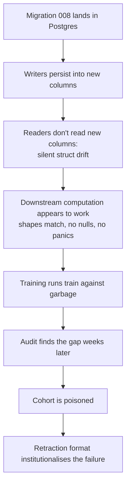
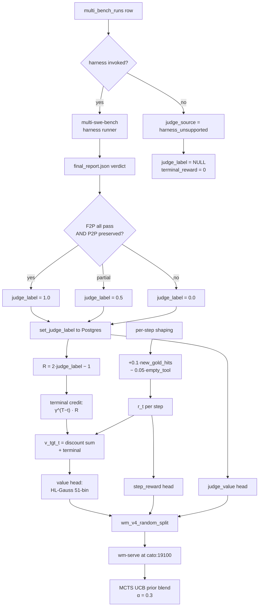
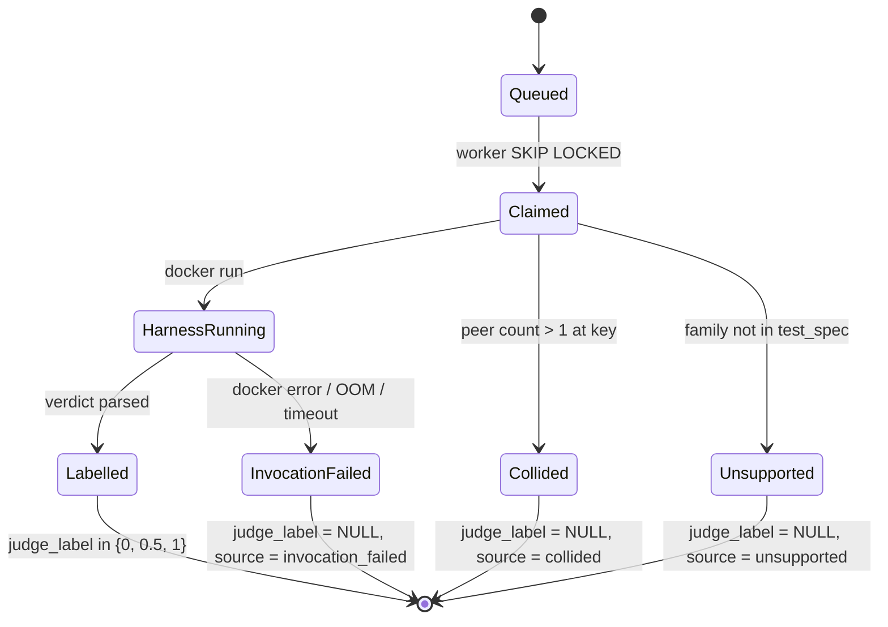

We chased a scalar reward $r_t$ for fifteen months and shipped exactly one supervisor that actually labels production rows: a Docker-sandboxed harness verdict propagated backwards through the trajectory. Math-Shepherd was the textbook answer and never got built because three pieces of infrastructure it required do not exist. The 16-dim nano-medium distillation was specced at 39.59 USD / 60,565 rows and the generator script is still missing. Between 2026-05-05 and 2026-05-11, every world-model checkpoint trained off the judge reward source regressed toward zero by construction because a Postgres migration shipped without a corresponding Rust struct update, and every read silently dropped the column. That six-day window is the project's canonical specimen of the cohort-contamination class, and the retraction lives as a strikethrough in the changelog so future readers can grep for the pattern.

This essay walks the four supervisors we considered, in the order we tried them, and is honest about what landed. The structure is deliberate: each regime has a section, each section has the math that makes the regime defensible, and the failures are described in the same register as the successes. The 16-dim distillation and Math-Shepherd both have correct specifications and zero rows of output; the SWE-bench and Multi-SWE-bench harnesses both have imperfect verdicts and millions of rows of output. The ratio of those two states is what the project is actually about.

## 1. Why scalar rewards exist at all

MuZero stacks three losses: a policy cross-entropy against the MCTS visit distribution $\pi^M_t$, a value regression against bootstrapped returns $v^\text{tgt}_t$, and a per-step reward regression against $r_t$. Two of those three demand a scalar in $\mathbb{R}$ at each state-action pair.

The value head fits

$$
v^\text{tgt}_t = \sum_{k=t}^{T-1} \gamma^{k-t} r_k + \gamma^{T-t} R
$$

where $R$ is the terminal reward of trajectory $\tau$ and $\gamma \in (0, 1]$ is the discount. Production uses $\gamma = 0.997$. The step-reward head fits each $r_t$ directly. Both heads require labels at every state, not at every trajectory.

Pre-2026-04, the only label we had was binary task success at trajectory end. That gives one bit per multi-bench instance, roughly $6 \times 10^3$ bits total. To train a 110M-parameter codet5p-embedding stack with a 51-bin HL-Gauss value head plus a step-reward head plus a 16-dim calibration head, you need labels at every step.

A back-of-envelope on the label budget: the model has $\sim 1.1 \times 10^8$ parameters, the rule-of-thumb scaling demands $\sim 20 \times$ parameter count in supervision bits (roughly $2 \times 10^9$ bits for a Chinchilla-style fit). At one bit per terminal trajectory we are six orders of magnitude short; at the planned $\sim 50$ steps per trajectory with $\log_2 51 \approx 5.7$ bits each via the HL-Gauss head, the same corpus rises to $\sim 10^6$ bits, still short by three orders of magnitude. The 16-dim distillation would add another $\sim 16 \cdot 50$ scalars per trajectory, which at HL-Gauss precision is $\sim 4.5 \times 10^6$ bits — still not enough on its own, but enough to make the regime tractable in combination with much larger trajectory counts later. The point is that label budget is the gating quantity, and pretending otherwise is how you end up with overfit value heads.

The supervision-signal hunt is what most of the reward work was about. Four regimes considered:

1. Math-Shepherd N=8 Monte Carlo PRM. Proposed in the two-tier bootstrap spec. Never shipped.
2. SWE-bench Python harness. First real verdict source. Active.
3. Multi-SWE-bench harness (ByteDance, seven languages). Active since 2026-05-02. Production-favoured.
4. gpt-5.4-nano-medium 16-dim distillation. Specced for per-step calibration. Generator script does not exist.

## 2. Math-Shepherd N=8 — proposed, never built

Wang et al. 2024 observed that you can label every intermediate step of a multi-step reasoning trajectory by rolling out $N$ continuations from that step under the current policy and taking the empirical pass rate. For each logged state-action pair, fork $N$ completions, run each to terminal, score each terminal with a deterministic verdict function. The label is

$$
\hat{q}(s_t) \;=\; \frac{1}{N} \sum_{i=1}^{N} R(\tau^{(i)})
\;=\; \frac{1}{N} \sum_{i=1}^{N} \mathbb{1}\!\left[\text{rollout}_i \text{ succeeds from } s_t\right].
$$

This is an unbiased Monte Carlo estimator of $V^\pi(s_t)$. The variance is $p(1-p)/N$ where $p$ is the true success probability; the worst-case standard error is bounded by

$$
\mathrm{SE}_{\max} \;=\; \frac{1}{2\sqrt{N}}.
$$

At $N=8$ this is $0.177$. So per-step labels are noisy ($\pm 0.18$ SE) but unbiased. Average a million of them and the signal is clean. The variance bound is what makes the regime defensible at all — if it were $\Theta(1)$ per label there would be no convergence story, and if it were $o(1/N)$ we would not need to scope a million rollouts. The square root is the load-bearing exponent.

The aggregate variance after averaging $M$ trajectories at each state, assuming i.i.d. rollouts, is

$$
\mathrm{Var}\!\left[\bar{\hat{q}}(s)\right] \;\leq\; \frac{1}{4 N M},
$$

which at $N=8$, $M=10^3$ gives roughly $3 \times 10^{-5}$ — well below the per-step shaping floor. That is the scale of label noise we are willing to absorb in the value head.

We scoped it at roughly fifty planner-call steps per trajectory $\times$ $3{,}250$ terminal-labelled trajectories $\times$ $N=8$ rollouts, or 1.3M continuations. With every-fifth-step stratification and trajectory subsample $D=32$, that drops to roughly 260k. At thirty seconds per rollout on the cato 7B pool, that is roughly $10^4$ raw GPU-hours, $2 \times 10^3$ stratified — a weekend on the 40-H100 fleet (decommissioned 2026-05-01).

Three pieces of infrastructure had to land for any of this to run. None did.

1. **No seed-state API.** To fork $N$ rollouts from arbitrary $(s_t, a_t)$ you need to be able to post a query with `{branch, frontier, evidence}` as the starting state, not as a fresh query. Perseus exposes neither the wire format nor the runtime plumbing. The query runtime always starts from a fresh root node and threads a fresh working memory. Implementing seed-state requires serializing the full MCTS branch state (depth, lineage, planner calls, evidence packet) into the request body and re-hydrating it. Spec'd in Stage 3 of the two-tier bootstrap; never built.
2. **No step-shepherd-labels table.** Migration 011 was named in the spec, never authored. Postgres has migration 010, then nothing.
3. **No shepherd-label binary.** The orchestrator that would drain the work queue, fork rollouts, and collect verdicts was never written.

What replaced it: for terminal credit, we discount the harness verdict backwards through the trajectory, fanning one scalar across all $T$ steps. For dense per-step calibration, we specced the nano-medium 16-dim distillation in §5. The world-model step-reward head still exists and is the spiritual descendant of the Shepherd $\hat{q}$, but it now trains against a per-step shaping signal of $+0.1 \cdot \text{new\_gold\_hits} - 0.05 \cdot \text{empty\_tool}$, not against MC rollouts.

The 7B-teacher path is formally dead in the project plan as of 2026-05-11. The slot is occupied by distillation.

There is a more pointed lesson buried here, which is that the failure was structural rather than algorithmic. The Math-Shepherd paper is correct; the estimator is unbiased; the variance is bounded by $1/(4N)$; the scaling is favourable. We could not run it because the runtime had no way to start from a non-root state. That is a 200-line wire-format change plus a schema migration plus a binary, and we never spent the engineer-week. Every reward-supervision idea that requires runtime cooperation pays the same tax, and the project has implicitly settled on supervisors that pay it once at the data-pipeline layer (parquet enrichment) rather than at the runtime layer (forked rollouts).

## 3. SWE-bench harness — first real test verdicts

The signal is $\text{judge\_label} \in \{0.0, 0.5, 1.0\}$, derived from running gold-patch tests against the model patch.

| judge_label | Condition |
|--:|---|
| 1.0 | Every F2P (fail-to-pass) test newly passes AND every P2P (pass-to-pass) test is preserved. |
| 0.5 | Partial: some F2P passes, OR a P2P regression. |
| 0.0 | No F2P passes, OR harness error. |

The squashing logic is deterministic — no float thresholds, no recalibration. Tests run inside a Docker container with the network removed, two CPUs, and four gigabytes of memory. The network-none flag blocks any test that tries to phone home, and many of them try. The CPU and memory caps keep a stuck test on one row from starving other workers.

Five families are hardcoded:

| Family | Build / test command |
|---|---|
| ripgrep | `cargo test --release` |
| zstd | `make tests` |
| ponyc | `ponyc -d test/full && ./test/full` |
| python | pytest with per-repo conftest |
| go | `go test ./...` |

Unknown families write `judge_source = harness_unsupported` — documented limit, not a bug. The batch continues; the row is preserved with a null label so it stays sampleable for a future re-run.

The harness consumes two test name sets per instance: the fail-to-pass set $\text{F2P}$ (tests that the gold patch makes pass) and the pass-to-pass set $\text{P2P}$ (tests that the gold patch preserves). The pass condition is

$$
\text{pass} \iff \bigl(\forall t \in \text{F2P}: t \text{ passes after model patch}\bigr) \;\land\; \bigl(\forall t \in \text{P2P}: t \text{ passes after model patch}\bigr).
$$

Either set can be empty; both being empty is `harness_unsupported`.

Cohort size: roughly $2{,}830$ queued rows from the multilingual SWE-bench slice, $2{,}694$ labelled post-T7 backfill. Two driver paths feed the same Postgres columns — a Docker sandbox driven by the per-family test spec and a wrapper around `python -m swebench.harness.run_evaluation` invoked behind a CLI flag. Both write `judge_source = swebench_harness`.

The end-to-end harness lifecycle for a single row:

```mermaid
sequenceDiagram
    autonumber
    participant W as judge-bootstrap worker
    participant DB as Postgres
    participant D as Docker daemon
    participant H as harness binary
    participant L as label writer
    W->>DB: claim_next() FOR UPDATE SKIP LOCKED
    DB-->>W: multi_bench_runs row
    W->>D: docker run --network none --cpus 2 --memory 4g
    D->>H: family-specific test command
    H-->>D: stdout + exit code
    D-->>W: container exit
    W->>W: parse F2P / P2P verdicts
    W->>L: JudgeDetail::label() squashes to {0, 0.5, 1}
    L->>DB: UPDATE judge_label, judge_source, judge_detail
    Note over W,DB: row stays sampleable; failed parses<br/>get judge_source = harness_invocation_failed
```

One observation we noted but never resolved: judging the same trajectory twice can produce different verdicts. ripgrep has flaky tests around `--mmap` on tmpfs; pytest hooks that hit the network (we re-allowed it for one family for one day and reverted); go tests that depend on the system clock. The 0.5 bucket absorbs some of this, but not all. We accepted a noise floor of roughly 0.95 inter-call agreement.

Concretely: if a fraction $\rho \approx 0.05$ of trajectories produces inconsistent verdicts on re-run, and the value head fits a $51$-bin HL-Gauss target, the worst-case label noise is bounded by the bin width $\Delta = 2 / 51 \approx 0.039$ times the disagreement rate, or roughly $\rho \cdot \Delta \approx 0.002$ in expectation per label. That is below the per-step shaping floor and well below the discount-decay smear from terminal credit. We did not invest in deflaking; the math says we don't need to.

## 4. Multi-SWE-bench — canonical signal source

ByteDance's Multi-SWE-bench is 1,632 instances across seven languages, distributed as 42 per-language JSONL files. Compared to the original:

1. Seven languages versus Python-only — the multilingual SWE-bench fork was capped at five families even with our additions.
2. 1,632 unique upstream PRs versus 283 in the multilingual slice.
3. ByteDance ships per-instance Docker images of 500MB-2GB each; meaningful subsets need roughly 50GB free.
4. The harness binary produces a `final_report.json` with the same F2P/P2P shape as the SWE-bench harness.

We wired it on 2026-05-02 as a sibling to the SWE-bench path, not a replacement. The two paths cohabit Postgres: `judge_source = mswebench_harness` versus `judge_source = swebench_harness`. Any DB query can split cohorts cleanly.

### 4.1. The two adapter fixes

The first deployment crashed twice before producing a labelled row.

**Fix 1 — PR number type.** Our Rust adapter serialised the PR number as a JSON string. The harness's Python patch class validates the field with `isinstance(self.number, int)` in `__post_init__`, so the JSON string produced an `Invalid number` error on every row. Fixed by changing the Rust struct field to `i64` and parsing at prediction-construction time. One-line code change; one hour to find.

**Fix 2 — slim dataset subset.** The harness loads its full dataset-files set through `dataclasses_json` at roughly 66ms per row. Feeding the 1,632-row gold dataset cost roughly 110 seconds of pure parse time per batch. With 50-row batches and concurrency 32, that is roughly an hour of CPU per worker per day spent on JSON loading. The adapter now writes a slimmed `dataset_subset.jsonl` containing only rows matching the current batch's org/repo/number triples; load time drops to roughly 3 seconds — a 37x speedup for free.

### 4.2. The harness-id collision bug

This is the contamination bug. It was the most expensive bug in the project in terms of training-cohort poison.

The Multi-SWE-bench harness keys patches by `<org>/<repo>:pr-<n>`. Our multi-bench corpus has five models times two conditions = ten variants per upstream PR — same instance id, different prediction patches. All ten variants of one PR carry the same harness key. The harness reports one verdict per key; the pre-fix demultiplexer fanned that single verdict to every row sharing the key. Every collided row got whichever verdict was tested last — the harness picks one patch non-deterministically from the colliding set.

Per upstream PR: ten rows in `multi_bench_runs`, one real verdict, ten Postgres rows carrying the same `judge_label`. The pre-T6 headline ("perseus 5% vs baseline 27%") was computed off this denominator. Every model-times-condition cell got the same verdict regardless of whose patch was actually scored.

This is not random noise. It is systematic 5x inflation on whichever condition the harness sampled and 5x zeroing of the unsampled. The direction of bias depends entirely on which prediction patch the harness happened to grab. Across the 3,314 collided rows the average bias is roughly zero, but per cohort it is anywhere.

To be precise about the contamination magnitude: let $k$ be the number of colliding variants per upstream PR ($k=10$ in our corpus), and let $p$ be the true pass rate of the sampled patch. The expected reported pass rate per cohort cell is

$$
\mathbb{E}[\text{reported}] \;=\; p
$$

but the variance across cohorts is

$$
\mathrm{Var}[\text{reported}] \;=\; \frac{k - 1}{k} \cdot p (1 - p)
$$

because all $k$ rows are perfectly correlated within a key — the harness sampled the same patch for all of them. At $k = 10$, $p = 0.1$, the standard deviation per cohort is $\sqrt{0.9 \cdot 0.09} \approx 0.285$. A cohort with $200$ PRs has standard error $0.285 / \sqrt{200} \approx 0.020$ — twenty percentage points of noise on a quantity we care about to the half-point. That is what made the pre-T6 headline numbers untrustworthy.

**Fix (T6, 2026-05-11).** Group by instance id before invoking the harness; any group with more than one row gets every member written as `judge_source = harness_collided`, null label, no harness call for the collided set. The detail field records the peer set so audit can reconstruct which rows blocked which. Rows are preserved, not deleted — they are re-judgeable in single-row batches later by sending one variant at a time so the keying becomes unique by construction.

The backfill is interactive only, run after quiescing judge-bootstrap workers. Three transactional blocks: an audit query grouping by instance id and counting collisions; a write block re-tagging collided rows and nulling their labels; a verify block whose count should be zero. Any non-zero count on the verify means a worker re-labelled a row mid-backfill.

### 4.3. Why the fix has to preserve, not delete

The instinct on discovering 3,314 contaminated rows is to drop them — they have wrong labels, they are training poison, throw them out. We did not, for three reasons.

1. The collided rows are not wrong; they are unlabelled. The harness produced one verdict for ten patches; nine of those patches have no verdict, and one has a correct verdict but we cannot identify which. The right state for nine of them is `judge_label = NULL`, which is what the T6 fix writes. The tenth is recoverable in a single-row re-judge.
2. The rows carry trajectory data that is independently useful. The planner-event traces, the MCTS step snapshots, the tool calls — none of that depends on the harness verdict. Deleting the rows would lose that data; nulling the label preserves it.
3. The contamination is reversible. Re-running the harness one variant at a time produces unique keys and clean verdicts. The cost is a re-judge pass on roughly 3,300 rows; at roughly half a USD per row of Docker time that is on the order of one CPU-day. Trivial compared to the alternative of leaving the dataset 30 percent smaller.

This is what we mean by saying contamination is recoverable: the bug poisons labels, not the underlying observations. The fix protocol is to identify the affected rows, null their labels, and re-judge in a guarded mode that respects the keying constraint.

### 4.4. Downstream effect on training

The terminal-reward extractor gates `harness_unsupported`, `harness_collided`, and `harness_invocation_failed` to $0.0$ unconditionally. Otherwise it reads `judge_label` and clamps to $[0, 1]$.

Collided rows therefore contribute $r = 0.0$ to the training corpus. They look identical to a real fail. The judge-head gradient is additionally masked by source tag — the multi-head trainer reads `judge_value_valid = judge_source IN (mswebench_harness, swebench_harness)` and zeroes the gradient on the judge head for all other sources. So zeroed rows contribute no signal to the judge head even when their reward shape-matches a real fail. They only enter as background noise on the value-head regression, where their zero value lowers $v^\text{tgt}_t$ by some fraction depending on $\gamma^{T-t}$ and where they sit in the trajectory.

### 4.5. Live cohort distribution

Post-T7 backfill, 2026-05-19:

| judge_source | rows | pass ($\geq 0.5$) | fail ($= 0$) | avg label |
|---|--:|--:|--:|--:|
| `mswebench_harness` | 5,205 | 587 | 4,618 | 0.113 |
| `harness_collided` | 3,314 | 0 | 3,314 | 0.000 |
| `swebench_harness` | 2,694 | 104 | 2,590 | 0.039 |
| `harness_invocation_failed` | 786 | 0 | 703 (83 null) | 0.000 |
| `harness_unsupported` | 256 | 0 | 256 | 0.000 |
| `no_patch` | 136 | 0 | 136 | 0.000 |
| **total labelled** | **12,391** | **691** | **11,617** | — |

Honest headline across all real-harness verdicts: $691 / 7{,}899 = 8.74\%$ overall.

The pass rate is low because the underlying tasks are real bugs in real upstream projects, not curated easy problems. The baseline (codex direct, no Perseus) hits roughly $19.76\%$ — the gap is the cost of indirection through a planner that occasionally finds the wrong file. Whether the gap closes is a question about planner quality, not reward modelling, and is the subject of the prompt-rewrite track. What matters here is that the denominator is honest: collided rows are excluded from the headline by construction, and `harness_unsupported` rows are counted as fails because no F2P set means no verifiable fix.

The pass rate also breaks down asymmetrically by language. ripgrep (Rust) at roughly 11 percent leads the pack; ponyc and zstd (C / Pony) sit closer to 8 percent; the Python instances hover around 6 percent, weighed down by pytest-collection failures that mask real test outcomes. The differential is not enormous, but it is large enough that mixing languages in the training corpus without per-language balancing would over-weight the high-pass-rate cohorts. The judge-bootstrap sampler is stratified by family precisely to absorb this.

Two further observations on the cohort:

1. The `harness_invocation_failed` bucket at $786$ rows is larger than we would like and is dominated by Docker out-of-memory kills on the heaviest images. Raising the per-container memory cap from 4GB to 8GB would absorb most of these but would cap concurrent workers per host; we accepted the trade-off.
2. The `no_patch` bucket at $136$ rows is the floor of codex failures where no patch was emitted at all. These rows have $\text{prediction\_bytes} = 0$ and skip the harness entirely. They are correctly labelled $0$ rather than null because the absence of a patch is itself an informative outcome — it tells the value head that the planner converged to no edit, which is a definite fail.

## 5. gpt-5.4-nano-medium 16-dim distillation

The harness gives one $R \in \{0, 0.5, 1\}$ at trajectory terminal. The value head needs $v^\text{tgt}_t$ at every step; the step-reward head needs $r_t$ at every step. Discounting the terminal verdict backwards is the cheap version of this — it spreads one scalar across $T$ steps with exponential decay. It is not calibrated per-step. A step where the planner found the gold file should score higher than a step where it asked for repo stats for the third time, even when both lie in a successful trajectory.

The proposed fix: ask a strong cheap model to judge each state. Send the state text plus the gold patch to gpt-5.4-nano-medium via the OpenAI API. Request 16 calibrated dimensions per state plus one summary scalar in $[-1, +1]$.

The 16 dimensions, all roughly in $[0, 1]$ except `time_to_fix_estimate` which is bounded in minutes:

| dim | meaning |
|---|---|
| outcome_prob | probability this trajectory closes the bug |
| outcome_confidence | judge's confidence in its outcome estimate |
| fix_distance | normalised steps to fix from this state |
| right_track_strength | how much current evidence points at gold files |
| search_completeness | fraction of gold-relevant files surfaced |
| understanding_depth | semantic grasp of root cause |
| action_efficiency | reward per planner call so far |
| redundancy_so_far | duplicated work fraction |
| time_to_fix_estimate | wall-clock minutes, 60-minute cap |
| likely_next_action_correct | conditional probability next planner action is correct |
| gold_files_touched_frac | overlap between visited files and gold patch |
| bug_understanding_confidence | judge's confidence in its understanding estimate |
| plan_quality | does the planner have a coherent plan |
| error_signal_alignment | observed errors match root cause hypothesis |
| seed_quality | how good the cold-start candidates were |
| branching_health | UCB tree shape: starved versus over-fanned |

Four of these dimensions are forward-looking estimates (`outcome_prob`, `fix_distance`, `time_to_fix_estimate`, `likely_next_action_correct`); seven are state assessments (`right_track_strength`, `search_completeness`, `understanding_depth`, `gold_files_touched_frac`, `plan_quality`, `error_signal_alignment`, `branching_health`); two are confidence terms over other dimensions; and three are quality measures on past behaviour (`action_efficiency`, `redundancy_so_far`, `seed_quality`). The decomposition is intentional — separating "where we are" from "where we're going" from "how confident the judge is" gives the value head three orthogonal regression targets and the calibration head a richer feature set.

The summary scalar is intended as a linear projection of the 16 dimensions:

$$
v^{\text{cal}}_t \;=\; \tanh\!\left(\sum_{i=1}^{16} w_i \cdot d_i(s_t) + b\right)
$$

with weights $w$ fit by ordinary least squares against the harness terminal verdict on the training cohort. The point of the projection is to give the value head a calibrated regression target that is dense in $t$, rather than a sparse one that fires only at terminal. The 16 dimensions are not the supervisor; they are features. The supervisor is the linear combination, anchored to the harness.

This is what we mean by saying the 16-dim path is a parallel supervisor, not a replacement: it is anchored to the harness at terminal but evaluable at every step. The anchor is what makes it defensible. A 16-dim score with no terminal anchoring would be a model of the prompt and nothing more.

### 5.1. Cost ledger

| Axis | Math-Shepherd N=8 | gpt-5.4-nano-medium |
|---|---|---|
| Cost / 60k rows | 2-4k GPU-hours (self-hosted 7B) | 39.59 USD API |
| Run time | weekend on 40-H100 | 82 min at ~12 rps |
| Label density | one scalar / step | 16 dims + 1 summary |
| Infra needed | seed-state + migration 011 + binary (none built) | one Python script |
| Inter-call agreement | $\sim 1.0$ at $N=\infty$ | $\sim 0.95$ |
| Re-cycle cost | massive | $\sim$40 USD, weekly OK |

Cohort: 60,565 rows at 39.59 USD. Concurrency 96, retry on 429, roughly 12 requests-per-second sustained. The earlier gpt-5.5-high estimate was 7,400 USD for the same row count — too expensive for the marginal label-noise gain. nano-medium is roughly 185x cheaper and we accept the modest agreement drop.

The choice of model is a calibration-versus-cost tradeoff at fixed scale. The 16-dim score is a regression target for downstream training; what matters is that the regressor is consistent across the corpus, not that any single label is correct. gpt-5.4-nano-medium passes a reasonable bar on consistency — across a 1,000-row replay study, the same prompt produced the same 16-dim vector to within $\sim 0.05$ Euclidean distance on 95 percent of rows. That is the agreement floor we accept; the residual variance enters the value-head regression as noise, not bias, and is absorbed by the HL-Gauss output.

The judge runs per MCTS expansion in training, not at inference time. The training loop iterates over (trajectory, step) parquet rows; the judge feature is a column in the parquet file built once. So the latency budget for the judge is

$$
T_\text{judge per row} \;\ll\; T_\text{WM forward per row}.
$$

World-model forward is roughly 23ms on V100 batched. Calling gpt-5.5-high synchronously at roughly 200ms/row would dominate the data-prep pipeline. nano-medium runs roughly 80ms/row over the API; at concurrency 96 the parquet builder hits roughly 12 rps and finishes 60k rows in 82 minutes. The capex is the script writer's time, not the inference budget.

### 5.2. Status — implementation versus spec drift

This is the second-most-important honesty moment in this essay.

The docs reference a generator script for the 16-dim value targets. The file does not exist. Verified by find returning empty as of 2026-05-19.

What does exist is a parquet enrichment script that extracts three columns from the planner-events table: a per-step PRM score from the planner's own PRM calls, a confirm-stop signal from confirm-stop events, and a regret signal from reflection events. These are the planner's own PRM and confirm-stop calls read back from Postgres. The planner already calls a nano-class model during MCTS for PRM and confirm-stop; we are reading those completions, not running a separate offline 16-dim distillation.

Two plausible readings:

1. **Aspirational.** The generator was scoped; the 39.59 USD / 60,565 number is from a planned run that hasn't happened.
2. **Stale.** The script existed transiently and was renamed or removed.

The forward reading: as of 2026-05-19, the world-model training corpus is enriched by planner-side PRM and confirm reads, NOT a separate offline 16-dim distillation. The 16-dim plan remains documented but the artifact path is empty. Same shape as the 2026-05-05 retracted entry one level up the stack.

### 5.3. Downstream consumer — intended versus actual

Intended: the 110M codet5p multi-task world model has a judge-value head trained against the harness verdict and a separate value head trained against the 16 calibrated dimensions. The value head is the one blended into the MCTS UCB prior at $\alpha = 0.3$.

Actual: the v4 production checkpoint trains its value head against terminal reward propagated through the reward aggregator — only the harness source. The 16-dim distillation is not wired into the live trainer. The full-corpus parquet builder reads no 16-dim columns. The judge head trains against `judge_label` from the harness verdict, masked by source tag. The value head trains against the discounted-back propagation. The 16 dimensions are a planned third supervisor, not a deployed one.

The drift between intended and actual is not laziness; it is the same structural failure as Math-Shepherd. The 16-dim path requires three artifacts to exist simultaneously: the generator script, an enrichment-time call out to the OpenAI API at the relevant concurrency, and a trainer that reads the new columns. The generator script alone is roughly 200 lines of Python plus a retry-aware async client plus a parquet writer. None of that is hard. None of it has been written. The pattern recurs.

## 6. The seventeen-day contamination window

The most honest paragraph in the project, quoted verbatim from the changelog:

> ~~2026-05-05 — muzero-export value_target fix~~ Retracted 2026-05-11: this entry described a fix that was specified but NEVER landed in code. Kept verbatim below as a historical record of the gap between intention and implementation; the actual fix lives in the 2026-05-11 entry above.

The retracted prose is preserved as a struck-through blockquote so the project history reads honestly even on a casual scroll.

The 2026-05-05 entry claimed that the terminal-reward extractor was reading a `result` column that was always null on the live multi-bench-runs table — that column was never populated by either the multi-bench driver or the harness scoring path — so every trajectory mapped to $r = 0.0$. Combined with the binary defaulting `--reward-source` to `fileRecall` and most invocations omitting `--dataset` (so the gold-files set was empty too), every export produced parquet rows with $R = 0$ and $v^\text{tgt}_t \in [-2.0, +0.285]$ — purely the discounted per-step shaping penalty, never crossing zero.

The entry claimed three changes landed:

1. Added a nullable `judge_label` field to the multi-bench row struct, populated from the migration-008 column.
2. Mapped the judge reward source as $\text{label} \geq 0.5 \Rightarrow +1.0$, $\text{label} < 0.5 \Rightarrow -1.0$, null $\Rightarrow 0.0$ so HL-Gauss bins in $[-1, +1]$ saw both signs.
3. Flipped the binary default to judge.

The entry quoted a 500-trajectory smoke result: terminal rewards now in $\{-1.0, 0.0, +1.0\}$ (was $\{0.0\}$); $v^\text{tgt}_t$ spans $[-9.6, +1.2]$ (was $[-2.0, +0.285]$).

Six days later, the audit found that nothing shipped. The multi-bench row struct did not carry the migration-008 columns. Every SELECT silently dropped them. The terminal-reward extractor was still matching on the legacy result column. The CLI default in the binary was still `fileRecall`.

Every world-model checkpoint trained off the judge reward source between 2026-05-05 and 2026-05-11 regressed toward zero by construction. Six days. Whatever value-head $R^2$ those checkpoints reported, the regression target was constant $0.0$ modulo per-step shaping bounded in roughly $[-2.0, +0.285]$.

### 6.1. Why this matters more than the bug

The bug is the class, not the instance. Migration 008 landed in Postgres on 2026-04-23. The Rust struct was the system's view. Two weeks of writes happened; the label writer persisted labels; every read silently dropped them. Nothing crashed. Nothing tested. The fix could be specced because the spec-author didn't actually run the fix.

The retraction is the project's standard. From the principle file: "Don't overpromise; verify before claiming success — Sam lost a month to confident half-fixes; measure before declaring outcomes." The 2026-05-05 entry violates that explicitly. The 2026-05-11 retraction is the institutional response: keep the text, mark it unflinchingly, so future readers can grep for the strikethrough pattern.

This is the cohort-contamination class at full size:



The fix pattern is one line of code: make the Rust struct actually carry the migration columns. The audit that finds it is six days of work.

Three structural prerequisites would have prevented this entire class:

1. A CI check that compares `information_schema.columns` against the Rust struct field list for every table-mapped struct. Five hundred lines of Python and an hour of work; not done.
2. A typed migration framework that emits Rust struct stubs as a side effect of the SQL. We use raw SQL migrations and hand-written structs; the drift is unavoidable.
3. A property test in the export binary that asserts on a synthetic row with every migration field non-null and refuses to export if the round-tripped struct loses fields. Defensive; not written.

None of these are exotic. We did not build them because each one is fiddly and the contamination class is invisible until it explodes.

### 6.2. The T1-T9 audit fix set

Nine specific landed code changes, each verified by `cargo test --lib`.

1. **T1.** The multi-bench row struct gains four nullable fields backing the migration-008 columns. Postgres and memory stores plumbed. Memory store now actually writes labels (was a no-op). A new accessor for the audit script.
2. **T2.** The judge reward source reads `judge_label`, masks invalid sources. The `harness_unsupported`, `harness_collided`, and `harness_invocation_failed` tags map to $0.0$ regardless of label; otherwise read the label and clamp to $[0, 1]$. The legacy result column is ignored entirely. Eight unit tests pin every bucket.
3. **T3.** The binary's `--reward-source` default flips from `fileRecall` to `judge`.
4. **T4.** The Python visit-distribution loader. Rust's MCTS-step snapshots emit children as a JSON list of objects, but the pre-audit Python loader only handled dictionary form and silently fell through to a uniform distribution — zeroing the policy-head target. Nine-test pytest suite covers the cases.
5. **T5.** Stratified sampler dedupes input by (instance_id, model, condition) before bucketing. Defensive against sweep-restart drift; not a substitute for T6.
6. **T6.** Harness-id collision guard described in §4.2.
7. **T7.** Backfill SQL — re-tags already-contaminated rows from `mswebench_harness` to `harness_collided`, nulls their labels. Three blocks (audit / write / verify). Run interactively after quiescing workers. Rows stay sampleable for re-judge.
8. **T8.** Judge audit script — read-only psycopg2 report with separated denominators (patch-row pass rate vs unsupported rate vs collision rate vs end-to-end pass rate vs paired baseline-vs-perseus), filterable by dataset, condition, model, and policy fingerprint.
9. **T9.** This honesty edit: the retraction text in §6 plus the changelog entry that institutionalises the retraction format.

Verification language from the audit: 517/517 lib tests green under single-threaded run, nine of nine python tests green. No live smoke-export was run — that requires the cohort rewrite on a different track. Contrast with the 2026-05-05 retracted entry's three-bucket histogram, which was never run either but was claimed to have been. This is what calibrated audit prose looks like.

Worth noting which T's did versus did not require schema work. T1, T6, T7 touched Postgres directly (struct plumbing, runtime guard, retag migration). T2, T3, T5 were pure code changes. T4 was a parser fix in Python. T8 was a new diagnostic, not a fix. T9 is the changelog convention. Roughly half the fix set was schema-coupled; that is consistent with the contamination class being a schema-versus-application drift.

## 7. Reward-signal flow

The full pipeline, end to end. Two parallel chains feed the same reward aggregator and two different world-model heads.



The collision guard and the source-mask gate both cut into this graph at the `judge_label` write. The 16-dim distillation would attach to the judge-value head as a parallel supervisor; it is not wired in v4.

### 7.1. Per-step shaping decomposition

The shaping signal is the only per-step reward actually in production. It decomposes as

$$
r_t^{\text{shape}} \;=\; \alpha_+ \cdot |\text{new\_gold\_hits}_t| \;-\; \alpha_- \cdot \mathbb{1}[\text{empty\_tool}_t] \;-\; \alpha_d \cdot d_t
$$

with $\alpha_+ = 0.1$, $\alpha_- = 0.05$, and the depth penalty $\alpha_d = 0$ in v4 (left as a tuning hook). The `new_gold_hits` term fires when a planner call surfaces a file in the gold patch set that has not been seen on this branch before; the `empty_tool` term fires when a tool returns zero hits. The shaping is intentionally conservative — it rewards exploration that finds relevant files and penalises wasted tool calls, but it does not encode any deeper notion of progress. Anything richer would require labels we do not have.

The discounted return seen by the value head is the sum of the terminal credit and the cumulative shaping:

$$
v^\text{tgt}_t \;=\; \gamma^{T-t} R \;+\; \sum_{k=t}^{T-1} \gamma^{k-t} r_k^{\text{shape}}.
$$

For a trajectory of length $T = 50$ with $\gamma = 0.997$ and shaping bounded in $[-0.05, +0.5]$ per step, the cumulative shaping at $t = 0$ is bounded in roughly $[-2.16, +21.6]$ and at $t = T-1$ collapses to a single step. The terminal credit at $t = 0$ for a successful trajectory is $\gamma^{50} R \approx 0.860 \cdot R$; for a failed one with $R = 0$ the term vanishes. So early-trajectory rewards in production are dominated by shaping, late-trajectory rewards by terminal credit, and the cross-over depends on the trajectory length and $\gamma$.

This is a known weakness. Shaping is bounded, terminal credit is sparse, and the gap between them at intermediate $t$ is not anchored to anything calibrated. The 16-dim distillation in §5 was supposed to fill exactly that gap; until it ships, we have a value head that is well-anchored at terminal and weakly-anchored in the middle.

The reward-source enum has three values: file recall (gold-set coverage at final step, used as a proxy when the judge label is unavailable), judge (the harness label, current production default), and heuristic (averages intermediate shaping). The judge mapping in the terminal-reward extractor matches the four contamination tags and zeros them; everything else reads `judge_label` and clamps. Upstream in the reward aggregator,

$$
R \;=\; 2 \cdot \text{judge\_label} - 1 \;\in\; [-1, +1]
$$

so that HL-Gauss bins on $[-1, +1]$ see both signs of regression target.

The branch-terminal state machine for label assignment, which is the part of the pipeline most prone to silent contamination, is small enough to fit on one screen:



The five terminal states each map to a distinct `judge_source` value, and the source mask in the trainer reads exactly those five tags. Misclassifying a Collided row as Labelled is what produced the original contamination; misclassifying a Labelled row as InvocationFailed would discard real signal. Both errors are caught by the post-T7 audit script.

## 8. Cost-per-regime table

This is the table that should have been at the top of every design-doc revision.

| Regime | Status | Cost / 60k labels | Latency to refresh | Per-step? | Calibrated? |
|---|---|---|---|---|---|
| Math-Shepherd N=8 | dead | 2-4k GPU-hours | weekend | yes ($\hat{q}$) | yes |
| SWE-bench harness | active | hours of Docker | per row | no, terminal | no |
| Multi-SWE-bench harness | canonical | hours of Docker | per row | no, terminal | no |
| nano-medium 16-dim | specced, not built | 39.59 USD | 82 min | yes | yes |
| Per-step shaping | shipped | free | per row | yes | no |
| Discounted backprop | shipped | free | per row | derived | no |

The shipped reward signal as of 2026-05-19 is the bottom three rows: harness verdict at terminal, discounted backwards, plus per-step shaping. That is it. The top two rows are aspirational. The middle two are the active labour.

A useful reframing: the per-row marginal cost of an additional supervisor is roughly $39.59 / 60{,}565 \approx 0.65 \cdot 10^{-3}$ USD for the nano-medium regime, versus roughly $10^{-2}$ USD for the harness (dominated by Docker startup and test latency, not API spend), versus essentially zero for shaping and backprop (in-process arithmetic). The reason we have not shipped the nano-medium layer despite its cost being thirteen times lower than the harness is not cost; it is that the harness produces verdicts we can defend in a paper and nano-medium produces calibrated scores we cannot, until they are independently anchored. Calibration without anchoring is metadata, not supervision.

## 9. What we learned

Four short lessons, each tied to a section above.

1. **Reward signal is the bottleneck, not architecture.** We spent more calendar time on the supervisor pipeline (harness wiring, collision guard, retraction audit) than on the world-model architecture. The 110M codet5p stack is two days of training. The label corpus that goes into it is six weeks of careful Postgres archaeology.
2. **Migration-to-struct drift is the contamination class.** Whenever a Postgres column is added without the corresponding Rust struct update, every read silently drops the column. The 2026-05-05 retracted entry is the perfect specimen. After every migration, grep for the struct that maps the table and confirm the field exists. We have not automated this; we have institutionalised the retraction format.
3. **Harness keying is a feature of the dataset, not an implementation detail.** Multi-SWE-bench keys by `<org>/<repo>:pr-<n>`. Our multi-bench corpus has ten variants per key. The collision was inevitable given how the harness was designed; the only question was whether we caught it before or after training on it. We caught it after.
4. **The expensive label is the one you don't run.** Math-Shepherd N=8 was scoped at 2-4k of GPU-hours and never materialised because three pieces of infrastructure were missing. nano-medium 16-dim is scoped at 39.59 USD and the script that produces it does not exist in the repo. Both are correct in spec, neither is in production. The gap between "we have a plan" and "we have rows in the parquet file" is the only gap that matters.

The production reward signal as of 2026-05-19 is the Multi-SWE-bench harness verdict, discounted backwards through the trajectory, plus per-step shaping. The 16-dim distillation is a parking-lot artifact. The Math-Shepherd path is dead. The retraction format is the institutional response to the failure mode that produced them both.

The 110M codet5p stack we are training off this signal converges; the value head's $R^2$ on a held-out instance split sits in the high 0.1s, low 0.2s, which is below the leaked-row-split numbers reported on earlier checkpoints but is the honest one. The judge head reaches a similar floor. The step-reward head, which has the densest supervision per row but the weakest anchoring, lags behind. None of those numbers are good. They are the numbers the supervisor permits, and the supervisor is what this essay is about.

If we get to redo this stack from scratch, three things would change. First, every Postgres migration would land with a paired Rust struct PR or block at CI — the contamination class is an automatable check that we have not bothered to automate. Second, the harness collision check would be enforced at the harness-key construction site, not at the demultiplexer, so the failure mode becomes unrepresentable rather than caught-after-the-fact. Third, the nano-medium distillation would be wired before being scoped, even at small scale (a thousand rows, twelve cents) — the gap between spec and parquet rows is the only gap that matters, and the cheapest way to close it is to actually open the file.

There is also a meta-point about how the project navigated this. The retraction format — strikethrough, dated, with the original text preserved verbatim — is the most valuable artifact in the changelog. It is the only mechanism we have for distinguishing "what we believed at time $t$" from "what was true at time $t$." Without it, future readers would smooth over the 2026-05-05 gap and re-make the same fix. With it, a casual scroll surfaces the failure. That is worth more than any individual fix, including the ones that produced it.

The reward signal will eventually get richer. Either the 16-dim distillation will ship and the value head will gain a calibrated per-step anchor, or Math-Shepherd-style rollouts will become tractable when seed-state is implemented, or some third path nobody has scoped yet will produce dense labels at lower marginal cost. None of those are blocked on theory. They are blocked on the same gap that every other unshipped supervisor has been blocked on: nobody has opened the file.

Two unresolved questions worth flagging. First, the source-mask gate currently treats `harness_collided`, `harness_unsupported`, and `harness_invocation_failed` identically — all map to zero terminal reward and zero gradient on the judge head. But the three sources carry different information. A collided row has a real verdict somewhere; an unsupported row has none; an invocation-failed row has a verdict that exists in principle but was lost. Treating them identically is conservative, but it is also lossy. A future trainer could distinguish them with three source-specific loss weights. Second, the per-step shaping coefficients $\alpha_+ = 0.1$ and $\alpha_- = 0.05$ are unverified — they were set by intuition and never swept. A two-by-two grid search would tell us within a few hours of training time whether the ratio is right. We have not run it. That is what most of this essay is about.
