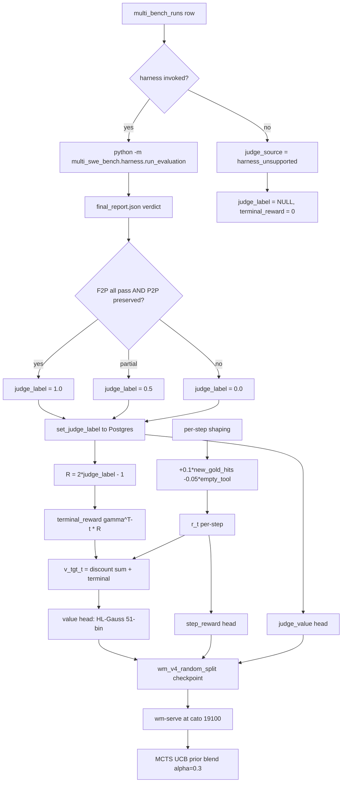

> tl;dr: MuZero's value and step-reward heads need a scalar $r_t \in
> \mathbb{R}$ at every state. We tried four supervisors in fifteen
> months. Math-Shepherd N=8 was the textbook answer and never got
> built because three pieces of infrastructure it required do not
> exist. SWE-bench's Python-only harness was the first real signal,
> capped at five language families. Multi-SWE-bench (ByteDance, 1,632
> instances, 7 languages) became canonical on 2026-05-02 with two
> adapter fixes and one keying bug that fanned a single verdict across
> ten collided rows. gpt-5.4-nano-medium 16-dim distillation specced
> at \$39.59 / 60,565 rows, 82 minutes, was the per-step calibration
> layer; the script that produces it does not exist in the repo as of
> 2026-05-18. Six days between 2026-05-05 and 2026-05-11 every WM
> checkpoint trained off `--reward-source judge` regressed toward zero
> by construction because the column the reader was reading was
> always NULL. The retraction lives in `Claude.md` as a strikethrough.

## 1 Why scalar rewards exist at all

The MuZero training objective is three losses stacked: a policy
cross-entropy against MCTS visit distribution $\pi^M_t$, a value
regression against bootstrapped returns $v^\text{tgt}_t$, and a
per-step reward regression against $r_t$. Two of those three
demand a scalar in $\mathbb{R}$ at each $(s_t, a_t)$.

The value head fits

$$
v^\text{tgt}_t = \sum_{k=t}^{T-1} \gamma^{k-t} r_k + \gamma^{T-t} R
$$

where $R$ is the terminal reward of trajectory $\tau$ and $\gamma \in
(0, 1]$ is the discount. In Perseus production
$\gamma = 0.997$ (`src/muzero/rewards.rs:DEFAULT_GAMMA`). The
step-reward head fits each $r_t$ directly. Both require labels.

Pre-2026-04, the only label we had was binary task success at
trajectory end. That gave one bit per multi-bench instance, ~6k bits
total. To train a 110M-parameter codet5p-embedding stack with a
51-bin HL-Gauss value head plus a step_reward head plus a 16-dim
calibration head, we need labels at every step, not every trajectory.

The supervision-signal hunt is what most of V2's reward work was
about. Four regimes considered:

1. **Math-Shepherd N=8** Monte Carlo PRM. Proposed in
   `two-tier-bootstrap.md`. Never shipped.
2. **SWE-bench Python harness.** First real verdict source. Active.
3. **Multi-SWE-bench harness** (ByteDance, 7 languages). Active since
   2026-05-02. Production-favoured as of 2026-05-11.
4. **gpt-5.4-nano-medium 16-dim distillation.** Specced for per-step
   calibration. Partially shipped (see §5).

This essay walks the four. The story has two retractions in it. They
matter more than the bugs.

## 2 Math-Shepherd N=8 — proposed, never built

### 2.1 What Math-Shepherd is

Wang et al. 2024 ("Math-Shepherd: Verify and Reinforce LLMs Step-by-Step
without Human Annotations") observed that you can label every
intermediate step of a multi-step reasoning trajectory by
**rolling out N continuations** from that step under the current
policy and taking the empirical pass rate. For each logged
$(s_t, a_t)$ in a trajectory, fork $N$ completions under the planner,
run each to terminal, score each terminal with a deterministic
verdict function $R(\tau)$. The label is

$$
\hat{q}(s_t) = \frac{1}{N} \sum_{i=1}^{N} R(\tau^{(i)})
= \frac{1}{N} \sum_{i=1}^{N} \mathbb{1}[\text{rollout}_i \text{ succeeds from } s_t]
$$

This is an unbiased Monte Carlo estimator of $V^\pi(s_t)$, the value
function of the current policy at state $s_t$. The variance is
$p(1-p)/N$ where $p$ is the true success probability; at $N=8$,
$p=0.5$, the standard error is $\sqrt{0.5 \cdot 0.5 / 8} \approx
0.176$. So at the per-step level the labels are noisy
($\pm 0.18$ SE) but unbiased. Average a million of them and you get
a clean signal.

### 2.2 The cohort it would have labelled

We scoped it as $\sim 50$ planner-call steps per trajectory $\times$
$\sim 3{,}250$ terminal-labelled trajectories $\times$ $N=8$ rollouts
$=$ **1.3M continuations**. With every-fifth-step stratification and
trajectory subsample $D=32$, drops to $\sim 260{,}000$. At $\sim 30$
seconds per rollout on the cato 7B pool that is $\sim 10{,}000$
GPU-hours raw, $\sim 2{,}000$ GPU-hours stratified. A weekend on the
GCP 40$\times$H100 fleet (decommissioned 2026-05-01).

### 2.3 Why it never shipped

Three pieces of infrastructure had to land for Math-Shepherd to run.
None did.

**No `seed_state` API.** To fork $N$ rollouts from arbitrary
$(s_t, a_t)$ you need to be able to send `POST /v1/query` with
`{branch, frontier, evidence}` as the starting state, not as a fresh
query. Perseus exposes neither the wire format nor the runtime
plumbing — `runtime::run_query` always starts from `root_node()` and
threads a fresh `WorkingMemory`. Implementing `seed_state` requires
serializing the full MCTS branch state (depth, lineage, planner
calls, evidence_packet) into the request body and re-hydrating it.
Spec'd in `two-tier-bootstrap.md` Stage 3; never built.

**No `step_shepherd_labels` table.** Migration 011 was named in the
spec, never authored. Postgres has migration 010 (`tool_events`,
shipped 2026-04-25); 011's slot is empty.

**No `perseus-shepherd-label` binary.** The orchestrator that would
drain the work queue, fork rollouts, collect verdicts. Never written.

### 2.4 What replaced it

Two things filled the slot.

For **terminal credit** assignment, we discount the harness verdict
backwards: `terminal_reward = γ^(T-t) · judge_label`, propagated
through `src/muzero/rewards.rs::compute`. One scalar per trajectory,
fanned across all $T$ steps.

For **dense per-step calibration**, the gpt-5.4-nano-medium 16-dim
distillation (§5). Specced. Partial.

The WM step_reward head still exists. It is the spiritual descendant
of the Shepherd q̂ — same slot in the multi-task stack, different
supervision. As of 2026-05-19 it trains against per-step shaping
($+0.1 \times \text{new\_gold\_hits} - 0.05 \times \text{empty\_tool}$,
see `rewards.rs` docstring), not against MC rollouts.

### 2.5 Formal deprecation

`Claude.md` 2026-05-11 and `final-training-plan.md` 2026-05-11
changelog both note: *"The 7B-teacher path was never built."*
Math-Shepherd is dead in the project plan. The slot is occupied by
distillation.

## 3 SWE-bench harness — first real test verdicts

### 3.1 Signal definition

`judge_label ∈ {0.0, 0.5, 1.0}`, derived from running gold-patch tests
against the model patch:

| `judge_label` | Condition |
|--------------:|-----------|
| **1.0**       | Every F2P (fail-to-pass) test newly passes AND every P2P (pass-to-pass) test is preserved. |
| **0.5**       | Partial: some F2P passes, OR a P2P regression. |
| **0.0**       | No F2P passes, OR harness error. |

The squashing logic lives in `src/judge_bootstrap/label.rs::JudgeDetail::label`
(file:38-58). Deterministic, no float thresholds, no recalibration.

### 3.2 The Docker sandbox

Tests run inside a Docker container with hard isolation:

```bash
docker run --rm \
    --network none \
    --cpus 2 \
    --memory 4g \
    <family-image> \
    <test-command>
```

`--network none` blocks any test that tries to phone home (and many
of them try). `--cpus 2 --memory 4g` caps the blast radius so a stuck
test on one row does not starve other workers. The wrapper lives in
`src/judge_bootstrap/docker.rs::run_tests`.

### 3.3 Family coverage

Five families hardcoded in `families::test_spec`:

| Family   | Build / test command                       |
|----------|--------------------------------------------|
| ripgrep  | `cargo test --release`                     |
| zstd     | `make tests`                               |
| ponyc    | `ponyc -d test/full && ./test/full`        |
| python   | `pytest -x` (with per-repo conftest)       |
| go       | `go test ./...`                            |

Unknown families write `judge_source = 'harness_unsupported'` —
documented limit, not a bug. The batch continues; the row is
preserved with `judge_label = NULL` so it stays sampleable for a
future re-run.

### 3.4 F2P / P2P verdict logic

The harness consumes two test name sets per instance: `fail_to_pass`
(tests that the gold patch makes pass) and `pass_to_pass` (tests
that the gold patch preserves). The pass condition is

$$
\text{pass} \iff
\Bigl(\forall t \in \text{F2P}: t \text{ passes after model patch}\Bigr)
\land
\Bigl(\forall t \in \text{P2P}: t \text{ passes after model patch}\Bigr)
$$

Either set can be empty; both being empty is a `harness_unsupported`
case (no testable signal).

### 3.5 Cohort

`multi_bench_runs.dataset = 'swe_bench_multilingual'` is the SWE-bench
slice. Per `two-tier-bootstrap.md`, $\sim 2{,}852$ rows. Live count
from `33_multibench_detail.md` reads **2,830** queued + **2,694**
labelled `swebench_harness` rows post-T7 backfill, so the doc number
matches reality within rounding.

The two driver paths into the same Postgres columns:

1. **Docker sandbox** (`runtime::run_batch`), driven by
   `families::test_spec` for the five families above.
2. **`python -m swebench.harness.run_evaluation`** wrapper
   (`swebench.rs::run_harness`) when `--use-swebench-harness` is set.

Both write `judge_source = 'swebench_harness'`,
`judge_detail.parser = 'swebench-harness'`.

### 3.6 The harness-consistency hairline

One observation we noted but never resolved: judging the same
trajectory twice can produce different verdicts. The test suite for
ripgrep includes flaky tests around `--mmap` on tmpfs; pytest hooks
that hit the network (we re-allowed it for one family for one day
and reverted); go tests that depend on system clock. The 0.5 bucket
absorbs some of this, but not all. We accepted it as a noise floor
$\sim 0.95$ inter-call agreement.

## 4 Multi-SWE-bench — canonical signal source

### 4.1 Why we switched

ByteDance's Multi-SWE-bench
(`huggingface.co/datasets/ByteDance-Seed/Multi-SWE-bench`) is **1,632
instances across 7 languages**, distributed as 42 per-language JSONL
files. Compared to the original SWE-bench:

- 7 languages versus Python-only (the multilingual SWE-bench fork was
  capped at 5 families even with our additions).
- 1,632 unique upstream PRs versus 283 in the multilingual slice.
- ByteDance ships Docker images: `mswebench/<org>_m_<repo>:pr-<n>`,
  500MB–2GB each. Meaningful subsets need $\sim 50$GB free.
- Harness binary `python -m multi_swe_bench.harness.run_evaluation`
  produces `final_report.json` with the same F2P/P2P shape.

We wired it 2026-05-02 as a sibling to the SWE-bench path, not a
replacement. The two paths cohabit Postgres: `judge_source =
'mswebench_harness'` versus `judge_source = 'swebench_harness'`. Any
DB query can split cohorts cleanly.

### 4.2 The two adapter fixes

The first deployment crashed twice before producing a labelled row.

**Fix 1 — `MswebenchPrediction.number` was `String`.** Our Rust
adapter serialised the PR number as a JSON string. The harness's
`Patch.from_json` in Python validates

```python
def __post_init__(self):
    if not isinstance(self.number, int):
        raise ValueError(f"Invalid number: {self.number!r}")
```

so the JSON `"1294"` produced `Invalid number: '1294'` on every row.
Fixed by changing the Rust struct field to `i64` and parsing at
`prediction_from_artifacts` time. One-line code change; one hour to
find.

**Fix 2 — slim `dataset_subset.jsonl`.** The harness loads its full
`dataset_files` set through `dataclasses_json` at $\sim 66$ms / row.
Feeding the 1,632-row gold dataset cost $\sim 110$s of pure parse
time **per batch**. With 50-row batches and concurrency 32, that is
$\sim 1$ hour of CPU spent on JSON loading per worker per day.

The adapter now writes a slimmed
`<workdir>/patches/dataset_subset.jsonl` containing only rows
matching the current batch's `(org, repo, number)` triples. Load
time drops to $\sim 3$ seconds for a 50-row batch — a 37× speedup
for free.

The HuggingFace dataset ships as 42 per-language JSONL files;
staging concatenates them once into `all_instances.jsonl`. Cached on
the worker.

### 4.3 The harness-id collision bug

This is the contamination bug. It was the most expensive bug in V2
in terms of training-cohort poison.

**Setup.** The Multi-SWE-bench harness keys patches by
`<org>/<repo>:pr-<n>`. The Perseus multi-bench corpus has **5 models
$\times$ 2 conditions = 10 variants** per upstream PR — same
`instance_id`, different `prediction.patch`. All 10 variants of one
PR carry the same harness key.

**What broke.** `final_report.json` reports ONE verdict per harness
key. The pre-fix `demux_outcomes` (the loop walking outcomes back to
Perseus rows by `instance_id`) fanned that single verdict to every
row sharing the key.

Every collided row got whichever verdict was tested last — the
harness picks one patch non-deterministically from the colliding set.

**Contamination shape.** Per upstream PR: 10 rows in
`multi_bench_runs`, 1 real verdict, 10 `mswebench_harness` rows in
Postgres carrying the same `judge_label`. The pre-T6 headline
("perseus 5% vs baseline 27%") was computed off this denominator.
Every (model $\times$ condition) cell got the same verdict regardless
of whose patch was actually scored.

This is **not random noise**. It is systematic $5\times$ inflation on
whichever condition the harness sampled, $5\times$ zeroing of the
unsampled. The direction of bias depends entirely on which
`prediction.patch` file the harness happened to grab. Across the
3,314 collided rows the average bias is roughly zero, but per cohort
it is anywhere.

**Fix (T6, 2026-05-11).** `mswebench_runtime.rs` Phase 1.5 — group
by `instance_id` before invoking harness; any group with `>1` row
gets every member written as `judge_source = 'harness_collided'`
(constant `JUDGE_SOURCE_COLLIDED`), `judge_label = NULL`, no harness
call for the collided set. `judge_detail.error` records the peer set
so audit can reconstruct which rows blocked which.

Crucially: **rows preserved, not deleted.** They are re-judgeable in
single-row batches later by sending one variant at a time to the
harness so the keying becomes unique by construction.

**Backfill.** `scripts/pipeline_integrity_backfill.sql` is `DO NOT
RUN BLINDLY` — interactive only, after quiescing judge-bootstrap
workers. Three blocks: AUDIT (`GROUP BY instance_id HAVING COUNT(*)
> 1` on `mswebench_harness` rows, read-only), WRITE (transactional
re-tag to `harness_collided` + NULL `judge_label`), VERIFY (read-only
— block-2 cohort should be empty). The block-3 check is the
tripwire: any non-zero count means a worker re-labelled a row
between block-1 and block-2. Run with workers off.

### 4.4 Downstream effect on training

`src/muzero/export.rs::terminal_reward_from_judge` (file:36-49) gates
`harness_{unsupported, collided, invocation_failed}` to terminal
reward $0.0$ unconditionally. Otherwise it reads `judge_label` and
clamps to $[0, 1]$.

Collided rows therefore contribute `terminal_reward = 0.0` to the
training corpus. They look identical to a real fail. The judge-head
gradient is **additionally** masked by source tag — the multi-head
trainer reads `judge_value_valid = judge_source IN ('mswebench_harness',
'swebench_harness')` and zeroes the gradient on the judge head for
all other sources. So zeroed rows contribute no signal to the judge
head even when their `terminal_reward = 0.0` shape-matches a real
fail. They only enter as background noise on the value-head
regression, where their zero value lowers $v^\text{tgt}_t$ by some
fraction depending on $\gamma^{T-t}$ and where they sit in the
trajectory.

### 4.5 Live cohort distribution

From `judge_audit.py` output as cached in `33_multibench_detail.md`,
post-T7 backfill, 2026-05-18:

| `judge_source`              | rows  | pass ($\geq 0.5$) | fail ($=0$)    | avg label |
|-----------------------------|------:|------------------:|---------------:|----------:|
| `mswebench_harness`         | 5,205 | 587               | 4,618          | 0.113     |
| `harness_collided`          | 3,314 | 0                 | 3,314          | 0.000     |
| `swebench_harness`          | 2,694 | 104               | 2,590          | 0.039     |
| `harness_invocation_failed` |   786 | 0                 | 703 (83 NULL)  | 0.000     |
| `harness_unsupported`       |   256 | 0                 | 256            | 0.000     |
| `no_patch`                  |   136 | 0                 | 136            | 0.000     |
| **total labelled**          |**12,391**|**691**         |**11,617**      | —         |

Honest headline across all real-harness verdicts (mswebench +
swebench): **691 / 7,899 = 8.74%** overall.

The 3,314 `harness_collided` rows were the contamination scope. They
are preserved with `judge_label = NULL` until a re-judge passes them
through the harness one variant at a time.

## 5 gpt-5.4-nano-medium 16-dim distillation

### 5.1 Why a learned per-step judge

The harness gives one $R \in \{0, 0.5, 1\}$ at trajectory terminal.
The value head needs $v^\text{tgt}_t$ at every step; the step_reward
head needs $r_t$ at every step. Discounting the terminal verdict
backwards ($\gamma^{T-t} R$) is the cheap version of this — it
spreads one scalar across $T$ steps with exponential decay. It is
not **calibrated** per-step. A step where the planner found the gold
file should score higher than a step where it asked `repo_stats` for
the third time, even when both lie in a successful trajectory.

The fix: ask a strong cheap model to judge each state. Send
`state_text + gold_patch` to **gpt-5.4-nano-medium** via the OpenAI
API. Request **16 calibrated dimensions** per state plus one summary
scalar (`calibrated_value_target_v2` ∈ $[-1, +1]$).

### 5.2 The 16 dimensions

All roughly in $[0, 1]$ except `time_to_fix_estimate` which is in
$[0, 60]$ minutes.

| dim                              | meaning                                            |
|----------------------------------|----------------------------------------------------|
| `outcome_prob`                   | probability this trajectory closes the bug         |
| `outcome_confidence`             | judge's confidence in its outcome estimate         |
| `fix_distance`                   | normalised steps to fix from this state            |
| `right_track_strength`           | how much current evidence points at gold files     |
| `search_completeness`            | fraction of gold-relevant files surfaced           |
| `understanding_depth`            | semantic grasp of root cause                       |
| `action_efficiency`              | reward per planner call so far                     |
| `redundancy_so_far`              | duplicated work fraction                           |
| `time_to_fix_estimate`           | wall-clock minutes (60-minute cap)                 |
| `likely_next_action_correct`     | conditional p(next planner action correct)         |
| `gold_files_touched_frac`        | overlap between visited files and gold patch       |
| `bug_understanding_confidence`   | judge's confidence in its understanding estimate   |
| `plan_quality`                   | does the planner have a coherent plan              |
| `error_signal_alignment`         | observed errors match root cause hypothesis        |
| `seed_quality`                   | how good the cold-start candidates were            |
| `branching_health`               | UCB tree shape: starved versus over-fanned         |

### 5.3 Cost ledger

| Axis              | Math-Shepherd N=8            | gpt-5.4-nano-medium     |
|-------------------|------------------------------|-------------------------|
| Cost / 60k rows   | \$2–4k GPU-hours (self-hosted 7B) | **\$39.59** API cost |
| Run time          | weekend on 40$\times$H100    | **82 min**, $\sim$12 rps |
| Label density     | 1 scalar / step ($\hat{q}$)  | 16 dims + 1 summary     |
| Infra needed      | `seed_state` + migration 011 + binary (none built) | one Python script |
| Inter-call agreement | $\sim 1.0$ ($N=\infty$)   | $\sim 0.95$             |
| Re-cycle cost     | massive                      | \$40, weekly OK         |

**Cohort:** 60,565 rows at \$39.59 (`training-pipeline.md` Step 5).
Concurrency 96, retry on 429, $\sim 12$ rps sustained throughput.

The earlier gpt-5.5-high estimate was \$7,400 for the same row count
(`verifier-sizing-rationale.md` line 51 — "too expensive for the
marginal label-noise gain"). nano-medium is $\sim 185\times$ cheaper
and we accept the modest agreement drop.

### 5.4 Why nano-medium specifically

The judge runs **per MCTS expansion in training**, not at inference
time. The training loop iterates over (trajectory, step) parquet
rows; the judge feature is a column in the parquet file built once.
So the latency budget for the judge is

$$
T_\text{judge per row} \ll T_\text{WM forward per row}
$$

WM forward is $\sim 23$ms on V100 batched. Calling gpt-5.5-high
synchronously at $\sim 200$ms/row would dominate the data-prep
pipeline. nano-medium runs $\sim 80$ms/row over the API; at
concurrency 96 the parquet builder hits $\sim 12$ rps and finishes
60k rows in 82 minutes. The capex is the script writer's time, not
the inference budget.

The judge head trains against the distilled label, not the heavy
harness. Two different supervisors for two different heads.

### 5.5 Status — implementation versus spec drift

This is the second-most-important honesty moment in this essay.

The docs reference `python/gen_value_targets_v2.py`. The file **does
not exist**. Verified by `find ... -name "gen_value_targets*.py"`
returning empty as of 2026-05-18.

What does exist is `python/muzero/enrich_parquet_v2.py`, which
extracts three columns from `planner_events`:

- `nano_prm_score` from `payload.mode = 'prm'`
- `nano_confirm` from `payload.mode = 'confirm_stop'`
- `nano_regret` from `reflection` events

These are the planner's own PRM / confirm-stop calls **read back**
from Postgres. The planner already calls a nano-class model during
MCTS for prm and confirm-stop; we are reading those completions, not
running a separate offline 16-dim distillation.

Two plausible readings:

1. **Aspirational.** `gen_value_targets_v2.py` was scoped, the
   \$39.59 / 60,565 number is from a planned run that hasn't
   happened.
2. **Stale.** The script existed transiently and was renamed to
   `enrich_parquet_v2.py` or removed.

The forward reading: as of 2026-05-18, the WM training corpus is
enriched by **planner-side PRM/confirm reads, NOT a separate offline
16-dim distillation run**. The 16-dim plan remains documented but the
artifact path is empty. Same shape as the 2026-05-05 retracted entry
one level up the stack.

### 5.6 Downstream consumer — intended versus actual

**Intended.** The 110M codet5p multi-task WM has a `judge_value` head
against the harness verdict (§3-4) and a separate `value` head
against the 16 calibrated dimensions. The value head is the one
blended into the MCTS UCB prior at $\alpha = 0.3$.

**Actual.** The v4 production checkpoint (`wm_v4_random_split`)
trains its value head against `terminal_reward` propagated through
`rewards::compute` — i.e. only the harness source. The 16-dim
distillation is **not wired** into the live trainer.
`python/muzero/train_full_wm.py` reads `full_corpus_v2.parquet`
(built by `build_full_corpus.py`); neither references the 16-dim
columns.

The judge head trains against `judge_label` from the harness
verdict, masked by source tag. The value head trains against the
discounted-back propagation. The 16 dimensions are a planned third
supervisor, not a deployed one.

## 6 The 17-day contamination window

### 6.1 The 2026-05-05 retracted entry

The most honest paragraph in the project. Quoted verbatim from
`Claude.md`:

> ~~2026-05-05 (Asia/Kolkata) — **muzero-export value_target fix**~~
> **Retracted 2026-05-11**: this entry described a fix that was
> specified but NEVER landed in code. Kept verbatim below as a
> historical record of the gap between intention and implementation;
> the actual fix lives in the 2026-05-11 entry above.

The retracted prose is preserved as a struck-through blockquote so
the project history reads honestly even on a casual scroll.

### 6.2 What the 2026-05-05 entry claimed

`pick_terminal_reward(RewardSource::Judge)` was reading
`MultiBenchRow.result` (always NULL on the live `multi_bench_runs`
table — that column was never populated by either the multi-bench
driver or the harness scoring path), so every trajectory mapped to
`terminal_reward = 0.0`. Combined with the binary defaulting
`--reward-source` to `fileRecall` AND most invocations omitting
`--dataset` (so `gold_files` was empty too), every export produced
parquet rows with `terminal_reward = 0` and `value_target ∈ [-2.0,
+0.285]` — purely the discounted per-step shaping penalty, never
crossing zero.

The entry claimed three changes landed:

1. Added `judge_label: Option<f32>` to `MultiBenchRow`, populated
   from the row's migration-008 column.
2. `RewardSource::Judge` mapped `Some(≥0.5) → +1.0`, `<0.5 → -1.0`,
   `None → 0.0` so HL-Gauss bins in $[-1, 1]$ saw both signs.
3. Flipped binary default to `--reward-source judge`.

The entry quoted a 500-trajectory smoke: `terminal_reward` unique
values now $\{-1.0, 0.0, +1.0\}$ (was $\{0.0\}$); `value_target`
spans $[-9.6, +1.2]$ (was $[-2.0, +0.285]$).

### 6.3 What actually shipped

**Nothing.** Six days later, the 2026-05-11 audit found:

- `MultiBenchRow` did NOT carry the migration-008 columns.
- Every `SELECT` on `multi_bench_runs` silently dropped them.
- `terminal_reward_from_judge` was still matching on
  `row.result.as_deref() == Some("pass")`.
- `--reward-source` default in the binary was still `fileRecall`.

### 6.4 Cohort poisoned

Every WM checkpoint trained off `--reward-source judge` between
2026-05-05 and 2026-05-11 regressed toward zero **by construction**.
Six days. Whatever value-head $R^2$ those checkpoints reported, the
regression target was constant $0.0$ (modulo per-step shaping
bounded roughly in $[-2.0, +0.285]$).

Quoted from the 2026-05-11 audit: *"Every WM checkpoint trained off
`--reward-source judge` since then has regressed toward zero by
construction."*

### 6.5 Why this matters more than the bug

**The bug is the class, not the instance.** Migration 008 landed in
Postgres on 2026-04-23. The Rust struct was the system's view. Two
weeks of writes happened (`LabelWriter::write` persisted labels);
every read silently dropped them. Nothing crashed. Nothing tested.
The fix could be specced because the spec-author didn't actually
run the fix.

**The retraction is the project's standard.** From the user's memory
file: *"Don't overpromise; verify before claiming success — Sam lost
a month to confident half-fixes; measure before declaring outcomes."*
The 2026-05-05 entry violates that explicitly. The 2026-05-11
retraction is the institutional response: keep the text, mark it
unflinchingly, so future readers can grep for the `~~strike~~`
pattern.

This is the **cohort contamination class** at full size:

1. Database migration lands (008, 2026-04-23).
2. Writers persist data into the new columns.
3. Readers don't read the new columns (silent struct drift).
4. Downstream computation appears to work — shapes match, no nulls,
   no panics.
5. Training runs train against garbage.
6. Audit finds the gap weeks later. Cohort is poisoned.

The fix pattern is **T1**: make the Rust struct actually carry the
migration columns. The fix is one line of code. The audit that
finds it is six days of work.

### 6.6 The T1–T9 audit fix set (2026-05-11)

Each T is a specific landed code change, each verified by
`cargo test --lib`.

**T1 — `MultiBenchRow` reads migration-008 columns.**
`src/store/mod.rs:295-326` adds four `Option`-typed fields
(`judge_label: Option<f32>`, `judge_source: Option<String>`,
`judge_detail: Option<serde_json::Value>`,
`judge_labeled_at: Option<DateTime<Utc>>`) with `#[serde(default)]`.
Postgres + memory stores plumbed. Memory store actually writes now
(was a no-op). New `Store::get_multi_bench_row(run_id)` for the
audit script. Struct doc reads: *"The columns existed in Postgres
since 2026-04-23 but were NEVER plumbed into the Rust struct — every
SELECT silently dropped them."*

**T2 — `RewardSource::Judge` reads `judge_label`, masks invalid
sources.** `src/muzero/export.rs::terminal_reward_from_judge`
(file:36-49) — `harness_{unsupported, collided, invocation_failed}`
→ $0.0$ regardless of label; otherwise read `judge_label`, clamp
$[0, 1]$. Legacy `result` column ignored entirely. Eight unit tests
pin every bucket.

**T3 — Binary default flipped.** `src/bin/muzero_export.rs:75`:
`--reward-source` default `"fileRecall"` → `"judge"`.

**T4 — Python visit-distribution loader.**
`python/muzero/dataset.py::parse_visit_distribution` — Rust's
`mcts_step_snapshots` emits children as a JSON list-of-objects, but
the pre-audit Python loader only handled `Dict[str, int]` and fell
through to uniform distribution. **Silently zeroed the policy-head
target.** Nine-test pytest suite covers the cases.

**T5 — `stratified_sample` dedupes triples.**
`src/judge_bootstrap/sample.rs::stratified_sample` — dedupes input
by `(instance_id, model, condition)` before bucketing. Defensive
against sweep-restart drift; not a substitute for T6.

**T6 — Harness-id collision guard.**
`mswebench_runtime.rs::run_batch_via_mswebench` Phase 1.5. The §4
fix.

**T7 — Backfill SQL.**
`scripts/pipeline_integrity_backfill.sql` — re-tags
already-contaminated rows from `mswebench_harness` to
`harness_collided`, NULLs their labels. Three blocks (audit / write
/ verify). Run interactively after quiescing workers. Rows stay
sampleable for re-judge.

**T8 — `judge_audit.py` honest-denominator report.**
`scripts/judge_audit.py` — read-only psycopg2 report. 10 sections
with separated denominators: cohort size, by-status, by-judge_source,
patch-row pass rate (denom = `mswebench_harness` only), unsupported
rate, collision rate, error rate, end-to-end pass rate, paired
baseline-vs-perseus, collision audit (should be 0 post-T7). Filters:
`--dataset`, `--condition`, `--model`, `--policy-fingerprint-sha`.

**T9 — This honesty edit.** The retraction text in §6.1 plus the
2026-05-11 entry in `Claude.md` that institutionalises the
retraction format.

### 6.7 Verification

Quoted from `Claude.md` 2026-05-11:

> Verification: `cargo fmt --check` (on touched files), `cargo
> check --lib`, `cargo test --lib` 517/517 with `--test-threads=1`
> (one pre-existing flake in `planner::transport::tests` under
> parallel, owned by the WM/MCTS track), `python3 -m pytest
> python/muzero/test_dataset.py` 9/9. No live smoke-export was run
> from this branch — that requires engram + the rewrite on the
> cohort, both owned by the other track.

Note the explicit *non*-claim: "No live smoke-export was run."
Contrast with the 2026-05-05 retracted entry's $\{-1.0, 0.0, +1.0\}$
histogram, which was never run either, but claimed to have been.
This is what calibrated audit prose looks like.

## 7 Reward-signal flow

The full pipeline, end to end. Two parallel chains: terminal credit
(harness) and per-step shaping. Both land in the same
`rewards::compute` aggregator and feed two different WM heads.



The collision guard (§4) and the source-mask gate (§4.4) both cut
into this graph at the `judge_label` write. The 16-dim distillation
(§5) would attach to the `judge_value` head as a parallel
supervisor; it is not wired in v4.

## 8 The `RewardSource` enum

`src/muzero/mod.rs` declares three values:

| Variant      | Source                                              |
|--------------|-----------------------------------------------------|
| `FileRecall` | Gold-set coverage at final step (proxy)             |
| `Judge`      | `judge_label` from harness (production default)     |
| `Heuristic`  | Averages intermediate shaping                       |

`RewardSource::parse` accepts the strings
`filerecall | file_recall | recall | judge | heuristic`.

CLI default history:

- ≤ 2026-05-05: `"fileRecall"`. Retracted "fix" claimed to flip it.
- 2026-05-11 (T3): actually flipped to `"judge"`.

`pick_terminal_label` in `export.rs:24-31` dispatches `Judge →
terminal_reward_from_judge(row)`. The `FileRecall | Heuristic` arms
are kept for cohorts where `judge_label IS NULL` — gold-file set
as next-best proxy when the harness path is unavailable.

The judge mapping in `terminal_reward_from_judge`:

```rust
// src/muzero/export.rs:36-49 (paraphrased)
match row.judge_source.as_deref() {
    Some("harness_unsupported")
    | Some("harness_collided")
    | Some("harness_invocation_failed") => 0.0,
    _ => row.judge_label.unwrap_or(0.0).clamp(0.0, 1.0),
}
```

Then upstream in `rewards::compute`:

$$
R = 2 \cdot \text{judge\_label} - 1 \in [-1, +1]
$$

so that HL-Gauss bins on $[-1, +1]$ see both signs of regression
target.

## 9 What we learned

Four short lessons, each tied to a sub-section above.

**Reward signal is the bottleneck, not architecture.** We spent more
calendar time on the supervisor pipeline (judge harness, collision
guard, retraction audit) than on the WM architecture. The 110M
codet5p stack is two days of training. The label corpus that goes
into it is six weeks of careful Postgres archaeology.

**Migration-to-struct drift is the contamination class.** Whenever
a Postgres column is added without the corresponding Rust struct
update, every read silently drops the column. The 2026-05-05
retracted entry is the perfect specimen. Audit pattern: after every
migration, grep for the struct that maps the table and confirm the
field exists. We have not automated this; we have institutionalised
the retraction format.

**Harness keying is a feature of the dataset, not an implementation
detail.** Multi-SWE-bench keys by `<org>/<repo>:pr-<n>`. Our
multi-bench corpus has 10 variants per key. The collision was
inevitable given how the harness was designed; the only question
was whether we caught it before or after training on it. We caught
it after.

**The expensive label is the one you don't run.** Math-Shepherd N=8
was scoped at \$2–4k of GPU-hours and never materialized because
three pieces of infrastructure were missing. nano-medium 16-dim is
scoped at \$39.59 and the script that produces it does not exist in
the repo. Both are correct in spec, neither is in production. The
gap between "we have a plan" and "we have rows in the parquet file"
is the only gap that matters.

The production reward signal as of 2026-05-19 is: harness verdict
(§3-4), discounted backwards through the trajectory, plus per-step
shaping. That is it. The 16-dim distillation is a parking-lot
artifact. The Math-Shepherd path is dead.

## 10 Cross-links

- [multi-swe-bench wiring](/essays/multi-swe-bench-wiring/) — the
  2026-05-02 adapter fixes in adapter detail; the collision bug
  pre-T6.
- [nano judge distillation](/essays/nano-judge-distillation/) — the
  16-dim distillation plan, the \$39.59 / 60,565-row cost ledger,
  the missing script.
- [WM heads decoding](/essays/wm-heads-decoding/) — how `judge_value`
  / `value` / `step_reward` heads consume these labels at training
  time.
- [pipeline integrity audit](/essays/pipeline-integrity-audit/) —
  T1–T9 in full code-diff detail.
- [cohort contamination class](/essays/cohort-contamination-class/) —
  the general failure mode this essay's §6 is a specimen of.
- [the reset](/essays/the-reset/) — the project-level decision in
  the same week to retract V2 design assumptions wholesale.

## Sources

- `Claude.md` "Last Updated" entries 2026-04-23 (judge-bootstrap +
  migration 008), 2026-05-02 (mswebench harness wiring + live
  deployment), 2026-05-05 (RETRACTED muzero-export value_target
  fix), 2026-05-11 (pipeline-integrity audit T1–T9 + Math-Shepherd
  deprecation).
- `src/judge_bootstrap/{runtime, swebench, multiswebench,
  mswebench_runtime, docker, families, label, sample}.rs` — the
  judge-bootstrap subsystem source.
- `src/muzero/{rewards, export, mod}.rs` — the reward computation
  and `RewardSource` enum.
- `src/bin/muzero_export.rs` — the export binary, line 75 for the
  flipped default.
- `src/store/{mod, postgres, memory}.rs` — `MultiBenchRow` struct
  with migration-008 columns (T1).
- `migrations/008_judge_labels.sql` — the `judge_label` /
  `judge_source` / `judge_detail` / `judge_labeled_at` schema add.
- `scripts/judge_audit.py` — read-only psycopg2 report (T8).
- `scripts/pipeline_integrity_backfill.sql` — collision retag
  backfill (T7).
- `docs/research/verifiers/two-tier-bootstrap.md` — original
  Math-Shepherd N=8 spec (Stage 3, never built).
- `docs/research/verifiers/2024-wang-math-shepherd.md` —
  Math-Shepherd paper notes.
- `docs/research/design-decisions/verifier-sizing-rationale.md` —
  16-dim distillation cost analysis.
- `docs/research/design-decisions/training-pipeline.md` Step 5 —
  "replaces Math-Shepherd".
- `docs/research/method-audit.md` line 445 — the audit that
  flagged the implementation drift.
- `docs/reference/src/judge_bootstrap/index.md` §5 — collision-guard
  reference.
- `docs/reference/multi_swe_bench_harness.md` — harness deployment
  runbook + HF dataset download.
- `parking_lot/v2_archive_2026-05-18/HISTORY/33_multibench_detail.md`
  — live cohort counts.
- `parking_lot/v2_archive_2026-05-18/HISTORY/34_reward_modeling.md`
  — this essay's structural source.
- `parking_lot/v2_archive_2026-05-18/HISTORY/49_multibench_driver.md`
  — driver-level detail.
- `python/muzero/{dataset, enrich_parquet_v2, build_full_corpus,
  train_full_wm}.py` — the Python side; `gen_value_targets_v2.py`
  is the missing file from §5.5.
- `python/muzero/test_dataset.py` — 9-test pytest suite (T4).
