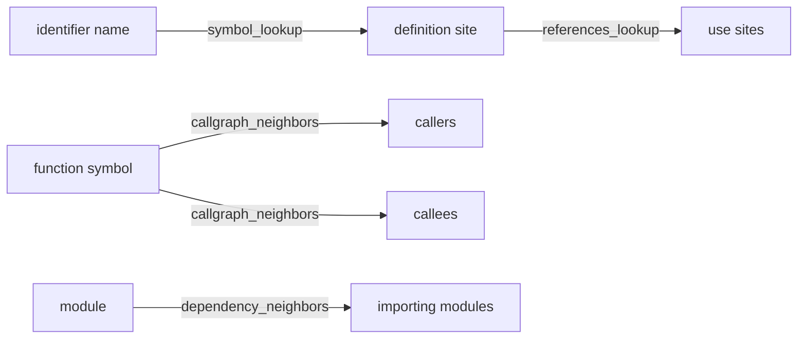
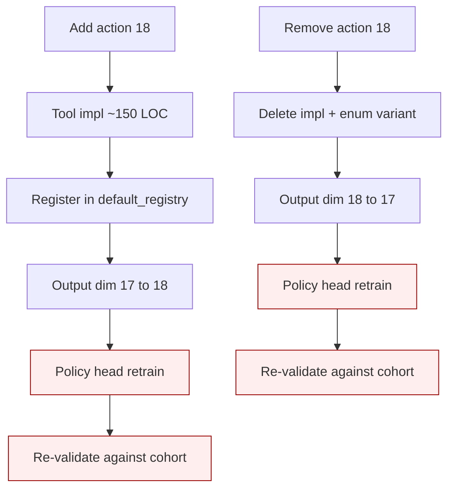
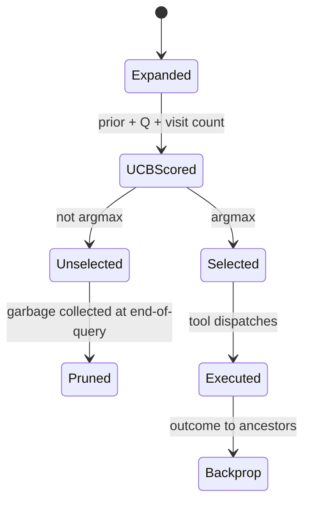

We keep four retrieval tools that the planner essentially never calls. Combined they account for 3 of 1,157 dev-traffic tool invocations across three weeks of V2 traces — 0.26%. The naive move is to delete them, collapse the action space from 17 to 13, and retrain a smaller policy head. We refuse.

The action space of a fixed-action MuZero is not a Python module registry. It is the output support of the policy head. Pruning prejudges what the policy can learn from data it has not yet seen, and the cost of removing an action is symmetric to the cost of adding one — both require a policy-head retrain because the output dimension changes. Keep-anyway is the cheap option; pruning is the expensive one. The four slots stay, the regex stubs stay, and the policy head learns what works from training signal rather than from catalogue surgery.

## 1. The four-tool family as graph-edge types

The category is not arbitrary. The four tools are the smallest set that names the four irreducible structural relations between identifiers in source code: where a name is defined, where it is used, who calls what, and what depends on what. Every code-aware tool that has shipped has surfaced approximations of these four. They map cleanly to the textDocument/definition, textDocument/references, callHierarchy, and textDocument/typeDefinition primitives in LSP, and they cover the structural-relation surface that a tree-sitter walker over a typed AST can answer in constant time per query.



We index these on top of retrieval-service's tree-sitter-backed graph endpoints, with a lexical-grep fallback augmented by language-aware regex weighting. The fallback is intentionally weak — a +0.3 bump for snippets containing `impl`/`fn`/`def`, a +1.3 bump for snippets matching call-site syntax, a seven-language dependency-term regex covering Rust, Python, TypeScript, Go, Java, Ruby, and C++. The service path is where the real signal lives; the fallback exists so that the tool never fails open with zero hits.

Why these four and not three, or five? The graph-theoretic argument is that a typed-symbol graph has two node types (declarations and modules) and two directed edge relations (use and depend). Lookup is the inverse of the use edge restricted to declarations; references is the forward use edge from a declaration; callgraph is the use edge restricted to function-typed declarations and walked both directions; dependency is the depend edge restricted to module nodes. Every other "structural query" we have considered reduces to a composition of these. Reachability across the callgraph is a transitive closure of callgraph_neighbors; the import-cycle detector is a strongly-connected-component computation on dependency_neighbors; the type-hierarchy walk is a callgraph variant where edges are typed by inheritance. None of these justifies a separate registry slot; all of them compose from the four primitives.

This is why the category resists pruning at the design level even before any usage data is considered. The four tools are a minimal, complete, non-redundant covering of the structural-relation surface. Dropping any one of them creates a gap that no composition of the remaining tools can fill. Dropping all four creates the gap entirely. Whatever workload-driven pressure says "these tools are unused," the structural argument says "these tools are the basis." The basis is committed by argument, not by usage. Usage tells us which basis vectors the current workload projects onto; it does not tell us which basis vectors should exist.

## 2. The usage data: 3 of 1,157

Across all local query-progress traces between 2026-04-23 and 2026-05-16, filtered to queries that fired any tool observation event:

| Tool | Calls | Share |
|---|---:|---:|
| hybrid_search | 462 | 39.4% |
| search_text | 230 | 19.6% |
| search_path | 219 | 18.7% |
| diff_pattern_scan | 111 | 9.5% |
| broad_scan | 61 | 5.2% |
| open_file | 55 | 4.7% |
| snippet_extract | 9 | 0.8% |
| repo_stats | 7 | 0.6% |
| symbol_lookup | 3 | 0.3% |
| references_lookup | 0 | 0.0% |
| callgraph_neighbors | 0 | 0.0% |
| dependency_neighbors | 0 | 0.0% |
| (8 other tools) | 0 | 0.0% |

The four symbol-graph tools combined: 3 of 1,157, three orders of magnitude below the hybrid-search baseline. The graph endpoints went live with the cleanup-250-loc audit chain on 2026-04-24; in the three weeks since, the planner essentially never chose them.

The dev-traffic caveat is honest. The local corpus is biased toward queries against the Perseus repo itself — questions answered by surfacing a snippet, not by walking a call graph. Production sweep numbers from the engram-side tool-events table could tell a different story. But the dev data is what we have, and it is unambiguous: under this workload, the planner does not pick these tools.

There is a second-order observation worth stating. The four tools that the planner did pick aggressively — hybrid_search, search_text, search_path, diff_pattern_scan — account for 87.2% of all calls. The long tail of remaining tools (open_file, snippet_extract, broad_scan, repo_stats, the four symbol-graph tools, and the 8 zero-call tools) collectively account for 12.8%. The action space is bimodal: four high-frequency tools, four medium-frequency, and nine low-or-zero-frequency. A naive pruning pass that targets "below 1% usage" cuts more than just the symbol-graph family; it touches snippet_extract and repo_stats too, both of which the planner picks rarely but at moments where they are the right answer. The cliff between "frequent" and "rare" is not the cliff between "useful" and "useless."

The empirical shape of the usage distribution is itself an artefact of the planner's current prior. The policy head has been trained on traces dominated by snippet-shaped queries, so the prior on hybrid_search is high, the prior on symbol-graph tools is low, and the MCTS search at each step explores hybrid_search first by UCB. The visits that land on hybrid_search rapidly accumulate, the visit counts at the root concentrate further, and the next training pass tilts the prior toward hybrid_search even more strongly. The loop is self-reinforcing. The only thing that breaks it is exogenous data — a workload where the structural tools win — and the only thing that lets exogenous data work is the slots being preserved while the loop runs.

## 3. The math: why pruning prejudges what the policy can learn

The policy head emits a categorical distribution over the action enum. Let $\mathcal{A} = \{a_1, \dots, a_{17}\}$ be the current action space and $s$ the encoded state. The world-model policy is

$$\pi_\text{wm}(a \mid s) \in \Delta^{16}$$

where $\Delta^{16}$ is the 16-simplex (probabilities over 17 categories summing to 1). Training minimises the cross-entropy against the MCTS visit distribution $\pi^M_t(a \mid s_t)$ — the empirical visit counts at the root after the tree search expands and backpropagates:

$$\mathcal{L}_\pi(\theta) = -\sum_t \sum_{a \in \mathcal{A}} \pi^M_t(a \mid s_t) \log \pi_\theta(a \mid s_t).$$

Under V2 dev traces the symbol-graph actions sit at $\pi^M_t(a \mid s_t) \approx 0$. The trained $\pi_\theta$ converges to a near-zero prior on those slots. So far there is no behavioural difference between "keep the tool with prior $\epsilon$" and "delete the tool and let the prior support only 13 actions." Both yield the same deployed planner.

The difference shows up the moment training data shifts. Suppose a refactor-planning cohort arrives where the right answer is in fact a callgraph walk. Under keep-anyway, the new visit distribution has positive mass on the callgraph slot; the next training pass tilts $\pi_\theta$ toward it; production behaviour changes with zero code change. Under prune-and-retrain, the output layer no longer has a slot to tilt. The fix requires reintroducing the action (a typed-enum edit), re-extending the output dimension from 13 back to 17, retraining the head from scratch against a cohort large enough that the new action is not starved, and re-validating against the previously trained cohort. The dimensions of the parameter tensor change; every existing checkpoint becomes incompatible.

Formally, pruning replaces the prior

$$p_0(a) = \begin{cases} 1/17 & a \in \mathcal{A}_{17} \\ 0 & \text{otherwise} \end{cases}$$

with the absorbing prior $p_0(a) = 0$ for $a \notin \mathcal{A}_{13}$. The KL divergence between a target policy that wants to use the pruned action and the achievable policy is infinite. The model cannot represent the right answer. Keep-anyway leaves the prior at $\epsilon > 0$ where training data can move it; the KL is finite. The two policies behave identically on data that looks like V2 and diverge on data that does not.

This is the formal statement of the option-value argument. The action-space slot is the support of the policy; deleting the slot deletes the support; no amount of subsequent training recovers it without architectural change.

The closed-loop training pipeline makes the asymmetry concrete. The reward signal from a multi-bench cohort flows into per-step terminal rewards $r_T$ and intermediate value targets $v^\text{tgt}_t$. The world model is trained on $(s_t, a_t, r_t, \pi^M_t, v^\text{tgt}_t)$ tuples extracted from MCTS-snapshot rows. Visit counts $\pi^M_t$ are aggregated over the trajectory and the policy head is updated against them. A slot that never appears in $\pi^M_t$ under one cohort can appear in $\pi^M_t$ under another cohort the moment the workload distribution shifts toward queries the slot is the right answer for. The slot has to exist before that signal can reach it. Pruning closes the door before checking who is on the other side.

```mermaid
sequenceDiagram
    participant Q as Query
    participant M as MCTS root
    participant P as Policy head
    participant T as Training loop
    Q->>M: state s_t
    M->>P: request prior over 17 actions
    P-->>M: pi_theta(a | s)
    M->>M: UCB select, expand, backprop
    M->>T: emit pi_M_t, v_target, r
    T->>P: cross-entropy gradient on slot a*
    Note over P: slot for callgraph_neighbors\nhas prior epsilon; can move\nwhen training data has mass
```

Under keep-anyway, every cohort's training pass has the chance to redistribute mass across all 17 slots. Under pruning, the four slots are gone; the cross-entropy gradient cannot touch them; the only way back is architectural surgery. The cost of preserving the option to redistribute is one softmax over 17 categories instead of 13. The cost of foreclosing the option is a multi-day retrain at the moment the workload shifts.

## 3b. The cost of carrying an unused action

The case for pruning rests on a claim that unused actions impose a real cost. We can decompose that cost concretely. Let $d_h$ be the hidden dimension of the policy head's penultimate layer. The output projection is a matrix of shape $\mathbb{R}^{d_h \times |\mathcal{A}|}$. Going from 17 to 13 actions saves $4 d_h$ parameters in the final linear layer plus 4 bias entries — a constant in the model size, dominated by everything else in the policy network. The softmax computation is $O(|\mathcal{A}|)$; the difference between $|\mathcal{A}| = 17$ and $|\mathcal{A}| = 13$ is a 24% reduction in softmax cost on a step that is negligible against the LLM planner call (which costs $O(\text{tokens})$ in attention).

On the planner-prompt side, the action catalogue is enumerated once in the system prompt. Each catalogue entry is one line with a name, a specificity weight, and a one-sentence semantic disambiguation — call it 25 tokens. Four entries is 100 tokens. With prefix caching on the system prompt, the per-call cost of those 100 tokens is zero after the first call in a session. The dispatch table in the registry is a static map; runtime cost is constant lookup.

The actual measurable cost of carrying four dead actions is somewhere in the noise floor of every metric we care about. The pruning argument is not "it costs us X." It is "the catalogue looks cluttered." That is an aesthetic argument dressed as an engineering one.

## 4. The dev-vs-production workload mismatch

The V2 traces are snippet-shaped queries: "how is the planner-call timeout configured," "where does the terminal-reward extractor live," "why does confirm-stop reject a branch." For these, the right tool is hybrid_search followed by an open-file or snippet-extract read. The planner converges in two or three calls. Callgraph_neighbors adds nothing — the planner already has the snippet.

Production debugging workloads are not snippet-shaped. Three examples:

1. "If I change this function signature, what breaks?" — the canonical references_lookup walk, recursively.
2. "I am refactoring the auth module; what else touches it?" — dependency_neighbors on the module path.
3. "I am tracing a regression in a compression routine; what is the call chain from the public API down to the leaf?" — callgraph_neighbors walked both directions.

For these workloads, hybrid_search is not the right tool and is not close. Hybrid_search optimises for "surface a relevant snippet given a free-form question." Callgraph_neighbors optimises for "give me the structural neighbourhood of an identifier I already have." Different problems, different answers, and no amount of dev-traffic data tells us about the production distribution.

The mistake in pruning based on V2 data is treating the dev distribution as a stand-in for the production distribution. The correct fix is to train on data from the workload the planner will actually see. Pruning removes the mechanism that would let the policy correct itself when that workload arrives.

## 5. The regex-stub state of play

The four implementations are deliberately thin. The callgraph-neighbours action is currently identical to references-lookup except for a 0.85 multiplier applied to every hit's score. There is no callgraph walk; there is a grep over symbol occurrences. The 0.85 is not a tuned hyperparameter — it is a deliberate score-deflation marker that says "I am an approximation, deflate me against tools whose evidence is more structural." The stub docstring is unusually candid about it: v0.1 ships with regex-only fallback so the action space is complete, the policy head emits prior over 17 actions, and when the lab-side tree-sitter walker graduates the classes are swapped in place without registry change.

The score-deflation marker is the load-bearing signal. Let $s_\text{regex}$ be the score returned by the stub and $s_\text{struct}$ the score that the future tree-sitter walker will return. The current relationship is

$$s_\text{regex} = 0.85 \cdot s_\text{ref}$$

where $s_\text{ref}$ is the references-lookup score on the same symbol. A trained policy seeing this consistently learns to down-rank callgraph_neighbours against references_lookup — correctly, given that the current implementation is strictly weaker. The lesson is implementation-conditional. A trained policy that learned $\pi_\theta(\text{callgraph\_neighbors} \mid s) \approx 0$ under the regex stub is learning that regex-based callgraph is useless. It is not learning that callgraph-the-concept is useless. Pruning conflates the two.

The graduation path is documented in ADR-006: when the lab-side tree-sitter walker actually returns callers and callees distinct from a textual grep, the four classes get swapped in place behind the same trait. The registry shape does not change. The policy head does not retrain unless the action distribution shifts meaningfully — which is the right gate. We measure the swap on an extended operator benchmark with refactor and breaking-change-impact cases; we promote only if the structural walker beats the regex stub on cases that require structural relations.

## 5b. The latency budget for an unused tool

A second concrete decomposition. Per planner step, the latency budget is

$$T_\text{step} = T_\text{planner-LLM} + T_\text{tool-dispatch} + T_\text{tool-execute} + T_\text{observation-render}.$$

The LLM call dominates: on the production qwen-coder pool it sits in the 600 ms to 2 s range. The policy-head inference (when the world-model service is reached) adds 30 ms uncached, 0.04 ms cached. Tool dispatch is constant; tool execution depends entirely on which tool fires. Observation rendering is a tokeniser pass over the tool's hits.

A tool that the planner never picks contributes zero to $T_\text{tool-execute}$ and $T_\text{observation-render}$. It contributes $O(1)$ to the policy-head output dimension and $O(\text{catalogue-entry-tokens})$ to the planner system prompt — both of which are cached after the first call. The marginal latency cost per step of carrying the four dead actions is, within measurement noise, zero. The marginal training cost is one slot in the policy head's softmax. The marginal storage cost is the 150 lines of regex-stub implementation and the four enum variants.

Set against these costs is the option value: the ability to receive gradient signal on these slots when the workload shifts. The only configuration in which pruning makes economic sense is one where the workload distribution is provably stationary and the four slots are provably never the right answer under that stationary distribution. Neither is established. Both are unestablishable from V2 dev traces alone.

## 6. Confusing absence-of-use with absence-of-value

There are three distinct reasons a tool can sit at 0% usage, and the cost of acting on each one is different.

1. **Workload mismatch.** The dev traffic does not contain queries that the tool is the right answer for. Symbol-graph tools fall here under V2 traces; the planner sees snippet-shaped queries, and hybrid_search is the right answer for snippet-shaped queries. Treatment: change the workload, not the catalogue.
2. **Implementation-quality mismatch.** The tool is a regex stub flagged with a 0.85 score deflation; the planner correctly down-ranks it relative to structural evidence. Treatment: graduate the implementation, not the catalogue.
3. **Genuine deadweight.** The tool is the wrong primitive — its semantics overlap with another tool whose evidence is strictly better, no workload distinguishes them, and no implementation upgrade changes that. Treatment: prune.

The cost of distinguishing case 1 or 2 from case 3 is the cost of running a refactor-style operator-benchmark cohort with the tree-sitter walker live. That cost has not been paid yet. Pruning before paying it is the action-space equivalent of feature flagging by deletion: cheap-feeling, irreversible without re-architecture.

## 7. The asymmetric cost of action-space surgery

The case for keep-anyway gets stronger when we look at the cost of editing the action space at all.



Adding action 18 means writing 150 LOC of tool implementation, bumping the registry, regenerating the planner prompt, updating the agents-and-history docs — and retraining the policy head, because the output dimension changes from 17 to 18 and every checkpoint trained on 17 is incompatible. The implementation is the cheap part. The retrain is the expensive part. Depending on cohort size, it is a multi-day training run plus eval.

Removing action 18 is the same surgery in reverse. Delete the registry line, delete the impl, change the output dim from 18 back to 17, retrain the head, re-validate. There is no cheap-remove path that preserves the checkpoint. The cost lives in the policy head, not in the lines of code.

This is the asymmetry that pruning advocates miss. "Remove the dead tools, it's hygiene" treats the action space like a registry you can edit freely because the only cost is deleted lines. It is not. The action space is a typed enum baked into the policy-head output layer; editing it is model surgery.

Given that the cost of removing a tool equals the cost of adding one, the question reduces to: under what circumstances is the surgery worth paying for to remove a tool whose only crime is being unused? The answer is "never, unless the tool is actively misleading the planner." A tool the planner never picks sits in the catalogue with zero visit mass. It does not hurt anything. Its slot in the policy head occupies $O(\text{hidden\_dim})$ parameters — noise against the rest of the model.

## 7b. Where this lives in the codebase

The four tools sit at three locations. The action enum lives in the Perseus core actions module, unchanged from V2 per ADR-012. The v0.1 regex stubs live in the codeshape tools file, awaiting the tree-sitter graduation from the lab folder. The catalogue block in the planner system prompt lists all four at specificity 1.20, "high" tier, with one-sentence semantic disambiguations so the planner can distinguish them at prompt-read time even though it rarely picks them.

The retrieval-service side carries graph endpoints that the Rust implementations route to first, with the lexical-grep fallback as a second path. When retrieval-service is healthy and the repo has been indexed, the symbol-graph endpoints return structural results from tree-sitter; when retrieval-service is unreachable or the repo is unindexed, the fallback fires and the 0.85 deflation kicks in. The fallback is silent in the gate sense — it never breaks planner flow — but it logs at the warn level on the retrieval target, so a dashboard can show the ratio of structural-to-regex evidence the planner is seeing.

The graduation gate is documented in ADR-006: the swap happens when the lab-side walker beats the regex stub on the operator benchmark extended with refactor and breaking-change-impact cases. Until then the slots stay reserved, the policy head keeps its 17-action output dimension, and we wait for either the implementation upgrade or the workload shift that justifies the slots — whichever arrives first.

## 8. ADR-012 keep-anyway: the load-bearing argument

ADR-012 captures Perseus's identity as a MuZero application for code retrieval. The decision document lists six things V2 got wrong; the third is the load-bearing claim for this essay:

> 17 tools coexisted with 0.26% combined usage of 4 of them. The fix is to keep them in the action space (the policy will learn what works) — not amputate them.

The policy head is the mechanism by which dead tools become dead tools. If the trained policy converges on a distribution that never emits callgraph_neighbors, the deployed planner never emits callgraph_neighbors, and the operational behaviour is identical to deletion. The difference is reversibility. Under pruning, "revisit callgraph for the refactor workload" requires re-introducing the action, retraining from scratch, and re-validating. Under keep-anyway, it requires nothing — the head already has a small prior over callgraph_neighbors; new training data tilts that prior; production behaviour changes without a code change.

ADR-006 supplies the complementary commitment: the lab-side tree-sitter walker in the lab folder graduates to core only when the operator benchmark, extended with refactor and breaking-change-impact cases, shows the structural walker beats the regex stub on cases that require structural relations. Until then the four classes sit at v0.1, flagged as approximations, with the action-space slots reserved.

The two ADRs work together. ADR-012 says the action space is committed; do not edit it on the basis of usage statistics. ADR-006 says the implementation can be swapped freely behind the trait boundary; the swap is measured. Together they encode a posture: design the interface once, iterate on the implementation forever. The four symbol-graph slots are the interface, frozen. The regex stub is the implementation, swappable. Pruning conflates the two and tries to edit the interface on the basis of implementation-conditional usage data — exactly the mistake the ADRs were written to prevent.

## 8b. The interface-versus-implementation distinction

The ADR-012 / ADR-006 split is worth restating in full because it is the load-bearing organising principle for how Perseus thinks about retrieval tools. The trait surface that defines what a tool means is the interface. The bytes of code that implement that surface — the regex stub, the future tree-sitter walker, the retrieval-service graph endpoint — are the implementation. The interface is committed; the implementation is plastic.

This split is the difference between a research codebase that can pivot quickly and one that grinds to a halt under accumulated commitments. If the interface and the implementation are coupled, every implementation change ripples up to the policy head; every policy retrain is gated on the implementation being ready; the system cannot make progress on either axis without the other. If the split is clean, the policy head can train against the existing implementation while the next implementation is in the lab; when the lab implementation graduates, the policy head sees a strictly stronger signal on the same interface and updates incrementally.

The four symbol-graph tools are the cleanest case in the registry where the split matters. The interface is committed: four edge types over a symbol graph. The current implementation is the regex stub. The next implementation is the lab walker. The policy head is training against the regex stub now; when the walker graduates, the policy head sees better evidence on the same four slots and tilts toward them if the workload supports it. Pruning the slots collapses both axes at once. It is the exact opposite of what the architecture is designed to support.

## 9. The branch state machine for an unused tool

A tool that exists in the registry but is never picked is not idle code — it is a node in the planner's decision state machine that always evaluates to "do not select." The MCTS expansion stage materialises a child for every catalogued action, scores each by $\text{UCB}(a) = Q(a) + c \cdot p_\theta(a) \cdot \frac{\sqrt{N}}{1 + N(a)}$, and visits the argmax. A near-zero $p_\theta(a)$ on the dead slots means the UCB term collapses; the children are never expanded; the cost is one inference pass through the policy head, which is already paid.



The dead-tool slots reach Unselected in every iteration and are garbage-collected at end-of-query. The runtime cost of carrying them is the policy-head softmax over 17 categories instead of 13 — a constant in the policy head's output dimension, negligible against the LLM planner call that dominates each step. Pruning saves nothing measurable. The whole pruning case rests on aesthetic registry hygiene, not on a real constraint the runtime is hitting.

## 10. What the work actually is

Pruning is the right move when an action is actively misleading — returning hits that confuse the planner, dominating the prior in ways the policy cannot recover from. The symbol-graph tools are not misleading; they are quiet. They sit at 0.26% combined usage, return regex-quality results when called, and flag their own approximation with the 0.85 deflation marker. The policy head, given production data from a workload where callgraph actually matters, will tilt toward them. The frustrating fact about a fixed-action-space MuZero is that adding action 18 is a policy retrain, and so is removing one; that constraint is real but the correct response is "design the action space once, then commit," not "curate it aggressively."

The work that matters is not removing actions from the catalogue. It is:

1. Building the tree-sitter walker in lab/codeshape/ so that when the planner does call these tools, the evidence is structural — real callers and callees from an AST traversal, not regex hits over identifier occurrences.
2. Generating training data from production-shaped workloads (refactor planning, breaking-change impact, regression tracing) so the policy head sees examples where symbol-graph tools win and the visit distribution at the root puts mass on those slots.
3. Extending the operator benchmark with cases that require the structural relation, so the graduation measurement under ADR-006 has a place to land and the swap from regex stub to tree-sitter walker can be defended quantitatively.
4. Treating the 0.26% number as a baseline for the V2 cohort and not a verdict — the next cohort gets measured against it, and if production traffic still puts callgraph at 0%, the tools stay anyway, because the cost of keeping them is zero and the option value is non-zero.

That work belongs in the policy head's training signal and in the tool implementations themselves. The action-space catalogue is the wrong place to optimise. The action space is not where efficiency lives. The policy head is.

The broader principle generalises. Any system that learns a policy over a discrete action space and then uses observed usage as a signal for action-space curation is creating a feedback loop where unused actions are pruned, the remaining actions then dominate further by construction, and the action space contracts toward whatever the initial workload happened to favour. The terminal state of that loop is a policy that knows exactly one thing well and cannot represent any other answer. The correct posture is the opposite: commit the action space to the structural primitives, let the policy head's prior reflect usage, and treat low-prior slots as option value rather than waste.

The four symbol-graph tools sit at 0.26% combined usage because the workload that would make them useful has not arrived in our training distribution yet. When it does, we want the slots there to receive the gradient. The cost of keeping them is negligible — a few hundred parameters in the policy head, a hundred tokens in the cached system prompt, 150 lines of regex stub that flag their own approximation. The cost of removing them is a multi-day policy-head retrain plus the foreclosure of every future workload that would have wanted them. The arithmetic is not subtle.

That is the entire argument. The action space stays at 17. The four symbol-graph tools stay in the catalogue. The regex stubs stay until the tree-sitter walker graduates. The policy head stays at its current output dimension. The 0.26% number is recorded as a baseline for the V2 cohort, not a verdict. The next cohort gets measured against it, and the cohort after that, and the action space stays committed across all of them. The work that improves Perseus's retrieval quality lives in the implementation and the training data, not in the catalogue. ADR-012 says so explicitly and ADR-006 supplies the mechanism. We do not amputate. We train.
