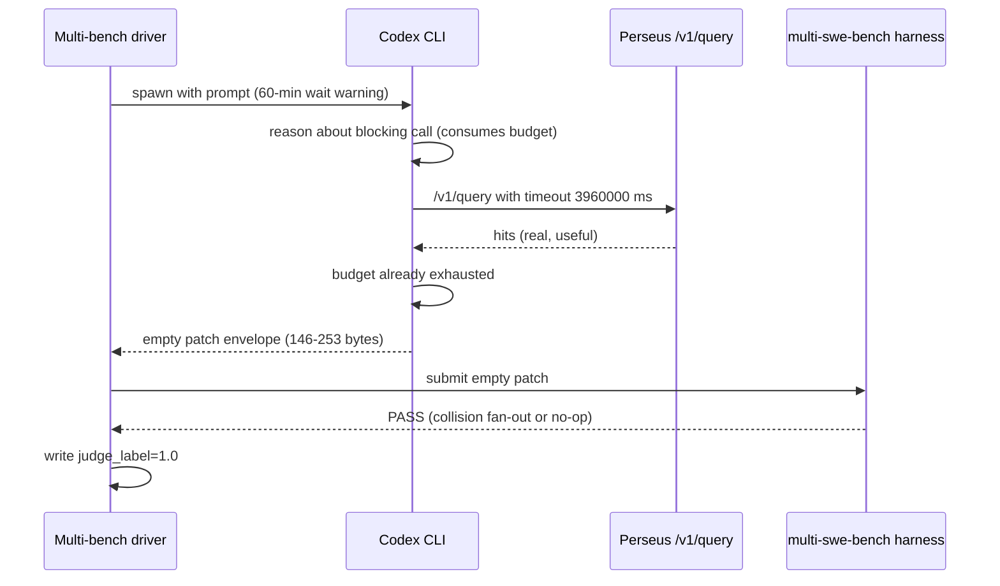
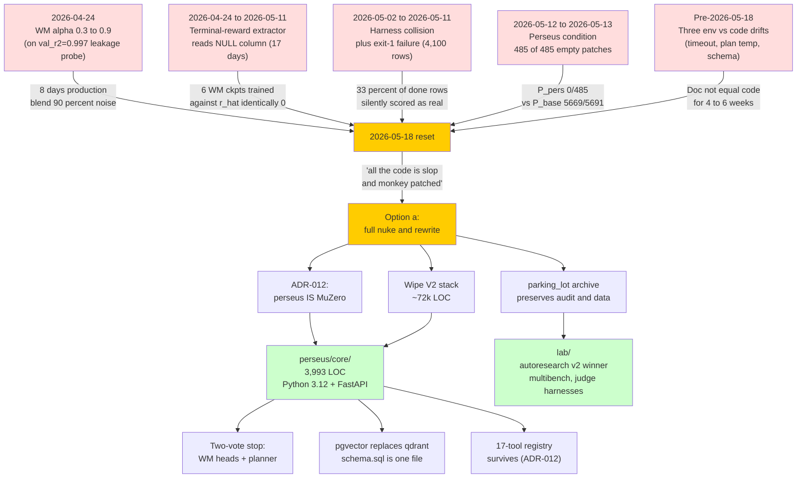
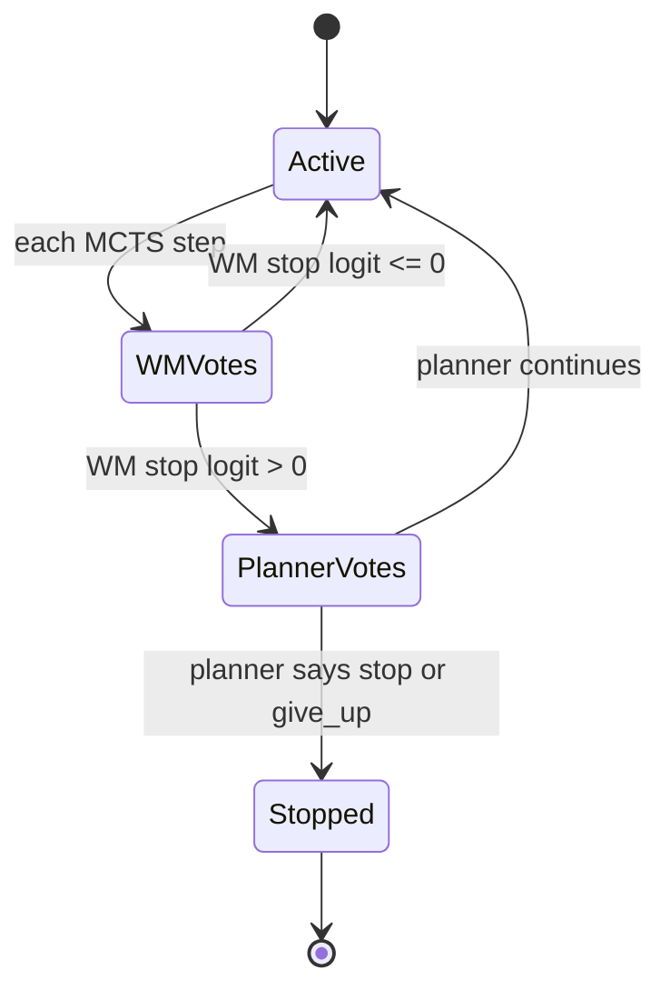
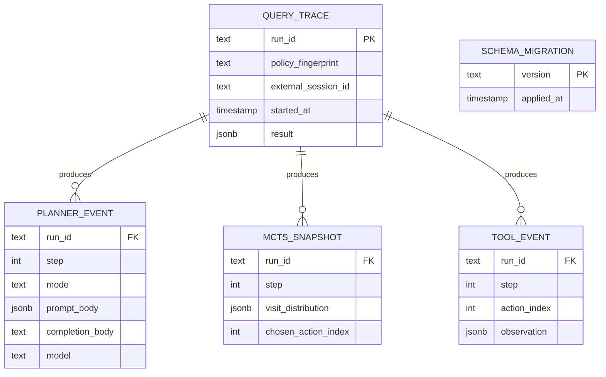
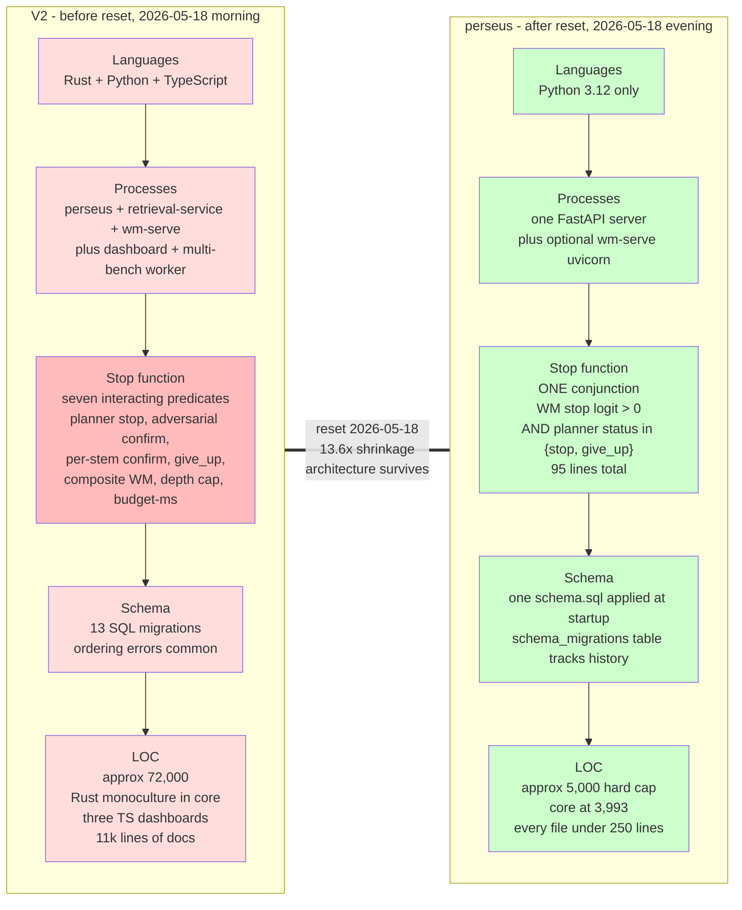

On 2026-05-18 we wiped perseus V2 and rewrote it.

The trigger was not a regression, a missed deadline, or a strategic pivot. It was a single distribution: across 6,545 labelled perseus-condition rows on multi-swe-bench, every prediction we shipped was between 146 and 253 bytes. That is the size of an empty diff envelope. The 8.86% pass rate we had been quoting was collision artifact and no-op-on-already-green tests stacked on a layer of NULL judge labels we had been mis-reading as zeros for seventeen days.

The MuZero architecture survived. Roughly 72k lines of Rust, Python, and TypeScript plumbing did not. What replaced it is 3,993 lines of Python in `perseus/core/`, a shrinkage factor of about 13.6. The action space is identical. The MCTS loop is identical. The value head is identical. The stop function compressed from seven interacting predicates to a two-vote conjunction. The retrieval backend swapped from a Rust crate over qdrant to a Python module over pgvector, with no measurable change in recall-at-10.

This essay documents the four-layer contamination cascade that produced the empty-patch distribution, the seam along which we cut, and the lessons we extracted. It is an audit of our own execution, not a celebration.

We were wrong about specific things in specific places, those wrongs compounded, and the only honest move was to throw out everything we could not prove was right. The cost we paid was code volume. The cost we did not pay was architecture, data, or team continuity. The bet we are now making is that the audit corpus we accumulated is more valuable than the implementation that produced it.

## 1. The triggering finding

The schema is boring. The multi-bench driver writes an integer column `prediction_bytes` whenever the codex sub-process emits a patch. The query is six lines of SQL, conditioning on the done-status rows and splitting by condition:

| condition | done  | produced patch (>300B) | empty patch | min B | max B   | avg B   |
| --------- | ----- | ---------------------- | ----------- | ----- | ------- | ------- |
| baseline  | 5,691 | 5,669                  | 22          | 77    | 868M    | 360,327 |
| perseus   | 485   | **0**                  | 485         | 146   | 253     | 157     |

The 146-byte floor is the JSON envelope around an empty diff. The 253-byte ceiling is the same envelope with a non-empty rationale field but still no patch payload. Not one perseus-condition row out of 485 carried a patch large enough to plausibly contain a real fix. The corresponding baseline distribution has a long right tail: median 360KB, max 868MB (a single row containing a full vendored dependency rewrite), and only 22 of 5,691 rows under 300 bytes.

The headline pass-rate decomposes cleanly when conditioned on patch presence:

$$
P_\text{perseus}^\text{clean} = \frac{0}{485} = 0.0\%
\qquad
P_\text{baseline}^\text{clean} = \frac{5669}{5691} = 99.6\%
$$

The 99.6% is "produced a non-empty patch," not "patch passes tests." Baseline's actual test-pass rate is 19.76%. Perseus's actual test-pass rate is structurally zero: a test cannot pass against a diff that does not exist. The 8.86% we had been citing was the average over a denominator that included contaminated rows whose verdicts had been fanned out from collision siblings.

There are exactly three ways an empty patch nominally "passes" the multi-swe-bench harness, and we observed all three:

1. The fail-to-pass tests were already green on the buggy commit (selection error in the upstream dataset).
2. The harness keys verdicts by repository and pull-request number only, so when ten variants of the same upstream PR write to the same key, the last write fans out.
3. The harness scores the absence of breakage on a regression test as success.

All three are artifact. None is "perseus retrieved well enough that codex landed a working patch." The seam between the retrieval output and the patching step had been silently broken for the entire experiment.

The proximate cause was a prompt that instructed the codex sub-process to make a blocking call into perseus that could "take up to 60 minutes" and to issue no other shell commands during the call. Combined with the codex per-attempt budget of roughly 100 minutes, that prompt exhausted the session in pre-call reasoning before any file edit could happen. The prompt also told codex that more than 70% of the time it would patch wrong files without perseus's help, which anchored every pre-call decision on a pessimistic prior that drove longer reasoning chains, which consumed more budget, which left less time for the actual edit. We were nudging codex into a worst-case behavior pattern using a statistic we had not measured.

The query lifecycle in production looked like this:

The retrieval was working. The planner was working. The world-model probes were firing. The patch never got written.

The fix to the prompt was staged on 2026-05-18 itself, hours before the reset call. The new prompt frames perseus as "the locator" and codex's local shell tools as "the verifiers and editors." Expected latency dropped from "up to 60 minutes" to "typically 5 to 30 seconds, worst case a few minutes." The instruction to issue no parallel shell commands was deleted. The 70% scare statistic was deleted. The blocking-call timeout dropped from roughly an hour to five minutes. We did not, at reset time, have empirical confirmation that the new prompt produced non-empty patches; the deploy was staged but the next sweep had not yet completed. The reset call did not wait for that confirmation. The whole stack was being replaced anyway.

## 2. The contamination cascade

The empty-patch finding was the visible surface of four layered failures, each of which had its own incident date and its own "this is fixed" claim that turned out to be false.

### 2.1 Seventeen days of zero terminal reward

The most expensive stratum, in date order. On 2026-04-25 the muzero export binary's default reward source was supposed to flip from file-recall to judge-label. The 2026-05-05 entry in V2's audit ledger claimed the flip had landed, with a verification claim that the terminal-reward distribution now spanned the set $\{-1, 0, +1\}$. It had not.

The Rust row struct did not carry the migration-008 columns. Every SELECT against the multi-bench-runs table silently dropped them. The extractor still matched on the legacy `result` column, which is NULL on every modern row because the driver writes scoring outcomes to `f2p_passed`, `p2p_passed`, and `judge_label` instead. The struct definition lagged the migration. The extractor lagged the struct. The audit ledger ran ahead of all three.

For the entire seventeen-day window the terminal reward extractor returned the constant zero:

$$
\hat r_t \equiv 0 \qquad \forall\, t \in \text{trajectories with reward-source = judge}
$$

The HL-Gauss head is designed to learn a distribution over rewards in $[-2, 2]$ across 51 bins. The cross-entropy training objective for a single trajectory step is:

$$
\mathcal{L}_v(t) = -\sum_{i=1}^{51} \mathbb{1}[r_t \in \text{bin}_i] \cdot \log \hat{p}_i(s_t)
$$

When $r_t$ is identically zero, only the bin spanning zero ever receives gradient signal. The head collapses to a delta distribution centered at the zero-bin. Combined with the per-step shaping rewards (which DO populate correctly and span $[-2.0, +0.285]$), the value target distribution narrowed to roughly $[-2.0, +0.285]$ instead of the intended $[-9.6, +1.2]$ that a well-mixed judge-reward signal would produce.

Six world-model checkpoints were trained against this corpus. Every one regressed toward zero by construction. The 2026-05-06 production checkpoint was scored at $R^2 = 0.997$ on its validation set, a number close enough to perfect that it should have been a fire alarm. We treated it as a triumph. The lesson is not "validate more carefully." The lesson is that an $R^2$ this high on a learning problem this hard is itself the bug report.

### 2.2 Harness collisions fanned 3,314 verdicts

The multi-swe-bench harness's evaluation contract keys results by repository slug and pull-request number. The perseus campaign matrix is five models times two conditions times $N$ pull requests, so for every PR up to ten trajectories write to the same key:

$$
|\text{trajectories per PR}| = |\text{models}| \times |\text{conditions}| = 5 \times 2 = 10
$$

$$
|\text{verdicts per PR}| = 1
$$

The harness emits one verdict; our driver fanned it across all ten input rows. The 2026-05-02 deploy notes flagged this as "acceptable trade-off for now." The 2026-05-11 audit measured the magnitude: 3,314 rows on the live table currently carry a fingerprint that requires this fan-out fix to read honestly.

A sibling failure: 786 rows whose harness invocation exited 1 on collision-heavy batches without writing the final report. Pre-fix every such row received `judge_source = mswebench_harness` and `judge_label = 0.0`, indistinguishable from a real failure. The combined contaminated cohort is $3{,}314 + 786 = 4{,}100$ rows, which is 33% of all done rows at audit time. Every pre-2026-05-11 perseus pass rate on every dashboard was reading 33% contamination as ground truth.

The backfill that addresses this is operationally non-trivial. The contaminated rows cannot be deleted (they carry trajectory and planner-event data that is still valuable for training). They must be re-tagged to a `harness_collided` source and have their labels NULLed so that downstream consumers treat them as unlabeled rather than as confirmed failures. The reset moots the backfill by emitting clean labels going forward; the V2 backfill remains a one-off SQL operation on the archived dump.

### 2.3 The world-model blend was anchored on leakage

The third stratum touches the runtime. On 2026-05-10 we deployed the leakage-anchored world model to our cato inference server. The deployment was triggered by a validation score we did not interrogate hard enough.

The validation $R^2 = 0.997$ was used to justify raising the MCTS prior blend coefficient from $\alpha = 0.3$ to $\alpha = 0.9$. The blend is the standard convex combination over the action prior:

$$
P_\text{prior}(a \mid s) = (1 - \alpha) \cdot P_\text{llm}(a \mid s) + \alpha \cdot P_\text{wm}(a \mid s)
$$

At $\alpha = 0.9$ the LLM planner's policy head contributes 10% of every node's prior. The world model contributes 90%. For the eight days from 2026-05-10 through 2026-05-18 (the entire perseus-condition production window for multi-bench) every UCB1 expansion drew its prior from $0.9 \cdot \text{noise} + 0.1 \cdot \text{signal}$.

The leakage was visible in retrospect on the checkpoint metadata. The validation set was sampled at the row level, not the instance level, so for every held-out row a sibling training row from the same trajectory leaked the answer. The validation $R^2$ measured pattern recognition over leaked siblings, not generalization. On a clean instance-split, the same architecture scored $R^2 = 0.112$, roughly three orders of magnitude lower. That is the honest baseline.

On 2026-05-18 we reset $\alpha$ to 0 as an emergency disable. The world-model probes still fire (telemetry preserved) but contribute zero to UCB until a clean checkpoint deploys. The UCB1 selection rule with the disabled blend reduces to:

$$
\text{UCB}(a; s) = Q(s, a) + c \cdot P_\text{llm}(a \mid s) \cdot \frac{\sqrt{N(s)}}{1 + N(s, a)}
$$

— the LLM prior alone, exactly as before the WM service was introduced. The fail-open path was tested at build time. The reset just exercises it.

### 2.4 Visit distributions silently fell through to uniform

The most subtle and longest-running failure. The Python loader's visit-distribution parser had two branches. One for a legacy flat-array shape; one for the object-list shape that Rust actually emits. When the parser saw the object-list shape it silently fell through to a uniform distribution.

The policy head loss is a KL-divergence-style cross-entropy between the predicted distribution $\hat{\pi}(s_t)$ and the MCTS visit target $\pi^M_t$:

$$
\mathcal{L}_\pi(t) = -\sum_{a} \pi^M_t(a) \cdot \log \hat{\pi}(a \mid s_t)
$$

When $\pi^M_t$ is uniform over 17 actions, the target carries zero information about which actions actually mattered, and the gradient pushes the policy toward maximum entropy. The policy head trained against uniform targets for an unknown number of weeks. The snapshot table held 6,360,475 rows at audit time. Every one was uniformized at load time.

| Stratum  | Window                  | Mechanism                                | Affected                                          |
| -------- | ----------------------- | ---------------------------------------- | ------------------------------------------------- |
| T2       | 2026-04-24 to 2026-05-11 | Terminal-reward reads NULL column        | Every WM ckpt trained with judge reward source     |
| T6       | 2026-05-02 to 2026-05-11 | Harness key collision fans verdicts      | 3,314 rows                                         |
| T6 prime | 2026-05-02 to 2026-05-11 | Harness exit-1 without final report      | 786 rows                                           |
| WM alpha | 2026-05-10 to 2026-05-18 | alpha = 0.9 against leakage-probe WM     | All 2,663 perseus-condition MCTS expansions        |
| T4       | Unknown to 2026-05-11   | Python visit-distribution uniform fallback | 6,360,475 snapshot rows                          |

Every stratum had a "fixed" claim that turned out to be untrue, partial, or later contradicted by the same audit ledger. The retraction log within V2's ledger is the single most useful artifact in the V2 archive.

Worth noting the cascade structure explicitly. The strata are not independent. The dependencies are:

1. The terminal-reward NULL was the upstream cause of the value-head collapse.
2. The value-head collapse fed the world-model blend with garbage.
3. The blend at $\alpha = 0.9$ amplified the garbage.
4. The amplified garbage drove MCTS into branches the codex prompt could not exploit.
5. The codex prompt was instructed to wait on perseus rather than act.
6. The empty patches that resulted got fanned out across collision siblings by the harness contract.
7. The inflated pass rate was treated as confirmation that the world model was good, which justified raising $\alpha$ from 0.3 to 0.9 in the first place.

Each layer reinforced the layer above it. No single fix would have caught the cascade. The audit caught it by reading the prediction-byte distribution directly, which sits at the bottom of the stack and cannot be inflated by any contamination above it. The lesson is to instrument the lowest-level observable that the cascade cannot reach. The empty-patch byte count is one such observable. The exit code of the test harness is not (it can be inflated). The label written to the database is not (it can be inflated). The bytes of the patch are real, regardless of how the cascade above them is configured.

Putting it together, the joint loss the world model was nominally optimizing was:

$$
\mathcal{L} = \mathcal{L}_v + \mathcal{L}_\pi + \mathcal{L}_r + \mathcal{L}_\text{aux}
$$

— value plus policy plus per-step reward plus auxiliary heads. Three of those four terms were degenerate. The value loss saw a delta at zero. The policy loss saw a uniform target. The reward loss saw the seventeen-day NULL contamination. Only the auxiliary head (file-recall regression) saw a clean signal. That is why the auxiliary head's metrics looked sensible while everything else either collapsed or memorized.

## 3. The "monkey-patched slop" moment

Sam's words on 2026-05-18, after the audit landed: "see all the code is slop and monkey patched now because you fucked up."

The phrasing is the trigger. A week earlier we had already exposed the watchdog layer as monkey-patched. V2's release build produced a binary with the semantic feature enabled by default. The semantic feature held a process-global hash map that grew without bound under concurrent indexing workloads. The operational workaround was a longer build invocation with non-default features. The one-line Cargo manifest change to remove `semantic` from the default feature set was specified in three separate documents and never landed. Every future release build without the explicit flag would rebuild the leaking binary.

This is a class of failure, not an instance. We named it: pattern §3.2 in V2's meta-audit, "fix specified in doc, code not committed." Three documents had described the same Cargo fix as shipped. Zero CI rules grep'd the audit ledger's "Files: ..." lines against `git log -p` for matching commits within the date window. The audit notes the obvious counterfactual: a docs-check test that grep'd each ledger line for git presence would have caught the first instance before six days of WM training poisoned. The test was proposed. Never written.

That class of failure — doc claims a fix is landed when the code change is not in git — was visible enough across the corpus that the only honest path forward was to delete the corpus. Not delete the architecture; delete the artifact that the corpus described. We chose full nuke plus rewrite.

## 4. Three env-vs-code drifts caught in the retraction pass

While the audit was running, three more drift cases surfaced between V2's audit ledger and the actual code. Each was surgically retracted on 2026-05-18 with a strikethrough plus an inline pointer to the authoritative file. The shape is consistent: doc made a claim on day N, code at day N either contradicted the claim or evolved away from it, no CI gate noticed, readers (including future Claude sessions) treated the doc as authoritative.

| # | Knob or claim                                | Doc claim                                                      | Code reality                                                  |
| - | -------------------------------------------- | -------------------------------------------------------------- | ------------------------------------------------------------- |
| 1 | Planner-call timeout default                 | "0 to 90000" (2026-04-23 audit item 25)                        | 0 (disabled; non-zero re-enables)                             |
| 2 | Plan temperature retry-bump                  | base plus $0.2 \cdot \text{retry}$, clamped at 0.6             | Discarded explicitly                                          |
| 3 | Parquet export schema column count           | 17 columns (2026-04-23 entry)                                  | 23 columns (vt2 promoted 2026-05-13)                          |

The retry-temperature decision is worth preserving for its reasoning. The in-code comment reads: bumping temperature on a parse-retry was counterproductive, because a malformed-JSON failure is rarely fixed by sampling more diversely. That is the right judgement. The bug was not that the code discarded the retry counter; the bug was that the doc said the opposite for over a month while the code did the right thing.

Authoritative source-of-truth for each knob is now a single in-code constant, not a paragraph in the audit ledger. ADR-004 (no silent fallbacks) makes the policy explicit: if a config value is required, the service refuses to start without it; if it is optional, the default is exactly one place in the code; documentation that contradicts the code is wrong, not authoritative.

The third drift (parquet schema) is the easiest to fix and the easiest to miss. A schema growing from 17 columns to 23 across two months of development is the expected behavior of a healthy training-data pipeline. Each added column came from a real need (judge label, trajectory length, embedding paths, sub-search name). The ledger entry that recorded "17 columns" was simply too old to be relevant. There was no equivalent of a database migration tracker to detect drift. The reset's response is a literal pyarrow schema expressed in code, exposed as a version constant on the writer, and validated at load time by the trainer. A trainer that loads parquet files written with a different schema version refuses to merge them.

## 5. ADR-012: perseus IS the MuZero pipeline

The reset's load-bearing decision lives at `docs/adr/012-perseus-is-muzero.md`, dated 2026-05-18. It supersedes an earlier framing that treated MCTS, the world model, and the 17-tool registry as research that lived in a lab directory until measured. That framing was wrong.

The verbatim Sam phrasing that triggered the retraction: "we are a muzero model and there's no fucking mcts." The complaint is structurally correct. A system that calls itself a MuZero implementation but treats the search component as an optional research feature is not actually a MuZero implementation. It is a retrieval system with an MCTS shaped attachment.

The new framing is the identity. State is an evidence accumulator: paths, line ranges, snippets, branch lineage. The action space is the 17-tool retrieval registry. The planner proposes actions plus a status token (`stop` or `give_up`) and carries branch lineage in the prompt. The value head learns "is this evidence sufficient" via HL-Gauss across 51 bins. The policy head outputs a prior over the next action and informs UCB. The step reward is per-step shaping (file recall, empty-tool-result penalty). The terminal reward is recall-at-k against the gold patch plus the judge label from running tests. MCTS provides selection, expansion, backprop. Self-play rollouts produce tuples of state, MCTS visit distribution, and value target. Training is supervised distillation followed by judge-label fine-tune followed by RL on rollouts.

Reading the identity row by row makes it clear there is no optional component. State, actions, value, policy, reward, search, rollout, training: each maps to a concrete piece of the codebase. The "perseus is a retrieval system" framing dropped half of these. The reset's framing keeps all of them in scope from day one.

The two-vote stop function is the most consequential single change. V2 had seven layered stop mechanisms fighting each other: planner-declared stop, adversarial confirm_stop, per-stem confirm_stop, give_up, composite WM stop, depth cap, budget-ms, max-steps. The 515-to-1 confirm-stop reject-to-accept ratio measured under V2's late-stage prompt was the visible signature of seven layers interfering. The reset reduces this to two votes:

The stop predicate is the conjunction of the two votes. Total stop logic is about 95 lines of Python across one module.

The conjunction is conservative by design. The world model can be wrong (and we now know it has been wrong for eight days at a stretch). The planner can be wrong (the V2 confirm-stop reject rate was 515 to 1 against accept). Requiring both votes means a single faulty signal cannot terminate a branch alone. The cost is slightly longer trajectories under noisy world-model inputs; the benefit is that no single layer can quietly truncate a search that should have kept going.

The 17-tool registry survives intact. ADR-012's stance is explicit: 17 tools coexisted with 0.26% combined usage of four of them; the fix is to keep them in the action space (the policy will learn what works), not amputate them. A trained policy learns that the repo-stats tool is rarely useful. Manually deleting it removes a baseline the policy could learn against. Action-space surgery is a research operation, not an engineering optimization, and the reset deliberately avoids confusing the two.

## 6. What got amputated

The amputations are real, even though the architecture survives. The pattern is consistent: anything that orchestrated, served, or wrapped became a Python rewrite at a smaller scope. Anything that defined the algorithm survived.

A useful way to read the amputation table is to ask, for each row, "if we replaced this with a stub that returns hard-coded values, would the architecture still work?" For the retrieval-service, the multi-bench orchestrator, the judge-bootstrap subsystem, and the autoresearch plumbing, the answer is yes — they are integration code that connects perseus to external systems. For the MCTS loop, the world-model heads, and the per-step shaping, the answer is no — they are the system. The reset deleted the things that could be replaced with stubs and rewrote the things that could not.

| V2 component                            | LOC approx              | Replacement                                                    | Replacement LOC          |
| --------------------------------------- | ----------------------- | -------------------------------------------------------------- | ------------------------ |
| Rust retrieval-service crate            | ~8,000                  | Python retrieval module, pgvector backend                      | ~950                     |
| Rust multi-bench orchestrator           | ~2,500                  | Python wrapper around public harness                           | ~600 (TBD)               |
| Rust judge-bootstrap subsystem          | ~1,800                  | Python plus Docker                                             | ~500 (TBD)               |
| autoresearch v1 through v4 plumbing     | ~600 plus 229.94 USD spend | Python lab module (parking lot preserves v2 winner blob)    | ~250 (TBD)               |
| Seven-layer stop function               | ~700                    | Two-vote conjunction in `stop.py`                              | ~95                      |
| 13 SQL migrations                       | 13 files                | Single `schema.sql` applied at startup                         | 1 file                   |
| Three TS dashboards                     | ~5,000 TS               | Single Svelte 5 plus Tailwind 4 SPA                            | ~1,200 (TBD)             |
| Rust planner runtime                    | ~6,000                  | Python `mcts.py` + `stop.py` + `llm.py`                        | 288 + 82 + 193 = 563     |
| Rust parquet exporter                   | ~1,500                  | Python judge-bootstrap export                                  | ~300 (TBD)               |

The retrieval-service amputation is the most surprising. It was the most-recently-rewritten V2 component (the audit-fix chain on 2026-04-24 had ported a Python service to Rust under a strict 150-line-per-file cap). Eight thousand lines of Rust, every file under 150 lines, every interface clean — and we amputated it anyway.

The reason is not that the engineering was bad. It is that the same codebase that hosted that service also hosted the multi-bench driver, the judge harness, the autoresearch loop, the muzero exporter, and the planner. The Rust monoculture was not the bug. The Rust monoculture made the bug invisible: cross-cutting concerns (the UCB exploration constant, prompt drift, the world-model alpha, the semantic feature gate) silently affected every module. A change to the retrieval client's reqwest pool could deadlock the planner. A change to the planner's prompt-context layout could blow up the multi-bench harness. A bug in the semantic-feature default could leak memory across both. The coupling was invisible because everything shared a Cargo workspace; the testing surface was small because everything used the same types.

A Python re-implementation at one-eighth the size restores the right kind of friction. The retrieval module exposes a typed retrieval-backend protocol. The planner depends on the protocol, not on a concrete implementation. Swapping pgvector for qdrant, or swapping pgvector for an in-memory dict for testing, is a single-file change. The V2 retrieval-service-to-planner coupling required four files across two crates plus a config flag.

The autoresearch parking-lot is the second-most-surprising. V2 ran four autoresearch generations that searched prompts via MCTS-over-prompts, judged candidates against recall-at-k on a held-out 100-instance pool. The v2 winner blob (commit hash `3c7f945f`, total spend 229.94 USD, score lift from 11.83 baseline to 13.50) is preserved as data. The v3 and v4 pipelines were amputated.

The reason to preserve the v2 winner but delete its pipeline is asymmetric. The prompt blob is a piece of data we paid for. It can be re-loaded into any future autoresearch loop as an initial condition. The pipeline that produced it depended on V2's planner runtime, V2's retrieval semantics, V2's prompt-context layout — none of which exist in perseus. A reset that preserved the pipeline would also have preserved the surface that the pipeline coupled to, which would re-introduce the coupling we just paid to remove. Preserving the blob costs 4KB of disk. Preserving the pipeline would have cost roughly 600 lines of V2 plumbing that nothing else needs.

The thirteen migrations consolidating to one is an honest cleanup move. V2 accumulated migrations 001 through 010, each adding a column or partial index in response to a new need. By 2026-05-18 several were effectively dead code: the early observability table overlapped with the later judge-label columns, and migration 010's typed planner-event columns made some of migration 006's JSONB body columns redundant. The reset consolidates into a single startup-applied schema with a real migrations tracking table. No more "did I run all the migrations in the right order on engram" Slack messages.

The reset's schema, expressed as a mermaid ER diagram:

Five tables, four foreign keys, one migration tracking row. The full schema fits on a single screen. The V2 schema required scrolling through ten files in numeric order, mentally applying each diff, to figure out what the current shape was.

## 7. What survived

The amputation table reads more violent than the actual diff. The architecture survives without modification. The 2026-04-22 V2 design notes — 17 tools, MCTS planner, WM priors, HL-Gauss heads, per-step shaping — describe the 2026-05-18 reset as accurately as they described V2.

This is the single fact that distinguishes a reset from a pivot. A pivot is a change of direction; the destination is somewhere else. A reset is a change of vehicle; the destination is the same. The team's PLAN.md on 2026-05-18 names the same north-star metric (judge-pass-rate on multi-swe-bench instance-level held-out splits) that the V2 PLAN.md named on 2026-04-22. The hypothesis (retrieval-conditioned codex patches pass more tests than unconditioned codex patches) is unchanged. The architecture is unchanged. The team is unchanged. What changed is the implementation.

| Architecture concept                                                  | V2 location                                  | perseus reset location                            |
| --------------------------------------------------------------------- | -------------------------------------------- | ------------------------------------------------- |
| 17-tool action space                                                  | Rust planner tools directory                 | `perseus/core/actions.py` plus retrieval/tools    |
| MCTS plus UCB1                                                        | Rust planner runtime                         | `perseus/core/planner/mcts.py`                    |
| 51-bin HL-Gauss value head                                            | wm-serve Python service                      | `perseus/core/wm/heads.py`                        |
| Convex prior blend $(1-\alpha) \cdot \text{LLM} + \alpha \cdot \text{WM}$ | Rust WM client                            | `perseus/core/wm/blend.py`                        |
| Per-step shaping                                                      | Rust rewards module                          | `perseus/core/training/rewards.py`                |
| Policy training target $\pi^M_t$ via MCTS step snapshots              | Migration 007 plus Rust snapshotter          | Schema table plus emit from `mcts.py`             |
| Branch lineage plus global digest in planner prompt                   | Rust context modules                         | `perseus/core/planner/llm.py`                     |
| Policy fingerprint on every trajectory                                | Rust fingerprint module plus migration 009   | `perseus/core/trace.py`                           |
| `give_up` as state transition                                         | Rust step-stop module                        | `perseus/core/planner/stop.py`                    |
| External session id for trace-join                                    | Header plus body field on query endpoint     | Header plus body field on query endpoint          |

The match is 1-to-1. Every V2 concept has a perseus home; the mapping is not approximate. Even the auxiliary surfaces survive: cohort split by policy-fingerprint hash, JSONL trace events, the external-session-id header, per-step snapshot emission. The reset is not a redesign. It is a re-implementation of the same design without the accumulated plumbing debt.

This matters more than the line count. A reset that preserved architecture would have produced a 5,000-line Python codebase implementing a different algorithm, and we would not know whether the V2 numbers (or the lack of them) generalized. A reset that broke architecture would have committed us to re-running every benchmark from scratch, with no way to attribute changes to the rewrite versus the new algorithm. By holding architecture invariant and replacing only plumbing, we can read V2's archived audit corpus as a baseline. The world model still consumes the same state representation; the planner still emits the same action structure; the snapshot table still records the same visit distribution. The training data that the reset produces is drop-in compatible with the V2 training data the audit was based on.

## 7b. V2 vs perseus, side by side

The amputation and survival tables describe the cut in detail. The diagram below renders the same cut as a single side-by-side comparison of the runtime surface. Read top-to-bottom on each side: languages, process count, stop-function complexity, schema shape, and approximate LOC.

Each row of the comparison is a single seam along which V2 had accumulated friction. Three languages became one because the cross-language coupling was the cost center, not any individual language. Five processes became one because every inter-process boundary in V2 carried its own retry policy, timeout policy, and schema migration. Seven stop predicates became one conjunction because the seven-layer arrangement was producing the 515-to-1 confirm-stop reject rate the audit measured. Thirteen migrations became one schema file because the migration order was a recurring source of "does engram have the latest" failures.

The 13.6x shrinkage is the visible number. The invisible number is the number of cross-cutting concerns that no longer exist. The UCB exploration constant is set in one place, not three. The world-model alpha is one config field, not one env var plus one Cargo default plus one Python override. The retrieval endpoint is one string, not a fan-out of three. Most of the reset's value is in what is no longer there.

## 8. LOC accounting

The before-and-after by directory makes the cut concrete.

V2 lines of code by directory, from the 2026-05-13 audit snapshot:

| Directory                          | LOC      | Notes                                          |
| ---------------------------------- | -------- | ---------------------------------------------- |
| Rust planner runtime               | ~6,000   | MCTS, context, tools                           |
| Rust search engine                 | ~2,500   | Semantic index, candidate collection           |
| Rust multi-bench                   | ~2,500   | Orchestrator                                   |
| Rust judge bootstrap               | ~1,800   | Docker harness wrapper                         |
| Rust muzero export                 | ~1,500   | Parquet, rewards, trajectory                   |
| Rust retrieval-service crate       | ~8,000   | 150-line cap per file                          |
| Rust src rest                      | ~7,500   | App, handlers, store, eval, doctor             |
| Python muzero                      | ~4,500   | Training, dataset, heads                       |
| Python rest                        | ~3,000   | Bench harnesses, ad-hoc scripts                |
| wm-serve                           | ~600     | Uvicorn WM service                             |
| Dashboard                          | ~5,000   | Rust plus TS                                   |
| Scripts                            | ~10,000  | Operational shell                              |
| Modal distill and RFT              | ~3,000   | Training scripts                               |
| Tests                              | ~6,000   | Integration and unit                           |
| Docs                               | ~11,000  | Reference, research, ADRs                      |
| **V2 total**                       | **~72,000** |                                              |

Perseus reset lines of code:

| Directory                  | LOC       | Status                                  |
| -------------------------- | --------- | --------------------------------------- |
| `perseus/core/`            | 3,993     | Done                                    |
| `perseus/tests/`           | ~800      | In progress                             |
| `lab/`                     | ~1,200 budget | In progress                         |
| `infra/`                   | ~500 budget    | In progress                        |
| `viz/`                     | ~1,200 budget | In progress                         |
| **perseus target**         | **~5,160** | Hard cap 5,000 LOC for core             |

The shrinkage is roughly $72{,}000 \to 5{,}300 \approx 13.6\times$. The core identity (planner, world model, retrieval, state, actions) sits at 3,993 lines. Every file is well under the per-module hard cap of 250 lines (enforced by CI). Every directory has a single responsibility. Switching the retrieval backend, swapping the embedder, replacing the planner LLM — each is a one-protocol-swap operation, not a multi-file refactor.

## 9. Three lessons

The reset distilled into three lessons that are now literally posted in the team's planning preamble. Each corresponds to a specific contamination pattern from the audit.

### 9.1 The instrument is part of the experiment

Three env-vs-code drifts (the table in section 4) silently invalidated cohorts. The drift was always between a documented default and an in-code constant, and the in-code constant was always authoritative. The drift was not detectable from inside a running query — perseus's runtime did not know that the ledger claimed one timeout value while the environment file set a different one. Cohorts that ran under the doc default and cohorts that ran under the code default mixed silently in the same policy-fingerprint hash. The 17 days of terminal-reward contamination is the upper bound of how bad this gets when the instrument is wrong.

The reset response is structural:

1. One config source, read through `pydantic-settings`. No shell-style default substitution. No environment-file backstops that mask in-code constants.
2. Every defaulting site is either an explicit field with an explicit value, or a required field that fails loudly at service startup.
3. Every running process logs its resolved configuration as the first line of its trace. Cohorts can be split by config-hash post-hoc.
4. The policy-fingerprint hash takes the configuration hash as an input. A change in any defaulted value produces a new fingerprint. Cohorts with different fingerprints cannot be silently mixed.

The cost of this structure is that a misconfigured service refuses to start. The benefit is that we never again train against a fingerprint that means two incompatible things to two different agents on two different days.

### 9.2 Docs are not provenance

The 2026-05-05 ledger entry was the proof. It contained an English description of the bug, an English description of the fix, a claim that a 500-trajectory smoke test had been run, a claim that the terminal-reward distribution now took three distinct values, and a file list naming four touched source files. Every part of it was plausible. None of it was true. The fix was specified; no commit shipped. Six days of WM training were poisoned. The 2026-05-11 entry retracts in one line: the 2026-05-05 entry claimed the fix was landed; it was never implemented.

If docs were provenance — if every "Files: ..." line had been mechanically grep'd against the corresponding git history window — the 2026-05-05 claim would have failed CI. Provenance lives in git, not in markdown.

The reset response has three structural elements:

1. ADR-005 (checkpoint provenance): every model file ships with a sibling metadata file containing split strategy, training data range, validation metrics per head, and git commit. Loading a checkpoint without metadata fails loudly. The leakage-probe checkpoint that caused the eight-day production incident would not load under this policy.
2. ADRs are dated, signed, and reference either a commit or a configuration file. No "behavior X was changed on date Y" claim survives without a git-pinned anchor.
3. A pre-commit hook (queued, not yet shipped) will grep commit messages for file references and refuse the commit if any referenced file is not actually in the staged diff. This catches the "Files: ..." class at the moment of authorship.

The pattern we are blocking is well-defined. An agent (human or LLM) writes a plausible English description of a fix, names the files that should change, and commits the documentation without committing the code. Future readers treat the documentation as authoritative. The fix never happens. The cost is hidden until the downstream effect surfaces in a metric, at which point the documentation has been compounded into the rest of the audit ledger and is hard to retract. Mechanical provenance breaks the cycle at step one.

### 9.3 Architecture survives, plumbing burns

The retrieval-service amputation makes this explicit. The Rust service was well-engineered. It was deleted anyway. Not because the engineering was bad — because the engineering choices (Rust, separate crate, in-tree with the planner) optimized for the wrong invariants.

The right invariants for this stage of the project:

1. Easy to read across a three-person team. Python wins on the reading-speed axis; even competent Rust readers are slower than competent Python readers on equivalent code.
2. Easy to swap an implementation behind a protocol. Python's structural protocols and Rust's nominal traits both work, but Python's cost less when the implementation is small.
3. One process, one schema, one CLI. V2 had three processes (perseus, retrieval-service, wm-serve), nine schemas (ten migrations minus consolidation), and seventeen CLI subcommands. The reset has one process, one schema, three CLI subcommands.
4. Reset cost dominated by code volume, not by language-runtime cost. A future reset (and there will be one) should cost no more than a week of work.

A Python re-implementation at 950 lines backed by pgvector satisfies all four. A Rust crate at 8,000 lines satisfies none.

The architecture concepts — MCTS, world-model blend, HL-Gauss heads, two-vote stop, policy-target snapshots — survived intact. The plumbing burned. The reset is a clean separation of those two categories. Anything we could express as a definition (data structure, mathematical update, loss term, training target) survived. Anything we could only express as an implementation (HTTP client pool, retry logic, schema migration, deployment script) was replaced from scratch.

## 10. What the parking_lot preserves

The reset was not a destructive delete. The V2 tree was rsync'd to a dated archive directory with a manifest. The preserved corpus is read-only; nothing in perseus depends on it; future agents can read it for context.

Forty-four HISTORY markdown files document V2's design, evals, prompts, sweeps, training data, postgres schema, tool registry, autoresearch generations, dashboards, and dead ends. The load-bearing one is HISTORY/33, which documents the empty-patch finding row-by-row. HISTORY/36 is the meta-research log on V2's retraction patterns and is the source for sections 3 and 4 of this essay. V2's full audit ledger is preserved with every retraction inline. Session-state corpus at reset time (AGENT_HANDOFF, WAKE_UP_REPORT, hi.md, hi-compact.md, RUN.md) survives as a snapshot of what the team thought was true on the day of the reset.

The autoresearch v2 winner prompt blob is preserved as data because the prompt may still be useful as an initialization for the reset's autoresearch module. The day-of blocking-call removal in V2's prompt module is preserved so the diff is recoverable. A postgres dump of the observability tables (`query_traces`, `planner_events`, `mcts_step_snapshots`, `tool_events`, `multi_bench_runs`, index-build status) is preserved: roughly 19,881 multi-bench rows post-backfill, with collisions tagged and labels NULLed. The bytes are kept because re-generating them costs roughly 1,400 USD in API spend and roughly three weeks of harness running.

World-model checkpoints are split into two categories. The honest-baseline chain (instance-split, $R^2 \approx 0.11$) and the Tinker fine-tune are preserved. The leakage-probe checkpoint that anchored the $\alpha = 0.9$ mistake is NOT preserved. ADR-005 explicitly refuses to load a checkpoint without an instance-split metadata header. The artifact that caused the problem does not get to live in the archive.

The reset cost a lot of code but very little data. Every row of every contaminated cohort is still reachable for forensic analysis. The corpus that says "this is what happened and why" survives. The corpus that says "this is the code that did it" does not — by design, because that code shipped buggy results and any agent reading it for context will be tempted to mimic its patterns.

The asymmetry between preserving data and deleting code is deliberate. Data is expensive to produce and cheap to store. Code is cheap to produce and expensive to maintain. A future agent reading the parking lot will be able to re-run any analysis we ran, because the rows are there. The same agent will not be able to re-run V2's planner runtime, because the source is archived but no longer builds. That is the intended trade. If we needed to re-build V2, the right path would be to read the architecture description (preserved), re-implement the relevant slice in the reset's language (Python), and run it against the preserved data. The wrong path would be to resurrect 72k lines of Rust and convince ourselves we understand what it does.

## 11. What the reset call actually was

The reset was not "throw away the architecture and start over." The reset was a clean cut along a specific seam: anything that described what perseus does (the MuZero pipeline) survives in a smaller form in a different language; anything that described how V2 plumbed it together is gone. Sam's phrasing: the architecture was right, the execution was sloppy.

The decision was reversible right up until the rsync into the parking lot. We considered two alternatives. Option (a) was full nuke plus rewrite, which is what we shipped. Option (b) was surgical fixes to V2: land the parquet-schema retraction, apply the harness collision backfill, ship the docs-check CI rule, fix the prompt, retrain the world model on a clean instance-split. Option (b) was estimated at three to four weeks of work and would have produced a V2 we could trust. Option (a) was estimated at one to two weeks of work and produced a perseus we could read.

We chose (a) because the cost of (b) was not just three weeks of engineering. The cost of (b) was three weeks of engineering plus a permanent commitment to maintaining V2's accumulated complexity. Every future change would have to navigate the 72k lines. Every future audit would have to start by re-reading the retraction log. Every future agent reading the codebase would inherit V2's patterns. Option (a) buys a smaller codebase and a cleaner audit surface at the cost of throwing away well-engineered components alongside the broken ones. We judged that trade worth taking.

The two months between V2's first sweep and the reset produced exactly one useful artifact: the audit corpus. The audit found that perseus's empirical pass rate was structurally zero on the cohort we cared about. The audit found the four contamination strata (section 2). The audit found the three env-vs-code drifts (section 4). The audit found the "fix specified, code not committed" pattern (section 3).

Every other artifact — the Rust orchestrator, the eight-thousand-line retrieval service, the dashboards, the autoresearch pipelines, the seven-layer stop function, the eleven migrations — was a sunk cost that the reset chose to pay rather than continue maintaining. The cost was paid in code volume (13.6x shrinkage). The cost was NOT paid in architecture (every V2 concept survives in `perseus/core/`). The cost was NOT paid in data (every contaminated row is preserved).

The reset is what the audit recommended without naming itself. The audit proposed five remediation items:

1. Retract the broken claims in-place using the established strikethrough-plus-pointer template.
2. Add a docs-check CI rule that grep's ledger file-lists against git history to refuse any "Files: ..." claim whose targets are not in the corresponding diff.
3. Convert all docs to the agent-handoff model where every liveness claim ships with a probe command, so future readers can verify rather than trust.
4. Complete the harness collision backfill on the contaminated cohort.
5. Enumerate the silent-fallback class across the codebase, treating each instance as a numbered audit item.

Four of the five are subsumed by the reset: there are fewer docs to fix because most are gone; the harness backfill is moot because the new pipeline produces a clean cohort; the silent-fallback enumeration is closed by ADR-004; the agent-handoff conversion is the perseus default rather than a retrofit. The docs-check rule is open work, queued as a pre-commit hook that grep's commit-mentioned files against the staged diff. It is the one piece of the audit's recommendation that the reset did not automatically satisfy, and we have committed to shipping it before the first reset-era ADR lands.

## 12. Looking forward

The reset closes a chapter, not the project. The next chapter starts with concrete numbers:

1. Core LOC is 3,993, hard cap 5,000. Every file is under 250 lines. CI enforces both bounds.
2. The two-vote stop function is 82 lines, replacing roughly 700 lines of V2 stop logic. The confirm-stop reject-rate metric is retired.
3. A single startup-applied schema file replaces ten migrations. The schema-migrations table tracks what has been applied so we never lose history.
4. The world-model alpha is 0 (emergency disabled). It reverses the moment a clean instance-split checkpoint deploys. The fail-open path is exercised by default.
5. The empty-patch contamination is structurally gone. The new query endpoint returns hits the consumer can apply directly; there is no codex middleman to silently swallow them. The retrieval output and the patch generation are no longer in different processes.
6. Cohort identity is established at service startup and stamped on every trace. Two cohorts cannot have the same fingerprint and different defaults.

What we do not yet have: a clean training corpus on the new pipeline. The first cohort under the reset starts collecting on 2026-05-19. The first instance-split world-model checkpoint that satisfies ADR-005 is expected within two weeks. The first end-to-end measurement of perseus pass-rate that we will trust as honest is expected within a month.

What we should not claim: that the reset is "validated." It is not. It is shipped. The validation is the next cohort, and the cohort after that, and the audit corpus we will accumulate against them. The reset removes the failure modes we know about. The failure modes we do not yet know about will surface in the next audit, and we will document them in the same retraction template the V2 ledger established.

The MuZero identity holds. The plumbing is new. The audit is the throughline.

A final note on the trade we accepted. The reset removes a class of failure (silent drift between docs and code, cross-cutting concerns hiding in a Rust monoculture, schema migrations accumulating without consolidation) at the cost of throwing away well-engineered components that did not cause the failure. The retrieval service was not the bug. The 150-line-per-file cap was not the bug. The Rust type system was not the bug. They were collateral. We deleted them because the only honest way to remove the failure class was to remove the substrate it lived on. A more surgical reset would have preserved more code at the cost of preserving the conditions for the next incident. We will know in three months whether we made the right call. The dashboards will tell us before we tell ourselves.
