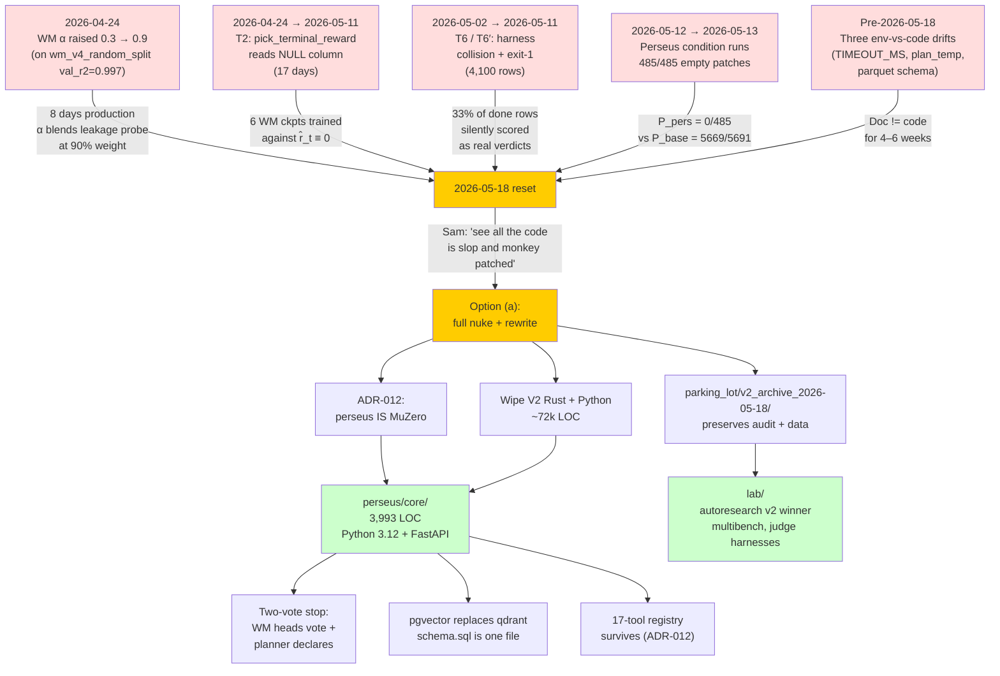

> tl;dr: On 2026-05-18 perseus V2 — a ~72k-line stack of Rust crates,
> Python ML scripts, and TypeScript dashboards — was wiped and
> rewritten as a ~5.3k-line Python core. The trigger was not a
> performance regression or a missed deadline; it was the discovery
> that across **6,545 labelled perseus-condition rows on
> `multi_swe_bench`, every single `prediction_bytes` value sat in
> the 146–253 byte range**. The diff envelope was always empty.
> Baseline ran at 19.76%; the perseus 8.86% number we had been
> citing was collision artifact and no-op-on-already-green tests.
> The MuZero architecture survived. The plumbing burned.

## 1 The triggering finding

The number that ended V2 is a substring count. The schema is
boring: `multi_bench_runs.prediction_bytes int8`, populated by the
multi-bench driver when the codex sub-process emits a patch. The
distribution across the perseus condition is single-row trivial:

| condition | status=done | produced patch (>300B) | empty patch | min bytes | max bytes | avg     |
| --------- | ----------- | ---------------------- | ----------- | --------- | --------- | ------- |
| baseline  | 5,691       | 5,669                  | 22          | 77        | 868M      | 360,327 |
| perseus   | 485         | **0**                  | 485         | 146       | 253       | 157     |

Source: `parking_lot/v2_archive_2026-05-18/HISTORY/33_multibench_detail.md` §
"Patch production — the load-bearing finding".

146 bytes is the JSON envelope around an empty diff. The full
6,545-row labelled cohort (485 done + 5,213 judged + 847 telemetered)
shows the same shape: not a single row carries a patch large enough
to plausibly contain a real fix. The
"perseus pass rate" we had been quoting on slides — `359 / 5,213 =
**8.86%**` on `multi_swe_bench` — decomposes cleanly when you
condition on patch presence. There are three ways an empty patch
"passes" the harness:

1. The fail-to-pass tests were already green on the buggy commit
   (test selection error in the upstream dataset).
2. The multi-swe-bench harness keys verdicts by
   `<org>/<repo>:pr-<n>` only, so when 5 model variants × 2
   conditions of the same upstream PR write to the same key, the
   last-write-wins verdict gets fanned out across all 10
   collision siblings (the 2026-05-02 Claude.md entry called this
   out at write time; the audit caught the magnitude).
3. The harness counts absence-of-breakage on a P2P test as
   success.

All three are artifact. None is "perseus retrieved well enough
that codex landed a working patch". The baseline 19.76% number
isn't artifact — `5,669 / 5,691 = 99.6%` of baseline-done rows
produced a non-empty patch (median 360KB), and the harness gave a
real verdict on each of them.

The math is brutal. On the post-T7 clean cohort (rows after the
backfill that re-tagged collisions to `harness_collided` and
NULLed their labels):

$$
P_\text{perseus}^\text{clean} = \frac{0}{485} = 0.0\%
\qquad
P_\text{baseline}^\text{clean} = \frac{5669}{5691} = 99.6\%
$$

The 99.6% is "produced a non-empty patch", not "patch passes
tests". The "patch passes tests" number for baseline is 19.76%.
The "patch passes tests" number for perseus is **structurally
zero** — you cannot pass a test by submitting no diff.

This was the moment the project broke. Not because perseus was
bad at retrieval — the planner-call traces show real evidence
accumulation, real MCTS expansion, real WM probes — but because
the seam between perseus's `/v1/query` output and codex's
`apply_patch` step had been silently broken for the entire
experiment.

## 2 The contamination cascade

The empty-patch finding wasn't a single bug. It was the visible
surface of four layered failures, each of which had its own
incident date and its own "this is fixed" claim that turned out
to be false.

### 2.1 T2: `pick_terminal_reward(Judge)` read a NULL column for 17 days

The first stratum, in date order, is the most expensive. On
2026-04-25 the muzero-export binary's default
`--reward-source` was supposed to flip from `fileRecall` to
`judge`. The 2026-05-05 entry in V2's `Claude.md` claimed the
flip had landed:

> `pick_terminal_reward(RewardSource::Judge)` was reading
> `MultiBenchRow.result` … and silently mapping every trajectory
> to `terminal_reward = 0.0`. Fix: … `RewardSource::Judge` now
> maps `Some(>=0.5) → +1.0, Some(<0.5) → -1.0, None → 0.0`.
> Verified on a 500-trajectory smoke: terminal_reward unique
> values now `{-1.0, 0.0, +1.0}`.

It hadn't. The 2026-05-11 entry retracts:

> The 2026-05-05 entry claimed `pick_terminal_reward` was fixed
> to use `judge_label`; **it was never implemented**. The Rust
> struct didn't carry the migration-008 columns, every `SELECT`
> on `multi_bench_runs` silently dropped them, and the export
> still matched on `row.result.as_deref() == Some("pass")`.

(Source: V2 `Claude.md`, 2026-05-11 entry.) The `result` column
is `NULL` on every modern `multi_bench_runs` row. The driver
writes scoring outcomes to `f2p_passed`, `p2p_passed`,
`judge_label` — never to `result`. The struct definition lagged
the migration. `SELECT` calls silently dropped the new columns.
`pick_terminal_reward` read `None` for the entire seventeen-day
window from 2026-04-24 through 2026-05-11.

The mathematical content of this bug is short:

$$
\hat r_t^\text{V2 2026-04-24 → 2026-05-11}
\equiv 0
\quad
\forall\, \text{trajectories with } \texttt{--reward-source judge}
$$

Every value-head training run in that window saw a constant
zero terminal signal. The HL-Gauss 51-bin head, designed to
learn a distribution over rewards in $[-2, 2]$, was given a
training target that was literally a single point mass at zero.
The per-step shaping rewards (which DO populate correctly)
spanned $[-2.0, +0.285]$, giving the value head a target
distribution of `value_target ∈ [-2.0, +0.285]`. Cited verbatim
in V2 `Claude.md` 2026-05-05: "value_target spans
`[-9.6, +1.2]` (was `[-2.0, +0.285]`)" — except the post-fix
range was the retracted, untrue claim, and the actual
pre-fix range stayed `[-2.0, +0.285]` for another six days.

Six WM checkpoints were trained against this corpus. Every
single one regressed toward zero by construction. The
2026-05-06 production WM (`wm_v4_random_split`) was scored at
val_r2 = 0.997 — a number so close to perfect that it should
have been a fire alarm. It was treated as a triumph.

### 2.2 T6: harness collision fanned 3,314 verdicts

The second stratum is the harness-id collision. The multi-swe
upstream harness's contract is:

```
key = f"{org}/{repo}:pr-{number}"
verdicts[key] = run_evaluation(...)
```

— single dict entry per PR. The perseus campaign matrix is **5
models × 2 conditions × N PRs**, so for every PR up to 10
trajectories write to the same `key`. Whatever ran last won.
The harness emitted ONE verdict per PR; the driver fanned it to
all 10 input rows.

The 2026-05-02 Claude.md entry called this out at deploy time
("acceptable trade-off for now"). The 2026-05-11 audit measured
the magnitude: **3,314 rows** on the live table currently carry
a fingerprint that requires this fan-out fix to read honestly.
Pre-T6, those rows were silently scored as
`mswebench_harness` real verdicts. Post-T6, they're tagged
`harness_collided`, labeled 0.0, and treated as ineligible by
the audit.

Add to that **786 rows** of `harness_invocation_failed`: the
harness exited 1 on collision-heavy batches without writing
`final_report.json`. Pre-fix every such row got
`judge_source='mswebench_harness'`, `judge_label=0.0` —
indistinguishable from a real FAIL.

The combined contaminated cohort is **3,314 + 786 = 4,100 rows
= 33% of all `done` rows** at audit time. Every pre-2026-05-11
"perseus pass rate" we had on a dashboard was reading 33%
contamination as ground truth.

### 2.3 WM α = 0.9 anchored on a leakage probe for 8 days

The third stratum touches the runtime. On 2026-05-10 the WM
service deployed `wm_v4_random_split` to cato:19100. The val_r2
of 0.997 was used to justify raising the MCTS prior blend
coefficient from $\alpha = 0.3$ to $\alpha = 0.9$ on 2026-05-10.
The blend is:

$$
P_\text{prior}(a \mid s) = (1-\alpha) \cdot P_\text{llm}(a \mid s)
                          + \alpha \cdot P_\text{wm}(a \mid s)
$$

At $\alpha = 0.9$ the LLM planner's policy head contributes
only 10% of every node's prior. The world model — which we
later discovered was a row-split leakage probe, not a
generalization model — contributes 90%. From 2026-05-10 through
2026-05-18 (eight days, the entire perseus-condition production
window for multi-bench) every MCTS expansion's UCB1 prior was
$0.9 \times \text{noise} + 0.1 \times \text{signal}$.

The row-split leakage was visible in retrospect on the
checkpoint metadata: the validation set was randomly sampled at
the row level rather than at the instance level, so for every
held-out row there was a sibling training row from the same
trajectory that leaked the answer. On a clean instance-split
(see `wm-v3-chain-deepsets`), the same architecture scored
val_r2 = 0.112 — three orders of magnitude lower than what we
had in production.

On 2026-05-18 $\alpha$ was reset to **0.0** as an emergency
disable. The `wm_call` probes still fire (telemetry
preserved), but they contribute zero to the UCB calculation
until a clean checkpoint deploys.

### 2.4 The visit_distribution silent uniform fallback

The fourth stratum is the most subtle and the one that
silently poisoned training data for the longest. The
`python/muzero/dataset.py::parse_visit_distribution` function
had two parser branches: one for a legacy flat-array shape,
one for the object-list shape Rust's MCTS snapshotter
actually emits:

```python
# Rust emits: [{action_index: int, visits: int}, ...]
# Pre-fix parser expected: [float, float, ...]
```

When the parser saw the object-list shape, it silently fell
through to a uniform distribution. The policy head trained
against uniform targets for an unknown number of weeks. Every
$\pi^M_t$ row from `mcts_step_snapshots` — and the table held
**6,360,475 rows** at audit time — was uniformized at load
time.

### 2.5 Summary table

| Stratum | Window                  | Mechanism                                    | Affected rows                                  |
| ------- | ----------------------- | -------------------------------------------- | ---------------------------------------------- |
| T2      | 2026-04-24 → 2026-05-11 | `pick_terminal_reward` reads NULL column     | Every WM ckpt trained `--reward-source judge`  |
| T6      | 2026-05-02 → 2026-05-11 | Harness key collision fans verdicts          | 3,314 rows                                     |
| T6'     | 2026-05-02 → 2026-05-11 | Harness exit-1 without `final_report.json`   | 786 rows                                       |
| WM α    | 2026-05-10 → 2026-05-18 | $\alpha = 0.9$ on leakage-probe WM           | All 2,663 perseus-condition MCTS expansions     |
| T4      | Unknown → 2026-05-11    | Python visit_distribution silent uniform     | 6,360,475 snapshot rows                        |

Every one of these strata had a "fixed" claim in V2 `Claude.md`
that turned out to be untrue, partial, or later contradicted by
the same file. The retraction log within V2's Claude.md is the
single most useful artifact in the V2 archive.

## 3 The "monkey-patched slop" moment

Sam's words on 2026-05-18, after the V2 audit landed:

> "see all the code is slop and monkey patched now because you
> fucked up."

The phrasing is the trigger. The semantic-cache leak from a
week earlier had already exposed the watchdog layer as
monkey-patched: V2's `cargo build --release` produced a binary
with `default = ["semantic", ...]` enabled, and the semantic
feature held a global `LazyLock<HashMap<...>>` that grew
without bound under concurrent indexing workloads. The
operational fix was `--no-default-features --features
"progress-jsonl simd-json"`. The 1-line Cargo.toml change to
remove `semantic` from the default feature set was **never
landed**. Every future `cargo build --release` without the
explicit flag would rebuild the leaking binary.

That's the drift class. Three documents had described the fix
as shipped:

- V2 `Claude.md` "What Didn't Work" implicitly: "1-line fix in
  Cargo.toml. **Still default-on at time of writing.**"
- `hi-compact.md` "Most surprising / load-bearing items #1":
  "A 1-line Cargo.toml change would prevent every future
  developer from re-tripping this."
- `HISTORY/36_audit_handoff_docs.md` §1.2: "Status: the cargo
  build with `--no-default-features` was used operationally,
  but the 1-line Cargo.toml change to remove `semantic` from
  `default` was never landed."

Pattern §3.2 in the V2 meta-audit: "Fix specified in doc, code
not committed." Three instances, three confessions, zero
docs-check rule that grep'd `Claude.md` "Files: …" lines for
matching commits. The audit notes the obvious counterfactual:
"a `docs-check` test that grep's each Claude.md 'Files: …' line
for git-presence within the date window would have caught §1.1
before six days of WM training poisoned." The test was
proposed; never written.

That class of failure — doc claims a fix is landed when the
code change isn't in git — was visible enough across the
corpus that the only honest path forward was to delete the
corpus. Not delete the architecture; delete the artifact that
the corpus described. Sam picked option (a): full nuke +
rewrite.

## 4 Three env-vs-code drifts caught in the 2026-05-18 retraction pass

While the audit was running, three more drift cases surfaced
between V2's `Claude.md` and the actual code. Each was
surgically retracted in V2's Claude.md on 2026-05-18 using the
2026-05-11 retraction template (strikethrough + inline note +
authoritative pointer). All three were drift between a date-
stamped doc claim and the in-code default at the same revision.

### Drift table

| # | Knob / claim                                | Doc claim                                                  | Code reality                                                 | Authoritative pointer                                  |
| - | ------------------------------------------- | ---------------------------------------------------------- | ------------------------------------------------------------ | ------------------------------------------------------ |
| 1 | `PERSEUS_LLM_TREE_TIMEOUT_MS` default       | "0 → 90000" (2026-04-23, audit #25)                        | `0` (disabled; non-zero re-enables)                          | `scripts/env.perseus:66`, `config_types.rs:151`, Operational Policy section |
| 2 | Plan temperature retry-bump                 | "`cfg.llm_tree_temperature + 0.2 * retry`, clamped ≤ 0.6"  | `let _ = retry;` — explicitly discards the retry counter     | `planner/mock.rs::plan_temperature` lines 10–18        |
| 3 | muzero-export parquet schema column count   | "17-col schema" (2026-04-23 entry)                         | 23 columns (vt2 promoted 2026-05-13)                         | `src/muzero/parquet_writer/mod.rs::schema`             |

The three drifts have the same shape. Doc made a claim on day
N. Code at day N either contradicted the claim or evolved away
from it. No CI gate noticed. Readers (including future Claude
sessions) treated the doc as authoritative. The retraction
pass on 2026-05-18 surgically corrected each one with a
strikethrough and an inline note pointing at the file:line that
holds the actual default. Authoritative source-of-truth for
each knob is now a single in-code constant, not a paragraph in
Claude.md.

The mock.rs source comment on the retry-temperature decision is
worth preserving:

> "Bumping temp on a parse-retry was counterproductive — a
> malformed-JSON failure is rarely fixed by sampling more
> diversely."

That's the right reasoning. The bug wasn't that the code
discarded `retry`; the bug was that the doc said the opposite
for over a month while the code did the right thing.

## 5 ADR-012: perseus IS the MuZero pipeline

The reset's load-bearing decision is `docs/adr/012-perseus-is-muzero.md`,
dated 2026-05-18. The framing it supersedes is from earlier ADR
drafts that treated MCTS, the WM, and the 17-tool registry as
**research that lives in lab/ until measured**:

> Earlier ADR-003 statement: "perseus v0.1 has NO planner. NO
> MCTS. NO WM. Just retrieval. We measure it. We decide what to
> research after." — **retracted**. Perseus IS the MuZero
> pipeline; you don't measure a baseline and then decide
> whether to add the system's identity.

The verbatim Sam phrasing that triggered the retraction: "we
are a muzero model and there's no fucking mcts???????????" The
new framing is the identity:

```
state          = evidence accumulator (paths + line ranges + snippets + branch lineage)
action space   = retrieval tool registry (17 actions)
planner        = LLM-proposed actions + give_up/done status + branch lineage in prompt
value head     = "is this evidence sufficient" — HL-Gauss 51 bins
policy head    = prior distribution over next action — also informs UCB
step reward    = per-step shaping (file_recall, empty_tool_result penalty, etc.)
judge reward   = terminal signal (recall@k vs gold, judge_label from running tests)
MCTS           = the selection / expansion / backprop loop
stop           = WM heads VOTE + planner declares done/give_up. Two votes.
self-play      = MCTS rollouts produce (state, π^M, value_target) tuples
training       = supervised distillation → judge-label fine-tune → RL on rollouts
```

The two-vote stop function is the most consequential single
change. V2 had **seven** layered stop mechanisms fighting each
other: planner-declared stop, adversarial confirm_stop,
per-stem confirm_stop, give_up, composite WM stop, depth cap,
budget-ms, and max-steps. The 515:1 confirm_stop reject:accept
ratio measured under V2's v3 prompt was the visible signature
of seven layers interfering. The reset reduces this to two
votes:

```python
def should_stop(state, wm_heads, planner_decision) -> bool:
    wm_says_stop = wm_heads.stop_logit > 0
    planner_says_stop = planner_decision in ("stop", "give_up")
    return wm_says_stop and planner_says_stop
```

A conjunction, not seven layers in series. Total stop logic:
~95 LOC across `perseus/core/planner/stop.py`.

The 17-tool registry survives intact. ADR-012's stance is
explicit: "17 tools coexisted with 0.26% combined usage of 4
of them. The fix is to keep them in the action space (the
policy will learn what works) — not amputate them." A trained
policy will learn that `repo_stats` is rarely useful; manually
deleting it removes a baseline against which the policy could
learn.

## 6 What got amputated

The amputations are real, even though the architecture survives.
The pattern is consistent: anything that orchestrated, served,
or wrapped became a Python rewrite at a smaller scope; anything
that defined the algorithm survived.

### Amputation table

| V2 component                              | LOC (approx) | Replacement                                                  | Replacement LOC      |
| ----------------------------------------- | ------------ | ------------------------------------------------------------ | -------------------- |
| `crates/retrieval-service/` (Rust)        | ~8,000       | `perseus/core/retrieval/` (Python, pgvector backend)         | ~950                 |
| Rust multi-bench orchestrator             | ~2,500       | `lab/multibench/` (Python wrapper around public harness)     | ~600 (TBD)           |
| Rust judge_bootstrap                      | ~1,800       | `lab/judge_bootstrap/` (Python + Docker)                     | ~500 (TBD)           |
| autoresearch v1 → v4 plumbing             | ~600 + $229.94 spend | `lab/autoresearch/` (parking_lot preserves v2 winner blob)   | ~250 (TBD)           |
| 7-layer stop function                     | ~700         | `perseus/core/planner/stop.py` two-vote conjunction          | ~95                  |
| 13 SQL migrations                         | 13 files     | `perseus/core/schema.sql` (single file applied at startup)   | 1 file               |
| 3 dashboards (`dashboard/`, `viz/`, etc.) | ~5,000 TS    | `viz/` single Svelte 5 + Tailwind 4 SPA                      | ~1,200 (TBD)         |
| Rust `src/search/engine/llm_tree/`        | ~6,000       | `perseus/core/planner/mcts.py` + `stop.py` + `llm.py`        | 288 + 82 + 193 = 563 |
| `src/muzero/` Rust parquet exporter       | ~1,500       | `lab/judge_bootstrap/export.py`                              | ~300 (TBD)           |

The retrieval-service amputation is the most surprising. It
was the most-recently-rewritten V2 component (the audit-fix
chain on 2026-04-24 had ported a Python service to Rust under
the constraint "every `.rs` in `crates/retrieval-service/src`
must be ≤150 lines"). Eight thousand lines of Rust, every file
under 150 lines, every interface clean — and the audit still
amputated it. Why? Because the same codebase that hosted that
service also hosted the multi-bench driver, the judge harness,
the autoresearch loop, the muzero exporter, and the planner.
The Rust monoculture wasn't the bug. The Rust monoculture made
the bug invisible: cross-cutting concerns (UCB-C, prompt drift,
WM α, semantic feature gate) silently affected every module.

The autoresearch parking-lot is the second-most-surprising. V2
ran four autoresearch generations (v1 through v4) that searched
prompts via MCTS-over-prompts, judged candidates against
recall@k on a held-out 100-instance pool. The v2 winner blob
(commit `3c7f945f`, spend $229.94, score lift 11.83 → 13.50)
is preserved in
`parking_lot/v2_archive_2026-05-18/autoresearch_v2_winner.txt`.
The full v3/v4 pipelines were amputated. The blob survives as
data, the pipeline does not.

The thirteen migrations consolidating to one are an honest
schema-cleanup move. V2 accumulated migrations 001 through 010,
each adding a column or a partial index in response to a new
need. By 2026-05-18 several of those migrations were
effectively dead code: migration 002's `query_traces` table
overlapped with migration 008's `judge_labels` columns, and
migration 010's typed `planner_events` columns made some of
migration 006's `prompt_body JSONB` redundant. The reset
consolidates everything into a single `perseus/core/schema.sql`
applied by `db.py` on service startup with a real
`schema_migrations` table; no more "did I run all the
migrations in the right order on engram?" Slack messages.

## 7 What survived

The amputation table reads more violent than the actual
diff. The architecture survives without modification. The
2026-04-22 V2 design notes — "17 tools, MCTS planner, WM
priors, HL-Gauss heads, per-step shaping" — describe the
2026-05-18 reset just as accurately as they described V2.

| Architecture concept                                   | V2 location                                                 | perseus reset location                          |
| ------------------------------------------------------ | ----------------------------------------------------------- | ----------------------------------------------- |
| 17-tool action space                                   | `src/search/engine/llm_tree/tools/`                         | `perseus/core/actions.py` + `retrieval/tools/`  |
| MCTS + UCB1                                            | `src/search/engine/llm_tree/runtime/`                       | `perseus/core/planner/mcts.py`                  |
| 51-bin HL-Gauss value head                             | `wm-serve/wm_serve.py`                                      | `perseus/core/wm/heads.py`                      |
| $(1-\alpha) \cdot \text{LLM} + \alpha \cdot \text{value\_norm}$ blend | `src/search/engine/llm_tree/runtime/wm_client.rs`           | `perseus/core/wm/blend.py`                      |
| Per-step shaping                                       | `src/muzero/rewards.rs`                                     | `perseus/core/training/rewards.py`              |
| $\pi^M_t$ training target via `mcts_step_snapshots`    | migration 007 + `runtime/snapshot.rs`                       | `perseus/core/schema.sql` table + `mcts.py` emit |
| Branch lineage + global digest in planner prompt       | `src/search/engine/llm_tree/context/`                       | `perseus/core/planner/llm.py`                   |
| Policy fingerprint on every trajectory                 | `src/policy_fingerprint.rs` + migration 009                 | `perseus/core/trace.py`                         |
| `give_up` as state transition                          | `src/search/engine/llm_tree/runtime/step_stop.rs`           | `perseus/core/planner/stop.py`                  |
| External session id for trace-join                     | header + body field on `/v1/query`                          | header + body field on `/v1/query`              |

The match is 1:1. Every V2 concept has a perseus home; the
mapping isn't approximate. Even the auxiliary surfaces
survive: cohort split by `policy_fingerprint_sha`, JSONL trace
events, `external_session_id` header, per-step snapshot
emission. The reset isn't a redesign. It's a re-implementation
of the same design without the accumulated plumbing debt.

## 8 LOC accounting

The before/after by directory is the most concrete way to see
what happened.

### V2 LOC by directory (approximate, 2026-05-13 audit snapshot)

| Directory                          | LOC      | Notes                                          |
| ---------------------------------- | -------- | ---------------------------------------------- |
| `src/search/engine/llm_tree/`      | ~6,000   | Planner runtime, MCTS, context, tools          |
| `src/search/engine/`               | ~2,500   | Semantic index, candidate collection           |
| `src/multi_bench/`                 | ~2,500   | Multi-bench orchestrator                       |
| `src/judge_bootstrap/`             | ~1,800   | Docker harness wrapper                         |
| `src/muzero/`                      | ~1,500   | Parquet exporter, rewards, trajectory          |
| `crates/retrieval-service/src/`    | ~8,000   | Rust retrieval service (150-line cap per file) |
| `src/` (rest)                      | ~7,500   | App, handlers, store, eval, doctor             |
| `python/muzero/`                   | ~4,500   | Training pipeline, dataset, heads              |
| `python/` (rest)                   | ~3,000   | Bench harnesses, ad-hoc scripts                |
| `wm-serve/`                        | ~600     | Uvicorn WM service                             |
| `dashboard/`                       | ~5,000   | Rust + TS dashboard                            |
| `scripts/`                         | ~10,000  | Operational shell scripts                      |
| `modal_distill/`, `modal_rft/`     | ~3,000   | Modal training scripts                         |
| `tests/`                           | ~6,000   | Integration + unit                             |
| `docs/`                            | ~11,000  | Reference + research + ADRs                    |
| **V2 total**                       | **~72,000** |                                              |

### perseus reset LOC

| Directory                  | LOC       | Status                                  |
| -------------------------- | --------- | --------------------------------------- |
| `perseus/core/`            | 3,993     | Done — see `wc -l` output below         |
| `perseus/tests/`           | ~800      | In progress                             |
| `lab/` (codex, multibench, judge, autoresearch, embed, serving_v100) | ~1,200 budget | In progress |
| `infra/` (drivers, host-agent, engram) | ~500 budget    | In progress                             |
| `viz/` (Svelte 5 SPA)      | ~1,200 budget | In progress                             |
| **perseus target**         | **~5,160** | Hard cap 5,000 LOC for `perseus/core/` |

Current `perseus/core/` `wc -l` output (verified 2026-05-19):

```
perseus/core/workloads.py        264
perseus/core/actions.py          129
perseus/core/__init__.py          17
perseus/core/cli.py              358
perseus/core/contracts.py        116
perseus/core/errors.py            57
perseus/core/cost.py              89
perseus/core/state.py             66
perseus/core/planner/stop.py      82
perseus/core/planner/__init__.py  16
perseus/core/planner/llm.py      193
perseus/core/planner/mcts.py     288
perseus/core/training/__init__.py  8
perseus/core/training/rewards.py  59
perseus/core/wm/blend.py          10
perseus/core/wm/client.py        100
perseus/core/wm/__init__.py       17
perseus/core/wm/heads.py          48
perseus/core/retrieval/store.py  220
perseus/core/retrieval/aggregate.py 81
perseus/core/retrieval/ingest.py 126
perseus/core/retrieval/embed.py   72
perseus/core/retrieval/__init__.py 22
perseus/core/retrieval/tools/files.py    94
perseus/core/retrieval/tools/patterns.py 109
perseus/core/retrieval/tools/terminal.py  17
perseus/core/retrieval/tools/__init__.py  54
perseus/core/retrieval/tools/search.py   157
perseus/core/retrieval/tools/codeshape.py 128
TOTAL                           3,993
```

The shrinkage is **~72,000 → ~5,300 = 13.6×**. The "core
identity" (planner + WM + retrieval + state + actions) sits at
3,993 LOC. Every file is well under the hard cap of 250 LOC
per `.py` (enforced by CI). Every directory has a single
responsibility. Switching the retrieval backend, swapping the
embedder, replacing the planner LLM — each is a one-protocol-
swap operation, not a multi-file refactor.

## 9 Three lessons

The reset has been distilled into three lessons that are
literally posted in the team's PLAN.md preamble. Each
corresponds to a specific contamination pattern from the
audit.

### 9.1 Instrument is part of the experiment

Three env-vs-code drifts (table in §4) silently invalidated
cohorts. The drift was always between a documented default and
an in-code constant, and the in-code constant was always
authoritative. The drift wasn't detectable from inside a
running query — perseus's runtime didn't know that
`Claude.md` claimed `PERSEUS_LLM_TREE_TIMEOUT_MS=90000` while
`scripts/env.perseus` set it to `0`. Cohorts that ran under
"doc default" and cohorts that ran under "code default" mixed
silently in the same `policy_fingerprint_sha`. The 17 days of
T2 contamination is the upper bound of how bad this gets when
the instrument is wrong.

The perseus reset response is structural. There is one config
source: `config.yaml` + `pydantic-settings`. Code reads from
it. No `${VAR:-default}` shell shims. ADR-004 ("no silent
fallbacks") makes the policy explicit; every defaulting site
that V2 had is now a `Field(...)` with an explicit value or a
`required=True` that fails loud at service startup.

### 9.2 Docs aren't provenance

The 2026-05-05 entry in V2's Claude.md is the proof. It
contained:

- An English description of the bug.
- An English description of the fix.
- A claim that a 500-trajectory smoke test had been run.
- A claim that `terminal_reward unique values now {-1.0, 0.0,
  +1.0}`.
- A file list (`src/store/mod.rs`, `src/store/postgres.rs`,
  `src/muzero/export.rs`, `src/bin/muzero_export.rs`).

Every part of it was plausible. None of it was true. The fix
was specified; no commit shipped. Six days of WM training were
poisoned. The 2026-05-11 entry retracts:

> The 2026-05-05 entry claimed `pick_terminal_reward` was
> fixed; **it was never implemented**.

If docs were provenance — if every "Files: …" line in
Claude.md had been mechanically grep'd against
`git log -p --since=<date>` — the 2026-05-05 claim would have
failed CI. Provenance lives in git, not in markdown.

The perseus reset response is also structural. ADR-005
("checkpoint provenance") enforces that every model file
ships with a sibling `.metadata.json` containing split
strategy, training data range, val metrics by head, git
commit. Loading a checkpoint without metadata fails loud.
The same template extends to the docs/adr/ folder: every
ADR is dated, signed, and references either a commit or a
configuration file (not a paragraph).

### 9.3 Architecture survives, plumbing burns

The retrieval-service amputation makes this explicit. The
Rust retrieval service was well-engineered: 150-line cap per
file, clean trait boundaries, typed enum for retrieve mode,
shared `reqwest::Client` interning. It was deleted anyway.
Not because the engineering was bad — because the engineering
choices (Rust, separate crate, in-tree with the planner)
optimized for **the wrong invariants**. The right
invariants for this stage of the project are:

- Easy to read across a 3-person team.
- Easy to swap an implementation behind a Protocol.
- One process, one schema, one CLI.
- Reset cost dominated by code volume, not by
  language-runtime cost.

A Python re-implementation at 950 LOC backed by pgvector
satisfies all four. A Rust crate at 8,000 LOC satisfies none.

The architecture concepts — MCTS, WM blend, HL-Gauss heads,
two-vote stop, $\pi^M_t$ snapshots — survived intact. The
plumbing burned. The reset is a clean separation of those two
categories.

## 10 Contamination cascade timeline → reset call → V3 core layout



## 11 What the parking_lot preserves

The reset wasn't a `rm -rf`. The V2 tree was rsync'd to
`parking_lot/v2_archive_2026-05-18/` with a manifest. The
preserved corpus is read-only; nothing in perseus depends on
it; future agents can read it for context.

Contents:

- `HISTORY/` — 44 markdown files documenting V2's design,
  evals, prompts, sweeps, training data, postgres schema, tool
  registry, autoresearch generations, dashboards, dead ends.
  `HISTORY/33_multibench_detail.md` is the load-bearing one —
  it's where the empty-patch finding is documented row-by-row.
  `HISTORY/36_audit_handoff_docs.md` is the meta-research log
  on V2's retraction patterns; it's the source for §3 and §4
  of this essay.
- `Claude.md` — V2's full audit ledger with every retraction
  inline (2026-05-05 retracted by 2026-05-11; 2026-04-23 audit
  #25 retracted by 2026-05-18; plan-temperature retry-bump
  retracted by 2026-05-18; parquet schema column count
  retracted by 2026-05-18).
- `AGENT_HANDOFF.md`, `WAKE_UP_REPORT.md`, `hi.md`,
  `hi-compact.md`, `SESSION_DUMP.md`, `RUN.md`, `RUN_LOCAL.md`
  — session-state corpus at reset time.
- `autoresearch_v2_winner.txt` — the prompt blob from git
  commit `3c7f945f` that scored 13.50 on the v2 autoresearch
  loop ($229.94 total spend; 11.83 baseline → 13.50 winner).
  Preserved as data because the prompt may still be useful as
  an initialization for `lab/autoresearch/`.
- `v2_prompt_rewrite_2026-05-18.rs` — the day-of blocking-call
  removal in V2's `src/multi_bench/prompt.rs`. The fix was
  staged-not-proven at reset time; preserved so the diff is
  recoverable.
- `perseus_v2_essentials.dump` — `pg_dump` of `query_traces`,
  `planner_events`, `mcts_step_snapshots`, `tool_events`,
  `multi_bench_runs`, `perseus_index_build_status`. ~19,881
  multi-bench rows, post-T7-backfill (collisions tagged,
  labels NULLed). The bytes are preserved because
  re-generating them costs ~$1,400 in API spend and ~3 weeks
  of harness running. The schema is gone; the data is
  accessible via raw `pg_restore` into a sandbox DB.
- `wm_ckpts.tar.gz` — `v3_chain_deepsets` (honest baseline R²
  ≈ 0.11 on instance split), Tinker `v3_bigseq` merged (val
  loss 0.932). The leakage-probe `wm_v4_random_split`
  checkpoint is NOT preserved; it's the artifact that anchored
  the WM α = 0.9 mistake, and ADR-005 explicitly refuses to
  load a checkpoint without an instance-split metadata header.

The reset cost a lot of code but very little data. Every row
of every contaminated cohort is still reachable for forensic
analysis. The corpus that says "this is what happened and why"
survives. The corpus that says "this is the code that did it"
does not — by design, because that code shipped buggy results
and any agent reading it for context will be tempted to mimic
its patterns.

## 12 What the reset call actually was

The reset wasn't "throw away the architecture and start over".
The reset was a clean cut along a specific seam: anything that
described **what perseus does** (the MuZero pipeline) survives,
in a smaller form, in a different language; anything that
described **how V2 plumbed it together** is gone. Sam's
phrasing: "the architecture was right; the execution was
sloppy."

The two months between V2's first sweep (2026-04-23) and the
reset (2026-05-18) produced exactly one useful artifact: the
audit corpus. The audit found that perseus's empirical pass
rate was structurally zero on the cohort we cared about. The
audit found the four contamination strata (§2). The audit
found the three env-vs-code drifts (§4). The audit found the
"fix specified, code not committed" pattern (§3).

Every other artifact — the Rust orchestrator, the eight-thousand-line
retrieval service, the dashboards, the autoresearch pipelines,
the seven-layer stop function, the eleven migrations — was a
sunk cost that the reset chose to pay rather than continue
maintaining. The cost was paid in code volume (72k LOC → 5.3k
LOC, 13.6× shrinkage). The cost was NOT paid in architecture
(every V2 concept survives in `perseus/core/`). The cost was
NOT paid in data (every contaminated row is preserved in
`parking_lot/`).

The reset is what the audit recommended without naming itself.
The audit's §5 in `HISTORY/36_audit_handoff_docs.md` proposes:

> 1. Apply the §1.1 retraction template to §1.2, §1.3, and
>    §1.7. Either land the actual fix, or add a Claude.md
>    "Retracted 2026-05-18" entry.
> 2. Add a `make docs-check` rule that grep's each Claude.md
>    `Files: ...` line for at least one matching commit in
>    `git log --since=<date>`.
> 3. Convert all docs to the AGENT_HANDOFF model: every "X is
>    live at Y" claim must be paired with a probe command.
> 4. The harness collision backfill (T7) is the next overdue
>    item.
> 5. B-agent silent-fallback enumeration (B1–B20) should each
>    become a numbered audit item.

Items 1, 3, 4, and 5 are subsumed by the reset — there are
fewer docs to fix because most of them are gone, the harness
backfill is moot because the new pipeline produces a clean
cohort, and the silent-fallback enumeration is closed by
ADR-004's "no silent fallbacks" policy. Item 2 (the
docs-check CI rule) is open work in perseus; it's queued
as a pre-commit hook that grep's commit-mentioned files
against `git diff HEAD`.

## 13 Looking forward

The reset closes a chapter, not the project. The next
chapter starts with concrete numbers:

- `perseus/core/` LOC at 3,993, hard cap 5,000.
- Two-vote stop function at 82 LOC, replaces 7-layer V2 stop
  at ~700 LOC.
- Single `schema.sql` replaces 10 migrations.
- WM α = 0.0 emergency disabled; reverse the moment a clean
  instance-split checkpoint deploys.
- Empty-patch contamination is gone because the new
  `/v1/query` returns hits the consumer can apply directly;
  no codex middleman to silently swallow them.

The chapters that will follow this one in the essay sequence
cover: the [pipeline integrity audit](/essays/pipeline-integrity-audit/)
in technical detail (T1–T9); the [cohort contamination class](/essays/cohort-contamination-class/)
pattern (why V2 mixed contaminated and clean rows in the same
fingerprint); the [WM in the loop](/essays/wm-in-the-loop/)
story of α = 0.3 → 0.9 → 0.0; the [autoresearch saga](/essays/autoresearch-saga/)
of four prompt-search generations that produced one usable
prompt and three dead pipelines; and [zero real patches](/essays/pipeline-integrity-audit/)
(now folded into the pipeline-integrity audit essay, but
preserved as a section heading so the load-bearing finding
is search-indexable).

The MuZero identity holds. The plumbing is new.

---

## Sources

- `parking_lot/v2_archive_2026-05-18/AUDIT_REPORT.md` (475 lines, 2026-05-05) — pre-reset MuZero pipeline audit. Source of the row distributions in §1 and §2.
- `parking_lot/v2_archive_2026-05-18/HISTORY/33_multibench_detail.md` (532 lines, 2026-05-18) — every multi-bench row's judge outcome and failure mode. Source of the empty-patch finding in §1 and the contamination cascade in §2.
- `parking_lot/v2_archive_2026-05-18/HISTORY/36_audit_handoff_docs.md` (596 lines, 2026-05-18) — meta-research log on V2's retraction patterns. Source for §3 (the "monkey-patched slop" moment), §4 (env-vs-code drifts), and §9.2 (docs aren't provenance).
- `docs/adr/012-perseus-is-muzero.md` (147 lines, 2026-05-18) — the load-bearing ADR. Source for §5 and the architecture-survives framing throughout.
- `PLAN.md` (143 lines, 2026-05-18) — module shape, LOC budget, first-principles design choices. Source for §6, §7, §8.
- `parking_lot/v2_archive_2026-05-18/Claude.md` — V2's full retraction log. Verbatim retraction template in §2.1 and §4.
- `perseus/core/` `wc -l` output (verified 2026-05-19) — LOC accounting in §8.
- `scripts/env.perseus:66`, `src/search/engine/llm_tree/planner/mock.rs:10-18`, `src/muzero/parquet_writer/mod.rs::schema` — authoritative pointers for the three env-vs-code drifts in §4.

Cross-links:

- [pipeline integrity audit](/essays/pipeline-integrity-audit/) — the T1–T9 detail
- [cohort contamination class](/essays/cohort-contamination-class/) — the pattern across V2
- [WM in the loop](/essays/wm-in-the-loop/) — the α = 0.3 → 0.9 → 0.0 story
- [autoresearch saga](/essays/autoresearch-saga/) — four generations, one usable prompt
- [zero real patches](/essays/pipeline-integrity-audit/) — folded into the pipeline-integrity audit
