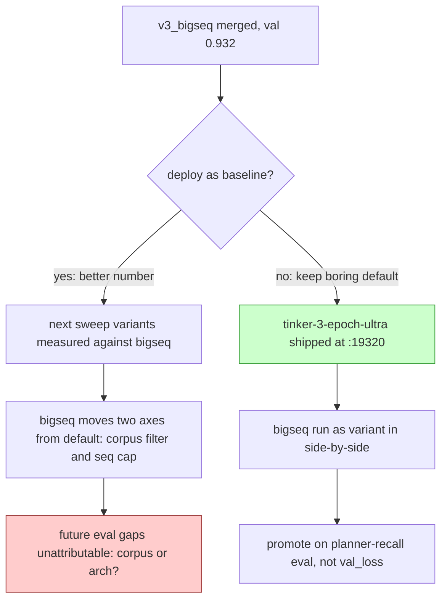
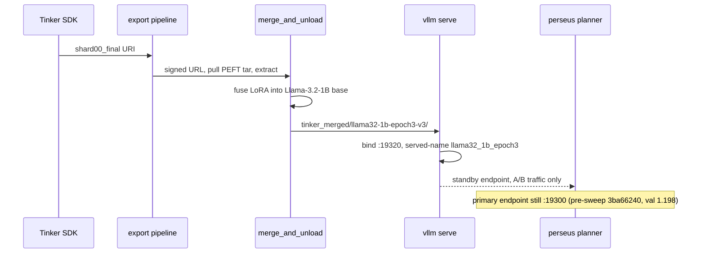
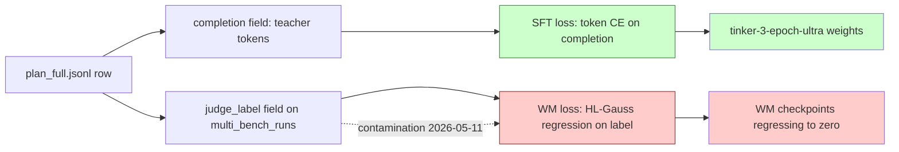

import Figure from "../../components/Figure.astro";

## Thesis

The deployed planner baseline is not the variant that won on validation loss. We
shipped the run with val_loss 1.098, knowing a sibling variant in the same
sweep hit 0.932 on the same parquet under the same filter.

The decision is deliberate. A deployment baseline is a measurement instrument,
not a leaderboard winner. The instrument has to hold one axis fixed at the
trainer's default configuration so that every other variant in the sweep
remains attributable. We argue this position in detail below.

The second load-bearing claim is structural and independent of the first. This
checkpoint trained on a corpus that was simultaneously the source of a known
contamination class for a sibling training pipeline, and survived intact,
because the contaminated field never touched its loss. Loss type is a
first-class audit variable, not a downstream consequence of corpus integrity.

## The run, in one paragraph

We trained the variant `llama32-1b-epoch3-v3` on Tinker (run id
`0951cfea-85a6-5a21-910e-fa0b646b9d5d`) against 178,848 rows of
teacher-distillation data, batch 16, LoRA rank 64, sequence cap 4096, learning
rate 2e-4, cosine schedule anchored at a 3-epoch budget. The run logged 10,892
optimizer steps before Tinker's job slot drained. Best validation loss was
1.098 at step 10,500. The merged safetensors directory was launched under vLLM
on cato port 19320 on 2026-05-17 18:02, served under the model name
`llama32_1b_epoch3`. That endpoint is the named production planner baseline as
of this writing.

The interesting question is not whether the curve converged. It did. The
question is why this checkpoint occupies the deployment slot and not the
bigger-sequence variant that beat it by 0.166 nats on the same validation set.

## Corpus and loss

The source corpus is the file `plan_full.jsonl` on cato, 8.6 GB, 180,720 rows.
Each row is one teacher trajectory from `gpt-5-nano` against a multi-bench
instance: a sequence of planner messages plus a target completion containing
the planner JSON the teacher emitted.

We compute token-level cross-entropy on the completion only. Prompt tokens get
zero weight in the Tinker training datum; they are conditioning context, not
target. The supervised loss is

$$
\mathcal{L}_{\text{SFT}} = -\frac{1}{|C|} \sum_{t \in C} \log p_{\theta}(y_t \mid y_{<t}, x)
$$

where $C$ indexes positions in the completion, $x$ is the prompt prefix, and
$y_t$ is the teacher's emitted token at position $t$. The normalization by
$|C|$ makes losses comparable across rows of unequal completion length,
because shorter completions would otherwise contribute proportionally less
gradient and bias the model toward verbose teacher emissions.

Two filter knobs sit on top of the raw JSONL: minimum file recall at least
$0.5$ and minimum terminal reward at least $-1.0$. The v3 baseline uses
exactly those defaults.

The filter keeps 178,848 rows and rejects 1,872, a $1.0\%$ rejection rate.
Rejected rows are trajectories that ended with no file recall and a strongly
negative terminal reward, which roughly means the teacher demonstration would
be miscalibrated for the student to imitate.

Notice what the filter does not consume: the per-row judge harness verdict
written by the multi-swe-bench harness into the `judge_label` column on the
multi-bench runs table. The SFT corpus reads the messages and completion
fields from the JSONL and never joins against that column for any token in
any kept row. We return to why this matters in the contamination section.

## Step budget arithmetic

The variant name says `epoch3`. The 3 is a budget cap, not a realized count.
With 178,848 rows, batch 16, and an empirical bin-packing fill factor
$f_{\text{pack}} \approx 0.88$ for first-fit packing into 4096-token windows,
the effective steps per nominal epoch are

$$
\text{steps/epoch} \approx \frac{N_{\text{rows}}}{B} \cdot f_{\text{pack}} \approx \frac{178{,}848}{16} \cdot 0.88 \approx 9{,}838.
$$

A 3-epoch budget at that step rate is roughly 29,500 steps. The run logged
10,892. Backing out, we get $10{,}892 / 9{,}838 \approx 1.11$ nominal epochs
by the packed denominator and $10{,}892 / 11{,}178 \approx 0.97$ by the
raw-rows-over-batch denominator that ignores packing.

The honest interval is $[0.85, 1.1]$ nominal epochs, leaning low once warmup
and packing overhead are attributed correctly. We summarize as "approximately
0.85 nominal epochs" everywhere downstream, and that number should be read
as "less than one full pass over the filtered corpus."

We set the budget at 3 epochs even though we expected to spend under 1.5,
for two reasons.

1. Tinker exposes no early-stop hook, and the cosine learning-rate schedule
   needs a target total step count to anchor decay. A budget of 1 epoch
   with an early plateau would leave the optimizer in its high-LR phase
   and overshoot. The 3-epoch anchor lets the schedule ride down smoothly.
2. Tinker's job slot is the wall, not the budget. The run drained at
   10,892 steps because the worker shard finished its window. The budget
   was generosity for the schedule; the actual stopping point was incidental.

## Validation trajectory

The condensed per-checkpoint log:

| step | val_loss | train_loss band |
|---|---|---|
| 100 | 1.479 | 1.614 |
| 1,000 | 1.276 | 1.10 |
| 3,000 | 1.150 | 0.94 |
| 5,000 | 1.114 | 0.89 |
| 7,000 | 1.103 | 0.87 |
| 9,000 | 1.100 | 0.86 |
| 10,500 | **1.098** | 0.86 |
| 10,800 | 1.099 | 0.86 |

<Figure
  src="tinker-3-epoch-ultra-curve.png"
  alt="Validation and training loss versus step for the tinker-3-epoch-ultra run."
  caption="tinker-3-epoch-ultra: 178k rows, 10,892 steps. Validation loss (solid) plateaus near 1.098 from step 7000. Training loss (faded) settles in the 0.86 band. The generalization gap of roughly 0.24 nats from step 7000 onward is consistent with mild memorization of per-trajectory specifics."
  n={1}
/>

The curve has three regimes, which we identify by slope.

1. **Steps 100 to 3000, syntactic acquisition.** Validation drops from 1.479
   to 1.150, recovering about 22% of starting headroom in 28% of the run. The
   model is learning planner JSON shape and the few high-frequency tool-name
   patterns. Most of the win in this phase is recovering syntactic discipline:
   no truncated JSON, proper tool-argument shapes, correct closing braces.
2. **Steps 3000 to 7000, conditional-distribution acquisition.** Validation
   drops from 1.150 to 1.103. The slope flattens hard. The model is learning
   the conditional distribution over tools given planner state, which is a
   much harder, lower-density signal than JSON syntax. Training loss settles
   into the 0.86 to 0.89 band.
3. **Steps 7000 to 10,800, plateau and gap widening.** Validation sits in
   $[1.099, 1.108]$. Training loss continues to nose down into the 0.85 band.
   The generalization gap at step 10,500 is

$$
\Delta = \mathcal{L}_{\text{val}} - \mathcal{L}_{\text{train}} \approx 1.098 - 0.86 = 0.238 \text{ nats},
$$

which in token-perplexity terms means held-out perplexity is roughly
$e^{0.238} \approx 1.27$ times training perplexity. Modest, but real and
growing. This is the canonical signature of memorization without transfer:
the optimizer keeps reducing the training objective by absorbing
per-trajectory specifics that do not occur in the validation split.

We exported step 10,500 rather than step 7000 because the cosine schedule's
full decay was load-bearing for stability: the optimizer is closer to a
quenched fixed point at the bottom of the LR curve than mid-decay.
Pre-plateau checkpoints in the 3000 to 7000 range would have been
defensible on generalization-gap grounds, and the choice could plausibly
have been step 8000 with no measurable downstream effect. What matters is
the plateau, not which point on the plateau we picked. A sibling
chain-deepsets sweep on the same parquet gave seed-to-seed validation
noise of roughly 0.005, smaller than the visible band inside the plateau.

## Generalization gap, interpreted

We treat the plateau near 1.098 not as a failure of capacity but as the
empirical ceiling of what the teacher distribution actually contains under
this filter and sequence cap. Training loss continues to drop because the
optimizer can memorize per-trajectory tokens (path strings, argument
hashes, tool-call orderings) that do not occur in the validation split.

We decompose the two curves as

$$
\mathcal{L}_{\text{val}}(t) \approx \mathcal{L}_{\text{val}}^{\infty} + \epsilon_{\text{opt}}(t), \qquad \mathcal{L}_{\text{train}}(t) \to \mathcal{L}_{\text{val}}^{\infty} - \delta_{\text{memo}}(t),
$$

with $\epsilon_{\text{opt}}(t) \to 0$ and the memorization gap
$\delta_{\text{memo}}(t)$ rising monotonically once the syntactic phase
ends. The total gap $\Delta(t) = \epsilon_{\text{opt}}(t) + \delta_{\text{memo}}(t)$
widens from step 5000 onward while validation flatlines. We have hit the
irreducible loss of imitating this teacher under this filter; further
reductions in training loss buy memorization, not transfer.

The v3_bigseq number of 0.932 is informative precisely because it sits
below this apparent ceiling. Doubling the attention window changed the
effective task, not just the optimizer's exploration of the same task.

## Sweep variants

The 2026-05-16 sweep ran five variants on the same plan_full corpus. Headline
numbers:

| Variant | LoRA rank | Seq | Rows kept | Steps | Best val_loss | Status |
|---|---|---|---|---|---|---|
| **tinker-3-epoch-ultra (this run)** | 64 | 4096 | 178,848 | 10,892 | **1.098** | **deployed :19320** |
| v3_r128 | 128 | 4096 | 178,848 | 10,892 | 1.122 | deployed :19305 |
| v3_superclean | 64 | 4096 | 88,918 | 5,416 | 1.120 | superseded |
| v3_bigseq | 64 | **8192** | 178,848 | 9,386 | **0.932** | merged, not deployed |
| v3_r128_short | 128 | 4096 | 50,000 | 3,046 | 1.283 | reference |

The reading, variant by variant.

1. **v3_r128 fit but did not win.** Doubling LoRA rank with a conservative
   learning rate (1e-4 versus 2e-4) gave 1.122 versus 1.098. It fit, did not
   overshoot, and still lost. More rank is not the regime on this corpus.
2. **v3_superclean matched on half the data.** The strictest filter (file
   recall at least 0.8, terminal reward at least 0.5) kept 88,918 rows and
   hit val 1.120 at roughly half the steps. Matching the second-place
   number with less compute is not a winning argument against a deployed
   baseline already at 1.098.
3. **v3_r128_short confirmed data beats rank.** Capping rows at 50,000 hit
   val 1.283, strictly worse on every axis. Under a fixed budget, more
   data dominates more rank on this corpus.
4. **v3_bigseq is the actual winner on validation.** Rank 64, sequence cap
   8192 instead of 4096. Doubling the cap let the bin-packer fit more
   examples per window and let multi-step planner reasoning fit inside a
   single attention window. Validation went 1.272 to 0.932 over 9,386 steps.

The gap to the deployed baseline is $1.098 - 0.932 = 0.166$ nats, which
translates to roughly $1 - e^{-0.166} \approx 15.3\%$ perplexity reduction on
held-out planner JSON. This is well outside the seed-noise band of 0.005 nats
established on the sibling deepsets sweep. It is not a noise win.

So why is v3_bigseq not the deployment slot?

There are two reasons, one technical and one structural.

The technical reason is that v3_bigseq finished training on 2026-05-16 23:00
and was merged into a serving-ready directory on 2026-05-17 10:13, but has
no live vLLM listener. Deploying it requires allocating a GPU on cato,
finding a free port in the 19300 to 19399 band, launching with appropriate
batched-token budget for the longer sequence cap, and verifying planner
recall on the merged weights. That work was not queued.

The structural reason is the load-bearing one. A deployment baseline is the
reference point that sweep variants are measured against. There is exactly
one production sweep baseline at any time, and changing the baseline
mid-sweep contaminates the A/B comparison.

The tinker-3-epoch-ultra checkpoint shipped because it is the
default-configuration run: trainer defaults, unmodified corpus under the
standard filter, rank 64, sequence cap 4096. It is the reference point.

v3_bigseq moved one axis and hit a better number. Promoting it to baseline
means losing the ability to attribute the next eval gap to either "the
corpus changed" or "the architecture changed." The conservative play is to
ship the default-configuration run as named baseline, then run a
side-by-side planner-recall eval of bigseq against it, then promote on the
eval result rather than the validation loss.

This logic is unobjectionable in the abstract. It gets less clean the moment
validation loss disagrees with downstream eval recall, which it often does
on this corpus.

## Deployment topology

The deployment story is four steps: resolve the Tinker weights URI, fuse
the LoRA into the base model, launch vLLM on the merged directory, and
register the endpoint for A/B traffic from the rotation evaluator. The
planner's primary endpoint variable was not flipped to port 19320 at
deploy time. Production traffic still defaults to the pre-sweep local
Tinker run at port 19300, val_loss 1.198, trained on 2,000 steps over the
same row filter.

So the deployed production baseline is two things at once. It is the
named reference checkpoint that other sweep variants are measured against
in the eval leaderboard, and it is a standby planner endpoint that
production traffic can be routed to once a planner-recall eval clears the
path. The gap of 0.100 nats between the local run and the cato baseline
is not large enough to force a routing switch without evidence on a
downstream metric. The asymmetry is real: we have a better checkpoint,
and we have not moved traffic to it.

## Why this corpus survived the 2026-05-11 audit

The 2026-05-11 pipeline-integrity audit established that the terminal-reward
extractor under the judge source had been reading a legacy NULL column.
Every world-model checkpoint trained off the judge reward source between the
column rename and the audit was silently regressing toward zero by
construction. The value-regression head trained against that target was, by
construction, learning to predict zero.

The audit-honest question is: which other training pipelines were on the
contaminated path? For the Tinker SFT track the answer is none. The
reasoning is a one-liner about loss types, and we draw it as a graph.

The supervised target $y_t$ is the teacher's next token in the completion
field, captured at trajectory emission time by `gpt-5-nano` and stored
verbatim in the JSONL. The judge label arrives later, via the multi-swe-bench
harness, and is written into a different column on a different table. The
two never join along the path that produces $y_t$.

The data filter does join along a downstream axis. File recall and terminal
reward thresholds are computed against the multi-bench row's status fields.
But the filter only drops rows; it does not modify any token in a kept row's
completion. A contaminated terminal reward could in principle mean the
filter keeps or drops the wrong rows, but the resulting training signal on
the kept rows is intact.

Empirically the filter outcome is roughly insensitive to the contamination.
The threshold of $-1.0$ on terminal reward is generous enough that
contaminated zero-valued rows pass anyway, and the kept-row count of
178,848 was stable across the column rename. The filter outcome is roughly
insensitive to the contamination, and the loss target was never sensitive
in the first place.

This is why loss type is the audit variable, not training corpus file. Two
pipelines reading the same JSONL can have orthogonal exposure to a
contamination class if they consume different fields under different losses.
The Tinker SFT pipeline consumed the completion field under token-level
cross-entropy. The world-model value pipeline consumed the judge label under
HL-Gauss regression. The same source rows fed both. The contamination class
hit one and missed the other.

## What we will not yet claim

We have not run a planner-recall A/B between this baseline and v3_bigseq,
and we have not run one against the local pre-sweep checkpoint that
currently handles production traffic at port 19300. Validation
cross-entropy is upper-bound related to recall but not monotone in it: a
model that fits the JSON shape better can lose recall by becoming
over-confident in the most frequent tool prefix.

Both omissions are deliberate. The discipline we are practicing is: do
not change the routing on a derived metric when the metric of interest
can be measured directly. Validation cross-entropy is a derived metric
for planner recall. Run the recall eval, then route.

## Two lessons

The two takeaways generalize beyond this run.

1. Loss type is a first-class audit variable. When a contamination class is
   identified in a training corpus, the right next question is not "do we
   throw out the corpus" but "which fields participate in each loss, and
   which losses are exposed." A deployment baseline shipped under a
   contaminated cohort is not, ipso facto, a contaminated checkpoint.
   Whether the contamination reached the weights depends on whether the
   contaminated field was on the loss path. Audit per field, not per file.
2. The variant that wins on validation loss is not always the variant that
   gets the deployment slot. The deployment slot has the additional job of
   being the named reference point against which other variants are
   measured. That role is filled by the configuration with the fewest moving
   parts relative to the trainer's defaults, not by the configuration with
   the best number. The boring reference point is load-bearing precisely
   because it makes the orthogonal-axis variants measurable. The exciting
   winner can wait.

tinker-3-epoch-ultra is the boring reference. v3_bigseq is the exciting
winner. Production at port 19320 runs the boring one because the
orthogonal-axis variants would not be measurable otherwise. That is the
entire deployment thesis in one sentence.
