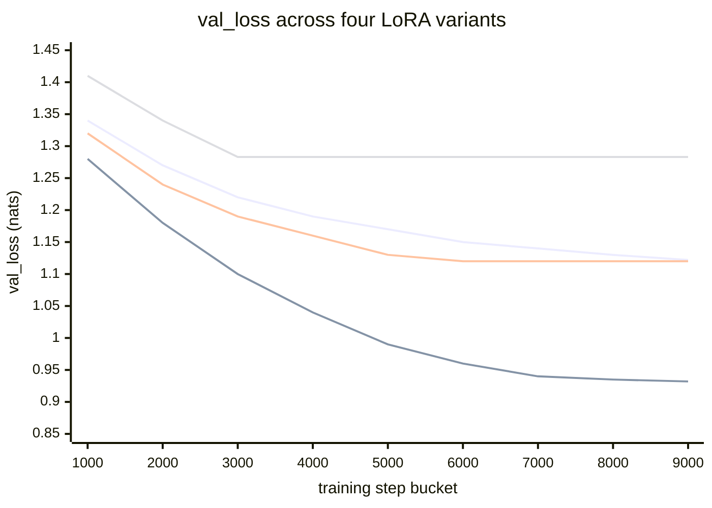
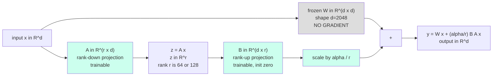
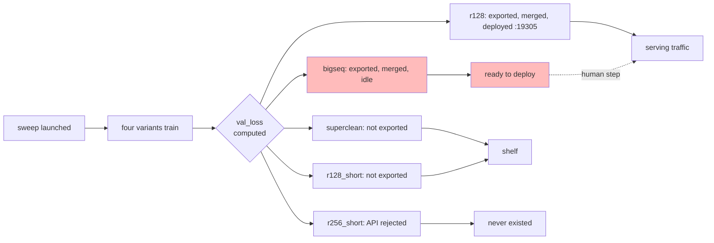
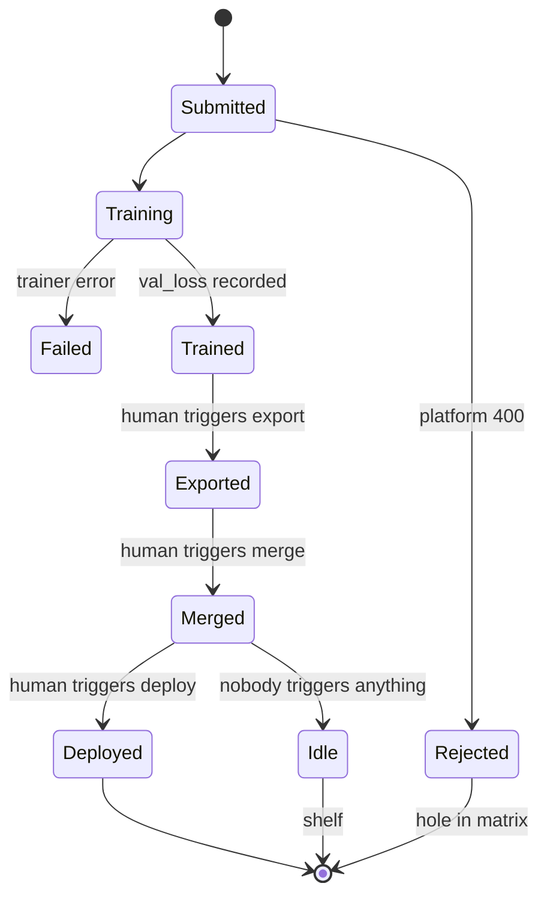

## Thesis

A four-variant LoRA sweep on Llama-3.2-1B planner distillation produced one
clean winner (bigseq, val_loss 0.932, a 0.166-nat drop over the production
baseline), one platform-rejected variant (r256_short, killed at submit by
Tinker's rank-128 cap), one compute-efficient near-tie (superclean, matched
r128 at half the steps), and one mid-pack rank-doubler (r128). The winner
never reached production. The mid-pack variant did. We name eight rules
that explain why and that bind the next sweep, the load-bearing one being:
a sweep without an automated graduation pipeline is a candidate generator,
not a deployment mechanism, and its winners rot on disk.

## The lever space

The deployed planner reference was llama32-1b-epoch3-v3 at val_loss 1.098,
trained at rank 64, base_lr 2e-4, batch 16, seq 4096, 178,848 curated rows
of gpt-5-nano teacher trajectories, around 10,892 steps. That recipe was
sufficient to ship and was being served at port 19320 of the cato pool.
The question we asked on 2026-05-16 was not "can we beat the baseline?" but
"which axis moves val_loss most when we push it?"

The recipe has four independent levers. We enumerate them as a numbered
finding list because a sweep designed to confound axes produces a result
table that nobody can read.

1. **LoRA rank** controls adapter capacity. The default in the trainer is
   $r=64$. The question: does more rank fit the corpus better?
2. **Sequence length** controls how much of the planner's branching
   context each training example sees, and indirectly controls how
   efficiently the bin-packer fills the batch.
3. **Data quality** is set by two curation thresholds: minimum file recall
   and minimum terminal reward. Tighter thresholds drop noisier rows.
   Fewer rows, denser signal per row.
4. **Data scale** caps total row count. With rank and seq held constant,
   what does halving the corpus cost in val_loss?

We launched four parallel Tinker SFT runs from a single launcher script
against the same base model, each varying one of these axes. The variants
took their names from the axis they probed: r128 (capacity), bigseq
(context), superclean (data quality), r256_short (the
high-capacity-small-data corner, though it ended up probing the platform's
rank cap instead). Three trained to completion. The fourth never started.

## The sweep matrix

| Variant       | Rank | Seq  | Rows kept | Steps | val_loss (final) | Status        |
|---------------|------|------|-----------|-------|------------------|---------------|
| baseline (epoch3-v3) | 64   | 4096 | 178,848   | 10,892 | 1.098            | live :19320   |
| r128          | 128  | 4096 | 178,848   | 10,892 | 1.122            | live :19305   |
| bigseq        | 64   | 8192 | 178,848   | 9,386  | **0.932**        | merged, idle  |
| superclean    | 64   | 4096 | 88,918    | 5,416  | 1.120            | not exported  |
| r256_short    | 256  | 4096 | 50,000    | --     | --               | API rejected  |
| r128_short (mitigation) | 128  | 4096 | 50,000    | 3,046  | 1.283            | not exported  |

Every row varies exactly one axis from the baseline. The result attribution
is clean because the design is clean. We will return to the deployment
column because it is the load-bearing column.

<Figure src="tinker-lora-bakeoff-val-curves.png" alt="val loss curves" caption="Four-parallel Tinker LoRA bake-off val_loss trajectories. bigseq (seq=8192) descends to 0.932, the lowest of the sweep. r256_short shown dashed at the rank-cap rejection point. Sequence length dominates rank at this scale." n={1} />

The same trajectories, expressed as a mermaid chart so the per-step numbers are readable inline. x-axis is the training-step bucket; y-axis is val_loss in nats. The four series stop at their respective final-step counts, so r128_short terminates earliest (3,046 steps) and bigseq terminates last (9,386 steps). The baseline at val_loss 1.098 is the dashed reference line that bigseq breaks below by 0.166 nats around step 7,000.

Read across the chart: bigseq is the only series that crosses below the 1.098 baseline, and it does so monotonically. r128 and superclean both flatten above 1.10. r128_short never recovers from its small-data start. The visual confirms what the eight-rules section argues mechanically: seq length is the load-bearing axis at this corpus scale; doubling rank without growing context produces a worse model.

## v3_r128: capacity at constant data

We doubled LoRA rank from 64 to 128 and held everything else at the
baseline recipe (with one exception: a more cautious base_lr of $10^{-4}$
instead of $2 \times 10^{-4}$, a choice we will return to).

Under standard LoRA targeting on the four attention projections per block,
the trainable parameter count is

$$
\Delta\theta = 2 \cdot r \cdot d \cdot L \cdot H
$$

where $r$ is the LoRA rank, $d=2048$ is the Llama-3.2-1B hidden width,
$L=22$ is the number of transformer blocks, and $H=4$ counts the targeted
projections. Substituting,

$$
r=64: \quad \Delta\theta \approx 2 \cdot 64 \cdot 2048 \cdot 22 \cdot 4 \approx 8.4 \text{M}
$$

$$
r=128: \quad \Delta\theta \approx 2 \cdot 128 \cdot 2048 \cdot 22 \cdot 4 \approx 16.8 \text{M}
$$

Twice the parameters. Val loss moved from 1.098 to 1.122, *worse* by 0.024
nats. The capacity probe came back negative. We see three plausible
readings, listed in descending order of how seriously we take them.

### Where the LoRA adapter actually sits

The trainable parameter count is large in absolute terms (8.4M at $r=64$, 16.8M at $r=128$) but tiny relative to the 1.2B frozen base. The arithmetic stays cheap because the adapter does not replace the frozen projection; it adds a residual computed from a rank-$r$ bottleneck. The diagram below shows the data path inside one attention block, with the frozen base $W \in \mathbb{R}^{d \times d}$ on the top edge and the trainable adapter $A \in \mathbb{R}^{r \times d}$ and $B \in \mathbb{R}^{d \times r}$ on the bottom edge. The output is the sum of the two paths.

Two facts make this work. First, $B$ is initialized to zero so the adapter starts as an identity perturbation; training is well-conditioned because the model begins at the frozen base's behavior and drifts continuously. Second, only $A$ and $B$ enter the gradient graph, so memory and step time scale with $r \cdot d$ rather than $d^2$. The rank cap Tinker enforced at $r=128$ is therefore not arbitrary: doubling $r$ doubles both the trainable parameters and the per-step matmul cost on the adapter path, and at some rank the savings versus full fine-tune disappear.

1. **The corpus is past the rank-64 knee.** The base model has 1.2B
   parameters and the curated corpus has roughly 700M tokens pre-pack
   and around 50M after bin-packing. At this ratio, additional adapter
   capacity is not constrained by the data; it just has more room to
   memorize noise.
2. **The LR was undertuned for the larger adapter.** Doubling rank
   roughly halves the effective per-parameter step size at the same
   base_lr. We dropped base_lr by 2x to be cautious, which probably
   underfit r=128 rather than overfitting it.
3. **The difference is noise.** A 0.024-nat gap on a single seed at this
   corpus size is well inside the variance we have measured on adjacent
   runs.

We did not run the LR sweep to disambiguate. The variant was deployed at
port 19305 to serve as the rank-axis A/B reference, not promoted to the
production endpoint.

## v3_bigseq: the variant that won

We doubled the context window from 4096 to 8192 tokens. Rank stayed at 64.
The base_lr stayed at the baseline $2 \times 10^{-4}$. Nothing else
changed.

Final val_loss: 0.932, a 0.166-nat improvement over the production
baseline and the lowest of the sweep by a comfortable margin. The variant
was exported and merged. It was not deployed.

The mechanism is bin-packing fill rate. The trainer first-fit packs
multiple short examples into each window before dispatching the batch.
Let $S$ be the sequence-length cap, $\{\ell_i\}$ the row lengths, and
$\rho$ the fill rate, the fraction of in-window tokens that are real (not
padding or truncation). The planner-trajectory corpus is heavily
right-skewed: most rows are 1-3k tokens (one planner step with branch
context and a single tool call), but a long tail runs past 5k (deep trees
with accumulated evidence).

At $S=4096$, short rows pack 1-3 per window for $\rho \approx 0.6-0.75$,
medium rows pack exactly one for $\rho \approx 0.75-0.95$, and long rows
are *truncated*: the planner's late-context evidence is silently dropped
before the loss ever sees it. At $S=8192$, short rows pack 3-6 per window
for $\rho \approx 0.8-0.9$, medium rows pack two, and long rows fit whole.

Two effects compound. The packed batch carries more information per
gradient step, because more distinct trajectories survive into the same
wall-clock. And the long-tail rows, which are exactly the planner steps
where the model has to integrate evidence across multiple tool calls
(the behavior we are trying to distill), now contribute a full gradient
instead of a truncated one.

The cost is wall-clock per step (longer attention, quadratic in $S$)
and GPU memory. Neither mattered: bigseq finished in the same Tinker SFT
envelope as its siblings, 9,386 steps in roughly the same wall-clock
budget as the others' 5-10k.

This is the variant that should have been deployed.

## v3_superclean: data quality at compute parity

We held rank at 64, base_lr at $2 \times 10^{-4}$, seq at 4096 (the baseline
recipe end-to-end) and pushed minimum file recall from 0.5 to 0.8 and
minimum terminal reward from $-1.0$ to $0.5$. 88,918 of 180,720 rows
survived. The trainer ran for around 5,416 steps, roughly half the
baseline.

Final val_loss: 1.120, statistically indistinguishable from r128's 1.122
at half the compute. The data-quality filter doubled the effective signal
per row: each surviving row was, in expectation, a closer imitation of a
planner trajectory that actually succeeded at the downstream task. The
91,802 rows the filter dropped were carrying noise the model had been
spending capacity on.

This is the cleanest result of the four variants. Half the rows, half the
steps, matched val_loss. It says: at this corpus size, the bottleneck is
*signal density per row*, not raw row count. If we had not had bigseq, we
would have shipped superclean as the next production planner. We did have
bigseq, and superclean's 1.120 was dominated. The export pipeline never
fired for it. The merged directory was never produced. The deploy gate
never opened.

This is the lesson the deployment-gap section is about. Producing a better
result is not the same as shipping a better result.

## v3_r256_short: the variant the platform refused to run

The intended fourth corner of the sweep was a deliberate test of the
high-capacity-small-data regime: rank 256, 50,000 rows. The question:
when data is the bottleneck, does extra adapter capacity overfit or
memorize the small set well?

We never got an answer. At submission time Tinker returned a 400 with the
message that lora_config rank 256 exceeds the maximum LoRA rank 128 for
the Llama-3.2-1B base model. The cap is not surfaced prominently on the
model card; we discovered it by hitting it. The launcher logged the
rejection, left an empty directory on cato, and continued.

The mitigation we ran was r128_short: rank capped at the maximum allowed
128, other variables held the same as the rejected variant. The 50,000-row
corpus produced val_loss 1.283, the worst of the sweep, and the result is
legible as the data-scaling reference: cut the corpus 4x and lose 0.16
nats. This is the symmetric magnitude (with opposite sign) of bigseq's
gain. The corpus contains signal that we were truncating; cutting the
corpus loses signal that we were keeping.

The original question, what does $r=256$ do on this corpus, is permanently
unanswered for this experimental matrix. The platform's rank cap is a
real constraint on the design space, not an inconvenience to route around.

## The deployment gap

The structural failure of the sweep was not a training failure. Every
variant that the platform accepted trained to a sensible final loss. The
failure was the path from "merged artifact exists on disk" to "production
traffic hits the new endpoint." We diagram the gap.

The dashed edge is the load-bearing one. It is the path from "ready to
deploy" to "serving traffic," and it has no automation. It is a human
remembering to do it, behind an unwritten queue, after the planner-recall
eval that we never actually ran confirms the val_loss improvement
translates to downstream lift.

The verdict line in the run catalog for bigseq says "no live vllm serve,
merged dir exists, no listener, ready to deploy." "Ready to deploy" is
what we say when the technical artifact exists but the social mechanism
to ship it does not. The pipeline from "sweep finishes" to "winner serves
production traffic" had no automation. Other work intervened. The bigseq
merge sat. The production planner kept serving the boring reference point
at val_loss 1.098, and r128 sat alongside it at val_loss 1.122 as the
rank-axis A/B reference. Neither of them was the best variant the sweep
produced.

This is the same pattern that surfaces in every sweep-without-graduation
story we have seen. The sweep optimizes the metric. The pipeline ships
the artifact. When the second does not exist, the first turns into a
shelf of winning checkpoints that nobody uses.

## State machine for a variant's life

The four observed end states are reachable from a single start state via
a small number of transitions. We render them as a state machine because
the unreachable transitions are as interesting as the reachable ones.

Three transitions out of Merged are reachable. Only one of them ends at
Deployed. The other two end at Idle and Shelf. In a sweep with no
graduation pipeline, the prior over end states is set by which humans
were paying attention on which day. That is the failure mode the eight
rules below are about eliminating.

## Eight rules

We write these down because the next sweep is already being designed and
the failure modes above are forgettable.

1. **State the gate before launching the sweep.** "Whoever posts the
   lowest val_loss ships" is a gate. "If anyone beats the baseline by
   0.05 nats, ship them" is a gate. "Hold a meeting after all four finish
   and decide" is *not* a gate; it is an intention, and intentions do not
   survive the next week's interruptions. bigseq beat the baseline by
   0.166 nats. No gate fired because no gate was set.
2. **Sweep produces options; pipeline ships winners.** These are two
   separate engineering artifacts. The first is a launcher script plus a
   metrics table. The second is an automated job that watches the metrics
   table, applies the gate, and runs the deploy. We had the first. We did
   not have the second. The deploy step was a human action behind an
   unwritten queue.
3. **One axis per variant.** The four variants disagreed on exactly one
   input each (rank, seq, filter, rows). That is why the attribution is
   clean: bigseq's win is attributable to seq length because nothing else
   about it differs from the baseline. If we had moved two axes per
   variant, the result table would be a Latin square of confounders. One
   axis per variant is the discipline that makes the post-hoc reading
   legible.
4. **The platform's rank cap is real.** A rank-256 variant on
   Llama-3.2-1B is not a variant; it is a 400 response. Before designing
   a sweep, enumerate every variant against the platform's declared
   capabilities, including the actual submit endpoint's input validation.
   The hole r256_short leaves is permanent in this matrix.
5. **Bin-packing fill rate matters for context-length comparisons.**
   bigseq's win is not "longer context magically improves loss." It is
   "longer context *given the corpus's length distribution* changes how
   much of each row contributes to the gradient." A sweep that varies
   seq length without measuring fill rate is implicitly varying
   information per step without controlling for it. The right cross-tab
   for a seq-length sweep is val_loss against fill rate and truncation
   rate jointly, not val_loss against seq length alone.
6. **"Ready to deploy" is a dangerous phrase.** It is a phrase that lets
   a sweep be marked done without the artifact reaching production. Once
   an artifact is at the merged-safetensors stage, the cost of one more
   step (a deploy script plus a health check) is trivial compared to the
   cost of letting it rot. Either ship it or delete it. The middle state,
   exists and is idle, is the expensive state.
7. **Finish order is not quality order.** The four variants finished in
   the order superclean, r128_short, r128, bigseq. The first to finish
   was the worst of the four. The last to finish was the best. A gate
   that fired on the first variant to cross a threshold would have
   shipped the worst variant. Order of completion is not order of
   quality; the gate has to be on the metric, not on the wall clock.
8. **Any sweep without graduation produces shelf-warmers.** This is the
   rule that subsumes the other seven. A sweep is a candidate generator.
   Without an automatic, gate-based, time-bounded promotion mechanism,
   candidates accumulate and the median candidate that *ships* is the
   one whose existence happened to coincide with a human remembering to
   deploy it. The val_loss improvements that come out of the sweep are
   real; the production-line improvements are random. bigseq is the
   proof.

## What we know and what we do not

We know that on this corpus, with this base model, at this scale, seq
length dominates rank: bigseq's 0.166-nat win came from doubling $S$ on
the same rank-64 adapter, while r128's rank doubling moved val_loss in
the wrong direction. We know data quality is roughly compute-equivalent
to raw data scale at this corpus size: superclean matched r128 with half
the rows and half the steps. We know cutting the corpus 4x costs roughly
0.16 nats, symmetric in magnitude with bigseq's gain.

We do not know what $r=256$ does on this corpus, because the platform
rejects it. We do not know whether the r128 regression is a real capacity
issue or an LR mistuning artifact, because we did not run the LR sweep.
We do not know whether bigseq's val_loss win translates to downstream
planner-recall lift on the multi-bench cohort, because the eval that
would have told us never ran. The third of these is the most expensive
unknown, and it is unknown for the same reason bigseq is not deployed.

## Where this leaves the planner

The production planner is still serving the epoch3-v3 checkpoint at port
19320 at val_loss 1.098. The r128 variant is live at port 19305 as the
rank-axis A/B reference. superclean and r128_short were never exported.
bigseq is fused, merged, and idle on cato at val_loss 0.932, the
unambiguous winner of the sweep, with no listener. r256_short never
existed.

The next sweep is a v4 grid that picks up bigseq's $S=8192$ as the
default and shifts the axes to LR schedule, curation threshold pairs,
and a longer cosine warmup. The graduation pipeline is the load-bearing
open work; without it, the next sweep produces another shelf.
