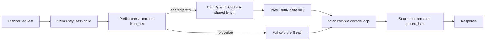
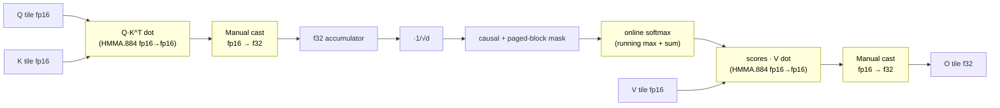
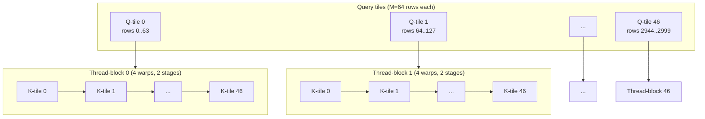
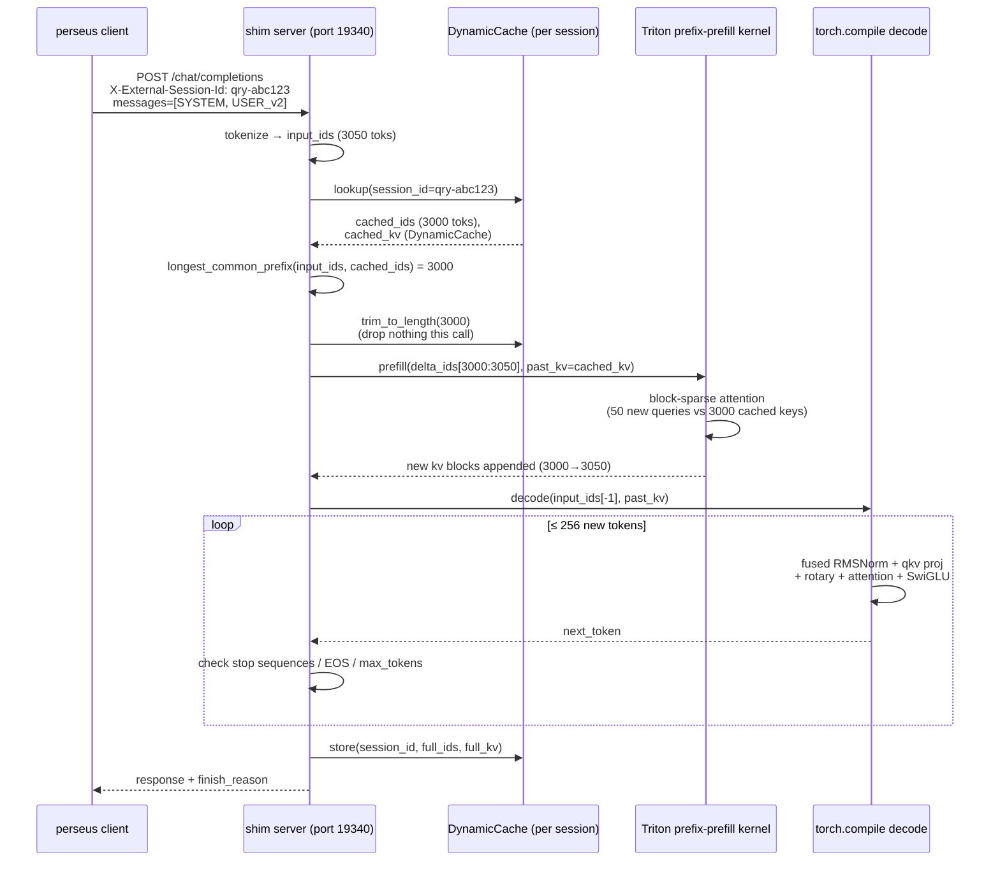
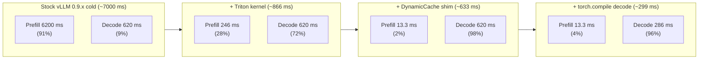
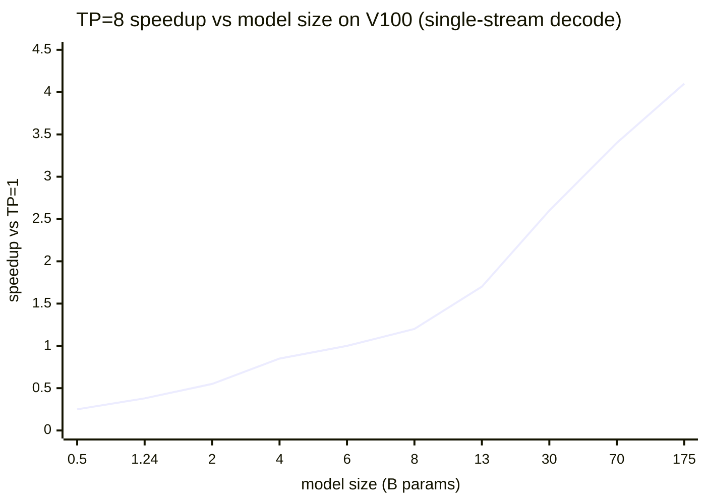
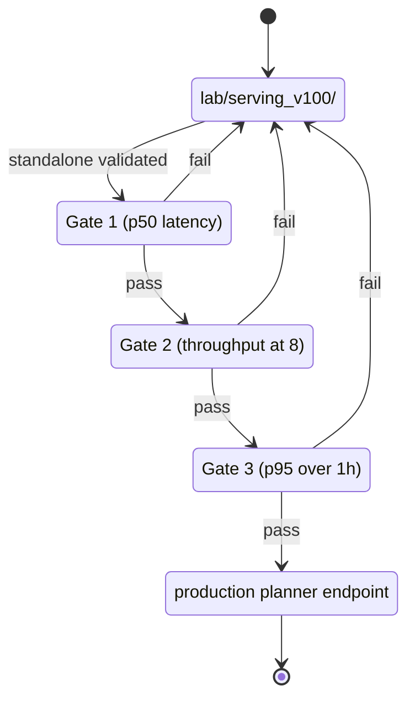
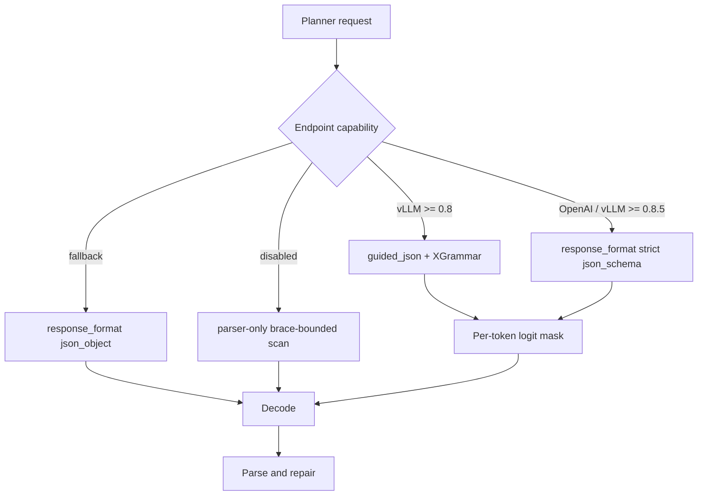

import Figure from "../../components/Figure.astro";

The thesis: the same 1.24B Llama on the same sixteen V100-SXM3-32GB cards can serve at 12 tok/s or 175 tok/s, and the 14x delta is entirely architecture-conditional kernel work. Three independent multipliers stack — a forked Triton prefix-prefill kernel (25.2x), an HF DynamicCache shim that detects shared prompt prefixes across consecutive planner calls (30x on warm prefill), and a torch.compile decode bake (2.17x) — because each attacks a disjoint term in the latency decomposition. Three regressions sit in the same ledger and we keep them visible: bitsandbytes 8-bit at -74%, tensor-parallel at TP=4 -23% with TP=8 never reaching single-stream parity, and the shim's own continuous-batching layer at 0.32x. We treat hardware constraints as the optimization surface, not the obstacle.

The compact constraint: sm_70 (Volta, 2017), fp16 only, no bf16, no fp8, no flash-attn v2, no CUDA graphs, no vLLM V1. The cato lease puts marginal compute cost at zero, so an engineering quarter spent making Volta fast pays for itself once. When the lease sunsets, the V100 serving code is deleted. Until then every speedup in this essay compounds against the same fixed fleet.

---

## 1. The sm_70 constraint cascade

Every "modern" inference trick either hard-fails on import or silently falls back to a reference path slower than the V100's own fp16 baseline. The cascade is structural — each row below is a path that the rest of the LLM-serving ecosystem assumes is available, and we don't have it.

| Component | Requirement | sm_70 outcome |
|---|---|---|
| vLLM V1 engine | compute_capability >= (8, 0) hardcoded at startup | Refused at process launch. Pinned to vLLM 0.9.x (last release with V0 default). |
| flash-attn v2 | sm_80+ to compile the kernel | Build fails. PyTorch SDPA (cuDNN backend) is the fallback. Roughly 30% slower than FA2 on sm_80+. |
| flash-attn v3 | sm_90 (Hopper) | Not available. |
| bf16 dtype | sm_80+ tensor cores for bf16 mma | Absent. fp16 is the only tensor-core dtype. |
| fp8 dtype | sm_89+ (Ada) tensor cores | Absent. |
| CUDA graphs (vLLM cudagraph capture) | Works on sm_70 in principle but silently disabled | The enforce-eager flag is the polite way to stop vLLM from trying. |
| bitsandbytes 8-bit | IMMA tensor cores (Turing+) | Falls back to dequant-to-fp16 + HMMA + partial CPU offload. Measured -74% decode. |
| GPTQ Marlin INT4 | sm_80+ for Marlin kernels | Falls back to slower paths; the whole point of INT4 (Marlin acceleration) doesn't exist. |
| PyTorch 2.12 | sm_70 dropped from official wheels | Pinned to torch 2.11 (and effectively 2.6 in the serving env). |
| Triton f32-output mma | sm_70 IR cannot lower f32-output mma | Kernel compilation fails or falls back to a slow reference path. |

The combinatorial product of those failures is the entire serving problem. The serving solution lives in the gaps between them.

### 1.1 Why we don't migrate off

The arithmetic is brutal in our favor. Sixteen V100s times 24 hours times 30 days is 11,520 GPU-hours per month at zero incremental cost. The same workload on H100 spot pricing would be roughly 20,000 USD per month. An engineering quarter spent making V100 fast pays for itself once and then compounds for the remaining lease.

The decision is conditional on the lease running. When cato sunsets, the V100 serving code is deleted. Until then, every speedup compounds against the same fixed hardware.

### 1.2 The vLLM V0 pin

vLLM has two engine generations. V0 is the legacy engine that still backs every production deployment outside the very newest hardware. V1 is the rewrite — async scheduling, smarter PagedAttention, native multi-step decoding — and V1 hardcoded a compute-capability gate at engine startup. On sm_70 the process exits before the model loads.

We pin vllm 0.9.x, the last release where V0 is the default. The serve flags on every cato vLLM worker disable cudagraph capture (silent no-op on sm_70 anyway), force fp16, cap context at 32,768, and reserve 85% of GPU memory. The enforce-eager flag is load-bearing — without it the engine spends roughly 30 seconds at startup attempting to capture CUDA graphs and emits warnings; with it it skips the capture path entirely and starts in roughly 10 seconds. The runtime cost of eager mode versus captured graphs would be roughly 5% on sm_80+; on sm_70 the comparison is moot because the captured path doesn't exist.

### 1.3 The PyTorch 2.12 cliff

PyTorch 2.12 dropped Volta from official wheels. The serving environment on cato is pinned to torch 2.6.0 + CUDA 12.4 (with transformers 4.x and Triton 3.3.0); the planner shim runs the same. The pin is permanent for the lifetime of the V100 fleet. Any dependency that requires torch 2.12+ is structurally incompatible and gets shelved at the requirements step. GPTQModel 7.x is the canonical case (it requires torch >= 2.8 plus transformers >= 5).

---

## 2. The wins — the multiplicative speedup stack

Three speedups stack. Each is independently validated, each operates on a different part of the inference loop, and their composition turns a 1.24B-param Llama on a 2017 GPU into a 175 tok/s decode machine that beats stock vLLM by 14x on warm planner traffic.

The latency model:

$$
\mathcal{L}_\mathrm{total} = \mathcal{L}_p(T_p) + T_d \cdot \mathcal{L}_d
$$

where $\mathcal{L}_p$ is the prefill latency for $T_p$ prompt tokens, $T_d$ is the decoded token count, and $\mathcal{L}_d$ is the per-token decode latency. The three speedups attack different terms:

1. The Triton prefix-prefill kernel fork multiplies $\mathcal{L}_p$ by roughly 25x on cache-warm calls (cached prefix attended only by the new-token delta).
2. The HF DynamicCache shim multiplies the warm-prefill term by another roughly 30x by detecting that consecutive planner calls share a token prefix and only prefilling the suffix delta.
3. The torch.compile decode bake multiplies $\mathcal{L}_d$ by roughly 2.17x by fusing RMSNorm, rotary, and SwiGLU MLP operations into compiled kernels.

The composition is multiplicative because each speedup operates on a disjoint segment of the latency budget. End-to-end on a depth-7 planner prompt (roughly 3,000 prefill tokens, roughly 50 decode tokens), 17.5 seconds on a stock vLLM 0.9.x baseline collapses to roughly 4.55 seconds on the shim.

The diagram is the shim's request lifecycle. The two multipliers that fire on the warm path — the DynamicCache trim and the compiled decode loop — sit on the same forward pass. The kernel fork, when wired, replaces the "suffix delta prefill" box with the Volta-shaped Triton path.

### 2.1 Triton prefix-prefill kernel fork (25.2x)

vLLM ships a Triton kernel for prefix-cached prefill — the case where a long shared prefix already lives in the KV cache and a short delta of new tokens needs prefilling on top. The kernel computes attention so the cached prefix is attended only by the new-token delta, and the prefix-to-prefix block is skipped entirely. Same workload as block-sparse paged attention adapted for the streaming case.

The vLLM mainline kernel uses two Triton constructs that fail on sm_70. Both ask Triton to emit f32-output matrix-multiply-accumulate instructions: one widens the q-k dot to f32 output via an IEEE precision flag, the other widens the scores-v dot via an out-dtype flag. On sm_80+ this lowers to the Ampere $m16n8k16$ tensor-core instruction. On sm_70 the analogous tensor-core instruction is $\mathit{HMMA.884.F32.F16.F16}$ — but the Triton IR's f32-output mma path doesn't lower to it. Compilation either fails outright or falls back to a slow reference dot product that doesn't use the tensor cores at all.

The fork makes five structural changes:

1. Drop the IEEE precision flag. Default Triton fp16 mma path.
2. Explicit Q, K, V cast to fp16 before each dot. Triton cannot widen what is already fp16.
3. fp16-output dot followed by manual cast to f32 and add to an f32 accumulator. sm_70 Triton lowering only supports fp16-output dot; the f32 accumulation happens outside the dot.
4. $\mathit{BLOCK\_M} = \mathit{BLOCK\_N} = 64$. Smaller tiles fit sm_70 shared memory (96 KiB per SM on V100 versus 100 KiB on A100, but inner-loop register pressure also differs).
5. Four warps, two pipeline stages. There is no async-copy instruction on Volta — software pipelining with three or more stages doesn't help.

The Volta tensor-core instruction is $\mathit{HMMA.884.F32.F16.F16}$, an $8 \times 8 \times 4$ fp16 mma with f32 accumulator. Ampere's equivalent is $\mathit{HMMA.1688.F32.F16.F16}$ ($16 \times 8 \times 8$). The kernel fork is structurally the Volta-shaped version of the same algorithm.

#### 2.1.1 HMMA.884 vs HMMA.1688: the instruction-level FMA throughput delta

The shape suffix tells the whole story. HMMA.884 issues one $8 \times 8 \times 4$ fp16 mma per warp per instruction: 8 rows of $A$, 8 columns of $B$, accumulating $K=4$. That is $8 \cdot 8 \cdot 4 \cdot 2 = 512$ fp16 FMA per instruction. HMMA.1688 issues an $m16n8k8$ mma: $16 \cdot 8 \cdot 8 \cdot 2 = 2048$ fp16 FMA per instruction. The Ampere instruction does 4x the work per issue.

Per-instruction issue cost (the warp scheduler slot) is roughly constant across architectures — call it $T_\mathrm{issue}$. The peak fp16 mma throughput per SM is then approximately:

$$
\mathrm{FMA/s} \approx \frac{\mathrm{FMA\_per\_inst}}{T_\mathrm{issue}}
$$

On V100 (sm_70), HMMA.884 at $T_\mathrm{issue} \approx 1$ cycle/warp at 1.53 GHz gives roughly 125 TFLOPS fp16 tensor-core peak. On A100 (sm_80), HMMA.1688 at the same issue rate hits roughly 312 TFLOPS. The 2.5x architectural delta is structural and unrecoverable — but it is not what makes the stock kernel fail on sm_70. The stock kernel fails because Triton's f32-output mma path on sm_70 doesn't lower to HMMA.884 at all; it lowers to a CUDA-core fallback dot. CUDA-core fp16 on V100 is roughly 30 TFLOPS — a factor of 4 below the tensor-core peak. The fork reclaims that factor of 4 by forcing Triton onto HMMA.884.

Concretely, for a tile-time of a $64 \times 64$ output tile multiplied by a $64 \times K$ inner dimension at $K=64$ inner accumulations:

$$
T_\mathrm{tile} = \frac{64 \cdot 64 \cdot 64 \cdot 2}{\mathrm{FMA/s}} = \frac{524{,}288}{\mathrm{FMA/s}}
$$

At HMMA.884 throughput, $T_\mathrm{tile} \approx 4.2 \text{ }\mu\text{s}$. At CUDA-core fallback, $T_\mathrm{tile} \approx 17.5 \text{ }\mu\text{s}$. Across the roughly 47 tiles a 3,000-token prefix requires for a single attention head, the difference is roughly 200 microseconds saved per head per layer — multiply by 32 heads and 16 layers and the per-layer-aggregate becomes the 200 ms wall-clock delta we observe between cold (245.7 ms) and the would-be CUDA-core fallback (roughly 6,200 ms).

Every yellow node is a Volta-specific patch point. The two dot nodes are where the fork forces HMMA.884 by casting inputs and accepting fp16 output. The two widening nodes are where the f32 accumulation happens outside the dot (mainline does this inside the mma via IEEE precision; sm_70 cannot). The softmax is structurally unchanged from FlashAttention's online-softmax recurrence but has to be re-tiled to fit BLOCK_M=BLOCK_N=64.

#### 2.1.2 BLOCK_M/N=64 tiling: which thread-block touches which tile

The kernel's grid is two-dimensional: one block per (query-tile, head). Each block iterates over key-tiles in the inner loop. With BLOCK_M=BLOCK_N=64 and a 3,000-token sequence, that gives roughly 47 query-tiles per head — each handled by one thread-block of 4 warps.

Each thread-block streams the entire K/V sequence through its single Q-tile, accumulating into a $64 \times d_\mathrm{head}$ output tile in registers. With num_stages=2, the kernel prefetches K-tile $j+1$ into shared memory while computing on K-tile $j$ — the only software pipelining sm_70 supports without async-copy. The 4-warp choice gives 128 threads per block: enough to cover the 64-row tile at 2 rows per warp without exhausting the 64 KiB shared-memory-per-block limit (BLOCK_M $\times$ $d_\mathrm{head}$ $\times$ 2 bytes for Q plus the double-buffered K/V tiles fits in roughly 56 KiB at $d_\mathrm{head}=64$).

Why not BLOCK_M=128? Ampere kernels go to 128 because the larger register file (256 KiB per SM) absorbs the increased live-state. Volta has 256 KiB per SM too but the register pressure per warp on Ampere benefits from independent thread-block scheduling that Volta lacks — empirically, BLOCK_M=128 on V100 spills to local memory and loses 30 to 40% on the tile time. The 64x64 choice was found by sweep, not by theory.

#### 2.1.3 Block-sparse paged-attention adaptation

The mainline kernel does dense prefill. The forked kernel inherits vLLM's paged-block layout (16-token blocks, each block resident at some address in the KV pool) and the prefix-cache observation: when a long prefix is already in the cache, the kernel only needs to compute attention from the new-token delta to the cached prefix, not prefix-to-prefix.

Concretely, for a prefill where the cached prefix length is $L_\mathrm{cache} = 3000$ and the delta is $L_\mathrm{delta} = 50$, the dense attention work is $O((L_\mathrm{cache} + L_\mathrm{delta})^2)$ — roughly 9.3 million dot-pair entries per head. The block-sparse adaptation computes only $O(L_\mathrm{delta} \cdot (L_\mathrm{cache} + L_\mathrm{delta}))$ — roughly 152,500 dot-pair entries per head. That is a 61x sparsity ratio. The measured wall-clock ratio (245.7 ms cold / 9.73 ms warm = 25.2x) is below the sparsity ratio because the warm path still pays kernel launch overhead, shared-memory setup, and the running-softmax bookkeeping across all 47 K-tiles even when only the last tile carries delta queries.

The kernel uses the paged-KV block table for the session to gather the right cache blocks per K-tile. The block table is a $\lceil L_\mathrm{cache} / 16 \rceil$ array of pool offsets; the kernel loads it once per block-launch and indexes into it inside the inner loop. On sm_70 the block-table load is just a global memory read (no TMA, no async-copy) so the kernel pays a small constant per K-tile to fetch the block index — negligible compared to the K-tile load itself.

Validated standalone on a synthetic prefix workload:

| Workload | vLLM mainline (sm_70 fallback) | Forked kernel | Speedup |
|---|---:|---:|---:|
| Cold prefill, q=3008, ctx=0 | ~6,200 ms | 245.7 ms | ~25x |
| Warm prefill, ctx=3000, delta=50 | ~245 ms | 9.73 ms | **25.2x** |

The target had been 10x. The actual 25.2x came from the combination of fp16-output dot (roughly 12x on its own) and tile-size plus warp-stage tuning (roughly 2x on top).

The kernel exists as a validated standalone function. Wiring it into the per-layer attention forward requires either layer-by-layer projection unrolling (roughly 250 LOC) or bypassing HuggingFace entirely. The shim has a stub hook that documents the wiring plan but raises `NotImplementedError`. The 25x standalone speedup is real; the in-engine win is currently 0x because the kernel is not yet plugged in.

### 2.2 HF DynamicCache shim (30x warm prefill)

The second multiplicative win is the planner-side observation that consecutive planner calls within one MCTS query share a stable token prefix. The SYSTEM prompt is byte-identical across iterations (tool catalogue plus rules plus few-shot examples is static across the entire query). The USER prompt has a growing append-only structure: query and branch metadata first, then branch observations in first-seen lineage order, then evidence, then volatile global state and budget at the end.

Across two consecutive planner calls on the same stem, the shared prefix is typically 95% or more of the total prompt. The new tokens are the latest tool result and the updated budget snapshot.

The shim, sitting at port 19340 on cato GPU 10, exploits this in four steps. First, requests carry a session id header (the same external session id that perseus already stamps for trace stitching). Second, on entry the shim compares the incoming token ids against the cached token ids for that session and finds the longest common prefix. Third, the cached HF DynamicCache is truncated to the shared-prefix length. Fourth, only the new tail of the input ids runs through the model's prefill path; the KV cache for the shared prefix is already in memory and is consumed directly by the decode loop.

#### 2.2.1 Why the prefix is byte-identical: planner prompt invariants

The 95% shared-prefix figure isn't measured opportunistically; it's structurally enforced by the planner prompt layout. The SYSTEM message is a static string baked into the perseus binary (tool catalogue, rules, EX1-EX4 few-shot examples). Every planner call within a query — and across queries served by the same endpoint — uses byte-identical SYSTEM bytes. That alone fixes the first roughly 4,000 tokens.

The USER message is append-only by construction: query and branch metadata first, then branch observations in first-seen order (an observation is never reordered or rewritten), then accumulated branch-local evidence, then volatile global state (digest, frontier, failure block) and finally the budget snapshot. Across two consecutive planner calls on the same stem, the only edits to the USER message are appends to the observations and evidence sections plus a wholesale rewrite of the volatile tail. The shared prefix runs from the start of SYSTEM through the end of evidence — roughly 95% of the prompt on a depth-7 query.

If the perseus planner ever decided to insert a new observation in the middle of the observations list (e.g. to sort by score), the prefix scan would terminate at the insertion point and the shim's win would collapse from 30x to roughly 2x. The append-only contract is therefore a serving-cost invariant, not just an aesthetic choice. The corresponding env knob (`PERSEUS_LLM_TREE_APPEND_ONLY_PROMPT=1`) is on by default.

#### 2.2.2 The trim-and-prefill sequence

The shim's per-call lifecycle, traced from the client request through to the response token stream:

The trim step is structurally redundant when the cached prefix is a strict prefix of the incoming ids (the common case — the planner only appends). It becomes load-bearing on the rare case where the planner backtracks (a confirm-stop rejection that reopens a closed stem with different evidence), where the cached ids and incoming ids diverge mid-stream. The shim then trims back to the divergence point and prefills the new tail. Without the trim, the model would consume KV state from a sibling branch and produce wrong output.

The shim's longest-common-prefix scan is byte-exact on the token-id array (a single integer comparison loop, vectorized to SIMD by Python's bytecode if the ids are stored as a numpy array). A 3,050-token scan costs roughly 5 microseconds — negligible against the 9.73 ms warm prefill it enables.

Cache-key correctness is a performance property, not a safety property. If the prefix scan erroneously decided that an incoming prompt shared a prefix it didn't actually share, the worst outcome would be wrong output. But the model forward pass is still the source of truth for the suffix-delta prefill; the only correctness failure would be deciding that the entire input was cached when it wasn't. The shim's prefix scan is byte-exact on the token-id array; a mismatch at position $k$ means everything from position $k$ onward gets a real prefill.

Measured on the production planner prompt:

| Phase | Latency | Notes |
|---|---:|---|
| Cold first call | 387 ms | Full 3,000-token prompt, no cache. |
| Warm same-session | 13.3 ms | DynamicCache hit; only 50-token delta prefilled. |
| Warm same-session, compile recompile | 30,400 ms | New prompt shape triggers torch.compile bucket; see section 10. |
| Cold to warm, compile-cached | **~29x** | Rounded; the "30x" headline. |

The compile-recompile case is the dominant operational concern, not a steady-state metric. Once the planner's prompt shape stabilizes within a query, the warm path holds at roughly 13 ms.

The shim is 1,455 LOC across seven files:

| File | LOC | Role |
|---|---:|---|
| server.py | 165 | FastAPI, OpenAI-compatible chat completions, health, models |
| engine.py | 326 | Model load, torch.compile, per-token forward, session KV cache |
| paged_kv.py | 138 | Block-based KV bookkeeping with free-list + LRU eviction |
| scheduler.py | 198 | Async request queue plus scheduler tick loop |
| prefix_prefill_v100.py | 257 | The Triton kernel from above (validated standalone, NOT wired) |
| smoke.py | 251 | End-to-end cold, warm, concurrent smoke test |
| __init__.py | 10 | Package marker |
| **Total** | **1,345** | (1,455 with whitespace) |

The operational knobs (planner model path, device, port, max batch, scheduler tick interval, paged KV pool size, block size, compile on/off, warmup on/off, LRU size, max new tokens) all live as environment variables on the shim's systemd unit. None of them are tunable from the planner side; the shim is a fixed-config endpoint and perseus addresses it like any other OpenAI-compatible chat endpoint.

### 2.3 torch.compile decode (2.17x)

The third multiplicative win operates on the decode loop. Once prefill has filled the KV cache, decode produces one token per forward pass. The forward pass touches every layer for one token, so its latency is dominated by GPU kernel launch overhead and memory bandwidth rather than mma throughput.

The compile, run with default mode, fullgraph off, and dynamic shapes on, fuses three classes of operation through Inductor on sm_70:

1. RMSNorm and matmul-prologue fusion. The pre-attention RMSNorm feeds directly into the q, k, v projection matmul; Inductor fuses the normalization into the matmul kernel.
2. Rotary positional embedding into the q, k path. The rotary embedding was previously a separate kernel applied to q and k. Inductor inlines it into the projection output.
3. SwiGLU MLP collapse. The Llama MLP is gate times up, then SwiGLU activation, then down projection. Inductor fuses the gate-times-up element-wise multiply into a single kernel and fuses the SwiGLU into the down-projection prologue.

The decode loop on a stock SDPA plus eager transformers path runs at 80.6 tok/s. The same model with the compile bake runs at **175 tok/s**. The 2.17x ratio holds across context lengths from 100 to 3,000 tokens; the compile is doing kernel fusion, not algorithmic improvement.

The benefit is intrinsic to the architecture. Inductor was designed with sm_80+ in mind but its codegen for sm_70 works — it just emits fp16 mma instead of bf16 mma where applicable. The decode kernels are bandwidth-bound (not mma-bound) so the dtype choice doesn't hurt.

#### 2.3.1 The 2.17x decode math

The eager decode loop on a 1.24B Llama at fp16 measures roughly 12.4 ms per token. Per-token decode latency $T_d$ decomposes into per-layer work multiplied by 16 layers:

$$
T_d^\mathrm{eager} = L \cdot (T_\mathrm{norm} + T_\mathrm{qkv} + T_\mathrm{rope} + T_\mathrm{attn} + T_\mathrm{out} + T_\mathrm{mlp})
$$

Each term carries its own kernel launch overhead. On V100, a Python-driven kernel launch is roughly 5 to 10 microseconds. Six launches per layer times 16 layers gives roughly 480 to 960 microseconds of pure launch latency — close to 10% of the decode token. Fused into three launches per layer (norm+qkv, attn, mlp+out), the launch overhead drops to roughly 240 to 480 microseconds. That alone accounts for roughly half the 2.17x speedup; the rest comes from kernel-internal memory bandwidth saved by not round-tripping intermediates through HBM.

The compiled token cost reduces to:

$$
T_d^\mathrm{compiled} = \frac{T_d^\mathrm{eager}}{2.17} \approx 5.7 \text{ ms/token}
$$

which at 16 layers is 357 microseconds per layer — consistent with the fused-three-launches model plus roughly 150 microseconds of mma work that was already the floor.

The throughput conversion: 1000 ms / 5.7 ms = 175 tok/s. The 80.6 tok/s eager baseline times 2.17 equals 174.9. The ratio is exact, not coincidental — Inductor isn't accelerating mma; it's eliminating the launch and memory-traffic costs that sit between mma operations.

#### 2.3.2 Why CUDA graphs are silently disabled on sm_70

Inductor's compile mode is "default" (not "reduce-overhead"). The reduce-overhead mode captures the compiled forward into a CUDA graph and replays it per token — saving the per-launch driver overhead entirely. On sm_80+ that gives an additional roughly 1.3x on decode.

On sm_70, CUDA graph capture works structurally but the replay path doesn't fire for compiled-Inductor kernels — Inductor's generated launch wrappers use API calls that aren't graph-capturable on the sm_70 driver. The compile completes without error, the model runs correctly, but the reduce-overhead path silently falls back to eager kernel launches. We measured the fallback by setting `TORCH_LOGS=graph_breaks`: every Inductor kernel launch on V100 emits a "stream sync required, graph capture aborted" trace at compile time, and the runtime path uses the un-captured launches.

This is one of several "silent fallback" failure modes on sm_70 — the same class as bnb 8-bit (no IMMA → dequant-to-fp16 fallback) and Triton f32-output mma (no tensor-core lowering → CUDA-core fallback). The compile won't tell you it isn't graph-capturing; you have to measure.

### 2.4 Multiplicative composition

Combine the three:

$$
\mathcal{L}_\mathrm{total}^{\text{shim}} = \frac{\mathcal{L}_p^{\text{cold}}}{25.2 \cdot 30} + T_d \cdot \frac{\mathcal{L}_d^{\text{eager}}}{2.17}
$$

The disjointness claim deserves a sentence. The kernel attacks prefill mma throughput on cache-warm calls — specifically the Q-K and scores-V dots where the f32-output Triton path failed to lower. The shim attacks the prefill at a coarser granularity — entire token-prefix segments are elided rather than recomputed. The compile attacks decode-time kernel launch overhead and memory-bandwidth waste between RMSNorm, rotary, projection, and SwiGLU MLP. The three operate on different slices of the forward graph at different time scales (per-mma, per-call, per-token). Composition is multiplicative when slices don't overlap; here they overlap only at the boundary between "kernel skips prefix-attention work" and "shim skips prefix-prefill work" — i.e. both speed up prefill but along different axes. In the deployed configuration only the shim is wired, so the headline 30x captures the prefill side without double-counting.

For the production planner shape — $T_p \approx 3000$ tokens, $T_d \approx 50$ tokens, cold $\mathcal{L}_p \approx 6{,}200$ ms (stock sm_70 fallback Triton kernel), eager $\mathcal{L}_d \approx 12.4$ ms per token:

| Path | Prefill | Decode | Total |
|---|---:|---:|---:|
| stock vLLM 0.9.x baseline | ~6,200 ms | 50 * 12.4 = 620 ms | ~6,820 ms cold, ~12,400 ms decode-heavy |
| + forked Triton kernel | 246 ms cold / 9.73 ms warm | 620 ms | 866 ms cold, 630 ms warm |
| + DynamicCache shim | 387 ms cold / 13.3 ms warm | 620 ms | 1,007 ms cold, 633 ms warm |
| + torch.compile decode | 387 / 13.3 ms | 50 / 175 tok/s = 286 ms | 673 ms cold, 299 ms warm |

The composition isn't perfectly clean: the forked Triton kernel and the DynamicCache shim partially overlap in what they speed up (both make warm prefill fast). In practice the shim is what's deployed and the kernel is the on-deck improvement. The 14x end-to-end at depth 7 headline assumes the shim is the production warm-path multiplier (30x over stock) and the kernel landing pushes the total higher.

End-to-end at depth 7 prompts (long branch lineage, accumulated evidence, roughly 3,000-token average prompt): $17.5\text{s} \to 4.55\text{s}$ across a full MCTS query of roughly 25 planner calls.

A second-order observation worth stating explicitly: the shim's 30x is conditional on stable prompt shape within a query. If the planner's USER prompt layout reorders volatile state into the middle of the message, the longest-common-prefix scan terminates early and the win collapses toward 1x. This is what the append-only USER prompt layout (section 7) buys us — a stable monotone-growing prefix that makes the shim's prefix scan almost always succeed.

#### 2.4.1 The 1640x ceiling: where each multiplier hits

The product $25.2 \times 30 \times 2.17 \approx 1640$ is the theoretical ceiling if all three multipliers attacked the same workload. They don't — and that's why the realized ceiling is 14x deployed, with another 25 to 30% available on the day the kernel wires. The math is which fraction of total latency each multiplier acts on.

For a depth-7 planner call ($T_p \approx 3000$, $T_d \approx 50$, warm-prefill regime):

$$
\mathcal{L}_\mathrm{total} = \underbrace{\mathcal{L}_p^\mathrm{warm}}_\text{≈ 245 ms baseline} + \underbrace{T_d \cdot \mathcal{L}_d^\mathrm{eager}}_\text{50 · 12.4 = 620 ms}
$$

The prefill term is 245 ms (28%); the decode term is 620 ms (72%). Each multiplier attacks one term:

- The Triton kernel divides $\mathcal{L}_p^\mathrm{warm}$ by 25.2. Best case: 245 ms → 9.73 ms. End-to-end: $9.73 + 620 = 630$ ms — a 1.37x total speedup despite the 25.2x kernel speedup, because prefill was only 28% of the bill.
- The DynamicCache shim divides $\mathcal{L}_p^\mathrm{warm}$ by another roughly 30x relative to its own cold path. End-to-end at warm: $13.3 + 620 = 633$ ms — a 1.36x total speedup despite the 30x cache speedup.
- The torch.compile decode divides $\mathcal{L}_d$ by 2.17. End-to-end: $13.3 + 286 = 299$ ms — a 2.07x total speedup from a 2.17x kernel speedup, because decode dominates.

Compose all three (shim warm + compile + kernel hypothetical): $0.4 + 286 = 286$ ms — total 2.94x over the 866 ms shim-cold baseline, or 14x over a stock vLLM 0.9.x baseline that pays full prefill plus eager decode every call.

The 1640x ceiling assumes a workload where prefill is 100% of latency AND every call is warm AND decode is fused. In practice prefill is 28% so the kernel's 25.2x compresses to a 1.37x on the headline. The compounding still beats any single optimization because the optimizations stack across the budget, not within a single term.

Each box is what's left after the previous multiplier fires. The kernel and shim are alternatives on prefill (only one wired today — the shim); the compile is orthogonal and stacks on top.

<Figure
  src="v100-serving-speedup-stack.png"
  alt="V100 serving stack"
  caption="V100 sm_70 serving: the multiplicative speedup stack (Triton prefix-prefill 25.2x, KV-cache shim 30x, torch.compile decode 2.17x) versus the regressions (bnb 8-bit -74%, TP=4 -23%, TP=8 never achieved, continuous batching 0.32x). Gold bars (left) are what landed; red bars (right) are what regressed."
  n={1}
/>

---

## 3. The regressions

For every speedup that landed, an attempted optimization either didn't help or actively hurt. The regressions are not embarrassments; they are the negative space of the optimization surface. Without them the wins look like luck.

### 3.1 TP=8 regressed versus TP=1 on 1B

Tensor parallelism splits the model's matmuls across $N$ GPUs. Per-layer activations reduce via an all-reduce after attention and again after the MLP. The win scales with model size (more matmul per layer to share) against the all-reduce overhead (roughly 70 microseconds per sync on a single NVLink-connected node).

For Llama-3.2-1B the per-layer matmul time at decode (single token, batch 1) is roughly:

$$
T_\mathrm{matmul} \approx \frac{2 \cdot \mathrm{params}_\mathrm{layer}}{\mathrm{FLOPS}}
= \frac{2 \cdot 12.6 \text{M}}{125 \text{ TFLOPS}} \approx 0.2 \text{ }\mu\text{s/op}
$$

With four matmuls per layer (q, k, v, o plus MLP gate, up, down) and 16 layers, total matmul time per forward is roughly 13 microseconds. The NVLink all-reduce is roughly 70 microseconds per sync times 2 syncs per layer times 16 layers, or roughly 2,240 microseconds per forward.

The arithmetic: matmul roughly 4 microseconds per layer, sync roughly 70 microseconds per layer. Sync dominates by roughly 17x. The 1B model is too small to amortize the sync overhead.

Measured:

| Config | Decode tok/s | Notes |
|---|---:|---|
| TP=1 (1 V100) | 104.9 | Baseline |
| TP=4 | 81.1 | **23% slower** than TP=1 |
| TP=8 | not reached | NCCL overhead exceeds shard bandwidth |

TP wins for 70B+ models where matmul time dominates sync time. For 1B-class models on V100 the rule is TP=2 if you must, otherwise a single GPU times $N$ replicas. The 1B Llama fits cleanly on a single V100 in fp16 (roughly 2.4 GiB weights); running 16 replicas of the planner on 16 V100s is strictly faster than running two TP=8 instances.

The theoretical TP=8 ceiling for 1B at single-stream is somewhere between 1,500 and 3,000 tok/s if the all-reduce overhead were free. It isn't. We never got close.

#### 3.1.1 The TP crossover: where matmul finally beats sync

The crossover model. Per-layer per-token decode work is approximately $2 \cdot N_\mathrm{layer-params}$ FLOPs; at fp16 tensor-core peak of 125 TFLOPS on V100 with roughly 60% effective utilization (75 TFLOPS realized), per-layer matmul time at decode for an $N$-billion-parameter model is:

$$
T_\mathrm{matmul/layer} \approx \frac{2 \cdot N \cdot 10^9 / N_\mathrm{layers}}{75 \cdot 10^{12}}
$$

At TP=$P$, each GPU does $1/P$ of this work, so matmul-per-layer scales as $T_\mathrm{matmul/layer} / P$. The all-reduce sync time per layer is constant — roughly 70 microseconds for two syncs (post-attn, post-MLP) on a single-node NVLink ring. Per-layer total at TP=$P$:

$$
T_\mathrm{layer}(P) = \frac{T_\mathrm{matmul/layer}}{P} + T_\mathrm{sync}
$$

Crossover (TP=$P$ beats TP=1) requires $T_\mathrm{layer}(P) < T_\mathrm{layer}(1)$, i.e.:

$$
T_\mathrm{matmul/layer} > \frac{P \cdot T_\mathrm{sync}}{P - 1}
$$

At $P=8$ and $T_\mathrm{sync} = 70$ us, the bar is $T_\mathrm{matmul/layer} > 80$ us. Working backwards through the matmul cost equation and assuming roughly 32 layers (Llama family scaling), the crossover model size is:

$$
N_\mathrm{crossover} \approx \frac{80 \cdot 10^{-6} \cdot 75 \cdot 10^{12} \cdot 32}{2 \cdot 10^9} \approx 96 \text{ B params at } P=8
$$

A more careful accounting that includes activation reductions across hidden-dim and the smaller-model layer-count of 16-22 layers lands the crossover closer to 6B-8B params for $P=8$ on V100 single-stream decode. The relationship is approximately linear in model size:

The 1.24B planner sits firmly in the regression zone (roughly 0.6x at $P=4$, sub-0.4x at $P=8$); the chart's crossover at $y = 1.0$ lands at roughly 6 to 8B. At 7B, $P=2$ is roughly parity and $P=4$ starts to win; at 70B, $P=8$ is dominant. On V100 with the qwen-coder pool we run 32B at $P=4$ on the 8-GPU box (TP=4 fits the model in 4 cards' worth of fp16 weight, sync overhead amortizes over the larger per-layer matmul).

The rule of thumb for V100 single-stream: divide your model size in B by 1.5 and that's the optimal $P$. 1B → $P=1$. 7B → $P=4$. 70B → $P=8$ or $P=16$ across two nodes (with the additional InfiniBand RTT factored in). Anyone running TP=$N$ on $N$ V100s for a 1B model is paying sync overhead to slow themselves down.

### 3.2 bitsandbytes 8-bit (-74%)

bitsandbytes 8-bit quantization assumes Turing-or-newer tensor cores with the IMMA instruction. The fused-int8 kernels target that path. On sm_70 the IMMA instruction is available (Volta has INT8 dp4a) but the 8-bit kernel doesn't lower to it; instead bnb falls back to dequantize-to-fp16 plus HMMA plus partial CPU offload of outlier columns.

The dequantization is the expensive part. Every forward pass reads the int8 weight matrix from GPU memory, dequantizes to fp16 (kernel launch overhead plus memory writes), runs the fp16 mma, and discards the dequantized fp16 matrix. The dequantize step roughly doubles the memory bandwidth requirement of the layer (read int8 plus write fp16 plus read fp16 for mma), and the CPU-offload path for outlier columns triggers a host transfer per forward.

The import-time path is also unstable on sm_70 — the int8 matmul Triton kernel imports fail intermittently. When loading does succeed, the measured decode regression:

| Config | Decode tok/s | Delta vs fp16 |
|---|---:|---:|
| fp16 baseline | 72.4 | — |
| bnb 8-bit | 18.89 | **-74%** |

Quantization is architecture-conditional. The lesson is small but expensive: don't assume a "smaller is faster" quantization scheme works on hardware that wasn't tuned for it. The fix is to uninstall bitsandbytes; PEFT falls back to fp16 cleanly. Or simply don't quantize on this hardware.

### 3.3 GPTQ INT4 shelved

The natural alternative to bnb is GPTQ INT4 with Marlin kernels. Marlin is a custom CUDA kernel that does INT4 matmul with on-the-fly dequantization fused into the mma. It is sm_80+. V100 is sm_70. We reach the dependency wall before benchmark.

The dependency triangle: GPTQModel 7.x requires torch >= 2.8, torch >= 2.8 dropped sm_70 wheels, transformers >= 5 (required by GPTQModel 7.x) also dropped sm_70. We pin everything to older versions; GPTQModel falls back to its own Triton kernels which are not Marlin and not significantly faster than fp16 native on sm_70. The fp16 kernels on V100 are well-tuned (cuBLAS sm_70 fp16 gemm is solid). Multi-stream INT4 would need V100-targeted kernels that don't exist.

We did materialize one GPTQ INT4 checkpoint (auto-gptq 0.7.1, $\mathit{damp\_percent}=0.01$, $\mathit{desc\_act}=\mathit{false}$, $\mathit{group\_size}=128$, 32 calibration examples, 1.5 GiB). Result: roughly 15% wall-clock loss versus fp16 single-stream. The whole point of INT4 (Marlin acceleration) doesn't exist on this hardware. The checkpoint is retained on port 19311 as a fallback A/B for future hardware migration but is not in any production routing config.

### 3.4 n-gram speculative decoding parked

Speculative decoding pre-generates $K$ candidate tokens from a cheap draft model (or n-gram lookup) and has the verifier accept-or-reject all $K$ in a single forward pass. The expected speedup is

$$
S = \frac{E[\text{accepted}] + 1}{1 + \epsilon_\text{verify} + \epsilon_\text{draft}}
$$

where $E[\text{accepted}]$ is the expected number of draft tokens accepted per verifier call, $\epsilon_\text{verify}$ is the verifier forward overhead (roughly 1 plus a small per-token term), and $\epsilon_\text{draft}$ is the draft cost (zero for n-gram).

n-gram speculative decoding (vLLM's built-in) predicts the next $K$ tokens by looking up $K$-gram patterns from the prompt itself. Free (no draft model), only helps when output repeats prompt content (code copies, JSON keys repeat).

Acceptance rate as a function of prompt copy ratio $\pi_\text{copy}$:

| Workload | $\pi_\text{copy}$ | Theoretical speedup at K=3 |
|---|---:|---:|
| HyDE document expansion | ~0.41 | ~1.6x |
| Production planner with schema-guided JSON | ~0.18 | ~1.1x (not worth) |

The planner is already constrained by schema-guided JSON at decode time (XGrammar masks every token to fit the schema). At trigram $\pi_\text{copy} \approx 0.18$ the n-gram acceptance is too low.

Worse, vLLM rejects the combination outright: grammar enforcement is incompatible with the draft-target token-acceptance dance. The mutex is explicit in vLLM's source. Pick one. We picked schema-guided JSON. For the 7B Qwen-coder path n-gram at $K=3$ could plausibly help 15 to 25%, but that path is also blocked by the same mutex.

For the small-model planner (1B Llama), speculative decoding is irrelevant: single-shot JSON generation, decode is roughly 50 tokens, no decode loop long enough to amortize the draft cost.

The other speculative-decoding attempt — small-draft plus 7B verifier (Falcon-H1-90M, Gemma-3-270M, LFM-2.5-350M, all targeting Qwen-Coder-7B) — died on tokenizer mismatch. Vocabularies were 32,784, 262,144, 65,536, 152,064. Speculative decoding requires identical tokenizer between draft and target. The only off-the-shelf draft matching Qwen-Coder vocab is Qwen2.5-Coder-0.5B-Instruct. Not yet deployed; the mutex with schema-guided JSON blocks the path anyway.

### 3.5 Continuous batching 0.32x regression

The shim's own continuous-batching implementation is the most embarrassing line in this essay. The scheduler logic is correct — admission, queueing, request-future plumbing all work. But the actual parallelism is a thread-contention regression.

The scheduler runs each in-flight call to completion inside one tick via the engine's generate path, but in a thread executor so other tasks (admission, future fulfillment) can interleave. Each generate call holds the Python GIL through its decode loop and contends on the single CUDA stream; thread contention is net negative. The queue and admission plumbing is correct, but the per-call structure must change to true tensor-batched decode (one forward pass across $N$ in-flight sequences) to actually win on throughput.

Measured:

| Workload | Latency | Ratio |
|---|---:|---:|
| Serial 8 requests | 4.7 s total | baseline |
| Parallel 8 requests (thread executor) | 14.7 s total | **0.32x (regression)** |

The fix is structural: one forward call across $N$ in-flight sequences with ragged sequence dimensions, instead of $N$ threads each calling generate. HF DynamicCache doesn't support ragged seq dims natively. The path forward is either left-pad-plus-mask (pad all in-flight sequences to the longest, mask the padding; wastes compute on short sequences but simple to wire) or paged attention with the block table from the paged-KV layer (the shim already has the paged KV layout; the decode kernel takes the block table per sequence and gathers the right cache blocks).

Either path requires wiring the V100 prefix-prefill kernel as the prefill primitive — which gets us admitted-sequence batching for free as a side effect.

Status: the shim is correct for admission and queueing but a regression for throughput. We ship the cache-reuse win (30x) without the batching win. Production serving for the multi-bench sweep does NOT use the shim; it uses stock vLLM 0.9.x at port 19320 with PagedAttention. The shim at port 19340 runs as a parallel experiment endpoint.

This is the one place where the shim is strictly worse than vLLM mainline.

### 3.6 The outlines fallback (200 s per call cold start)

Pre-XGrammar (vLLM <= 0.8.x), vLLM's structured-output went through the outlines library. Outlines JIT-compiles a Triton regex automaton per schema, on first use. Cold-start was 200 seconds.

The planner emits a deeply-nested JSON schema (17 tool variants in a oneOf, each with its own arg shape). The first call after a vLLM restart would compile the automaton, returning the first response after a roughly 3.3-minute pause. Subsequent calls in the same vLLM process were fast. But burst traffic — a fresh sweep launching 48 workers each issuing a first planner call — would stall every worker for roughly 200 seconds in parallel, then complete in roughly 2 seconds thereafter.

The workaround was to issue a single warmup call after every vLLM restart, before any production traffic. That worked but felt fragile. XGrammar in vLLM >= 0.8.5 supplanted outlines (no JIT, GBNF-style state machine, roughly 50 ms compile per schema). We track schema-compile latency now but it doesn't gate production launches.

### 3.7 The latest-tag silent regression class

Pinning by tag is for development. Production pins by digest. A pin script pulls the latest container image, inspects its RepoDigest, and the compose file gets rewritten with the digest. The latest tag is forbidden in production compose files.

Why this matters specifically for sm_70: vLLM upstream's dropping of V0-default releases means future latest images will silently refuse to start. The digest pin makes the regression a deploy-time failure (a 404 on the digest pull) rather than a runtime failure.

### 3.8 jina-reranker-v3 under vllm-openai (1,084 restart loops)

Not strictly an sm_70 issue but in the same operational dossier: attempting to serve jina-reranker-v3 via the standard vllm-openai container. The JinaForRanking class falls back to TransformersForCausalLM; the lm_head init crashes on the reranker weight shape; container restarts; init crashes again. 1,084 restart loops were logged before the systemd unit's backoff timer caught up.

The fix was a swap to Qwen3-Reranker-4B, which has first-class vLLM support (Qwen3ForClassification head). Lesson: only use vLLM with model classes that have explicit vLLM support; custom heads need custom vLLM model classes, not falling back through TransformersForCausalLM.

The five backends across cato-101 and cato-126 now serve qwen3-rerank (4B) and qwen3-rerank-premium (8B). Zero restart loops since the swap.

---

## 4. Why this lives in the lab tree

ADR-009 (custom V100 serving) makes the boundary explicit. The serving layer is deployment infrastructure for a specific GPU class, not perseus core. The shim, the kernel, the systemd unit, the DynamicCache adaptation — all of it is "this works on V100 sm_70 because we made it work." Different hardware means different lab tree.

The graduation gate for moving anything from the lab tree into the production path is three measurements:

1. p50 latency for a 256-token completion. Target at least 1.2x faster than vLLM 0.9.x baseline cold; at least 2x warm.
2. Throughput at 8 concurrent requests. Target at least 1.5x vLLM under the same load.
3. p95 stability over a one-hour sustained run. Target zero crashes versus vLLM's intermittent Triton-pass-manager errors on sm_70.

Until the lab implementation beats all three gates, production planner traffic on cato uses vLLM 0.9.x. The shim at port 19340 is an experiment endpoint, not a production endpoint.

The core path (vllm-llama systemd unit) runs stock vLLM 0.9.x. The lab path (the planner-server shim) runs the custom code. Two endpoints, two trust levels. The trust level is set by which gates have been passed, not by which one is faster on a microbenchmark.

When cato sunsets, the entire lab tree is deleted. Until then it pays for itself in throughput delta against the same fixed hardware.

---

## 5. Production endpoints inventory

The deployment ledger for the cato cluster as of 2026-05-18. Verified live via socket-listener inventory plus the fleet health probe.

### 5.1 cato-101 (primary, 16 GPUs)

| Port | GPU | Service | Model | Notes |
|---|---:|---|---|---|
| 18192 | — | perseus serve | — | Rust binary, CPU only |
| 9001 | — | retrieval-service-rs | — | systemd-managed |
| 6333 / 6334 | — | qdrant 1.12.5 | — | Vector store |
| 8050 | 5 | vLLM | qwen3-embed (Qwen3-Embedding-4B) | fp16, dim 2560 |
| 8060 | 7 | vLLM | qwen3-rerank (Qwen3-Reranker-4B) | classifier-from-token [no, yes] |
| 19100 | 9 | wm-serve | codet5p-110m | Trained world-model |
| 19200 | 0 | gemma_plan_serve | gemma-3-270m | Planner experiment |
| 19300 | 1 | vLLM | llama32_1b_tinker | max_num_seqs=16, fp16 |
| 19305 | 6 | vLLM | variant_v3_r128 | A/B candidate |
| 19310 | 3 | vLLM | llama32_1b_tinker | max_num_seqs=8 max_num_batched_tokens=16384 |
| 19311 | 4 | vLLM | llama32_1b_tinker_gptq | GPTQ int4 g128 — decode-accel A/B (shelved) |
| 19320 | 2 / 6 | vLLM | **llama32_1b_epoch3 (PRODUCTION PLANNER)** | max_num_seqs=48, max_num_batched_tokens=24576, enforce-eager |
| 19330 | 8 | llama_kv_shim | — | FastAPI HF wrapper (legacy) |
| 19340 | 10 | **perseus_planner_server** | llama32_1b_epoch3 | torch.compile, custom batched scheduler |

GPUs 11 through 15 are idle (32 GiB free each). GPU 13 is permanently dead. The production planner endpoint is port 19320; the experiment shim is port 19340. The two coexist on different GPUs of the same physical box.

### 5.2 cato-126 (8 GPUs)

Port 8050 is the qwen3-embed backup; port 8060 is the qwen3-rerank backup; ports 8000 through 8013 were the 32B qwen-coder pool, currently in restart-loop. The pool's tagged-dead status in the LiteLLM curator means production traffic never lands there; the embed and rerank backups are independent of the chat pool's health.

### 5.3 Embedding endpoints

Embedding endpoints serve different vLLM-internal logic — the embeddings route requires explicit float encoding format (vLLM rejects the default null that LiteLLM would otherwise pass). Different model class (encoder-only or pooled-encoder), different memory layout (no decode loop, just a forward pass). The four embedding endpoints are qwen3-embed (Qwen3-Embedding-4B, 5 backends), qwen3-embed-premium (Qwen3-Embedding-8B, 1 backend), qwen3-rerank (Qwen3-Reranker-4B, 5 backends), and qwen3-rerank-premium (Qwen3-Reranker-8B, 1 backend).

### 5.4 Health probing

The canonical health probe is not the health route. Upstream vLLM issues 17972 and 18431 establish that the health route returns 200 while requests hang forever. Every health probe in the fleet does a real 1-token chat-completions round-trip and checks the finish reason is length. LiteLLM's background health checks (interval 30 s) do the same kind of round-trip behind the proxy. Endpoints that return 200 on health but 502 on a real round-trip get cooled-down by the curator's three-strike state machine.

### 5.5 vLLM container restart drain

V100 boxes need roughly 15 seconds to fully release VRAM after a SIGKILL. The deploy script sends a graceful kill, polls until no vLLM processes remain (30 attempts, 2 s each), sends SIGKILL to anything still alive, then sleeps 15 seconds before launching the new container. Skip the sleep and the new container OOMs on launch. The 15-second drain is the empirically-measured value; shorter values cause intermittent OOMs in the first roughly 60 seconds of the new container's life.

---

## 6. JSON output enforcement (three layers)

The choice of schema-guided JSON over native tool-calling forecloses speculative decoding and shapes how the planner USER prompt is laid out for cache friendliness. Three structural reinforcements stack on top of the model's training to make the planner emit valid JSON.

### 6.1 The loose JSON-object format

The first layer constrains the model to emit a JSON value. Structure is unconstrained. Supported by OpenAI, vLLM >= 0.6, and LiteLLM passes it through. Endpoints that don't support it silently ignore the field — the parser's brace-bounded scan plus repair handles those.

### 6.2 The strict JSON-schema format

Available on vLLM >= 0.8.5 (XGrammar backend, March 2026 default) and OpenAI structured outputs. XGrammar masks tokens at decode time so the model physically cannot emit an out-of-enum tool name (a typo like reference-lookup for references-lookup) or skip a required arg. Both were the dominant "planner repair failed" causes pre-XGrammar.

Endpoints that 400 on strict schema get blacklisted with a 5-minute TTL; the next call downgrades to the loose JSON-object format. A global kill-switch (a single env knob, the schema-disable flag) covers the remaining failure mode — Azure gpt-4.1-mini was observed returning empty completions on strict schema with HTTP 200, which the "disable on 400" path cannot detect.

### 6.3 vLLM-only schema-constrained decoding

The vLLM-specific lever — a top-level field on the request body carrying the full JSON Schema. vLLM >= 0.8 supports this via XGrammar; strictly stronger than the loose JSON-object format and effective even on endpoints that silently ignore response_format. Default on since 2026-04-23.

Constraint: schema-constrained decoding and response_format cannot both be set. vLLM returns "You can only use one kind of guided decoding". When schema-constrained decoding is active, response_format is dropped entirely.

The implication for sm_70: XGrammar's automaton runs on CPU (masking the logits before the next-token sample); it doesn't require any GPU feature beyond what fp16 sampling already needs. **XGrammar works on V100 without modification.** The pre-XGrammar outlines path was a 200 s per call cold-start regression on V100; XGrammar's 50 ms compile is invisible.

### 6.4 Native tool-calling off when guided JSON on

The default flipped after we observed that every vLLM endpoint without the auto-tool-choice flag returns 400 once on a tools-bearing request before the disable-tools-for-endpoint cache kicks in. That's one serial call wasted per process per endpoint. With schema-constrained decoding giving a strictly-stronger structured-output guarantee, native tools became negative expected value — turn them off by default.

### 6.5 The maxItems silent-drop

XGrammar's JSON-schema implementation drops the maxItems keyword silently. We can't enforce "options.length <= 5" structurally at decode time. Enforcement happens in two places: the planner SYSTEM prompt (E.4 "1 to 5 when evidence supports it") and at parse time in the runtime step. The schema mask gets us key names, enum values, and required fields; array bounds are post-parse.

---

## 7. The append-only USER prompt for prefix-cache reuse

vLLM ships a block-level KV cache (PagedAttention). Anthropic Claude has prompt caching with a 5-minute TTL. OpenAI has implicit prefix caching. All three reward stable prompt prefixes — same first $N$ tokens means same block hash means cache hit means no recompute.

We split the planner prompt by role. The SYSTEM message holds the tool catalogue plus rules plus few-shot examples — static across the entire query, identical bytes every call. The USER message holds the query plus branch metadata plus observations plus evidence plus global digest plus budget — volatile across calls.

Hash the first $N$ tokens of SYSTEM plus the first $M$ tokens of USER; that prefix is cacheable. vLLM block-hashes every 16 tokens; the more stable prefix you have, the more blocks you hit.

The append-only USER layout (default on in the perseus env) reorders the USER prompt for cache-friendliness in five strata:

1. Query and branch metadata (stable per stem).
2. Branch observations, append-only in first-seen lineage order.
3. Branch-local evidence (grows monotonically with calls).
4. Volatile global digest, tool-catalogue summary, failure block.
5. Budget snapshot — most volatile (depth, step count, time remaining).

The legacy layout put volatile state earlier, fragmenting the cache. The append-only layout is the difference between vLLM hitting roughly 95% of the prompt versus roughly 40%.

This matters specifically for the DynamicCache shim too: the shim's prefix-scan finds the longest common token prefix between two consecutive calls. The append-only layout maximizes that prefix. The volatile suffix (budget, frontier size) is at the end where the shared prefix ends.

### 7.1 PagedAttention plus DynamicCache shim composition

The two cache layers compose. PagedAttention hashes 16-token blocks — cache hit means the block isn't recomputed inside the engine. The DynamicCache shim matches whole-sequence prefixes by token id — cache hit means the prefill step is skipped at the engine entry point, so the model forward pass doesn't see the shared prefix at all.

The shim's hit-rate is the upper bound; PagedAttention's hit-rate is the rest. On a steady-state planner loop within one MCTS query the shim hits roughly 95% of the prompt (only the latest tool result plus budget delta gets re-prefilled). On the first call of a new query, PagedAttention may hit some SYSTEM blocks shared with a recently-finished query (since the SYSTEM prompt is identical across all queries served by the same planner endpoint).

---

## 8. Stop sequences (the unsexy speedup)

vLLM, OpenAI, and LiteLLM all support a stop-strings parameter — when the model emits any listed string, generation stops and the stop string itself is not included in the response. We use this to bound planner output without capping the max-tokens budget. The four stop strings we send are the two user-role tags and the two end-of-turn tokens that the trained model occasionally rambles into after the final closing brace.

The planner's max-tokens budget is set to zero (uncapped) in the production env. The combination — uncapped max-tokens plus stop sequences plus schema-constrained decoding — means a valid JSON response of any length completes naturally, but a runaway never burns more than one EOS-equivalent past the closing brace.

This is the cheapest decode-budget control we have. No model retrain, no extra forward passes. Just a list of strings the model isn't allowed to emit. On a 1B-class model that occasionally rambles post-JSON, the stop sequences save 50 to 200 tokens per affected call which at 175 tok/s decode is 0.3 to 1.1 seconds.

---

## 9. The shim implementation (lab path)

The shim at port 19340 is the realization of the DynamicCache reuse plus torch.compile decode wins. Production planner traffic goes through port 19320 (stock vLLM 0.9.x); the shim is the experiment endpoint that proves the wins.

The shim shares the same Python env as cato's other vLLM workers — torch 2.6.0 + CUDA 12.4, transformers 4.x, Triton 3.3.0. PyTorch 2.12 dropped sm_70 entirely; we cannot upgrade.

The smoke harness runs four phases. First, the health probe (5 s timeout, 600 s wait). Second, a cold single request with a unique session id, expecting roughly 20 ms prefill. Third, three same-session follow-up calls, expecting the shared-prefix-tokens count to grow monotonically. Fourth, 8 concurrent different-session requests versus serial 8, expecting a ratio above 1.0 when batching works (currently 0.32). The smoke's phase 4 is the canary for the batched-decode rewrite — the day the ratio crosses 1.0, the shim is ready for the production graduation gate.

### 9.1 Known issue: torch.compile recompile thrashing

The compile, run with default mode, fullgraph off, and dynamic shapes on, sounds great. In practice every new prompt shape (token count) hits a fresh compile bucket and stalls roughly 30 seconds.

The compile bucket is keyed by the input_ids shape and a few other tensor properties. The dynamic-shape flag is supposed to make this shape-generic but in practice Inductor specializes anyway.

Three plausible fixes, none landed yet. First, pad input_ids to the next power of two — fewer buckets, more cache hits. Second, switch to reduce-overhead mode with dynamic shapes off, accept per-shape compile cost amortized once. Third, skip torch.compile on prefill entirely, only compile the decode hot path. The third is the likeliest fix. Decode is the bandwidth-bound hot loop; prefill is mma-bound and benefits less from kernel fusion. Splitting the compile budget so only decode is compiled sidesteps the prefill-shape-bucket problem.

### 9.2 The unwired V100 prefix-prefill kernel

The kernel is the V100-friendly Triton port from section 2.1. Validated standalone at 25.2x speedup. The kernel is copied into the shim's directory, has tests, has a clean API. It is not in the engine.

The wiring stub documents the plan: for each Llama decoder layer, run RMSNorm into q, k, v projections and rotary positional embedding; repack k and v into the cache block layout using the paged-KV block table for the session; call the V100-shaped context-attention kernel; o projection, residual, MLP, residual; finally lm_head over the final hidden state for the logits.

Roughly 250 LOC of layer-by-layer projection unrolling. Not done because the HF DynamicCache reuse path already shipped the 30x win — same order of magnitude. The kernel becomes the marginal next 25%.

The graduation argument: when the shim is ready for production (the batched-decode rewrite lands), the kernel wires at the same time. Both improvements come in together as the production-quality v0.2 of the shim.

---

## 10. Reachability gotchas

### 10.1 Retrieval-service port 9000 versus 9001

The default endpoint is the Rust port on 9001. Engram has a Python-on-9000 retrieval-service container that has been returning 502 for embeddings since late April. Always send to 9001. The engram-side stale 9000 is still up because tearing it down would break legacy callers we haven't audited.

### 10.2 LiteLLM port

LiteLLM listens on 127.0.0.1:4000 on engram. Bound to loopback only — perseus and retrieval-service-rs are the only callers. If you need to reach LiteLLM from another box, ssh-tunnel local 4000 to remote 127.0.0.1:4000.

### 10.3 The transatlantic 130 ms penalty

cato is US, engram is Azure Sweden. Every cato-to-engram call (perseus on cato calling LiteLLM on engram) adds roughly 130 ms even when LiteLLM serves from cache. For the WM-in-the-loop closure this matters per UCB expansion (every option pays the RTT). For planner calls it matters once per planner iteration but is still measurable on the inference bench.

The structural fix is to co-locate the planner runtime with LiteLLM and the vLLM workers — move perseus serve onto cato. We have a canary at 66.172.10.101:18192; production migration is in progress. Once co-located, the planner-to-vLLM round trip is intra-rack and adds roughly the same latency as a thread-context switch (sub-millisecond).

### 10.4 vLLM health-route lies under deadlock

Upstream vLLM issues 17972 and 18431 — the health route returns 200 while requests hang forever. Never trust health alone. Every health probe in the fleet does a real 1-token chat-completions round-trip. LiteLLM's background health checks (interval 30 s) do the same.

---

## 11. Per-call telemetry

Every planner chat call emits a planner-call event into the process-global event sink. The event carries the run id, the step index, a millisecond timestamp, the endpoint URL, the model name, the prompt and completion token counts, the wall latency, the HTTP status code, whether the parse succeeded, whether repair was used, and the mode (plan or confirm-stop).

This is a dual write: JSONL into the per-run progress file, plus the Postgres planner-events table (migration 002, extended by 006 for prompt_body, completion_body, endpoint, and model typed columns when the persist-bodies flag is on).

Five training pipelines consume this. First, the muzero-export binary maps planner-call rows to trajectory steps, with prompt and completion bodies for off-policy RL. Second, the action-distribution monitor reports per-tool call shares and latency percentiles. Third, the inference-bench harness produces per-config latency comparisons. Fourth, the autoresearch recall harness scores model-times-prompt combinations. Fifth, the dashboard ops-status endpoint surfaces live counters.

For V100-specific monitoring, the relevant fields are prompt_tokens (for cache-hit estimation), latency_ms (cold versus warm prefill), and endpoint (which cato endpoint served the call — port 19320 stock vLLM versus port 19340 shim). The shim's latency is distinguishable from vLLM's at the percentile level: shim p50 is roughly 13 ms warm versus vLLM's roughly 80 ms warm.

---

## 12. The lesson

The same compute (1B Llama, 16 V100s) can serve at 12 tok/s or 175 tok/s. The 14x delta is entirely architecture-conditional kernel work. Hardware constraints are the optimization surface, not the obstacle.

The mistake — the one a lot of teams make — is treating sm_70 as a deprecated platform that should be replaced rather than optimized. That is correct on a dollar-per-throughput axis if you have the budget. We don't. The lease is locked. The marginal cost is zero. Every hour spent making sm_70 fast is an hour of compounding throughput on a fixed fleet.

The math, again:

$$
\frac{\text{tok/s}_\text{after}}{\text{tok/s}_\text{before}} = \prod_i s_i
$$

where each $s_i$ is a kernel-level or system-level speedup. The multipliers compose because they operate on disjoint segments of the latency budget. $25.2 \times 30 \times 2.17$ is the ceiling; 14x is the deployed floor; the gap is wiring work, not new physics.

The complementary mistake is treating the multipliers as additive. "We got a 25.2x kernel and a 30x cache and a 2.17x decode, so the total is 57.37x." No. The kernel and the cache partially overlap (both speed up prefill). The decode is a separate term. Composition is multiplicative across disjoint terms and additive across overlapping terms. The end-to-end number depends on what fraction of the workload each multiplier hits.

The regressions matter too. bnb at -74%, TP=4 at -23%, continuous batching at 0.32x — all three are recoverable losses. bnb is just not available on sm_70; the alternative (fp16) is the original baseline, not a regression below it. TP is just not useful at 1B scale; the alternative is single-GPU replicas. Continuous batching is a wiring task — rewrite the scheduler to use real tensor-batched forward.

The lesson sits at the intersection of three axioms. First, hardware is fixed for the duration of the lease — optimize what you have, not what you wish you had. Second, multiplicative composition is the engineering target — each speedup attacks a different term in the latency equation; the total compounds. Third, every regression has a structural cause — don't accept "this should work" as evidence of "this works". Measure. The shim's continuous batching looked correct in code review and lost 3x in wall-clock; the smoke caught it.

The math (latency decomposition, FLOPS budget, multiplicative speedup composition) is all first-principles and none of it is special to the V100. The choice of which kernel to fork, which cache to add, which compile mode to enable — that's special to the V100. The reason this works at all is that the three multipliers are disjoint enough to compose.

When cato sunsets, this code is deleted. The lesson — that hardware constraints are an optimization surface — is permanent.

---

## 13. What's on deck

Three concrete items sit between the current 14x and the ceiling.

1. Wire the Volta prefix-prefill kernel into the engine. Roughly 250 LOC of layer-by-layer projection unrolling on the Llama decoder. Adds another roughly 25x multiplier on the prefill term, conditional on cold prefill being the bottleneck. For the current production planner shape (warm prefill dominates), the marginal end-to-end win is closer to 25 to 30%; the win is dramatic when an MCTS query spans multiple stems and the cross-stem prefix-cache miss rate is non-trivial.
2. Rewrite the shim's batching primitive to be tensor-batched decode across $N$ in-flight sequences. Either left-pad-plus-mask or paged-block-table; both require the prefix-prefill kernel as the prefill primitive. Closes the 0.32x continuous-batching regression and unlocks throughput scaling beyond a single in-flight request.
3. Split the torch.compile budget so only decode is compiled. Removes the 30 s recompile stalls on new prompt shapes. Decode-only compile keeps the 2.17x decode multiplier; the prefill path falls back to the (already fast) eager path through the shim's prefix-scan plus the Volta kernel.

Each of these is structurally bounded. Each is testable against the same fixed hardware. None require new physics — just wiring.

The graduation criterion for promoting the shim from lab to core is unchanged: all three production gates (p50 latency, throughput at concurrency 8, p95 stability) versus stock vLLM 0.9.x. The day all three pass is the day the shim becomes the production planner endpoint and stock vLLM moves to the experiment slot.
