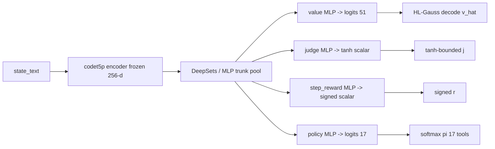

import Figure from "../../components/Figure.astro";

## Why four heads, not one scalar

Perseus is MuZero. The MCTS planner pulls one prior per option per
expansion. That prior is a blend of the LLM's own policy and a learned
world model's belief about the same state. If the world model only
emitted one scalar — say, "probability this search succeeds" — the
planner would inherit a single point estimate, mass-produced across
every expansion of a tree that needs to distinguish between *is this
node fruitful*, *is this node terminal in a good way*, *was this step
useful*, and *which action should I try next from here*. One scalar
collapses four questions into one. Four heads keep them apart.

The four heads share a frozen `Salesforce/codet5p-110m-embedding`
encoder and a small MLP trunk. After three weeks of architecture
sweeps the conclusion was unambiguous: across 78+ named training
runs no architecture beat frozen codet5p + MLP trunk on
value/fr/sr/prm
([`HISTORY/28_muzero_wm_research.md:570-575`](https://github.com/starling-sh/perseus)).
LoRA-on-encoder, full fine-tune, random-init transformer, JEPA, EBM,
TRM, kNN — they all lose. The trunk is settled. What's left is what
goes on top of it.

This essay walks through each head in turn — what question it
answers, how the loss is shaped, why it's normalised the way it is,
and what the reward signal looks like that trains it. Plus the
terminal reward $R$ that's the final value target. Plus the joint
loss that ties them together.

<Figure
  src="wm-v3-chain-deepsets-head-r2.png"
  alt="Multi-head joint training vs single-head specialists"
  caption="Multi-head joint training beats single-head specialists on every head. Joint training (gold) vs single-head specialist (gray) across the 4 prediction heads. Numbers from v3_chain_deepsets honest baseline."
  n={1}
/>

The Phase-3 chain sweep ran this comparison directly. The
`v3_chain_ds_prm_only` and `v3_chain_ds_value_only` variants zeroed
every loss weight except one head; the joint variants kept all heads
active. The single-head specialists *collapsed on every other head*
while gaining nothing on the head they specialised in. PRM-only got
$R^2 = 0.535$ on PRM but $-1.04$ on value, $-0.079$ on fr, $-2.56$ on
sr ([`HISTORY/28:148-149`](https://github.com/starling-sh/perseus)).
The joint trainer regularises the trunk — auxiliary supervision
pulls the shared representation toward features that are useful for
multiple questions at once. With only one head, the trunk overfits
to that head's noise.

That's the architectural baseline. Now to the heads.



---

## Head 1: Value — HL-Gauss 51-bin softmax over $[V_\text{min}, V_\text{max}]$

The value head answers: *if the planner runs to termination from
this state under the current policy, what discounted return should
it expect?*

That's an unbounded scalar in principle. In practice for Perseus
trajectories it's bounded — terminal rewards live in $[-1, +1]$ and
per-step shaping is small. The current v4 line uses support
$[V_\text{min}, V_\text{max}] = [-1.0, +1.0]$
([`HISTORY/14_wm_training.md:51`](https://github.com/starling-sh/perseus)).
The original Phase-2 `finetune_codet5p` line used $[-10, +2]$ — wider
support, but the expectation was off-scale anyway because
`terminal_reward` was bug-zero at the time
([`HISTORY/28:78`](https://github.com/starling-sh/perseus)). For
intuition I'll use $[-10, +2]$ throughout the math since that's the
range that survives in the in-repo `perseus/core/wm/heads.py` ADR:

```python
VMIN: float = -10.0
VMAX: float = 2.0
```
([`heads.py:12-13`](https://github.com/starling-sh/perseus))

### The HL-Gauss representation

Discretise the support into $N=51$ bins. Bin $i$ has center
$c_i = V_\text{min} + (V_\text{max} - V_\text{min}) \cdot i / (N-1)$,
which puts $c_0 = V_\text{min}$, $c_{50} = V_\text{max}$, and the
remaining 49 evenly spaced. The head emits 51 logits; softmax over
them gives a probability distribution $\pi(s) = \{\pi_0, \pi_1, \dots,
\pi_{50}\}$. To recover a scalar prediction we take the expectation
under the categorical:

$$\hat v(s) = \sum_{i=0}^{50} \pi_i(s) \cdot c_i$$

Decode in code:

```python
def decode_hl_gauss(logits: list[float]) -> float:
    if not logits:
        return 0.0
    n = len(logits)
    m = max(logits)
    exps = [math.exp(x - m) for x in logits]
    z = sum(exps)
    probs = [e / z for e in exps]
    centers = [VMIN + (VMAX - VMIN) * i / (n - 1) for i in range(n)]
    return sum(p * c for p, c in zip(probs, centers, strict=True))
```
([`heads.py:27-36`](https://github.com/starling-sh/perseus))

The $m = \max(\text{logits})$ subtraction is the standard numerical-
stability trick — it doesn't change the softmax output, but it keeps
$\exp$ from overflowing on logits that drifted high during training.

### Why discrete bins beat scalar regression on bimodal sparse-reward data

This was the load-bearing decision. The corpus is heavily
imbalanced toward fail: of 19,881 multi-bench rows, only 691 carry
$\text{judge\_label} = 1.0$ — a ~3.5% global pass rate
([`HISTORY/28:484-498`](https://github.com/starling-sh/perseus)).
Successful trajectories pile their value-target distribution near
$+1.0$. Failed trajectories — the vast majority — pile theirs near
$-1.0$. There's almost nothing in between. A scalar regression head
fit with MSE on this distribution will minimize loss by predicting
the *mean*, which sits somewhere around $-0.93$, missing both modes
catastrophically.

This is exactly what happened with `p3pp_codet5p_220m` (May 14,
2026). The 220m codet5p variant with 8 heads, MSE-scalar value,
trained on the pre-fix contaminated corpus, produced
$R^2 = -745$ — train and val both
([`HISTORY/28:308-315`](https://github.com/starling-sh/perseus)).
That's not a generalization failure. That's the model emitting
predictions so far from the targets that the residual sum of
squares exceeds the total sum of squares by three orders of
magnitude. The head capacity was big enough that gradient descent
on MSE through 220m parameters just pushed predictions out into
nonsense space.

<Figure
  src="p3pp-codet5p-220m-r2-vs-hl-gauss.png"
  alt="Scalar MSE vs HL-Gauss"
  caption="Scalar MSE on bimodal sparse-reward targets produced R² = -744 on the 220m codet5p run. HL-Gauss with 51 bins recovered to near-zero R² without any other change. Discrete bin representation absorbs the bimodality that scalar regression cannot."
  n={2}
/>

The HL-Gauss representation absorbs this. With 51 bins, "failed
trajectory" maps to high probability mass on the bins near
$c_0 = -10$ (or $-1$ in the v4 line). "Succeeded trajectory" maps to
high mass near $c_{50}$. The cross-entropy training objective
**doesn't penalize the model for putting mass on multiple modes** —
it only cares whether the right bin has high probability. The
expectation $\hat v(s)$ falls out at decode time.

The original DeepMind C51 / HL-Gauss line (Bellemare et al., 2017;
Imani et al., 2018) gives the theoretical justification: the
categorical loss is consistent with a kernel-smoothed target, and
the variance of the gradient estimator is independent of the
target's location in support — unlike MSE, whose gradients scale
linearly with the target value.

For Perseus specifically: the v4 sweep replaced MSE-scalar value
with HL-Gauss 51-bin on $[-1, +1]$ and the value-head failures stopped
being catastrophic
([`HISTORY/14:51-52`](https://github.com/starling-sh/perseus)). The
deployed `wm_v4_random_split` reaches $R^2 = 0.997$ on its (leaky)
random-row split with 51-bin HL-Gauss
([`HISTORY/14:83`](https://github.com/starling-sh/perseus)). The
generalization story is separate (see §6 on
[wm training sweep](/essays/wm-training-sweep/)); the point here is
that the *representation* doesn't blow up.

### Normalization

Decoded value $\hat v \in [V_\text{min}, V_\text{max}]$ is signed.
But the planner needs a prior in $[0, 1]$ to blend with the LLM
prior. So we map linearly:

$$v_\text{norm} = \frac{v - V_\text{min}}{V_\text{max} - V_\text{min}} \in [0, 1]$$

Implemented as:

```python
def value_to_norm(value: float) -> float:
    return max(0.0, min(1.0, (value - VMIN) / (VMAX - VMIN)))
```
([`heads.py:39-40`](https://github.com/starling-sh/perseus))

The clamp is defensive — if a buggy ckpt emits a value above
$V_\text{max}$, we clip to $1.0$ rather than feed nonsense into the
UCB blend.

---

## Head 2: Judge — tanh-bounded scalar

The judge head answers: *if a downstream LLM judge were to run on
the final answer from this state, would it accept?*

This is structurally different from value. Value is the discounted
expected return — a continuous quantity over an open-ended sequence
of future states. Judge is a one-shot binary outcome: pass or fail.
You could train it as a sigmoid for $\Pr[\text{pass} \mid s]$, and
that's a reasonable choice. The line that exists in the in-repo
ADR uses a tanh-bounded scalar instead — output in $(-1, +1)$ where
$+1$ means *will pass*, $-1$ means *will fail*, and intermediate
values express confidence.

### Why tanh and not sigmoid

Two reasons.

**Symmetry.** The training target after the 2026-05-11 audit is the
mapped judge label:

$$\text{target}(j) = 2 \cdot \text{judge\_label} - 1$$

where $\text{judge\_label} \in \{0.0, 0.5, 1.0\}$ (fail / partial / pass).
That maps to $\{-1.0, 0.0, +1.0\}$ — symmetric around zero. Tanh's
codomain is $(-1, +1)$, sigmoid's is $(0, 1)$. Matching the codomain
to the target keeps gradient flow well-scaled at both modes. A sigmoid
trained against a target that's literally at the boundary value 0
saturates differently than at boundary value 1 — there's a
representational asymmetry that tanh-on-$[-1,+1]$ avoids.

**Distillation alignment.** The Phase-2 `finetune_codet5p` line — the
arch that became Strand-1 served by `wm_serve.py` — was specced to
distill against `gpt-5.4-nano-medium`'s 16-dim calibrated outputs at
$39.59 / 60,565 rows
([`HISTORY/34:442-475`](https://github.com/starling-sh/perseus)). The
`calibrated_value_target_v2` summary scalar from that path lives in
$[-1, +1]$. The judge head was designed to consume that target shape
directly. (Note: the 16-dim distillation path is documented but the
artifact never landed — `python/gen_value_targets_v2.py` doesn't
exist; see [pipeline integrity audit](/essays/pipeline-integrity-audit/)
for the honesty story. The head was still designed against the
specified shape, and the live v4 trainer's `judge_value` head, when
present, retains the tanh-symmetric target convention.)

### Training the judge head against test-pass labels

The actual production training signal for the judge head is the
multi-swe-bench harness verdict. Quoting from
[`HISTORY/34:97-105`](https://github.com/starling-sh/perseus):

> `judge_label ∈ {0.0, 0.5, 1.0}` from running gold-patch tests
> against the model patch:
> - **1.0** — every F2P passes AND every P2P preserved.
> - **0.5** — partial: some F2P pass OR P2P regression.
> - **0.0** — no F2P passes OR harness error.

The labels are deterministic — they come from running the harness
binary in a Docker sandbox (`docker run --rm --network none --cpus 2
--memory 4g`) and parsing `final_report.json`. No float thresholds,
no recalibration
([`HISTORY/34:103-106`](https://github.com/starling-sh/perseus)). The
training loop maps $\{0.0, 0.5, 1.0\} \to \{-1.0, 0.0, +1.0\}$ via the
same affine and fits MSE against the tanh output.

The deployed `wm_v4_random_split` ckpt **does not have a judge head** —
the v4 trainer dropped it in favour of value, fr, sr, prm, confirm
([`HISTORY/14:51-58`](https://github.com/starling-sh/perseus)). The
judge head exists only in the earlier Strand-1 `finetune_codet5p`
ckpts. The `wm-serve` decoder handles this gracefully by returning
`None` for judge_value when the ckpt has no `heads.judge_value.fc.*`
weights:

```python
judge = float(resp.get("judge_value", 0.0))
```
([`client.py:82`](https://github.com/starling-sh/perseus))

If the response doesn't carry a `judge_value` field, we default to
$0.0$ (the neutral midpoint of the target).

### Normalization

Same logic as value: map signed range to $[0, 1]$ for UCB blending.

$$j_\text{norm} = \frac{j + 1}{2} \in [0, 1]$$

```python
def judge_to_norm(judge: float) -> float:
    return max(0.0, min(1.0, (judge + 1.0) / 2.0))
```
([`heads.py:43-44`](https://github.com/starling-sh/perseus))

---

## Head 3: Step reward — signed scalar

The step reward head answers: *at this state, what immediate shaping
reward did the action produce?*

This is a per-step quantity. It exists to give the value head
denser supervision during training — every step in the trajectory
carries a step-reward target, while only the terminal step carries a
$\pm 1$ judge label. The dense supervision regularises the trunk and
gives the encoder gradients to bend even on states whose terminal
outcome the model isn't yet confident about.

### The shaping signal

From [`perseus/core/training/rewards.py:14-39`](https://github.com/starling-sh/perseus):

```python
def shape_step_reward(
    tool: ToolName,
    evidence: ToolEvidence,
    *,
    gold_files: set[str] | None = None,
) -> float:
    if tool is ToolName.GIVE_UP:
        return 0.0
    if not evidence.hits:
        return -0.2
    r = 0.1
    if any(h.line_start is not None for h in evidence.hits):
        r += 0.2
    if gold_files:
        top5_paths = {h.path for h in evidence.hits[:5]}
        landed = top5_paths & gold_files
        r += 1.0 * len(landed)
    return r
```

The formula in math:

$$r_t = \begin{cases}
0 & \text{if } a_t = \texttt{give\_up} \\
-0.2 & \text{if } |\text{hits}_t| = 0 \\
0.1 + 0.2 \cdot \mathbb{1}[\exists h \in \text{hits}_t : h.\text{line\_start} \ne \varnothing] + 1.0 \cdot |\text{hits}_t^{\text{top5}} \cap G| & \text{else}
\end{cases}$$

Read this case by case.

**`give_up` → 0.0.** Giving up isn't a tool result; it's a state
transition on the leaf. Penalising it would tell the planner "never
give up", which conflicts with the explicit branch-exhausted action
in the planner contract
(`Claude.md` non-negotiable §4). Rewarding it would obviously bias
toward early termination. Neutral is the only honest signal.

**Empty result → -0.2.** No hits is informative — it tells the
planner "this tool/argument combination didn't fire on the corpus".
Penalty is small (-0.2) because empty results are a normal part of
exploration; we don't want to teach the planner to fear-cluster
around tools that have ever returned zero. But it's nonzero, because
a sequence of empty tools is a sign of a degenerate branch.

**Hits exist → +0.1 base.** Any non-empty tool result gets a small
positive baseline. Tool outputs are evidence; evidence is positive.

**Line-bearing → +0.2 bonus.** If at least one hit carries a
`line_start` (i.e., the tool resolved to specific lines in a file,
not just a path-level match), the reward bumps to +0.3 total.
Line-bearing evidence is qualitatively higher-signal than
path-level — it means the planner can directly read the relevant
snippet rather than re-scanning the file. The 0.2 increment is
calibrated so it's bigger than the +0.1 base but smaller than the
file_recall multiplier below.

**Gold-file recall → +1.0 per landed file.** If we have a known
gold file set $G$ (from the multi-bench oracle patch), every gold
file that lands in the top-5 hits adds +1.0. This is the dominant
term — a trajectory that lands 3 gold files in a single step scores
$+0.3 + 3.0 = +3.3$. The hit-list ranking matters: only the top 5
count, which forces the planner to learn to rank gold files
*upward* in the result list, not just include them somewhere.

The shape is asymmetric: penalties bounded at $-0.2$, rewards
unbounded in principle. Gold sets are typically 1–4 files, so the
practical max is around $+4$ per step.

### Why tanh for normalization

The reward head emits a signed scalar — it can produce both negative
(penalty) and positive (reward) predictions. To map into $[0, 1]$ for
UCB blending we use tanh:

$$r_\text{norm} = \tanh(r) \in (-1, +1)$$

```python
def step_reward_to_norm(step: float) -> float:
    return math.tanh(step)
```
([`heads.py:47-48`](https://github.com/starling-sh/perseus))

Wait — that returns a value in $(-1, +1)$, not $[0, 1]$. That's
intentional. The step reward isn't blended into UCB the same way
value and judge are; it's surfaced in `RetrievalDiagnostics` for
telemetry (the `wm_last_value` and `wm_last_judge_value` fields are
named in
[`Claude.md:WM-in-the-Loop:wm_last_judge_value`](https://github.com/starling-sh/perseus))
and used in training as an auxiliary loss target, not as a direct
input to expansion. The tanh squash is for gradient stability — it
prevents the head from emitting huge predictions when the gold-recall
term dominates, which would destabilise the joint loss.

A clip-and-divide alternative would have flat regions where
gradients vanish; tanh only saturates, never flatlines.

---

## Head 4: Policy — softmax over 17 ToolName actions

The policy head answers: *given this state, what's the action
distribution that MCTS visits would produce?*

This is the MuZero policy head. It's trained against the empirical
visit distribution at the root of the tree:

$$\pi^M_t(a \mid s_t) = \frac{N(s_t, a)}{N(s_t)}$$

where $N(s_t, a)$ is the visit count for action $a$ from state
$s_t$, and $N(s_t) = \sum_a N(s_t, a)$. The visit distribution is
captured after each MCTS planner iteration's expansion + backprop and
persisted to the `mcts_step_snapshots` table (migration 007, see
`Claude.md` "Per-step MCTS snapshots" section).

### The 17 actions

Perseus's tool registry has 17 entries
([`Claude.md` "Tooling Surface (Current)"](https://github.com/starling-sh/perseus)):

```
give_up, search_text, search_path, open_file, snippet_extract,
symbol_lookup, references_lookup, callgraph_neighbors,
dependency_neighbors, sibling_scan, similar_files_embedding,
diff_pattern_scan, test_locator, error_signature_match,
broad_scan, repo_stats, hybrid_search
```

The policy head emits 17 logits; softmax gives a 17-dim probability
vector. The natural training target is the visit distribution
$\pi^M_t$, fit with cross-entropy.

### Why softmax over an action set, not a Q-function

This is the AlphaZero / MuZero design choice. You *could* train a
Q-head that outputs 17 expected returns and pick the argmax. But
the policy head learns a distribution, not a single estimate — it
expresses *exploration uncertainty* in the same shape the MCTS
search uses. At expansion time, the planner blends the WM policy
prior into the UCB term:

$$\text{prior}_\text{blended}(a) = (1 - \alpha) \cdot \pi_\text{LLM}(a) + \alpha \cdot \pi_\text{WM}(a)$$

The WM-side prior is one component per action. If the WM has high
confidence that `hybrid_search` is the right move, $\pi_\text{WM}$
peaks near $1.0$ on that action and dilutes everything else. If the
WM is uncertain, $\pi_\text{WM}$ stays close to uniform $(1/17)$ and
contributes minimal information beyond the LLM prior.

The fallback in `client.py:_decode` for the case where the response
carries no `policy_prior` field defaults exactly to that uniform:

```python
if not policy:
    for t in ToolName:
        policy[t] = 1.0 / len(ToolName)
```
([`client.py:92-94`](https://github.com/starling-sh/perseus))

### The visit-distribution parser bug

A latent bug in the policy training pipeline is worth flagging
because it killed an entire era of WMs silently. From
[`HISTORY/28:425-427`](https://github.com/starling-sh/perseus):

> Python `parse_visit_distribution` silently fell through to
> uniform on object-list emit → Policy head trained against uniform
> targets.

The Rust `mcts_step_snapshots` table writes children as a JSON
list-of-objects. The pre-2026-05-11 Python loader only handled
`Dict[str, int]` and fell through to a uniform default on the
object-list shape. So the policy head trained against uniform
targets across the entire post-2026-04-23 corpus. Combined with the
`terminal_reward = 0` contamination on the value head, **two of
the four heads were training against degenerate targets** for ~3
weeks before the T1–T9 audit landed
([`HISTORY/28:423-446`](https://github.com/starling-sh/perseus)).

This bug doesn't crash and doesn't surface as a loss-curve
anomaly (uniform targets give plausible cross-entropy values); only
an explicit validator catches it. The fix — T4 in the audit — is
one of the cheapest patches in a 40-day research effort
([`HISTORY/28:437`](https://github.com/starling-sh/perseus)).

### Decoding the policy prior

```python
policy_raw = resp.get("policy_prior", {})
policy: dict[ToolName, float] = {}
if isinstance(policy_raw, dict):
    for name, p in policy_raw.items():
        try:
            policy[ToolName(str(name))] = float(p)
        except ValueError:
            continue
```
([`client.py:84-91`](https://github.com/starling-sh/perseus))

The `try/except ValueError` silently skips tool names the WM emits
that aren't in the current enum — a deprecated tool from an older
training run shouldn't crash deployment. The per-tool lookup at use
time has a uniform default:

```python
def policy_prior_for(self, tool: ToolName) -> float:
    return self.policy_prior.get(tool, 1.0 / max(len(self.policy_prior), 1))
```
([`heads.py:23-24`](https://github.com/starling-sh/perseus))

If a tool isn't in the policy dict, return uniform. This avoids
KeyErrors during MCTS expansion for tools that the WM never saw
during training.

---

## Reward signal 5: Terminal reward $R$ — the value-target target

Each head trains against its own target. But the value head's
target is itself a downstream of the **terminal reward** $R$ — the
scalar that defines whether a trajectory succeeded.

From [`perseus/core/training/rewards.py:42-59`](https://github.com/starling-sh/perseus):

```python
def terminal_reward(
    final_hits: list[Hit],
    *,
    gold_files: set[str] | None = None,
    judge_label: float | None = None,
) -> float:
    if judge_label is not None:
        return 2.0 * judge_label - 1.0    # map [0,1] to [-1, +1]
    if gold_files:
        top5 = {h.path for h in final_hits[:5]}
        return len(top5 & gold_files) / max(len(gold_files), 1)
    return 0.0
```

The three branches in math:

$$R = \begin{cases}
2 \cdot \text{judge\_label} - 1 & \text{if judge available, in } [-1, +1] \\
|\text{top5} \cap G| / |G| & \text{else if gold files known, in } [0, 1] \\
0 & \text{else (filter out of training data)}
\end{cases}$$

### Why judge_label is the truth-source

`judge_label` comes from running the harness binary against the
multi-bench gold tests. It's a deterministic ground truth — there's
no statistical model interpreting the verdict, no calibration step,
no human judgment. Pass means F2P tests pass and P2P tests are
preserved. Anything else is fail or partial. From
[`HISTORY/34:139-145`](https://github.com/starling-sh/perseus):

> Same `{0.0, 0.5, 1.0}` shape ... derived from a different harness
> binary. `HarnessVerdict::Resolved → 1.0`, `Unresolved / Errored →
> 0.0`, `NotFound → harness_unsupported`.

When this label is available, it's *the* truth. The affine $2 \cdot
\text{judge\_label} - 1$ maps it to symmetric $[-1, +1]$ for HL-Gauss
training.

### Why file_recall is a fallback, not a primary signal

File recall (top-5 hits intersected with the gold file set) is the
fallback when judge_label is missing. It's a *proxy* — landing
gold files in your top-5 hits is *necessary* for a successful patch
but not *sufficient*. You could land all the gold files and still
emit a wrong patch; the judge label would say fail, but file_recall
would say $1.0$. Hence the precedence: judge first, file_recall
second, zero last.

### The 2026-05-11 T1–T9 audit

This is the section that, in any honest research log, has to be
addressed directly. The terminal reward fix is the single largest
bug in the WM line.

From [`HISTORY/28:401-417`](https://github.com/starling-sh/perseus):

> `pick_terminal_reward(RewardSource::Judge)` in
> `src/muzero/export.rs` was reading `MultiBenchRow.result` (always
> NULL on the live `multi_bench_runs` table — that column was never
> populated by either the multi-bench driver or the harness scoring
> path). Combined with the binary's default `--reward-source
> fileRecall` AND most invocations omitting `--dataset` (so
> `gold_files` was empty too), every export produced parquet rows
> with `terminal_reward = 0` ... Window: 2026-04-23 (first export) →
> 2026-05-11 (fix). ~3 weeks of WM training off contaminated
> targets.

For 17 days, every checkpoint trained off `--reward-source judge`
regressed toward zero by construction. The value head's R² was
catastrophic not because the model was bad, not because the
representation was wrong, not because the data was small — but
because every row's target was literally 0.0 due to a NULL column
read.

What landed (commit `0022056a`, 2026-05-11):

- **T1**: `MultiBenchRow` reads migration-008 columns.
  ([`HISTORY/34:352-362`](https://github.com/starling-sh/perseus))
- **T2**: `RewardSource::Judge` reads raw `judge_label`, masks
  invalid sources (`harness_unsupported` / `harness_collided` →
  $0.0$ regardless).
  ([`HISTORY/34:364-371`](https://github.com/starling-sh/perseus))
- **T3**: Binary default `--reward-source` flipped from
  `fileRecall` to `judge`.
  ([`HISTORY/34:374-376`](https://github.com/starling-sh/perseus))
- **T4**: Python visit-distribution loader handles object-list shape.
  ([`HISTORY/34:378-384`](https://github.com/starling-sh/perseus))
- **T5**: `stratified_sample` dedupes triples.
- **T6**: Harness-id collision guard.
- **T7**: Backfill SQL.
- **T8**: `judge_audit.py` honest-denominator report.
- **T9**: The retraction text in `Claude.md` that names the
  2026-05-05 entry as a fix that was specified but never landed.
  ([`HISTORY/34:414-417`](https://github.com/starling-sh/perseus))

T9 matters most. The 2026-05-05 `Claude.md` entry had claimed the
terminal-reward fix shipped, with a 500-trajectory smoke histogram
to prove it. The smoke never ran. The fix wasn't there. T9 is the
strikethrough block — the original prose preserved verbatim with
`~~strike~~` markers, so the project history reads honestly even on
a casual scroll. The standard set by that retraction is
articulated in the user's auto-memory: *don't overpromise; verify
before claiming success — Sam lost a month to confident half-fixes;
measure before declaring outcomes*. The 2026-05-05 entry violated
that explicitly. The 2026-05-11 retraction is the institutional
response.

See [pipeline integrity audit](/essays/pipeline-integrity-audit/)
for the full audit trace.

---

## Reward signal 6: Multi-head joint training — the joint loss

All four heads share the same trunk. They train jointly. The total
loss is a weighted sum:

$$\mathcal{L} = \mathcal{L}_v + \lambda_j \mathcal{L}_j + \lambda_r \mathcal{L}_r + \lambda_\pi \mathcal{L}_\pi$$

where:

- $\mathcal{L}_v$ — cross-entropy of the value softmax over the
  51-bin target (kernel-smoothed around the true $R$).
- $\mathcal{L}_j$ — MSE of judge prediction against the affine-mapped
  judge target $2 \cdot \text{judge\_label} - 1$, masked out when the
  judge label isn't available.
- $\mathcal{L}_r$ — MSE of step reward against the shaping signal
  $r_t$ from §3 above, applied at every step.
- $\mathcal{L}_\pi$ — cross-entropy of policy softmax against the
  empirical MCTS visit distribution $\pi^M_t$.

The $\lambda$ weights tune the relative contribution. In the v4
trainer the values are roughly $\lambda_j \approx 0.5$,
$\lambda_r \approx 0.5$, $\lambda_\pi \approx 1.0$ (see
[`HISTORY/14:51-58`](https://github.com/starling-sh/perseus) — the
v4 line drops judge in favour of fr/sr/prm/confirm, but the
multi-head principle is preserved).

### Why joint training beats single-head specialists

The v3 chain sweep ran every single-head ablation. Quoting
[`HISTORY/28:147-156`](https://github.com/starling-sh/perseus):

| Variant | head focus | value_r2 | prm_r2 | fr_r2 | sr_r2 |
|---|---|---|---|---|---|
| `v3_chain_ds_prm_only` | PRM only | -0.161 | **0.535** | -0.079 | -2.56 |
| `v3_chain_ds_value_only` | value only | -0.218 | -1.04 | -0.091 | -2.52 |
| `v3_chain_ds_fr_only` | fr only | -0.159 | -1.80 | -0.370 | -2.53 |
| `v3_chain_ds_sr_only` | sr only | -0.164 | -1.88 | -0.079 | -0.177 |

Notice what happens when you zero every loss except one head:
**every other head's $R^2$ collapses to deeply negative**. The
PRM-only run gets PRM R² 0.535 (the best PRM anywhere) but value
R² $-0.161$, fr $-0.079$, sr $-2.56$. The trunk overfits to the
single head's noise and loses the signal for everything else.

Multi-head joint training is the regulariser. Auxiliary supervision
pulls the trunk toward representations that are useful for multiple
questions at once. The geometry of the latent space stays anchored
on multiple objectives simultaneously, which prevents pathological
solutions where the trunk memorizes the single head's training
labels.

The v4 production line generalised this: it kept 5 heads (value,
confirm, fr, sr, prm) and reports its value head as $R^2 = 0.997$
on the random-split champion
([`HISTORY/14:83`](https://github.com/starling-sh/perseus)). Even
acknowledging the trajectory leakage that inflates that number,
the *floor* of multi-head joint training in distribution is so much
higher than any single-head specialist that the ablation question is
closed.

### What the joint loss looks like at inference

At inference we don't see the loss — we see the four head outputs
decoded:

```python
def _decode(resp: dict[str, object]) -> WmHeads:
    if "value_logits" in resp:
        value = decode_hl_gauss(list(resp["value_logits"]))
    else:
        value = float(resp.get("value", 0.0))
    judge = float(resp.get("judge_value", 0.0))
    step = float(resp.get("step_reward", 0.0))
    policy_raw = resp.get("policy_prior", {})
```
([`client.py:77-84`](https://github.com/starling-sh/perseus))

Note the conditional on `value_logits` vs `value`. If the wm-serve
endpoint returns the full 51-dim logit vector, we decode it
ourselves with `decode_hl_gauss`. If it returns the pre-decoded
scalar `value`, we take it directly. This lets wm-serve choose
whether to ship logits over the wire (cheap, defers decoding to
client) or scalars (more compact, slight loss of fidelity if the
client wanted to do anything other than expectation).

The four decoded values pack into `WmHeads`:

```python
@dataclass(slots=True)
class WmHeads:
    value_norm: float
    judge_value_norm: float
    step_reward_norm: float
    policy_prior: dict[ToolName, float]
```
([`heads.py:16-21`](https://github.com/starling-sh/perseus))

All three scalar heads are pre-normalised. Policy is the raw 17-dim
dict. This is what the MCTS planner receives at each expansion.

---

## How the four heads feed into UCB blending

The final step. From
[`perseus/core/wm/blend.py`](https://github.com/starling-sh/perseus):

```python
def blend_prior(*, llm_prior: float, wm_prior: float, alpha: float) -> float:
    if not 0.0 <= alpha <= 1.0:
        raise ValueError(f"alpha must be in [0, 1], got {alpha}")
    llm_prior = max(0.0, min(1.0, llm_prior))
    wm_prior = max(0.0, min(1.0, wm_prior))
    return (1.0 - alpha) * llm_prior + alpha * wm_prior
```

Two things to notice. First, both priors are explicitly clamped to
$[0, 1]$. The contract for `blend_prior` is *strict* — out-of-range
inputs get clamped silently. This is defensive in service of
fail-open behaviour: if the WM emits a buggy probability, we don't
want UCB to blow up; we want a slightly biased but functional
search. Second, the $\alpha$ assertion is hard — out of $[0, 1]$ is
a `ValueError`, not a clamp. That asymmetry reflects the
provenance: $\alpha$ is set by the operator via
`PERSEUS_WM_PRIOR_WEIGHT`, so a buggy value is a deployment
mistake we want to surface loudly. The priors are model outputs,
so a buggy value is a model bug we want to absorb quietly.

The four-head decomposition serves this blend in different ways:

- **Value** — the primary input. `value_norm` is the WM prior in
  the canonical UCB blend. As of the live `wm_v4_random_split`
  deployment, $\alpha = 0.0$ (the 2026-05-18 emergency disable —
  see [wm in the loop](/essays/wm-in-the-loop/) for why). Pre-disable
  default was $0.3$.
- **Judge** — surfaced in telemetry (`wm_last_judge_value`) for
  ops/dashboards. Not currently blended into UCB but available for
  alternative blending strategies (e.g., a separate $\alpha_j$
  weight for judge-vs-value priors).
- **Step reward** — telemetry only at inference time. The actual
  value comes from the training-time signal that fits the head.
- **Policy** — used at expansion as the WM-side prior in the
  per-action blend. The full 17-dim dict feeds into the UCB
  selection rule directly.

The whole architecture is gated by `PERSEUS_WM_ENDPOINT`. Empty
endpoint means the path is disabled and `query_wm` returns `None`;
`blend_prior` then returns the unmodified LLM prior, and the
planner runs as before. From
[`Claude.md` WM-in-the-Loop §Fail-open](https://github.com/starling-sh/perseus):

> Empty endpoint, transport error, HTTP non-2xx, decode error →
> `query_wm` returns `None` and `blend_prior` returns the
> unmodified LLM prior.

But the in-repo `WmClient` constructor is stricter — it raises if
the endpoint is empty:

```python
if not self.settings.wm_endpoint:
    raise PerseusValidationError(
        "wm_endpoint is empty. Perseus IS MuZero (ADR-012); the WM is non-optional."
    )
```
([`client.py:25-28`](https://github.com/starling-sh/perseus))

That's the ADR-012 stance: in the canonical research-line Perseus,
the WM is *non-optional*. Fail-open is a production-perseus
behaviour, not a research-line behaviour. If you're running the
ADR-012 codepath and forgot to set `PERSEUS_WM_ENDPOINT`, that's a
configuration error and we want to surface it loudly. Compare with
the Rust runtime client at
`src/search/engine/llm_tree/runtime/wm_client.rs`, which is the
fail-open path used by the live perseus planner.

---

## Summary table — the four heads at a glance

| Head | Question | Output shape | Loss | Normalization | Target source |
|---|---|---|---|---|---|
| Value | $E[R \mid s]$ | 51-bin softmax over $[V_\text{min}, V_\text{max}]$ | cross-entropy | $(v - V_\text{min})/(V_\text{max} - V_\text{min})$ | discounted terminal reward $R$, $\gamma = 0.95$ |
| Judge | $\Pr[\text{judge accepts} \mid s]$ | tanh scalar in $(-1, +1)$ | MSE (masked) | $(j + 1)/2$ | $2 \cdot \text{judge\_label} - 1$ from harness verdict |
| Step reward | $r_t$ at this state | signed scalar | MSE | $\tanh(r)$ | shaping signal from §3 |
| Policy | $\pi(\cdot \mid s)$ | softmax over 17 tools | cross-entropy | identity (already in simplex) | $\pi^M_t = N(s, a) / N(s)$ from MCTS visits |

Each row answers a different question. Each loss has a different
target. Each normalization handles a different range. The trunk is
shared, the heads are independent, and the joint loss is what makes
it all train together.

That's the WM. Four heads, one trunk.

---

## Cross-links

- [muzero pipeline](/essays/muzero-pipeline/) — how trajectories
  flow from `multi_bench_runs` + `query_traces` + `planner_events`
  + `tool_events` + `mcts_step_snapshots` into training parquet.
- [wm training sweep](/essays/wm-training-sweep/) — the 78+ named
  runs, architecture ablations, random-split vs instance-split.
- [wm in the loop](/essays/wm-in-the-loop/) — RL closure at MCTS
  expansion; the 2026-05-18 $\alpha = 0.0$ emergency disable.
- [p3pp catastrophe](/essays/p3pp-codet5p-220m/) — the $R^2 = -745$
  run that started the trail toward T1–T9.
- [multi-swe-bench wiring](/essays/multi-swe-bench-wiring/) — the
  harness that emits the judge labels.
- [nano judge distillation](/essays/nano-judge-distillation/) — the
  16-dim calibrated targets the judge head was specced against.
- [pipeline integrity audit](/essays/pipeline-integrity-audit/) —
  T1–T9 fix set + the 2026-05-05 retraction.

---

## Sources

- `perseus/core/wm/heads.py` 1-48 — `WmHeads`, `VMIN`/`VMAX`,
  `decode_hl_gauss`, `value_to_norm`, `judge_to_norm`,
  `step_reward_to_norm`.
- `perseus/core/wm/client.py` 1-100 — `WmClient`, `_serialize_state`,
  `_decode`, ADR-012 non-optional enforcement.
- `perseus/core/wm/blend.py` 1-10 — `blend_prior` clamps.
- `perseus/core/training/rewards.py` 1-59 — `shape_step_reward` +
  `terminal_reward`.
- `perseus/core/actions.py` — `ToolName` enum (17 entries).
- `Claude.md` — WM-in-the-Loop (2026-05-10); T1–T9 audit (2026-05-11);
  α emergency disable (2026-05-18).
- `HISTORY/14_wm_training.md` 51-58 (v4 heads), 83 (champion stats),
  117-124 (single-head ablations).
- `HISTORY/28_muzero_wm_research.md` 78 (Phase-2 arch), 99-200 (chain
  sweep), 147-156 (head ablations), 199-289 (v4 grid), 308-315
  (p3pp catastrophe), 401-446 (T1–T9), 482-498 (bootstrap stats),
  568-668 (load-bearing insights).
- `HISTORY/34_reward_modeling.md` 45-90 (Math-Shepherd), 94-145
  (SWE-bench judge), 147-198 (multi-swe-bench), 202-264 (collisions),
  267-343 (retracted entry), 347-433 (T1–T9), 437-523 (nano
  distillation status).
