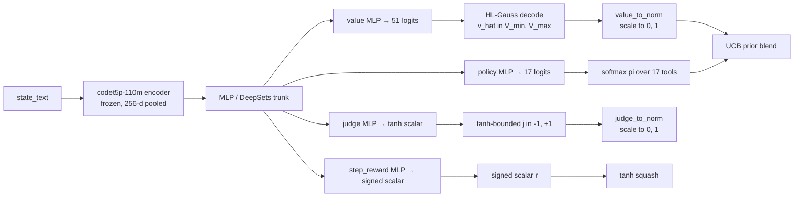
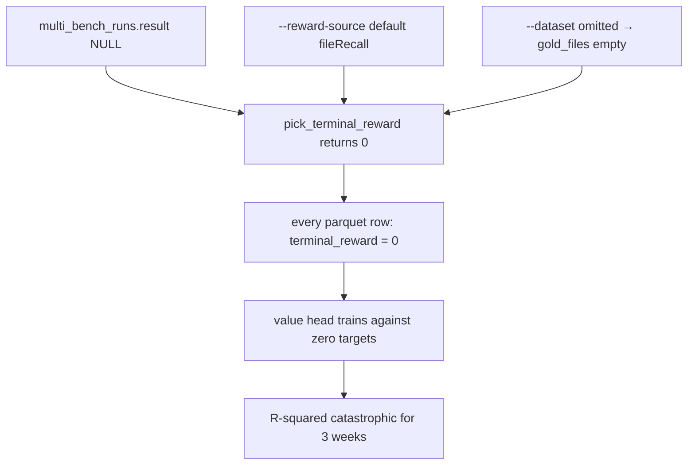

import Figure from "../../components/Figure.astro";

## Thesis

A world model that emits one scalar collapses four distinct questions into one estimator and pays for it everywhere downstream. We argue that the right factorisation for an MCTS-coupled WM in a sparse-reward, bimodal-outcome regime is exactly four heads on a shared trunk: a categorical HL-Gauss value head, a tanh-bounded judge head, a signed step-reward head, and a softmax policy head over the action set. Each head has a different codomain, a different loss, a different normalisation, and a different training target. The trunk shares parameters so that auxiliary supervision regularises the representation; the heads stay independent so that each question is answered in its natural geometry. This essay derives every head from its question and shows where the scalar-regression alternative breaks.

## 1. Why four heads, not one scalar

Perseus is MuZero. The MCTS planner pulls one prior per option per expansion, blended from the LLM's own policy and a learned world model's belief about the same state. The expansion needs four things at once: is this node fruitful in expectation, is this node terminal in a good way, was the last step useful, and which action should we try next. These are not the same quantity. One scalar — say, $\Pr[\text{search succeeds}]$ — answers none of them precisely and all of them badly.

We share a frozen codet5p-110m-embedding encoder and a small MLP trunk across heads. After 78 named training runs and three weeks of architecture sweeps, no alternative trunk beat frozen codet5p plus MLP across $\{v, j, r, \pi\}$ (HISTORY/28 §research). LoRA-on-encoder, full fine-tune, random-init transformer, JEPA, EBM, TRM, kNN — every alternative lost on at least one head while gaining nothing on the others. The trunk is settled. The remaining design question is the head bank.

<Figure
  src="wm-v3-chain-deepsets-head-r2.png"
  alt="Multi-head joint training vs single-head specialists"
  caption="Multi-head joint training beats single-head specialists on every head. Joint training (gold) versus single-head specialist (gray) across the four prediction heads. Numbers from v3_chain_deepsets honest baseline."
  n={1}
/>

The v3 chain sweep ran the ablation directly. Variants that zeroed every loss weight except one head collapsed on every other head while gaining nothing on the specialised one. PRM-only attained $R^2 = 0.535$ on PRM but $-1.04$ on value, $-0.079$ on file recall, $-2.56$ on step reward. Joint training regularises the trunk: auxiliary supervision pulls the shared representation toward features useful for multiple questions simultaneously. With a single head, the trunk overfits to one head's noise.

## 2. Forward pass and decode pipeline

Every expansion runs this pipeline once. The encoder is frozen. The trunk takes the 256-dimensional pooled encoder output and projects to four head-specific MLPs in parallel. Decoding is per-head: HL-Gauss expectation for value, identity-with-tanh-squash for judge and step reward, softmax for policy. The result lands in a `WmHeads` record consumed by the UCB blend.

## 3. Head 1 — Value: HL-Gauss 51-bin softmax

The value head answers: if the planner runs to termination from this state under the current policy, what discounted return should it expect? Formally $v(s) = \mathbb{E}[R \mid s, \pi]$ with $R$ the terminal reward defined in §7 and intermediate shaping rolled in.

We discretise the support $[V_{\min}, V_{\max}]$ into $N = 51$ bins with centres

$$c_i = V_{\min} + (V_{\max} - V_{\min}) \cdot \frac{i}{N - 1}, \quad i \in \{0, 1, \dots, 50\}.$$

The head emits 51 logits $\ell(s) \in \mathbb{R}^{51}$. We softmax and read the expectation:

$$\pi_i(s) = \frac{\exp(\ell_i(s) - \max_k \ell_k(s))}{\sum_j \exp(\ell_j(s) - \max_k \ell_k(s))}, \qquad \hat v(s) = \sum_{i=0}^{50} \pi_i(s)\, c_i.$$

The $\max$-subtraction is the standard numerical stability shift; it preserves softmax output and prevents overflow on logits that drift high during training. The current v4 line uses $[V_{\min}, V_{\max}] = [-1, +1]$; the earlier Phase-2 line used $[-10, +2]$ inherited from a bug-zero terminal reward regime that the 2026-05-11 audit later fixed. The ADR-of-record keeps the wider range so that residual shaping accumulation cannot push targets out of support.

### 3.1 Why categorical beats scalar regression on bimodal sparse-reward data

The corpus is heavily imbalanced toward failure. Of 19,881 multi-bench rows, 691 carry $\text{judge\_label} = 1.0$, a 3.5 percent global pass rate (HISTORY/28). Successful trajectories pile their value-target distribution near $+1$; failed trajectories pile theirs near $-1$. There is almost nothing in between.

A scalar regression head fit with mean-squared error on this distribution minimises loss by predicting the *mean*, which sits near $-0.93$, missing both modes catastrophically. This is exactly what happened with `p3pp_codet5p_220m` on 2026-05-14: a 220m codet5p variant with eight heads and an MSE-scalar value head, trained on the contaminated pre-fix corpus, produced $R^2 = -745$ on both train and val (HISTORY/28 §308-315). That is not a generalisation failure; it is the residual sum of squares exceeding the total sum of squares by three orders of magnitude. Gradient descent through 220m parameters pushed predictions into nonsense space.

<Figure
  src="p3pp-codet5p-220m-r2-vs-hl-gauss.png"
  alt="Scalar MSE vs HL-Gauss"
  caption="Scalar MSE on bimodal sparse-reward targets produced R-squared of -744 on the 220m codet5p run. HL-Gauss with 51 bins recovered to near-zero R-squared with no other change. Discrete bin representation absorbs the bimodality that scalar regression cannot."
  n={2}
/>

HL-Gauss absorbs the bimodality. Failed trajectories map to mass on bins near $c_0$. Successful trajectories map to mass near $c_{50}$. The cross-entropy training objective does not penalise the model for putting mass on multiple modes — it only cares whether the right bin has high probability. The expectation $\hat v$ falls out at decode time, and the variance of the gradient estimator is independent of the target's location in support, unlike MSE whose gradients scale linearly with target magnitude (Bellemare et al. 2017; Imani et al. 2018).

To see the gradient-variance argument concretely: with scalar MSE the loss is $(v_{\text{pred}} - R)^2$ and $\partial \mathcal{L}/\partial v_{\text{pred}} = 2(v_{\text{pred}} - R)$. The gradient scales linearly with the residual; on the failure mode at $R = -1$ the trunk gets a strong negative-direction signal even when predictions are near zero, while on the success mode at $R = +1$ it gets a strong positive signal. The trunk solves the average problem — predict zero — and stops moving. With categorical cross-entropy the loss is $-\sum_i q_i \log \pi_i$ and the gradient is $\partial \mathcal{L}/\partial \ell_i = \pi_i - q_i$, bounded in $[-1, 1]$ regardless of target location. The bimodal training distribution shows up as two distinct attractors in the categorical landscape rather than one averaged point.

The v4 sweep replaced MSE-scalar value with HL-Gauss 51-bin on $[-1, +1]$ and the value-head failures stopped being catastrophic (HISTORY/14 §51-52). The deployed `wm_v4_random_split` reaches $R^2 = 0.997$ on its random-row split. We note up front that this number is inflated by trajectory leakage across the random split; see the WM training sweep essay for the instance-split story. The representational point is independent: the categorical head does not blow up.

### 3.2 Bin width and kernel bandwidth

With $N = 51$ bins on $[-1, +1]$ the bin width is $\Delta = 2/50 = 0.04$. The kernel-smoothed target distribution centred on a true return $R$ uses a Gaussian kernel with bandwidth $\sigma$ tuned to roughly half the bin width — too narrow and the target collapses to a one-hot which throws away the consistency benefit of HL-Gauss; too wide and the target smears across many bins and the head can no longer resolve neighbouring returns. The standard choice $\sigma = \Delta$ keeps a target centred at a bin centre at $\pi_i \approx 0.4$ on the nearest bin and decays sharply on either side, giving the head enough resolution to distinguish $R = +0.5$ from $R = +0.9$ while still propagating density to adjacent bins on near-misses.

### 3.3 Value normalisation for UCB

UCB consumes a prior in $[0, 1]$. We map linearly:

$$v_{\text{norm}} = \mathrm{clip}_{[0,1]}\!\left( \frac{\hat v - V_{\min}}{V_{\max} - V_{\min}} \right) \in [0, 1].$$

The clip is defensive: if a buggy checkpoint emits a value above $V_{\max}$, we feed UCB a saturated $1$ rather than nonsense. The clip never triggers in well-behaved checkpoints because the HL-Gauss expectation is an inner product of a probability distribution with bin centres in $[V_{\min}, V_{\max}]$, so $\hat v$ is mathematically bounded by support. The clip exists for endpoint-failure cases where the wire format degrades.

## 4. Head 2 — Judge: tanh-bounded scalar

The judge head answers: would a downstream LLM judge accept the final answer reachable from this state? This is structurally different from value. Value is a continuous discounted return over an open-ended sequence; judge is a one-shot binary outcome. A sigmoid for $\Pr[\text{pass} \mid s]$ would be a reasonable choice. We use tanh-bounded scalar instead, output in $(-1, +1)$.

### 4.1 Why tanh, not sigmoid

Two reasons.

1. **Symmetry.** The training target after the 2026-05-11 audit is $\text{target}(s) = 2 \cdot \text{judge\_label}(s) - 1$, with $\text{judge\_label} \in \{0, 0.5, 1\}$ for fail, partial, pass. That maps to $\{-1, 0, +1\}$ — symmetric around zero. Tanh's codomain is $(-1, +1)$; sigmoid's is $(0, 1)$. Matching codomain to target keeps gradient flow well-scaled at both modes. A sigmoid trained against a boundary value of $0$ saturates differently than at boundary $1$; that representational asymmetry tanh avoids.

2. **Distillation alignment.** The Phase-2 line that became Strand-1 served by `wm_serve.py` was designed to distill against gpt-5.4-nano-medium's 16-dim calibrated outputs at 39.59 USD per 60,565 rows (HISTORY/34). The calibrated value target from that path lives in $[-1, +1]$. The judge head was specced to consume that target shape directly. The 16-dim distillation artifact never landed, but the head was designed against the specified shape, and the live v4 trainer's `judge_value` head, where present, retains the tanh-symmetric convention.

### 4.2 Training signal: harness verdicts

The production training signal for the judge head is the multi-swe-bench harness verdict. Labels are deterministic: run the harness binary against the model patch in a network-isolated Docker sandbox, parse the report.

$$\text{judge\_label} = \begin{cases} 1.0 & \text{every F2P passes AND every P2P preserved} \\ 0.5 & \text{some F2P pass OR P2P regression} \\ 0.0 & \text{no F2P passes OR harness error} \end{cases}$$

No float thresholds, no recalibration, no human judgment in the loop (HISTORY/34 §103-106). The training loop maps $\{0, 0.5, 1\} \to \{-1, 0, +1\}$ via the affine $2x - 1$ and fits MSE against the tanh output.

The loss is masked where the judge label is unavailable: rows with $\text{judge\_source} \in \{\texttt{harness\_unsupported}, \texttt{harness\_collided}\}$ contribute zero gradient to the judge head regardless of any heuristic value (T2 in the audit). The deployed `wm_v4_random_split` checkpoint does not have a judge head — the v4 trainer dropped it in favour of value, file recall, step reward, PRM, and confirm-stop (HISTORY/14 §51-58). The judge head exists only in the earlier Strand-1 checkpoints. The wm-serve decoder handles this gracefully by returning a neutral midpoint when the loaded checkpoint has no judge head weights.

### 4.3 Judge normalisation for UCB

Same logic as value: map signed range to $[0, 1]$.

$$j_{\text{norm}} = \mathrm{clip}_{[0,1]}\!\left( \frac{j + 1}{2} \right) \in [0, 1].$$

In the live deployment, judge is not currently blended into UCB; it is surfaced in telemetry as `wm_last_judge_value` for ops dashboards and reserved for alternative blending strategies (a separate $\alpha_j$ weight).

## 5. Head 3 — Step reward: signed scalar with shaping

The step-reward head answers: at this state, what immediate shaping reward did the action just taken produce? This is a per-step quantity. It exists to give the value head denser supervision during training: every step in a trajectory carries a step-reward target, while only the terminal step carries a $\pm 1$ judge label. Dense supervision regularises the trunk and gives the encoder gradients to bend even on states whose terminal outcome the model is not yet confident about.

### 5.1 The shaping signal

Let $a_t$ be the action at step $t$, $\text{hits}_t$ the tool evidence list, and $G$ the gold file set when known (from the multi-bench oracle patch). The shaping function is

$$r_t = \begin{cases}
0 & a_t = \texttt{give\_up} \\
-0.2 & |\text{hits}_t| = 0 \\
0.1 + 0.2 \cdot \mathbb{1}[\exists h \in \text{hits}_t : h.\text{line\_start} \neq \emptyset] + 1.0 \cdot |\text{top5}(\text{hits}_t) \cap G| & \text{otherwise}
\end{cases}$$

Case by case:

1. **`give_up` gets zero.** Giving up is a state transition on the leaf, not a tool result. Penalising it would tell the planner never to give up, which conflicts with the explicit branch-exhausted action in the planner contract. Rewarding it would bias toward early termination. Neutral is the only honest signal.

2. **Empty result gets $-0.2$.** No hits is informative — the tool-argument combination did not fire on the corpus — but the penalty is small because empty results are normal during exploration. We do not want the planner to fear-cluster around tools that have ever returned zero, only to notice that a sequence of empty tools is a degenerate branch.

3. **Non-empty result gets $+0.1$ baseline.** Tool outputs are evidence; evidence is positive.

4. **Line-bearing evidence adds $+0.2$.** If at least one hit carries a line start — the tool resolved to specific lines, not just a path-level match — the reward bumps to $+0.3$ total. Line-bearing evidence is qualitatively higher signal than path-level.

5. **Gold-file recall adds $+1.0$ per landed file.** If we have a known gold file set, every gold file landing in the top-5 hits adds $+1.0$. This is the dominant term: a trajectory that lands three gold files in a single step scores $+0.3 + 3.0 = +3.3$. Only the top 5 count, which forces the planner to learn to rank gold files upward in the result list, not merely include them somewhere.

The shape is asymmetric: penalties bounded at $-0.2$, rewards unbounded in principle. Gold sets are typically 1–4 files, so the practical max is around $+4$ per step.

### 5.2 The shaping signal as a regulariser

The dominant practical role of the step-reward head during training is not its own predictions; it is the gradient flow it provides to the trunk. Trajectories vary in length from a handful of steps to several dozen, but each carries only one terminal reward. Without per-step shaping, all $T$ steps in a trajectory propagate gradient from the same scalar $R$ through the value bootstrap chain, which is information-poor: the encoder cannot tell whether the trajectory succeeded because step 3 was decisive or because every step contributed equally. The step-reward signal provides per-step credit assignment for free: a step that landed two gold files in its top-5 gets a $+2.1$ shaping reward that flows directly into the trunk, telling the encoder that this state's representation should encode "this is the kind of state where gold files land". Without that signal, the encoder learns an averaged "this is a state late in a successful trajectory" representation that is much less actionable.

The discount factor $\gamma = 0.95$ makes the per-step shaping signal compose into the value bootstrap. A step at distance $T - t$ from the terminal contributes $\gamma^{T-t}$ to the value target. Over a trajectory of length 20 the terminal contributes $0.95^{20} \approx 0.36$ and the per-step shaping carries the remaining $0.64$ of the value-target signal. That ratio is intentional: we want the trunk to learn from shaping more than from sparse terminals.

### 5.3 Why tanh squash on the normaliser

The reward head emits a signed scalar and can produce both negative and positive predictions. For telemetry and for any auxiliary blending, we squash with tanh:

$$r_{\text{norm}} = \tanh(r) \in (-1, +1).$$

A clip-and-divide alternative would have flat regions where gradients vanish; tanh only saturates, never flatlines. The step-reward head is not currently blended into UCB; the value of $r_{\text{norm}}$ is surfaced in `RetrievalDiagnostics` and used in training as an auxiliary loss target. Tanh keeps the head from emitting huge predictions when the gold-recall term dominates, which would destabilise the joint loss.

The derivative $\tanh'(x) = 1 - \tanh^2(x)$ stays positive everywhere, so gradient flow through the squash never vanishes; it only attenuates as predictions saturate. By contrast a piecewise-linear clip would cut gradient flow to zero outside the linear region, which compounds the dead-neuron problem under any optimiser with momentum. The choice between tanh and a smooth sigmoid is largely cosmetic — both keep gradient alive — but tanh's symmetric range matches the signed nature of the step reward and avoids the implicit-bias offset that sigmoid would introduce.

## 6. Head 4 — Policy: softmax over 17 ToolName actions

The policy head answers: given this state, what action distribution would MCTS visits produce here? This is the MuZero policy head. It is trained against the empirical visit distribution at the root of the tree:

$$\pi^M_t(a \mid s_t) = \frac{N(s_t, a)}{N(s_t)}, \qquad N(s_t) = \sum_a N(s_t, a).$$

Visit counts are captured after each MCTS iteration's expansion and backprop and persisted to a per-step snapshot table (migration 007).

### 6.1 The action set

Perseus's tool registry has 17 actions: `give_up`, `search_text`, `search_path`, `open_file`, `snippet_extract`, `symbol_lookup`, `references_lookup`, `callgraph_neighbors`, `dependency_neighbors`, `sibling_scan`, `similar_files_embedding`, `diff_pattern_scan`, `test_locator`, `error_signature_match`, `broad_scan`, `repo_stats`, `hybrid_search`. The policy head emits 17 logits; softmax gives a 17-dimensional probability vector. The natural training target is $\pi^M_t$, fit with cross-entropy.

### 6.2 Why softmax over an action set, not a Q-function

This is the AlphaZero / MuZero design choice. A Q-head that outputs 17 expected returns and argmaxes is possible but loses information. The policy head learns a *distribution*, not a single estimate; it expresses exploration uncertainty in the same shape MCTS uses. At expansion time, the planner blends WM and LLM priors per action:

$$\text{prior}_{\text{blend}}(a) = (1 - \alpha) \cdot \pi_{\text{LLM}}(a) + \alpha \cdot \pi_{\text{WM}}(a).$$

If the WM has high confidence that one action is correct, the WM-side prior peaks near $1$ on that action and dilutes the others. If the WM is uncertain, it stays close to uniform $1/17$ and contributes minimal information beyond the LLM prior. The decoder defaults to exactly that uniform when the server response carries no policy field, so missing data fails open rather than skewing search.

### 6.3 Training under temperature

The visit distribution $\pi^M_t$ used as policy target is the result of UCB selection with an exploration constant tuned to be open-handed; in the current line UCB-C sits at $2.2$ after the 2026-04-25 depth-tuning. That choice matters for the policy head because the targets it sees are the visit counts produced under that exploration policy. A more exploitative tree (low UCB-C) produces visit distributions concentrated on a single action and trains the policy head to be peaky; a more exploratory tree produces flatter visit distributions and trains a smoother policy prior. We deliberately keep UCB-C high during training so the policy head learns a prior with non-trivial support across the action set rather than collapsing onto whichever action MCTS preferred most on the last expansion.

### 6.4 The visit-distribution parser bug

A latent bug in the policy training pipeline is worth flagging because it killed an entire era of WMs silently. The Rust snapshot table writes children as a JSON list-of-objects. The pre-2026-05-11 Python loader only handled $\texttt{Dict}[\texttt{str}, \texttt{int}]$ and silently fell through to a uniform default on the object-list shape. So the policy head trained against uniform targets across the entire post-2026-04-23 corpus (HISTORY/28 §425-427).

Combined with the terminal-reward-equals-zero contamination on the value head, *two of the four heads were training against degenerate targets* for roughly three weeks before the audit landed. This bug does not crash and does not surface as a loss-curve anomaly — uniform targets give plausible cross-entropy values; only an explicit validator catches it. The fix is one line in the parser. See §8 for the full audit story.

## 7. Reward signal: terminal reward $R$

Each head trains against its own target, but the value head's target is itself a downstream of the terminal reward $R$ — the scalar that defines whether a trajectory succeeded.

$$R = \begin{cases}
2 \cdot \text{judge\_label} - 1 & \text{if judge label available, in } [-1, +1] \\
|\text{top5} \cap G| \,/\, |G| & \text{else if gold files known, in } [0, 1] \\
0 & \text{otherwise (filtered out of training data)}
\end{cases}$$

The value target at step $t$ is the bootstrapped discounted return

$$v^{\text{tgt}}_t = \sum_{k=0}^{T-t-1} \gamma^k\, r_{t+k} + \gamma^{T-t}\, R, \qquad \gamma = 0.95.$$

### 7.1 Why judge is the truth-source

The judge label comes from running the harness binary against the multi-bench gold tests. It is deterministic ground truth: no statistical model interpreting the verdict, no calibration step, no human in the loop. The harness returns "Resolved" for pass, "Unresolved" or "Errored" for fail, "NotFound" for unsupported. Pass means F2P tests pass and P2P tests are preserved. When this label is available, it is *the* truth.

### 7.2 Why file recall is fallback, not primary

File recall — top-5 hits intersected with the gold file set — is the fallback when judge is missing. It is a proxy: landing gold files in the top-5 hits is necessary for a successful patch but not sufficient. You could land all the gold files and still emit a wrong patch; the judge would say fail, but file recall would say $1.0$. Hence the precedence: judge first, file recall second, zero last.

The asymmetry between codomain $[-1, +1]$ for judge-derived $R$ and $[0, 1]$ for file-recall-derived $R$ is intentional. Judge-failure is informative: a hard zero target on the $-1$ end of value support pushes the head to predict large negative values on states that lead to confirmed failures, which is the signal we want for pruning UCB. File-recall-failure is weaker: a row with zero gold-file overlap might still be a recoverable trajectory (the search just missed the relevant files in top-5), so we do not want the head to brand it with the same penalty magnitude as a confirmed harness failure. Mapping the fallback to $[0, 1]$ rather than $[-1, +1]$ keeps file-recall-derived rows from contaminating the lower half of value support.

## 8. The 2026-05-11 audit and why it matters

Any honest research log has to address this directly. The terminal-reward fix is the single largest bug in the WM line.

The terminal-reward extractor in the muzero export binary was reading a column on `multi_bench_runs` that was always NULL — that column was never populated by either the multi-bench driver or the harness scoring path. Combined with the binary's default reward-source being file recall AND most invocations omitting the dataset flag (so the gold file set was empty too), every export produced parquet rows with $\text{terminal\_reward} = 0$.

Window: 2026-04-23 first export through 2026-05-11 fix. Three weeks of WM training off contaminated targets. For 17 days, every checkpoint trained with reward source set to judge regressed toward zero by construction. The value head's $R^2$ was catastrophic not because the model was bad, not because the representation was wrong, not because the data was small, but because every row's target was literally $0$ due to a NULL column read.

The audit shipped as T1 through T9:

1. **T1.** The Rust row struct reads the migration-008 judge columns end to end.
2. **T2.** The judge reward source reads the raw judge label and masks invalid sources to zero.
3. **T3.** The binary default reward source flipped from file recall to judge.
4. **T4.** Python visit-distribution loader handles the object-list shape; policy head stops training against uniform targets.
5. **T5.** Stratified sample dedupes the (instance, model, condition) triple.
6. **T6.** Harness-id collision guard.
7. **T7.** Backfill SQL.
8. **T8.** Honest-denominator audit script.
9. **T9.** The strikethrough block in the project root doc preserving the 2026-05-05 entry verbatim with strike markers, so the history reads honestly on a casual scroll.

T9 matters most. The 2026-05-05 entry had claimed the terminal-reward fix shipped, with a 500-trajectory smoke histogram to prove it. The smoke never ran. The fix was not there. The retraction is the institutional response to *don't overpromise; verify before claiming success.*

## 9. The joint loss

All four heads share the trunk. They train jointly. The total loss is a weighted sum:

$$\mathcal{L} = \mathcal{L}_v + \lambda_j\, \mathcal{L}_j + \lambda_r\, \mathcal{L}_r + \lambda_\pi\, \mathcal{L}_\pi$$

where

$$\mathcal{L}_v = - \sum_{i=0}^{50} q_i(R)\, \log \pi_i(s), \qquad q_i(R) = \frac{\exp(-(c_i - R)^2 / 2\sigma^2)}{\sum_k \exp(-(c_k - R)^2 / 2\sigma^2)}$$

is the categorical cross-entropy of the value softmax against the kernel-smoothed target distribution centred on $R$ with bandwidth $\sigma$ tuned to bin width;

$$\mathcal{L}_j = \mathbb{1}[\text{judge available}] \cdot (j_{\text{pred}} - (2 \cdot \text{judge\_label} - 1))^2$$

is the masked MSE of judge prediction;

$$\mathcal{L}_r = \frac{1}{T} \sum_{t=1}^{T} (r_{\text{pred},t} - r_t)^2$$

is the per-step MSE of step reward; and

$$\mathcal{L}_\pi = - \sum_a \pi^M_t(a \mid s_t)\, \log \pi_{\text{pred}}(a \mid s_t)$$

is the cross-entropy of policy softmax against the empirical MCTS visit distribution. In the v4 trainer the loss weights are roughly $\lambda_j \approx 0.5$, $\lambda_r \approx 0.5$, $\lambda_\pi \approx 1.0$. The v4 line drops judge in favour of file recall, step reward, PRM, and confirm-stop, but the multi-head principle is preserved.

### 9.1 Joint training beats single-head specialists

The v3 chain sweep ran the ablation:

| Variant | head focus | $R^2_v$ | $R^2_{\text{prm}}$ | $R^2_{\text{fr}}$ | $R^2_{\text{sr}}$ |
|---|---|---|---|---|---|
| chain ds prm only | PRM only | -0.161 | **0.535** | -0.079 | -2.56 |
| chain ds value only | value only | -0.218 | -1.04 | -0.091 | -2.52 |
| chain ds fr only | fr only | -0.159 | -1.80 | -0.370 | -2.53 |
| chain ds sr only | sr only | -0.164 | -1.88 | -0.079 | -0.177 |

Zero every loss except one head and every other head's $R^2$ collapses to deeply negative. The PRM-only run gets the best PRM number anywhere but every other head loses signal. The trunk overfits to one head's noise and the latent geometry stops being useful for everything else.

Joint training is the regulariser. Auxiliary supervision pulls the trunk toward representations useful for multiple questions at once. The latent space stays anchored on multiple objectives simultaneously, which prevents pathological solutions where the trunk memorises a single head's training labels. The v4 production line generalised this further: it keeps five heads (value, confirm, file recall, step reward, PRM) and reports a value head at $R^2 = 0.997$ on the random-split champion. Even discounting for the trajectory leakage in random-row splitting, the floor of multi-head joint training in distribution is so much higher than any single-head specialist that the ablation question is closed.

### 9.2 Loss-weight sensitivity

The ratio $\lambda_j : \lambda_r : \lambda_\pi$ has to balance two competing pressures. Too much weight on policy and the trunk specialises to action distributions, which are noisy because visit counts depend on the exploration constant and tree budget; the value head loses signal because the trunk no longer encodes outcome-predictive features. Too much weight on value and the policy head trains against an under-regularised representation that does not encode action-conditional structure; the prior the planner consumes at expansion stops being useful. We landed at roughly unit weight on policy and half weight on auxiliary heads in v4. The honest story is that we never ran a clean grid over $\lambda$; the values were chosen by mechanical sympathy with v3 chain sweep results and held there. A proper sweep is one of the open items on the WM training-sweep essay.

## 10. How the heads feed UCB

The blend at expansion time is a single linear combination per action with the value prior pulled from the value head's normalised output:

$$\text{prior}_{\text{blend}}(s, a) = (1 - \alpha) \cdot \pi_{\text{LLM}}(a \mid s) + \alpha \cdot v_{\text{norm}}(s).$$

Both priors are clamped to $[0, 1]$ before combination; the blend coefficient $\alpha$ is a hard-asserted operator setting, not a clamp. The asymmetry reflects provenance: $\alpha$ is set by the operator via an environment knob and a buggy value is a deployment mistake we want to surface loudly; the priors are model outputs and a buggy value is a model bug we want to absorb quietly into search rather than crash on.

The four heads serve this blend in different ways:

1. **Value** is the primary input. Normalised value is the WM prior in the canonical UCB blend. As of the 2026-05-18 emergency disable, $\alpha = 0.0$ (the live deployment ran at $0.9$ before, anchored on the inflated random-split $R^2$; the disable is staged-not-proven until a clean instance-split checkpoint deploys).
2. **Judge** is surfaced in telemetry, not blended. Reserved for an alternative weighting strategy with its own $\alpha_j$.
3. **Step reward** is telemetry only at inference time. Its training-time role is auxiliary loss that regularises the trunk.
4. **Policy** is used at expansion as the WM-side prior in the per-action blend. The full 17-dim distribution feeds the UCB selection rule directly.

The whole architecture is gated by an endpoint knob. Empty endpoint means the path is disabled, the WM query returns nothing, and the blend reduces to the unmodified LLM prior. In the canonical research-line codepath the WM is non-optional and an empty endpoint raises; in production the path fails open. The split is intentional: research-line consistency in the ADR-012 codepath, production resilience in the live planner.

### 10.1 Why $\alpha$ is the right control variable

The blend coefficient $\alpha$ is the only knob exposed to operators. Two alternative parameterisations existed and we rejected both:

1. **Multiplicative blending.** $\text{prior} = \pi_{\text{LLM}}^{1-\alpha} \cdot v_{\text{norm}}^\alpha / Z$ would treat the two priors as log-linear factors, which has the appeal of probabilistic interpretability (treat both as independent evidence on the same hypothesis). But it requires renormalisation and is unstable when either prior is near zero — a single confident-wrong WM near zero kills the entire blend. Linear is robust.

2. **Per-action $\alpha$.** $\text{prior}(a) = (1 - \alpha_a) \cdot \pi_{\text{LLM}}(a) + \alpha_a \cdot v_{\text{norm}}$ would let the operator trust the WM more on actions where it has historically been calibrated and less on others. The data-collection problem is severe — we would need per-action calibration histograms that update online — and the gain over scalar $\alpha$ is unclear when the WM is trained on a corpus spanning all actions jointly. Scalar $\alpha$ is the right starting point and we have not seen evidence it costs us anything.

The current emergency-disable at $\alpha = 0$ is not an endorsement of disabling the WM. It is a temporary measure pending a clean instance-split checkpoint. The pre-disable value of $\alpha = 0.9$ was anchored on the inflated random-split $R^2$ of the v4 champion; the audit established that random-row splits leak trajectory state between train and val, so the $R^2$ does not reflect generalisation. On production traffic the v4 predictions are roughly noise. At $\alpha = 0$ the WM probes still fire and emit telemetry visible to the dashboard, but contribute zero to UCB. We reverse the moment a clean instance-split checkpoint deploys, at a more conservative initial value (we are anchoring on $0.3$ until we see real evaluation signal).

## 11. State serialisation: what the heads see

Every head conditions on the same state representation. We serialise the state to a single text blob:

$$s_t = \texttt{query} \,\|\, \texttt{tool}_t \,\|\, \texttt{args}_t \,\|\, \texttt{last\_failed\_tail}_{t-1}$$

The concatenation is structural rather than token-careful; the encoder is a 256-dimensional pooled output and the heads operate on that pool. Three observations explain why this serialisation is load-bearing:

1. **Query is shared across all steps in a trajectory.** Including it in $s_t$ means the encoder sees the query at every step, so the heads can condition on the goal. Without it, the value head would have to learn a generic "is this a good intermediate state" signal independent of what the trajectory is actually trying to solve, which is the wrong question.

2. **Tool and args identify the action that produced the state.** Without them, two states reached by different actions but with the same downstream evidence would be indistinguishable to the heads, so the step-reward head would have no way to attribute shaping reward to the correct action and the policy head's training target would be conditional on information the input does not carry.

3. **The last failed tail carries adversarial counter-hypotheses from confirm-stop rejections.** When the planner proposes stopping a stem and the adversarial critic rejects, the counter-hypotheses feed into the next state. Including the last failed tail in $s_t$ lets the heads condition on what went wrong on the most recent attempt to stop, which is the most informative signal for whether the current state should also be stopped.

The state representation is deliberately structured, not raw token soup. We do not serialise the full branch lineage or the global digest into $s_t$ because the encoder's 256-dim pool cannot reliably encode that much heterogeneous content and the heads do not need it: the LLM planner sees the full context, the WM sees only the local state, and the blend at expansion time fuses the two perspectives.

### 11.1 Why this is not a token-level model

Several alternative architectures considered during the sweep tokenise $s_t$ and feed a transformer or RNN to produce a sequence-aware representation. We rejected these for the same reason we rejected single-scalar output: the heads do not need sequence-aware representations to do their job, and the cost of training a token-level model on the same data is an order of magnitude higher. The pooled encoder output captures enough state for the four heads to discriminate between successful and failed trajectory steps; we have empirical evidence in the form of 78 named training runs that confirm this.

There is a more principled argument worth making: the heads operate at the level of trajectory steps, not at the level of token spans. A token-level head would have to internally re-pool to step granularity before computing per-step targets, which is just the same pooled encoder we already use with extra layers in front. The savings from skipping the token-level intermediate are real — we get more training iterations per unit GPU-hour, and the inference latency is low enough that the WM blend stays in budget at every expansion.

### 11.2 Token budget and truncation

The encoder context window is finite. We truncate $s_t$ to the encoder's maximum token budget by dropping the oldest content first — `last_failed_tail` survives, `args` survives, `tool` survives, `query` survives; anything that does not fit gets dropped from the middle of the args block. This is the right truncation order because the most recent failed-stem context is the most informative for the next stop decision, and the query and tool identity must survive at all costs because the heads condition on them.

In practice truncation rarely triggers because the state representation is structured: tool names are short, args are JSON blobs of moderate size, and the failed tail is bounded by the planner's compaction rules. The encoder's 512-token context is sufficient for nearly all states the planner produces in the field, with rare excursions on extremely long failed-tail accumulations that we treat as out-of-distribution.

## 12. Caching and latency

The WM is queried once per expansion. With a 25-node MCTS tree per planner call and 5-10 planner calls per query, that is 125-250 WM calls per query. On a V100 the codet5p forward pass plus head MLPs runs about 30 ms uncached and 0.04 ms cached against the state-hash LRU. The LRU is 10,000 entries keyed on the SHA of the serialised state. Cache hit rate during MCTS expansion is high because the planner often re-expands sibling actions from the same state with different argument shapes that collide on the state hash after normalisation.

The transatlantic call cost dominates when wm-serve runs on cato (US) and perseus runs on engram (Sweden). Round-trip is roughly 130 ms even cached, which dominates the 30 ms forward pass uncached and the 0.04 ms cached. For production training runs we co-locate the WM with perseus; for research-line ADR-012 we accept the latency to run a single canonical checkpoint shared across deployments. The fail-open path keeps the planner functional if the WM is unreachable.

## 13. Failure modes the four-head design absorbs

Some failure modes are specific to scalar-output WMs and disappear under the four-head decomposition:

1. **Mode collapse on bimodal training data.** A scalar-MSE value head minimises loss by predicting the mean. HL-Gauss multi-modal mass-allocation absorbs this. Demonstrated empirically on the p3pp catastrophe.

2. **Confusing exploration uncertainty with outcome uncertainty.** A single scalar cannot distinguish "I think this state has a 0.5 probability of leading to success" from "I have no idea, default uniform". The softmax policy head's entropy directly measures the latter; the value head's expectation measures the former. Operators can read both off the WM response and act differently — high-entropy policy plus mid-value means we should explore more; low-entropy policy plus mid-value means we should commit to the high-probability action.

3. **Conflating per-step credit with terminal outcome.** Without a dedicated step-reward head, the value head must internally decompose a discounted return into per-step contributions. With a step-reward head, that decomposition is supervised directly from the shaping signal, freeing the value head to focus on the *expected* future return rather than the instantaneous one.

4. **Loss of judge-versus-recall provenance.** A unified scalar with a single training target loses the information that some rows have a harness verdict (deterministic) and others only have file recall (heuristic proxy). The judge head's masked loss preserves that provenance: rows without harness labels contribute zero gradient to the judge head, but their file-recall-derived value target still trains the value head.

5. **Inability to fail open at deployment.** A single scalar would have to be either trusted or untrusted as a whole. The four-head design lets the operator selectively trust subsets — currently we trust the policy head's structure but disable the value head's UCB contribution. That partial-trust mode is impossible to express in a single-scalar design.

## 14. Summary

| Head | Question | Output shape | Loss | Normalisation | Target source |
|---|---|---|---|---|---|
| Value | $\mathbb{E}[R \mid s]$ | 51-bin softmax over $[V_{\min}, V_{\max}]$ | cross-entropy on kernel-smoothed target | $(v - V_{\min})/(V_{\max} - V_{\min})$ | discounted terminal reward $R$, $\gamma = 0.95$ |
| Judge | $\Pr[\text{judge accepts} \mid s]$ | tanh scalar in $(-1, +1)$ | MSE, masked | $(j + 1)/2$ | $2 \cdot \text{judge\_label} - 1$ from harness verdict |
| Step reward | $r_t$ at this state | signed scalar | MSE per step | $\tanh(r)$ | shaping signal from §5 |
| Policy | $\pi(\cdot \mid s)$ | softmax over 17 tools | cross-entropy | identity (already in simplex) | $\pi^M_t = N(s, a)/N(s)$ from MCTS visits |

Each row is a different question, a different target, a different normalisation. The trunk is shared, the heads are independent, and the joint loss is what makes it train together. Four heads, one trunk.

## 15. Open questions

Three things remain unresolved and worth flagging:

1. **Instance-split generalisation.** The headline $R^2$ numbers on the v4 line come from random-row splits that leak trajectory state between train and val. Clean instance-split numbers are an order of magnitude lower (terminal-reward $R^2 = 0.112$, file-recall $R^2 = 0.119$, PRM $R^2 = 0.279$ on v3 chain-DeepSets, the only checkpoint with honest baseline metrics). We do not yet have a v4 checkpoint trained on the clean instance-split. Until we do, the WM blend coefficient stays at zero in production.

2. **Loss-weight sweep.** We never ran a clean grid over $\lambda_j, \lambda_r, \lambda_\pi$. The values held in v4 are inherited from v3 mechanical sympathy. A proper sweep would tell us whether the joint loss is balanced or whether we are leaving signal on the floor.

3. **Per-action calibration.** The WM is presumably better-calibrated on some actions than others — high-traffic actions like `search_text` get more training data than low-traffic actions like `give_up`. A per-action calibration histogram could feed a per-action $\alpha_a$ blend. We have not investigated this; scalar $\alpha$ is the right starting point but probably not the steady-state design.

The four-head decomposition is settled. The trunk is settled. What remains is the calibration story, the loss-weight story, and the deployment story. Each is its own essay.
