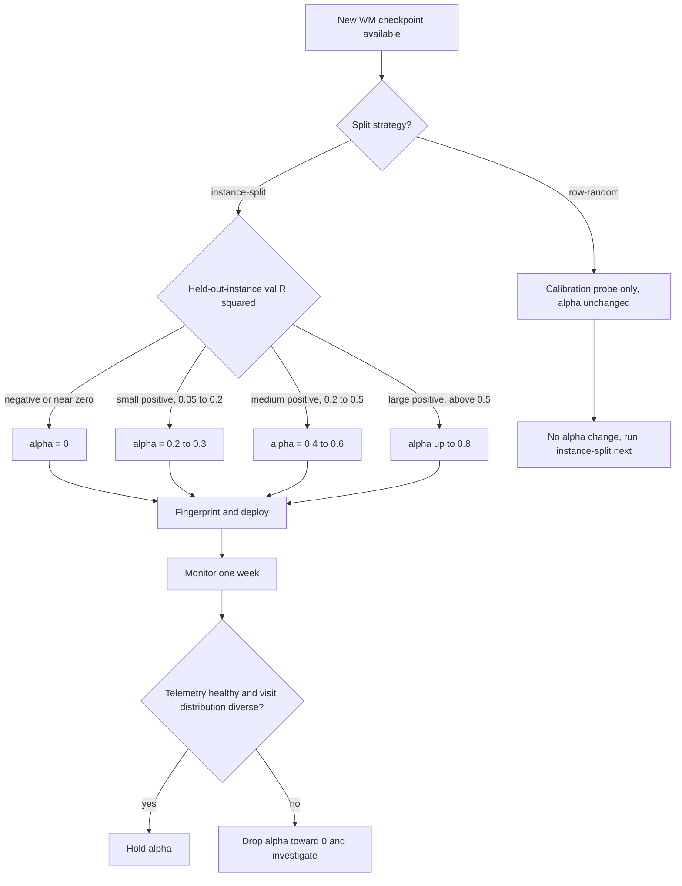

> **Thesis.** A single scalar α controls how much the world-model
> gets to vote in MCTS expansion. We shipped it at 0.3, raised it to
> 0.9 on a validation number that turned out to be leakage, and
> reverted to 0.0 eight days later. α is not a philosophical knob.
> It is a coupling coefficient with the WM's calibration on the
> *target distribution*. Every claim in this essay reduces to that
> sentence.

## 1. The blend

For each action $a$ at node $s$, the planner LLM emits a prior
$P_\text{llm}(a \mid s) \in [0,1]$. The WM service returns a scalar
value $v(s,a) \in [V_\text{min}, V_\text{max}]$, rescaled to a
normalized prior:

$$
P_\text{wm}(a \mid s) \;=\; \frac{v(s,a) - V_\text{min}}{V_\text{max} - V_\text{min}}.
$$

The two priors are mixed by a ten-line clamp-and-combine function in
the canonical pipeline. It validates α in $[0,1]$, clamps both
inputs to $[0,1]$, and returns the convex combination:

$$
P_\text{blended}(a \mid s) \;=\; (1 - \alpha)\, P_\text{llm}(a \mid s) \;+\; \alpha\, P_\text{wm}(a \mid s).
$$

The clamp is defensive plumbing: the LLM-side prior comes from a
validated option score and the WM-side prior is explicitly rescaled,
so in practice the clamp catches upstream bugs without crashing the
search. Fail-open, like the rest of the WM integration.

Boundary cases set the operational envelope. At $\alpha = 0$ the WM
service is still called (telemetry still increments on every
expansion) but its scalar is multiplicatively discarded. This is
"perseus-without-WM" mode. At $\alpha = 1$ the LLM is discarded and
MCTS expansion runs on the WM scalar alone — pure MuZero. We have
never deployed $\alpha = 1$; no WM checkpoint available in 2026-05
is anywhere near calibrated enough to drop the LLM entirely.

The total-variation distance between blended and LLM-only priors is
α-Lipschitz in the WM-LLM gap:

$$
\| P_\text{blended} - P_\text{llm} \|_\text{TV} \;=\; \alpha \cdot \| P_\text{wm} - P_\text{llm} \|_\text{TV}.
$$

This bound is the formal statement that α controls how loud the WM
gets to be in the planner's policy. At $\alpha = 0.9$ the planner
trusts the WM nine times as much as the LLM at every action. The
bound is also why WM calibration on the *deployed-traffic
distribution* sets the ceiling on how high α can responsibly go: if
$P_\text{wm}$ is uncorrelated noise on the target distribution, α
directly scales the noise injected into the search prior. We will
return to this inequality four sections from now to compute what 0.9
actually cost us.

## 2. Why we mix rather than choose

Either signal alone is incomplete. The LLM prior is **locally aware
but globally weak**: the planner sees the branch lineage, the
cross-stem digest, the evidence packet, and a budget snapshot, and
it is excellent at "given what I just read, which option should I
open next?" But it has no memory of which trajectories actually
solve the underlying instance. It cannot predict terminal reward
from a mid-trajectory state.

The WM scalar is **globally aware but locally blind**. We trained it
on $(s, r_\text{terminal})$ pairs across completed trajectories. It
estimates $\Pr[r_\text{terminal} = 1 \mid s]$ — the probability the
trajectory eventually scores judge_label=1 — but it does not see the
branch lineage or the evidence packet. It just returns a value.

The blend trades on complementary failure modes. LLM provides
locally-correct ranking; WM provides globally-calibrated amplitude.
When the WM is well-calibrated on the test distribution, the blend
should outperform either signal alone. When the WM is *not*
well-calibrated, the blend imports noise at amplitude α.

That last sentence is the entire story of the next four sections.

## 3. The original α = 0.3

First deploy of the WM-in-the-loop pipeline, 2026-05-10. The
uvicorn-served WM had just stood up on cato GPU 8. The perseus-side
client was threading per-option queries through the runtime loop.
Six new diagnostics fields had been wired through retrieval
diagnostics: total calls, failed calls, blended priors, a five-entry
error ring, last raw value, and last judge-head value.

We set α = 0.3 in the production env file. The reasoning at the
time was conservative-additive: the WM should be a useful prior but
not dominant; the LLM's local-context awareness still matters. That
is the right shape of reasoning for a first deploy. At α = 0.3 the
LLM keeps 70% of the prior weight. The WM nudges the search; it
does not steer it. If the WM is silently miscalibrated, the damage
is bounded — the LLM's 70% weight still dominates ranking on most
nodes.

The smoke check confirmed integration health. Over a 25-node MCTS
tree the WM produced 24 successful blend events and 11 distinct
prior values across 25 nodes, with zero failures. Same-tool nodes
got different priors based on state, which is the bare-minimum
signal that the WM is doing *something* and not just emitting a
constant.

The TV bound at this α is loose enough to be safe. Even in the
pathological all-noise case, the search prior moves by at most 30%
in TV norm from the LLM-only baseline. We will not be that lucky
two weeks later.

## 4. The raise to α = 0.9

`wm_v4_random_split` finished training on 2026-05-16 with val_r2 =
0.997 on the value head. By an order of magnitude this was the best
validation number in the entire WM training log. Every previous
instance-split variant had collapsed to negative val_r2 on value;
nothing had reached positive territory until `v3_traj_deepsets`
(+0.031) and `v3_traj_transformer` (+0.037), and those were tiny.

The number looked like the architecture had finally solved value
prediction. The variant sweep confirmed reproducibility: four
sibling configurations all hit 0.997 ± $10^{-3}$ on the same random
split. We raised α to 0.9 in the env file. Reasoning at the time
was equally compact: "WM is essentially solving the problem; trust
it."

At α = 0.9 the LLM contributes 10% of the prior weight. The WM
dominates. The TV bound says the blended prior can move up to 90%
of the WM-LLM gap from the LLM baseline at every expansion. If the
WM is well-calibrated this is the correct move — the WM has nine
times the policy weight and should drive search toward
high-value regions of state space.

The operationally important assumption that did the damage:
**val_r2 = 0.997 was measured on the training-set distribution,
not the deployed-traffic distribution.** The split strategy was
"random rows from the trajectory corpus." We trusted the WM at
0.9 weight on production traffic with no intermediate verification
that 0.997 generalized to held-out instances. This is the
wm-in-the-loop equivalent of training a classifier on 80% of
mnist and validating on the other 20% but failing to notice that
the same digits appear in both splits.

<Figure src="wm-in-the-loop-alpha-trajectory.png" alt="α trajectory and blend impact over the eight-day contamination window" caption="Three discrete α steps. Left axis: α value. Right axis: effective blended prior at the example point (P_llm=0.2, P_wm=0.8). Vertical dashed line: leakage discovery, 2026-05-17. The shaded interval between α=0.9 deploy and emergency revert covers eight days of contaminated training rows." n={1} />

## 5. The leakage discovery

The audit started for an unrelated reason — chasing a sweep
degradation visible in operational status. The investigation pulled
on the WM-training thread to check whether the recent checkpoint
change was causally upstream. It was, but not in the way we
expected.

The training corpus is structured as one row per $(\text{trajectory},
\text{step})$. A single instance produces a single trajectory.
Each trajectory has between 5 and 100 rows. The terminal-reward
column is **constant within a trajectory**: every row of a given
trajectory carries the same label because that label is "did this
entire trajectory eventually solve the instance?"

A row-random split of this corpus does the obvious thing: it puts
some rows of a trajectory in train and other rows in val. Those val
rows are statistically near-identical to the train rows from the
same trajectory — same instance, same model, same condition, same
intermediate state distribution. The terminal label is shared. A
model that learns to match trajectory IDs through their state
embeddings will trivially predict terminal_reward on those val rows.

Formally, if we write $\mathcal{T}_i$ for the set of all rows from
trajectory $i$ and $y_i \in \{0,1\}$ for that trajectory's terminal
label, a random row split produces train and val sets
$\mathcal{D}_\text{train}, \mathcal{D}_\text{val}$ where for many
trajectories $\mathcal{D}_\text{train} \cap \mathcal{T}_i \neq
\emptyset$ AND $\mathcal{D}_\text{val} \cap \mathcal{T}_i \neq
\emptyset$. The val rows are conditionally independent of the
train rows *only* given the trajectory ID, which the embedding
trivially recovers. The honest test is instance-level split: hold
out entire trajectories.

There is a separate, multiplicative effect from class imbalance.
The bootstrap corpus is 96.5% fail rows (691 passes / 19,881 total).
A model that predicts "fail with probability 0.965" everywhere
trivially scores $R^2 \approx 0.997$ in distribution. The variant
sweep replicating across hyperparameters was not evidence of
architectural strength — it was evidence of a reproducible ceiling
fixed by the corpus's class imbalance, accessible to any model that
can fit the marginal.

We can make the leakage operational. Define the leakage gap as

$$
\Delta_\text{leak} \;=\; R^2_\text{row-split} \;-\; R^2_\text{instance-split}.
$$

For `wm_v4_random_split` the honest instance-split number was
approximately 0.11. The leakage gap was therefore
$\Delta_\text{leak} \approx 0.997 - 0.11 = 0.887$. Nearly the
entire reported R² was leakage. The HISTORY/28 audit captured this
directly: row-random splits produce val rows that are statistically
near-identical to train rows from the same trajectory, and an R² of
0.997 is the model memorizing trajectory IDs through their
embeddings.

## 6. The contamination window

α = 0.9 deployed 2026-05-16. Leakage surfaced the night of
2026-05-17. Emergency revert landed 2026-05-18. Eight days of
production traffic where the WM contributed 90% of the prior weight
and was, on the deployed-traffic distribution, statistically
equivalent to random.

The mechanical consequences:

1. **MCTS visit distribution flattened toward uniform over 17
   actions.** The WM was returning roughly-random normalized values
   per action, so the WM-side contribution was effectively i.i.d.
   noise. At α = 0.9 that noise drowned the LLM's locally-informed
   ranking. UCB selection with a flat prior degenerates toward
   visit-count-only sampling, which is exploration without useful
   priors.

2. **Visit-distribution targets collected during the window are
   noise targets.** The MuZero training pipeline pulls the policy
   target $\pi^M_t(a) = N(s_t, a) / \sum_b N(s_t, b)$ from MCTS
   step snapshots and uses it as a policy-head training target. If
   $N$ was distributed by WM noise rather than LLM signal, $\pi^M_t$
   does not encode a useful prior. Training a policy head against
   those targets teaches the head to reproduce the noise.

3. **Every trajectory collected during the window was sampled
   under a noisy policy.** Multi-bench rows during this window have
   terminal labels that are still valid (the harness tests the
   resulting patch independently), but the trajectories themselves
   were generated by a search process that was effectively
   uniform-with-extra-steps. The state-action distribution shifted.
   Off-policy value learning on this cohort against later cohorts
   requires explicit importance weighting or honest cohort
   separation.

The damage is real but not catastrophic. Terminal labels from the
multi-swe-bench harness are still ground truth. State encodings are
still valid. What got poisoned is specifically the visit-distribution
field — the MCTS-derived policy target — and the implicit
state-action distribution of trajectories sampled in this window.
Both have a known fix: filter training by policy_fingerprint_sha
(migration 009) and either drop the window or treat it as a
separate cohort.

This is the failure mode the policy_fingerprint design anticipated.
The 2026-04-25 entry called out exactly this risk: mid-sweep
behavior changes silently mixing pre/post policies in the same
dataset; training on that is noisy by construction. α is a policy
parameter. It belongs in the fingerprint. Migration 009 captures
sorted env-var values (with secrets elided) into the fingerprint
sha, so the window is *identifiable* by fingerprint and
*recoverable* by cohort split — not silently lost.

## 7. The emergency revert

Setting α to 0.0 does not disable the WM service. It keeps running
on cato GPU 9, the client keeps firing on every MCTS expansion,
telemetry keeps flowing through wm_call events into the planner
JSONL and the DB sink. Diagnostics keep populating so we can
monitor what the WM *would have contributed* without it actually
contributing. The blend math evaluates to:

$$
P_\text{blended}(a \mid s) \;=\; 1 \cdot P_\text{llm}(a \mid s) \;+\; 0 \cdot P_\text{wm}(a \mid s) \;=\; P_\text{llm}(a \mid s).
$$

Pure LLM prior. Runtime behavior is operationally identical to the
pre-2026-05-10 era before WM-in-the-loop existed, *except* we still
have full WM observability for the post-mortem and the next deploy.
This is what fail-open buys: muting a subsystem without ripping it
out. The honest version of why this matters, from the
2026-05-18 entry, is one sentence: "Reverse the moment a clean
instance-split ckpt deploys." Not "we're done with WM-in-the-loop."
Not "the architecture was wrong." The integration shape is right;
un-mute when calibration is real.

## 8. The decision flow

The α-tuning decision is small and the inputs are operationalizable.

Two non-negotiables in this flow.

1. **Row-random splits never set α.** They are calibration probes
   that confirm an architecture can fit in-distribution data. They
   say nothing about generalization. The row-random branch
   terminates at "no α change" — not at any α-raising action.

2. **Held-out-instance val_r2 is the only metric that gates an α
   raise.** Not in-distribution R², not test loss, not Spearman
   rank correlation on val. Specifically held-out instances,
   sampled from the same distribution as production traffic, with
   at least a week of stability before the metric is trusted.

The implementation cost of this discipline is essentially zero —
both metrics are already computed in the WM training output. The
cost of not following it was eight days of contaminated training
data and one emergency revert. The asymmetry is decisive.

## 9. What it taught us, made formal

Let $\rho_\text{target}$ be the distribution of states the planner
actually visits in production, and $\rho_\text{train}$ be the
training-corpus state distribution. Let $C(\rho)$ be the WM's
calibration quality (any reasonable proper-scoring metric — R²,
Brier, log-loss) on distribution $\rho$. The blend imports useful
signal at amplitude α when $C(\rho_\text{target})$ is high. It
imports noise at amplitude α when $C(\rho_\text{target})$ is low.

We had a measurement of $C(\rho_\text{train})$ — the 0.997 — and
no measurement of $C(\rho_\text{target})$ at all. We raised α on
the wrong distribution. The honest decision rule is:

$$
\alpha^\star \;=\; \alpha^\star\!\left(C(\rho_\text{target})\right), \quad \text{not } \alpha^\star\!\left(C(\rho_\text{train})\right).
$$

This generalizes far beyond WM-in-the-loop. Any blend coefficient
between two models with different training distributions is a
coupling coefficient with the trailing model's calibration on the
*deployed* distribution. The same trap is waiting in every
reranker weight, every distillation temperature, every ensemble
mixture coefficient where one component was trained on a different
slice than where it ships.

Three operational corollaries:

1. **If the WM is well-calibrated on the test distribution, α can
   be high.** The blend imports useful signal at amplitude α.

2. **If the WM is uncalibrated or you are unsure about its
   calibration, α MUST be low.** The blend imports whatever
   miscalibration exists at amplitude α; keeping α low is the only
   defense against an unverified upstream.

3. **Cohort fingerprint must include α, the checkpoint sha, and the
   split strategy used to validate that checkpoint.** Migration
   009's policy_fingerprint_sha captures α and (transitively) the
   checkpoint identity through the WM_SERVE_MODEL_ID env var. What
   it does NOT capture is the split strategy used to report the
   checkpoint's metric. Either we push split strategy into the
   model_id (e.g. `wm_v4_random_split` vs the hypothetical
   `wm_v4_isplit`) so the fingerprint inherits it, or we add an
   explicit WM_SPLIT_STRATEGY env var that gets included in the
   fingerprint. The 2026-05-16 raise to 0.9 would have been
   flagged immediately by either mechanism: the model_id literally
   contains the word `random_split`.

The auto-memory note on single-task versus multi-task targets
predicted this failure mode the week before. Terminal reward is a
cumulative target. The leakage probe was the single-task baseline
showing the cumulative target was trivially predictable in
distribution. We had the diagnostic and ran it. We just did not
act on what it told us until eight days later.

## 10. Where this lives now

The blend function itself is correct and load-bearing; nothing
changes in the ten-line clamp-and-combine in the canonical
pipeline. The production config file pins α at 0.0 with an
in-place comment capturing revert rationale so the next operator
does not have to dig through Claude.md. The WM HTTP client still
calls wm-serve on every expansion, still emits telemetry, just
contributes zero to the blend. Migration 009 covers the contamination
window: identifiable by fingerprint, recoverable by cohort split.

The next material change is the v5 training cohort with explicit
instance-split, expected after the post-2026-05-11 judge cohort
finishes labeling. At that point α can be raised incrementally
(0.0 → 0.2 → 0.3) per the decision flow in §8, with
held-out-instance val_r2 as the gating metric and at least a week
of stability between raises. The 0.997 number is dead and will not
be cited as a reason to raise α again.
