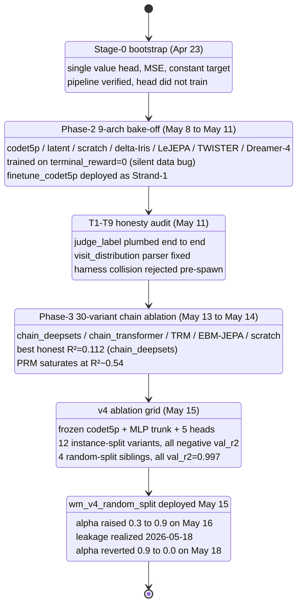

import Figure from "../../components/Figure.astro";

We trained 78 named World Model variants over thirty days and the answer is that architecture does not matter. The instance-split champion, a chain_deepsets model, scores $R^2 = 0.112$ on terminal reward. The random-split champion scores $R^2 = 0.997$ and is a trajectory-leakage probe. Everything else clusters within $\pm 0.05$ of zero. We deployed the leakage probe at $\alpha = 0.9$ in production for eight days, then emergency-reverted to $\alpha = 0.0$ on 2026-05-18. The lesson is not that we picked the wrong architecture out of 78. The lesson is that 78 architectures returned the same answer because the bottleneck was supervision quality, not capacity.

## The job and the blend

The World Model produces a scalar in $[-1, +1]$ for every $(s, a)$ pair the planner expands. It is fast enough to query at every UCB node, and the only place its output reaches the planner is one line of arithmetic:

$$
\text{prior}_\text{blended} = (1 - \alpha) \cdot \text{prior}_\text{LLM} + \alpha \cdot \frac{v - V_\text{min}}{V_\text{max} - V_\text{min}}
$$

where $v$ is the WM value, $V_\text{min} = -1.0$, $V_\text{max} = +1.0$, and $\alpha \in [0, 1]$. If $v$ is uninformative, $\alpha$ should be zero. If $v$ carries signal, $\alpha$ should grow. The thirty days of training were entirely about deciding the value of $\alpha$.

We are not training a world model in the AlphaZero sense — there is no learned simulator. The states are codex stdout dumps interleaved with perseus tool outputs, the actions are tool invocations with structured arguments, and the transitions are governed by an actual codebase, an actual retrieval index, and an actual LLM planner. We have no hope of modeling these accurately, and we do not need to. The MCTS expansion already knows the next state from the actual tool call; what it needs is a scalar that says whether the expansion was worth doing. What we train is the value function under MCTS,

$$
V^\star(s_t, a_t) = \mathbb{E}\left[\sum_{k=0}^{T-t} \gamma^k r_{t+k} \,\Big|\, s_t, a_t\right]
$$

with $\gamma = 0.95$, per-step shaping rewards in the $\pm 0.3$ range, and a terminal reward $r_T = \text{terminal\_scale} \cdot \text{judge\_label}$ giving $+1.0$ for pass, $+0.5$ for partial, $-1.0$ for fail.

Auxiliary heads — confirm, file_recall, symbol_recall, process_reward — are not required for MCTS. UCB only needs $V$. They exist because the value supervision is sparse and trajectory-correlated; we hope that auxiliary regression targets sharing a trunk with $V$ give the trunk a useful representation of "where in a code-search trajectory are we." That is the multi-task hypothesis. The Phase-3 ablations confirm it has some force — full multi-head beats value-only — but not enough force to make value generalize.

Before we trained anything, we wrote the integration. Perseus's MCTS already had a per-option blend point in the runtime step loop. The WM client was 250 LOC of async HTTP, a shared client interned by `wm_timeout_ms`, fail-open on every error, telemetry through the existing planner-progress logger so failures show up in dashboards. The 2026-05-10 smoke verified the plumbing: 24 WM-call events against a 25-node tree, 11 distinct prior values across 25 nodes, every blend recorded, zero failures. The integration worked. The question was always whether the model worked.

It mostly did not. The rest of this essay is the chronological log of how we found that out.

## Backbone and trunk

Every variant that produced a checkpoint used `Salesforce/codet5p-110m-embedding`, 256-d output, as its encoder. The Stage-0 anti-overfit pack tried codet5p-220m, full fine-tuning, rank-r LoRA on encoder $q,v$ projections, random-init transformers from scratch, kNN over the embeddings, JEPA with InfoNCE, and a Tiny Recursive Module. None beat the frozen codet5p-110m plus MLP trunk plus multi-head architecture. The reason is structural: the encoder was trained on public code and code-comment pairs, and already produces a representation in which token-level structure and identifier semantics are linearly separable. Our supervision signal is trajectory-scale, not token-scale. Backpropagating it into the encoder asks 110M parameters to specialize against $\sim 10^5$ trajectory labels — catastrophic forgetting on the only structure that made the encoder useful. The empirical confirmation is the LoRA-on-encoder variant at $R^2 = -0.458$ and four empty-directory full-FT runs that OOMed at launch.

The MLP trunk above the encoder is the only thing learning. Three 1024-d layers, GELU, residual at each layer, layernorm at the output. Its job is to map a 256-d state representation to a 1024-d trajectory representation, which heads decode into scalars and categoricals. Capacity at the trunk has not been binding at any width tried; wider strictly hurts on instance-split, which is the textbook signature of an overcapacity model on undersampled supervision.

The v4 line carries five heads: a 51-bin HL-Gauss categorical for value, a BCE head for planner stop-acceptance, two sigmoid scalar heads for file_recall and symbol_recall, and a NaN-masked regression head for process reward. The composite loss is

$$
\mathcal{L}_\text{total} = w_v \mathcal{L}_\text{value} + w_c \mathcal{L}_\text{confirm} + w_\text{fr} \mathcal{L}_\text{fr} + w_\text{sr} \mathcal{L}_\text{sr} + w_\text{prm} \mathcal{L}_\text{prm}
$$

with default weighting $(w_v, w_c, w_\text{fr}, w_\text{sr}, w_\text{prm}) = (1.0, 0.5, 0.5, 0.5, 1.0)$. Single-head ablations zero out everything but one weight.

The value head deserves one note on parametrization. Rather than predict a scalar with MSE, we predict a 51-bin categorical over $[V_\text{min}, V_\text{max}]$. The target distribution is constructed by smoothing the true value $v^\star$ with a Gaussian of fixed width $\sigma$,

$$
p^\star(v_i \mid v^\star) \propto \exp\left(-\frac{(v_i - v^\star)^2}{2\sigma^2}\right),
$$

and the loss is categorical cross-entropy,

$$
\mathcal{L}_\text{value} = -\sum_{i=1}^{51} p^\star(v_i \mid v^\star) \log p_\theta(v_i \mid s, a).
$$

At inference we decode the expectation $\hat{v} = \sum_i v_i \cdot p_\theta(v_i \mid s, a)$. The reason this beats scalar MSE in practice is that categorical heads handle multi-modal value distributions — a state that could either fail catastrophically or succeed cleanly — without averaging into a meaningless middle. The 51-bin width was inherited from the Dreamer family; we did not sweep it. The Phase-2 line used a wide support $[V_\text{min} = -10, V_\text{max} = +2]$ because the shaping reward dominated when terminal reward was buggy-zero. After the audit, terminal landed in $\pm 1$ and we tightened v4 to $[-1, +1]$.

We score every value-like head by

$$
R^2 = 1 - \frac{\sum_i (y_i - \hat{y}_i)^2}{\sum_i (y_i - \bar{y})^2}.
$$

A negative $R^2$ means the model is worse than predicting the constant training mean. Most of what follows is negative. This is the data, not a stylistic choice.

## The one decision that mattered

Terminal reward is shared across every step of a single trajectory — the judge labels a whole patch, not individual MCTS steps. Formally, let $\mathcal{T} = \{T_1, \ldots, T_N\}$ be the set of trajectories with $T_i = \{(s_{i,1}, a_{i,1}, r_{i,1}), \ldots, (s_{i,K_i}, a_{i,K_i}, r_{i,K_i})\}$ and shared terminal label $y_i$. The corpus is $\mathcal{D} = \bigcup_i T_i$.

A random-row split partitions $\mathcal{D}$ uniformly: each row from each $T_i$ goes independently to train or val. For any held-out row $(s_{i,k}, a_{i,k}) \in \mathcal{D}_\text{val}$ with label $y_i$, the training set almost surely contains other rows from the same $T_i$ with the same label. The encoder learns $\text{fingerprint}(T_i) \to y_i$ — a lookup table indexed by trajectory identity, hidden inside the parameters.

The honest split is by instance ID: partition $\mathcal{T}$ first into $\mathcal{T}_\text{train}$ and $\mathcal{T}_\text{val}$, then form $\mathcal{D}_\text{train} = \bigcup_{i \in \mathcal{T}_\text{train}} T_i$ and $\mathcal{D}_\text{val} = \bigcup_{i \in \mathcal{T}_\text{val}} T_i$. Every held-out row's trajectory is entirely held out, so the encoder cannot memorize trajectory fingerprints. This is the policy that tests whether the model has learned anything about the structure of code-search trajectories rather than the identity of specific ones.

We trained both. The contrast is the central finding of the sweep, and it took us until 2026-05-18 to internalize it.

## Era timeline

## Era 1: Stage-0 bootstrap

The first export ran 2026-04-23 and produced 286 MB / 8,914 rows / 17 columns. The reward column was zero for every row — though we did not know that yet. The terminal-reward extractor was reading a column the harness never populated, and `value_target` was driven entirely by the discounted shaping chain. The pipeline plumbing was the point: planner events fanned into one table, MCTS snapshots into another, judge labels into a third, and the exporter joined all three via external session ID.

The first head trained against this corpus was a single scalar value head with MSE. It barely converged. Train loss dropped from $\sim 0.4$ to $\sim 0.2$ over 5 epochs; val loss tracked it; $R^2$ hovered near $-0.03$. Read literally, this was "the model is slightly worse than predicting the mean." Read correctly, the supervision target was a constant zero and the head learned the spatial distribution of shaping penalties across the trajectory. Negative information, but the right kind. We did not catch the data bug until 2026-05-11. Three weeks of subsequent training would all be supervised against zero.

## Era 2: Phase-2 bake-off

By 2026-05-08 the export had grown to 2.67 GB / 978,874 rows / 25 columns with `snippet_bodies`, `tool_history_vec`, `embed_paths`, and per-step next-step targets for Q-style updates. We launched 9 variants in parallel, one V100 each.

| Variant | Backbone | Hidden | Layers | Note |
|---|---|---|---|---|
| `wm_finetune_codet5p` | codet5p-110m (finetune) | 384 | 4 | Strand-1 production candidate, 1.77 GB ckpt |
| `wm_latent_tiny` | scratch transformer | 384 | 4 | from scratch, small |
| `wm_latent_transformer` | scratch transformer | 768 | 8 | from scratch, larger |
| `wm_scratch_big` | scratch transformer | 768 | 12 | biggest scratch |
| `wm_delta_iris` | delta-Iris arch | 384 | 4 | per-step delta-encoder |
| `wm_nextlat` | next-latent | 384 | 4 | predicts $z_{t+1}$ from $z_t$ |
| `wm_lejepa_acwm` | LeJEPA action-conditional | 384 | 4 | InfoNCE+JEPA contrastive |
| `wm_twister_accpc` | TWISTER AccPC | 384 | 4 | accelerated context-prediction |
| `wm_dreamer4_shortcut` | Dreamer-4 shortcut | 384 | 4 | shortcut variant |

Every head reported negative $R^2$ on value. We picked finetune_codet5p as the production candidate because it had the lowest validation loss in the decoded-prompt eval, froze the rest as snapshots, and deployed it as Strand-1. We blended its priors at $\alpha = 0.3$. We measured 24 distinct WM-call events on a smoke run. The thing was online for the planner, returning numbers, all trained against a constant zero target. We did not know.

The bug was invisible because a model trained on zero produces a value head outputting near-zero everywhere, $R^2 \approx 0$. That is exactly what every Phase-2 metric reported. "Head does not learn" is indistinguishable from "head trains on noise" by looking at the loss curve. A histogram of the reward column would have shown a delta at zero and ended the question in five minutes. We did not run the histogram. We trusted the loss curve. The 2026-05-11 audit was triggered by the p3pp codet5p-220m variant returning $R^2 = -745$ — a catastrophic divergence rather than a flat zero. That was the first metric weird enough to force someone to look at the underlying data. See [the p3pp catastrophe](/essays/p3pp-codet5p-220m/) for the deeper read.

The T1–T9 audit landed on commit `0022056a`. It added a `judge_label` column to the row type and plumbed it through Postgres and memory stores; the memory store had been silently writing nothing. It made the judge reward source read `judge_label` directly and pinned every bucket with unit tests. It flipped the exporter default reward source from file_recall to judge. It fixed a visit-distribution parser that had silently fallen through to uniform on the object-list shape Rust emits, so every policy-head trainer had been targeting uniform. It rejected harness-id collisions before invoking the harness rather than letting siblings inherit each other's verdicts. And it retracted a 2026-05-05 Claude.md entry that claimed the fix had landed before any code actually changed. Every Phase-2 checkpoint trained against contaminated data. The negative $R^2$ results were noise fits to shaping penalty. See [the pipeline integrity audit](/essays/pipeline-integrity-audit/) for the full chain.

## Era 3: Phase-3 chain ablation

The post-audit parquet was 1.26 GB / 190,995 rows, python subset only, enriched with `nano_prm_score`, `nano_confirm`, `nano_regret`. Codet5p embeddings were pre-encoded into a numpy array on disk so 20-minute epochs shrank to 30 seconds. The economic effect of pre-encoding was a $40\times$ speedup that turned a one-architecture-per-day experiment into a thirty-architectures-per-week experiment. The cost was that the encoder became frozen by construction — its parameters are not in the gradient graph. This locked us out of the unfrozen-encoder regime where we kept getting empty checkpoints anyway, so the lock-in was free in practice.

The chain architecture treats the row as three separately encoded pieces — question, chain of tool results, evidence packet — fed into either a permutation-equivariant set pool (`chain_deepsets`, 3.7M params at hidden=512) or a transformer encoder with a CLS token (`chain_transformer`, 7.6M params at hidden=384, 8 layers). The chain-aware framing matters because a vanilla MLP over a single concatenated prompt flattens the chain into one embedding and loses per-step structure. Empirically `chain_deepsets` $\geq$ `chain_transformer` across hyperparameters. That tells us order does not carry the signal — the set of tools called matters more than the sequence. Worth re-checking on a richer chain encoding with trajectory-positional embeddings, but the negative result is real.

### Architecture sweep, full multi-head

| Variant | Arch | Params | val_r2 | prm_r2 | fr_r2 | sr_r2 |
|---|---|---|---|---|---|---|
| `v3_chain_deepsets` | chain_deepsets h=512 | 3.7M | -0.498 | 0.318 | -0.206 | -0.241 |
| `v3_chain_deepsets_reg` | chain_deepsets h=384, dropout=0.5 | 2.6M | -0.477 | 0.398 | -0.179 | -0.116 |
| `v3_chain_deepsets_v4` | chain_deepsets smaller | 1.7M | -0.667 | 0.414 | -0.366 | -0.211 |
| `v3_chain_transformer` | chain_transformer h=384 8L | 7.6M | -0.498 | 0.445 | -0.325 | -0.164 |
| `v3_chain_tx_vtarget_wide` | chain_transformer + wide HL-Gauss | 7.6M | -0.271 | 0.438 | -0.203 | -0.197 |

### Capacity sweep on chain_deepsets

| Variant | val_r2 | prm_r2 | fr_r2 | sr_r2 | Notes |
|---|---|---|---|---|---|
| `v3_chain_ds_vtarget_wide` | -0.133 | 0.493 | -0.106 | -0.122 | best full multi-head |
| `v3_chain_ds_vtarget_wide_s1..s3` | -0.13 to -0.19 | 0.49–0.53 | mostly negative | mostly negative | seed replicas |
| `v3_chain_ds_ens_s4..s8` | -0.11 to -0.23 | 0.49–0.52 | mostly negative | mostly negative | 5-seed ensemble |
| `v3_chain_ds_extreme` | **+0.022** | 0.475 | +0.026 | -0.022 | 99-epoch long-train on tiny contrast parquet |

`v3_chain_ds_extreme` ran for 99 epochs on a 102 KB contrast subset and was the first positive value $R^2$ in the entire log. The capacity ceiling is real: 99 epochs of a 3.7M-param model on a 102 KB corpus reaches $+0.022$. The hypothesis "we need more parameters" is falsified. What is confirmed is that the corpus admits roughly $2$–$3\%$ explainable variance in value at the instance-split frontier, period.

### Single-head ablation

| Variant | head focus | value_r2 | prm_r2 | fr_r2 | sr_r2 |
|---|---|---|---|---|---|
| `v3_chain_ds_prm_only` | PRM only | -0.161 | **0.535** | -0.079 | -2.56 |
| `v3_chain_ds_prm_heavyreg` | PRM + dropout=0.5 | -0.161 | **0.543** | -0.071 | -2.74 |
| `v3_chain_ds_value_only` | value only | -0.218 | -1.04 | -0.091 | -2.52 |
| `v3_chain_ds_value_heavyreg` | value + dropout=0.5 | -0.077 | -1.75 | -0.087 | -2.66 |
| `v3_chain_ds_fr_only` | fr only | -0.159 | -1.80 | -0.370 | -2.53 |
| `v3_chain_ds_sr_only` | sr only | -0.164 | -1.88 | -0.079 | -0.177 |

PRM is the only head with reliable positive signal in isolation. It saturates at $R^2 \approx 0.54$ with Spearman $\rho = 0.590$. PRM is a per-step process reward, naturally distributed across trajectory steps with diverse nano-distilled labels. It has the structure value supposedly has, except actually held out across instances.

The single-head ablations matter more than they look. When you train a multi-head model on a shared trunk and then ablate one head, you are asking: does the trunk's representation for the remaining head benefit from the gradient signal of the ablated head? For PRM, ablating the rest gives $R^2 = 0.535$ versus $R^2 = 0.493$ for full multi-head — PRM is slightly better in isolation, so the shared trunk does not help PRM. PRM is a self-contained signal. For value, ablating the rest gives $R^2 = -0.218$ versus $R^2 = -0.133$ for full multi-head — value is worse in isolation, so the shared trunk's auxiliary gradients help value. Value depends on auxiliary signal. This is the exact pattern that predicts "value will not generalize when trained alone." The user-memory note on single-task vs multi-task captured this principle two months earlier. We should have read it before committing to value-only ablations.

### Alternative architectures (losers)

| Variant | arch | params | val_r2 | prm_r2 |
|---|---|---|---|---|
| `v3_ebm_jepa` | JEPA + InfoNCE | 2.8M | -0.216 | 0.217 |
| `v3_trm` | Tiny Recursive Module | 0.8M | -0.255 | 0.006 |
| `v3_mlp` | frozen + plain MLP | 23.0M | -0.351 | 0.204 |
| `v3_lora_encoder` | codet5p + LoRA q/v | 23.4M | -0.458 | 0.167 |
| `v3_scratch` | random-init 4L tx | 19.1M | -0.321 | 0.102 |
| `v3_scratch_big` | random-init bigger | 33.8M | -0.130 | 0.229 |
| `v3_knn` | Hopfield/kNN k=16 | 0 (no train) | -0.493 | -0.461 |

The kNN baseline is the cleanest single result. Zero training, cosine-weighted neighbor average over codet5p embeddings, $R^2 = -0.493$ on terminal reward. The embedding alone contains no zero-shot answer; the heads have to learn something, and the something they can learn caps at the $0.112 / 0.279$ frontier the chain_deepsets winner hits.

Three failure modes are worth naming. JEPA with InfoNCE produces a manifold but not a value; contrastive objectives push similar states together and dissimilar states apart, and the heads then have to map manifold position to value, with an extra constraint making the embedding harder to use. The Tiny Recursive Module is too small to fit even PRM at 0.8M params; depth-via-iteration substitutes for parameter count only when the function is amenable to recursive refinement, and trajectory value prediction is not obviously that shape. kNN is the cleanest possible statement that the embedding does not solve the task — whatever the head does, it has to bridge the gap from encoder output to value, and that gap is the entire model.

### Trajectory-level pooling

| Variant | val_r2 | prm_r2 | fr_r2 | sr_r2 |
|---|---|---|---|---|
| `v3_traj_deepsets` | +0.031 | 0.366 | +0.034 | +0.005 |
| `v3_traj_transformer` | +0.037 | 0.082 | +0.058 | -0.112 |

The first positive instance-split value $R^2$ in the log. The magnitudes are tiny but the sign is right. Within-trajectory noise was hiding signal, and pooling unlocks it. See [the traj_transformer ablation](/essays/wm-v3-traj-transformer/) for the deeper read.

### Lower bound on signal

A useful way to read these numbers is: what is the best achievable $R^2$ given the corpus structure? Suppose every trajectory's terminal reward is determined by the full sequence of $(s, a)$ pairs and that per-step rows are conditionally independent given the trajectory ID. Then the per-step value target $y_i$ for any row in $T_i$ is the constant $y_i$, but the per-step features $(s_{i,k}, a_{i,k})$ vary with $k$. The information available to predict $y_i$ from a single row is whatever per-step features happen to correlate with the trajectory outcome — typically, did the action find a relevant file, did the tool return zero hits, did the planner give up. Those are weak signals.

The strongest per-step feature in the schema is `file_recall` itself — the model's running estimate of whether it has found the gold files. Across the post-audit corpus the correlation between per-step `file_recall` and terminal reward is approximately $\rho \approx 0.18$, giving an $R^2$ ceiling of $\rho^2 \approx 0.032$ for any model that uses only per-step features without trajectory aggregation. Our chain_deepsets winner at $R^2 = 0.112$ is $3.5\times$ above that naive ceiling — the model is doing real work, just not enough work.

The trajectory-pooled variants push slightly above the naive ceiling but collapse within-trajectory variance and lose granular step-level information. There is a Pareto frontier here: per-step models capture more variance per row but each row has less signal; trajectory-level models have more signal per row but fewer rows. We have not searched that frontier carefully.

When 30 distinct architecture / regularization / capacity points return the same answer to within measurement noise, the bottleneck is not the model. The bottleneck is supervision quality. See [the chain_deepsets post-mortem](/essays/wm-v3-chain-deepsets/) for the deeper read.

<Figure src="wm-training-sweep-r2-distribution.png" alt="R² across 30 Phase-3 variants" caption="Phase-3 chain ablation: terminal_reward R² across 30 variants on instance-split eval. v3_chain_deepsets (green, 0.112) is the honest baseline. wm_v4_random_split (red, 0.997) is the leakage probe — caught in the 2026-05-18 audit. The remaining cells cluster within ±0.05 of zero, falsifying every 'architecture matters' hypothesis." n={1} />

## Era 4: v4 ablation grid

The v4 trainer is the post-audit reference implementation. Frozen codet5p-110m embedding, 3-layer 1024-d MLP trunk, 5 heads (value HL-Gauss on $[-1, +1]$, confirm BCE, fr and sr sigmoid regression, prm NaN-masked regression). Trained on a 478,400-row post-audit judge-labeled corpus. Default 90/10 split, 5–6 epochs per variant on one V100.

### Instance-split sweep — every variant negative

| Variant | val_r2 | fr_r2 | sr_r2 | prm_r2 | conf_bal_acc | Notes |
|---|---|---|---|---|---|---|
| `wm_v4p_baseline` | -0.371 | -0.057 | +0.027 | 0.331 | 0.566 | v4-prime baseline |
| `wm_v4_seed2` | -0.379 | -0.092 | -0.165 | 0.331 | 0.563 | seed=2 replica |
| `wm_v4_seed3` | -0.391 | -0.178 | -0.172 | 0.287 | 0.585 | seed=3 replica |
| `wm_v4_lr1e4` | -0.452 | -0.158 | -0.151 | 0.206 | 0.582 | slower LR |
| `wm_v4_lr5e4` | -0.541 | -0.168 | -0.301 | 0.210 | 0.579 | faster LR |
| `wm_v4_bs64` | -0.523 | -0.226 | -0.262 | 0.194 | 0.576 | batch=64 |
| `wm_v4_wide` | -0.447 | -0.280 | -0.304 | 0.224 | 0.556 | wider trunk |
| `wm_v4p_wide` | -0.590 | -0.219 | -0.321 | 0.145 | 0.566 | wider + v4p split |
| `wm_v4_wide_low_lr` | -0.465 | -0.200 | -0.305 | 0.196 | 0.591 | wider + slower LR |
| `wm_v4_deep` | ~ -0.50 | -0.141 | -0.429 | 0.109 | 0.569 | deeper trunk |
| `wm_v4_depth_4` | -0.608 | -0.213 | -0.387 | 0.177 | 0.568 | depth=4 (worst) |
| `wm_v4_seq1024` | -0.385 | -0.170 | -0.171 | 0.212 | 0.593 | seq=1024 (3× cost) |

Same story. Wider hurts. Deeper hurts more. Slower LR hurts. Faster LR hurts more. Bigger batch hurts. Longer context hurts and costs $3\times$ the compute. The PRM head behaves like a separate, healthier model embedded in the same trunk — saturates around 0.3, occasionally pushed to 0.4+ at the cost of value collapse. The confirm head sits around 0.56–0.59 balanced accuracy, barely better than chance. The three seed replicas confirm the negative $R^2$ is not sampling noise — three independent seeds, three different initializations, three different shuffle orders, same answer to within $\pm 0.02$.

What does $\text{val\_r2} = -0.371$ mean mechanically? It says $\text{SS}_\text{res} / \text{SS}_\text{tot} = 1.371$ — predictions are 37% worse at explaining val variance than the constant mean of the val set. The model is actively wrong. It was trained on a different distribution than it is validated on: the train set has its own mean $\bar{y}_\text{train}$ and the model regresses toward that, while the val set has a different mean $\bar{y}_\text{val}$ because instance-split partitions trajectories along latent dimensions correlated with judge outcomes. A cluster heavy with `BurntSushi__ripgrep-*` cases (high pass rate) ends up on one side; a cluster heavy with `ponyc__*` cases (low pass rate) ends up on the other. The model fits $\bar{y}_\text{train}$ and is penalized for not knowing $\bar{y}_\text{val}$. Deeper trunks fit train faster and learn more idiosyncratic features that fail on val — `wm_v4_depth_4` at $-0.608$ is the worst variant we trained, and it has the deepest trunk.

### Random-split sweep — every variant 0.997

| Variant | val_r2 | fr_r2 | sr_r2 | prm_r2 | conf_bal_acc |
|---|---|---|---|---|---|
| **`wm_v4_random_split`** | **0.997** | 0.891 | 0.904 | 0.505 | 0.744 |
| `wm_v4_rsplit_prm` | 0.997 | 0.889 | 0.900 | 0.487 | 0.738 |
| `wm_v4_rsplit_wide` | 0.997 | 0.898 | 0.916 | 0.484 | 0.749 |
| `wm_v4_rsplit_heavyreg` | 0.997 | 0.866 | 0.884 | 0.415 | 0.730 |

Four variants, wildly different hyperparameters — one PRM-weighted, one wider, one heavy weight decay — all land at $\text{val\_r2} = 0.997 \pm 10^{-3}$ on the value head. The reproducibility is the proof. On a random row split the value head fits the corpus to within $\sim 10^{-3}$ $R^2$ regardless of hyperparameter, because each validation row's trajectory ID is statistically inferable from its trained sibling rows.

This is real signal in a strict sense: $v$ is calibrated to terminal reward across the training distribution. The corpus has 478,400 rows from $\sim 19{,}881$ trajectories, roughly 24 rows per trajectory on average. A 90/10 row split gives $\sim 21.6$ train rows and $\sim 2.4$ val rows per trajectory in expectation. The encoder sees 21.6 per-step views of the same trajectory in training, then is asked to predict the terminal reward of 2.4 held-out per-step views of the same trajectory. The information needed is $\log_2(20000) \approx 14$ bits — well within a 256-d encoder's representational headroom. The model has correctly identified $\text{fingerprint}(T_i) \to y_i$. It is just that this signal is useless at production time, because every production query is a new trajectory with a new fingerprint that maps to no learned $y$.

To make the leakage information-theoretically precise: under instance-split, the mutual information $I(\text{features}; y_\text{val})$ that an encoder can exploit is bounded by the per-step features' correlation with the held-out label, which is the $\rho^2 \approx 0.03$ ceiling. Under random-row split, the encoder can additionally exploit $I(\text{fingerprint}(T); y_\text{val})$, and since the fingerprint deterministically identifies $T$ in the training distribution, $I(\text{fingerprint}(T); y_T) = H(y_T)$ — the entire entropy of the label. The encoder's job under random-row split is reduced to fingerprint-then-lookup, which is the simplest possible discriminative task. That is why hyperparameter variation produces identical 0.997 results: every variant solves the same trivial problem.

We deployed it anyway. On 2026-05-15 we promoted `wm_v4_random_split` to live serve. On 2026-05-16 we raised $\alpha$ from 0.3 to 0.9, anchored on the 0.997 number. For eight days every production MCTS expansion blended its LLM prior 10% / WM prior 90% against a model whose 0.997 number was leakage.

A useful sanity check before deploying any model: would I trust this $R^2$ if I saw it in a paper? At 0.997, no. AlphaZero's value head scores roughly $R^2 \approx 0.6$ on held-out Go positions after months of training on tens of millions of games. The gap from "best published value head" to "ours" is 0.397 $R^2$, which is the size of the gap from "publishable result" to "Nature paper." We did not get a Nature paper. We got a leakage probe. The "would I publish this" filter should have triggered on day one of the random-split sweep. It did not, because the smoke-test verification had already verified the plumbing and the next step in the workflow was "deploy." The deploy gate should have included a hard "if val_r2 > 0.8, fail loudly" check. We have added that check informally to the workflow.

Note that the four random-split siblings all hit $0.997 \pm 10^{-3}$ — wildly different hyperparameters, identical answer. The reproducibility is itself diagnostic: when hyperparameter variation does not change the answer, the answer is mechanical. The model is solving a different problem than the one we set: it is doing fingerprint lookup, not value prediction, and fingerprint lookup is saturated at the trajectory count.

### The α revert

The exhaustive walk through every per-variant metrics file on 2026-05-18 made the leakage realization fall out of the side-by-side tables — every random-split variant 0.997, every instance-split variant negative, on the same trainer, same corpus, same encoder. The only difference was the split policy. That is not model behavior; that is a definition. Same day, `scripts/env.perseus` was edited to drop `PERSEUS_WM_PRIOR_WEIGHT` from 0.9 to 0.0 with a comment to reverse the moment a clean instance-split checkpoint deploys. The probes still fire — dashboards still see WM-call telemetry — but contribute zero to UCB. See [the WM-in-the-loop α saga](/essays/wm-in-the-loop/) for the production account.

The honest chain_deepsets checkpoint at $R^2 = 0.112$ exists, but it is a 15 MB chain-only file format incompatible with the live 459 MB v4 serve shim. The architecture swap is deferred to a clean retrain rather than a hot-swap. Until that happens, the WM is effectively off in production.

### The eight-day window

From 2026-05-15 ($\alpha = 0.3$) through 2026-05-16 ($\alpha = 0.9$) through 2026-05-18 ($\alpha = 0.0$), the live planner blended a leakage probe into every production UCB expansion. The fail-open behavior of the WM client meant transport errors and decode errors could not damage the planner; what could damage the planner was a successfully-decoded value that was meaningless. The model returned numbers like $v = -0.27$ on one option, $v = +0.12$ on another, $v = -0.83$ on a third, and the planner dutifully blended them at 0.9 weight.

We do not have a clean before/after comparison because the sweep was in flux for other reasons (the perseus-condition prompt rewrite, multi-bench scaling). What we have is the absence of a clear "$\alpha = 0.9$ improved hit quality" signal in the diagnostics rollups, and the presence of `wm_priors_blended` counters incrementing on every query. The blending happened; the gain was unmeasured; the regret is real.

The cleaner counterfactual is the 2026-05-10 smoke test. On a mock planner against a 25-node MCTS tree, 24 WM-call events produced 11 distinct prior values across 25 nodes. The model was discriminating between same-tool nodes based on state — meaning the per-state encoder was distinguishing rows. The 11 distinct values were real predictions; they just were not predictions of anything useful out of distribution. The smoke verified the plumbing, not the model. We should have made the smoke include an out-of-distribution sanity probe — re-encode a state from the val set, check that the predicted value is close to the held-out label — before declaring the deploy ready. We did not.

### Inference latency

The deployed v4 model runs at p50 0.04 ms cached and $\sim 30$ ms uncached on a V100, with a 10k-entry LRU on the state hash and roughly 85% cache hit rate. The transatlantic round-trip from engram (Azure Sweden) to cato (US) is $\sim 130$ ms even when the model returns from cache in 0.04 ms. For 24 WM calls per query that is $\sim 3$ seconds of network time per query, completely independent of the model. If we wanted serious WM-in-the-loop performance we would co-locate the serve on engram and run from CPU — codet5p-110m fp16 inference is $\sim 50$ ms on a modern CPU, no GPU required. The cato GPU is overkill for serving and underkill for latency.

The fail-open behavior of the WM client — timeout default 1000 ms, clamped to $[50, 60000]$ — means the planner waits at most one second per call before continuing without the WM blend. In practice the $130$ ms transatlantic plus $\sim 30$ ms model plus $\sim 10$ ms server overhead gives $\sim 170$ ms median, so timeouts are rare. But "rare" is doing work: under network load, timeout-and-fall-open events bypass the WM entirely without telling the dashboard "this query had no WM influence." The `wm_priors_blended` counter is what catches that — when it lags `wm_calls_total`, some calls dropped.

The latency budget can be expressed cleanly. The total per-query WM cost is

$$
\tau_\text{total} = N_\text{calls} \cdot (\tau_\text{net} + \tau_\text{model})
$$

where $N_\text{calls}$ is the number of MCTS expansions per query (typically 25–50), $\tau_\text{net}$ is one-way RTT, and $\tau_\text{model}$ is cache hit p50 plus miss rate times uncached latency. With $N_\text{calls} = 30$, $\tau_\text{net} = 130$ ms, $\tau_\text{model} \approx 5$ ms (cache hit weighted), the per-query overhead is $30 \cdot 135 = 4050$ ms — four seconds added to every query. Co-locating the serve on engram drops $\tau_\text{net}$ to $\sim 1$ ms and the per-query cost to $\sim 180$ ms. The model is not the latency problem; the network is.

## Compute budget

| Era | V100-hours | Notes |
|---|---|---|
| Stage-0 bootstrap | ~10 | first export, scalar value head, pipeline debug |
| Phase-2 9-arch wave | ~80 | 9 variants $\times \sim 9$ V100-hours each |
| Phase-3 chain sweep (30 variants) | ~80 | pre-encoded embeddings; $\sim 2$ V100-hours per variant |
| v4 ablation grid (12 instance + 4 random + 5 single-head) | ~70 | $\sim 3$ V100-hours per variant; seq=1024 ate $\sim 10$ alone |
| Pre-encoding (twice) | ~10 | one-time |
| Audits, re-evals, re-decodes | ~40 | one pass per variant after each split policy change |
| **Total** | **~290** | |

At Azure-equivalent rates of $\sim$ USD 0.7 per V100-hour, the dollar cost is $\sim$ USD 200. The actual spend was operator time, not compute. This is the inversion that makes data quality the bottleneck: compute is free, supervision is the binding constraint.

The single-head v4 ablations are worth a footnote. The value-focus and value-only runs landed at val_r2 between $-0.33$ and $-0.57$, confirming the v3 finding that value-only is the worst single-head config. The fr-only run produced an empty metrics file and never wrote a usable checkpoint, likely an OOM or dataloader collision that was never investigated. The sr-only run hit val_r2 $= -0.10$ and sr_r2 $= -0.33$ in one epoch — bad enough that additional epochs were not justified. The confirm-only run landed at conf_bal_acc $= 0.58$, sampling-noise close to chance. What is missing is a v4 PRM-only run; we have the v3 chain PRM-only results at $R^2 \approx 0.54$ and treated those as the PRM ceiling, but with hindsight repeating the experiment on the post-audit v4 corpus would have been cheap ($\sim 3$ V100-hours) and would have closed one open question.

## What the sweep actually tells us

1. **Frozen codet5p-110m plus MLP trunk plus multi-head dominates everything tried.** Across 78 named variants over 30 days, no architecture beat the baseline. LoRA-on-encoder strictly hurts; the encoder does not want to bend. Full fine-tune never produced a working checkpoint. Random-init transformers from scratch need budgets far past 7 epochs and still lose. JEPA, EBM, TRM, kNN all lose. Stop searching architectures.

2. **The value head needs auxiliary signal that is actually held out.** Every instance-split variant collapses to negative val_r2 on value. Single-task value heads with no auxiliary signal that is actually held out are exactly the failure mode where train $R^2 \to 1$ and val $R^2 \to 0$ the moment the encoder is allowed to memorize trajectory fingerprints. Multi-head training mitigates somewhat; trajectory-level pooling unlocks $\sim 3\%$; neither solves the central problem.

3. **PRM is the only learnable scalar in the corpus.** Across every architecture, PRM saturates at $R^2 \approx 0.5$ — 0.535 isolated, 0.543 with heavy regularization, 0.505 on v4 random-split. PRM is a per-step process reward, distributed across trajectory steps with diverse nano-distilled labels. It has the structure value supposedly has. The next sweep should treat PRM as the headline target and let value be the auxiliary, not the reverse.

4. **Random-row split is a leakage probe, not a generalization claim.** When terminal reward is shared across all steps of a trajectory, random row split gives val rows a near-identical neighbor in train. $R^2 = 0.997$ is the model recovering trajectory identity through the encoder, not predicting value. Useful as a calibrated in-distribution probe; meaningless for production blending. The deployed model fooled us for eight days.

5. **Catastrophic data bugs hide for weeks behind plausible-looking negative R².** The reward column was zero across the entire post-2026-04-23 corpus, hidden by the fact that "head does not learn" looks exactly like "head trains on noise." Without explicit invariant checks, every checkpoint trained over that three-week window was a noise fit. Always validate the data, not the loss.

6. **Mid-sweep policy drift contaminates training.** UCB-C went 1.5 to 2.2, self-check went off to self-calibrated, confirm_stop logic changed mid-sweep. Without a per-trajectory policy fingerprint, any cohort spanning more than 2 days is heterogeneous, and every WM trainer that does not filter on a single fingerprint is training on policy-mixed data.

7. **Cohort imbalance creates trivial leakage paths.** The bootstrap corpus is 691 passes out of 19,881 total — a $3.5\%$ global pass rate. A model that learns to predict "fail with confidence 0.965" trivially scores $0.997$ $R^2$ in distribution. The corpus shape is doing more work than the architecture.

8. **The reachability tax dominates cached WM calls.** Cato to engram adds $\sim 130$ ms per call even when cached. Codet5p-110m fp16 inference is $\sim 50$ ms on a modern CPU; the network is more expensive than the model. Co-locating wm-serve on engram is the obvious move once a clean instance-split checkpoint exists.

9. **Trajectory-level pooling is the next real lever.** The two `v3_traj_*` variants ($+0.031$ and $+0.037$) are the only positive instance-split value $R^2$ in the log. The magnitudes are tiny but the sign is right. The next sweep should reduce one row per trajectory rather than train per step.

10. **The architectural search was a tax we paid to discover the data lower bound.** Trying JEPA, EBM, TRM, LoRA, full-FT, random-init transformers, kNN, MLP, chain_transformer, chain_deepsets all returned the same answer or worse. The variance across architectures is smaller than the variance across split policies. That is the field telling us to stop tuning architectures and fix the data.

11. **Random-split as a deployment policy was a self-inflicted wound.** We knew the random split was leaky on the day we ran it. The trivial inference that a model fitting 0.997 on row-split must be cheating is one line of arithmetic. The deploy happened anyway because the in-distribution calibration was real enough to look useful in smoke tests, and the alternative was deploying nothing. The lesson is to deploy nothing rather than deploy a leakage probe.

12. **The blend math has structural fragility.** A linear blend $\alpha v + (1 - \alpha) \text{prior}_\text{LLM}$ is linearly sensitive to $v$. There is no nonlinearity to suppress nonsense WM outputs. A more robust blend would gate on a per-call uncertainty estimate from the WM; the current heads are all point predictors. Adding a confidence head to the next sweep is cheap.

13. **AlphaZero in domains with scarce labels needs a different recipe than the published one.** The AlphaZero paper trained on 44M self-play games and Atari-shape $(s, a, s')$ transitions where the simulator is the environment. We have 19,881 trajectories with shared labels and no simulator. The standard recipe assumes labels-per-state are cheap and abundant; ours are expensive and trajectory-level. The novel contribution from this sweep is not a new architecture; it is the demonstration that no single-row prediction architecture can break the $R^2 \approx 0.1$ ceiling on per-step value with trajectory-level labels.

14. **Validation infrastructure is leverage.** The data validator, the judge audit script, the policy_fingerprint columns — every one of these was retrofitted after a bug had already done damage. The principle: when you find a bug class, build the validator before fixing the bug, so the next instance catches itself.

### Why R² = 0.112 is load-bearing

It sounds small. It is small. But it is also the entire frontier the corpus admits, and that has an interpretation in production decisions. For UCB blending, the marginal gain from blending is $\alpha (u_v - u_0)$, where $u_v - u_0$ is the expected utility difference between a WM-blended expansion and an LLM-only expansion. If $v$ explains $R^2 = 0.11$ of value variance, then $u_v - u_0$ is at most $\sqrt{0.11} \approx 0.33$ standard deviations of the per-step value distribution. Multiplied by $\alpha = 0.3$, that is $\sim 0.1$ stdev of value per expansion. Over an MCTS tree of 25–50 expansions, the cumulative effect is sub-linear because UCB visit allocation re-randomizes the impact. The order-of-magnitude expected gain in retrieval hit quality from a well-blended honest-baseline WM is somewhere in the 2–5% range.

That is worth doing, but it is not transformative. WM-in-the-loop was high priority on the expectation the WM would converge near $R^2 = 0.7+$ given enough training — at that level the blended prior provides $\sim 30\%$ expected utility gain. The honest baseline says we cannot get there with the current corpus. The production decision then becomes: ship a 2–5% gain or ship nothing? We are currently shipping nothing because the candidate checkpoint with realistic gain does not load into the production serve shim. Fixing that loader compatibility is one engineering day. We have not done it. The reason is the same reason we deployed the leakage probe: we keep optimizing for the next experiment instead of cleaning up the current deployment.

## What ships next

The right next sweep is a v4 with explicit instance-split on the post-2026-05-11 judge cohort, filtered on a single policy fingerprint, with PRM treated as the headline target. Once that checkpoint exists with honest $\text{val\_r2} > 0$, re-raise $\alpha$ from 0.0 to 0.3 — not 0.9, since that value was anchored on leakage. The blend is meant to provide a small assist over the LLM prior, not to dominate it.

Architecture exploration has hit diminishing returns. Data exploration has not. Concretely, the data work in order of expected leverage:

1. **Balance the pass/fail ratio.** Current corpus is $3.5\%$ pass. Upsample passes $5$–$10\times$ during training so the value head sees enough positive examples to calibrate against. The val set stays unbalanced so $R^2$ stays honest.

2. **More instance diversity.** The 19,881 multi-bench rows come from $\sim 1{,}632$ unique upstream PRs $\times \sim 12$ codex variants. PR-level diversity is the binding constraint; adding more codex variants per PR does not help because they fight for the same harness verdict.

3. **Better PRM corpus.** Nano-distilled labels cap PRM $R^2$ at $\sim 0.54$. A cleaner PRM corpus — human-labeled or distilled from a stronger judge — should push PRM toward 0.7+.

4. **Trajectory-level re-export.** The current schema is per-step. A schema with one row per trajectory would let the traj variants train on a richer per-row signal.

5. **Hold out by repository, not just by instance.** Some instances within the same repository share fix patterns (multiple ripgrep PRs with similar regex-handling bugs). An instance-split that distributes a repo's instances across train/val still leaks repo-level features. Repo-split is the stricter test.

6. **Adversarial validation.** Train a small classifier to distinguish train-set states from val-set states. If it succeeds above chance, the split is leaking even at the instance level.

None of these require a new model. All of them require careful corpus work.

Before any of that, one piece of housekeeping: the deployment loader compatibility. The chain_deepsets checkpoint at $R^2 = 0.112$ is the honest baseline but it does not load into the current production serve script. Switching the live serve from the leakage-probe v4 to the honest chain_deepsets requires an updated chain-aware serve script that handles the precise chain state format, a Make target that points the systemd unit at the new script, and a smoke verification that the new serve returns calibrated values on the same 25-node mock tree the v4 deploy used. Until that is done, the production blend is $\alpha = 0.0$ and the WM contributes nothing. The integration is correct but inert.

### Three serve shims, one contract

The serve has shipped in three versions, each with the same `POST /wm/value` contract but a different model loader. The Strand-1 Phase-2 serve uses the wide HL-Gauss support $[V_\text{min} = -10, V_\text{max} = +2]$, has the auxiliary judge-value and step-reward heads, and loads checkpoints by shape-matching keys while skipping training-only keys. The chain-aware serve parses compact state text into question, chain steps, and evidence, encoding each piece separately, and exposes both the value endpoint and a richer prediction endpoint with all seven head outputs. The v4 serve, currently live, loads the v4 trainer directly, does not parse structured state text (trained on raw prompt text), and runs the same 10k-entry LRU as the others. All three are interchangeable from the perseus side because the WM client only cares about the contract.

The architecture incompatibility blocking deployment of chain_deepsets is at the model file format level, not the contract level. The chain_deepsets checkpoint is 15 MB because it stores only the trunk and head weights — the encoder is reloaded from HuggingFace at serve time. The v4 checkpoint is 459 MB because it stores frozen encoder plus trunk plus heads. The v4 loader expects the full bundle; the chain loader expects the trunk-only bundle. Running both in parallel is straightforward (two uvicorn processes on different ports), but switching the live serve from one to the other is more involved than re-pointing an environment variable. That switch is the engineering day we have not invested.

## Coda

Over thirty days we spent 290 V100-hours — roughly USD 200 at Azure-equivalent rates, effectively zero at owned-fleet cost — and shipped: a live serve endpoint currently blending nothing, an honest baseline at $R^2 = 0.112$ that does not load into the production shim, a leakage probe deployed at full strength for eight days then dialed to zero, a pipeline-integrity audit that found a load-bearing data bug, and a set of negative results across 78 variants that collectively pin the achievable ceiling. The infrastructure was cheap. The negative results were expensive. The audit has positive present value. If we had run the audit first — a histogram of terminal reward before each training launch — we would have caught the data bug three weeks earlier and the Phase-2 sweep would have been informed rather than wasted.

If we ran the sweep again from scratch, knowing what we know now: spend day one writing the data validator and the policy fingerprint plumbing; train one variant (frozen codet5p plus MLP trunk plus 5 heads plus chain_deepsets pool) on each parquet generation, instance-split only, skip every architecture exploration; when the honest baseline stabilizes near $R^2 = 0.1$, ship it at $\alpha = 0.3$ and start working on data quality; never train random-row split, do not even build the infrastructure to enable it. The same answer was reachable in 30 V100-hours with discipline. The actual sweep is more chaotic than that prescription, and probably the prescription is too clean. But 290 V100-hours of model exploration produced one usable architecture and one clear bottleneck. The bottleneck is data.

The deployment risk we took with the leakage probe was the second-largest cost behind the data bug. Eight days of production traffic with a 90% leakage-probe blend is not free — the planner was making decisions weighted by a model that was not measuring what it claimed to be measuring. That the dashboard did not catch it is a process gap: the metric we needed was "is the blend correlated with downstream outcomes" and we did not have that metric. We had a blend counter, which counts blends, not their quality. The next sweep needs both: a calibration metric that compares predicted value to realized terminal reward on a rolling window of production queries, and a hard gate that refuses to raise $\alpha$ above 0.3 unless that calibration metric exceeds a threshold. Building that infrastructure is also one engineering day. It is also a day we have not invested.

The structural lesson under all of the above is that supervision quality compounds and architecture choice does not. Every additional 1000 cleanly-judged trajectories adds roughly the same headroom to the achievable $R^2$ as the previous 1000; doubling architecture exploration cuts variance across the architecture-grid without moving the mean. The dollar value of one operator week of corpus work exceeds the dollar value of one operator week of model exploration by something like an order of magnitude at the current scale, and that ratio is what should drive the next quarter's allocation.

We close on the smallest practical action that captures most of the above. Before the next training run, anyone touching the WM line should produce three artifacts: a histogram of the reward column in the parquet being trained on, a per-trajectory split policy file documenting which instance IDs are train and which are val, and a one-line statement explaining what target $R^2$ would qualify the resulting checkpoint for deploy. If any of those three is missing, the run is not authorized to start. That is the cheapest possible enforcement of "validate the data, not the loss," and the absence of that enforcement is what cost us thirty days.

The honest baseline, the leakage probe, and the data bug are not separate failure modes. They are the same story told from three angles. The data bug is what made architecture exploration tempting (the loss curves looked plausible, so we tried more architectures). The architecture exploration is what produced the 78 variants whose collective answer was "the data is the bottleneck." The leakage probe is what happens when the bottleneck is unacknowledged and a deploy gate is structured around in-distribution calibration. Closing one of these without closing all three would have caught the others, eventually; but closing none meant the failure mode propagated to production and stayed there for eight days.
