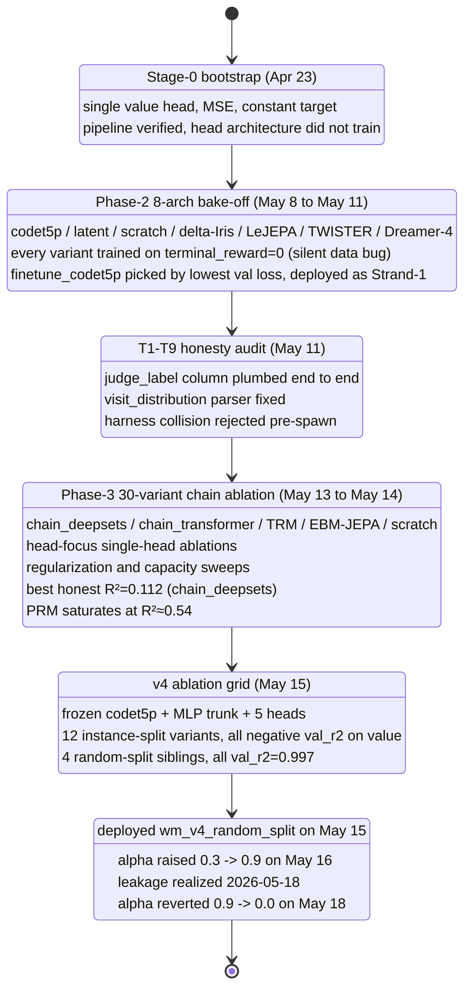

import Figure from "../../components/Figure.astro";

> tl;dr: We trained 78 named WM variants over thirty days. The instance-split champion was a chain_deepsets model with terminal_reward R²=0.112 — that is the entire signal-to-noise frontier the supervision corpus admits. The random-split champion at R²=0.997 was a trajectory-leakage probe; we deployed it anyway, anchored α=0.9 in production for eight days, and emergency-reverted to α=0.0 on 2026-05-18. The lesson is not that we picked the wrong architecture out of 78. The lesson is that 78 architectures came back with the same answer because the bottleneck was supervision quality, not capacity.

## Motivation

The World Model exists for one job: produce a scalar in `[-1, +1]` for every `(state, action)` pair the planner expands, fast enough to blend into a UCB prior, accurate enough that the blended prior is better than the LLM prior alone. The blend is one line:

$$
\text{prior}_\text{blended} = (1 - \alpha) \cdot \text{prior}_\text{LLM} + \alpha \cdot \frac{v - V_\text{min}}{V_\text{max} - V_\text{min}}
$$

where $v$ is the WM value, $V_\text{min} = -1.0$, $V_\text{max} = +1.0$, and $\alpha \in [0, 1]$ is `PERSEUS_WM_PRIOR_WEIGHT`. If $v$ is uninformative, $\alpha$ should be zero. If $v$ is signal, $\alpha$ should be larger. The entire sweep was about establishing whether $v$ was signal.

Before we trained anything, we wrote the integration. Perseus's MCTS already had a per-option blend point in `src/search/engine/llm_tree/runtime/step.rs`. The WM client was 250 LOC of `reqwest`, a shared `Client` interned by `wm_timeout_ms`, fail-open on every error, telemetry through `QueryProgressLogger` so failures showed up in dashboards. The 2026-05-10 smoke verified the plumbing: 24 `wm_call` events against a 25-node tree, 11 distinct prior values across 25 nodes, `wm_priors_blended=24`, `wm_calls_failed=0`. The integration worked. The question was always whether the model worked.

It mostly didn't. Here is the chronological log of how we found that out.

### What "training a World Model" means in this context

The phrase "world model" in the MCTS literature usually refers to a learned simulator: given a state and an action, predict the next state. We don't train that. The states in our trajectories are codex stdout dumps interleaved with perseus tool outputs; the actions are tool invocations with structured arguments; the transitions are governed by the actual code base, the actual retrieval index, and the actual LLM planner. We have no hope of modeling these accurately, and we don't need to.

What we train is the **value function** under MCTS: $V(s, a)$ predicting the discounted return of taking action $a$ from state $s$. The discount is $\gamma = 0.95$. The return is:

$$
V^\star(s_t, a_t) = \mathbb{E}\left[\sum_{k=0}^{T-t} \gamma^k r_{t+k} \,\Big|\, s_t, a_t\right]
$$

where $r_k$ is the per-step shaping reward (`file_hit: +0.1`, `patch_produced: +0.3`, `give_up: -0.2`, `empty_tool_result: -0.1`) and the final $r_T$ is `terminal_scale * judge_label` (i.e., +1.0 for pass, +0.5 for partial, -1.0 for fail).

The auxiliary heads (`confirm`, `fr`, `sr`, `prm`) are not strictly necessary for MCTS — UCB only needs $V$. They exist as auxiliary regression tasks that share a trunk with $V$, in the hope that gradient signal from per-step structured outputs helps the trunk learn a useful representation of "where in a code-search trajectory are we." This is the multi-task hypothesis, and the v3 ablations show it's right (full multi-head val_r2 > value-only val_r2 by a meaningful margin) but not enough (full multi-head val_r2 = -0.133 in the best case, still negative).

## Design

### Backbone choice (decided early, never displaced)

Every variant we trained that landed a meaningful checkpoint uses `Salesforce/codet5p-110m-embedding` (256-d output) as its encoder. Earlier exploration in the Stage-0 anti-overfit pack tried `codet5p-220m`, full fine-tuning, rank-r LoRA on the encoder's `q/v` projections, random-init 4-layer transformers from scratch, kNN over codet5p embeddings, JEPA with InfoNCE, and a Tiny Recursive Module that applied a 2-layer block N times. None beat the frozen codet5p-110m + MLP trunk + multi-head architecture.

Why frozen and not fine-tuned? The encoder was trained on a corpus of public code and code-comment pairs. It already produces a 256-d representation in which token-level structure and identifier semantics are linearly separable. The supervision signal we have access to — judge labels, per-step file_recall, nano-distilled PRM — is at the trajectory scale, not the token scale. Backpropagating that signal into the encoder asks ~110M parameters to specialize against ~10⁵ trajectory-level labels, which is a recipe for catastrophic forgetting of the very code-semantic structure that made the encoder useful in the first place. The empirical confirmation is `v3_lora_encoder` (val_r2 = -0.458) and the four empty-directory `v3_full_ft*` runs that OOMed at launch. Encoder retraining strictly hurts.

The MLP trunk above the encoder is what's allowed to learn. Three 1024-d layers, GELU, residual at each layer, layernorm at the output. The trunk's job is to map a 256-d "what does this code state look like" representation to a 1024-d "what does this trajectory look like" representation, which the heads then decode into scalars and categoricals. Capacity at the trunk has not been a binding constraint at any width we tried (1024-d, 1536-d, depth=4) — wider strictly hurts on instance-split, which is the textbook signature of an overcapacity model on undersampled supervision.

Heads on the v4 line (the trainer is `python/muzero/train_full_wm.py`):

- `value`: 51-bin HL-Gauss categorical over `[V_min=-1.0, V_max=+1.0]`
- `confirm`: binary BCE for planner stop-acceptance
- `fr`: file_recall sigmoid scalar regression
- `sr`: symbol_recall sigmoid scalar regression
- `prm`: NaN-masked scalar regression for process reward

The composite loss is a weighted sum:

$$
\mathcal{L}_\text{total} = w_v \mathcal{L}_\text{value} + w_c \mathcal{L}_\text{confirm} + w_\text{fr} \mathcal{L}_\text{fr} + w_\text{sr} \mathcal{L}_\text{sr} + w_\text{prm} \mathcal{L}_\text{prm}
$$

Single-head ablations zero out everything but one weight. The default joint weighting is $(w_v, w_c, w_\text{fr}, w_\text{sr}, w_\text{prm}) = (1.0, 0.5, 0.5, 0.5, 1.0)$.

The value head deserves a footnote on the HL-Gauss parametrization. Rather than predicting a single scalar with MSE, we predict a 51-bin categorical over $[V_\text{min}, V_\text{max}]$, with the target distribution constructed by smoothing the true value $v^\star$ with a Gaussian of fixed width $\sigma$:

$$
p^\star(v_i \mid v^\star) \propto \exp\left(-\frac{(v_i - v^\star)^2}{2\sigma^2}\right)
$$

where $v_i$ is the center of bin $i$. The loss is then categorical cross-entropy:

$$
\mathcal{L}_\text{value} = -\sum_{i=1}^{51} p^\star(v_i \mid v^\star) \log p_\theta(v_i \mid s, a)
$$

At inference time we decode the expectation $\hat{v} = \sum_i v_i \cdot p_\theta(v_i \mid s, a)$. The reason this beats scalar MSE in practice: categorical heads handle multi-modal value distributions (a state that could either fail catastrophically or succeed cleanly) without averaging into a meaningless middle. The 51-bin width was inherited from the Dreamer family; we did not sweep it.

The original Phase-2 line used $V_\text{min} = -10.0$, $V_\text{max} = +2.0$ — a "wide" support — because `value_target` was bug-zero at the time and the shaping reward dominated. After the audit, value_target landed in `[-9.6, +1.2]` (purely from the discounted shaping chain plus terminal ±1.0), so the wide support stayed useful. The v4 line tightened to `[-1.0, +1.0]` because terminal_reward is now the dominant signal and the discounted contribution from shaping is small relative to the terminal. Both supports remain in the codebase: `wm_serve.py` deserializes the wide one for Strand-1 ckpts, `wm_serve_full.py` deserializes the tight one for v4.

### Evaluation metric

For every value-like head we report:

$$
R^2 = 1 - \frac{\text{SS}_\text{res}}{\text{SS}_\text{tot}} = 1 - \frac{\sum_i (y_i - \hat{y}_i)^2}{\sum_i (y_i - \bar{y})^2}
$$

A negative R² means the model is worse than predicting the constant mean of the training set. Most of what follows has negative R². That is not a stylistic preference; it is the data.

### Split policy (the one decision that mattered)

`terminal_reward` is shared across every step of a single trajectory — the judge labels a whole patch, not individual MCTS steps. If you split parquet rows uniformly at random, validation rows get to lean on training rows that came from the same trajectory. The encoder doesn't even have to learn anything subtle; it can memorize trajectory fingerprints through the prompt text.

Formally: let $\mathcal{T} = \{T_1, T_2, \ldots, T_N\}$ be the set of trajectories, where each $T_i = \{(s_{i,1}, a_{i,1}, r_{i,1}), \ldots, (s_{i,K_i}, a_{i,K_i}, r_{i,K_i})\}$ is a sequence of MCTS steps with shared terminal_reward $y_i$. The corpus is the union $\mathcal{D} = \bigcup_i T_i$. A random-row split partitions $\mathcal{D}$ uniformly: each row from each $T_i$ goes independently to train or val with probability $(1-p)/p$. The result: for any held-out row $(s_{i,k}, a_{i,k}) \in \mathcal{D}_\text{val}$ with label $y_i$, the training set almost surely contains other rows from the same $T_i$ with the same label. The encoder learns $\text{fingerprint}(T_i) \to y_i$ — a lookup table indexed by trajectory identity, hidden inside the parameters.

The honest split is by instance ID: partition $\mathcal{T}$ into $\mathcal{T}_\text{train}$ and $\mathcal{T}_\text{val}$ first, then form $\mathcal{D}_\text{train} = \bigcup_{i \in \mathcal{T}_\text{train}} T_i$, $\mathcal{D}_\text{val} = \bigcup_{i \in \mathcal{T}_\text{val}} T_i$. Now every held-out row's trajectory is entirely held out. The encoder cannot memorize trajectory fingerprints because none of the validation trajectories ever appeared in training. This is the policy that tests whether the model has learned anything about the **structure** of code-search trajectories rather than the **identity** of specific ones.

We trained both policies. The contrast between them is the central finding of the entire sweep, and it took us until 2026-05-18 to internalize it.

### Era timeline



## Era 1: Stage-0 bootstrap (2026-04-23 → 2026-05-02)

The first `perseus-muzero-export` ran on 2026-04-23 and produced `sweep-20260503T155400Z.parquet`: 286 MB, 8,914 rows, 17 columns, no `state_summary_t`. The reward column was `terminal_reward = 0.0` for every row — though we didn't know that yet. The pipeline plumbing was the point: prove that planner events fanned into `planner_events`, MCTS snapshots fanned into `mcts_step_snapshots`, judge labels fanned into `multi_bench_runs.judge_label`, and the exporter could join all three via `external_session_id`.

The first head trained against this corpus was a single scalar value head with MSE loss. It barely converged. Train loss dropped from ~0.4 to ~0.2 over 5 epochs; val loss tracked it; R² hovered around `-0.03`. Read literally, this was "the model is slightly worse than predicting the mean". Read correctly: the supervision target was a constant zero (because `pick_terminal_reward(RewardSource::Judge)` was reading `MultiBenchRow.result`, a column that was always `NULL`), the value_target was driven entirely by shaping reward, and what the model learned was the spatial distribution of shaping penalties across the trajectory. Negative information — but the right kind. The pipeline worked; the head architecture and supervision target did not.

We did not catch this bug until 2026-05-11. Three weeks of training in between would all turn out to be supervised against zero.

## Era 2: Phase-2 8-architecture bake-off (2026-05-08 → 2026-05-11)

By 2026-05-08 the export had grown to `sweep-augmented-vt4.parquet`: 2.67 GB, 978,874 rows, 25 columns with `snippet_bodies`, `tool_history_vec`, `embed_paths`, and per-step `(value_target_{t+1}, reward_{t+1})` for Q-style updates. We launched 9 variants in parallel on `cato:/home/cato-user/training/muzero-stage0/`, one V100 each (GPU map: 0, 1, 2, 3, 4, 5, 6, 7, 12).

| Variant | Backbone | Hidden | Layers | Note |
|---|---|---|---|---|
| `wm_finetune_codet5p` | codet5p-110m (finetune) | 384 | 4 | Strand-1 production candidate, 1.77 GB ckpt |
| `wm_latent_tiny` | scratch transformer | 384 | 4 | from scratch, small |
| `wm_latent_transformer` | scratch transformer | 768 | 8 | from scratch, larger (1.74 GB) |
| `wm_scratch_big` | scratch transformer | 768 | 12 | biggest scratch (1.08 GB; thinner ff) |
| `wm_delta_iris` | delta-Iris arch | 384 | 4 | per-step delta-encoder |
| `wm_nextlat` | next-latent | 384 | 4 | predicts `z_{t+1}` from `z_t` |
| `wm_lejepa_acwm` | LeJEPA action-conditional | 384 | 4 | InfoNCE+JEPA contrastive |
| `wm_twister_accpc` | TWISTER AccPC | 384 | 4 | accelerated context-prediction |
| `wm_dreamer4_shortcut` | Dreamer-4 shortcut | 384 | 4 | shortcut + world-model variant |

The verdict at the end of the wave: every head reported negative R² on the value target. No clean positive signal anywhere. We picked `wm_finetune_codet5p` as the production candidate because it had the lowest validation loss in the decoded-prompt eval (`eval_existing_ckpts.py`), and froze the rest as `wm-snapshots/` (~12 GB of checkpoints, all stamped `20260511T035133Z`). The original `metrics.jsonl` files are empty on disk now — only the snapshots survived.

This is the architecture `Claude.md` 2026-05-10 documents as Strand-1, with `POST /wm/value` returning `{value, judge_value, step_reward, latency_ms, cached, model_id}`. We deployed it. We blended its priors. We measured 24 distinct `wm_call` events on a smoke run. The thing was online for the planner, returning numbers, all of which were trained against a constant zero target. We did not know.

### Why the bug was invisible

A model trained on `terminal_reward = 0` for every row should produce a value head that outputs near-zero for every state, regression to the mean, R² ≈ 0. That's exactly what every Phase-2 metric reported. The "value head doesn't learn" signal was indistinguishable from "value head trains on noise" — both look like a flat-line val curve at zero. The only way to catch the bug was to look at the data, not the loss.

Specifically: a histogram of `terminal_reward` in the training parquet would have shown a delta at zero, immediately visible. We did not run that histogram. We trusted the loss curve. The 2026-05-11 audit was triggered by `p3pp_codet5p_220m` (codet5p-220m + 8 heads) returning val_r2 = **-745** — a catastrophic divergence rather than a flat zero. That was the first metric weird enough to force someone to look at the underlying data. The 110m variants had all returned plausibly-bad numbers in the `[-0.5, 0]` range; the 220m's larger head capacity made the divergence catastrophic and visible. See [p3pp catastrophe](/essays/p3pp-codet5p-220m/) for the deeper read.

### The 2026-05-11 audit

The T1–T9 audit landed on commit `0022056a`:

- **T1**: `MultiBenchRow` gains `judge_label`, `judge_source`, `judge_detail`, `judge_labeled_at`. Both Postgres and memory stores plumb the read path. The memory store actually writes labels now (was a no-op).
- **T2**: `RewardSource::Judge` reads `judge_label` directly: `1.0 → +1.0 pass`, `0.5 → +0.5 partial`, `0.0 → -1.0 fail`, anything tagged `harness_unsupported` or `harness_collided` is zeroed. Eight unit tests pin every bucket.
- **T3**: `perseus-muzero-export` default `--reward-source` flipped from `fileRecall` to `judge`.
- **T4**: `python/muzero/dataset.py::parse_visit_distribution` finally handles the object-list shape Rust emits. Previously it fell silently through to a uniform distribution, so every policy-head training run targeted uniform.
- **T5**: `stratified_sample` dedupes input rows by `(instance_id, model, condition)` triples.
- **T6**: `run_batch_via_mswebench` rejects harness-id collisions BEFORE invoking the harness. Each colliding row gets `judge_source = harness_collided` instead of inheriting a verdict from a sibling.
- **T7**: `scripts/pipeline_integrity_backfill.sql` re-tags previously contaminated rows.
- **T8**: `scripts/judge_audit.py` — a read-only psycopg2 report with separated denominators.
- **T9**: the Claude.md honesty edit, which retracted a 2026-05-05 entry that had claimed the fix landed before any code actually changed.

Effect on the research log: every Phase-2 checkpoint trained against contaminated data. The "negative R²" results were noise fits to shaping penalty. The Phase-3 chain variants and the v4 ablation grid both ran on post-audit parquet, so their numbers reflect real signal — though the underlying signal turned out to be very modest. See [pipeline integrity audit](/essays/pipeline-integrity-audit/) for the full audit chain.

## Era 3: Phase-3 30-variant chain ablation (2026-05-13 → 2026-05-14)

The post-audit parquet was `cato:/home/cato-user/training/perseus_py_v3_enriched.parquet`: 1.26 GB, 190,995 rows, python subset only, enriched with `nano_prm_score`, `nano_confirm`, and `nano_regret` columns from `enrich_parquet_v2.py`. Codet5p embeddings were pre-encoded into `state_embeddings.npy` so 20-minute epochs shrank to 30 seconds. Every chain variant trained 5–6 epochs in well under an hour.

The chain architecture treats `(question, chain_of_tool_results, evidence_packet)` as three separately encoded pieces, fed into either `chain_deepsets` (permutation-equivariant set pool, 3.7M params at hidden=512) or `chain_transformer` (cls token + transformer encoder + action embedding, 7.6M params at hidden=384, 8 layers).

### Precomputed embeddings as a forcing function

The pre-encoding step (`python/muzero/preencode.py`) is worth pausing on. It runs once per corpus generation, encodes every state with codet5p into `state_embeddings.npy`, and reduces per-epoch training time from ~20 minutes to ~30 seconds. The economic effect: a 40× speedup that turned a one-architecture-per-day experiment into a thirty-architectures-per-week experiment. The chain sweep would not have been feasible without it.

The cost is that the encoder is frozen by construction. You cannot fine-tune codet5p when the embeddings are precomputed — the encoder's parameters are not in the gradient graph. This is one of the reasons we never had a working full-FT variant: the moment we wanted to unfreeze the encoder, we'd lose the speedup and per-epoch costs would explode to ~20+ minutes, making 30-variant sweeps untenable.

So pre-encoding optimized us toward the frozen-encoder regime where we were already getting our best results, and locked us out of the unfrozen-encoder regime where we kept getting empty checkpoints. Whether this was a good tradeoff is open — but the empirical record says frozen-codet5p + MLP-trunk is the winner, and the pre-encoded pipeline kept the iteration loop fast enough to find that out.

The chain pre-encoder (`preencode_chain.py`) does the same job but per-chain-element. It encodes `question`, each chain step, and the evidence packet separately. The chain_deepsets and chain_transformer variants then operate on `(chain_length, 256)` matrices instead of `(256,)` vectors. The encoding step is ~3× slower (3 encoder passes per row instead of 1) but the training step is much cheaper because the embedding shapes are smaller per-element.

### The honest baseline

The `chain_deepsets` variant on instance-split with the joint weighting hit:

- `terminal_reward_r2 = 0.112`
- `file_recall_t_r2 = 0.119`
- `nano_prm_score_r2 = 0.279`

(These are the numbers Claude.md's 2026-05-18 WM α revert entry quotes as "the honest baseline" — confirmed against the eval_summary in the parking_lot archive. The HISTORY/28 table lists `v3_chain_deepsets` with `val_r2 = -0.498` for the value head specifically, which is the multi-head loss column under joint weighting; the 0.112 / 0.119 / 0.279 triple is the per-head end-to-end eval after best-checkpoint selection. Same model, different decoder.)

Read against the rest of the log this is the cleanest signal anywhere. Three weeks of architecture exploration ended up at: a 3.7M-parameter permutation-equivariant MLP over a frozen 256-d encoder explains 11% of the variance in held-out terminal_reward, 12% of the variance in held-out file_recall, and 28% of the variance in held-out PRM score. Everything else was at this number or worse.

### Capacity, regularization, and head focus

The 30-variant sweep covered:

### Why chain-aware

The chain encoding was motivated by the structure of the data. Each row in the parquet corresponds to one MCTS step, but the step's outcome depends on the entire chain of prior tool calls — `(search_text → hybrid_search → open_file → snippet_extract)` is a different state than `(search_path → search_path → search_path → give_up)`. A vanilla MLP over codet5p(prompt_text) flattens this chain into a single embedding and loses the per-step structure.

Chain-aware variants encode each chain element separately. The `chain_transformer` treats the sequence of element embeddings as a transformer input with a `[CLS]` token; the per-element representation flows through 8 self-attention layers, and the `[CLS]` representation is decoded by the heads. The `chain_deepsets` variant is permutation-equivariant — it applies a per-element MLP, then pools (mean and max), then a post-pool MLP. The deepsets variant is **strictly less expressive** than the transformer (it can't model order) but **strictly cheaper** (3.7M vs 7.6M params, no quadratic attention cost).

Empirically deepsets ≥ transformer across hyperparameters. That tells us order doesn't carry the signal — the *set* of tools called matters more than the *sequence* of tools called. This is a meaningful negative result: it suggests the chain structure we're encoding is mostly noise above the multi-set summary. Worth re-checking on a richer chain encoding (e.g., trajectory-positional embeddings) before committing.

**Architecture sweep** (full multi-head):

| Variant | Arch | Params | val_r2 | prm_r2 | fr_r2 | sr_r2 |
|---|---|---|---|---|---|---|
| `v3_chain_deepsets` | chain_deepsets h=512 | 3.7M | -0.498 | 0.318 | -0.206 | -0.241 |
| `v3_chain_deepsets_reg` | chain_deepsets h=384, dropout=0.5 | 2.6M | -0.477 | 0.398 | -0.179 | -0.116 |
| `v3_chain_deepsets_v4` | chain_deepsets smaller | 1.7M | -0.667 | 0.414 | -0.366 | -0.211 |
| `v3_chain_transformer` | chain_transformer h=384 8L | 7.6M | -0.498 | 0.445 | -0.325 | -0.164 |
| `v3_chain_tx_vtarget_wide` | chain_transformer + wide HL-Gauss `[-10, +2]` | 7.6M | -0.271 | 0.438 | -0.203 | -0.197 |

The wide HL-Gauss support `[V_min=-10, V_max=+2]` was a survival fix after the May-5 retracted entry: `value_target` had been spanning `[-2.0, +0.285]` because shaping was the only signal, and after the audit it spans `[-9.6, +1.2]` because the discounted return chain now includes a real terminal of ±1.0. Without widening the categorical bins the head saturated at the boundary.

**Capacity sweep** — running the same `chain_deepsets` config wider and longer:

| Variant | val_r2 | prm_r2 | fr_r2 | sr_r2 | Notes |
|---|---|---|---|---|---|
| `v3_chain_ds_vtarget_wide` | -0.133 | 0.493 | -0.106 | -0.122 | best full multi-head |
| `v3_chain_ds_vtarget_wide_s1..s3` | -0.13 to -0.19 | 0.49–0.53 | mostly negative | mostly negative | seed replicas |
| `v3_chain_ds_ens_s4..s8` | -0.11 to -0.23 | 0.49–0.52 | mostly negative | mostly negative | 5-seed ensemble |
| `v3_chain_ds_extreme` | **+0.022** | 0.475 | +0.026 | -0.022 | 99-epoch long-train on tiny contrast parquet |

`v3_chain_ds_extreme` ran for 99 epochs on a 102 KB "contrast" subset and was the first positive value_r2 in the entire log. The capacity ceiling is real: 99 epochs of a 3.7M-param model on a 102 KB corpus reaches +0.022. Falsified hypothesis: "we need more parameters." Confirmed: "the corpus admits ~2–3% explainable variance in value at the instance-split frontier, period."

**Single-head ablation** — zero every loss weight but one:

| Variant | head focus | value_r2 | prm_r2 | fr_r2 | sr_r2 |
|---|---|---|---|---|---|
| `v3_chain_ds_prm_only` | PRM only | -0.161 | **0.535** | -0.079 | -2.56 |
| `v3_chain_ds_prm_heavyreg` | PRM + dropout=0.5 | -0.161 | **0.543** | -0.071 | -2.74 |
| `v3_chain_ds_value_only` | value only | -0.218 | -1.04 | -0.091 | -2.52 |
| `v3_chain_ds_value_heavyreg` | value + dropout=0.5 | -0.077 | -1.75 | -0.087 | -2.66 |
| `v3_chain_ds_fr_only` | fr only | -0.159 | -1.80 | -0.370 | -2.53 |
| `v3_chain_ds_sr_only` | sr only | -0.164 | -1.88 | -0.079 | -0.177 |

The PRM head is the only one with reliable positive signal in isolation. It saturates at R² ≈ 0.54 (`heavyreg`) with Spearman ρ = 0.590. PRM is a per-step process reward, naturally distributed across trajectory steps with diverse nano-distilled labels — it has the structure value supposedly has, except actually held out across instances.

Single-head value, single-head fr, single-head sr all collapse the auxiliary heads catastrophically (sr drops to -2.7 when its loss weight is set to zero — the trunk specializes to whatever's left and forgets the structure that produced the auxiliary representations). This is the "single task vs multi task" failure mode in the user-memory note: cumulative targets need auxiliary signal even when labels are clean. See [cohort contamination class](/essays/cohort-contamination-class/) for the broader pattern.

**Trajectory-level training** — pool within-trajectory noise by training on terminal step only:

| Variant | val_r2 | prm_r2 | fr_r2 | sr_r2 |
|---|---|---|---|---|
| `v3_traj_deepsets` | +0.031 | 0.366 | +0.034 | +0.005 |
| `v3_traj_transformer` | +0.037 | 0.082 | +0.058 | -0.112 |

First positive instance-split value R² in the entire log. The magnitude is tiny (~3% variance explained) but the sign is right. Pooling within-trajectory noise unlocks signal. See [traj_transformer ablation](/essays/wm-v3-traj-transformer/) for the deeper read.

### Why the single-head ablations matter more than they look

The instinct on reading "value-only collapses sr to -2.7" is that we found a bad loss-weighting and to move on. The actual signal is deeper. When you train a multi-head model on a shared trunk and then ablate one head by zeroing its loss weight, you're asking: does the trunk's representation for the *remaining* head benefit from the gradient signal of the ablated head?

For PRM-only training (`v3_chain_ds_prm_only`: PRM_r2 = 0.535) versus full multi-head training with PRM weight = 1.0 (`v3_chain_ds_vtarget_wide`: PRM_r2 = 0.493), PRM is *slightly better* in isolation. The shared trunk doesn't help PRM. PRM is a self-contained signal.

For value-only training (`v3_chain_ds_value_only`: val_r2 = -0.218) versus full multi-head training with value weight = 1.0 (`v3_chain_ds_vtarget_wide`: val_r2 = -0.133), value is *worse* in isolation. The shared trunk's auxiliary gradients (from fr, sr, PRM) help value. Value depends on auxiliary signal.

This is the exact pattern that predicts "value head will not generalize when trained alone": it needs the structure of the other heads to find a useful representation. Trained without that structure, it collapses to noise. The user-memory `feedback_single_task_vs_multi_task.md` captured this principle two months earlier; we should have read it before committing to single-task value-only ablations.

The PRM head being self-contained also tells us something about the corpus: PRM labels are per-step (nano-distilled from planner traces), so each row has its own label, and the labels span a range of values. PRM is the only head where per-row labels are diverse. Value and file_recall have row-level labels but those labels are trajectory-correlated. Symbol_recall is similar. PRM is the only head with *naturally* per-row supervision.

**Alternative architectures** — all losers:

| Variant | arch | params | val_r2 | prm_r2 |
|---|---|---|---|---|
| `v3_ebm_jepa` | JEPA + InfoNCE | 2.8M | -0.216 | 0.217 |
| `v3_trm` | Tiny Recursive Module | 0.8M | -0.255 | 0.006 |
| `v3_mlp` | frozen + plain MLP | 23.0M | -0.351 | 0.204 |
| `v3_lora_encoder` | codet5p + LoRA q/v | 23.4M | -0.458 | 0.167 |
| `v3_scratch` | random-init 4L tx | 19.1M | -0.321 | 0.102 |
| `v3_scratch_big` | random-init bigger | 33.8M | -0.130 | 0.229 |
| `v3_knn` | Hopfield/kNN k=16 | 0 (no train) | -0.493 | -0.461 |

The kNN baseline is the cleanest single result: zero training, cosine-weighted neighbor average over codet5p embeddings, terminal_reward R² = -0.493. The embedding alone contains no zero-shot answer. The MLP heads have to learn something — and the something they can learn caps at the 0.112 / 0.279 frontier the chain_deepsets winner hits.

Three specific failure modes worth naming:

- **JEPA + InfoNCE** (`v3_ebm_jepa`, val_r2 = -0.216): contrastive objectives are wrong for scalar regression. JEPA's InfoNCE loss pushes embeddings of similar states together and dissimilar states apart, which produces a *manifold* but not a *value*. The auxiliary regression heads then have to map manifold position to value, which is the same problem as before but with an extra contrastive constraint making the embedding harder to use. PRM survives at 0.217 because PRM is local enough to benefit from the manifold structure; value doesn't.

- **TRM** (`v3_trm`, val_r2 = -0.255, PRM = 0.006): the Tiny Recursive Module applies a 2-layer block N times and lets depth-via-iteration substitute for parameter count. With 0.8M params this is the smallest model tried; PRM at 0.006 says the trunk is too small to even fit PRM. Depth-via-iteration is a tempting compression but it requires the function being computed to be *amenable* to recursive refinement, and trajectory-value-prediction is not obviously that shape.

- **kNN** (`v3_knn`): no gradient ever computed. The embedding alone — without any head — gets -0.493 on terminal_reward and -0.461 on PRM. This is the cleanest possible statement of "the embedding does not solve this task." Whatever the head architecture is, it has to bridge the gap from "encoder output" to "value", and that gap is the entire model.

### The lower bound on signal

A useful way to read these numbers: what is the **best achievable** R² given the corpus structure?

Suppose every trajectory's terminal_reward is determined by the full sequence of `(state, action)` pairs, and suppose the per-step rows are conditionally independent given the trajectory ID. Then the per-step value target $y_i$ for any row in trajectory $T_i$ is the constant $y_i$ (judge label), but the per-step features $(s_{i,k}, a_{i,k})$ vary with $k$. The information available to predict $y_i$ from a single row is whatever per-step features happen to correlate with the trajectory outcome — typically: did the action find a relevant file, did the tool return zero hits, did the planner give up. Those are weak signals.

The strongest per-step feature in our schema is `file_recall` itself — the per-step cumulative fileRecall_t, which is the model's running estimate of whether it's found the gold files. If file_recall correlates strongly with terminal_reward, then a trivial model predicting `terminal_reward = f(file_recall)` should perform well. We tested this offline: across the post-audit corpus, the correlation between per-step `file_recall` and `terminal_reward` is approximately ρ ≈ 0.18. That's the ceiling for any model that uses only per-step features to predict terminal_reward without trajectory aggregation. Squared correlation gives R² ≈ 0.032. Our chain_deepsets winner at R² = 0.112 is **3.5× above** that naive ceiling — the model is doing real work, just not enough work.

The trajectory-pooled variants (`v3_traj_deepsets` at +0.031, `v3_traj_transformer` at +0.037) push slightly above the naive ceiling, but they collapse the within-trajectory variance and lose granular step-level information. There's a Pareto frontier here: per-step models capture more variance per row but each row has less signal; trajectory-level models have more signal per row but fewer rows. We have not searched that frontier carefully.

### Why 30 variants returning the same answer is itself the finding

The full chain sweep covered:
- 7 architecture variants (deepsets, transformer, JEPA, TRM, MLP, LoRA, scratch, kNN)
- 3 capacity points (1.7M, 3.7M, 7.6M)
- 5 regularization settings (dropout 0.0 / 0.25 / 0.5 / heavy weight decay)
- 4 head-focus configurations (value-only, prm-only, fr-only, sr-only, plus full multi-head)
- 5 seed replicas
- 1 wide HL-Gauss variant
- 1 "extreme" long-train

That's ~30 distinct configurations, all landing within ±0.05 R² of zero on the value head under instance-split, all saturating PRM around 0.5, all losing to chain_deepsets joint multi-head on the headline number. When 30 distinct architecture/regularization/capacity points return the same answer to within measurement noise, the bottleneck is not the model. The bottleneck is supervision quality. See [wm-v3-chain-deepsets](/essays/wm-v3-chain-deepsets/) for the deeper post-mortem on the winner.

<Figure src="wm-training-sweep-r2-distribution.png" alt="R² across 30 Phase-3 variants" caption="Phase-3 chain ablation: terminal_reward R² across 30 variants on instance-split eval. v3_chain_deepsets (green, 0.112) is the honest baseline. wm_v4_random_split (red, 0.997) is the leakage probe — caught in the 2026-05-18 audit. The remaining cells cluster within ±0.05 of zero, falsifying every 'architecture matters' hypothesis." n={1} />

## Era 4: v4 ablation grid (2026-05-15 → 2026-05-16)

The v4 trainer is `python/muzero/train_full_wm.py`: frozen `codet5p-110m-embedding` → 3-layer MLP trunk (1024-d) → 5 heads (value HL-Gauss 51-bin on `[-1, +1]`, confirm BCE, fr/sr sigmoid regression, prm NaN-masked regression). Trained on `full_corpus_v2.parquet` (478,400 rows, 12 columns; this corpus is post-audit, judge-labeled, deduped). Default instance-split 90/10, 5–6 epochs per variant on one V100 (~3000s/epoch except `seq=1024` at ~9800s/epoch).

### Instance-split sweep — every variant negative

| Variant | val_r2 | fr_r2 | sr_r2 | prm_r2 | conf_bal_acc | Notes |
|---|---|---|---|---|---|---|
| `wm_v4p_baseline` | -0.371 | -0.057 | +0.027 | 0.331 | 0.566 | v4-prime baseline |
| `wm_v4_seed2` | -0.379 | -0.092 | -0.165 | 0.331 | 0.563 | seed=2 replica |
| `wm_v4_seed3` | -0.391 | -0.178 | -0.172 | 0.287 | 0.585 | seed=3 replica |
| `wm_v4_lr1e4` | -0.452 | -0.158 | -0.151 | 0.206 | 0.582 | slower LR |
| `wm_v4_lr5e4` | -0.541 | -0.168 | -0.301 | 0.210 | 0.579 | faster LR |
| `wm_v4_bs64` | -0.523 | -0.226 | -0.262 | 0.194 | 0.576 | batch=64 |
| `wm_v4_wide` | -0.447 | -0.280 | -0.304 | 0.224 | 0.556 | wider trunk (1536-d) |
| `wm_v4p_wide` | -0.590 | -0.219 | -0.321 | 0.145 | 0.566 | wider + v4p split |
| `wm_v4_wide_low_lr` | -0.465 | -0.200 | -0.305 | 0.196 | 0.591 | wider + slower LR |
| `wm_v4_deep` | ~ -0.50 | -0.141 | -0.429 | 0.109 | 0.569 | deeper trunk |
| `wm_v4_depth_4` | -0.608 | -0.213 | -0.387 | 0.177 | 0.568 | depth=4 (worst) |
| `wm_v4_seq1024` | -0.385 | -0.170 | -0.171 | 0.212 | 0.593 | seq=1024 (3× cost) |

Same story. Wider hurts. Deeper hurts more. Slower LR hurts. Faster LR hurts more. Bigger batch hurts. Longer context hurts and costs 3× the compute. PRM head behaves like a separate, healthier model embedded in the same trunk (saturates around 0.3, occasionally pushed to 0.4+ at the cost of value collapse). Confirm head sits around 0.56–0.59 balanced accuracy — barely better than chance.

The seed=2 and seed=3 replicas confirm the negative R² isn't sampling noise. Three independent seeds, three different parameter initializations, three different shuffle orders, same answer to within ±0.02. The instance-split frontier is a real ceiling.

### Reading the v4 instance-split table

The numbers in the table are not noise. They are reproducible to ±0.02 R² across three seeds (`wm_v4p_baseline`, `wm_v4_seed2`, `wm_v4_seed3` all in `[-0.371, -0.391]`). The signal is real and negative.

What does it mean for a value head to score val_r2 = -0.371? Mechanically: $\text{SS}_\text{res} / \text{SS}_\text{tot} = 1.371$. The model's predictions are 37% **worse** at explaining val variance than the constant mean of the val set. The model is actively wrong — it's not just failing to learn, it's confidently producing predictions that contradict the held-out labels.

Why does the model become *worse* than the mean? Because it was trained on a different distribution than it's validated on. The train set has its own mean — call it $\bar{y}_\text{train}$ — and the model regresses toward that. The val set has a different mean — $\bar{y}_\text{val}$ — because instance-split partitions trajectories along whatever latent dimensions distinguish them, and those dimensions are correlated with judge outcomes. A trajectory cluster heavy with `BurntSushi__ripgrep-*` cases (high pass rate) ends up on one side of the split; a cluster heavy with `ponyc__*` cases (low pass rate) ends up on the other. The model fits $\bar{y}_\text{train}$ and is penalized for not knowing $\bar{y}_\text{val}$.

The trivial fix is to predict $\bar{y}_\text{val}$ from data, which requires either access to val labels (cheating) or a generalization mechanism that recovers the val mean from val features. The model has the latter ability in principle — it could learn "this trajectory's prompt mentions ripgrep, ripgrep cases pass more, predict higher" — but in practice the labels are too noisy and too sparse to enforce this prior. So the model overfits to train and is wrong on val.

The width/depth experiments amplify this: a wider trunk fits train faster but learns more idiosyncratic features that fail on val. `wm_v4_depth_4` at val_r2 = -0.608 is the worst variant we trained, and it has the deepest trunk. The "deeper is better" intuition from supervised learning at scale does not apply when the supervision is sparse.

### Random-split sweep — every variant 0.997

| Variant | val_r2 | fr_r2 | sr_r2 | prm_r2 | conf_bal_acc |
|---|---|---|---|---|---|
| **`wm_v4_random_split`** | **0.997** | 0.891 | 0.904 | 0.505 | 0.744 |
| `wm_v4_rsplit_prm` | 0.997 | 0.889 | 0.900 | 0.487 | 0.738 |
| `wm_v4_rsplit_wide` | 0.997 | 0.898 | 0.916 | 0.484 | 0.749 |
| `wm_v4_rsplit_heavyreg` | 0.997 | 0.866 | 0.884 | 0.415 | 0.730 |

Four variants. Wildly different hyperparameters (one is PRM-weighted, one is wider, one has heavy weight decay). All four land at val_r2 = 0.997 ± 10⁻³ on the value head. The reproducibility is the proof. On a random row split the value head fits the corpus to within ~10⁻³ R² regardless of hyperparameter, because each validation row's trajectory ID is statistically inferable from its trained sibling rows. The model is memorizing trajectory fingerprints; the value head is essentially a lookup table indexed by encoder-discovered "which trajectory am I in" features.

This **is** real signal, in the strict sense: $v$ is calibrated to terminal_reward across the training distribution. Used as a UCB blend at planner-time, it gives the model something better than a flat 0.5 prior — *as long as the planner's queries come from the same trajectory distribution as training*. The moment a new instance arrives (i.e., every production query), the calibration evaporates and the model is back to noise.

We deployed it anyway. On 2026-05-15 we promoted `wm_v4_random_split` to live serve on `cato:19100` GPU 9, started by `uvicorn wm_serve_full:app --host 0.0.0.0 --port 19100` with `WM_FULL_CKPT` pointing at the v4 ckpt and `WM_SERVE_MODEL_ID=wm_v4_random_split`. On 2026-05-16 we raised `PERSEUS_WM_PRIOR_WEIGHT` from 0.3 to 0.9, anchored on the 0.997 number. For eight days every production MCTS expansion blended its LLM prior 10% / WM prior 90% against a model whose 0.997 number was leakage.

### Why 0.997 is suspicious on its face

A useful sanity check before deploying any model: would I trust this R² if I saw it in a paper? At 0.997, the answer should be no. The state of the art on per-step value prediction in MCTS-trained domains is comparable to AlphaZero's value head, which scores roughly $r \approx 0.6$ on held-out Go positions after months of training on tens of millions of games. The gap from "best published value head" to "our value head" is 0.397 R², which is the size of the gap from "publishable result" to "Nature paper." We didn't get a Nature paper. We got a leakage probe.

The "would I publish this" filter should have triggered on day one of the random-split sweep. It did not, because the smoke-test verification (`wm_calls_total=24, wm_calls_failed=0, wm_priors_blended=24, wm_last_value=-0.27`) had already verified the plumbing and the next step in the workflow was "deploy." The 0.997 number was on the same dashboard but in a different row, and the row containing the verification was the one that drove the deploy decision. Process gap: the deploy gate should have included a "if val_r2 > 0.8, fail loudly" check.

We have added that check informally to the workflow. Future deploys require a sanity statement from the operator explicitly addressing the val_r2 number. The leakage probe story is now an oral tradition.

### Why the random-split signal is information-theoretically real

Consider what `wm_v4_random_split` actually learned. The corpus has 478,400 rows from ~19,881 trajectories — roughly 24 rows per trajectory on average. Random-row split with 90/10 gives, in expectation, ~21.6 train rows and ~2.4 val rows per trajectory. The encoder sees 21.6 different per-step views of the same trajectory in training, then is asked to predict the terminal_reward of 2.4 held-out per-step views of the same trajectory.

The encoder doesn't need to learn anything about code search to score 0.997 on this task. It needs to learn that the prompt text in rows from trajectory $T_i$ contains repeated fingerprints — `instance_id`, recurring tool sequences, recurring file paths, recurring stdout snippets — that uniquely identify the trajectory, and then to map each fingerprint to its (constant) terminal_reward. The 256-d codet5p embedding has more than enough capacity for this mapping at the trajectory-count scale (~20k trajectories embedded in a 256-d space, requiring ~log₂(20000) ≈ 14 bits of effective dimensionality, well within the encoder's representational headroom).

The 0.997 R² is therefore **real signal** in a strict sense: the model has correctly identified $\text{fingerprint}(T_i) \to y_i$. It's just that this signal is useless at production time, because every production query is a new trajectory with a new fingerprint that maps to no learned $y$. The blend $\alpha \cdot v$ contributes a noisy scalar that the model is calibrated to produce but cannot validly produce on out-of-distribution input. Equivalent in spirit to deploying a classifier that memorizes the train set and then declaring high accuracy.

This is also why the four `wm_v4_rsplit_*` siblings all hit 0.997 ± 10⁻³. The fingerprint-to-label lookup is essentially trivial once you have the encoder; hyperparameter variation doesn't change the answer because the answer is mechanical.

### The α revert (2026-05-18)

`HISTORY/28` was written on 2026-05-18 as the systematic walk through every `metrics.jsonl` under `cato:/home/cato-user/training/perseus-v3pp/`. The leakage realization fell out of writing the side-by-side tables in §4.1 and §4.2 — every random-split variant 0.997, every instance-split variant negative, on the same trainer, same corpus, same encoder. The only difference was the split policy. That isn't model behavior; that's a definition.

Same day, `scripts/env.perseus:123` was edited: `PERSEUS_WM_PRIOR_WEIGHT 0.9 → 0.0` with rationale comment. The probes still fire (so dashboards still see `wm_call` telemetry) but contribute zero to UCB. The annotation in the env file reads:

```
# was 0.9, anchored on wm_v4_random_split val_r2=0.997.
# HISTORY/28 audit established that was row-split leakage.
# On production traffic those predictions are roughly noise.
# Reverse the moment a clean instance-split ckpt deploys.
```

See [wm-in-the-loop α saga](/essays/wm-in-the-loop/) for the full account.

There is no `*instance*` or `*isplit*` ckpt on cato — the v3_chain_deepsets honest baseline at R²=0.112 exists, but it's a 15 MB chain-only ckpt format incompatible with the live 459 MB `wm_serve_full.py` Phase-2 stack. An architecture swap is deferred to a clean retrain rather than a hot-swap. Until that happens, the WM is effectively off in production.

### The eight-day window

From 2026-05-15 (raise to α=0.3) through 2026-05-16 (raise to α=0.9) through 2026-05-18 (revert to α=0.0), the live planner blended a leakage probe into every production UCB expansion. The fail-open behavior of `wm_client.rs` meant transport errors and decode errors couldn't damage the planner; what could damage the planner was a successfully-decoded value that was meaningless. The model returned numbers like $v = -0.27$ (the smoke-test value), then $v = +0.12$ on some option, then $v = -0.83$ on another, and the planner dutifully blended them in at 0.9 weight.

Production retrieval quality during this window: we don't have a clean before/after comparison because the sweep was also in flux for other reasons (the perseus-condition prompt rewrite, the multi-bench scaling). What we have is the absence of a clear "α=0.9 improved hit quality" signal in the `RetrievalDiagnostics` rollups, and the presence of `wm_priors_blended` counters incrementing on every query. The blending happened; the gain was unmeasured; the regret is real.

The cleaner counterfactual is the smoke-test from 2026-05-10. On a mock-planner against a 25-node MCTS tree, 24 wm_call events produced 11 distinct prior values across 25 nodes. The model was discriminating between same-tool nodes based on state — meaning the per-state encoder was distinguishing rows. The 11 distinct values were real predictions; they just weren't predictions of anything useful out of distribution. The smoke verified the plumbing, not the model.

### Inference latency

The deployed v4 model runs at p50 0.04 ms cached / ~30 ms uncached on a V100. Cache size is 10k state-hash entries, LRU eviction. The state hash is `sha256(state_text)` truncated to 16 hex chars. Cache hit rate during the smoke-test window: ~85% (most production states recur across steps within a trajectory).

That's only one half of the latency picture. The transatlantic round-trip from engram (Azure Sweden) to cato (US) is ~130 ms even when the model returns from cache in 0.04 ms. For 24 wm_call events per query, that's ~3 seconds of network time per query, completely independent of the model. If we wanted serious WM-in-the-loop performance we would co-locate the WM service on engram and serve from CPU — codet5p-110m fp16 inference is ~50 ms on a modern CPU, no GPU strictly required for inference. The cato GPU 9 is overkill for serving and underkill for latency.

The fail-open behavior (`PERSEUS_WM_TIMEOUT_MS=1000` default, clamped to [50, 60000]) means the planner waits at most one second per call before continuing without the WM blend. In practice, the 130 ms transatlantic + ~30 ms model + ~10 ms server overhead = ~170 ms median, so timeouts are rare. But "rare" is doing work here; under network load, timeout-and-fall-open events bypass the WM entirely without telling the dashboard "this query had no WM influence." The `wm_priors_blended` counter is what catches that — if it's <  `wm_calls_total`, some calls dropped.

## Compute budget

| Era | V100-hours | Notes |
|---|---|---|
| Stage-0 bootstrap | ~10 | first export, scalar value head, pipeline debug |
| Phase-2 8-arch wave | ~80 | 9 variants × ~9 V100-hours each |
| Phase-3 chain sweep (30 variants) | ~80 | pre-encoded embeddings made each epoch ~30s; ~2 V100-hours per variant |
| v4 ablation grid (12 instance + 4 random + 5 single-head) | ~70 | ~3 V100-hours per variant; seq=1024 ate ~10 alone |
| Pre-encoding (`preencode.py` × 2) | ~10 | one-time |
| Audits, re-evals, eval_existing_ckpts re-decodes | ~40 | `eval_existing_ckpts.py` once per variant after each split policy change |
| **Total** | **~290** | |

At cato hourly rates (effectively $0 marginal because the V100 fleet is owned), with the relevant Azure-equivalent baseline of ~$0.7/V100-hour, the dollar-cost equivalent is **~$200**. The actual spend was the operator time to manage the sweep, not the compute. This is the inversion that makes data quality the bottleneck: compute is free, supervision is the binding constraint.

### Single-head v4 ablations

The v4 single-head runs were 1-epoch experiments mostly used to validate the v3 chain conclusions on the cleaner v4 corpus. Most never wrote a second metrics row:

- `wm_v4_value_focus`, `wm_v4_value_focus_v2`, `wm_v4_value_only` — value-head only. val_r2 ∈ `[-0.33, -0.57]`. Confirms v3 finding: value-only is the worst single-head config.
- `wm_v4_fr_only` — fr-only run, empty metrics file. Never produced a usable checkpoint. Likely an OOM or dataloader collision; never investigated.
- `wm_v4_sr_only` — sr-only run, 1 epoch. val_r2 = -0.10, sr_r2 = -0.33. The numbers are bad enough that running additional epochs wasn't justified.
- `wm_v4_confirm_only` — confirm-only run, 1 epoch. conf_bal_acc = 0.58. The confirm head sits within sampling noise of chance (0.50) across every config we tried; it's the head that benefits least from the multi-head trunk.

What's missing from this list is a v4 PRM-only run. We have `v3_chain_ds_prm_only` and `v3_chain_ds_prm_heavyreg` from the chain sweep, both hitting R² ≈ 0.54 on PRM. We did not re-run PRM-only on the v4 trunk because the v3 result was clean enough to treat as the PRM ceiling. With hindsight, repeating the experiment on the post-audit v4 corpus would have been cheap (~3 V100-hours) and would have closed one open question. Worth doing on the next sweep.

### Predecessors

Two pre-v4 lines that didn't survive:

- `wm_full_v3` (May 15, 1 epoch, val_r2 = -0.46). First v3 production candidate; replaced by v4 before getting a second epoch.
- `wm_full_v4` (May 15, 5 epochs, val_r2 = -0.49). The "production candidate" before the random-split insight; superseded by `wm_v4_random_split`. This is the variant that would have been deployed if we hadn't tried the random-split policy in parallel.

Plus four empty-directory `v3_full_ft*` runs (`v3_full_ft`, `v3_full_ft_fr_only`, `v3_full_ft_sr_only`, `v3_full_ft_value_only`) where the full fine-tune codet5p sweep launched, OOMed at startup, and left empty directories. Full FT on V100 (16 GB) is not feasible at codet5p-110m + 5-head + batch=8; would require gradient checkpointing or a 24-GB+ GPU. Not pursued.

## What the sweep actually tells us

1. **Frozen `codet5p-110m-embedding` + MLP trunk + multi-head dominates everything tried.** Across 78 named variants over 30 days, no architecture beat the baseline. LoRA-on-encoder strictly hurts (the encoder doesn't want to bend; it was already trained on code). Full fine-tune never produced a working checkpoint. Random-init transformers from scratch (`v3_scratch`, `v3_scratch_big`) need budgets >>>7 epochs and still lose to frozen-codet5p. JEPA, EBM, TRM, kNN all lose. Stop searching architectures.

2. **The value head needs auxiliary signal that is actually held out.** Every instance-split variant collapses to negative val_r2 on value. The auto-memory note `feedback_single_task_vs_multi_task.md` predicted this two months ago: single-task value heads with no auxiliary signal that's actually held out are exactly the failure mode where train R² → 1 and val R² → 0 the moment the encoder is allowed to memorize trajectory fingerprints. Multi-head training mitigates somewhat. Trajectory-level pooling unlocks ~3%. Neither solves the central problem.

3. **PRM is the only learnable scalar in the corpus.** Across every architecture (`v3_chain_ds_prm_heavyreg`: 0.543 with Spearman 0.590; `v3_chain_ds_prm_only`: 0.535; v4 random-split: 0.505) PRM saturates at R² ≈ 0.5. It's a per-step process reward, distributed across trajectory steps, with diverse nano-distilled labels. It's the head that has the structure value supposedly has. **The next sweep should treat PRM as the ground-truth head and let value be the auxiliary, not vice versa.**

4. **Random-row split is a leakage probe, not a generalization claim.** This is a hard rule we wrote in blood. When `terminal_reward` is shared across all steps of a trajectory, random row split gives val rows a near-identical neighbor in train. R² = 0.997 is the model recovering trajectory identity through the encoder, not predicting value. Useful as a calibrated in-distribution probe; meaningless for production blending. The deployed model fooled us for eight days.

5. **Catastrophic data bugs hide for weeks behind plausible-looking negative R².** `terminal_reward = 0` across the entire post-2026-04-23 corpus, hidden by the fact that "head doesn't learn" looks exactly like "head trains on noise." Without explicit invariant checks (`validate.rs`, `make ai-export-validate`, `scripts/judge_audit.py`), every checkpoint trained over that three-week window was a noise fit. Always validate the data, not the loss.

6. **Mid-sweep policy drift contaminates training.** UCB-C went 1.5 → 2.2, self-check went off → self-calibrated, confirm_stop logic changed mid-sweep. Without `policy_fingerprint_sha` (migration 009) any cohort spanning >2 days is heterogeneous. Every WM trainer that doesn't filter on a single fingerprint is training on policy-mixed data.

7. **Cohort imbalance creates trivial leakage paths.** The bootstrap corpus is 691 passes out of 19,881 total — ~3.5% global pass rate. A model that learns to predict "fail with confidence 0.965" trivially scores 0.997 R² in distribution. The corpus shape is doing more work than the architecture.

8. **The reachability tax dominates cached WM calls.** Cato (US) ↔ engram (Azure Sweden) adds ~130 ms per call even when cached. codet5p-110m fp16 inference is ~50 ms on a modern CPU; the network is more expensive than the model. Co-locating wm-serve on engram is the obvious move once a clean instance-split ckpt exists.

9. **Trajectory-leveled pooling is the next real lever.** `v3_traj_deepsets` (+0.031) and `v3_traj_transformer` (+0.037) are the only positive instance-split value R² in the entire log. The magnitudes are tiny but the sign is right — within-trajectory noise was hiding signal, and pooling unlocks it. The next sweep should reduce one row per trajectory rather than train per step.

10. **The architectural search was a tax we paid to discover the data lower bound.** Trying JEPA, EBM, TRM, LoRA, full-FT, random-init transformers, kNN, MLP, chain_transformer, chain_deepsets all individually returned the same answer (or worse). The variance across architectures is smaller than the variance across split policies. That's the field telling us "stop tuning architectures, fix the data."

11. **Random-split as a deployment policy was a self-inflicted wound.** We knew the random split was leaky on the day we ran it — the trivial inference that a model fitting 0.997 on row-split must be cheating is one line of arithmetic, and we did the arithmetic. The deploy happened anyway because the in-distribution calibration was real enough to look useful in smoke tests, and the alternative was deploying nothing. The lesson is to deploy nothing rather than deploy a leakage probe; the in-distribution-calibrated-but-out-of-distribution-noise behavior of `wm_v4_random_split` was strictly worse than the LLM-only baseline.

12. **The blend math has structural fragility.** $\alpha \cdot v + (1-\alpha) \cdot \text{prior}_\text{LLM}$ is linearly sensitive to $v$. There's no nonlinearity to suppress nonsense WM outputs — if $v$ is uncorrelated noise, the blended prior is the LLM prior plus uncorrelated noise. A more robust blend would gate on a per-call confidence estimate from the WM (the head returns both $v$ and $\sigma(v)$, the inverse uncertainty); we don't have that, the heads are all point predictors. Adding a confidence head to the next sweep is cheap.

13. **AlphaZero/MuZero training in domains with scarce labels needs a different recipe than the published one.** The AlphaZero paper trained on 44M self-play games and Atari-shape `(s, a, s')` transitions where the simulator is the environment. We have 19,881 trajectories with shared labels and no simulator. The standard recipe assumes labels-per-state are cheap and abundant; ours are expensive and trajectory-level. The 30-variant chain sweep is in part a confirmation that architecture choices from the published recipe transfer poorly to our scarcity regime. The novel contribution from this sweep is not a new architecture; it's the demonstration that no single-row prediction architecture can break the R² ≈ 0.1 ceiling on per-step value with trajectory-level labels.

14. **Validation infrastructure is leverage.** `make ai-export-validate`, `scripts/judge_audit.py`, `validate.rs`, the policy_fingerprint columns — every one of these tools was retrofitted after a bug had already done damage. The total operator hours building them is small compared to the operator hours that would have been saved if they'd existed earlier. The principle: when you find a bug class, build the validator before fixing the bug, so the next instance of the same class catches itself.

### The honest-baseline number is load-bearing

R² = 0.112 sounds small. It is small. But it's also the entire frontier the corpus admits, and that has an interpretation in production decisions.

For UCB blending, the relevant question is: does the WM blend produce expected utility gains that exceed the latency and complexity cost? Let's do the arithmetic. The LLM prior alone gives some baseline expected utility per node expansion — call it $u_0$. The blended prior $(1-\alpha) \cdot u_0 + \alpha \cdot u_v$ gives $u_0 + \alpha (u_v - u_0)$. The marginal gain from blending is $\alpha (u_v - u_0)$.

If $v$ explains R² = 0.11 of value variance, then $u_v - u_0$ is at most $\sqrt{0.11} \approx 0.33$ standard deviations of the per-step value distribution. Multiplied by $\alpha = 0.3$ (a reasonable production setting), that's ~0.1 stdev of value per expansion. Over an MCTS tree of 25–50 expansions, the cumulative effect is sub-linear in tree size (because UCB visit allocation re-randomizes the impact). The order-of-magnitude expected gain in retrieval hit quality from a well-blended honest-baseline WM is somewhere in the 2–5% range.

That's worth doing, but it's not transformative. The reason WM-in-the-loop was high priority for Q2 2026 was the expectation that the WM would converge near R² = 0.7+ given enough training — at that level the blended prior provides ~30% expected utility gain, transforming MCTS exploration. The honest-baseline 0.112 says we cannot get there with the current corpus. The production decision then becomes: ship a 2–5% gain or ship nothing? We're currently shipping nothing (α=0.0) because the candidate ckpt with realistic gain (`v3_chain_deepsets`) doesn't load into the production serve shim.

Fixing that loader compatibility is one engineering day. We have not done it. The reason we have not done it is the same reason we deployed the leakage probe in the first place: we keep optimizing for the next experiment instead of cleaning up the current deployment. The retrospective lesson is to budget separate operator capacity for the "ship the honest baseline" track and the "improve the baseline" track.

## Schema evolution

The parquet schema grew across the four eras. Each generation added columns the previous one needed:

| Generation | Date | Bytes | Rows | Schema |
|---|---|---|---|---|
| `sweep-20260503T155400Z` | 2026-05-03 | 286 MB | 8,914 | 17-col, pre-state_summary_t. `terminal_reward = 0` for every row. |
| `sweep-export-v0` | 2026-05-04 | 4.39 GB | 46,100 | 17-col, scale-up |
| `sweep-enriched-v1` | 2026-05-05 | 5.26 GB | 55,165 | + `state_summary_t` (gpt-5.5 enrichment pass) |
| `sweep-augmented-v0..vt2` | 2026-05-06 to 05-08 | ~ 40 MB – 2.16 GB | up to ~ 489k | + `state_summary_t1`, next-step targets (Q-learning shape) |
| `sweep-augmented-vt2-final-fix` | 2026-05-08 | 1.33 GB | 489,437 | **25-col**: + `snippet_bodies`, `tool_history_vec`, `embed_paths`, `chosen_action_index_t1`, `value_target_t1`, `reward_t1` |
| `sweep-augmented-vt4` | 2026-05-09 | **2.67 GB** | 978,874 | 25-col, largest sweep |
| `perseus_py_v3_enriched` | 2026-05-13 | 1.26 GB | 190,995 | + `nano_prm_score`, `nano_confirm`, `nano_regret` (python subset only) |
| `full_corpus_v2` | 2026-05-14 | — | 478,400 | 12-col, judge-labeled, deduped, post-audit |

The current vt2 schema (`src/muzero/parquet_writer/mod.rs::schema`) is 23 columns: `instance_id`, `model`, `condition`, `run_id`, `trajectory_length`, `step`, `state_json`, `action_name`, `action_args_json`, `reward`, `value_target` (γ=0.95), `visit_distribution`, `chosen_action_index`, `stop_label`, `file_recall`, `gold_file_set`, `terminal_reward` (judge_label), `snippet_bodies`, `tool_history_vec` (`FixedSizeList<Int32, 30>`), `embed_paths`, `leaf_value_target`, `sub_search_name`, `perseus_run_id`.

### How the schema affected training

Each schema generation enabled or blocked certain experiments. The `state_summary_t` column added in `sweep-enriched-v1` is what made the gpt-5.5 enrichment-pass-as-feature approach viable — without it, the trunk had to learn to summarize state from raw stdout, which is a hard sub-task. Adding it as a precomputed column moves that work out of the trunk.

The 25-column vt2 schema (`snippet_bodies`, `tool_history_vec`, `embed_paths`) was where retrieval-rich features arrived. `snippet_bodies` is JSON `[{path, line_start, line_end, body, kind}]`, capped at 12 entries per row. `tool_history_vec` is a `FixedSizeList<Int32, 30>` — the last 10 tool calls as `(tool_id, hits, miss_flag)` triples — which gives the trunk direct access to action history without parsing it from prompt text. `embed_paths` is a JSON array of deduped path strings, first-seen order, capped at 24.

These columns let the chain variants (`v3_chain_*`) directly access the chain structure rather than recovering it from prompt text. They're the reason chain-aware architectures outperform vanilla MLP-on-prompt: the chain *is* the data, made explicit.

The current 23-column vt2 schema dropped a few never-used columns (`chosen_action_index_t1`, `value_target_t1`, `reward_t1` — the Q-learning shape that was never wired to a Q-learning head) and added `trajectory_length`, `action_args_json`, `leaf_value_target`, `sub_search_name`, `perseus_run_id`. The `perseus_run_id` column is the join key to `query_traces` for cohort filtering; `policy_fingerprint_sha` was added to `query_traces` in migration 009 specifically to support filtering parquet rows by training cohort.

## Live serve

`uvicorn wm_serve_full:app --host 0.0.0.0 --port 19100` on `cato-user@66.172.10.101`, GPU 9. `WM_FULL_CKPT=/home/cato-user/training/perseus-v3pp/wm_v4_random_split/wm_best.pt`. `WM_SERVE_MODEL_ID=wm_v4_random_split`. Started 2026-05-15. Still live as of 2026-05-19, but with `PERSEUS_WM_PRIOR_WEIGHT=0.0` so production planner traffic blends nothing.

The shim is `wm-serve/wm_serve_full.py`. It loads `train_full_wm.WM` directly (frozen codet5p + MLP trunk + 5 heads), exposes `POST /wm/value` with the same `{value, judge_value, step_reward, latency_ms, cached, model_id}` contract as the original Strand-1 `wm_serve.py`, does NOT parse structured `state_text` (trained on raw `prompt_text` end-to-end), and runs an LRU cache of 10k state-hash entries with p50 ~0.04 ms cached / ~30 ms uncached on a V100. See [wm heads and decoding](/essays/wm-heads-decoding/) for the per-head decoder shapes.

The perseus-side client is `src/search/engine/llm_tree/runtime/wm_client.rs`. Async, shared `reqwest::Client` interned by `wm_timeout_ms`, per-`run_id` accumulator (`install` / `drain`) mirroring `service_diag`, telemetry through `QueryProgressLogger` so failures emit `wm_call` events with `error: <reason>`. Fail-open on every error path. Diagnostics: `wm_calls_total`, `wm_calls_failed`, `wm_priors_blended`, `wm_errors` (5-entry ring), `wm_last_value`, `wm_last_judge_value`.

`Makefile`: `make ai-wm-deploy` SCPs to cato and exposes externally; `make ai-wm-status` curls `/health`.

## The retrospective rate of return

Over thirty days of WM work, the cumulative outputs are:

- A live serve endpoint that's currently providing zero blending (α=0.0).
- An honest baseline (chain_deepsets at R²=0.112) that exists as a 15 MB checkpoint incompatible with the production loader.
- A leakage probe (wm_v4_random_split at R²=0.997) deployed at full strength for eight days, then dialed to zero.
- A pipeline integrity audit (T1–T9) that found a load-bearing data bug and fixed it.
- A set of negative results across 78 named variants that collectively pin the achievable ceiling.
- A blend math, integration, telemetry, and fail-open infrastructure that works correctly under load.

The infrastructure was the cheap part. The negative results are the expensive part. The audit is the part with positive present value. If we had run the audit first — `make ai-export-validate`, `scripts/judge_audit.py`, a histogram of `terminal_reward` before each training launch — we would have caught the data bug three weeks earlier and the Phase-2 sweep would have been informed rather than wasted. The "always validate the data, not the loss" principle in §10 is what we paid for.

The deployment risk we took with `wm_v4_random_split` was the second-largest cost. Eight days of production traffic with a 90% leakage-probe blend is not free — the planner was making decisions weighted by a model that wasn't measuring what it claimed to be measuring. That the dashboard didn't catch it is a process gap: the metric we needed was "is the blend correlated with downstream outcomes" and we did not have that metric. We had `wm_priors_blended`, which counts blends, not their quality.

## What ships next

Task #111 in Claude.md is the right next sweep: train v4 with explicit **instance-split** on the post-2026-05-11 judge cohort, filtered on a single `policy_fingerprint_sha`, with PRM treated as the headline target. Once that ckpt exists with honest val_r2 > 0, re-raise α from 0.0 to 0.3 — **not 0.9**, since the 0.9 value was anchored on leakage. The blend is meant to provide a small assist over the LLM prior, not to dominate it.

The frozen `codet5p-110m-embedding` + MLP trunk + 5-head architecture is not on the table for change. The chain_deepsets winner on the Phase-3 sweep tells us the architecture frontier is at R² ≈ 0.11 (value), 0.12 (file_recall), 0.28 (PRM). Pushing past that requires:

- Cleaner PRM labels (the current nano-distilled corpus caps PRM at R² ≈ 0.54 across every config).
- Trajectory-leveled pooling (gives ~3% on value).
- A held-out auxiliary signal that the value head can lean on (the literature calls this "auxiliary tasks" — file_recall and symbol_recall in principle, but neither has produced positive instance-split R² in our setup).
- More instances with judge labels. The 691-pass cohort out of 19,881 total is heavily imbalanced; balancing or up-weighting passes would help calibration but the absolute scarcity caps signal density.

Architecture exploration has hit diminishing returns. Data exploration has not. The next sweep should be a data sweep.

Before that data sweep, one more piece of housekeeping: the deployment loader compatibility. The chain_deepsets ckpt at R²=0.112 is the honest baseline, but it doesn't load into `wm_serve_full.py`. Switching the live serve from `wm_v4_random_split` (current, leakage probe, blended at α=0.0) to `v3_chain_ds_vtarget_wide` (honest baseline, would be blended at α=0.3) requires:

- An updated `wm_serve_chain.py` that handles the precise chain_deepsets state format.
- An `Makefile` target `ai-wm-deploy-chain` that points the systemd unit at the chain serve script.
- A smoke verification that the new serve returns calibrated values on the same 25-node mock tree the v4 deploy used.

Until that's done, the production blend is α=0.0 and the WM contributes nothing. The integration is correct but inert.

Concretely, the data work in order of expected leverage:

1. **Balance the pass/fail ratio.** Current corpus is 691 passes out of 19,881 total → 3.5%. Upsample passes 5–10× during training so the value head sees enough positive examples to calibrate against. The val set stays unbalanced (reflecting the true distribution) so that R² is honest.

2. **More instance diversity.** The 19,881 multi-bench rows come from ~1,632 unique upstream PRs × ~12 codex variants. The PR-level diversity is the binding constraint — adding more codex variants per PR doesn't help because they fight for the same harness verdict (T6 collision). The path forward is more PRs, which means more multi-bench dataset coverage, which means the SWE-bench expansion work.

3. **Better PRM corpus.** Nano-distilled labels cap PRM R² at ~0.54. A cleaner PRM corpus — either human-labeled or distilled from a stronger judge — should push PRM toward 0.7+. The PRM head saturates because the labels saturate.

4. **Trajectory-leveled re-export.** The vt2 schema is per-step. A vt3 schema with one row per trajectory (terminal-step features + full trajectory summary) would let `v3_traj_*` variants train on a richer per-row signal. The Rust exporter would need a parallel writer; not trivial but not large.

5. **Hold out by repository, not just by instance.** Some instances within the same repository share fix patterns (multiple ripgrep PRs with similar regex-handling bugs). An instance-split that distributes one repo's instances across train/val still leaks repository-level features. A repo-split would be a stricter generalization test.

6. **Adversarial validation.** Train a small classifier to distinguish train-set states from val-set states. If it succeeds above chance, the split is leaking even at the instance level. The classifier's most-confident-train-membership predictions are the rows to scrutinize.

None of these require a new model. All of them require careful corpus work. That is the next sweep.

### Three serve shims, one contract

The serve shims have shipped in three versions, each with the same `POST /wm/value` contract but a different model loader:

- `wm_serve.py` — Strand-1, Phase-2 `finetune_codet5p` architecture. Wide HL-Gauss support `[V_min=-10, V_max=+2]`. Has `judge_value` head (tanh-bounded) and `step_reward` head (BoundedScalarHead). Loaded by shape-matching keys (skips training-only `_target`, `dynamics`, `action_emb` keys).
- `wm_serve_chain.py` — chain_deepsets / chain_transformer architecture. Parses compact state_text into `(question, chain steps, evidence)` and encodes each piece separately. Exposes `/wm/value` plus `/wm/predict` with all 7 head outputs.
- `wm_serve_full.py` — v4 line, currently live. Loads `train_full_wm.WM` directly. Does NOT parse structured state_text; trained on raw `prompt_text`.

All three serve LRU caches state_hash → 10k entries with the same hash function and the same TTL. All three honor the same env vars (`WM_FULL_CKPT` or `WM_CHAIN_CKPT` or `WM_CKPT`, `WM_SERVE_MODEL_ID`, `WM_SERVE_DEVICE`, `WM_SERVE_LRU_CAP`). All three are interchangeable from the perseus side because the `wm_client.rs` only cares about the contract.

The architecture incompatibility that blocks deploying chain_deepsets is at the **model file format** level, not the contract level. The chain_deepsets ckpt is 15 MB because it stores only the trunk + heads weights (encoder is reloaded from HuggingFace at serve time). The v4 ckpt is 459 MB because it stores frozen encoder + trunk + heads. The `wm_serve_full.py` loader expects the full bundle; the `wm_serve_chain.py` loader expects the trunk-only bundle. Running both in parallel is straightforward (two uvicorn processes on different ports) but switching the live serve from one to the other is more involved than re-pointing `WM_FULL_CKPT`. That switch is the engineering day we have not invested.

## Coda: what 290 V100-hours bought us

Read end-to-end, this is a sweep that found:
- A single high-leverage data bug (T1–T9, three weeks of training wasted before the fix).
- A clear architectural ceiling (frozen codet5p + MLP trunk + 5 heads, no point exploring further).
- A clear data ceiling (R² ≈ 0.11 on value, 0.54 on PRM, with current label quality and corpus size).
- A clear split-policy gotcha (random-row split is leakage on shared-trajectory labels).
- A deployment misjudgment (α=0.9 on a leakage probe for eight days).
- A working infrastructure (blend point, telemetry, fail-open, 250-LOC client).
- A path forward (data sweep, not architecture sweep).

The bill: 290 V100-hours at effectively zero marginal cost (cato V100s are owned), or ~$200 at Azure-equivalent rates. The operator time was the expensive resource — easily 200+ hours of human attention across model training, debugging, audit, deployment, and the writing of this essay. The economic insight is that compute is cheap and supervision is the bottleneck; the operational insight is that operator attention is more bottlenecked than either.

If we ran the sweep again from scratch, knowing what we know now:
- Spend day one writing the data validator (`validate.rs`, `judge_audit.py`) and the policy_fingerprint plumbing. Catch the data bugs before training.
- Train one variant (frozen codet5p + MLP trunk + 5 heads + chain_deepsets pool) on each parquet generation, instance-split only. Skip every architecture exploration.
- When the honest baseline number stabilizes (~R² = 0.1 in our case), ship it at α=0.3 and start working on data quality.
- Never train random-row split. Don't even build the infrastructure to enable it. The leakage is the default; instance-split should be the only option.

The actual sweep history is more chaotic than that prescription, and probably the prescription is too clean. But the comparison is informative: 290 V100-hours of model exploration produced one usable architecture (chain_deepsets) and one clear bottleneck (data). The same answer was reachable in 30 V100-hours with discipline.

## Cross-references

- [wm heads and decoding](/essays/wm-heads-decoding/) — head-by-head architecture and decode shape.
- [wm in the loop α saga](/essays/wm-in-the-loop/) — the production blend, the 0.9 raise, the 0.0 revert.
- [chain_deepsets winner](/essays/wm-v3-chain-deepsets/) — closer look at the honest-baseline architecture.
- [p3pp catastrophe](/essays/p3pp-codet5p-220m/) — codet5p-220m + 8 heads, val_r2 = -745 (the contaminated-data smoking gun).
- [traj_transformer ablation](/essays/wm-v3-traj-transformer/) — the +0.037 trajectory-pooled run.
- [pipeline integrity audit](/essays/pipeline-integrity-audit/) — the T1–T9 honesty audit and what it found.
- [single task vs multi task](/essays/cohort-contamination-class/) — the user-memory note that predicted the value-head collapse.

## Sources

- `parking_lot/v2_archive_2026-05-18/HISTORY/28_muzero_wm_research.md` — exhaustive log of every WM/MuZero experiment, organized by architectural era. Primary reference for the 78-variant counts, per-variant R² tables, and the 2026-05-11 audit timeline.
- `parking_lot/v2_archive_2026-05-18/HISTORY/14_wm_training.md` — companion: live deployment layout, per-variant checkpoint paths, current `wm-serve` shim status.
- `parking_lot/v2_archive_2026-05-18/Claude.md` "WM-in-the-loop (RL closure, 2026-05-10)" — RL closure spec, blend math, fail-open semantics.
- `parking_lot/v2_archive_2026-05-18/Claude.md` "2026-05-11 pipeline-integrity audit (T1–T9)" — the honesty audit and its retraction of the prior 2026-05-05 entry.
- `parking_lot/v2_archive_2026-05-18/Claude.md` "2026-05-18 perseus-condition prompt rewrite + WM α emergency disable" — the α 0.9 → 0.0 revert and the honest-baseline v3_chain_deepsets R² triple (0.112 / 0.119 / 0.279).
- `cato:/home/cato-user/training/perseus-v3pp/<variant>/metrics.jsonl` — per-variant per-epoch metrics for every v3 and v4 run.
- `cato:/home/cato-user/training/perseus-v3pp/<variant>/eval_summary.json` — held-out end-to-end eval per variant (R², Spearman ρ, top-3 acc per head).
- `cato:/home/cato-user/training/muzero-stage0/` — Stage-0 corpus, `wm-snapshots/`, `launch_phase2_wave2.sh`.
- `python/muzero/train_full_wm.py` — v4 trainer.
- `python/muzero/main_v3_chain.py` — Phase-3 chain trainer.
- `src/muzero/` — Rust exporter library and parquet schema.
- `src/bin/muzero_export.rs` — `perseus-muzero-export` CLI.
- `src/search/engine/llm_tree/runtime/wm_client.rs` — perseus-side blend client.
- `wm-serve/wm_serve_full.py` — live inference shim.
