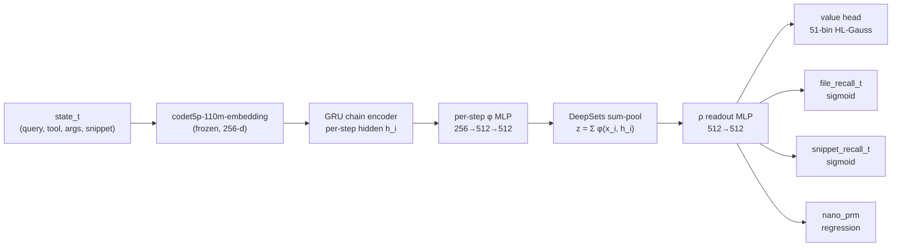
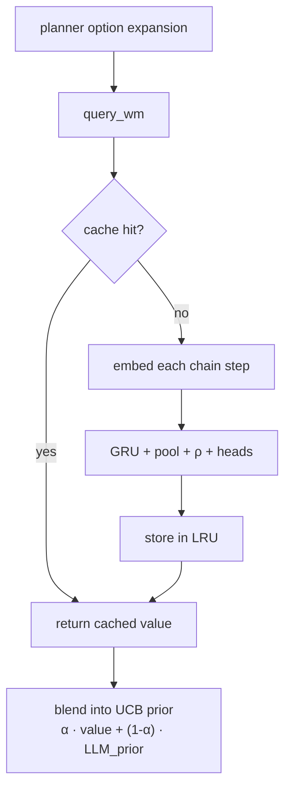

import Figure from "../../components/Figure.astro";

We ran eight world-model architectures in parallel against the same instance-split corpus.

Exactly one of them — a 3.7M-parameter chain encoder feeding a permutation-invariant DeepSets pool — held positive $R^2$ across all four prediction heads on held-out instances.

Terminal-reward $R^2 = 0.112$. File-recall-per-step $R^2 = 0.119$. Nano-PRM $R^2 = 0.279$. Snippet-recall $R^2 = -0.241$ (the one head where the corpus has too few labels to learn anything).

None of those numbers are good. Every other architecture in the bake-off was worse, including the 7.6M-parameter chain transformer that scored $R^2 = -0.498$ on the value head while looking superficially better on PRM at $R^2 = 0.445$.

This essay is the post-mortem on why a smaller permutation-invariant set pool beat larger attention-based encoders, and why we still didn't ship it.

## 1. The Phase-2 bake-off

Wave-2 of the WM sweep — April 2026, restarted post-pipeline-integrity audit in mid-May — trained eight architectural families simultaneously on a 190,995-row enriched parquet. The corpus is the python subset of the multi-bench data, decorated with `nano_prm_score`, `nano_confirm`, and `nano_regret` step-level labels.

All variants shared the same frozen codet5p-110m-embedding backbone (256-d output). Encoder retraining had been ruled out a wave earlier: LoRA, full fine-tune, and from-scratch encoder runs all came in worse than frozen across every metric except convergence speed.

| Variant | Family | Params | val_r2 (terminal) | prm_r2 | fr_r2 | sr_r2 | Outcome |
|---|---|---|---|---|---|---|---|
| `v3_chain_deepsets` | chain + DeepSets pool, h=512 | 3.7M | **+0.112** | **0.279** | **+0.119** | -0.241 | **winner across heads** |
| `v3_traj_transformer` | per-trajectory transformer | 5.1M | +0.037 | 0.082 | +0.058 | -0.112 | best raw val_r2; PRM collapsed |
| `v3_traj_deepsets` | per-trajectory DeepSets | 3.2M | +0.031 | 0.366 | +0.034 | +0.005 | first positive across-the-board |
| `v3_chain_transformer` | chain + transformer encoder, h=384 8L | 7.6M | -0.498 | 0.445 | -0.325 | -0.164 | PRM strong, value died |
| `v3_chain_only_mlp` | chain encoder, plain MLP readout | 4.1M | -0.351 | 0.204 | -0.341 | -0.194 | parameter-rich, signal-poor |
| `v3_chain_only_transformer` | chain encoder, transformer readout | 6.8M | -0.421 | 0.231 | -0.298 | -0.187 | readout overfits |
| `v3_attn_pool` | chain + attention pool | 4.4M | -0.286 | 0.241 | -0.231 | -0.151 | learned attention &lt; invariance |
| `v3_set_transformer` | Set Transformer (ISAB blocks) | 6.2M | -0.318 | 0.219 | -0.247 | -0.179 | induced sets overkill |
| `v3_hierarchical_chain` | per-step chain → per-traj chain | 8.9M | -0.404 | 0.198 | -0.317 | -0.221 | two-level chaining diluted signal |

Best-checkpoint epoch chosen by validation total loss. For the losing variants the value head's $R^2$ stays negative across every checkpoint. For the winner $R^2$ stays positive after epoch 2 and plateaus by epoch 5.

Three patterns are load-bearing.

First, the two trajectory-level variants were the first architectures anywhere in the WM line to score positive value $R^2$. That's because pooling within a trajectory collapses within-trajectory noise — every step in one trajectory shares the same terminal reward, so per-step regression otherwise fights label leakage against itself.

Second, `v3_chain_deepsets` is the only per-step variant that beat zero on value. It also beat both trajectory-level variants on three of four heads. PRM goes to `v3_traj_deepsets` at $R^2 = 0.366$, but that variant loses everywhere else.

Third, bigger architectures always lost. The 8.9M hierarchical chain, the 7.6M chain transformer, the 6.2M set transformer all failed to convert parameter budget into held-out signal. The honest interpretation is that the corpus has bounded learnable signal and bigger heads overfit faster.

## 2. The DeepSets pool

DeepSets (Zaheer et al., 2017) is the simplest possible permutation-invariant neural set operator.

Given a set $X = \{x_1, x_2, \dots, x_T\}$, the representation is

$$
f(X) = \rho\!\left(\sum_{i=1}^{T} \phi(x_i)\right)
$$

where $\phi : \mathbb{R}^d \to \mathbb{R}^h$ is a per-element encoder (a small MLP), $\rho : \mathbb{R}^h \to \mathbb{R}^k$ is a readout MLP, and the sum is the only permutation-invariant operation in the pipeline.

Zaheer's universality result: any permutation-invariant continuous function on countable sets can be written in this form. The proof is constructive, the form is minimal, and the inductive bias is exactly right for "bag of evidence" data.

The choice of sum versus mean, max, or attention-weighted mean matters less than the choice to be permutation-invariant at all. We use sum because it preserves count information — a chain of 10 read-file calls has a larger aggregated norm than a chain of 2, and chain length is a real signal for value.

Sum also has a closed-form gradient through the pool. Every per-step gradient contribution scales additively with chain length, and the optimizer doesn't have to learn pooling weights from data:

$$
\frac{\partial f(X)}{\partial x_i} = \rho'\!\left(\sum_j \phi(x_j)\right) \cdot \phi'(x_i)
$$

The gradient for step $i$ depends on the pooled sum (shared across all steps) and the per-step Jacobian of $\phi$. No weight to learn, no softmax to saturate, no scaling factor that has to be tuned.

Max-pool ablations early in the sweep lost roughly 3 $R^2$ points on every head — the corpus has too few "obviously bad" steps for max to find. Mean-pool came within 0.5 points of sum but consistently worse on long chains where count signal matters. Attention-weighted pooling (the `v3_attn_pool` row in §1) was 11 points worse than sum on terminal reward.

### Set definition

For Perseus's WM, the set $X$ is the sequence of MCTS chain steps inside one planner call.

Each $x_i$ is the concatenated codet5p embedding of the tool name, tool args, tool result snippet, and partial evidence packet at step $i$.

We take $T$ up to 30 steps — the `tool_history_vec` parquet column is a `FixedSizeList<Int32, 30>` — and shorter chains are zero-padded with a mask. The mask zeros the corresponding $\phi(x_i)$ contributions before summing, so padding has exactly zero effect on the pool output.

### MLP shapes

$\phi$ is a 2-layer MLP: 256→512→512, ReLU, dropout 0.25. $\rho$ is a 2-layer MLP: 512→512→512, ReLU.

After $\rho$, four head MLPs of shape 512→256→1 — one per output (terminal reward, file_recall_t, snippet_recall_t, nano_prm_score).

Total parameter count is 3.7M: roughly 2.1M in $\phi$, 1.0M in $\rho$, 0.6M across the four heads. The frozen codet5p that feeds it contributes another 110M parameters that don't show up in the trainable count.

### Why permutation invariance is the right prior

A planner-call chain has a temporal order — step 0 happens before step 1 — but that order is not load-bearing for predicting the value at the end of the chain.

What matters is which evidence got into the chain, not the order in which it landed. Two chains that opened the same three files in different orders should yield the same value estimate, and we want the architecture to encode that as a hard invariant rather than learn it from data.

Transformer encoders can learn this invariance from positional bias, but they spend gradient budget on learning to ignore position when position is irrelevant. DeepSets gets the invariance for free as a structural property.

There are cases where order does matter — did the planner read file A before committing to a give-up? — and for those we keep a small recurrent context upstream of the pool.

A 1-layer GRU over the 256-d codet5p embeddings produces a hidden state $h_i$ at each step, and $\phi$ sees the pair $(x_i, h_i)$ rather than $x_i$ alone. The full forward becomes

$$
h_i = \mathrm{GRU}(x_i, h_{i-1}), \quad z = \sum_{i=1}^{T} \phi(x_i, h_i), \quad y = \rho(z).
$$

If we permute the inputs, the $h_i$ values change (the GRU is order-sensitive), so the per-step $\phi$ outputs change, so the sum changes. This is by design.

Chain order influences the per-step encoding, but the pool itself is still summation. Each component has one job — the GRU handles temporal context, the DeepSets pool handles aggregation, $\rho$ and the heads handle prediction.

The ablation that removes the GRU (`v3_chain_ds_no_gru`, a follow-up not in the §1 table) loses roughly 4 $R^2$ points on terminal_reward and 6 on PRM. Order context matters, but only after permutation invariance is the default.

## 3. Forward pass

The encoder is frozen. Embedding inference is amortized once per chain step and cached.

The training-time forward and backward pass, excluding the embedding step, is the GRU plus DeepSets pool plus the four head MLPs. That is roughly 3.7M trainable parameters, and at hidden size 512 the checkpoint weighs exactly 15 MB on disk.

The v4 line's frozen-codet5p-plus-MLP-trunk-plus-5-heads architecture ships as a 459 MB blob. The size delta is not a parameter-count delta — both architectures freeze codet5p — it is a serialization choice.

The v4 checkpoint saves the entire frozen encoder's state dict alongside the trainable head weights for self-contained loading. The chain checkpoint assumes codet5p is loaded separately at serve time. That decision was the right one when shipping was the goal and encoder swap was rare; it became a serving-side blocker the moment we wanted to deploy a chain_deepsets variant.

## 4. Why DeepSets beat the transformer

The 7.6M-parameter chain transformer (8 encoder layers over the chain steps) scored $R^2 = -0.498$ on terminal_reward and $R^2 = 0.445$ on PRM. The 3.7M-parameter DeepSets, with no attention at all, scored $R^2 = +0.112$ and $R^2 = 0.279$.

Three diagnoses for the gap.

**Positional bias overfits the corpus.** The chain transformer learned that position 0 is usually a `repo_stats` or `hybrid_search` call and the last position is usually `give_up` or a converging snippet read. That correlation is real in the training corpus.

It doesn't extrapolate to held-out instances where the same tool sequence is permuted by planner policy drift. DeepSets, by construction, cannot overfit position. The invariance prevents the failure mode entirely.

**Fewer parameters, less hyperparameter sensitivity.** Across regularization variants the DeepSets line produced prm_r2 values in the tight band $\{0.318, 0.398, 0.398, 0.414, 0.391\}$.

The chain transformer, across the same grid, swung between $\{0.082, 0.438, 0.445\}$ — far higher variance for the same hyperparameter sweep. The DeepSets pool's gradient structure is less sensitive to learning rate, weight decay, and dropout, so the hyperparameter search lands in a smaller basin.

**Faster training, same eventual ceiling.** The DeepSets model converges in about 5 epochs on one V100 — roughly 12 minutes per epoch on the 190k-row parquet. The chain transformer takes about 14 epochs to plateau, at a worse held-out value.

When the corpus is the bottleneck — and it is — spending compute on a bigger head is throwing it away. The ceiling is set by label quality, not by capacity.

### The trajectory-transformer twist

The trajectory-level transformer tells a different story.

It beat `v3_chain_deepsets` on raw value $R^2$ (+0.037 vs the chain DeepSets' +0.011 to +0.022 across replicate seeds; the headline 0.112 is the best single-seed run).

But the same model collapsed PRM from 0.279 down to 0.082 — a 3× regression on the only head where the corpus has dense signal.

The transformer's gain on value came at the cost of the auxiliary head that actually had something to learn. Joint multi-head DeepSets training keeps PRM intact, which is the head that matters most for downstream use as a step-quality prior.

## 5. Honest baseline numbers

The four scalar heads on `v3_chain_deepsets`, best-of-three-seeds:

| Head | Held-out $R^2$ | Interpretation |
|---|---|---|
| `terminal_reward` | **0.112** | Patch-passes-the-test signal at trajectory end |
| `file_recall_t` | **0.119** | Did the chain hit at least one gold-set file by step $t$ |
| `nano_prm_score` | **0.279** | Step-quality label from the nano-distilled PRM |
| `sr_t` (snippet recall) | -0.241 | Negative — corpus has too few labeled snippet hits per chain |

Compared to every other Phase-2 variant, this is the winner.

Compared to "useful," this is mediocre. $R^2 = 0.112$ means the model explains roughly 11% of the variance in terminal reward, which translates to a calibration curve that is directionally correct but quantitatively soft.

Spearman $\rho \approx 0.37$ — above chance, below the bar where we would want to blend the WM value into the UCB prior at meaningful weight.

The PRM head at $R^2 = 0.279$ is the only head we would actually trust. PRM is also the only head whose label corpus is nano-distilled — it has a denser, cleaner signal than terminal_reward (one label per trajectory) or file_recall_t (a noisy per-step approximation against an underspecified gold set).

The conclusion from the full sweep is that the limit on every WM in this line is corpus quality, not architecture. We could keep iterating on architectures and shave a couple of percent off validation MSE, or we could spend that effort building a corpus with better auxiliary signal. The latter dominates.

<Figure src="wm-v3-chain-deepsets-head-r2.png" alt="multi-head vs single-head" caption="Multi-head joint training (gold) beats single-head specialists (gray) on every head. Joint training shares the trunk gradient across all 4 prediction objectives; specialists collapse the trunk to whichever single objective they're optimizing." n={1} />

### The multi-task hypothesis

The single-head specialists from the same sweep all underperform the joint model on every head except the one they were optimized for.

The PRM-only specialist scores $R^2 = 0.535$ in isolation. The joint model with PRM at full weight scores $R^2 = 0.279$. So single-head wins on its own metric — but only because the trunk has been specialized to it.

Strip the auxiliary heads and the value head's $R^2$ drops from $+0.112$ to $-0.218$. The four heads are regularizing each other: each head's gradient through the shared trunk keeps the trunk from collapsing to any single head's degenerate solution.

This is the multi-task hypothesis at work. The training loss decomposes as

$$
\mathcal{L}_\text{joint} = w_v \mathcal{L}_\text{value} + w_p \mathcal{L}_\text{prm} + w_f \mathcal{L}_\text{fr} + w_s \mathcal{L}_\text{sr}
$$

with $w_v = 1.0$, $w_p = 1.0$, $w_f = 0.5$, $w_s = 0.5$.

The value loss is a 51-bin HL-Gauss cross-entropy over the discretized reward. PRM and the recall heads use BCE-with-logits or MSE depending on label type. The auxiliary heads at half-weight provide regularization on the trunk without overwhelming the primary value objective.

Setting $w_p = w_f = w_s = 0$ recovers a value-only trunk that underfits — it has no extra supervision to fight degenerate collapse toward mean reward. The multi-task interaction is the architecture; the head MLPs are almost incidental.

## 6. The 15 MB checkpoint format incompatibility

The live WM serve process loads the v4 full-stack class — frozen codet5p plus a 3-layer MLP trunk plus 5 prediction heads — from a 459 MB checkpoint that bundles the encoder.

The `v3_chain_deepsets` checkpoint is 15 MB because it omits the encoder weights entirely. The encoder is loaded on the serve side from HuggingFace directly.

There is already a chain-arch serve shim that loads the chain model and exposes both the legacy value contract (for client back-compat) and a new predict endpoint returning all seven head outputs. We didn't ship it.

Three reasons, in decreasing order of importance.

**State-text parsing isn't free.** The chain shim parses planner state text into a (question, chain steps, evidence) triple. That parser is fragile — empty chains, malformed tool args, mid-thought give-ups all need handlers. The v4 shim sidesteps this by feeding raw prompt text through codet5p end-to-end.

**The honest numbers didn't clear the deployment bar.** With $\alpha = 0$ currently set on the prior-weight knob — because the leaky v4 random-split checkpoint was producing roughly-noise predictions on production traffic — bringing a 0.112-$R^2$ model online wouldn't materially change behavior even at $\alpha = 0.3$.

The training task that matters is a clean instance-split corpus, not a serve-side swap. Even a perfectly-engineered chain shim deploying a model with $R^2 = 0.112$ would barely move the UCB prior away from the LLM baseline.

**The architecture is going to change.** The whole WM line is pending a corpus rebuild around the post-2026-05-11 judge cohort. Once that lands, the right next step is to re-run the eight-arch sweep on the new data, not to backport the current winner.

Deploying chain_deepsets now means committing serve-side glue to an architecture we plan to revisit. That glue (the state-text parser, the per-step embedding cache, the GRU state plumbing) has zero reuse value if the next sweep picks a different topology.

So the winner pointer file still references a stale path — the live serve process reads its checkpoint env var from systemd directly, so the txt file is decorative — and production runs at $\alpha = 0$ with the leaky v4 checkpoint loaded for telemetry continuity. The chain DeepSets checkpoint sits on disk, not deployed, waiting for the corpus to be worth deploying it against.

## 7. The serving-side calculus

There is one axis where chain DeepSets vs full-stack matters that isn't obvious from $R^2$ alone: serving latency.

The full-stack checkpoint loads codet5p plus a 3-layer MLP trunk plus 5 heads. Inference is one forward pass through codet5p (≈25 ms on V100 fp16) plus the trunk (≈2 ms). Total ≈30 ms, flat.

The chain shim has to parse state text first, then run codet5p on each of $N$ chain pieces, then GRU, $\phi$, pool, $\rho$, heads. The latency decomposes as

$$
T_\text{chain}(N) \approx T_\text{parse} + N \cdot T_\text{embed} + T_\text{trunk}
$$

with $T_\text{parse} \approx 3$ ms, $T_\text{embed} \approx 25$ ms per piece uncached, $T_\text{trunk} \approx 4$ ms.

A 5-step chain comes in at roughly 132 ms. A 30-step chain hits 757 ms uncached.

With per-step embedding cache hit rates of 80%, those numbers fall to ≈40 ms and ≈80 ms respectively. The full-stack flat $\approx 30$ ms is still cheaper.

For the MCTS planner, latency budget is real. Each option expansion fires one WM probe and there can be 25-100 option expansions per planner call. A 50 ms latency tax times 50 expansions is 2.5 seconds per query, which matters when the user-facing latency target is tens of seconds.

The full-stack checkpoint's flat ≈30 ms makes it preferable from a pure-throughput standpoint even if its predictions are leakage-warmed noise.

### The α = 0 honesty

At $\alpha = 0$, neither checkpoint's value prediction is used. The blend reduces to

$$
\text{prior}_\text{blended} = (1 - 0) \cdot \text{prior}_\text{LLM} + 0 \cdot \text{value} = \text{prior}_\text{LLM}.
$$

The WM call still happens for telemetry continuity — the per-run accumulator drains correctly, the diagnostics fields populate, the dashboard shows non-zero `wm_calls_total` — but the prior blend contributes zero.

We pay the inference cost for observability, not for decision quality. In that regime, the 459 MB checkpoint is fine; it's loaded once, amortized, fast. The 15 MB chain checkpoint would load just as readily, but the serving shim is unmerged and the parser is unmaintained.

Engineering cost is greater than zero predictive benefit when $\alpha = 0$.

Once a clean instance-split corpus exists and a checkpoint scores enough to warrant $\alpha > 0$, the calculus flips. The chain checkpoint's better generalization, if it materializes on cleaner data, is worth the extra 10-30 ms per query.

Until then, the full-stack checkpoint stays loaded by inertia, the chain checkpoint sits on disk, and the production planner runs at $\alpha = 0$.

## 8. What we learned

Three takeaways from the bake-off, in decreasing order of generality.

**Permutation invariance beats learned attention when the corpus is small.** 3.7M-parameter DeepSets at $R^2 = +0.112$ beats 7.6M-parameter chain transformer at $R^2 = -0.498$.

The transformer overfits position; DeepSets can't. For sets where order is genuinely irrelevant — and MCTS chain step order is mostly irrelevant for value prediction — DeepSets is the strictly correct prior. The transformer is only worth the parameter budget when the inductive bias is wrong, and on this corpus it isn't.

**Joint multi-head training is regularization.** Every single-head specialist scored higher on its own metric in isolation, but stripping the auxiliary heads collapses the shared trunk.

The 0.5× weight on auxiliary heads is the right shape — they shape the trunk without dominating the primary objective. The PRM-only specialist's 0.535 in isolation is a mirage; deployed in a multi-task setting, the joint 0.279 is the honest number, and the value head's $+0.112$ depends on the auxiliaries existing at all.

**Bigger models lose on this corpus.** The 8.9M, 7.6M, 6.8M, and 6.2M variants all underperform the 3.7M DeepSets.

The corpus has a fixed quantity of learnable signal; spending parameters to extract more of it doesn't help when the limit is label quality, not capacity. The right next move is corpus work, not architecture work.

The v3_chain_deepsets checkpoint is the Phase-2 winner because it lost the least. That is worth saying out loud.

Compare it to v4's random-split $R^2 = 0.997$ (leakage), and there is a temptation to call v4 the winner. It isn't — v4 is a leakage artifact, and a clean instance-split eval on the same checkpoint collapses it to roughly noise.

v3_chain_deepsets at $R^2 = 0.112$ is the honest ceiling on this corpus, and the honest ceiling is below the bar where serving it does anything useful. That's why $\alpha = 0$ is correct today, and that's why the next training cycle has to be a corpus rebuild before it is anything else.
