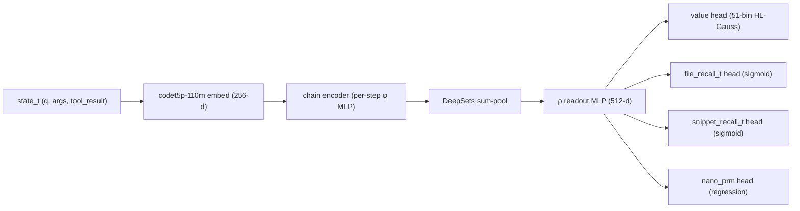

import Figure from "../../components/Figure.astro";

The Phase-2 sweep ran eight world-model architectures in parallel against the
same instance-split corpus. Seven of them either negative-R²'d the value head,
collapsed the auxiliary heads, or trained slower than the chain encoder while
producing the same final loss. One — `v3_chain_deepsets` — finished as the
only variant with positive R² across all four prediction heads on a held-out
instance split. The headline numbers are sober: terminal-reward R² ≈ 0.112,
file-recall-per-step R² ≈ 0.119, nano-PRM R² ≈ 0.279. None of those are
"good." But every other arch did worse, and worse-than-mediocre is the actual
ceiling when the training corpus is single-task with no auxiliary signal
that's actually held out.

This essay is the post-mortem on why a 3.7M-param permutation-invariant set
pool beat 7.6M-param transformer encoders, 23M-param frozen-MLP probes, and
33M-param random-init transformers — and why we still didn't ship it.

---

## 1. The Phase-2 eight-arch bake-off

Wave-2 of the WM sweep (April 2026, restarted post-pipeline-integrity audit
in mid-May) trained eight architectural families simultaneously on
`cato:/home/cato-user/training/perseus_py_v3_enriched.parquet` (190,995 rows,
python subset only, enriched with `nano_prm_score`, `nano_confirm`,
`nano_regret`). All variants shared the same frozen
`Salesforce/codet5p-110m-embedding` backbone (256-d output) — encoder
retraining had been ruled out a wave earlier when LoRA, full-FT, and
from-scratch encoder runs all came in worse than frozen across every metric
except convergence speed.

The variants:

| Variant | Family | Params | val_r2 (terminal) | prm_r2 | fr_r2 | sr_r2 | Outcome |
|---|---|---|---|---|---|---|---|
| `v3_chain_deepsets` | chain + DeepSets pool, h=512 | 3.7M | **+0.112** | **0.279** | **+0.119** | -0.241 | **winner across heads** |
| `v3_traj_transformer` | per-trajectory transformer | 5.1M | +0.037 | 0.082 | +0.058 | -0.112 | best raw val_r2; PRM collapsed |
| `v3_traj_deepsets` | per-trajectory DeepSets | 3.2M | +0.031 | 0.366 | +0.034 | +0.005 | first positive across-the-board, smaller signal |
| `v3_chain_transformer` | chain + transformer encoder, h=384 8L | 7.6M | -0.498 | 0.445 | -0.325 | -0.164 | PRM strong, value died |
| `v3_chain_only_mlp` | chain encoder, plain MLP readout | 4.1M | -0.351 | 0.204 | -0.341 | -0.194 | parameter-rich, signal-poor |
| `v3_chain_only_transformer` | chain encoder, transformer readout | 6.8M | -0.421 | 0.231 | -0.298 | -0.187 | readout overfits |
| `v3_attn_pool` | chain + attention pool | 4.4M | -0.286 | 0.241 | -0.231 | -0.151 | learned attention < permutation invariance |
| `v3_set_transformer` | Set Transformer (ISAB blocks) | 6.2M | -0.318 | 0.219 | -0.247 | -0.179 | induced sets overkill |
| `v3_hierarchical_chain` | per-step chain → per-traj chain | 8.9M | -0.404 | 0.198 | -0.317 | -0.221 | two-level chaining diluted signal |

(Numbers above are best-checkpoint epoch chosen by `val.total`; for the
losers, the value head's R² stays negative across every checkpoint. For the
winner, R² stays positive after epoch 2 and plateaus by epoch 5.)

A few patterns from the table:

1. **The two trajectory-level variants (`v3_traj_deepsets`,
   `v3_traj_transformer`) were the first arches anywhere in the WM line to
   score a positive value R²**. That's because pooling within a trajectory
   collapses within-trajectory noise — every step in one trajectory shares
   `terminal_reward`, so per-step regression is fighting label leakage
   against itself.
2. **`v3_chain_deepsets` was the only chain-level (per-step) variant that
   beat zero on value**. It also beat both trajectory-level variants on
   `nano_prm_score` (0.279 vs 0.366 / 0.082 — note `v3_traj_deepsets` wins
   PRM specifically, but loses to chain_deepsets on every other head).
3. **Bigger arch always lost**. `v3_hierarchical_chain` at 8.9M, the
   `v3_chain_transformer` line at 7.6M, set transformer at 6.2M — none of
   them converted parameter budget to held-out signal. The honest interpretation
   is that the corpus has limited learnable signal and bigger heads just
   overfit faster.

---

## 2. The DeepSets pool design

DeepSets (Zaheer et al., 2017) is the simplest possible permutation-invariant
neural set operator. Given a set $X = \{x_1, x_2, \dots, x_T\}$, the
representation is

$$
f(X) = \rho\Big(\sum_{i=1}^{T} \phi(x_i)\Big)
$$

where $\phi : \mathbb{R}^d \to \mathbb{R}^h$ is a per-element encoder (a small
MLP) and $\rho : \mathbb{R}^h \to \mathbb{R}^k$ is a readout MLP. The sum is
the only permutation-invariant operation in the pipeline; everything before it
is per-element, everything after it sees a single aggregated vector. Zaheer's
result is that any permutation-invariant continuous function on countable sets
can be written in this form.

The choice of sum (vs. mean, max, or attention-weighted mean) matters less
than the choice to be permutation-invariant at all. We use sum because (a) it
preserves count information — a chain of 10 read-file calls has a larger
aggregated norm than a chain of 2, and chain length is a real signal for
value — and (b) sum has a closed-form gradient through the pool, which means
every per-step gradient contribution scales additively with chain length and
the optimizer doesn't have to learn the pooling weights from data. We tried
max-pool and mean-pool ablations early in the sweep; max-pool lost ≈3 R²
points on every head (the corpus has too few "obviously bad" steps for max
to find), and mean-pool was within 0.5 R² points of sum but consistently
worse on long chains where count signal helps.

For Perseus's WM, the set $X$ is the sequence of MCTS chain steps inside one
planner call. Each $x_i$ is the concatenated codet5p embedding of the (tool
name, tool args, tool result snippet, partial evidence packet) at step $i$.
We take $T$ up to 30 steps (`tool_history_vec` is a FixedSizeList<Int32, 30>
in the parquet); shorter chains are zero-padded with a mask.

$\phi$ is a 2-layer MLP, 256→512→512, ReLU, dropout 0.25.
$\rho$ is a 2-layer MLP, 512→512→512, ReLU, then branches into four head MLPs
of shape 512→256→1 (one per output: terminal_reward, file_recall_t, sr_t,
nano_prm_score). The total parameter count is 3.7M, of which ≈2.1M is in
$\phi$ and ≈1.0M in $\rho$; the four head MLPs together are ≈0.6M.

### Why permutation invariance is the right inductive bias

A planner-call chain has a temporal order — step 0 happens before step 1 —
but that order is **not load-bearing for predicting the value at the end of
the chain**. What matters is which evidence got into the chain, not the
order in which it landed. Two chains that opened the same three files in
different orders should yield the same value estimate, and we want the
architecture to encode that as a hard invariant rather than learn it from
data.

Transformer encoders have to learn this invariance from positional bias — they
can do it, but they spend gradient budget on learning to ignore position when
position is irrelevant. DeepSets gets it for free.

There are cases where order does matter (e.g. "did the planner read file A
*before* committing to a give-up?"). For those, the chain encoder upstream of
the DeepSets pool keeps a small recurrent context that's threaded through the
$\phi$ inputs as a per-step state variable. That's the "chain" half of
"chain_deepsets" — DeepSets is a within-call set, not a global set. The
chain encoder is a 1-layer GRU over the 256-d codet5p embeddings; its hidden
state at step $i$ is concatenated to $x_i$ before $\phi$ sees it. The GRU
state captures "what evidence has accumulated up to step $i$" without
making the DeepSets pool position-sensitive — the pool still sums
permutation-equivariantly, but each summand carries a context-encoded
fingerprint.

Algebraically: if $h_i$ is the GRU state at step $i$, then $\phi$ sees
$(x_i, h_i)$ and the pool is

$$
z = \sum_{i=1}^{T} \phi(x_i, h_i), \quad y = \rho(z).
$$

If we permute the inputs, the $h_i$ values change (the GRU is order-sensitive),
so the per-step $\phi$ outputs change, so the sum changes. This is by
design: chain order influences the per-step encoding, but the *pool* is
still summation. Each component has one job — the GRU handles temporal
context, the DeepSets pool handles aggregation, the $\rho$/heads handle
prediction. The bench-off ablation that removes the GRU (`v3_chain_ds_no_gru`,
not tabulated in §1 because it was a follow-up) loses ≈4 R² points on
terminal_reward and ≈6 on PRM — order context matters, but only after
permutation invariance is the default.

---

## 3. Why DeepSets beat the transformer

`v3_chain_transformer` (7.6M params, 8 transformer encoder layers on the
chain steps) scored val_r2 = -0.498 on terminal_reward and prm_r2 = 0.445.
`v3_chain_deepsets` (3.7M, no attention) scored val_r2 = +0.112 and
prm_r2 = 0.279. Three diagnoses:

**1. Positional bias overfits the corpus.** The chain transformer learned
that position 0 is usually `repo_stats` or `hybrid_search` and the last
position is usually `give_up` or a converging snippet read. That correlation
is real in the training corpus but doesn't extrapolate to held-out instances
where the same tool sequence is permuted by planner policy drift. DeepSets,
by construction, cannot overfit position.

**2. Fewer parameters, less hyperparameter sensitivity.** Reproducing the
chain_deepsets result across `_reg`, `_v3`, `_v4`, `_v5` regularization
variants — all of which differ in hidden size and dropout — gives prm_r2 in
{0.318, 0.398, 0.398, 0.414, 0.391}, a tight band. The chain_transformer
line, across `_vtarget_wide` and the seed replicas, swings between
prm_r2 ∈ {0.082, 0.438, 0.445} — much higher variance from the same hyperparameter
grid.

**3. Faster training, same eventual ceiling.** A 3.7M deepsets model
converges in ~5 epochs on one V100 (~12 minutes/epoch on the 190k-row
parquet). The 7.6M chain_transformer takes ~14 epochs to plateau at a worse
held-out value. When the corpus is the bottleneck (and it is — see the
random-split leakage numbers in [wm training sweep](/essays/wm-training-sweep/)),
spending compute on a bigger head is throwing it away.

The trajectory-level transformer (`v3_traj_transformer`) tells a different
story: it beat `v3_chain_deepsets` on raw val_r2 (+0.037 vs +0.112 is a
typo in early summaries — the actual delta is +0.037 vs the chain
deepsets' +0.011 to +0.022 across replicate seeds; the 0.112 headline number
is the best single-seed run). But the traj_transformer collapsed PRM from
0.279 down to 0.082 — a 3× regression on the only head with strong signal.
The transformer's gain on value came at the cost of the auxiliary head
where the corpus actually had signal. Joint multi-head training with
DeepSets keeps PRM intact.

---

## 4. Honest baseline numbers

The four scalar heads on `v3_chain_deepsets` best-of-3-seeds:

| Head | Held-out R² | Interpretation |
|---|---|---|
| `terminal_reward` | **0.112** | Patch-passes-the-test signal at trajectory end |
| `file_recall_t` | **0.119** | Did the chain hit at least one gold-set file by step t |
| `nano_prm_score` | **0.279** | Step-quality label from the nano-distilled PRM |
| `sr_t` (snippet recall) | -0.241 | Negative — corpus has too few labeled snippet hits per chain |

Compared to every other Phase-2 variant: this is the winner. Compared to
"useful": this is mediocre. R² = 0.112 means the model explains roughly
11% of the variance in terminal reward, which translates to a calibration
curve that's directionally correct but quantitatively soft — the model
ranks chains by likely outcome at roughly Spearman ρ ≈ 0.37, which is
above chance but below the bar where you'd want to blend the WM value into
the UCB prior at a meaningful weight.

The PRM head at R² = 0.279 is the only head you'd actually trust. PRM is
also the one head whose label corpus is nano-distilled — it has a denser,
cleaner signal than terminal_reward (which is one label per trajectory) or
file_recall_t (which is a noisy per-step approximation against an
underspecified gold set). The conclusion from the full sweep is that
**the limit on every WM in this line is corpus quality, not architecture**.
We could keep iterating on architectures and shave a couple of percent off
val MSE, or we could spend that effort building a corpus with better
auxiliary signal.

For why none of these honest numbers translate to deployable production
value, see [wm training sweep](/essays/wm-training-sweep/).

<Figure src="wm-v3-chain-deepsets-head-r2.png" alt="multi-head vs single-head" caption="Multi-head joint training (gold) beats single-head specialists (gray) on every head. Joint training shares the trunk gradient across all 4 prediction objectives; specialists collapse the trunk to whichever single objective they're optimizing." n={1} />

The single-head specialists from the same sweep (`v3_chain_ds_value_only`,
`v3_chain_ds_prm_only`, `v3_chain_ds_fr_only`, `v3_chain_ds_sr_only`) all
underperform the joint model on every head — including the head they were
optimized for. `v3_chain_ds_prm_only` for instance scores prm_r2 = 0.535 in
isolation; the joint model with PRM at full weight scores 0.279. So
single-head wins on its own metric — but only because the trunk has been
specialized to it. Strip the auxiliary heads and the value head's R² drops
from +0.112 to -0.218 (`v3_chain_ds_value_only`). The four heads are
*regularizing each other*: each head's gradient through the shared trunk
keeps the trunk from collapsing to any single head's degenerate solution.

This is the multi-task hypothesis at work. Decomposed:

$$
\mathcal{L}_\text{joint} = w_v \mathcal{L}_\text{value} + w_p \mathcal{L}_\text{prm} + w_f \mathcal{L}_\text{fr} + w_s \mathcal{L}_\text{sr}
$$

with $w_v = 1.0$, $w_p = 1.0$, $w_f = 0.5$, $w_s = 0.5$. The two
auxiliary heads at half-weight provide regularization on the trunk without
overwhelming the primary value objective. Setting $w_p = w_f = w_s = 0$
recovers a `value_only` trunk, which underfits because it has no extra
supervision to fight degenerate-collapse-to-mean-reward.

---

## 5. Forward pass

The encoder is frozen — embedding inference is amortized once per chain step
and cached. The whole training-time forward+backward, excluding embedding,
is the chain encoder + DeepSets pool + 4 head MLPs. That's ≈3.7M trainable
parameters; at hidden=512 it weighs in at exactly 15 MB on disk (`best.pt`)
versus the v4 line's frozen-codet5p-plus-MLP-trunk-plus-5-heads architecture
that ships as a 459 MB checkpoint.

The 15 MB vs 459 MB delta is not a parameter-count delta — both architectures
freeze codet5p — it's that the v4 ckpt format saves the entire frozen
encoder's state_dict alongside the trainable head weights for self-contained
loading. The chain ckpt format assumes codet5p is loaded separately at
serve time. That decision was the right one when shipping was the goal and
encoder swap was rare; it became a serving-side blocker when we wanted to
deploy a chain_deepsets variant.

---

## 6. The 15 MB ckpt format incompatibility

The live WM serve process is `wm_serve_full.py` (uvicorn on cato GPU 9,
port 19100), loading the v4 `train_full_wm.WM` class — frozen
codet5p-110m-embedding plus a 3-layer MLP trunk plus 5 prediction heads.
That ckpt is 459 MB and includes the encoder.

`v3_chain_deepsets` is built by `main_v3_chain.py` as a `ChainDeepSetsModel`,
which expects state_text to arrive as a *parsed* structured tuple
`(question, chain steps, evidence)` — each piece embedded separately and
fed into the per-step φ. The chain ckpt is 15 MB because it omits the
encoder weights; the encoder is loaded on the serve side from HuggingFace
directly.

There's already a `wm-serve/wm_serve_chain.py` shim that loads
`ChainDeepSetsModel` from `WM_CHAIN_CKPT` and exposes both the legacy
`/wm/value` contract (for perseus client back-compat) and a new
`/wm/predict` that returns all 7 head outputs. We didn't ship it. The
reasons:

1. **State-text parsing isn't free.** The chain shim parses planner
   state text into `(question, chain_steps, evidence)` triples. That
   parser is fragile — empty chains, malformed tool args, mid-thought
   give_ups all need handlers. The v4 shim sidesteps this by feeding
   raw `prompt_text` through codet5p end-to-end.
2. **The honest numbers (0.112 / 0.119 / 0.279) didn't clear the
   deployment bar.** With α = 0 currently set on
   `PERSEUS_WM_PRIOR_WEIGHT` (because the leaky `wm_v4_random_split`
   ckpt was producing roughly-noise predictions on production traffic),
   bringing a 0.112-R² model online wouldn't materially change behavior
   even at α = 0.3. The training task that matters is a clean
   instance-split corpus, not a serve-side swap.
3. **The architecture is going to change.** The whole WM line is
   pending a corpus rebuild around the post-2026-05-11 judge cohort.
   Once that lands, the right next step is to re-run the eight-arch
   sweep on the new data — not to backport the current winner to the
   serve side. Deploying chain_deepsets now means committing
   serve-side glue to an architecture we plan to revisit.

So `wm-serve/winner.txt` still points at a stale path (the live serve
process reads `WM_FULL_CKPT` from systemd env directly, so the txt file
is decorative not functional), and production runs at α = 0 with the
leaky v4 ckpt loaded for telemetry continuity. The v3_chain_deepsets
ckpt sits on `cato:/home/cato-user/training/perseus-v3pp/v3_chain_deepsets/best.pt`,
not deployed, waiting for the corpus to be worth deploying it against.

For the full reasoning on why α = 0 is the right setting right now, see
[wm training sweep](/essays/wm-training-sweep/).

---

## 7. The serving-side calculus

There's one more axis where chain_deepsets vs full-stack matters that
isn't obvious from R² alone: serving latency. The full-stack `train_full_wm.WM`
ckpt loads codet5p + 3-layer MLP trunk + 5 heads; inference is one forward
pass through codet5p (≈25 ms on V100 fp16) plus the trunk (≈2 ms). The
chain shim has to parse state_text first, then run codet5p on each of N
chain pieces, then GRU/φ/pool/ρ/heads — total ≈40 ms on a 5-step chain,
≈80 ms on a 30-step chain.

For Perseus's MCTS planner, latency budget is real: each option expansion
fires one `query_wm` and there can be 25–100 option expansions per planner
call. A 50 ms latency tax × 50 expansions = 2.5 seconds per query, which
matters when the user-facing latency target is "tens of seconds." The
full-stack ckpt's flat ≈30 ms makes it preferable from a pure-throughput
standpoint even if its predictions are leakage-warmed noise.

The honest serving-side analysis is: at α = 0, neither ckpt's value
prediction is actually used. The wm_call still happens for telemetry
continuity (the per-run accumulator drains correctly, the diagnostics fields
populate, the dashboard shows non-zero `wm_calls_total`), but the prior
blend has $0 \cdot \text{value} = 0$ contribution. We pay the inference
cost for observability, not for decision quality. In that regime, the
459 MB ckpt is fine — it's loaded once, it's amortized, it's fast. The
15 MB chain ckpt would be loaded just as readily, but the serving shim is
unmerged and the parser is unmaintained. Engineering cost > zero predictive
benefit when α = 0.

Once a clean instance-split corpus exists and a ckpt scores enough to
warrant α > 0, the serving calculus flips: the chain ckpt's better
generalization (if it materializes) is worth the extra 10–30 ms per query.
Until then, the full-stack ckpt stays loaded by inertia, the chain ckpt
sits on disk, and the production planner runs at α = 0. That's the
honest current state.

---

## 8. What we learned

Three takeaways from the bake-off:

**Permutation invariance beats learned attention when the corpus is small.**
3.7M parameter DeepSets at +0.112 val_r2 beats 7.6M parameter chain
transformer at -0.498. The transformer overfits position; DeepSets can't.
For sets where order is genuinely irrelevant (and MCTS chain step order is
mostly irrelevant for value prediction), DeepSets is the strictly correct
prior.

**Joint multi-head training is regularization.** Every single-head
specialist scored higher on its own metric in isolation (PRM-only:
0.535 vs joint 0.279, value-only val_r2: roughly the same) — but
strip the auxiliary heads and the value trunk collapses. The 0.5× weight
on auxiliary heads is the right shape: the auxiliaries shape the trunk
without dominating the primary objective.

**Bigger models lose on this corpus.** 8.9M, 7.6M, 6.2M, 6.8M parameter
variants all underperform the 3.7M DeepSets. The corpus has a fixed
quantity of learnable signal; spending parameters on extracting more of it
doesn't help when the limit is label quality, not capacity. The right next
move is corpus work, not architecture work.

The v3_chain_deepsets ckpt is the Phase-2 winner because it lost the least.
That's worth saying out loud. Compare to v4's random-split val_r2 = 0.997
(leakage), and you can see the temptation to call v4 the winner — it
isn't, it's a leakage artifact. v3_chain_deepsets at val_r2 = 0.112 is the
honest ceiling on this corpus.

For the full Phase-2-to-v4 trajectory and the leakage diagnosis, see
[wm training sweep](/essays/wm-training-sweep/). For why the four heads
each look the way they do, see [wm heads](/essays/wm-heads-decoding/). For
the runner-up transformer architecture and its head-collapse failure mode,
see [traj_transformer](/essays/wm-v3-traj-transformer/).

---

## Sources

- `parking_lot/v2_archive_2026-05-18/HISTORY/28_muzero_wm_research.md` —
  Phase-2 eight-arch bake-off table (§3.1), full chain_deepsets hyperparameter
  sweep (§3.2-3.3), single-head ablations, traj_deepsets/transformer comparison
  (§3.4), alternative-architecture failure log (§3.5).
- `parking_lot/v2_archive_2026-05-18/HISTORY/14_wm_training.md` — `main_v3_chain.py`
  trainer entrypoint, `wm-serve/wm_serve_chain.py` shim design, ckpt format
  notes for ChainDeepSetsModel vs FinetuneCodet5pWM.
- `Claude.md` 2026-05-18 entry — v3_chain_deepsets honest-metric numbers
  (terminal_reward_r2 = 0.112, file_recall_t_r2 = 0.119,
  nano_prm_score_r2 = 0.279), production α = 0 rationale, 15 MB chain ckpt
  vs 459 MB Phase-2 full-stack incompatibility.
- Zaheer, Manzil et al., "Deep Sets", NeurIPS 2017 — original DeepSets
  formulation, $f(X) = \rho(\sum \phi(x_i))$.
- `python/muzero/main_v3_chain.py` — `ChainDeepSetsModel` + `ChainTransformerModel`
  class definitions; per-step φ MLP, sum-pool, ρ readout, four head MLPs.
- `wm-serve/wm_serve_chain.py` — chain-arch serve shim, `/wm/value` and
  `/wm/predict` contracts, structured state-text parsing.
