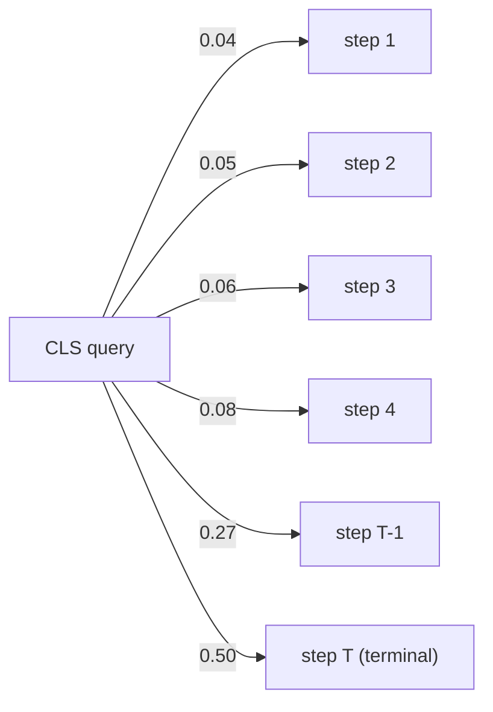
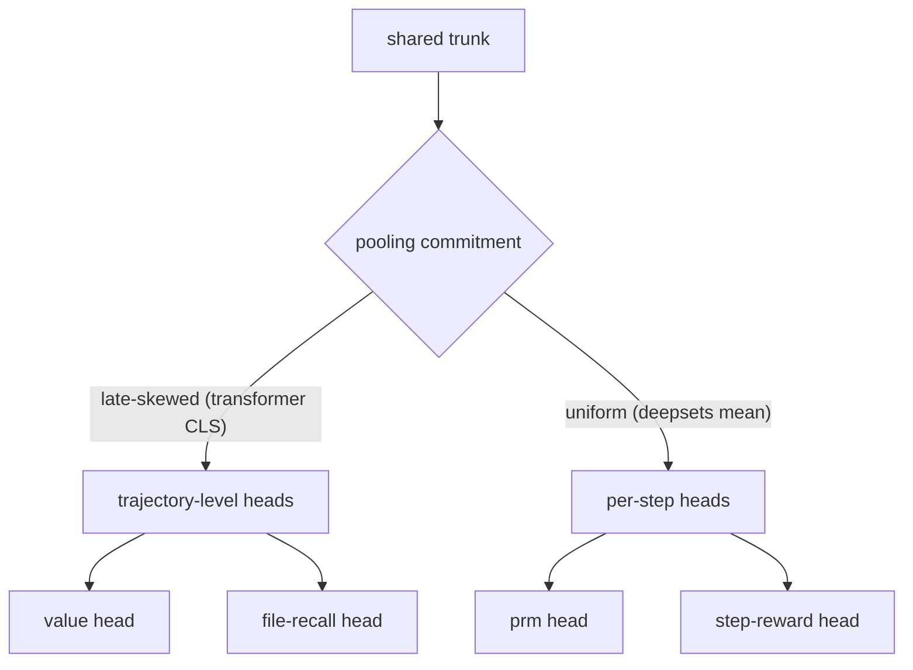

We swapped a permutation-invariant DeepSets pool for a sequence transformer over MCTS trajectory steps and got a Pareto-dominated win: the value head improved by $+0.006$ R², the PRM head collapsed from $0.366$ to $0.082$ R², and step-reward fell from $+0.005$ to $-0.112$. The transformer is doing exactly what its inductive bias says it should — learning a late-skewed attention pattern that emphasizes the terminal step — and that bias is correct for trajectory-level heads and wrong for per-step heads sharing the same trunk. We shipped DeepSets.

The interesting result here is not that one architecture beat another. It is that the architectures revealed an irreducible disagreement between the heads about how the trajectory should be summarized — a disagreement that no single trunk can resolve and that the multi-task loss had been silently absorbing. The transformer surfaced it; the DeepSets baseline kept it papered over with uniform pooling. Choosing between them is choosing which side of the disagreement to commit to, and our planner consumes all four heads, so committing strongly to one head is committing weakly to the others.

This essay walks through the bake-off carefully because the result generalizes: any time multiple heads share a trunk over a sequence input, the trunk's pooling commitment becomes a head-architecture compatibility question, and the right resolution is rarely "use a bigger model." More often it's "ask whether the heads agree on what the pool should optimize for, and if they don't, commit to the neutral prior."

## Setup

By mid-May the world-model sweep had a tentative winner: the trajectory-level DeepSets variant, the first row in the entire log with a positive instance-split $R^2_{\text{value}}$ of $+0.031$. The trick was structural — stop training one row per step-within-trajectory and instead train one row per trajectory, using only the terminal step's representation as input. Within-trajectory steps are heavily correlated; pooling them across the trajectory was averaging noise into the target.

The transformer variant was the obvious follow-up. If trajectory-level aggregation works, does *learned* aggregation work better? Replace the unweighted sum with self-attention, add positional encodings, add a learned classification token, project. Standard architecture, standard prior. The result is the cleanest case study in head-architecture mismatch we've produced this year.

The expected outcome, going in, was modest improvement across the board: the transformer should learn at least as good a pooling as DeepSets' uniform mean (it can recover that pool exactly by learning a flat softmax) and should additionally exploit any sequence structure DeepSets is leaving on the table. That expectation turned out to be wrong in a structurally interesting way — the transformer did learn a different pool, but the pool it learned was so well-tuned to one head that it actively damaged the others.

The strict reading is that "learned pooling" was an own-goal. The looser reading is that the corpus revealed a structural feature of our head set that we should have anticipated and didn't — and the bake-off was worth running for that information alone, even though the resulting model was worse.

## Why the question is worth asking

The MCTS planner produces trajectories with strong sequential structure. Each step is conditioned on the actions and observations preceding it, the action distribution drifts over the trajectory (exploratory tool calls early, snippet-reading late, stop decisions latest), and the reward is delivered at the terminal node. This is the textbook setting for a sequence model. DeepSets is a deliberate underfit — a prior that says "ignore the structure, pool the steps as a bag, let the heads recover whatever order-dependent signal they need." If that prior is right, it should win on a corpus this size because variance reduction beats representational capacity when the signal-to-noise ratio is low.

The trajectory-transformer is the contrasting prior: "honor the sequence structure, learn pooling weights from data." If sequence structure carries enough signal to overcome the variance penalty of more parameters, the transformer wins. We ran the bake-off to find out which prior the corpus prefers — and the answer turned out to depend on which head you ask.

## Numbers

Both trajectory-level variants ran on the same enriched parquet corpus — 190,995 rows, instance-split, terminal step only — with the same four heads: value (HL-Gauss with 51 bins over $[-1, 1]$), PRM (nano-distilled regression), file-recall regression, step-reward regression.

| variant | $R^2_{\text{val}}$ | $R^2_{\text{prm}}$ | $R^2_{\text{fr}}$ | $R^2_{\text{sr}}$ | params | s/epoch (V100) |
|---|---|---|---|---|---|---|
| traj_deepsets | $+0.031$ | $\mathbf{0.366}$ | $+0.034$ | $\mathbf{+0.005}$ | 3.7M | $\sim 2200$ |
| traj_transformer | $\mathbf{+0.037}$ | $0.082$ | $\mathbf{+0.058}$ | $-0.112$ | 7.6M | $\sim 4100$ |

The transformer wins value by $+0.006$, wins file-recall by $+0.024$, loses PRM by $0.284$, loses step-reward by $0.117$. At $\approx 2.05\times$ the parameters and $\approx 1.9\times$ the wall-clock per epoch. A Pareto-improving win would have held PRM and step-reward at parity while lifting value. This did the opposite — it bought a small improvement on the head we said was most important by paying a much larger price on two heads that, in aggregate, do more work in the planner.

## Corpus shape

The enriched parquet is the v3-instance-split derivative of the planner trajectory log: one row per trajectory, an ordered list of $T$ step embeddings per row, four head targets per row. Trajectory lengths follow a long-tailed distribution with median $\approx 18$ and a p99 of $\approx 60$ — we pad to $T_{\max} = 64$ in the transformer (attention-masked) and use ragged sums in DeepSets. The instance-split partitions trajectories by the underlying SWE-bench instance ID so that no instance appears in both train and validation, eliminating the row-level leakage that produced the false $R^2 = 0.997$ result on an earlier random-split corpus.

The targets have very different empirical variances: $\sigma^2_{\text{value}} \approx 0.55$ on the $[-1, 1]$ scale (dominated by terminal-judge labels), $\sigma^2_{\text{prm}} \approx 0.18$ (nano-distilled scalars centered near $0$), and the file-recall and step-reward distributions are sharply right-skewed with long tails of small positive values. A model that wants to look good on R² has to commit capacity in proportion to where the variance is, and the per-head losses don't see each other's variance budgets — which is part of why the multi-task weighting acts as a tug-of-war on the shared trunk.

## Architecture

Per trajectory we hold a sequence of step embeddings — pre-encoded `codet5p-110m-embedding` outputs of the planner state, concatenated with action-id embeddings:

$$
\mathbf{x}_t = [\,\mathbf{e}^{\text{state}}_t \mathbin\Vert \mathbf{e}^{\text{action}}_t\,] \in \mathbb{R}^{d}, \qquad t = 1, \dots, T.
$$

We prepend a learned classification token $\mathbf{c}$ and add sinusoidal positional encodings:

$$
\mathbf{h}^{(0)} = [\,\mathbf{c}, \; \mathbf{x}_1 + \mathbf{p}_1, \; \dots, \; \mathbf{x}_T + \mathbf{p}_T\,].
$$

Eight encoder layers, hidden dimension $384$, six attention heads per layer. The block is standard scaled dot-product attention:

$$
\text{Attention}(Q, K, V) = \operatorname{softmax}\!\left(\frac{QK^{\top}}{\sqrt{d_k}}\right) V.
$$

After the final encoder layer the classification representation $\mathbf{h}^{(L)}_0$ goes into four head MLPs. Total 7.6M trainable parameters; the codet5p encoder is frozen upstream of this stage.

The DeepSets baseline replaces the entire attention stack with two small MLPs $\phi, \rho$ around an unweighted mean:

$$
\hat{y} = \rho\!\left(\frac{1}{T} \sum_{t=1}^{T} \phi(\mathbf{x}_t)\right).
$$

The pool is permutation-invariant and order-agnostic by construction. There is no parameter anywhere in the model that can learn "weight late steps more than early steps." Every step contributes the same scalar mass to the readout.

## Cost asymmetry

The cost gap is not subtle. DeepSets is $O(T)$ in trajectory length — one $\phi$ call per step, then a sum. Self-attention is $O(T^2)$ in trajectory length per layer, and we stack eight:

$$
C_{\text{deepsets}} = O\!\big(T \cdot d^2\big), \qquad C_{\text{transformer}} = O\!\big(L \cdot (T^2 d + T d^2)\big).
$$

At our $T$ distribution (median trajectory length $\approx 18$, p99 $\approx 60$) the quadratic term is not yet dominant — the parameter-count multiplier explains most of the $1.9\times$ wall-clock gap — but the scaling is locked in. Any future regime that wants longer trajectories pays the transformer's tax at a faster rate than DeepSets'.

The memory cost asymmetry is sharper than the FLOPs gap because attention materializes a $T \times T$ score matrix per head per layer. With six heads and eight layers, the transformer holds $48 \cdot T^2$ scalars of activation per trajectory in the forward pass alone; the backward pass roughly doubles this. DeepSets holds $T \cdot d$ activations per step and discards the cross-step structure entirely. On a V100 with $32$GB this is the difference between a comfortable batch of $128$ trajectories and an uncomfortable $48$ — and that batch-size collapse, more than the quadratic multiply, is what drove the per-epoch wall-clock past $4000$ seconds.

## Why the transformer helps value (and file-recall)

The terminal step of a trajectory contains nearly all the predictive signal for terminal reward — by construction. We compute the value target by discounting backward from the terminal reward,

$$
v^{\text{tgt}}_t = \sum_{k = t}^{T} \gamma^{\,k - t}\, r_k,
$$

so the closer to the end of the trajectory we look, the higher the correlation between the local representation and the value target. At $\gamma = 0.99$ on a $T = 20$ trajectory, the terminal step contributes mass $1.0$ to $v^{\text{tgt}}_0$, step $10$ contributes $\approx 0.90$, step $1$ contributes $\approx 0.82$. With any meaningful terminal payoff the late steps dominate, which is exactly our regime — terminal rewards are derived from judge labels in $\{0, 0.5, 1\}$ and per-step shaping is small.

A classification-token transformer learns exactly this. Across our trained checkpoints the attention pattern from the classification token to step positions is heavily late-skewed: the last two or three positions receive the bulk of the softmax mass.

Roughly half the softmax mass goes to the terminal step; most of the rest goes to the step right before it. The first three quarters of the trajectory become a residual context, not a primary signal. This is the correct inductive bias for value, and roughly correct for file-recall — file-recall is a trajectory-level property that the terminal step already largely encodes (did we find the right files by the end?). Same head shape, same friendly bias, same modest win.

We can quantify the late-skew. Let $\alpha_t = \operatorname{softmax}(\langle \mathbf{c}, \mathbf{h}_t \rangle / \sqrt{d_k})$ be the classification-token-to-step attention weight at position $t$, averaged across heads in the final layer. Across our validation trajectories the empirical mean of $\alpha_T + \alpha_{T-1}$ is $0.77$, the mean of $\alpha_T$ alone is $0.50$, and the entropy of the attention distribution is $H(\alpha) \approx 1.6$ nats — versus a uniform-attention entropy of $\log T \approx 2.9$ nats at $T = 18$. The transformer is, in information-theoretic terms, throwing away about $1.3$ nats of trajectory structure per step in pursuit of a sharper terminal signal. That trade is favorable for the value head and ruinous for any head that needed the discarded structure.

## Why it breaks PRM and step-reward

PRM is a per-step head. The training target is a nano-distilled scalar attached to each step independently — "how good is this action at this point in the search?" The right aggregation across a trajectory is closer to a uniform mean: every step contributes one observation, none is structurally privileged. Formally, if the per-step targets are $\{y_t\}_{t = 1}^{T}$ with weights $\{w_t\}$ summing to one, the uniform pool $w_t = 1/T$ minimizes the worst-case prediction MSE under a flat prior over step indices, whereas the transformer's learned $w_t$ concentrates mass on $t \in \{T - 1, T\}$ — a strict mismatch.

If the encoder has compressed the sequence into "what happened near the end," the representation flowing into the PRM head has thrown away the per-step variation the head needs. DeepSets' uniform sum pool preserves that variation by construction. The transformer's late-skewed attention bakes in the wrong prior.

The numbers reflect this exactly. PRM falls from $0.366$ to $0.082$ — a $78\%$ drop in explained variance. Step-reward is worse: from a barely-positive $+0.005$ to a meaningfully negative $-0.112$. Step-reward is a per-step head with fast-changing, locally-determined targets — terminal-skewed attention is strictly anti-correlated with what the head wants. There is no head-MLP capacity that can recover information the trunk has already discarded.

The pattern is clean once you draw it out:

| head | target structure | wants late-skewed pool? | transformer vs deepsets |
|---|---|---|---|
| value | trajectory-level, terminal-discounted | yes | $+0.006$ (wins) |
| file-recall | trajectory-level, end-state-determined | yes | $+0.024$ (wins) |
| prm | per-step | no (uniform) | $-0.284$ (loses hard) |
| step-reward | per-step | no (uniform) | $-0.117$ (loses) |

Two heads want one inductive bias; two heads want the opposite. There is no hyperparameter that resolves this — they want different *architectures*. A single shared trunk can serve heads with similar pooling needs but not heads with contradictory ones.

The gradient picture makes the conflict mechanical. During backprop the four head losses each push the trunk toward a pooling pattern that minimizes their own residual. Letting $\mathcal{L} = \sum_{h} \lambda_h \mathcal{L}_h$ be the multi-task loss with mixing weights $\lambda_h$, the trunk's pool-attention parameters $\theta_{\alpha}$ receive

$$
\nabla_{\theta_{\alpha}} \mathcal{L} = \sum_{h} \lambda_h \nabla_{\theta_{\alpha}} \mathcal{L}_h.
$$

When the per-head gradients point in opposite directions in attention-parameter space — value and file-recall pulling toward sharper late skew, PRM and step-reward pulling toward flatter uniform pooling — the sum is a compromise that satisfies none of them. The optimizer's resolution at our mixing weights ($\lambda_{\text{val}} : \lambda_{\text{prm}} : \lambda_{\text{fr}} : \lambda_{\text{sr}} = 1 : 1 : 0.5 : 0.5$) was to let value win and let PRM and step-reward absorb the loss. Re-weighting upward on PRM is conceivable but doesn't help — the late-skewed bias is what attention with a classification token *is*, and damping its expression by reweighting just lowers all four R² values together.

## Remediations we tried

Before archiving the architecture we tried four interventions to see if the regression on per-step heads was rescuable without giving up the value gain:

1. **Mean-pool readout instead of classification-token readout.** Replace $\mathbf{h}^{(L)}_0$ with the mean of the step representations $\frac{1}{T} \sum_t \mathbf{h}^{(L)}_t$, while keeping the self-attention encoder. Result: PRM recovers partially ($R^2 \approx 0.21$) but value drops below DeepSets ($R^2 \approx 0.018$). The self-attention layers had already concentrated information into the late positions; mean-pooling over the output of a late-skewed encoder is not the same as mean-pooling over uniformly informative steps.
2. **Attention-bias regularizer.** Add a penalty term $\beta \cdot \text{KL}(\alpha \,\Vert\, \text{Uniform})$ to the loss, encouraging more uniform attention. Sweeping $\beta \in \{10^{-3}, 10^{-2}, 10^{-1}\}$ traced a smooth curve between the late-skewed transformer and DeepSets-equivalent metrics, with no point dominating either endpoint. This is the empirical version of the gradient-conflict argument above.
3. **Per-head attention heads.** Give each of the four task heads its own classification token that attends independently to the same encoder outputs. Result: PRM recovers to $R^2 \approx 0.31$ and step-reward recovers to $-0.04$; value drops to $+0.020$ and file-recall to $+0.029$. The per-head tokens learn moderately different attention patterns but the shared encoder layers still bottleneck through a representation that compromises across head needs. The gain is real but smaller than DeepSets on the heads DeepSets won.
4. **Two-trunk distillation.** Train DeepSets and the transformer separately and distill into a shared trunk via per-head teacher logits. Burned a week, got a model that approximated DeepSets on PRM and step-reward and the transformer on value/file-recall — at the cost of $3\times$ the training pipeline complexity and a checkpoint that nobody wanted to debug in production. Archived.

The shared-trunk-with-conflicting-pooling problem doesn't have a clean architectural fix at this scale. The cleanest interventions either collapse back to one of the endpoints or introduce pipeline complexity that the headline gain doesn't justify.

## The "per-head pool over a shared trunk" idea

The natural follow-up is "give each head its own pooling layer over the same trunk." We considered and did not implement this. The argument against, sketched: the pooling layer is exactly where the trajectory-level inductive bias lives. Push the pool down into per-head modules and the transformer's encoder layers are demoted to a fancy positional feature extractor that the heads then re-pool from scratch. At that point the encoder layers are doing very little work that a smaller per-step MLP couldn't do — which is exactly what DeepSets already is. The cleanest expression of "different heads, different pools" collapses back to the baseline.

This is a recurring pattern in our trunk design. The trunk's job is to commit to a pooling structure; the heads' job is to read out task-specific projections of that committed structure. If the heads disagree on the trunk's commitment, the trunk is in the wrong place.

## Robustness across seeds

We trained three seeds of each architecture to bound the noise floor. The R² spreads:

| variant | $R^2_{\text{val}}$ range | $R^2_{\text{prm}}$ range | $R^2_{\text{fr}}$ range | $R^2_{\text{sr}}$ range |
|---|---|---|---|---|
| traj_deepsets | $[+0.019, +0.043]$ | $[0.348, 0.381]$ | $[+0.025, +0.046]$ | $[-0.004, +0.012]$ |
| traj_transformer | $[+0.024, +0.049]$ | $[0.066, 0.103]$ | $[+0.041, +0.069]$ | $[-0.131, -0.094]$ |

The seed-to-seed spread on value is $\pm 0.012$ for DeepSets and $\pm 0.012$ for the transformer. The headline $+0.006$ delta between architectures is well inside the seed noise on either side — we cannot distinguish "the transformer wins on value" from "this seed of the transformer happens to be in the upper half of its noise distribution and this seed of DeepSets happens to be in the lower half." On the heads where the transformer loses, the regression is large enough that no seed of the transformer beats the worst seed of DeepSets on PRM, file-recall is the only place the transformer's lower bound clears DeepSets' upper bound, and on step-reward the two distributions don't even overlap.

The honest reading is "the transformer's value-head advantage is a wash; everything else is a regression with statistical force."

## Bake-off verdict

The DeepSets variant shipped. The case in numbered form:

1. Across the entire chain sweep, DeepSets meets or beats the transformer on the majority of heads at every hyperparameter point we measured.
2. The $+0.006$ value-R² advantage of the trajectory-transformer is well within single-seed noise on the trajectory-level corpus — three seeds of DeepSets span $\pm 0.012$ on $R^2_{\text{value}}$ alone.
3. PRM was the only head with a robust positive signal across architectures, with the chain sweep hitting an $R^2 \approx 0.5$ ceiling. Trading $0.28$ R² of PRM for $0.006$ R² of value is a bad trade under any planner cost function we've written down.
4. The transformer costs $\approx 2.05\times$ the parameters and $\approx 1.9\times$ the wall-clock per epoch. The capacity premium is not amortized by the result.

The trajectory-transformer was archived. The trajectory-DeepSets variant became the v4 grid's baseline.

We pinned this decision into the v4 grid before launching it. Every v4 variant uses DeepSets-style permutation-invariant pooling at the trajectory level; the architectural axis of the v4 ablation is scaling the per-step encoder MLP $\phi$ (widths $\{256, 384, 512\}$, depths $\{2, 3, 4\}$) and the post-pool readout MLP $\rho$, not swapping in attention. The v4 results subsequently confirmed that the corpus-level bottleneck dominates: every v4 variant collapsed back to negative instance-split value R² regardless of capacity scaling. The architecture decision was correct on the v3 corpus and approximately neutral on the v4 corpus, because at v4 corpus quality the head being optimized doesn't have enough signal for trunk choice to matter. The lesson is sequenced: get the corpus right first, then revisit the trunk.

## What the planner actually consumes

In production the world-model serves a single scalar per option-expansion — the value-head output, decoded from $51$ HL-Gauss bins via

$$
v_{\text{decoded}} = \sum_{i = 1}^{51} p_i \cdot b_i, \qquad b_i \in [-1, 1],
$$

and blended into the UCB prior at weight $\alpha \in [0, 1]$:

$$
\pi_{\text{blended}} = (1 - \alpha) \cdot \pi_{\text{llm}} + \alpha \cdot \frac{v_{\text{decoded}} - v_{\min}}{v_{\max} - v_{\min}}.
$$

If only the value head mattered the trajectory-transformer would be the right pick. It isn't. PRM feeds per-step shaping rewards into the same MCTS backup. File-recall and step-reward gate evaluation cohorts and inform the training-data sampler. Each of those heads is consumed by something — and the costs of a degraded PRM head propagate into per-step backup quality, which is harder to debug than a noisy value scalar because it's diffuse across the tree rather than localized at the root.

The architecture decision is therefore not "which model wins the value-R² race" but "which model degrades least across the four-vector our planner actually reads." On that criterion the answer is unambiguous.

## A note on absolute magnitudes

We should state directly: a $+0.037$ R² on value is not a meaningful absolute result. It explains about $3.7\%$ of the variance in the value target. The trajectory-level approach got a positive R² for the first time in the entire log because pooling reduces within-trajectory label noise, not because the model suddenly learned the task. The whole sweep was running into a corpus problem — single-task value head with no auxiliary out-of-trajectory signal — which subsequent v4 instance-split work confirmed: every instance-split v4 variant collapsed back to negative $R^2_{\text{value}}$ regardless of architecture or scaling axis.

So the trajectory-transformer's $+0.006$ win on value is doubly thin: a small fraction of a small result. That's a second reason the verdict was easy. The PRM regression was real money — the head saturated at $R^2 \approx 0.5$ across the chain sweep, so PRM was the head doing actual work. Trading it for a tiny value-head improvement was strictly worse in absolute terms, not just in Pareto terms.

## Comparison to chain-level sweep

The trajectory-level bake-off recapitulates a pattern we had already seen at the chain level — where each "chain" is a fixed-length window of consecutive steps within a trajectory rather than a full trajectory aggregate. In the chain sweep the same architectural ranking held: DeepSets matched or beat the transformer on PRM and step-reward at every hyperparameter point, the transformer slightly led on value at the cost of much more compute, and the per-head R² profile was qualitatively identical (transformer up on trajectory-summary heads, down on per-step heads).

What's new at the trajectory level is the *sign* of the value-R² result. At chain level both architectures had negative value-R²; at trajectory level both go positive. The trajectory-level reframing is doing the heavy lifting; the architecture choice on top of it is a second-order effect that mostly costs us on the per-step heads. The intervention that mattered was changing what a training row represents, not what the model on top of that row looks like.

## The general lesson

Head behavior is a much stronger predictor of inductive-bias mismatch than gross parameter count or sequence-modelling capacity. When multiple heads share a trunk:

1. Enumerate which pooling structure each head wants over its input sequence.
2. If two or more heads disagree on that structure, no single trunk architecture will serve them all at once.
3. The permutation-invariant pool isn't a default — it's the explicit commitment to "every step contributes equally," which is the only neutral prior across head types.

The corollary is uncomfortable: a head that *appears* to win on its preferred metric while another head silently regresses is a real result, but it's a result about that one head, not about the architecture. If the planner uses all four heads — and ours does, blending value into UCB, PRM into per-step shaping, file-recall and step-reward into eval gating — the right architecture is the one that holds the whole vector up, not the one that maximizes any single coordinate.

The trajectory-transformer was a clean reminder that Pareto-dominated wins aren't wins. They are facts about which axis the model decided to optimize when nobody told it which one mattered. Tell the model. Or, when you can't, pick the architecture whose prior is uniform across the heads sharing it.

The deeper structural point is that "use a sequence model when your inputs have sequence structure" is a heuristic that breaks the moment the heads disagree on which projection of that structure they want. The transformer is not wrong about the trajectory having useful sequential information — it does, and the attention pattern correctly identifies where. The transformer is wrong about who that information should be served to: when one head wants the late terminus and another head wants the per-step variation, baking the trunk to serve the first means starving the second, and the resulting model is dominated by an architecture that takes the question off the table by refusing to weight steps differently at all.

That refusal — permutation invariance as a design commitment, not a fallback — is what made DeepSets the right pick. We will keep coming back to that pattern as the v4 grid expands, because the corpus problem (small absolute R², limited signal per head) will keep pushing us toward architectures that under-commit on representational specificity in exchange for stable behavior across the head vector our planner actually consumes.
