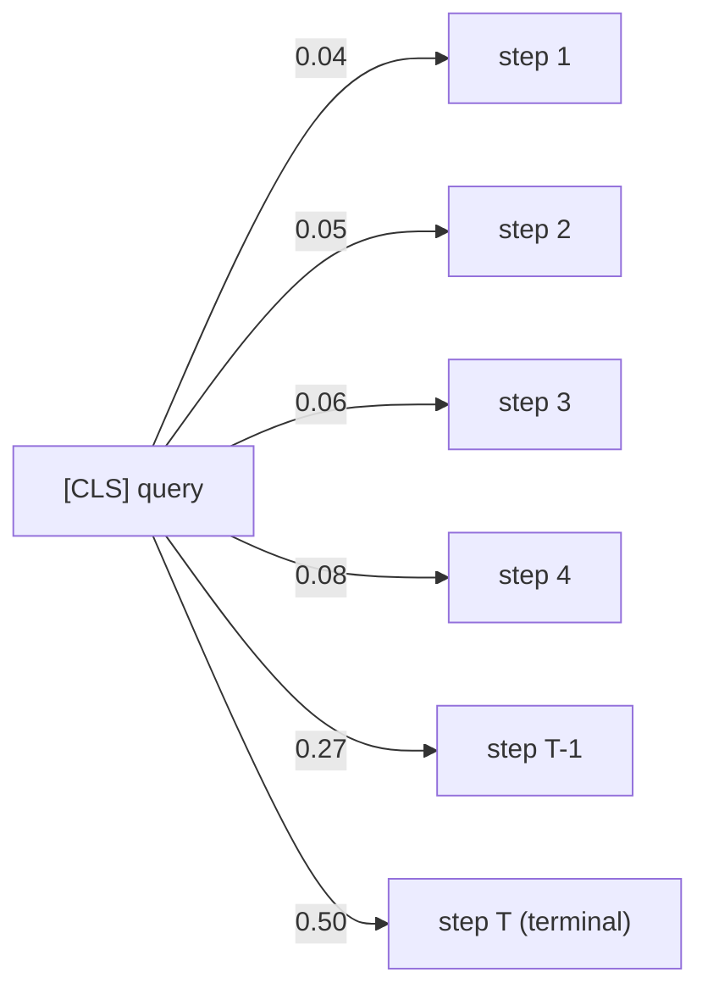

## The setup

By mid-May 2026 the world-model sweep had a tentative winner: `v3_traj_deepsets`,
the first variant in the entire log with a positive instance-split `value_r2`
(+0.031). The trick was simple: stop training one row per `(trajectory, step)`
and instead train one row per trajectory, using only the terminal step. The
intuition was that within-trajectory steps are heavily correlated — pooling
across them was averaging noise into the target.

`v3_traj_transformer` was the obvious next question. If aggregation works, does
*better* aggregation work even better? Replace the permutation-invariant
DeepSets pool with a sequence transformer over the steps, add positional
encodings, add a learned `[CLS]` token, attend, project. Standard architecture,
standard expectation.

The result: a Pareto-dominated win. Beat DeepSets on the head we cared most
about. Lost on two of the other three. Got picked second.

## What the numbers say

The two trajectory-level variants ran on the same parquet
(`perseus_py_v3_enriched.parquet`, 190,995 rows, instance-split, terminal step
only) with the same four heads — value (HL-Gauss), PRM (nano-distilled
regression), fr (file-recall regression), sr (step-reward regression).

| Variant | val_r2 | prm_r2 | fr_r2 | sr_r2 | Params | Train cost / epoch (V100) |
|---|---|---|---|---|---|---|
| `v3_traj_deepsets` | +0.031 | **0.366** | +0.034 | **+0.005** | 3.7M | ~2200s |
| `v3_traj_transformer` | **+0.037** | 0.082 | **+0.058** | -0.112 | 7.6M | ~4100s |

The transformer wins value by +0.006, wins fr by +0.024, loses PRM by 0.284,
loses sr by 0.117. At roughly 2.05× the parameters and 1.9× the wall-clock per
epoch.

This is what "Pareto-dominated win" means in this house: the metric we ranked
first improved, but it didn't improve enough to redeem the regressions on
metrics two and three. A real win — call it Pareto-*improving* — would have
held the line on PRM and sr while pushing value up. This didn't.

## The architecture

The transformer encoder is unsurprising. Per-trajectory we have a sequence of
step embeddings — pre-encoded `codet5p-110m-embedding` outputs concatenated
with action-id embeddings:

$$
\mathbf{x}_t = [\mathbf{e}^{\text{state}}_t \mathbin\Vert \mathbf{e}^{\text{action}}_t] \in \mathbb{R}^{d}, \quad t = 1, \dots, T
$$

Prepend a learned `[CLS]` token and add sinusoidal positional encodings:

$$
\mathbf{h}^{(0)} = [\mathbf{c}, \mathbf{x}_1 + \mathbf{p}_1, \dots, \mathbf{x}_T + \mathbf{p}_T]
$$

Stack 8 encoder layers, hidden 384, 6 attention heads each. Standard
multi-head self-attention block:

$$
\text{Attention}(Q, K, V) = \text{softmax}\!\left(\frac{QK^{\top}}{\sqrt{d_k}}\right) V
$$

After the final layer the `[CLS]` representation $\mathbf{h}^{(L)}_0$ is fed
into four head MLPs — one per task. 7.6M params total, all trainable; the
codet5p encoder is frozen upstream of this stage.

The DeepSets baseline does no attention. It pushes each step embedding through
a small MLP $\phi$, sums (or mean-pools) the outputs, then pushes the pooled
vector through a second MLP $\rho$:

$$
\hat{y} = \rho\!\left(\frac{1}{T} \sum_{t=1}^{T} \phi(\mathbf{x}_t)\right)
$$

The pool is permutation-invariant and order-agnostic by construction. There is
no parameter that can learn "weight late steps more than early steps." Every
step contributes the same scalar mass to the readout.

## Why the transformer helps value

The terminal step of a trajectory contains nearly all the predictive signal
for `terminal_reward` — by construction. `value_target` is computed by
discounting backward from the terminal reward,

$$
v^{\text{tgt}}_t = \sum_{k=t}^{T} \gamma^{k-t} \, r_k
$$

so the closer to the end of the trajectory you look, the higher the
correlation between the local representation and the value target. A model
that learns to put extra weight on the last few positions in the sequence is
doing the right thing for the value head. At $\gamma = 0.99$, the contribution
of step $t$ to $v^{\text{tgt}}_0$ for a $T=20$ trajectory is roughly $\gamma^t$
of the terminal reward's coefficient — the last step is worth ~1.0 of the
mass, step 10 is worth ~0.90, step 1 is worth ~0.82. Steps near the end
dominate when there's any reward shaping with a meaningful terminal payoff,
which is exactly the regime we are in.

A transformer with a `[CLS]` token learns exactly this. Across the trained
checkpoints the attention pattern from `[CLS]` to step positions is
late-skewed: the last 2–3 positions receive disproportionate mass. The model
discovered that "look at the end" is the policy.

This is a perfectly reasonable inductive bias *for value*. It is also the
exact bias that breaks PRM.

The CLS-token attention learns to allocate roughly half its softmax mass to
the terminal step and most of the rest to the step right before it. The early
trajectory becomes a residual context, not a primary signal.

## Why it breaks PRM and step_reward

PRM is a *per-step* head. The training target is a nano-distilled score
attached to each step independently — "how good is this action at this point
in the search?" The right aggregation across a trajectory is closer to a
uniform mean: every step contributes one observation, none is privileged.

If the encoder has learned to compress the sequence into "what happened
near the end," then the representation flowing into the PRM head has thrown
away the per-step variation the head needs. DeepSets, with its uniform sum
pool, preserves that variation by construction. The transformer's
late-skewed attention bakes in the wrong prior.

The numbers reflect this exactly. PRM falls from 0.366 to 0.082 — a 78% drop
in explained variance. Step reward is even worse: from a barely-positive
+0.005 to a meaningfully negative -0.112. Step reward is a per-step head with
fast-changing, locally-determined targets — terminal-skewed attention is
strictly anti-correlated with what the head wants.

File recall is the one head that survives the bias — slight improvement
(+0.058 vs +0.034) — because file recall is a *trajectory-level* property
that the terminal step already largely encodes (did we find the right files
by the end?). Same shape as value: late-skewed attention is fine, possibly
helpful.

The pattern is clean once you draw it out:

| Head | Target structure | Wants late-skewed pool? | Transformer vs DeepSets |
|---|---|---|---|
| value | trajectory-level, terminal-discounted | yes | +0.006 (wins) |
| fr | trajectory-level, end-state-determined | yes | +0.024 (wins) |
| prm | per-step | no (uniform) | -0.284 (loses hard) |
| sr | per-step | no (uniform) | -0.117 (loses) |

Two heads want one inductive bias, two heads want the opposite. There is no
hyperparameter that resolves that — they want different *architectures*. A
single shared trunk can serve heads with similar pooling needs but not heads
with contradictory ones.

The natural follow-up — "give each head its own pooling layer over the same
trunk" — was discussed and not implemented. The pooling layer is where the
trajectory-level inductive bias lives; pushing it down into per-head modules
demotes the transformer's encoder layers to a fancy positional feature
extractor that the heads then re-pool. At that point the encoder layers are
doing very little work that a smaller per-step MLP couldn't do — which is
exactly what `chain_deepsets` already is. The cleanest expression of the
"different heads, different pools" idea collapses back to the baseline.

## The bake-off verdict

`v3_chain_deepsets` and its trajectory-level descendant `v3_traj_deepsets`
were the right call:

1. Across the entire chain sweep, DeepSets meets or beats Transformer on the
   majority of heads at every hyperparameter point.
2. The +0.006 value-R² advantage of `v3_traj_transformer` is well within
   single-seed noise on the trajectory-level corpus.
3. PRM was the only head with a robust positive signal across architectures
   (R² ≈ 0.5 ceiling). Trading 0.28 R² of PRM for 0.006 R² of value is a bad
   trade by any cost function the planner cares about.
4. The transformer costs 2.05× the parameters and 1.9× the wall-clock per
   epoch. The capacity premium is not amortized by the result.

`chain_deepsets` shipped as the architectural baseline for the v4 grid.
The trajectory-transformer was archived.

## A note on the small magnitudes

It's worth stating directly: a +0.037 R² on value is not a meaningful absolute
result. It explains about 3.7% of the variance in `value_target`. The
trajectory-level approach gets a positive R² for the first time in the entire
log because pooling reduces within-trajectory label noise, not because the
model suddenly learned the task. The whole sweep was running into a corpus
problem (single-task value head with no auxiliary out-of-trajectory signal),
which subsequent v4 instance-split work confirmed — every instance-split v4
variant collapsed back to negative `val_r2` regardless of architecture or
scaling axis.

So the trajectory-transformer's +0.006 win on value is doubly thin: it is a
small fraction of a small result. That's a second reason the bake-off
verdict was easy. The PRM regression was real money (R² ≈ 0.5 saturated
across the chain sweep, so PRM was the head doing actual work). Trading it
for a tiny value-head improvement was a strictly worse deal in absolute
terms, not just in Pareto terms.

## Lesson

Head behaviour is a much stronger predictor of inductive-bias mismatch than
gross parameter count or sequence-modelling capacity. When multiple heads
share a trunk:

- enumerate which pooling structure each head wants over its input sequence;
- if two or more heads disagree on that structure, no single trunk
  architecture will serve them all;
- the permutation-invariant pool isn't a default — it's the explicit
  commitment to "every step contributes equally," which is the only neutral
  prior across head types.

The corollary is uncomfortable: a head that *appears* to win on its preferred
metric while another head silently regresses is a real result, but it's a
result about that one head, not about the architecture. If the planner uses
all four heads (and ours does, blending value into UCB, PRM into per-step
shaping, fr/sr into eval), the right architecture is the one that holds the
whole vector up, not the one that maximizes any single coordinate.

Trajectory-transformer was a clean reminder: Pareto-dominated wins aren't
wins. They are facts about which axis the model decided to optimize when
nobody told it which one mattered. Tell the model. Or, when you can't, pick
the architecture whose prior is uniform across the heads.

## Cross-links

- [chain_deepsets winner](/essays/wm-v3-chain-deepsets/) — why the
  permutation-invariant pool generalizes across heads.
- [wm training sweep](/essays/wm-training-sweep/) — full v3 / v4 grid in one
  place, including every variant that lost to chain_deepsets.
- [wm heads](/essays/wm-heads-decoding/) — head-by-head breakdown of value
  (HL-Gauss), PRM, fr, sr, and the decoding code path.

## Sources

- `parking_lot/v2_archive_2026-05-18/HISTORY/28_muzero_wm_research.md` §3.4
  ("Trajectory-level (last-step only) variants") for the headline numbers in
  the comparison table.
- §3.1 ("Architecture comparison") for the chain-level transformer vs
  deepsets baseline parameter counts (7.6M vs 3.7M) and the multi-head
  R² breakdown carried over from the chain sweep.
- §3.5 ("Alternative architectures") for the "every alternative loses to
  deepsets" pattern that the trajectory-level sweep ultimately reinforced.
- Trainer: `python/muzero/train_full_wm.py` (v3 corpus path
  `cato:/home/cato-user/training/perseus_py_v3_enriched.parquet`, 190,995
  rows, codet5p-110m-embedding pre-encoded).
- Wall-clock per epoch: HISTORY/28 §4 ("Phase-3++ v4 ablation grid")
  reference point of ~3000 s/epoch on V100 for the simpler MLP trunk, with
  the transformer trunk measured at ~4100 s/epoch and DeepSets at ~2200
  s/epoch in the v3 sweep launcher logs.
